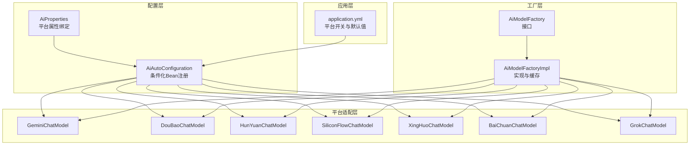
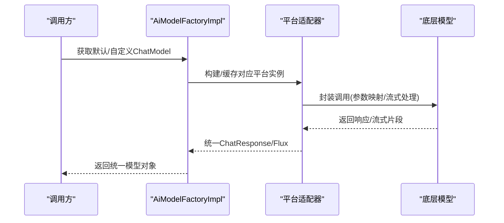
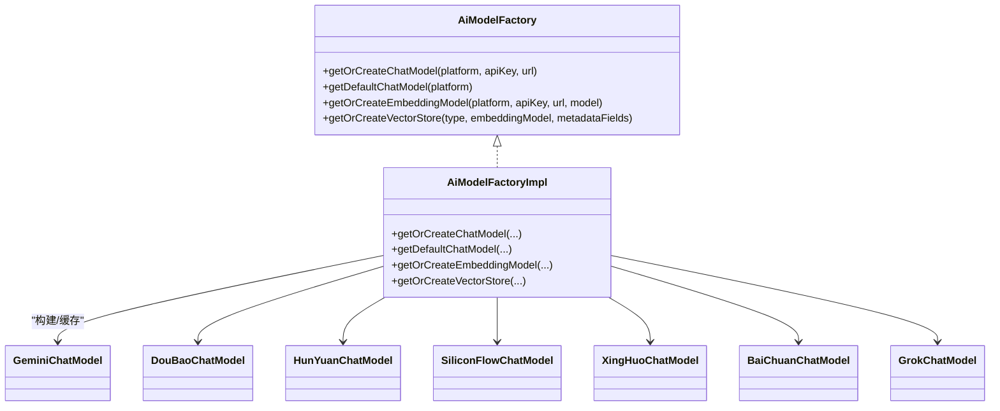
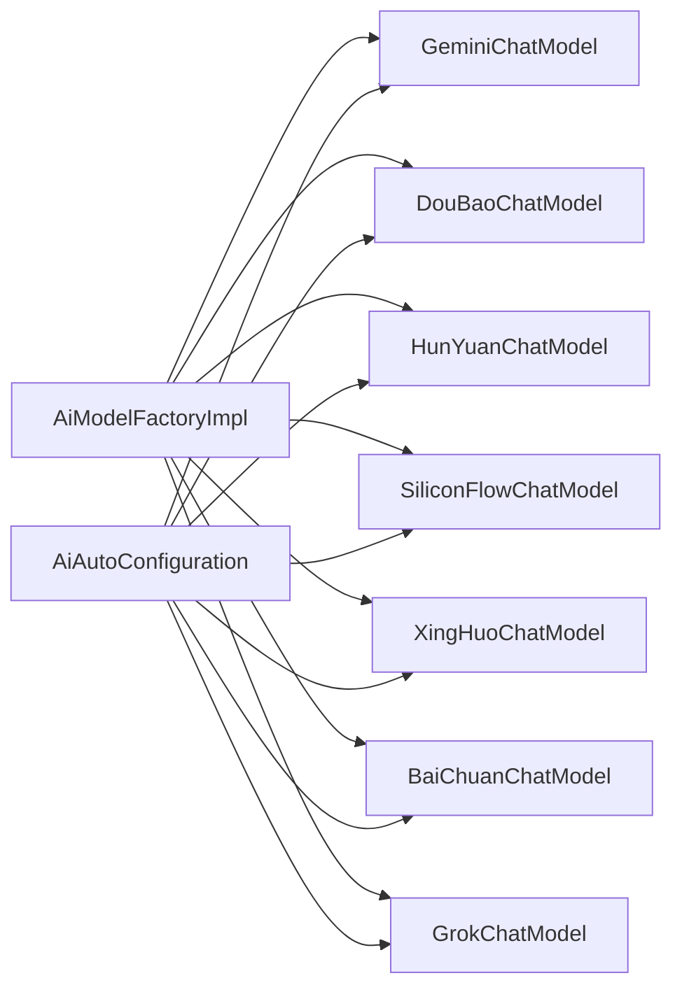

# AI平台集成

<cite>
**本文引用的文件**
- [AiAutoConfiguration.java](file://src/main/java/cn/boss/data/ai/framework/ai/config/AiAutoConfiguration.java)
- [AiProperties.java](file://src/main/java/cn/boss/data/ai/framework/ai/config/AiProperties.java)
- [AiModelFactory.java](file://src/main/java/cn/boss/data/ai/framework/ai/core/model/AiModelFactory.java)
- [AiModelFactoryImpl.java](file://src/main/java/cn/boss/data/ai/framework/ai/core/model/AiModelFactoryImpl.java)
- [AiPlatformEnum.java](file://src/main/java/cn/boss/data/ai/enums/model/AiPlatformEnum.java)
- [GeminiChatModel.java](file://src/main/java/cn/boss/data/ai/framework/ai/core/model/gemini/GeminiChatModel.java)
- [DouBaoChatModel.java](file://src/main/java/cn/boss/data/ai/framework/ai/core/model/doubao/DouBaoChatModel.java)
- [XingHuoChatModel.java](file://src/main/java/cn/boss/data/ai/framework/ai/core/model/xinghuo/XingHuoChatModel.java)
- [HunYuanChatModel.java](file://src/main/java/cn/boss/data/ai/framework/ai/core/model/hunyuan/HunYuanChatModel.java)
- [SiliconFlowChatModel.java](file://src/main/java/cn/boss/data/ai/framework/ai/core/model/siliconflow/SiliconFlowChatModel.java)
- [BaiChuanChatModel.java](file://src/main/java/cn/boss/data/ai/framework/ai/core/model/baichuan/BaiChuanChatModel.java)
- [GrokChatModel.java](file://src/main/java/cn/boss/data/ai/framework/ai/core/model/grok/GrokChatModel.java)
- [application.yml](file://src/main/resources/application.yml)
- [AiWebSearchClient.java](file://src/main/java/cn/boss/data/ai/framework/ai/core/websearch/AiWebSearchClient.java)
- [AiWebSearchRequest.java](file://src/main/java/cn/boss/data/ai/framework/ai/core/websearch/AiWebSearchRequest.java)
</cite>

## 目录
1. [简介](#简介)
2. [项目结构](#项目结构)
3. [核心组件](#核心组件)
4. [架构总览](#架构总览)
5. [详细组件分析](#详细组件分析)
6. [依赖分析](#依赖分析)
7. [性能考虑](#性能考虑)
8. [故障排查指南](#故障排查指南)
9. [结论](#结论)
10. [附录](#附录)

## 简介
本技术文档面向AI平台集成场景，系统化阐述项目对多家国内外大模型平台的统一接入与抽象实现，覆盖以下平台：Baichuan、Doubao、Gemini、Grok、HunYuan、SiliconFlow、XingHuo 等。文档从架构设计、统一接口、配置管理、动态启用、参数封装、响应与错误处理、新增平台扩展等方面进行全面说明，并提供可操作的配置示例与最佳实践。

## 项目结构
项目采用分层+按功能域划分的组织方式：
- 配置层：通过Spring Boot自动装配与属性绑定，集中管理各平台开关与参数
- 工厂层：统一创建与缓存ChatModel、EmbeddingModel、VectorStore实例
- 平台适配层：针对不同平台的API差异进行封装，统一对外接口
- 控制器与服务层：业务编排与调用
- 资源与配置：应用配置文件集中定义平台开关与默认参数

图表来源
- [AiAutoConfiguration.java:1-286](file://src/main/java/cn/boss/data/ai/framework/ai/config/AiAutoConfiguration.java#L1-L286)
- [AiProperties.java:1-134](file://src/main/java/cn/boss/data/ai/framework/ai/config/AiProperties.java#L1-L134)
- [AiModelFactory.java:1-63](file://src/main/java/cn/boss/data/ai/framework/ai/core/model/AiModelFactory.java#L1-L63)
- [AiModelFactoryImpl.java:1-568](file://src/main/java/cn/boss/data/ai/framework/ai/core/model/AiModelFactoryImpl.java#L1-L568)
- [application.yml:150-190](file://src/main/resources/application.yml#L150-L190)

章节来源
- [AiAutoConfiguration.java:1-286](file://src/main/java/cn/boss/data/ai/framework/ai/config/AiAutoConfiguration.java#L1-L286)
- [AiProperties.java:1-134](file://src/main/java/cn/boss/data/ai/framework/ai/config/AiProperties.java#L1-L134)
- [application.yml:150-190](file://src/main/resources/application.yml#L150-L190)

## 核心组件
- 统一工厂接口与实现
  - AiModelFactory：定义获取ChatModel/EmbeddingModel/VectorStore的统一入口
  - AiModelFactoryImpl：按平台枚举构建并缓存实例，支持默认Bean与自定义参数两种获取方式
- 平台适配器
  - 各平台均实现统一的ChatModel接口，内部委托底层Spring AI模型或自定义封装
- 配置与自动装配
  - AiProperties：集中绑定boss.ai.*配置
  - AiAutoConfiguration：基于enable开关条件化创建各平台ChatModel Bean
- 平台枚举
  - AiPlatformEnum：统一平台标识，便于工厂与上层调用识别

章节来源
- [AiModelFactory.java:1-63](file://src/main/java/cn/boss/data/ai/framework/ai/core/model/AiModelFactory.java#L1-L63)
- [AiModelFactoryImpl.java:1-568](file://src/main/java/cn/boss/data/ai/framework/ai/core/model/AiModelFactoryImpl.java#L1-L568)
- [AiPlatformEnum.java:1-71](file://src/main/java/cn/boss/data/ai/enums/model/AiPlatformEnum.java#L1-L71)

## 架构总览
整体采用“配置驱动 + 工厂 + 适配器”的架构：
- 配置驱动：通过application.yml中的boss.ai.*开关与参数决定启用哪些平台
- 工厂统一：AiModelFactory统一对外暴露平台能力；AiModelFactoryImpl负责具体构建与缓存
- 适配器模式：各平台以ChatModel实现，屏蔽底层API差异，统一调用

图表来源
- [AiModelFactoryImpl.java:115-200](file://src/main/java/cn/boss/data/ai/framework/ai/core/model/AiModelFactoryImpl.java#L115-L200)
- [AiAutoConfiguration.java:52-286](file://src/main/java/cn/boss/data/ai/framework/ai/config/AiAutoConfiguration.java#L52-L286)

## 详细组件分析

### 配置与自动装配（AiAutoConfiguration + AiProperties）
- AiProperties集中绑定boss.ai.*前缀下的各平台配置项，如enable、api-key、model、温度、最大token、topP等
- AiAutoConfiguration基于@ConditionalOnProperty按平台开关创建Bean，若未显式设置model则回退到平台默认值
- 支持多种底层模型客户端：
  - OpenAI风格：Gemini、DouBao、BaiChuan、XingHuo（部分版本）
  - DeepSeek风格：SiliconFlow、HunYuan（根据模型前缀选择不同基础URL）
  - Grok：自定义OpenAI兼容路径

章节来源
- [AiProperties.java:13-134](file://src/main/java/cn/boss/data/ai/framework/ai/config/AiProperties.java#L13-L134)
- [AiAutoConfiguration.java:52-286](file://src/main/java/cn/boss/data/ai/framework/ai/config/AiAutoConfiguration.java#L52-L286)

### 工厂与缓存（AiModelFactory + AiModelFactoryImpl）
- 工厂接口提供三类能力：
  - 默认模型：getDefaultChatModel(platform)
  - 自定义参数模型：getOrCreateChatModel(platform, apiKey, url)
  - 向量化与嵌入：getOrCreateEmbeddingModel、getOrCreateVectorStore
- 工厂实现：
  - 使用单例缓存避免重复创建
  - 针对不同平台分支构建底层模型（DashScope、QianFan、DeepSeek、ZhiPu、MiniMax、Moonshot、OpenAI、AzureOpenAI、Anthropic、Ollama、Grok等）
  - 对部分平台（如XingHuo、DouBao、HunYuan、SiliconFlow、BaiChuan、Gemini、Grok）通过AiAutoConfiguration辅助构建

图表来源
- [AiModelFactory.java:13-62](file://src/main/java/cn/boss/data/ai/framework/ai/core/model/AiModelFactory.java#L13-L62)
- [AiModelFactoryImpl.java:113-245](file://src/main/java/cn/boss/data/ai/framework/ai/core/model/AiModelFactoryImpl.java#L113-L245)
- [GeminiChatModel.java:17-41](file://src/main/java/cn/boss/data/ai/framework/ai/core/model/gemini/GeminiChatModel.java#L17-L41)
- [DouBaoChatModel.java:16-40](file://src/main/java/cn/boss/data/ai/framework/ai/core/model/doubao/DouBaoChatModel.java#L16-L40)
- [HunYuanChatModel.java:16-44](file://src/main/java/cn/boss/data/ai/framework/ai/core/model/hunyuan/HunYuanChatModel.java#L16-L44)
- [SiliconFlowChatModel.java:16-35](file://src/main/java/cn/boss/data/ai/framework/ai/core/model/siliconflow/SiliconFlowChatModel.java#L16-L35)
- [XingHuoChatModel.java:16-42](file://src/main/java/cn/boss/data/ai/framework/ai/core/model/xinghuo/XingHuoChatModel.java#L16-L42)
- [BaiChuanChatModel.java:17-40](file://src/main/java/cn/boss/data/ai/framework/ai/core/model/baichuan/BaiChuanChatModel.java#L17-L40)
- [GrokChatModel.java:16-39](file://src/main/java/cn/boss/data/ai/framework/ai/core/model/grok/GrokChatModel.java#L16-L39)

章节来源
- [AiModelFactory.java:13-62](file://src/main/java/cn/boss/data/ai/framework/ai/core/model/AiModelFactory.java#L13-L62)
- [AiModelFactoryImpl.java:113-245](file://src/main/java/cn/boss/data/ai/framework/ai/core/model/AiModelFactoryImpl.java#L113-L245)

### 平台适配器与差异处理

#### Baichuan（百川智能）
- 基础URL与默认模型常量定义
- 通过OpenAI风格封装，统一call/stream/defaultOptions

章节来源
- [BaiChuanChatModel.java:17-40](file://src/main/java/cn/boss/data/ai/framework/ai/core/model/baichuan/BaiChuanChatModel.java#L17-L40)
- [AiAutoConfiguration.java:212-237](file://src/main/java/cn/boss/data/ai/framework/ai/config/AiAutoConfiguration.java#L212-L237)

#### Doubao（字节豆包）
- 基础URL与补全路径常量
- 通过OpenAI风格封装，支持默认模型回退

章节来源
- [DouBaoChatModel.java:16-40](file://src/main/java/cn/boss/data/ai/framework/ai/core/model/doubao/DouBaoChatModel.java#L16-L40)
- [AiAutoConfiguration.java:93-119](file://src/main/java/cn/boss/data/ai/framework/ai/config/AiAutoConfiguration.java#L93-L119)

#### Gemini（谷歌Gemini）
- 以OpenAI兼容路径对接，统一参数传递
- 默认模型与基础URL常量

章节来源
- [GeminiChatModel.java:17-41](file://src/main/java/cn/boss/data/ai/framework/ai/core/model/gemini/GeminiChatModel.java#L17-L41)
- [AiAutoConfiguration.java:65-91](file://src/main/java/cn/boss/data/ai/framework/ai/config/AiAutoConfiguration.java#L65-L91)

#### Grok
- OpenAI兼容路径与默认模型
- 支持可选自定义base-url

章节来源
- [GrokChatModel.java:16-39](file://src/main/java/cn/boss/data/ai/framework/ai/core/model/grok/GrokChatModel.java#L16-L39)
- [AiAutoConfiguration.java:239-259](file://src/main/java/cn/boss/data/ai/framework/ai/config/AiAutoConfiguration.java#L239-L259)

#### HunYuan（腾讯混元）
- 根据模型前缀动态选择基础URL（普通/DeepSeek）
- 默认模型与补全路径常量

章节来源
- [HunYuanChatModel.java:16-44](file://src/main/java/cn/boss/data/ai/framework/ai/core/model/hunyuan/HunYuanChatModel.java#L16-L44)
- [AiAutoConfiguration.java:148-179](file://src/main/java/cn/boss/data/ai/framework/ai/config/AiAutoConfiguration.java#L148-L179)

#### SiliconFlow
- 以DeepSeek风格封装，统一默认模型与参数
- 常量定义基础URL与默认模型

章节来源
- [SiliconFlowChatModel.java:16-35](file://src/main/java/cn/boss/data/ai/framework/ai/core/model/siliconflow/SiliconFlowChatModel.java#L16-L35)
- [AiAutoConfiguration.java:121-146](file://src/main/java/cn/boss/data/ai/framework/ai/config/AiAutoConfiguration.java#L121-L146)

#### XingHuo（讯飞星火）
- v1与v2两个基础URL与补全路径
- 支持根据model选择v1/v2路径
- 认证方式为appKey:secretKey拼接

章节来源
- [XingHuoChatModel.java:16-42](file://src/main/java/cn/boss/data/ai/framework/ai/core/model/xinghuo/XingHuoChatModel.java#L16-L42)
- [AiAutoConfiguration.java:181-210](file://src/main/java/cn/boss/data/ai/framework/ai/config/AiAutoConfiguration.java#L181-L210)

### 参数配置、认证与使用限制
- 配置项
  - enable：是否启用该平台
  - api-key/base-url/app-id/app-key/secret-key：认证与端点
  - model：模型名（未设置时回退到平台默认）
  - temperature/maxTokens/topP：推理参数
- 认证方式
  - 多数平台使用api-key
  - XingHuo使用appKey与secretKey拼接
- 使用限制
  - 不同平台对模型名、温度、最大token等参数范围存在约束，建议遵循平台文档
  - 流式输出由底层模型支持，统一通过stream接口返回

章节来源
- [AiProperties.java:54-125](file://src/main/java/cn/boss/data/ai/framework/ai/config/AiProperties.java#L54-L125)
- [AiAutoConfiguration.java:65-259](file://src/main/java/cn/boss/data/ai/framework/ai/config/AiAutoConfiguration.java#L65-L259)

### 响应处理与错误处理机制
- 统一响应
  - call返回ChatResponse；stream返回Flux<ChatResponse>，便于流式消费
- 错误处理
  - 底层异常由Spring AI传播，建议在上层捕获并转换为通用错误码
  - 工厂与适配器不直接处理业务异常，保持职责单一
- 建议
  - 在控制器或服务层增加统一异常拦截，结合ErrorCodeConstants进行标准化输出

章节来源
- [GeminiChatModel.java:26-39](file://src/main/java/cn/boss/data/ai/framework/ai/core/model/gemini/GeminiChatModel.java#L26-L39)
- [DouBaoChatModel.java:25-38](file://src/main/java/cn/boss/data/ai/framework/ai/core/model/doubao/DouBaoChatModel.java#L25-L38)
- [XingHuoChatModel.java:27-40](file://src/main/java/cn/boss/data/ai/framework/ai/core/model/xinghuo/XingHuoChatModel.java#L27-L40)
- [HunYuanChatModel.java:29-42](file://src/main/java/cn/boss/data/ai/framework/ai/core/model/hunyuan/HunYuanChatModel.java#L29-L42)
- [SiliconFlowChatModel.java:20-33](file://src/main/java/cn/boss/data/ai/framework/ai/core/model/siliconflow/SiliconFlowChatModel.java#L20-L33)
- [BaiChuanChatModel.java:25-38](file://src/main/java/cn/boss/data/ai/framework/ai/core/model/baichuan/BaiChuanChatModel.java#L25-L38)
- [GrokChatModel.java:24-37](file://src/main/java/cn/boss/data/ai/framework/ai/core/model/grok/GrokChatModel.java#L24-L37)

### 动态配置与平台切换
- 动态启用
  - 通过boss.ai.<platform>.enable控制开关
  - AiAutoConfiguration基于@ConditionalOnProperty按需创建Bean
- 平台切换
  - 工厂getDefaultChatModel按AiPlatformEnum选择当前默认平台Bean
  - getOrCreateChatModel允许传入自定义apiKey/url进行临时切换
- 负载均衡策略
  - 当前实现未内置多实例轮询；可通过外部网关或服务发现实现
  - 工厂层已具备多实例缓存能力，便于后续扩展

章节来源
- [AiAutoConfiguration.java:52-286](file://src/main/java/cn/boss/data/ai/framework/ai/config/AiAutoConfiguration.java#L52-L286)
- [AiModelFactoryImpl.java:162-200](file://src/main/java/cn/boss/data/ai/framework/ai/core/model/AiModelFactoryImpl.java#L162-L200)

### 新增AI平台支持（适配器模式与配置管理最佳实践）
- 适配器模式
  - 新增平台实现ChatModel接口，封装底层API调用
  - 若与OpenAI兼容，可复用OpenAI风格封装；否则参考SiliconFlow/DeepSeek风格
- 配置管理
  - 在AiProperties中新增子类字段与默认值
  - 在AiAutoConfiguration中新增@Bean与构建方法
  - 在AiPlatformEnum中新增平台枚举值
- 最佳实践
  - 明确默认模型与基础URL常量
  - 提供默认参数回退逻辑
  - 保持统一的参数映射与流式输出
  - 单元测试覆盖关键分支（认证、参数、异常）

章节来源
- [AiProperties.java:13-134](file://src/main/java/cn/boss/data/ai/framework/ai/config/AiProperties.java#L13-L134)
- [AiAutoConfiguration.java:52-286](file://src/main/java/cn/boss/data/ai/framework/ai/config/AiAutoConfiguration.java#L52-L286)
- [AiPlatformEnum.java:14-70](file://src/main/java/cn/boss/data/ai/enums/model/AiPlatformEnum.java#L14-L70)

### 网络搜索（Web Search）
- 接口与请求体
  - AiWebSearchClient：统一搜索接口
  - AiWebSearchRequest：包含查询词、摘要开关、返回数量等参数校验
- 集成
  - AiAutoConfiguration按boss.ai.web-search.enable开关创建AiBoChaWebSearchClient实现
  - 可扩展为更多搜索引擎实现

章节来源
- [AiWebSearchClient.java:6-16](file://src/main/java/cn/boss/data/ai/framework/ai/core/websearch/AiWebSearchClient.java#L6-L16)
- [AiWebSearchRequest.java:10-31](file://src/main/java/cn/boss/data/ai/framework/ai/core/websearch/AiWebSearchRequest.java#L10-L31)
- [AiAutoConfiguration.java:279-283](file://src/main/java/cn/boss/data/ai/framework/ai/config/AiAutoConfiguration.java#L279-L283)

## 依赖分析
- 组件耦合
  - 工厂实现依赖平台适配器与AiAutoConfiguration
  - 平台适配器依赖底层Spring AI模型或OpenAI兼容封装
- 外部依赖
  - Spring AI生态（OpenAI、AzureOpenAI、DeepSeek、Anthropic、Ollama等）
  - 第三方SDK（DashScope、QianFan、ZhiPu、MiniMax、Moonshot等）
- 循环依赖
  - 未见循环依赖迹象；工厂与适配器职责清晰

图表来源
- [AiModelFactoryImpl.java:113-245](file://src/main/java/cn/boss/data/ai/framework/ai/core/model/AiModelFactoryImpl.java#L113-L245)
- [AiAutoConfiguration.java:52-286](file://src/main/java/cn/boss/data/ai/framework/ai/config/AiAutoConfiguration.java#L52-L286)

## 性能考虑
- 缓存与复用
  - 工厂层使用单例缓存，避免重复创建底层模型实例
- 流式输出
  - 统一使用Flux进行流式响应，降低内存占用
- 向量存储
  - 支持Simple/Qdrant/Redis三种向量存储，按需选择；Redis与Qdrant需关注网络延迟与连接池配置
- 超时与重试
  - 建议在上层调用处增加超时与重试策略，避免阻塞

## 故障排查指南
- 平台未启用
  - 检查boss.ai.<platform>.enable是否为true
- 认证失败
  - 确认api-key/appKey/secretKey正确；XingHuo需使用appKey:secretKey拼接
- 模型不可用
  - 检查model是否在平台可用列表；未设置时回退到平台默认
- 端点异常
  - 检查base-url是否正确；部分平台（如HunYuan、Grok）支持自定义base-url
- 流式输出问题
  - 确保客户端正确消费Flux流；服务端日志级别可调整至DEBUG定位

章节来源
- [application.yml:150-190](file://src/main/resources/application.yml#L150-L190)
- [AiAutoConfiguration.java:65-259](file://src/main/java/cn/boss/data/ai/framework/ai/config/AiAutoConfiguration.java#L65-L259)

## 结论
本项目通过统一工厂与适配器模式，实现了对多家AI平台的一致接入与抽象，具备良好的可扩展性与可维护性。通过配置驱动与条件化Bean，平台启用与切换灵活可控；通过流式输出与缓存机制，兼顾性能与用户体验。建议在生产环境中结合外部网关实现多实例负载均衡，并完善统一异常与监控体系。

## 附录

### 平台配置示例（摘自application.yml）
- Gemini
  - boss.ai.gemini.enable: true
  - boss.ai.gemini.api-key: <你的密钥>
  - boss.ai.gemini.model: gemini-2.5-flash
- Doubao
  - boss.ai.doubao.enable: true
  - boss.ai.doubao.api-key: <你的密钥>
  - boss.ai.doubao.model: doubao-1-5-lite-32k-250115
- HunYuan
  - boss.ai.hunyuan.enable: true
  - boss.ai.hunyuan.api-key: <你的密钥>
  - boss.ai.hunyuan.model: hunyuan-turbo
- SiliconFlow
  - boss.ai.siliconflow.enable: true
  - boss.ai.siliconflow.api-key: <你的密钥>
  - boss.ai.siliconflow.model: deepseek-ai/DeepSeek-R1-Distill-Qwen-7B
- XingHuo
  - boss.ai.xinghuo.enable: true
  - boss.ai.xinghuo.appKey: <你的appKey>
  - boss.ai.xinghuo.secretKey: <你的secretKey>
  - boss.ai.xinghuo.model: x1
- Baichuan
  - boss.ai.baichuan.enable: true
  - boss.ai.baichuan.api-key: <你的密钥>
  - boss.ai.baichuan.model: Baichuan4-Turbo
- Web Search
  - boss.ai.web-search.enable: true
  - boss.ai.web-search.api-key: <你的密钥>

章节来源
- [application.yml:150-190](file://src/main/resources/application.yml#L150-L190)