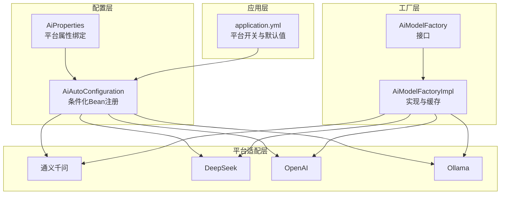
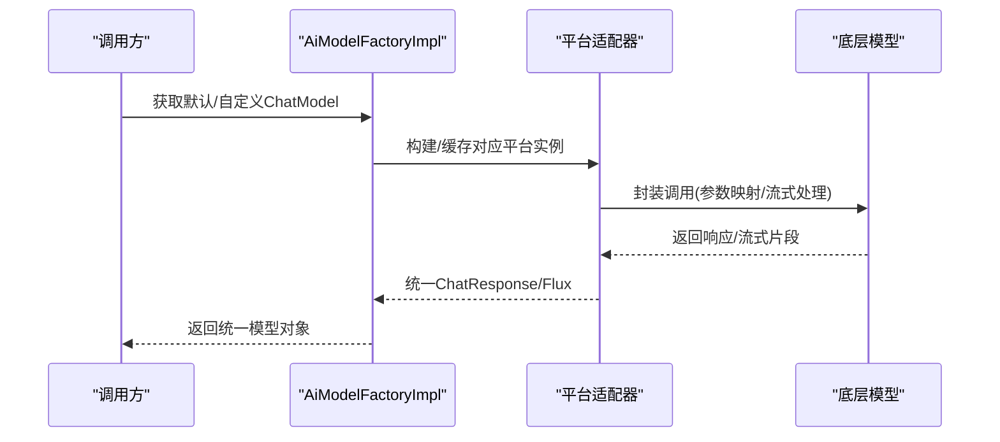
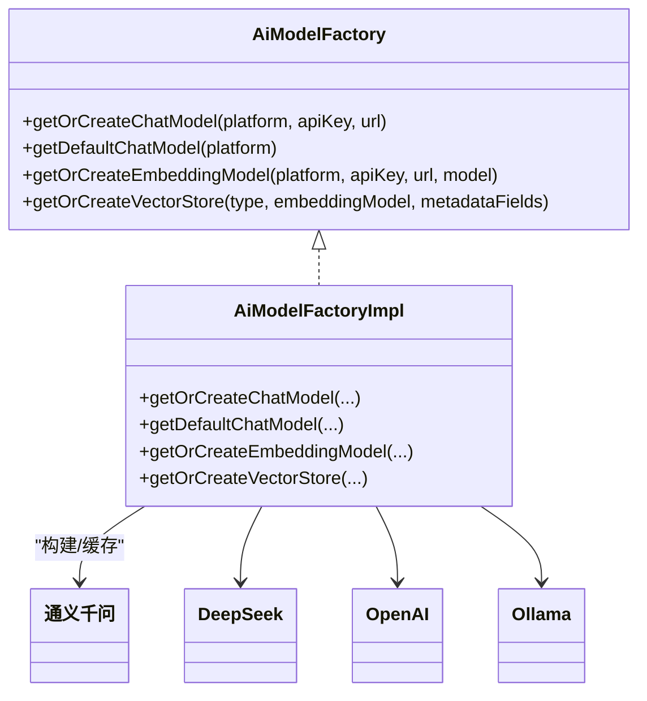
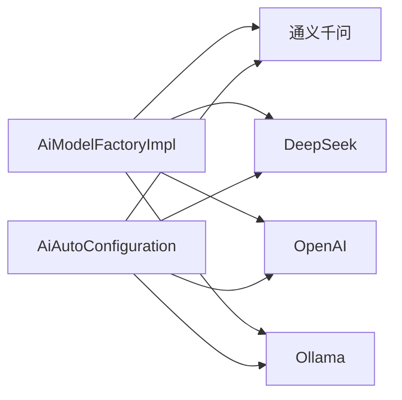

# AI平台集成

<cite>
**本文引用的文件**
- [AiAutoConfiguration.java](file://src/main/java/cn/boss/data/ai/framework/ai/config/AiAutoConfiguration.java)
- [AiProperties.java](file://src/main/java/cn/boss/data/ai/framework/ai/config/AiProperties.java)
- [AiModelFactory.java](file://src/main/java/cn/boss/data/ai/framework/ai/core/model/AiModelFactory.java)
- [AiModelFactoryImpl.java](file://src/main/java/cn/boss/data/ai/framework/ai/core/model/AiModelFactoryImpl.java)
- [AiPlatformEnum.java](file://src/main/java/cn/boss/data/ai/enums/model/AiPlatformEnum.java)
- [application.yml](file://src/main/resources/application.yml)
- [AiWebSearchClient.java](file://src/main/java/cn/boss/data/ai/framework/ai/core/websearch/AiWebSearchClient.java)
- [AiWebSearchRequest.java](file://src/main/java/cn/boss/data/ai/framework/ai/core/websearch/AiWebSearchRequest.java)
- [AiUtils.java](file://src/main/java/cn/boss/data/ai/util/AiUtils.java)
- [AiModelServiceImpl.java](file://src/main/java/cn/boss/data/ai/service/model/AiModelServiceImpl.java)
</cite>

## 目录
1. [简介](#简介)
2. [项目结构](#项目结构)
3. [核心组件](#核心组件)
4. [架构总览](#架构总览)
5. [详细组件分析](#详细组件分析)
6. [依赖分析](#依赖分析)
7. [性能考虑](#性能考虑)
8. [故障排查指南](#故障排查指南)
9. [结论](#结论)
10. [附录](#附录)

## 简介
本技术文档面向AI平台集成场景，系统化阐述项目对多家国内外大模型平台的统一接入与抽象实现，覆盖以下平台：通义、DeepSeek、OpenAI、Ollama 等。文档从架构设计、统一接口、配置管理、动态启用、参数封装、响应与错误处理、新增平台扩展等方面进行全面说明，并提供可操作的配置示例与最佳实践。

## 项目结构
项目采用分层+按功能域划分的组织方式：
- 配置层：通过Spring Boot自动装配与属性绑定，集中管理各平台开关与参数
- 工厂层：统一创建与缓存ChatModel、EmbeddingModel、VectorStore实例
- 平台适配层：针对不同平台的API差异进行封装，统一对外接口
- 控制器与服务层：业务编排与调用
- 资源与配置：应用配置文件集中定义平台开关与默认参数

```mermaid
graph TB
subgraph "配置层"
AP["AiProperties<br/>平台属性绑定"]
AC["AiAutoConfiguration<br/>条件化Bean注册"]
end
subgraph "工厂层"
AF["AiModelFactory<br/>接口"]
AFImpl["AiModelFactoryImpl<br/>实现与缓存"]
end
subgraph "平台适配层"
TY["通义千问"]
DS["DeepSeek"]
OA["OpenAI"]
OL["Ollama"]
end
subgraph "应用层"
APP["application.yml<br/>平台开关与默认值"]
end
AP --> AC
AC --> TY
AC --> DS
AC --> OA
AC --> OL
AF --> AFImpl
AFImpl --> TY
AFImpl --> DS
AFImpl --> OA
AFImpl --> OL
APP --> AC
```

**图表来源**
- [AiAutoConfiguration.java:1-286](file://src/main/java/cn/boss/data/ai/framework/ai/config/AiAutoConfiguration.java#L1-L286)
- [AiProperties.java:1-134](file://src/main/java/cn/boss/data/ai/framework/ai/config/AiProperties.java#L1-L134)
- [AiModelFactory.java:1-63](file://src/main/java/cn/boss/data/ai/framework/ai/core/model/AiModelFactory.java#L1-L63)
- [AiModelFactoryImpl.java:1-568](file://src/main/java/cn/boss/data/ai/framework/ai/core/model/AiModelFactoryImpl.java#L1-L568)
- [application.yml:150-190](file://src/main/resources/application.yml#L150-L190)

**章节来源**
- [AiAutoConfiguration.java:1-286](file://src/main/java/cn/boss/data/ai/framework/ai/config/AiAutoConfiguration.java#L1-L286)
- [AiProperties.java:1-134](file://src/main/java/cn/boss/data/ai/framework/ai/config/AiProperties.java#L1-L134)
- [application.yml:150-190](file://src/main/resources/application.yml#L150-L190)

## 核心组件
- 统一工厂接口与实现
  - AiModelFactory：定义获取ChatModel/EmbeddingModel/VectorStore的统一入口
  - AiModelFactoryImpl：按平台枚举构建并缓存实例，支持默认Bean与自定义参数两种获取方式
- 平台适配器
  - 各平台均实现统一的ChatModel接口，内部委托底层Spring AI模型或自定义封装
- 配置与自动装配
  - AiProperties：集中绑定boss.ai.*配置
  - AiAutoConfiguration：基于enable开关条件化创建各平台ChatModel Bean
- 平台枚举
  - AiPlatformEnum：统一平台标识，便于工厂与上层调用识别

**章节来源**
- [AiModelFactory.java:1-63](file://src/main/java/cn/boss/data/ai/framework/ai/core/model/AiModelFactory.java#L1-L63)
- [AiModelFactoryImpl.java:1-568](file://src/main/java/cn/boss/data/ai/framework/ai/core/model/AiModelFactoryImpl.java#L1-L568)
- [AiPlatformEnum.java:1-71](file://src/main/java/cn/boss/data/ai/enums/model/AiPlatformEnum.java#L1-L71)

## 架构总览
整体采用"配置驱动 + 工厂 + 适配器"的架构：
- 配置驱动：通过application.yml中的boss.ai.*开关与参数决定启用哪些平台
- 工厂统一：AiModelFactory统一对外暴露平台能力；AiModelFactoryImpl负责具体构建与缓存
- 适配器模式：各平台以ChatModel实现，屏蔽底层API差异，统一调用

```mermaid
sequenceDiagram
participant C as "调用方"
participant F as "AiModelFactoryImpl"
participant P as "平台适配器"
participant S as "底层模型"
C->>F : 获取默认/自定义ChatModel
F->>P : 构建/缓存对应平台实例
P->>S : 封装调用(参数映射/流式处理)
S-->>P : 返回响应/流式片段
P-->>F : 统一ChatResponse/Flux
F-->>C : 返回统一模型对象
```

**图表来源**
- [AiModelFactoryImpl.java:115-200](file://src/main/java/cn/boss/data/ai/framework/ai/core/model/AiModelFactoryImpl.java#L115-L200)
- [AiAutoConfiguration.java:52-286](file://src/main/java/cn/boss/data/ai/framework/ai/config/AiAutoConfiguration.java#L52-L286)

## 详细组件分析

### 配置与自动装配（AiAutoConfiguration + AiProperties）
- AiProperties集中绑定boss.ai.*前缀下的各平台配置项，如enable、api-key、model、温度、最大token、topP等
- AiAutoConfiguration基于@ConditionalOnProperty按平台开关创建Bean，若未显式设置model则回退到平台默认值
- 支持多种底层模型客户端：
  - 通义：DashScope
  - DeepSeek：DeepSeek
  - OpenAI：OpenAI官方
  - Ollama：本地推理引擎

**章节来源**
- [AiProperties.java:13-134](file://src/main/java/cn/boss/data/ai/framework/ai/config/AiProperties.java#L13-L134)
- [AiAutoConfiguration.java:52-286](file://src/main/java/cn/boss/data/ai/framework/ai/config/AiAutoConfiguration.java#L52-L286)

### 工厂与缓存（AiModelFactory + AiModelFactoryImpl）
- 工厂接口提供三类能力：
  - 默认模型：getDefaultChatModel(platform)
  - 自定义参数模型：getOrCreateChatModel(platform, apiKey, url)
  - 向量化与嵌入：getOrCreateEmbeddingModel、getOrCreateVectorStore
- 工厂实现：
  - 使用单例缓存避免重复创建
  - 针对不同平台分支构建底层模型（DashScope、DeepSeek、OpenAI、Ollama）
  - 对部分平台通过AiAutoConfiguration辅助构建

```mermaid
classDiagram
class AiModelFactory {
+getOrCreateChatModel(platform, apiKey, url)
+getDefaultChatModel(platform)
+getOrCreateEmbeddingModel(platform, apiKey, url, model)
+getOrCreateVectorStore(type, embeddingModel, metadataFields)
}
class AiModelFactoryImpl {
+getOrCreateChatModel(...)
+getDefaultChatModel(...)
+getOrCreateEmbeddingModel(...)
+getOrCreateVectorStore(...)
}
class 通义千问
class DeepSeek
class OpenAI
class Ollama
AiModelFactory <|.. AiModelFactoryImpl
AiModelFactoryImpl --> 通义千问 : "构建/缓存"
AiModelFactoryImpl --> DeepSeek
AiModelFactoryImpl --> OpenAI
AiModelFactoryImpl --> Ollama
```

**图表来源**
- [AiModelFactory.java:13-62](file://src/main/java/cn/boss/data/ai/framework/ai/core/model/AiModelFactory.java#L13-L62)
- [AiModelFactoryImpl.java:113-245](file://src/main/java/cn/boss/data/ai/framework/ai/core/model/AiModelFactoryImpl.java#L113-L245)

**章节来源**
- [AiModelFactory.java:13-62](file://src/main/java/cn/boss/data/ai/framework/ai/core/model/AiModelFactory.java#L13-L62)
- [AiModelFactoryImpl.java:113-245](file://src/main/java/cn/boss/data/ai/framework/ai/core/model/AiModelFactoryImpl.java#L113-L245)

### 平台适配器与差异处理

#### 通义千问（TongYi）
- 基于DashScope API封装，支持工具调用
- 默认模型与温度参数配置
- 工具回调管理集成

**章节来源**
- [AiModelFactoryImpl.java:155-165](file://src/main/java/cn/boss/data/ai/framework/ai/core/model/AiModelFactoryImpl.java#L155-L165)

#### DeepSeek
- 基于DeepSeek API封装
- 支持自定义模型与温度配置
- 工具调用管理集成

**章节来源**
- [AiModelFactoryImpl.java:166-176](file://src/main/java/cn/boss/data/ai/framework/ai/core/model/AiModelFactoryImpl.java#L166-L176)

#### OpenAI
- 基于OpenAI API封装，支持自定义base-url
- 默认使用OpenAI官方base-url
- 工具调用管理集成

**章节来源**
- [AiModelFactoryImpl.java:177-185](file://src/main/java/cn/boss/data/ai/framework/ai/core/model/AiModelFactoryImpl.java#L177-L185)

#### Ollama
- 基于Ollama API封装，支持本地推理
- 默认使用本地Ollama服务
- 工具调用管理集成

**章节来源**
- [AiModelFactoryImpl.java:186-193](file://src/main/java/cn/boss/data/ai/framework/ai/core/model/AiModelFactoryImpl.java#L186-L193)

### 参数配置、认证与使用限制
- 配置项
  - enable：是否启用该平台
  - api-key/base-url：认证与端点配置
  - model：模型名（未设置时回退到平台默认）
  - temperature/maxTokens/topP：推理参数
- 认证方式
  - 通义：DashScope API Key
  - DeepSeek：DeepSeek API Key
  - OpenAI：OpenAI API Key
  - Ollama：无需认证
- 使用限制
  - 不同平台对模型名、温度、最大token等参数范围存在约束，建议遵循平台文档
  - 流式输出由底层模型支持，统一通过stream接口返回

**章节来源**
- [AiProperties.java:54-125](file://src/main/java/cn/boss/data/ai/framework/ai/config/AiProperties.java#L54-L125)
- [AiAutoConfiguration.java:65-259](file://src/main/java/cn/boss/data/ai/framework/ai/config/AiAutoConfiguration.java#L65-L259)

### 响应处理与错误处理机制
- 统一响应
  - call返回ChatResponse；stream返回Flux<ChatResponse>，便于流式消费
- 错误处理
  - 底层异常由Spring AI传播，建议在上层捕获并转换为通用错误码
  - 工厂与适配器不直接处理业务异常，保持职责单一
- 建议
  - 在控制器或服务层增加统一异常拦截，结合ErrorCodeConstants进行标准化输出

**章节来源**
- [AiModelFactoryImpl.java:155-193](file://src/main/java/cn/boss/data/ai/framework/ai/core/model/AiModelFactoryImpl.java#L155-L193)

### 动态配置与平台切换
- 动态启用
  - 通过boss.ai.<platform>.enable控制开关
  - AiAutoConfiguration基于@ConditionalOnProperty按需创建Bean
- 平台切换
  - 工厂getDefaultChatModel按AiPlatformEnum选择当前默认平台Bean
  - getOrCreateChatModel允许传入自定义apiKey/url进行临时切换
- 负载均衡策略
  - 当前实现未内置多实例轮询；可通过外部网关或服务发现实现
  - 工厂层已具备多实例缓存能力，便于后续扩展

**章节来源**
- [AiAutoConfiguration.java:52-286](file://src/main/java/cn/boss/data/ai/framework/ai/config/AiAutoConfiguration.java#L52-L286)
- [AiModelFactoryImpl.java:162-200](file://src/main/java/cn/boss/data/ai/framework/ai/core/model/AiModelFactoryImpl.java#L162-L200)

### 新增AI平台支持（适配器模式与配置管理最佳实践）
- 适配器模式
  - 新增平台实现ChatModel接口，封装底层API调用
  - 参考现有平台的构建模式，统一参数映射与流式输出
- 配置管理
  - 在AiProperties中新增子类字段与默认值
  - 在AiAutoConfiguration中新增@Bean与构建方法
  - 在AiPlatformEnum中新增平台枚举值
- 最佳实践
  - 明确默认模型与基础URL常量
  - 提供默认参数回退逻辑
  - 保持统一的参数映射与流式输出
  - 单元测试覆盖关键分支（认证、参数、异常）

**章节来源**
- [AiProperties.java:13-134](file://src/main/java/cn/boss/data/ai/framework/ai/config/AiProperties.java#L13-L134)
- [AiAutoConfiguration.java:52-286](file://src/main/java/cn/boss/data/ai/framework/ai/config/AiAutoConfiguration.java#L52-L286)
- [AiPlatformEnum.java:14-70](file://src/main/java/cn/boss/data/ai/enums/model/AiPlatformEnum.java#L14-L70)

### 网络搜索（Web Search）
- 接口与请求体
  - AiWebSearchClient：统一搜索接口
  - AiWebSearchRequest：包含查询词、摘要开关、返回数量等参数校验
- 集成
  - AiAutoConfiguration按boss.ai.web-search.enable开关创建AiBoChaWebSearchClient实现
  - 可扩展为更多搜索引擎实现

**章节来源**
- [AiWebSearchClient.java:6-16](file://src/main/java/cn/boss/data/ai/framework/ai/core/websearch/AiWebSearchClient.java#L6-L16)
- [AiWebSearchRequest.java:10-31](file://src/main/java/cn/boss/data/ai/framework/ai/core/websearch/AiWebSearchRequest.java#L10-L31)
- [AiAutoConfiguration.java:279-283](file://src/main/java/cn/boss/data/ai/framework/ai/config/AiAutoConfiguration.java#L279-L283)

## 依赖分析
- 组件耦合
  - 工厂实现依赖平台适配器与AiAutoConfiguration
  - 平台适配器依赖底层Spring AI模型
- 外部依赖
  - Spring AI生态（DashScope、DeepSeek、OpenAI、Ollama等）
- 循环依赖
  - 未见循环依赖迹象；工厂与适配器职责清晰

```mermaid
graph LR
AFImpl["AiModelFactoryImpl"] --> TY["通义千问"]
AFImpl --> DS["DeepSeek"]
AFImpl --> OA["OpenAI"]
AFImpl --> OL["Ollama"]
AC["AiAutoConfiguration"] --> TY
AC --> DS
AC --> OA
AC --> OL
```

**图表来源**
- [AiModelFactoryImpl.java:113-245](file://src/main/java/cn/boss/data/ai/framework/ai/core/model/AiModelFactoryImpl.java#L113-L245)
- [AiAutoConfiguration.java:52-286](file://src/main/java/cn/boss/data/ai/framework/ai/config/AiAutoConfiguration.java#L52-L286)

## 性能考虑
- 缓存与复用
  - 工厂层使用单例缓存，避免重复创建底层模型实例
- 流式输出
  - 统一使用Flux进行流式响应，降低内存占用
- 向量存储
  - 支持Simple/Qdrant/Redis三种向量存储，按需选择；Redis与Qdrant需关注网络延迟与连接池配置
- 超时与重试
  - 建议在上层调用处增加超时与重试策略，避免阻塞

## 故障排查指南
- 平台未启用
  - 检查boss.ai.<platform>.enable是否为true
- 认证失败
  - 确认api-key正确；Ollama无需认证
- 模型不可用
  - 检查model是否在平台可用列表；未设置时回退到平台默认
- 端点异常
  - 检查base-url是否正确；OpenAI支持自定义base-url
- 流式输出问题
  - 确保客户端正确消费Flux流；服务端日志级别可调整至DEBUG定位

**章节来源**
- [application.yml:150-190](file://src/main/resources/application.yml#L150-L190)
- [AiAutoConfiguration.java:65-259](file://src/main/java/cn/boss/data/ai/framework/ai/config/AiAutoConfiguration.java#L65-L259)

## 结论
本项目通过统一工厂与适配器模式，实现了对多家AI平台的一致接入与抽象，具备良好的可扩展性与可维护性。通过配置驱动与条件化Bean，平台启用与切换灵活可控；通过流式输出与缓存机制，兼顾性能与用户体验。建议在生产环境中结合外部网关实现多实例负载均衡，并完善统一异常与监控体系。

## 附录

### 平台配置示例（摘自application.yml）
- 通义千问
  - boss.ai.tongyi.enable: true
  - boss.ai.tongyi.api-key: <你的密钥>
  - boss.ai.tongyi.model: qwen-plus
- DeepSeek
  - boss.ai.deepseek.enable: true
  - boss.ai.deepseek.api-key: <你的密钥>
  - boss.ai.deepseek.model: deepseek-chat
- OpenAI
  - boss.ai.openai.enable: true
  - boss.ai.openai.api-key: <你的密钥>
  - boss.ai.openai.base-url: https://api.openai.com/v1
  - boss.ai.openai.model: gpt-3.5-turbo
- Ollama
  - boss.ai.ollama.enable: true
  - boss.ai.ollama.base-url: http://localhost:11434
  - boss.ai.ollama.model: llama3

**章节来源**
- [application.yml:150-190](file://src/main/resources/application.yml#L150-L190)

### 平台参数映射（AiUtils）
- 通义：DashScopeChatOptions.builder().withModel(model).withTemperature(temperature).withMaxToken(maxTokens)
- DeepSeek：DeepSeekChatOptions.builder().model(model).temperature(temperature).maxTokens(maxTokens)
- OpenAI：OpenAiChatOptions.builder().model(model).temperature(temperature).maxTokens(maxTokens)
- Ollama：OllamaChatOptions.builder().model(model).temperature(temperature).numPredict(maxTokens)

**章节来源**
- [AiUtils.java:30-52](file://src/main/java/cn/boss/data/ai/util/AiUtils.java#L30-L52)