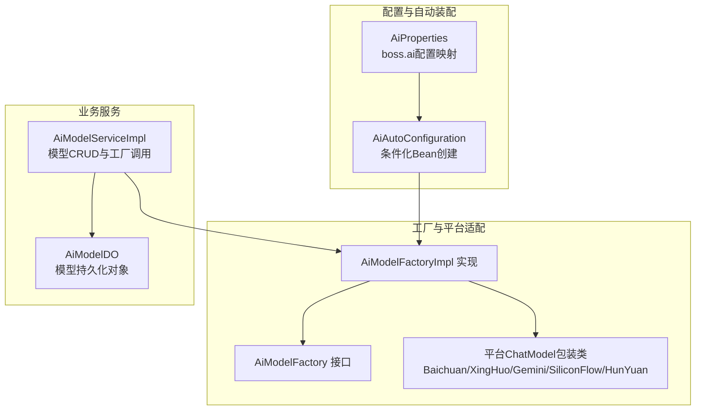
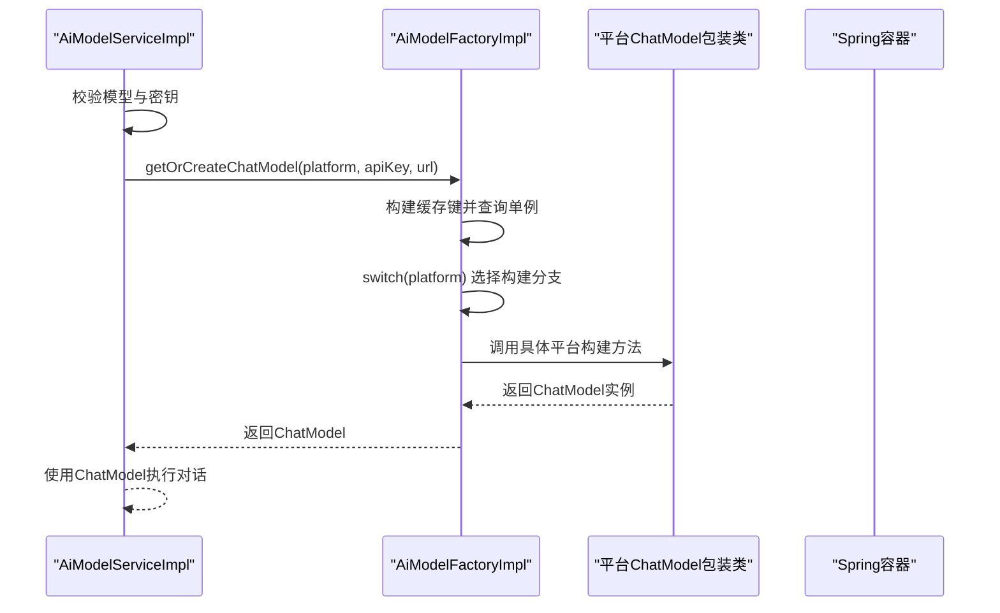
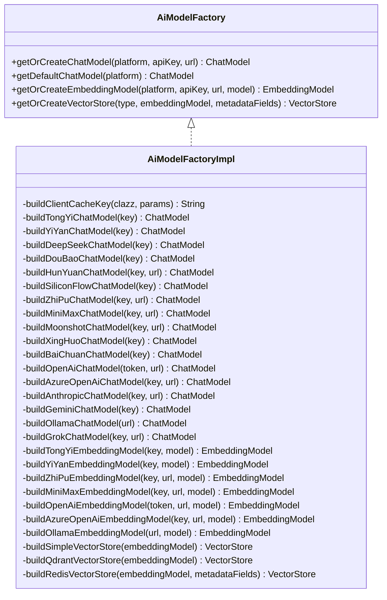
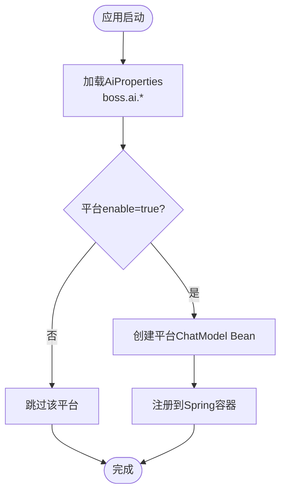
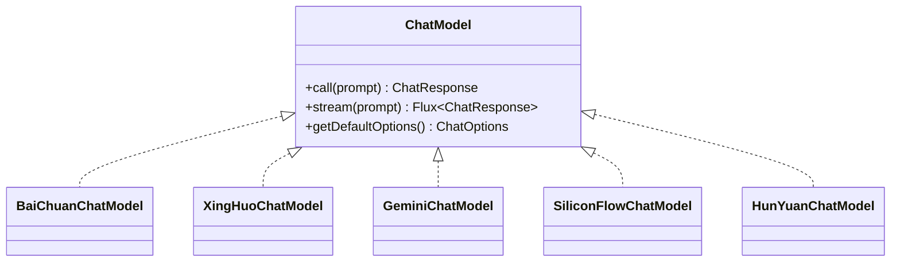
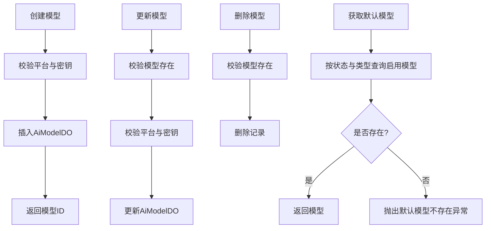
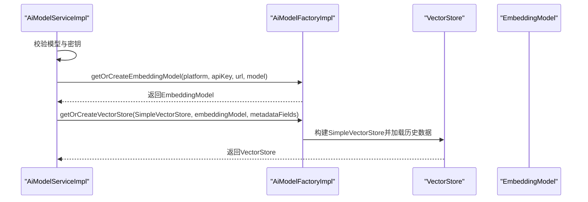
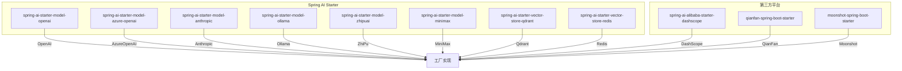

# AI模型管理

<cite>
**本文引用的文件**
- [AiModelFactory.java](file://src/main/java/cn/boss/data/ai/framework/ai/core/model/AiModelFactory.java)
- [AiModelFactoryImpl.java](file://src/main/java/cn/boss/data/ai/framework/ai/core/model/AiModelFactoryImpl.java)
- [AiAutoConfiguration.java](file://src/main/java/cn/boss/data/ai/framework/ai/config/AiAutoConfiguration.java)
- [AiProperties.java](file://src/main/java/cn/boss/data/ai/framework/ai/config/AiProperties.java)
- [AiPlatformEnum.java](file://src/main/java/cn/boss/data/ai/enums/model/AiPlatformEnum.java)
- [AiModelTypeEnum.java](file://src/main/java/cn/boss/data/ai/enums/model/AiModelTypeEnum.java)
- [AiModelServiceImpl.java](file://src/main/java/cn/boss/data/ai/service/model/AiModelServiceImpl.java)
- [AiModelDO.java](file://src/main/java/cn/boss/data/ai/dal/dataobject/model/AiModelDO.java)
- [BaiChuanChatModel.java](file://src/main/java/cn/boss/data/ai/framework/ai/core/model/baichuan/BaiChuanChatModel.java)
- [XingHuoChatModel.java](file://src/main/java/cn/boss/data/ai/framework/ai/core/model/xinghuo/XingHuoChatModel.java)
- [GeminiChatModel.java](file://src/main/java/cn/boss/data/ai/framework/ai/core/model/gemini/GeminiChatModel.java)
- [SiliconFlowChatModel.java](file://src/main/java/cn/boss/data/ai/framework/ai/core/model/siliconflow/SiliconFlowChatModel.java)
- [HunYuanChatModel.java](file://src/main/java/cn/boss/data/ai/framework/ai/core/model/hunyuan/HunYuanChatModel.java)
- [application.yml](file://src/main/resources/application.yml)
- [pom.xml](file://pom.xml)
</cite>

## 目录
1. [简介](#简介)
2. [项目结构](#项目结构)
3. [核心组件](#核心组件)
4. [架构总览](#架构总览)
5. [详细组件分析](#详细组件分析)
6. [依赖分析](#依赖分析)
7. [性能考虑](#性能考虑)
8. [故障排查指南](#故障排查指南)
9. [结论](#结论)
10. [附录](#附录)

## 简介
本技术文档围绕AI模型管理模块展开，系统性阐述模型工厂的设计与实现，覆盖多平台统一接入（Baichuan、Doubao、Gemini、Grok、HunYuan、SiliconFlow、XingHuo等），以及模型配置管理、API密钥管理、模型类型管理与平台配置的具体实现。文档同时给出模型注册、更新、删除的完整流程，并提供扩展新AI平台的支持步骤与依赖注入机制说明，帮助开发者快速理解与二次开发。

## 项目结构
AI模型管理模块位于框架层与服务层之间，采用“工厂+自动装配+配置属性”的分层设计：
- 架构层：AiAutoConfiguration 提供各平台客户端的条件化Bean创建；AiProperties 定义boss.ai命名空间下的平台配置。
- 工厂层：AiModelFactory 接口定义统一工厂能力；AiModelFactoryImpl 实现工厂逻辑，负责按平台、密钥、URL、模型等参数构建或复用ChatModel、EmbeddingModel与VectorStore实例。
- 业务层：AiModelServiceImpl 通过工厂与密钥服务组合，完成模型的校验、查询、分页与向量化存储的获取。
- 平台适配层：各平台的ChatModel包装类（如Baichuan、XingHuo、Gemini、SiliconFlow、HunYuan）统一实现Spring AI的ChatModel接口，便于工厂统一对接。
- 枚举层：AiPlatformEnum与AiModelTypeEnum分别管理平台与模型类型，提供校验与数组转换能力。

图表来源
- [AiAutoConfiguration.java:50-91](file://src/main/java/cn/boss/data/ai/framework/ai/config/AiAutoConfiguration.java#L50-L91)
- [AiModelFactory.java:13-62](file://src/main/java/cn/boss/data/ai/framework/ai/core/model/AiModelFactory.java#L13-L62)
- [AiModelFactoryImpl.java:113-200](file://src/main/java/cn/boss/data/ai/framework/ai/core/model/AiModelFactoryImpl.java#L113-L200)
- [AiModelServiceImpl.java:30-129](file://src/main/java/cn/boss/data/ai/service/model/AiModelServiceImpl.java#L30-L129)
- [AiModelDO.java:15-60](file://src/main/java/cn/boss/data/ai/dal/dataobject/model/AiModelDO.java#L15-L60)

章节来源
- [AiAutoConfiguration.java:50-91](file://src/main/java/cn/boss/data/ai/framework/ai/config/AiAutoConfiguration.java#L50-L91)
- [AiModelFactory.java:13-62](file://src/main/java/cn/boss/data/ai/framework/ai/core/model/AiModelFactory.java#L13-L62)
- [AiModelFactoryImpl.java:113-200](file://src/main/java/cn/boss/data/ai/framework/ai/core/model/AiModelFactoryImpl.java#L113-L200)
- [AiModelServiceImpl.java:30-129](file://src/main/java/cn/boss/data/ai/service/model/AiModelServiceImpl.java#L30-L129)
- [AiModelDO.java:15-60](file://src/main/java/cn/boss/data/ai/dal/dataobject/model/AiModelDO.java#L15-L60)

## 核心组件
- 工厂接口与实现
  - AiModelFactory：定义获取ChatModel、默认ChatModel、EmbeddingModel与VectorStore的能力，支持按平台、密钥、URL、模型等参数构建或复用实例。
  - AiModelFactoryImpl：实现工厂逻辑，内部以单例缓存（基于Hutool Singleton）按参数构建与复用实例，避免重复初始化；针对不同平台在switch分支中委派到具体构建方法。
- 自动装配与配置
  - AiAutoConfiguration：基于boss.ai.*配置，按enable开关创建各平台ChatModel Bean；AiProperties映射boss.ai.*配置项。
- 业务服务
  - AiModelServiceImpl：封装模型的CRUD与校验，结合工厂与密钥服务获取ChatModel与VectorStore。
- 平台适配
  - 各平台ChatModel包装类（Baichuan、XingHuo、Gemini、SiliconFlow、HunYuan等）统一实现ChatModel接口，内部委托底层OpenAI兼容实现或平台特有实现。
- 枚举与数据对象
  - AiPlatformEnum：平台枚举与校验；AiModelTypeEnum：模型类型枚举；AiModelDO：模型持久化对象，包含平台、类型、温度、最大tokens等对话配置。

章节来源
- [AiModelFactory.java:13-62](file://src/main/java/cn/boss/data/ai/framework/ai/core/model/AiModelFactory.java#L13-L62)
- [AiModelFactoryImpl.java:113-200](file://src/main/java/cn/boss/data/ai/framework/ai/core/model/AiModelFactoryImpl.java#L113-L200)
- [AiAutoConfiguration.java:50-91](file://src/main/java/cn/boss/data/ai/framework/ai/config/AiAutoConfiguration.java#L50-L91)
- [AiProperties.java:11-134](file://src/main/java/cn/boss/data/ai/framework/ai/config/AiProperties.java#L11-L134)
- [AiModelServiceImpl.java:30-129](file://src/main/java/cn/boss/data/ai/service/model/AiModelServiceImpl.java#L30-L129)
- [AiPlatformEnum.java:14-71](file://src/main/java/cn/boss/data/ai/enums/model/AiPlatformEnum.java#L14-L71)
- [AiModelTypeEnum.java:14-40](file://src/main/java/cn/boss/data/ai/enums/model/AiModelTypeEnum.java#L14-L40)
- [AiModelDO.java:15-60](file://src/main/java/cn/boss/data/ai/dal/dataobject/model/AiModelDO.java#L15-L60)

## 架构总览
AI模型管理采用工厂模式与依赖注入相结合的方式：
- 工厂模式：AiModelFactoryImpl根据平台参数选择对应构建策略，统一返回Spring AI的ChatModel/EmbeddingModel/VectorStore实例。
- 依赖注入：AiAutoConfiguration通过@EnableConfigurationProperties与@Bean将配置与Bean注入容器；AiModelFactoryImpl通过SpringUtils从容器中获取ObservationRegistry、ToolCallingManager、BatchingStrategy等通用组件。
- 配置驱动：boss.ai.*配置项决定各平台是否启用及默认模型、温度、最大tokens等参数。

图表来源
- [AiModelServiceImpl.java:110-116](file://src/main/java/cn/boss/data/ai/service/model/AiModelServiceImpl.java#L110-L116)
- [AiModelFactoryImpl.java:115-159](file://src/main/java/cn/boss/data/ai/framework/ai/core/model/AiModelFactoryImpl.java#L115-L159)
- [BaiChuanChatModel.java:17-41](file://src/main/java/cn/boss/data/ai/framework/ai/core/model/baichuan/BaiChuanChatModel.java#L17-L41)
- [XingHuoChatModel.java:16-43](file://src/main/java/cn/boss/data/ai/framework/ai/core/model/xinghuo/XingHuoChatModel.java#L16-L43)
- [GeminiChatModel.java:16-42](file://src/main/java/cn/boss/data/ai/framework/ai/core/model/gemini/GeminiChatModel.java#L16-L42)
- [SiliconFlowChatModel.java:16-36](file://src/main/java/cn/boss/data/ai/framework/ai/core/model/siliconflow/SiliconFlowChatModel.java#L16-L36)
- [HunYuanChatModel.java:16-45](file://src/main/java/cn/boss/data/ai/framework/ai/core/model/hunyuan/HunYuanChatModel.java#L16-L45)

## 详细组件分析

### 工厂接口与实现（工厂模式与缓存）
- 设计要点
  - 统一入口：提供getOrCreateChatModel、getDefaultChatModel、getOrCreateEmbeddingModel、getOrCreateVectorStore四个核心方法。
  - 参数化缓存：buildClientCacheKey将平台、密钥、URL、模型等参数拼接为缓存键，避免重复创建。
  - 平台分支：AiModelFactoryImpl通过switch(platform)委派到各平台构建方法，确保扩展新平台时只需新增分支与构建方法。
  - 默认Bean获取：getDefaultChatModel通过SpringUtils.getBean获取容器中的默认ChatModel Bean，适用于无需动态参数的场景。
- 复杂度与性能
  - 缓存命中：首次构建后复用，时间复杂度近似O(1)；首次构建涉及平台特定初始化，开销取决于平台SDK。
  - 线程安全：Hutool Singleton内部线程安全，适合并发访问。

图表来源
- [AiModelFactory.java:13-62](file://src/main/java/cn/boss/data/ai/framework/ai/core/model/AiModelFactory.java#L13-L62)
- [AiModelFactoryImpl.java:113-568](file://src/main/java/cn/boss/data/ai/framework/ai/core/model/AiModelFactoryImpl.java#L113-L568)

章节来源
- [AiModelFactory.java:13-62](file://src/main/java/cn/boss/data/ai/framework/ai/core/model/AiModelFactory.java#L13-L62)
- [AiModelFactoryImpl.java:113-200](file://src/main/java/cn/boss/data/ai/framework/ai/core/model/AiModelFactoryImpl.java#L113-L200)
- [AiModelFactoryImpl.java:202-245](file://src/main/java/cn/boss/data/ai/framework/ai/core/model/AiModelFactoryImpl.java#L202-L245)
- [AiModelFactoryImpl.java:247-252](file://src/main/java/cn/boss/data/ai/framework/ai/core/model/AiModelFactoryImpl.java#L247-L252)

### 自动装配与配置（条件化Bean与配置映射）
- AiAutoConfiguration
  - 通过@EnableConfigurationProperties加载AiProperties；
  - 以@ConditionalOnProperty(value = "boss.ai.{platform}.enable", havingValue = "true")按需创建各平台ChatModel Bean；
  - 提供buildXxxChatClient系列方法，将AiProperties中的配置映射到平台客户端。
- AiProperties
  - 映射boss.ai.*命名空间下的配置，包含各平台的enable、apiKey、baseUrl、model、temperature、maxTokens、topP等字段。
- 应用配置
  - application.yml中boss.ai.*与spring.ai.vectorstore.*配置，决定平台启用状态与向量存储参数。

图表来源
- [AiAutoConfiguration.java:44-91](file://src/main/java/cn/boss/data/ai/framework/ai/config/AiAutoConfiguration.java#L44-L91)
- [AiProperties.java:11-134](file://src/main/java/cn/boss/data/ai/framework/ai/config/AiProperties.java#L11-L134)
- [application.yml:150-190](file://src/main/resources/application.yml#L150-L190)

章节来源
- [AiAutoConfiguration.java:50-91](file://src/main/java/cn/boss/data/ai/framework/ai/config/AiAutoConfiguration.java#L50-L91)
- [AiProperties.java:11-134](file://src/main/java/cn/boss/data/ai/framework/ai/config/AiProperties.java#L11-L134)
- [application.yml:150-190](file://src/main/resources/application.yml#L150-L190)

### 平台适配（统一ChatModel接口）
- 各平台通过包装类实现ChatModel接口，内部委托底层OpenAI兼容实现或平台特有实现，确保工厂层无需感知具体差异。
- 典型平台适配类：
  - BaiChuanChatModel：基于OpenAI兼容接口，设置默认BASE_URL与MODEL_DEFAULT。
  - XingHuoChatModel：支持v1/v2版本URL切换，设置默认MODEL_DEFAULT。
  - GeminiChatModel：通过OpenAiChatModel桥接到Gemini API。
  - SiliconFlowChatModel：基于OpenAI兼容接口。
  - HunYuanChatModel：支持混元与DeepSeek兼容路径，设置默认MODEL_DEFAULT与DEEP_SEEK_MODEL_DEFAULT。

图表来源
- [BaiChuanChatModel.java:17-41](file://src/main/java/cn/boss/data/ai/framework/ai/core/model/baichuan/BaiChuanChatModel.java#L17-L41)
- [XingHuoChatModel.java:16-43](file://src/main/java/cn/boss/data/ai/framework/ai/core/model/xinghuo/XingHuoChatModel.java#L16-L43)
- [GeminiChatModel.java:16-42](file://src/main/java/cn/boss/data/ai/framework/ai/core/model/gemini/GeminiChatModel.java#L16-L42)
- [SiliconFlowChatModel.java:16-36](file://src/main/java/cn/boss/data/ai/framework/ai/core/model/siliconflow/SiliconFlowChatModel.java#L16-L36)
- [HunYuanChatModel.java:16-45](file://src/main/java/cn/boss/data/ai/framework/ai/core/model/hunyuan/HunYuanChatModel.java#L16-L45)

章节来源
- [BaiChuanChatModel.java:17-41](file://src/main/java/cn/boss/data/ai/framework/ai/core/model/baichuan/BaiChuanChatModel.java#L17-L41)
- [XingHuoChatModel.java:16-43](file://src/main/java/cn/boss/data/ai/framework/ai/core/model/xinghuo/XingHuoChatModel.java#L16-L43)
- [GeminiChatModel.java:16-42](file://src/main/java/cn/boss/data/ai/framework/ai/core/model/gemini/GeminiChatModel.java#L16-L42)
- [SiliconFlowChatModel.java:16-36](file://src/main/java/cn/boss/data/ai/framework/ai/core/model/siliconflow/SiliconFlowChatModel.java#L16-L36)
- [HunYuanChatModel.java:16-45](file://src/main/java/cn/boss/data/ai/framework/ai/core/model/hunyuan/HunYuanChatModel.java#L16-L45)

### 模型注册、更新、删除流程
- 注册模型
  - 校验平台合法性与密钥有效性；将请求对象映射为AiModelDO并插入数据库。
- 更新模型
  - 校验模型存在性；校验平台与密钥；更新AiModelDO。
- 删除模型
  - 校验模型存在性；执行删除。
- 查询与默认模型
  - 支持按状态与类型查询列表；支持获取默认启用模型。

图表来源
- [AiModelServiceImpl.java:43-73](file://src/main/java/cn/boss/data/ai/service/model/AiModelServiceImpl.java#L43-L73)
- [AiModelServiceImpl.java:80-101](file://src/main/java/cn/boss/data/ai/service/model/AiModelServiceImpl.java#L80-L101)

章节来源
- [AiModelServiceImpl.java:43-73](file://src/main/java/cn/boss/data/ai/service/model/AiModelServiceImpl.java#L43-L73)
- [AiModelServiceImpl.java:80-101](file://src/main/java/cn/boss/data/ai/service/model/AiModelServiceImpl.java#L80-L101)

### 依赖注入与向量存储
- 依赖注入
  - AiAutoConfiguration通过@Bean注册AiModelFactory与ObservationRegistry等；AiModelFactoryImpl通过SpringUtils.getBean获取ToolCallingManager、BatchingStrategy、ObservationRegistry等。
- 向量存储
  - 工厂支持SimpleVectorStore、QdrantVectorStore、RedisVectorStore三种类型，按EmbeddingModel与metadataFields构建；SimpleVectorStore提供定时保存与JVM退出钩子持久化。

图表来源
- [AiModelServiceImpl.java:118-126](file://src/main/java/cn/boss/data/ai/service/model/AiModelServiceImpl.java#L118-L126)
- [AiModelFactoryImpl.java:228-245](file://src/main/java/cn/boss/data/ai/framework/ai/core/model/AiModelFactoryImpl.java#L228-L245)
- [AiModelFactoryImpl.java:465-486](file://src/main/java/cn/boss/data/ai/framework/ai/core/model/AiModelFactoryImpl.java#L465-L486)

章节来源
- [AiModelServiceImpl.java:118-126](file://src/main/java/cn/boss/data/ai/service/model/AiModelServiceImpl.java#L118-L126)
- [AiModelFactoryImpl.java:228-245](file://src/main/java/cn/boss/data/ai/framework/ai/core/model/AiModelFactoryImpl.java#L228-L245)
- [AiModelFactoryImpl.java:465-486](file://src/main/java/cn/boss/data/ai/framework/ai/core/model/AiModelFactoryImpl.java#L465-L486)

## 依赖分析
- Spring AI生态
  - spring-ai-starter-model-*系列依赖提供OpenAI、Azure OpenAI、Anthropic、Ollama、Stability AI、ZhiPu、MiniMax等模型支持。
  - spring-ai-starter-vector-store-*系列依赖提供Qdrant、Redis等向量存储支持。
- 第三方平台集成
  - Alibaba DashScope（通义）、QianFan（文心一言）、Moonshot（月之暗面）通过社区starter接入。
- 配置与自动装配
  - AiAutoConfiguration与AiProperties配合，实现boss.ai.*配置驱动的Bean创建与平台启用控制。

图表来源
- [pom.xml:57-104](file://pom.xml#L57-L104)
- [pom.xml:106-131](file://pom.xml#L106-L131)
- [AiAutoConfiguration.java:50-91](file://src/main/java/cn/boss/data/ai/framework/ai/config/AiAutoConfiguration.java#L50-L91)

章节来源
- [pom.xml:57-104](file://pom.xml#L57-L104)
- [pom.xml:106-131](file://pom.xml#L106-L131)
- [AiAutoConfiguration.java:50-91](file://src/main/java/cn/boss/data/ai/framework/ai/config/AiAutoConfiguration.java#L50-L91)

## 性能考虑
- 工厂缓存
  - 通过Singleton按参数构建缓存键，避免重复初始化；建议合理设置平台参数（apiKey、url、model）以减少缓存碎片。
- 向量存储
  - SimpleVectorStore定时保存与JVM退出钩子持久化，适合轻量场景；生产环境建议优先使用Qdrant或Redis，具备更好的可扩展性与查询性能。
- 观测与批处理
  - 工厂通过ObservationRegistry与BatchingStrategy提升可观测性与批量处理效率，建议在高并发场景启用。

## 故障排查指南
- 平台未识别
  - 现象：抛出“未知平台”异常。
  - 排查：确认AiPlatformEnum中是否存在该平台；检查传入platform字符串是否匹配枚举值。
- 密钥格式错误
  - 现象：YiYan/XingHuo等平台提示密钥格式不正确。
  - 排查：确认密钥格式符合要求（如appKey|secretKey）。
- 默认模型不存在
  - 现象：获取默认模型时报错。
  - 排查：确认数据库中存在状态为启用且类型匹配的模型记录。
- 启用配置未生效
  - 现象：boss.ai.{platform}.enable=false导致Bean未创建。
  - 排查：检查application.yml中对应平台的enable与apiKey配置。

章节来源
- [AiModelFactoryImpl.java:155-157](file://src/main/java/cn/boss/data/ai/framework/ai/core/model/AiModelFactoryImpl.java#L155-L157)
- [AiModelFactoryImpl.java:269-270](file://src/main/java/cn/boss/data/ai/framework/ai/core/model/AiModelFactoryImpl.java#L269-L270)
- [AiModelFactoryImpl.java:339-340](file://src/main/java/cn/boss/data/ai/framework/ai/core/model/AiModelFactoryImpl.java#L339-L340)
- [AiModelServiceImpl.java:82-86](file://src/main/java/cn/boss/data/ai/service/model/AiModelServiceImpl.java#L82-L86)
- [application.yml:150-190](file://src/main/resources/application.yml#L150-L190)

## 结论
AI模型管理模块通过工厂模式与自动装配实现了对多平台AI模型的统一接入与管理，具备良好的扩展性与可维护性。工厂层屏蔽平台差异，业务层通过统一接口获取ChatModel与VectorStore，配合配置驱动与条件化Bean，满足不同部署环境的需求。建议在生产环境中优先使用Qdrant或Redis向量存储，并结合ObservationRegistry与BatchingStrategy优化性能与可观测性。

## 附录
- 配置参数说明（boss.ai.*）
  - 平台启用与密钥：enable、apiKey、baseUrl（部分平台）、appId/appKey/secretKey（XingHuo）。
  - 模型与推理参数：model、temperature、maxTokens、topP。
  - 网络搜索：web-search.enable、web-search.api-key。
- 扩展新平台步骤
  - 在AiPlatformEnum中新增平台枚举值；
  - 在AiAutoConfiguration中增加@ConditionalOnProperty与@Bean方法，或在AiModelFactoryImpl中新增switch分支；
  - 如需独立客户端，新增平台ChatModel包装类并实现ChatModel接口；
  - 在AiProperties中新增对应配置类字段；
  - 在application.yml中添加boss.ai.{platform}.*配置项并设置enable=true。

章节来源
- [AiPlatformEnum.java:14-71](file://src/main/java/cn/boss/data/ai/enums/model/AiPlatformEnum.java#L14-L71)
- [AiAutoConfiguration.java:50-91](file://src/main/java/cn/boss/data/ai/framework/ai/config/AiAutoConfiguration.java#L50-L91)
- [AiModelFactoryImpl.java:115-159](file://src/main/java/cn/boss/data/ai/framework/ai/core/model/AiModelFactoryImpl.java#L115-L159)
- [AiProperties.java:53-131](file://src/main/java/cn/boss/data/ai/framework/ai/config/AiProperties.java#L53-L131)
- [application.yml:150-190](file://src/main/resources/application.yml#L150-L190)