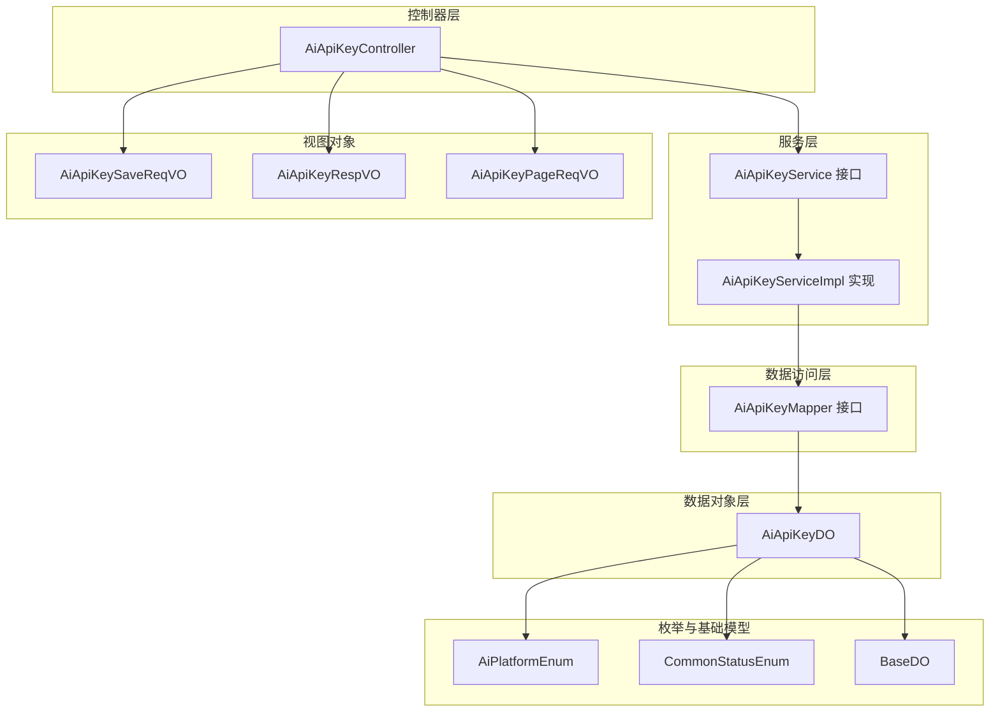
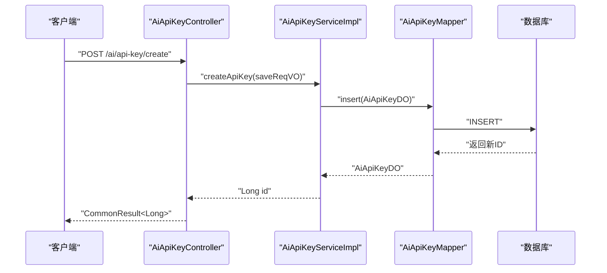
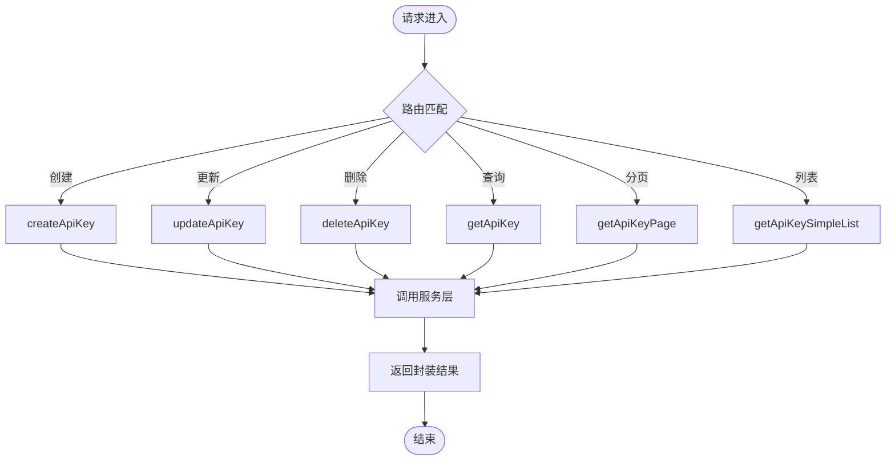
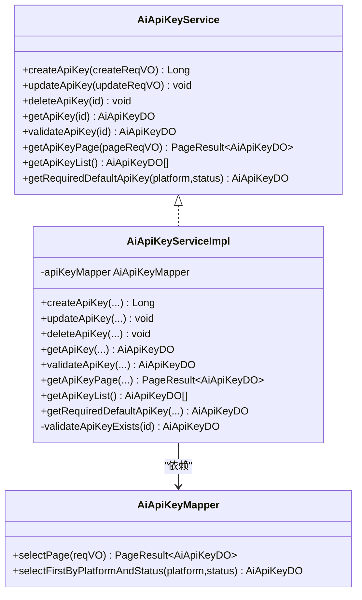
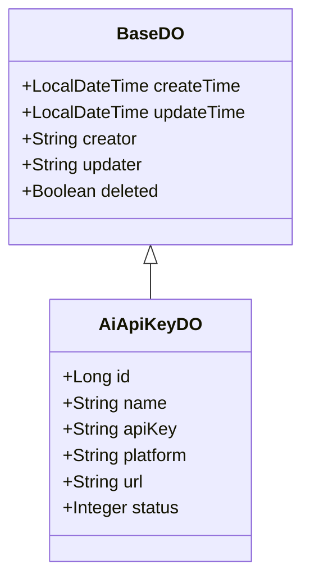
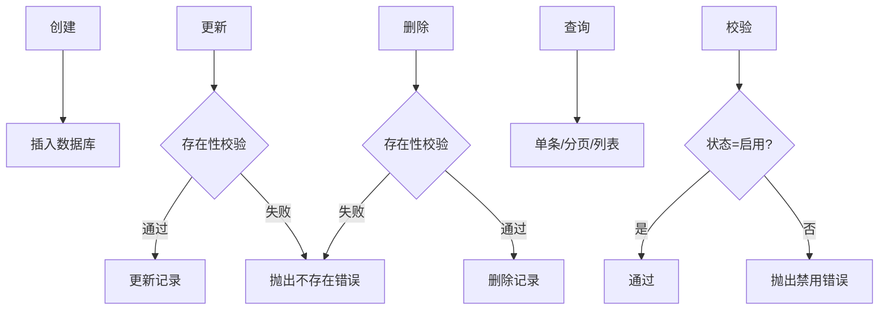
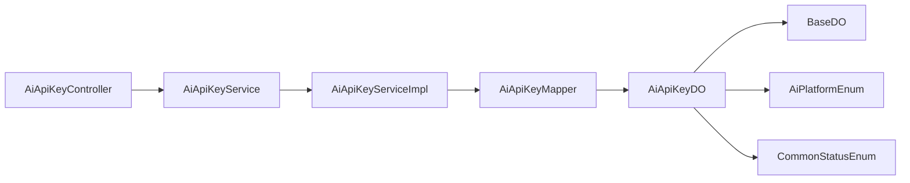

# API密钥管理

<cite>
**本文引用的文件**
- [AiApiKeyController.java](file://src/main/java/cn/boss/data/ai/controller/model/AiApiKeyController.java)
- [AiApiKeyService.java](file://src/main/java/cn/boss/data/ai/service/model/AiApiKeyService.java)
- [AiApiKeyServiceImpl.java](file://src/main/java/cn/boss/data/ai/service/model/AiApiKeyServiceImpl.java)
- [AiApiKeyDO.java](file://src/main/java/cn/boss/data/ai/dal/dataobject/model/AiApiKeyDO.java)
- [AiApiKeyMapper.java](file://src/main/java/cn/boss/data/ai/dal/mysql/model/AiApiKeyMapper.java)
- [AiApiKeySaveReqVO.java](file://src/main/java/cn/boss/data/ai/controller/model/vo/apikey/AiApiKeySaveReqVO.java)
- [AiApiKeyRespVO.java](file://src/main/java/cn/boss/data/ai/controller/model/vo/apikey/AiApiKeyRespVO.java)
- [AiApiKeyPageReqVO.java](file://src/main/java/cn/boss/data/ai/controller/model/vo/apikey/AiApiKeyPageReqVO.java)
- [AiPlatformEnum.java](file://src/main/java/cn/boss/data/ai/enums/model/AiPlatformEnum.java)
- [CommonStatusEnum.java](file://src/main/java/cn/boss/data/ai/framework/common/enums/CommonStatusEnum.java)
- [BaseDO.java](file://src/main/java/cn/boss/data/ai/framework/mybatis/core/dataobject/BaseDO.java)
- [ErrorCodeConstants.java](file://src/main/java/cn/boss/data/ai/enums/ErrorCodeConstants.java)
</cite>

## 目录
1. [简介](#简介)
2. [项目结构](#项目结构)
3. [核心组件](#核心组件)
4. [架构总览](#架构总览)
5. [详细组件分析](#详细组件分析)
6. [依赖分析](#依赖分析)
7. [性能考虑](#性能考虑)
8. [故障排查指南](#故障排查指南)
9. [结论](#结论)
10. [附录](#附录)

## 简介
本技术文档围绕API密钥管理功能展开，系统性阐述密钥的全生命周期管理（创建、更新、删除、查询），并深入解析AiApiKeyController的接口设计与实现、AiApiKeyService的服务逻辑、AiApiKeyDO数据对象的字段与安全属性，以及密钥与模型配置的关联关系与权限绑定机制。同时，结合现有代码实现，明确当前未内置的密钥轮换、过期管理与审计日志等能力，并给出最佳实践与安全建议。

## 项目结构
API密钥管理功能位于“model”模块下，采用典型的分层架构：
- 控制器层：AiApiKeyController 提供REST接口
- 服务层：AiApiKeyService 接口及 AiApiKeyServiceImpl 实现
- 数据访问层：AiApiKeyMapper 接口
- 数据对象层：AiApiKeyDO 映射数据库表
- 视图对象：AiApiKeySaveReqVO、AiApiKeyRespVO、AiApiKeyPageReqVO
- 枚举与基础模型：AiPlatformEnum、CommonStatusEnum、BaseDO

图表来源
- [AiApiKeyController.java:25-77](file://src/main/java/cn/boss/data/ai/controller/model/AiApiKeyController.java#L25-L77)
- [AiApiKeyService.java:14-32](file://src/main/java/cn/boss/data/ai/service/model/AiApiKeyService.java#L14-L32)
- [AiApiKeyServiceImpl.java:25-91](file://src/main/java/cn/boss/data/ai/service/model/AiApiKeyServiceImpl.java#L25-L91)
- [AiApiKeyMapper.java:14-33](file://src/main/java/cn/boss/data/ai/dal/mysql/model/AiApiKeyMapper.java#L14-L33)
- [AiApiKeyDO.java:20-40](file://src/main/java/cn/boss/data/ai/dal/dataobject/model/AiApiKeyDO.java#L20-L40)
- [AiApiKeySaveReqVO.java:10-34](file://src/main/java/cn/boss/data/ai/controller/model/vo/apikey/AiApiKeySaveReqVO.java#L10-L34)
- [AiApiKeyRespVO.java:8-28](file://src/main/java/cn/boss/data/ai/controller/model/vo/apikey/AiApiKeyRespVO.java#L8-L28)
- [AiApiKeyPageReqVO.java:9-20](file://src/main/java/cn/boss/data/ai/controller/model/vo/apikey/AiApiKeyPageReqVO.java#L9-L20)
- [AiPlatformEnum.java:14-70](file://src/main/java/cn/boss/data/ai/enums/model/AiPlatformEnum.java#L14-L70)
- [CommonStatusEnum.java:12-35](file://src/main/java/cn/boss/data/ai/framework/common/enums/CommonStatusEnum.java#L12-L35)
- [BaseDO.java:13-30](file://src/main/java/cn/boss/data/ai/framework/mybatis/core/dataobject/BaseDO.java#L13-L30)

章节来源
- [AiApiKeyController.java:25-77](file://src/main/java/cn/boss/data/ai/controller/model/AiApiKeyController.java#L25-L77)
- [AiApiKeyService.java:14-32](file://src/main/java/cn/boss/data/ai/service/model/AiApiKeyService.java#L14-L32)
- [AiApiKeyServiceImpl.java:25-91](file://src/main/java/cn/boss/data/ai/service/model/AiApiKeyServiceImpl.java#L25-L91)
- [AiApiKeyMapper.java:14-33](file://src/main/java/cn/boss/data/ai/dal/mysql/model/AiApiKeyMapper.java#L14-L33)
- [AiApiKeyDO.java:20-40](file://src/main/java/cn/boss/data/ai/dal/dataobject/model/AiApiKeyDO.java#L20-L40)
- [AiApiKeySaveReqVO.java:10-34](file://src/main/java/cn/boss/data/ai/controller/model/vo/apikey/AiApiKeySaveReqVO.java#L10-L34)
- [AiApiKeyRespVO.java:8-28](file://src/main/java/cn/boss/data/ai/controller/model/vo/apikey/AiApiKeyRespVO.java#L8-L28)
- [AiApiKeyPageReqVO.java:9-20](file://src/main/java/cn/boss/data/ai/controller/model/vo/apikey/AiApiKeyPageReqVO.java#L9-L20)
- [AiPlatformEnum.java:14-70](file://src/main/java/cn/boss/data/ai/enums/model/AiPlatformEnum.java#L14-L70)
- [CommonStatusEnum.java:12-35](file://src/main/java/cn/boss/data/ai/framework/common/enums/CommonStatusEnum.java#L12-L35)
- [BaseDO.java:13-30](file://src/main/java/cn/boss/data/ai/framework/mybatis/core/dataobject/BaseDO.java#L13-L30)

## 核心组件
- 控制器：AiApiKeyController 提供创建、更新、删除、单条查询、分页查询、简单列表等接口，统一返回CommonResult或PageResult。
- 服务：AiApiKeyService 定义密钥的CRUD与校验方法；AiApiKeyServiceImpl 实现具体业务逻辑，含存在性校验、启用状态校验、默认密钥获取等。
- 数据访问：AiApiKeyMapper 基于BaseMapperX扩展，提供分页查询与按平台+状态取第一条记录的能力。
- 数据对象：AiApiKeyDO 映射ai_api_key表，包含主键、名称、密钥、平台、URL、状态等字段，并继承BaseDO的时间与操作人字段。
- 视图对象：AiApiKeySaveReqVO/AiApiKeyRespVO/AiApiKeyPageReqVO分别用于保存/修改、响应、分页查询的参数与结果封装。
- 枚举：AiPlatformEnum 定义平台集合；CommonStatusEnum 定义启用/禁用状态；BaseDO 提供通用审计字段。

章节来源
- [AiApiKeyController.java:34-75](file://src/main/java/cn/boss/data/ai/controller/model/AiApiKeyController.java#L34-L75)
- [AiApiKeyService.java:14-32](file://src/main/java/cn/boss/data/ai/service/model/AiApiKeyService.java#L14-L32)
- [AiApiKeyServiceImpl.java:30-89](file://src/main/java/cn/boss/data/ai/service/model/AiApiKeyServiceImpl.java#L30-L89)
- [AiApiKeyMapper.java:17-31](file://src/main/java/cn/boss/data/ai/dal/mysql/model/AiApiKeyMapper.java#L17-L31)
- [AiApiKeyDO.java:20-40](file://src/main/java/cn/boss/data/ai/dal/dataobject/model/AiApiKeyDO.java#L20-L40)
- [AiApiKeySaveReqVO.java:10-34](file://src/main/java/cn/boss/data/ai/controller/model/vo/apikey/AiApiKeySaveReqVO.java#L10-L34)
- [AiApiKeyRespVO.java:8-28](file://src/main/java/cn/boss/data/ai/controller/model/vo/apikey/AiApiKeyRespVO.java#L8-L28)
- [AiApiKeyPageReqVO.java:9-20](file://src/main/java/cn/boss/data/ai/controller/model/vo/apikey/AiApiKeyPageReqVO.java#L9-L20)
- [AiPlatformEnum.java:14-70](file://src/main/java/cn/boss/data/ai/enums/model/AiPlatformEnum.java#L14-L70)
- [CommonStatusEnum.java:12-35](file://src/main/java/cn/boss/data/ai/framework/common/enums/CommonStatusEnum.java#L12-L35)
- [BaseDO.java:13-30](file://src/main/java/cn/boss/data/ai/framework/mybatis/core/dataobject/BaseDO.java#L13-L30)

## 架构总览
API密钥管理遵循经典的分层架构，控制器负责HTTP请求与响应封装，服务层承载业务规则与校验，数据访问层负责数据库交互，数据对象映射持久化实体。平台与状态通过枚举约束，确保一致性与可维护性。

图表来源
- [AiApiKeyController.java:34-38](file://src/main/java/cn/boss/data/ai/controller/model/AiApiKeyController.java#L34-L38)
- [AiApiKeyServiceImpl.java:31-35](file://src/main/java/cn/boss/data/ai/service/model/AiApiKeyServiceImpl.java#L31-L35)
- [AiApiKeyMapper.java:14-33](file://src/main/java/cn/boss/data/ai/dal/mysql/model/AiApiKeyMapper.java#L14-L33)

## 详细组件分析

### 控制器：AiApiKeyController
- 接口职责
  - 创建：接收AiApiKeySaveReqVO，调用服务创建并返回ID
  - 更新：接收AiApiKeySaveReqVO，调用服务更新
  - 删除：接收id，调用服务删除
  - 查询单条：根据id查询并转换为AiApiKeyRespVO
  - 分页查询：接收AiApiKeyPageReqVO，返回分页结果
  - 简单列表：返回密钥的精简列表（id+name）
- 参数校验：基于Jakarta Validation注解，确保必填字段有效
- 返回封装：统一使用CommonResult与PageResult包装

图表来源
- [AiApiKeyController.java:34-75](file://src/main/java/cn/boss/data/ai/controller/model/AiApiKeyController.java#L34-L75)

章节来源
- [AiApiKeyController.java:25-77](file://src/main/java/cn/boss/data/ai/controller/model/AiApiKeyController.java#L25-L77)

### 服务：AiApiKeyService 与 AiApiKeyServiceImpl
- 服务接口定义了创建、更新、删除、查询、校验、分页、列表、默认密钥获取等方法
- 实现类的关键逻辑
  - 存在性校验：查询密钥是否存在，不存在抛出“密钥不存在”错误
  - 启用状态校验：若状态为禁用，抛出“密钥已禁用”错误
  - 默认密钥获取：按平台与状态取第一条记录，不存在则报错
  - CRUD：基于Mapper执行插入、更新、删除、查询、分页、列表

图表来源
- [AiApiKeyService.java:14-32](file://src/main/java/cn/boss/data/ai/service/model/AiApiKeyService.java#L14-L32)
- [AiApiKeyServiceImpl.java:25-91](file://src/main/java/cn/boss/data/ai/service/model/AiApiKeyServiceImpl.java#L25-L91)
- [AiApiKeyMapper.java:14-33](file://src/main/java/cn/boss/data/ai/dal/mysql/model/AiApiKeyMapper.java#L14-L33)

章节来源
- [AiApiKeyService.java:14-32](file://src/main/java/cn/boss/data/ai/service/model/AiApiKeyService.java#L14-L32)
- [AiApiKeyServiceImpl.java:30-89](file://src/main/java/cn/boss/data/ai/service/model/AiApiKeyServiceImpl.java#L30-L89)
- [AiApiKeyMapper.java:17-31](file://src/main/java/cn/boss/data/ai/dal/mysql/model/AiApiKeyMapper.java#L17-L31)

### 数据对象：AiApiKeyDO
- 字段说明
  - id：主键
  - name：密钥名称
  - apiKey：密钥值
  - platform：平台标识，对应AiPlatformEnum
  - url：自定义API地址
  - status：状态，对应CommonStatusEnum（启用/禁用）
  - 继承BaseDO：createTime、updateTime、creator、updater、deleted
- 安全属性
  - 当前实现未对apiKey进行加密存储或脱敏展示，存在安全风险
  - 建议：存储时加密、展示时脱敏、传输时HTTPS

图表来源
- [BaseDO.java:13-30](file://src/main/java/cn/boss/data/ai/framework/mybatis/core/dataobject/BaseDO.java#L13-L30)
- [AiApiKeyDO.java:20-40](file://src/main/java/cn/boss/data/ai/dal/dataobject/model/AiApiKeyDO.java#L20-L40)

章节来源
- [AiApiKeyDO.java:20-40](file://src/main/java/cn/boss/data/ai/dal/dataobject/model/AiApiKeyDO.java#L20-L40)
- [BaseDO.java:13-30](file://src/main/java/cn/boss/data/ai/framework/mybatis/core/dataobject/BaseDO.java#L13-L30)

### 视图对象与枚举
- AiApiKeySaveReqVO：保存/修改请求体，包含id、name、apiKey、platform、url、status
- AiApiKeyRespVO：响应体，字段与保存体一致
- AiApiKeyPageReqVO：分页查询参数，包含name、platform、status
- AiPlatformEnum：平台枚举，覆盖国内外主流平台
- CommonStatusEnum：状态枚举，启用/禁用

章节来源
- [AiApiKeySaveReqVO.java:10-34](file://src/main/java/cn/boss/data/ai/controller/model/vo/apikey/AiApiKeySaveReqVO.java#L10-L34)
- [AiApiKeyRespVO.java:8-28](file://src/main/java/cn/boss/data/ai/controller/model/vo/apikey/AiApiKeyRespVO.java#L8-L28)
- [AiApiKeyPageReqVO.java:9-20](file://src/main/java/cn/boss/data/ai/controller/model/vo/apikey/AiApiKeyPageReqVO.java#L9-L20)
- [AiPlatformEnum.java:14-70](file://src/main/java/cn/boss/data/ai/enums/model/AiPlatformEnum.java#L14-L70)
- [CommonStatusEnum.java:12-35](file://src/main/java/cn/boss/data/ai/framework/common/enums/CommonStatusEnum.java#L12-L35)

### 密钥与模型配置的关联关系与权限绑定
- 关联关系：当前代码中AiApiKeyDO未直接关联模型配置；平台字段platform用于区分不同供应商，但未建立与模型配置的显式外键关系
- 权限绑定：服务层通过validateApiKey(id)校验密钥状态，实现简单的访问控制；未见细粒度的权限绑定逻辑
- 建议：在模型配置表中增加外键指向AiApiKeyDO.id，并在服务层增加按用户/租户维度的权限校验

章节来源
- [AiApiKeyDO.java:20-40](file://src/main/java/cn/boss/data/ai/dal/dataobject/model/AiApiKeyDO.java#L20-L40)
- [AiApiKeyServiceImpl.java:64-69](file://src/main/java/cn/boss/data/ai/service/model/AiApiKeyServiceImpl.java#L64-L69)

### 生命周期管理流程
- 创建：控制器接收保存请求，服务层插入后返回ID
- 更新：先校验存在性，再更新
- 删除：先校验存在性，再删除
- 查询：支持单条查询、分页查询、简单列表
- 校验：支持按ID校验存在性与启用状态

图表来源
- [AiApiKeyServiceImpl.java:30-89](file://src/main/java/cn/boss/data/ai/service/model/AiApiKeyServiceImpl.java#L30-L89)
- [AiApiKeyMapper.java:17-31](file://src/main/java/cn/boss/data/ai/dal/mysql/model/AiApiKeyMapper.java#L17-L31)
- [ErrorCodeConstants.java:12-14](file://src/main/java/cn/boss/data/ai/enums/ErrorCodeConstants.java#L12-L14)

## 依赖分析
- 控制器依赖服务接口
- 服务实现依赖Mapper接口
- Mapper继承BaseMapperX，底层依赖MyBatis-Plus
- 数据对象继承BaseDO，复用审计字段
- 枚举用于字段取值约束与校验

图表来源
- [AiApiKeyController.java:31-32](file://src/main/java/cn/boss/data/ai/controller/model/AiApiKeyController.java#L31-L32)
- [AiApiKeyService.java:14-32](file://src/main/java/cn/boss/data/ai/service/model/AiApiKeyService.java#L14-L32)
- [AiApiKeyServiceImpl.java:27-28](file://src/main/java/cn/boss/data/ai/service/model/AiApiKeyServiceImpl.java#L27-L28)
- [AiApiKeyMapper.java:14-15](file://src/main/java/cn/boss/data/ai/dal/mysql/model/AiApiKeyMapper.java#L14-L15)
- [AiApiKeyDO.java:20-40](file://src/main/java/cn/boss/data/ai/dal/dataobject/model/AiApiKeyDO.java#L20-L40)
- [BaseDO.java:13-30](file://src/main/java/cn/boss/data/ai/framework/mybatis/core/dataobject/BaseDO.java#L13-L30)
- [AiPlatformEnum.java:14-70](file://src/main/java/cn/boss/data/ai/enums/model/AiPlatformEnum.java#L14-L70)
- [CommonStatusEnum.java:12-35](file://src/main/java/cn/boss/data/ai/framework/common/enums/CommonStatusEnum.java#L12-L35)

章节来源
- [AiApiKeyController.java:31-32](file://src/main/java/cn/boss/data/ai/controller/model/AiApiKeyController.java#L31-L32)
- [AiApiKeyService.java:14-32](file://src/main/java/cn/boss/data/ai/service/model/AiApiKeyService.java#L14-L32)
- [AiApiKeyServiceImpl.java:27-28](file://src/main/java/cn/boss/data/ai/service/model/AiApiKeyServiceImpl.java#L27-L28)
- [AiApiKeyMapper.java:14-15](file://src/main/java/cn/boss/data/ai/dal/mysql/model/AiApiKeyMapper.java#L14-L15)
- [AiApiKeyDO.java:20-40](file://src/main/java/cn/boss/data/ai/dal/dataobject/model/AiApiKeyDO.java#L20-L40)
- [BaseDO.java:13-30](file://src/main/java/cn/boss/data/ai/framework/mybatis/core/dataobject/BaseDO.java#L13-L30)
- [AiPlatformEnum.java:14-70](file://src/main/java/cn/boss/data/ai/enums/model/AiPlatformEnum.java#L14-L70)
- [CommonStatusEnum.java:12-35](file://src/main/java/cn/boss/data/ai/framework/common/enums/CommonStatusEnum.java#L12-L35)

## 性能考虑
- 分页查询：AiApiKeyMapper基于LambdaQueryWrapperX进行条件过滤，建议在name、platform、status上建立合适索引以提升查询性能
- 默认密钥查询：selectFirstByPlatformAndStatus使用LIMIT 1，建议在(platform,status)组合上建立复合索引
- DTO转换：服务层使用BeanUtils进行对象转换，注意避免不必要的深度拷贝

章节来源
- [AiApiKeyMapper.java:17-31](file://src/main/java/cn/boss/data/ai/dal/mysql/model/AiApiKeyMapper.java#L17-L31)
- [AiApiKeyServiceImpl.java:32-41](file://src/main/java/cn/boss/data/ai/service/model/AiApiKeyServiceImpl.java#L32-L41)

## 故障排查指南
- 常见错误码
  - API_KEY_NOT_EXISTS：密钥不存在
  - API_KEY_DISABLE：密钥已禁用
- 排查步骤
  - 确认请求参数：id、name、apiKey、platform、status是否符合要求
  - 检查密钥状态：validateApiKey会校验状态，若为禁用需先启用
  - 检查默认密钥：getRequiredDefaultApiKey在找不到时会抛出“密钥不存在”
  - 日志定位：服务层与各模块均存在日志输出点，可用于问题定位

章节来源
- [ErrorCodeConstants.java:12-14](file://src/main/java/cn/boss/data/ai/enums/ErrorCodeConstants.java#L12-L14)
- [AiApiKeyServiceImpl.java:50-69](file://src/main/java/cn/boss/data/ai/service/model/AiApiKeyServiceImpl.java#L50-L69)
- [AiApiKeyServiceImpl.java:83-89](file://src/main/java/cn/boss/data/ai/service/model/AiApiKeyServiceImpl.java#L83-L89)

## 结论
当前API密钥管理实现了基本的CRUD与状态校验，具备良好的扩展性。为满足生产级安全与合规要求，建议补充以下能力：
- 密钥加密存储与脱敏展示
- 密钥轮换与过期管理
- 审计日志与操作追踪
- 密钥与模型配置的强关联与权限绑定
- 更细粒度的访问控制与租户隔离

## 附录

### API接口一览
- POST /ai/api-key/create：创建密钥
- PUT /ai/api-key/update：更新密钥
- DELETE /ai/api-key/delete?id={id}：删除密钥
- GET /ai/api-key/get?id={id}：获取单条密钥
- GET /ai/api-key/page：分页查询密钥
- GET /ai/api-key/simple-list：获取密钥简单列表

章节来源
- [AiApiKeyController.java:34-75](file://src/main/java/cn/boss/data/ai/controller/model/AiApiKeyController.java#L34-L75)