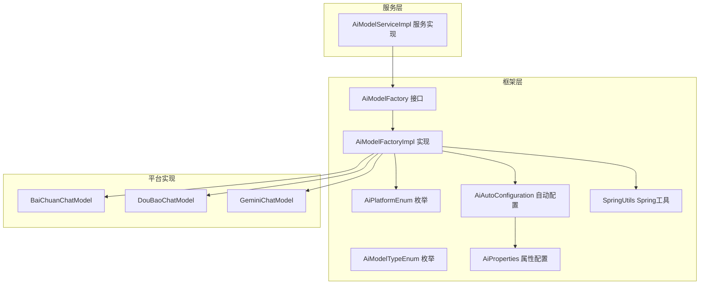
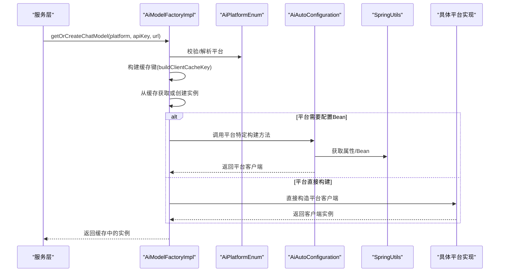
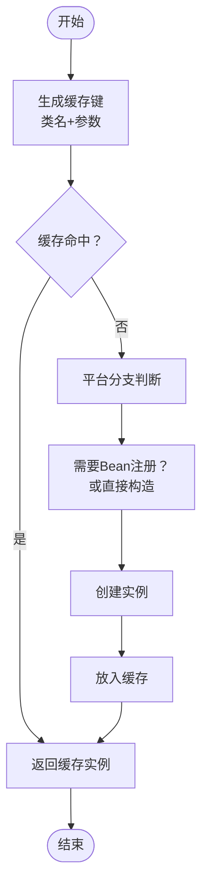
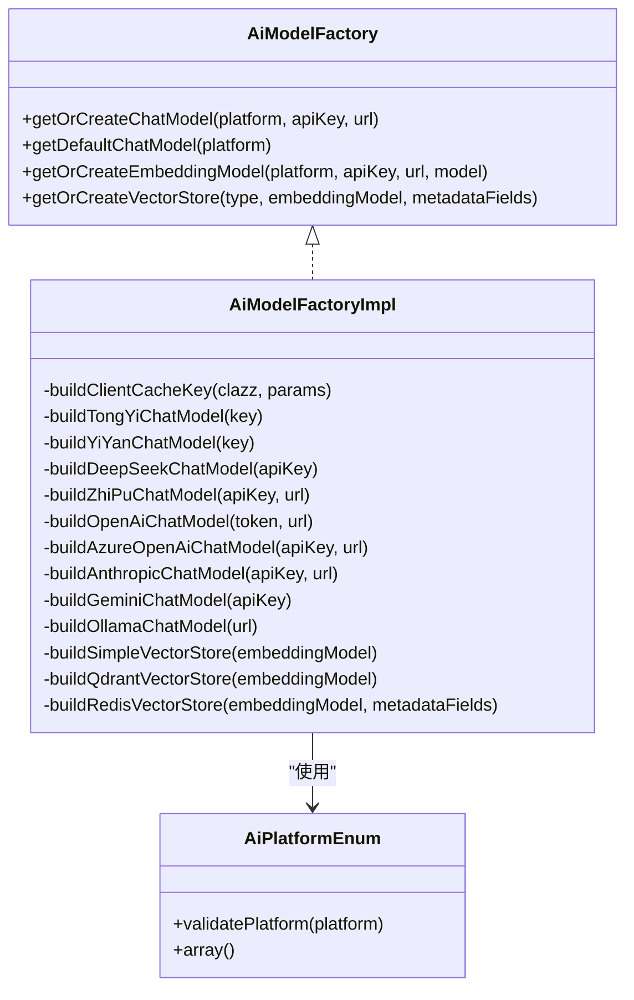

# 模型工厂设计

<cite>
**本文档引用的文件**
- [AiModelFactory.java](file://src/main/java/cn/boss/data/ai/framework/ai/core/model/AiModelFactory.java)
- [AiModelFactoryImpl.java](file://src/main/java/cn/boss/data/ai/framework/ai/core/model/AiModelFactoryImpl.java)
- [AiPlatformEnum.java](file://src/main/java/cn/boss/data/ai/enums/model/AiPlatformEnum.java)
- [AiModelTypeEnum.java](file://src/main/java/cn/boss/data/ai/enums/model/AiModelTypeEnum.java)
- [AiAutoConfiguration.java](file://src/main/java/cn/boss/data/ai/framework/ai/config/AiAutoConfiguration.java)
- [AiProperties.java](file://src/main/java/cn/boss/data/ai/framework/ai/config/AiProperties.java)
- [SpringUtils.java](file://src/main/java/cn/boss/data/ai/framework/common/util/spring/SpringUtils.java)
- [AiModelServiceImpl.java](file://src/main/java/cn/boss/data/ai/service/model/AiModelServiceImpl.java)
- [application.yml](file://src/main/resources/application.yml)
- [BaiChuanChatModel.java](file://src/main/java/cn/boss/data/ai/framework/ai/core/model/baichuan/BaiChuanChatModel.java)
- [DouBaoChatModel.java](file://src/main/java/cn/boss/data/ai/framework/ai/core/model/doubao/DouBaoChatModel.java)
- [GeminiChatModel.java](file://src/main/java/cn/boss/data/ai/framework/ai/core/model/gemini/GeminiChatModel.java)
</cite>

## 目录
1. [简介](#简介)
2. [项目结构](#项目结构)
3. [核心组件](#核心组件)
4. [架构概览](#架构概览)
5. [详细组件分析](#详细组件分析)
6. [依赖关系分析](#依赖关系分析)
7. [性能考量](#性能考量)
8. [故障排查指南](#故障排查指南)
9. [结论](#结论)
10. [附录](#附录)

## 简介
本文件面向AI模型工厂的设计与实现，系统性阐述工厂模式在统一管理多平台AI模型实例中的应用。文档重点覆盖：
- 工厂接口与实现的设计理念与职责边界
- 参数传递机制与缓存策略
- 生命周期管理与线程安全
- 多平台扩展流程与依赖注入配置
- 性能优化与并发安全策略

## 项目结构
该模块采用分层+按功能域组织的结构，核心工厂位于框架层，平台实现位于对应子包，配置与属性位于配置层，服务层通过依赖注入使用工厂。

**图表来源**
- [AiModelFactory.java:1-63](file://src/main/java/cn/boss/data/ai/framework/ai/core/model/AiModelFactory.java#L1-L63)
- [AiModelFactoryImpl.java:1-568](file://src/main/java/cn/boss/data/ai/framework/ai/core/model/AiModelFactoryImpl.java#L1-L568)
- [AiPlatformEnum.java:1-71](file://src/main/java/cn/boss/data/ai/enums/model/AiPlatformEnum.java#L1-L71)
- [AiModelTypeEnum.java:1-40](file://src/main/java/cn/boss/data/ai/enums/model/AiModelTypeEnum.java#L1-L40)
- [AiAutoConfiguration.java:1-286](file://src/main/java/cn/boss/data/ai/framework/ai/config/AiAutoConfiguration.java#L1-L286)
- [AiProperties.java:1-134](file://src/main/java/cn/boss/data/ai/framework/ai/config/AiProperties.java#L1-L134)
- [SpringUtils.java:1-35](file://src/main/java/cn/boss/data/ai/framework/common/util/spring/SpringUtils.java#L1-L35)
- [AiModelServiceImpl.java:1-129](file://src/main/java/cn/boss/data/ai/service/model/AiModelServiceImpl.java#L1-L129)

**章节来源**
- [AiModelFactory.java:1-63](file://src/main/java/cn/boss/data/ai/framework/ai/core/model/AiModelFactory.java#L1-L63)
- [AiModelFactoryImpl.java:1-568](file://src/main/java/cn/boss/data/ai/framework/ai/core/model/AiModelFactoryImpl.java#L1-L568)
- [AiAutoConfiguration.java:1-286](file://src/main/java/cn/boss/data/ai/framework/ai/config/AiAutoConfiguration.java#L1-L286)

## 核心组件
- 工厂接口：定义统一的模型创建与获取能力，涵盖ChatModel、EmbeddingModel、VectorStore三类对象的创建与缓存。
- 工厂实现：集中处理平台识别、参数构建、实例创建与缓存，屏蔽平台差异。
- 平台枚举：标准化平台标识，便于工厂分支选择与校验。
- 自动配置：提供平台客户端的Bean注册与默认配置。
- 属性配置：集中管理各平台的启用开关、密钥、URL、模型等配置项。
- Spring工具：提供静态获取Bean的能力，简化工厂内部依赖访问。

**章节来源**
- [AiModelFactory.java:10-62](file://src/main/java/cn/boss/data/ai/framework/ai/core/model/AiModelFactory.java#L10-L62)
- [AiModelFactoryImpl.java:113-568](file://src/main/java/cn/boss/data/ai/framework/ai/core/model/AiModelFactoryImpl.java#L113-L568)
- [AiPlatformEnum.java:14-71](file://src/main/java/cn/boss/data/ai/enums/model/AiPlatformEnum.java#L14-L71)
- [AiAutoConfiguration.java:52-91](file://src/main/java/cn/boss/data/ai/framework/ai/config/AiAutoConfiguration.java#L52-L91)
- [AiProperties.java:11-134](file://src/main/java/cn/boss/data/ai/framework/ai/config/AiProperties.java#L11-L134)
- [SpringUtils.java:8-35](file://src/main/java/cn/boss/data/ai/framework/common/util/spring/SpringUtils.java#L8-L35)

## 架构概览
工厂模式在此项目中的作用是将“创建与获取模型实例”的复杂性封装起来，对外暴露统一接口，内部通过平台枚举与配置属性完成差异化处理，并利用缓存避免重复创建。

**图表来源**
- [AiModelFactoryImpl.java:115-159](file://src/main/java/cn/boss/data/ai/framework/ai/core/model/AiModelFactoryImpl.java#L115-L159)
- [AiAutoConfiguration.java:94-119](file://src/main/java/cn/boss/data/ai/framework/ai/config/AiAutoConfiguration.java#L94-L119)
- [SpringUtils.java:18-24](file://src/main/java/cn/boss/data/ai/framework/common/util/spring/SpringUtils.java#L18-L24)

## 详细组件分析

### 工厂接口设计
- 职责分离：接口仅定义“获取/创建”行为，不包含平台细节，确保调用方与实现解耦。
- 统一缓存：针对ChatModel、EmbeddingModel、VectorStore分别提供带参数的缓存键生成与获取逻辑。
- 可扩展性：新增平台只需在实现类中增加分支与构建方法，无需修改接口。

**章节来源**
- [AiModelFactory.java:13-62](file://src/main/java/cn/boss/data/ai/framework/ai/core/model/AiModelFactory.java#L13-L62)

### 工厂实现与缓存策略
- 缓存键生成：以类名+参数拼接作为唯一键，确保同一平台、密钥、URL、模型组合共享实例。
- 单例缓存：使用工具单例容器保存实例，首次创建后复用，降低网络连接与初始化成本。
- 生命周期管理：
  - ChatModel/EmbeddingModel：由缓存容器持有，随应用上下文销毁而释放。
  - VectorStore：SimpleVectorStore内置定时持久化与关闭钩子，保障数据落盘。
- 参数传递：根据平台差异，部分平台需要额外URL或模型参数；工厂在构建缓存键时统一纳入，避免误判命中。

**图表来源**
- [AiModelFactoryImpl.java:247-252](file://src/main/java/cn/boss/data/ai/framework/ai/core/model/AiModelFactoryImpl.java#L247-L252)
- [AiModelFactoryImpl.java:117-159](file://src/main/java/cn/boss/data/ai/framework/ai/core/model/AiModelFactoryImpl.java#L117-L159)

**章节来源**
- [AiModelFactoryImpl.java:113-568](file://src/main/java/cn/boss/data/ai/framework/ai/core/model/AiModelFactoryImpl.java#L113-L568)

### 平台枚举与类型枚举
- 平台枚举：统一管理国内外主流AI平台，提供平台标识与名称映射，支持校验与数组转换。
- 类型枚举：抽象模型类型（对话、嵌入、图像等），便于业务侧按类型筛选与使用。

**章节来源**
- [AiPlatformEnum.java:14-71](file://src/main/java/cn/boss/data/ai/enums/model/AiPlatformEnum.java#L14-L71)
- [AiModelTypeEnum.java:14-40](file://src/main/java/cn/boss/data/ai/enums/model/AiModelTypeEnum.java#L14-L40)

### 自动配置与依赖注入
- Bean注册：自动配置类按平台启用开关注册对应的ChatModel/EmbeddingModel/VectorStore Bean。
- 默认配置：为平台客户端设置默认模型、温度、最大令牌数等参数。
- 属性绑定：AiProperties集中管理各平台配置，通过@EnableConfigurationProperties注入。

**章节来源**
- [AiAutoConfiguration.java:52-91](file://src/main/java/cn/boss/data/ai/framework/ai/config/AiAutoConfiguration.java#L52-L91)
- [AiProperties.java:11-134](file://src/main/java/cn/boss/data/ai/framework/ai/config/AiProperties.java#L11-L134)

### 服务层使用示例
- 服务层通过工厂获取模型实例，先校验模型与密钥有效性，再调用工厂创建或获取缓存实例。
- 支持按模型类型动态选择平台与配置，实现灵活的多平台切换。

**章节来源**
- [AiModelServiceImpl.java:110-126](file://src/main/java/cn/boss/data/ai/service/model/AiModelServiceImpl.java#L110-L126)

### 平台实现类示例
- 百川、豆包、Gemini等平台均通过包装Spring AI的OpenAI兼容客户端实现，保持统一接口。
- 通过常量定义默认URL与模型，便于快速集成与替换。

**章节来源**
- [BaiChuanChatModel.java:17-41](file://src/main/java/cn/boss/data/ai/framework/ai/core/model/baichuan/BaiChuanChatModel.java#L17-L41)
- [DouBaoChatModel.java:16-41](file://src/main/java/cn/boss/data/ai/framework/ai/core/model/doubao/DouBaoChatModel.java#L16-L41)
- [GeminiChatModel.java:17-42](file://src/main/java/cn/boss/data/ai/framework/ai/core/model/gemini/GeminiChatModel.java#L17-L42)

## 依赖关系分析
- 耦合与内聚：工厂实现对平台实现具有依赖，但通过接口隔离，降低耦合；平台实现与Spring AI生态紧密耦合，但工厂负责统一入口。
- 外部依赖：Spring AI、Hutool、Micrometer观测等第三方库。
- 循环依赖：通过SpringUtils的静态Bean获取避免循环依赖问题。

**图表来源**
- [AiModelFactory.java:13-62](file://src/main/java/cn/boss/data/ai/framework/ai/core/model/AiModelFactory.java#L13-L62)
- [AiModelFactoryImpl.java:113-568](file://src/main/java/cn/boss/data/ai/framework/ai/core/model/AiModelFactoryImpl.java#L113-L568)
- [AiPlatformEnum.java:14-71](file://src/main/java/cn/boss/data/ai/enums/model/AiPlatformEnum.java#L14-L71)

**章节来源**
- [AiModelFactoryImpl.java:113-568](file://src/main/java/cn/boss/data/ai/framework/ai/core/model/AiModelFactoryImpl.java#L113-L568)

## 性能考量
- 缓存命中率：通过精确的缓存键（含平台、密钥、URL、模型）提升命中率，减少重复创建。
- 连接复用：缓存实例在应用生命周期内复用，避免频繁建立网络连接。
- 异步与流式：平台实现支持流式响应，结合Spring AI的工具调用管理器，提升交互体验。
- 观测与批处理：集成Micrometer观测与批处理策略，便于性能监控与优化。

[本节为通用性能建议，无需特定文件来源]

## 故障排查指南
- 平台未识别：检查AiPlatformEnum是否包含目标平台，或确认传入平台字符串是否正确。
- 密钥格式错误：部分平台（如文心一言、星火）要求特定格式的密钥组合，需按实现要求提供。
- 配置未生效：确认application.yml中对应平台的enable开关与密钥配置正确。
- 缓存异常：若出现实例不一致，可清理缓存键或重启应用以重建实例。
- Bean缺失：若平台客户端未注册，检查AiAutoConfiguration中对应Bean的条件注解与属性配置。

**章节来源**
- [AiPlatformEnum.java:56-63](file://src/main/java/cn/boss/data/ai/enums/model/AiPlatformEnum.java#L56-L63)
- [AiAutoConfiguration.java:65-91](file://src/main/java/cn/boss/data/ai/framework/ai/config/AiAutoConfiguration.java#L65-L91)
- [application.yml:150-190](file://src/main/resources/application.yml#L150-L190)

## 结论
该工厂模式通过接口抽象、统一缓存与参数传递、以及自动配置与属性绑定，实现了对多平台AI模型的统一管理。其优势在于：
- 易扩展：新增平台只需在工厂实现中增加分支与构建方法。
- 易维护：平台差异被封装在实现层，调用方无需感知。
- 高性能：缓存与连接复用显著降低资源消耗。
- 高可用：Bean注册与条件配置确保按需启用，避免不必要的依赖。

[本节为总结性内容，无需特定文件来源]

## 附录

### 扩展新AI平台步骤
- 在平台枚举中添加新平台标识与名称。
- 在工厂实现中增加对应分支与构建方法，确保缓存键包含必要参数。
- 如需Bean注册，完善自动配置类中的Bean定义与条件注解。
- 在属性配置类中添加对应平台的配置项。
- 在application.yml中启用新平台并配置密钥与参数。
- 若平台实现为Spring AI兼容客户端，可直接复用现有工具类；否则需自行实现适配。

**章节来源**
- [AiPlatformEnum.java:14-71](file://src/main/java/cn/boss/data/ai/enums/model/AiPlatformEnum.java#L14-L71)
- [AiModelFactoryImpl.java:115-159](file://src/main/java/cn/boss/data/ai/framework/ai/core/model/AiModelFactoryImpl.java#L115-L159)
- [AiAutoConfiguration.java:52-91](file://src/main/java/cn/boss/data/ai/framework/ai/config/AiAutoConfiguration.java#L52-L91)
- [AiProperties.java:11-134](file://src/main/java/cn/boss/data/ai/framework/ai/config/AiProperties.java#L11-L134)
- [application.yml:150-190](file://src/main/resources/application.yml#L150-L190)

### 多线程安全与性能优化要点
- 缓存容器：使用线程安全的单例容器，确保并发场景下实例一致性。
- 参数不可变：缓存键由不可变参数组成，避免并发修改导致的键冲突。
- 批处理与观测：集成批处理策略与观测约定，提升吞吐与可观测性。
- 资源回收：VectorStore实现内置定时持久化与关闭钩子，确保资源及时释放。

**章节来源**
- [AiModelFactoryImpl.java:247-252](file://src/main/java/cn/boss/data/ai/framework/ai/core/model/AiModelFactoryImpl.java#L247-L252)
- [AiModelFactoryImpl.java:467-486](file://src/main/java/cn/boss/data/ai/framework/ai/core/model/AiModelFactoryImpl.java#L467-L486)