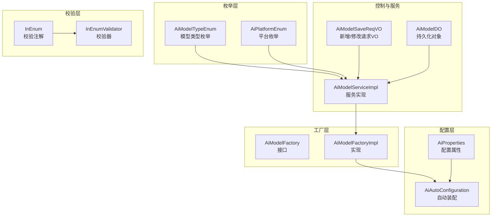
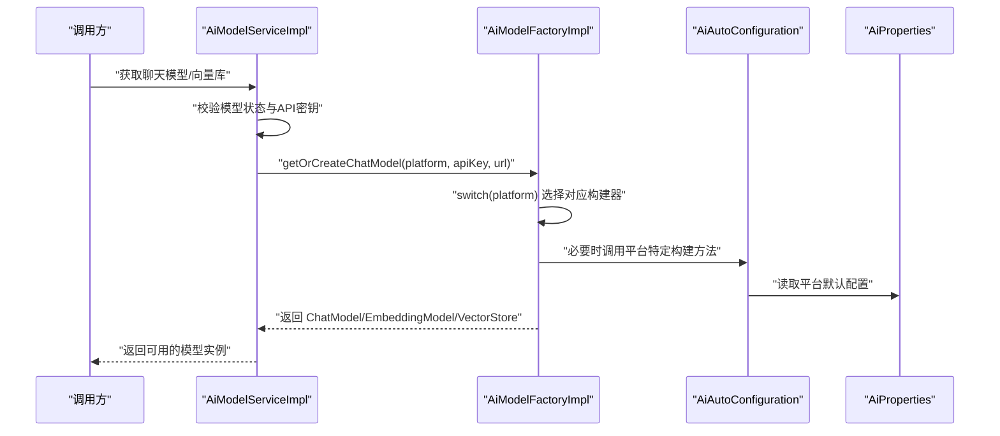
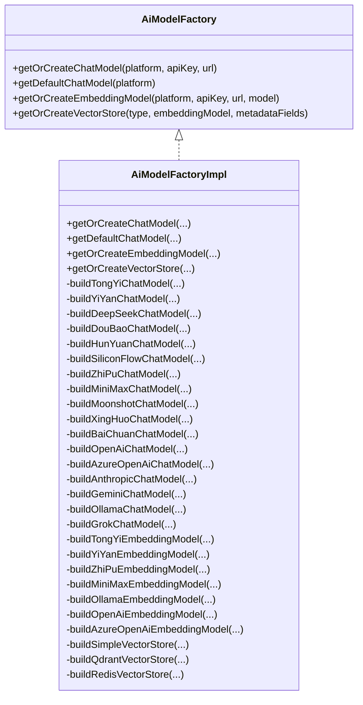
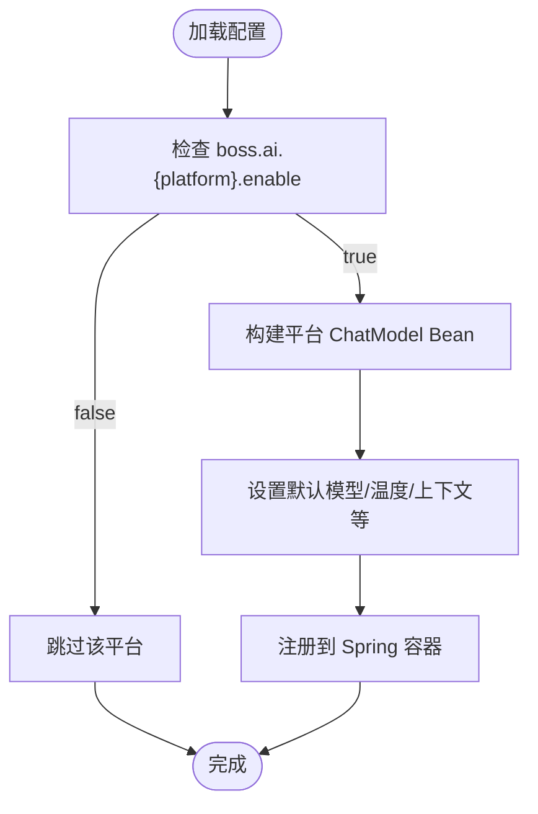
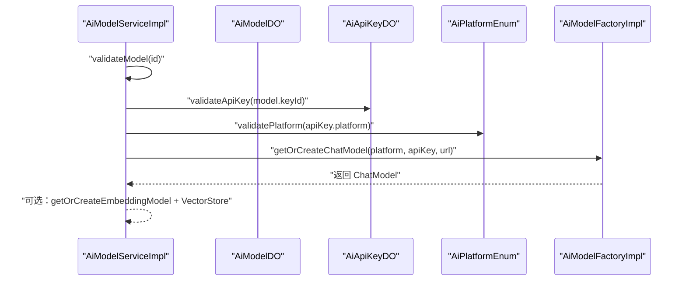
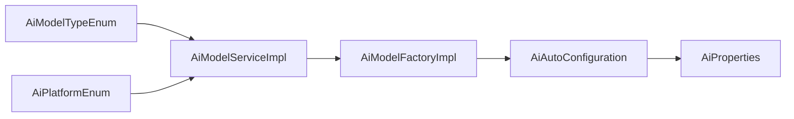

# 模型类型与平台配置

<cite>
**本文引用的文件**
- [AiModelTypeEnum.java](file://src/main/java/cn/boss/data/ai/enums/model/AiModelTypeEnum.java)
- [AiPlatformEnum.java](file://src/main/java/cn/boss/data/ai/enums/model/AiPlatformEnum.java)
- [AiModelFactory.java](file://src/main/java/cn/boss/data/ai/framework/ai/core/model/AiModelFactory.java)
- [AiModelFactoryImpl.java](file://src/main/java/cn/boss/data/ai/framework/ai/core/model/AiModelFactoryImpl.java)
- [AiAutoConfiguration.java](file://src/main/java/cn/boss/data/ai/framework/ai/config/AiAutoConfiguration.java)
- [AiProperties.java](file://src/main/java/cn/boss/data/ai/framework/ai/config/AiProperties.java)
- [InEnum.java](file://src/main/java/cn/boss/data/ai/framework/common/validation/InEnum.java)
- [InEnumValidator.java](file://src/main/java/cn/boss/data/ai/framework/common/validation/InEnumValidator.java)
- [AiModelSaveReqVO.java](file://src/main/java/cn/boss/data/ai/controller/model/vo/model/AiModelSaveReqVO.java)
- [AiModelDO.java](file://src/main/java/cn/boss/data/ai/dal/dataobject/model/AiModelDO.java)
- [AiModelServiceImpl.java](file://src/main/java/cn/boss/data/ai/service/model/AiModelServiceImpl.java)
- [application.yml](file://src/main/resources/application.yml)
</cite>

## 目录
1. [简介](#简介)
2. [项目结构](#项目结构)
3. [核心组件](#核心组件)
4. [架构总览](#架构总览)
5. [详细组件分析](#详细组件分析)
6. [依赖关系分析](#依赖关系分析)
7. [性能考量](#性能考量)
8. [故障排查指南](#故障排查指南)
9. [结论](#结论)
10. [附录](#附录)

## 简介
本技术文档围绕“模型类型与平台配置”主题，系统阐述以下内容：
- AiModelTypeEnum 枚举的设计与用途：模型类型的分类标准、业务语义与应用场景。
- AiPlatformEnum 枚举的定义与平台标识符管理：国内外主流平台的统一标识与校验机制。
- 模型类型与平台之间的映射关系与兼容性检查机制：如何通过枚举与工厂实现平台适配与模型实例化。
- 配置项的验证规则与默认值设置：基于注解与自动配置的约束与默认行为。
- 枚举在模型工厂选择算法中的作用与影响：工厂如何依据平台枚举构建具体客户端。
- 新增模型类型与平台的扩展方法与最佳实践：如何安全地扩展类型与平台。
- 配置管理的版本控制与迁移策略：基于配置文件与自动装配的演进方式。

## 项目结构
本项目采用分层+按功能域组织的结构，其中与“模型类型与平台配置”直接相关的核心模块如下：
- 枚举层：AiModelTypeEnum、AiPlatformEnum 提供类型与平台的强类型标识。
- 工厂层：AiModelFactory 及其实现 AiModelFactoryImpl 负责根据平台与配置创建 ChatModel、EmbeddingModel 与 VectorStore。
- 配置层：AiAutoConfiguration 与 AiProperties 提供平台级默认配置与 Bean 注册。
- 控制层与服务层：AiModelSaveReqVO、AiModelDO、AiModelServiceImpl 将枚举与工厂串联到业务流程中。
- 校验层：InEnum 与 InEnumValidator 提供基于枚举数组的参数校验能力。

图表来源
- [AiModelTypeEnum.java:14-39](file://src/main/java/cn/boss/data/ai/enums/model/AiModelTypeEnum.java#L14-L39)
- [AiPlatformEnum.java:14-70](file://src/main/java/cn/boss/data/ai/enums/model/AiPlatformEnum.java#L14-L70)
- [AiModelFactory.java:13-62](file://src/main/java/cn/boss/data/ai/framework/ai/core/model/AiModelFactory.java#L13-L62)
- [AiModelFactoryImpl.java:113-245](file://src/main/java/cn/boss/data/ai/framework/ai/core/model/AiModelFactoryImpl.java#L113-L245)
- [AiAutoConfiguration.java:50-90](file://src/main/java/cn/boss/data/ai/framework/ai/config/AiAutoConfiguration.java#L50-L90)
- [AiProperties.java:11-134](file://src/main/java/cn/boss/data/ai/framework/ai/config/AiProperties.java#L11-L134)
- [AiModelSaveReqVO.java:14-32](file://src/main/java/cn/boss/data/ai/controller/model/vo/model/AiModelSaveReqVO.java#L14-L32)
- [AiModelDO.java:21-59](file://src/main/java/cn/boss/data/ai/dal/dataobject/model/AiModelDO.java#L21-L59)
- [AiModelServiceImpl.java:32-129](file://src/main/java/cn/boss/data/ai/service/model/AiModelServiceImpl.java#L32-L129)
- [InEnum.java:22-32](file://src/main/java/cn/boss/data/ai/framework/common/validation/InEnum.java#L22-L32)
- [InEnumValidator.java:11-39](file://src/main/java/cn/boss/data/ai/framework/common/validation/InEnumValidator.java#L11-L39)

章节来源
- [AiModelTypeEnum.java:14-39](file://src/main/java/cn/boss/data/ai/enums/model/AiModelTypeEnum.java#L14-L39)
- [AiPlatformEnum.java:14-70](file://src/main/java/cn/boss/data/ai/enums/model/AiPlatformEnum.java#L14-L70)
- [AiModelFactory.java:13-62](file://src/main/java/cn/boss/data/ai/framework/ai/core/model/AiModelFactory.java#L13-L62)
- [AiModelFactoryImpl.java:113-245](file://src/main/java/cn/boss/data/ai/framework/ai/core/model/AiModelFactoryImpl.java#L113-L245)
- [AiAutoConfiguration.java:50-90](file://src/main/java/cn/boss/data/ai/framework/ai/config/AiAutoConfiguration.java#L50-L90)
- [AiProperties.java:11-134](file://src/main/java/cn/boss/data/ai/framework/ai/config/AiProperties.java#L11-L134)
- [AiModelSaveReqVO.java:14-32](file://src/main/java/cn/boss/data/ai/controller/model/vo/model/AiModelSaveReqVO.java#L14-L32)
- [AiModelDO.java:21-59](file://src/main/java/cn/boss/data/ai/dal/dataobject/model/AiModelDO.java#L21-L59)
- [AiModelServiceImpl.java:32-129](file://src/main/java/cn/boss/data/ai/service/model/AiModelServiceImpl.java#L32-129)
- [InEnum.java:22-32](file://src/main/java/cn/boss/data/ai/framework/common/validation/InEnum.java#L22-L32)
- [InEnumValidator.java:11-39](file://src/main/java/cn/boss/data/ai/framework/common/validation/InEnumValidator.java#L11-L39)

## 核心组件
- 模型类型枚举 AiModelTypeEnum：定义对话、图片、语音、视频、向量、重排序等类型，提供整型类型码与中文名称，并暴露可遍历的数组。
- 平台枚举 AiPlatformEnum：统一国内/国外平台标识，提供平台码与名称，内置 validatePlatform 校验方法与可遍历数组。
- 工厂接口与实现 AiModelFactory / AiModelFactoryImpl：根据平台枚举与配置创建 ChatModel、EmbeddingModel、VectorStore；内部以单例缓存提升性能。
- 自动装配与配置 AiAutoConfiguration / AiProperties：按平台注册默认 Bean，处理默认模型、温度、最大上下文等参数。
- 请求与数据对象 AiModelSaveReqVO / AiModelDO：承载模型新增/修改请求与持久化字段，包含类型与平台字段。
- 参数校验 InEnum / InEnumValidator：基于枚举数组对入参进行合法性校验。

章节来源
- [AiModelTypeEnum.java:14-39](file://src/main/java/cn/boss/data/ai/enums/model/AiModelTypeEnum.java#L14-L39)
- [AiPlatformEnum.java:14-70](file://src/main/java/cn/boss/data/ai/enums/model/AiPlatformEnum.java#L14-L70)
- [AiModelFactory.java:13-62](file://src/main/java/cn/boss/data/ai/framework/ai/core/model/AiModelFactory.java#L13-L62)
- [AiModelFactoryImpl.java:113-245](file://src/main/java/cn/boss/data/ai/framework/ai/core/model/AiModelFactoryImpl.java#L113-L245)
- [AiAutoConfiguration.java:50-90](file://src/main/java/cn/boss/data/ai/framework/ai/config/AiAutoConfiguration.java#L50-L90)
- [AiProperties.java:11-134](file://src/main/java/cn/boss/data/ai/framework/ai/config/AiProperties.java#L11-L134)
- [AiModelSaveReqVO.java:14-32](file://src/main/java/cn/boss/data/ai/controller/model/vo/model/AiModelSaveReqVO.java#L14-L32)
- [AiModelDO.java:21-59](file://src/main/java/cn/boss/data/ai/dal/dataobject/model/AiModelDO.java#L21-L59)
- [InEnum.java:22-32](file://src/main/java/cn/boss/data/ai/framework/common/validation/InEnum.java#L22-L32)
- [InEnumValidator.java:11-39](file://src/main/java/cn/boss/data/ai/framework/common/validation/InEnumValidator.java#L11-L39)

## 架构总览
下图展示从请求到模型实例化的整体流程，以及工厂如何依据平台枚举选择具体实现。

图表来源
- [AiModelServiceImpl.java:110-126](file://src/main/java/cn/boss/data/ai/service/model/AiModelServiceImpl.java#L110-L126)
- [AiModelFactoryImpl.java:115-200](file://src/main/java/cn/boss/data/ai/framework/ai/core/model/AiModelFactoryImpl.java#L115-L200)
- [AiAutoConfiguration.java:65-91](file://src/main/java/cn/boss/data/ai/framework/ai/config/AiAutoConfiguration.java#L65-L91)
- [AiProperties.java:11-134](file://src/main/java/cn/boss/data/ai/framework/ai/config/AiProperties.java#L11-L134)

## 详细组件分析

### 模型类型枚举 AiModelTypeEnum
- 设计要点
  - 使用整型类型码与中文名称，便于数据库存储与前端展示。
  - 实现 ArrayValuable<Integer>，提供可遍历数组，支撑参数校验与列表渲染。
- 分类标准与应用场景
  - 对话：面向聊天类模型，如通义、文心、OpenAI、Gemini 等。
  - 图片/语音/视频：面向多模态或图像生成平台（如 Stable Diffusion、Midjourney）。
  - 向量：嵌入模型，用于向量化与检索。
  - 重排序：重排模型，用于二次排序优化。
- 复杂度与性能
  - 枚举数组预计算，校验与遍历均为 O(n)（n 为枚举数量），常数较小，性能开销可忽略。

章节来源
- [AiModelTypeEnum.java:14-39](file://src/main/java/cn/boss/data/ai/enums/model/AiModelTypeEnum.java#L14-L39)

### 平台枚举 AiPlatformEnum
- 设计要点
  - 国内平台与国外平台分组，统一平台码与名称，便于跨环境适配。
  - 提供 validatePlatform 方法，集中处理非法平台异常。
  - 实现 ArrayValuable<String>，支持基于平台码的校验与过滤。
- 平台标识符管理
  - 国内：通义、文心、DeepSeek、智谱、星火、豆包、混元、硅基流动、MiniMax、月之暗面、百川。
  - 国外：OpenAI、AzureOpenAI、Anthropic、Gemini、Ollama、StableDiffusion、Midjourney、Suno、Grok。
- 兼容性检查机制
  - 在服务层与控制器层通过 AiPlatformEnum.validatePlatform 进行统一校验，避免非法平台进入工厂。

章节来源
- [AiPlatformEnum.java:14-70](file://src/main/java/cn/boss/data/ai/enums/model/AiPlatformEnum.java#L14-L70)

### 工厂接口与实现 AiModelFactory / AiModelFactoryImpl
- 工厂接口职责
  - 提供获取/创建 ChatModel、EmbeddingModel、VectorStore 的统一入口。
  - 支持基于默认配置与指定配置两种模式。
- 工厂实现设计
  - 内部以单例缓存（基于平台、密钥、URL、模型等组合键）避免重复创建，降低资源消耗。
  - 通过 switch(platform) 选择对应平台构建器，确保平台隔离与配置独立。
  - 针对不同平台提供专用构建方法（如通义、文心、DeepSeek、豆包、混元、硅基流动、智谱、MiniMax、月之暗面、星火、百川、OpenAI、AzureOpenAI、Anthropic、Gemini、Ollama、Grok）。
  - 向量库支持 Simple、Qdrant、Redis 三种类型，按需选择。
- 与 Spring AI 集成
  - 通过 AiAutoConfiguration 注册平台 Bean，工厂在需要时复用或委托自动装配结果。

图表来源
- [AiModelFactory.java:13-62](file://src/main/java/cn/boss/data/ai/framework/ai/core/model/AiModelFactory.java#L13-L62)
- [AiModelFactoryImpl.java:113-568](file://src/main/java/cn/boss/data/ai/framework/ai/core/model/AiModelFactoryImpl.java#L113-L568)

章节来源
- [AiModelFactory.java:13-62](file://src/main/java/cn/boss/data/ai/framework/ai/core/model/AiModelFactory.java#L13-L62)
- [AiModelFactoryImpl.java:113-568](file://src/main/java/cn/boss/data/ai/framework/ai/core/model/AiModelFactoryImpl.java#L113-L568)

### 自动装配与配置 AiAutoConfiguration / AiProperties
- 自动装配
  - 条件化注册各平台 ChatModel Bean，仅当配置开关开启时生效。
  - 提供默认模型、温度、最大上下文等参数的默认值设置。
- 配置属性
  - 以 boss.ai.* 为前缀，按平台拆分子配置，包含启用开关、API Key、模型、温度、最大 tokens、topP 等。
  - application.yml 中提供示例配置，便于快速启动与调试。

图表来源
- [AiAutoConfiguration.java:65-91](file://src/main/java/cn/boss/data/ai/framework/ai/config/AiAutoConfiguration.java#L65-L91)
- [AiProperties.java:11-134](file://src/main/java/cn/boss/data/ai/framework/ai/config/AiProperties.java#L11-L134)
- [application.yml:150-190](file://src/main/resources/application.yml#L150-L190)

章节来源
- [AiAutoConfiguration.java:50-90](file://src/main/java/cn/boss/data/ai/framework/ai/config/AiAutoConfiguration.java#L50-L90)
- [AiProperties.java:11-134](file://src/main/java/cn/boss/data/ai/framework/ai/config/AiProperties.java#L11-L134)
- [application.yml:150-190](file://src/main/resources/application.yml#L150-L190)

### 参数校验 InEnum 与 InEnumValidator
- InEnum 注解
  - 通过 value 指定枚举类型，运行时由 InEnumValidator 校验入参是否在枚举数组范围内。
- InEnumValidator
  - 初始化阶段读取枚举数组，运行时进行包含性判断；不匹配时返回带枚举范围信息的错误消息。
- 在模型保存请求中的应用
  - AiModelSaveReqVO 中对平台字段使用 @InEnum 注解，结合 AiPlatformEnum.array() 实现参数合法性校验。

章节来源
- [InEnum.java:22-32](file://src/main/java/cn/boss/data/ai/framework/common/validation/InEnum.java#L22-L32)
- [InEnumValidator.java:11-39](file://src/main/java/cn/boss/data/ai/framework/common/validation/InEnumValidator.java#L11-L39)
- [AiModelSaveReqVO.java:14-32](file://src/main/java/cn/boss/data/ai/controller/model/vo/model/AiModelSaveReqVO.java#L14-L32)

### 服务层集成与工厂选择算法
- 服务层职责
  - 校验模型存在性与状态，校验 API 密钥有效性，解析平台与模型标识。
  - 调用工厂创建 ChatModel 或 EmbeddingModel，并进一步构建 VectorStore。
- 工厂选择算法
  - 依据 AiPlatformEnum.platform 值进行 switch 分发，选择对应平台构建器。
  - 对于需要默认 Bean 的场景，优先从 Spring 容器获取，减少重复初始化。

图表来源
- [AiModelServiceImpl.java:110-126](file://src/main/java/cn/boss/data/ai/service/model/AiModelServiceImpl.java#L110-L126)
- [AiModelFactoryImpl.java:115-200](file://src/main/java/cn/boss/data/ai/framework/ai/core/model/AiModelFactoryImpl.java#L115-L200)

章节来源
- [AiModelServiceImpl.java:110-126](file://src/main/java/cn/boss/data/ai/service/model/AiModelServiceImpl.java#L110-L126)
- [AiModelFactoryImpl.java:115-200](file://src/main/java/cn/boss/data/ai/framework/ai/core/model/AiModelFactoryImpl.java#L115-L200)

## 依赖关系分析
- 枚举与服务层
  - AiModelServiceImpl 依赖 AiPlatformEnum.validatePlatform 与 AiModelTypeEnum 的数组能力进行参数与类型校验。
- 工厂与自动装配
  - AiModelFactoryImpl 在构建过程中可能依赖 AiAutoConfiguration 注册的 Bean，或直接构造平台客户端。
- 配置与平台
  - AiAutoConfiguration 读取 AiProperties 中的平台配置，为工厂与客户端提供默认参数。

图表来源
- [AiModelTypeEnum.java:14-39](file://src/main/java/cn/boss/data/ai/enums/model/AiModelTypeEnum.java#L14-L39)
- [AiPlatformEnum.java:14-70](file://src/main/java/cn/boss/data/ai/enums/model/AiPlatformEnum.java#L14-L70)
- [AiModelServiceImpl.java:110-126](file://src/main/java/cn/boss/data/ai/service/model/AiModelServiceImpl.java#L110-L126)
- [AiModelFactoryImpl.java:113-245](file://src/main/java/cn/boss/data/ai/framework/ai/core/model/AiModelFactoryImpl.java#L113-L245)
- [AiAutoConfiguration.java:65-91](file://src/main/java/cn/boss/data/ai/framework/ai/config/AiAutoConfiguration.java#L65-L91)
- [AiProperties.java:11-134](file://src/main/java/cn/boss/data/ai/framework/ai/config/AiProperties.java#L11-L134)

章节来源
- [AiModelServiceImpl.java:110-126](file://src/main/java/cn/boss/data/ai/service/model/AiModelServiceImpl.java#L110-L126)
- [AiModelFactoryImpl.java:113-245](file://src/main/java/cn/boss/data/ai/framework/ai/core/model/AiModelFactoryImpl.java#L113-L245)
- [AiAutoConfiguration.java:65-91](file://src/main/java/cn/boss/data/ai/framework/ai/config/AiAutoConfiguration.java#L65-L91)
- [AiProperties.java:11-134](file://src/main/java/cn/boss/data/ai/framework/ai/config/AiProperties.java#L11-L134)

## 性能考量
- 单例缓存
  - 工厂通过组合键缓存 ChatModel、EmbeddingModel、VectorStore，避免重复创建带来的网络与内存开销。
- 默认配置与延迟初始化
  - 自动装配仅在启用开关打开时创建 Bean，减少不必要的初始化成本。
- 向量存储持久化
  - SimpleVectorStore 定期定时写盘，避免频繁 IO；Redis/Qdrant 通过连接池与批处理策略优化吞吐。

章节来源
- [AiModelFactoryImpl.java:247-252](file://src/main/java/cn/boss/data/ai/framework/ai/core/model/AiModelFactoryImpl.java#L247-L252)
- [AiAutoConfiguration.java:65-91](file://src/main/java/cn/boss/data/ai/framework/ai/config/AiAutoConfiguration.java#L65-L91)
- [AiModelFactoryImpl.java:467-486](file://src/main/java/cn/boss/data/ai/framework/ai/core/model/AiModelFactoryImpl.java#L467-L486)

## 故障排查指南
- 平台非法
  - 现象：抛出非法平台异常。
  - 排查：确认 AiPlatformEnum.validatePlatform 输入值是否在枚举范围内；检查配置文件与请求参数大小写与拼写。
- 模型未启用或禁用
  - 现象：获取模型失败或返回默认模型不存在。
  - 排查：检查 boss.ai.{platform}.enable 是否为 true；确认 AiModelDO.status 是否为启用状态。
- 配置缺失
  - 现象：默认模型为空或参数未生效。
  - 排查：核对 application.yml 中 boss.ai.{platform} 下的 api-key、model、temperature、maxTokens、topP 等字段。
- 向量存储初始化失败
  - 现象：Redis/Qdrant 初始化报错或无法写入。
  - 排查：确认 Redis/Qdrant 地址、端口、认证信息与索引/集合名称正确；检查网络连通性与权限。

章节来源
- [AiPlatformEnum.java:56-63](file://src/main/java/cn/boss/data/ai/enums/model/AiPlatformEnum.java#L56-L63)
- [AiModelServiceImpl.java:94-101](file://src/main/java/cn/boss/data/ai/service/model/AiModelServiceImpl.java#L94-L101)
- [AiAutoConfiguration.java:72-91](file://src/main/java/cn/boss/data/ai/framework/ai/config/AiAutoConfiguration.java#L72-L91)
- [application.yml:150-190](file://src/main/resources/application.yml#L150-L190)

## 结论
本方案通过强类型的模型类型与平台枚举，配合工厂与自动装配机制，实现了对多平台、多模型的统一抽象与高效实例化。参数校验与默认配置保障了系统的健壮性与易用性。通过本文档提供的扩展与迁移建议，可在不破坏现有兼容性的前提下平滑引入新类型与新平台。

## 附录

### 新增模型类型与平台的扩展方法与最佳实践
- 新增模型类型
  - 在 AiModelTypeEnum 中增加新类型，并补充中文名称；如需参与参数校验，确保数组可被读取。
  - 如涉及新的向量/重排序能力，需在工厂与服务层相应扩展。
- 新增平台
  - 在 AiPlatformEnum 中新增平台枚举项，提供平台码与名称；实现 validatePlatform 校验。
  - 在 AiModelFactoryImpl.switch 中新增分支，编写对应的构建方法（ChatModel/EmbeddingModel/VectorStore）。
  - 在 AiAutoConfiguration 中添加条件化 Bean 与默认配置；在 AiProperties 中新增子配置段。
  - 在 application.yml 中补充示例配置，便于快速验证。
  - 在 AiModelSaveReqVO 中对平台字段使用 @InEnum 注解，确保参数校验覆盖新增平台。
- 最佳实践
  - 平台构建方法应尽量复用 Spring AI 提供的客户端，减少重复封装。
  - 默认参数应具备合理的缺省值，避免空指针与异常。
  - 缓存键设计需包含所有影响实例差异的关键参数，防止误复用。

章节来源
- [AiModelTypeEnum.java:14-39](file://src/main/java/cn/boss/data/ai/enums/model/AiModelTypeEnum.java#L14-L39)
- [AiPlatformEnum.java:14-70](file://src/main/java/cn/boss/data/ai/enums/model/AiPlatformEnum.java#L14-L70)
- [AiModelFactoryImpl.java:115-200](file://src/main/java/cn/boss/data/ai/framework/ai/core/model/AiModelFactoryImpl.java#L115-L200)
- [AiAutoConfiguration.java:65-91](file://src/main/java/cn/boss/data/ai/framework/ai/config/AiAutoConfiguration.java#L65-L91)
- [AiProperties.java:11-134](file://src/main/java/cn/boss/data/ai/framework/ai/config/AiProperties.java#L11-L134)
- [AiModelSaveReqVO.java:14-32](file://src/main/java/cn/boss/data/ai/controller/model/vo/model/AiModelSaveReqVO.java#L14-L32)

### 配置管理的版本控制与迁移策略
- 版本控制
  - 将 boss.ai.* 配置纳入版本控制系统，每次变更记录变更原因与影响范围。
- 迁移策略
  - 新增平台时先在测试环境启用开关，逐步放开生产；旧平台配置保留过渡期。
  - 默认参数调整需谨慎，可通过环境变量或配置中心灰度发布。
  - 对向量存储配置变更（如 Redis/Qdrant），提前评估索引/集合迁移成本与停机窗口。

章节来源
- [AiAutoConfiguration.java:65-91](file://src/main/java/cn/boss/data/ai/framework/ai/config/AiAutoConfiguration.java#L65-L91)
- [AiProperties.java:11-134](file://src/main/java/cn/boss/data/ai/framework/ai/config/AiProperties.java#L11-L134)
- [application.yml:150-190](file://src/main/resources/application.yml#L150-L190)