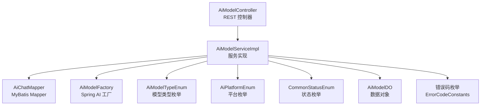
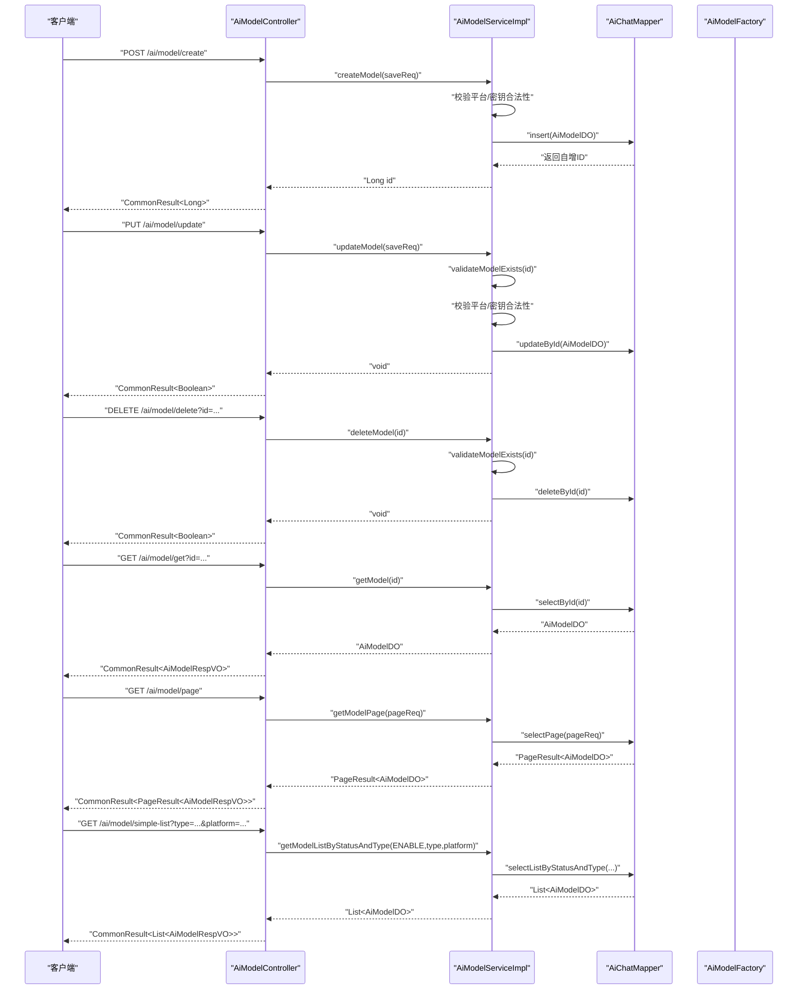
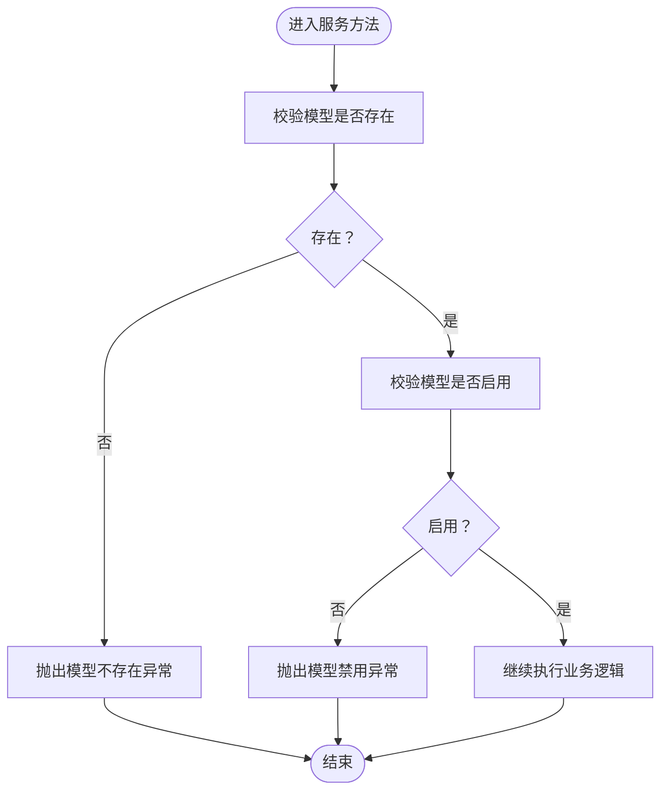
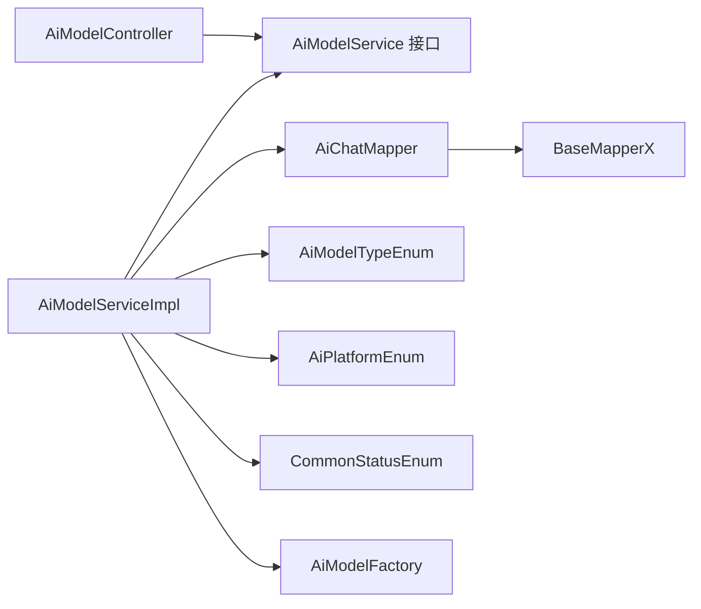

# 模型配置管理

<cite>
**本文引用的文件**
- [AiModelController.java](file://src/main/java/cn/boss/data/ai/controller/model/AiModelController.java)
- [AiModelService.java](file://src/main/java/cn/boss/data/ai/service/model/AiModelService.java)
- [AiModelServiceImpl.java](file://src/main/java/cn/boss/data/ai/service/model/AiModelServiceImpl.java)
- [AiModelDO.java](file://src/main/java/cn/boss/data/ai/dal/dataobject/model/AiModelDO.java)
- [AiModelSaveReqVO.java](file://src/main/java/cn/boss/data/ai/controller/model/vo/model/AiModelSaveReqVO.java)
- [AiModelRespVO.java](file://src/main/java/cn/boss/data/ai/controller/model/vo/model/AiModelRespVO.java)
- [AiModelPageReqVO.java](file://src/main/java/cn/boss/data/ai/controller/model/vo/model/AiModelPageReqVO.java)
- [AiModelTypeEnum.java](file://src/main/java/cn/boss/data/ai/enums/model/AiModelTypeEnum.java)
- [AiPlatformEnum.java](file://src/main/java/cn/boss/data/ai/enums/model/AiPlatformEnum.java)
- [CommonStatusEnum.java](file://src/main/java/cn/boss/data/ai/framework/common/enums/CommonStatusEnum.java)
- [AiChatMapper.java](file://src/main/java/cn/boss/data/ai/dal/mysql/model/AiChatMapper.java)
- [BaseMapperX.java](file://src/main/java/cn/boss/data/ai/framework/mybatis/core/mapper/BaseMapperX.java)
- [PageResult.java](file://src/main/java/cn/boss/data/ai/framework/common/pojo/PageResult.java)
- [ErrorCodeConstants.java](file://src/main/java/cn/boss/data/ai/enums/ErrorCodeConstants.java)
- [GlobalErrorCodeConstants.java](file://src/main/java/cn/boss/data/ai/framework/common/exception/enums/GlobalErrorCodeConstants.java)
- [AiModelFactory.java](file://src/main/java/cn/boss/data/ai/framework/ai/core/model/AiModelFactory.java)
</cite>

## 目录
1. [简介](#简介)
2. [项目结构](#项目结构)
3. [核心组件](#核心组件)
4. [架构总览](#架构总览)
5. [详细组件分析](#详细组件分析)
6. [依赖分析](#依赖分析)
7. [性能考虑](#性能考虑)
8. [故障排查指南](#故障排查指南)
9. [结论](#结论)
10. [附录](#附录)

## 简介
本技术文档围绕“模型配置管理”功能，系统性阐述从控制器到服务层、数据访问层以及数据对象的完整实现，覆盖模型的创建、更新、删除、查询与分页等操作；同时说明 REST API 设计、数据校验与业务规则、错误处理策略、权限与安全验证机制，以及与 Spring AI 的集成能力（对话模型与向量存储）。文档面向开发与运维人员，兼顾可读性与可操作性。

## 项目结构
模型配置管理功能主要分布在以下层次：
- 控制器层：AiModelController 提供 REST API
- 服务层：AiModelService 及其实现 AiModelServiceImpl 执行业务逻辑
- 数据访问层：AiChatMapper 基于 MyBatis 扩展 BaseMapperX 进行分页与筛选
- 数据对象层：AiModelDO 映射数据库表，配合 VO 对象用于请求与响应
- 枚举与常量：AiModelTypeEnum、AiPlatformEnum、CommonStatusEnum、错误码等
- 集成适配：AiModelFactory 将平台与密钥映射为 Spring AI 的 ChatModel/VectorStore

图表来源
- [AiModelController.java:25-83](file://src/main/java/cn/boss/data/ai/controller/model/AiModelController.java#L25-L83)
- [AiModelServiceImpl.java:30-128](file://src/main/java/cn/boss/data/ai/service/model/AiModelServiceImpl.java#L30-L128)
- [AiChatMapper.java:17-45](file://src/main/java/cn/boss/data/ai/dal/mysql/model/AiChatMapper.java#L17-L45)
- [AiModelFactory.java:13-62](file://src/main/java/cn/boss/data/ai/framework/ai/core/model/AiModelFactory.java#L13-L62)
- [AiModelDO.java:21-59](file://src/main/java/cn/boss/data/ai/dal/dataobject/model/AiModelDO.java#L21-L59)
- [AiModelTypeEnum.java:14-39](file://src/main/java/cn/boss/data/ai/enums/model/AiModelTypeEnum.java#L14-L39)
- [AiPlatformEnum.java:14-70](file://src/main/java/cn/boss/data/ai/enums/model/AiPlatformEnum.java#L14-L70)
- [CommonStatusEnum.java:12-35](file://src/main/java/cn/boss/data/ai/framework/common/enums/CommonStatusEnum.java#L12-L35)
- [ErrorCodeConstants.java:10-49](file://src/main/java/cn/boss/data/ai/enums/ErrorCodeConstants.java#L10-L49)

章节来源
- [AiModelController.java:25-83](file://src/main/java/cn/boss/data/ai/controller/model/AiModelController.java#L25-L83)
- [AiModelServiceImpl.java:30-128](file://src/main/java/cn/boss/data/ai/service/model/AiModelServiceImpl.java#L30-L128)
- [AiChatMapper.java:17-45](file://src/main/java/cn/boss/data/ai/dal/mysql/model/AiChatMapper.java#L17-L45)

## 核心组件
- REST 控制器：AiModelController 提供模型的增删改查与分页、简单列表等接口，统一返回 CommonResult 包裹的数据或分页结果。
- 服务层：AiModelServiceImpl 实现业务规则，包括模型存在性校验、状态校验、平台与密钥校验、分页查询、默认模型获取、与 Spring AI 的集成。
- 数据访问层：AiChatMapper 基于 BaseMapperX 提供分页、按状态与类型筛选、按首条启用模型等便捷方法。
- 数据对象：AiModelDO 描述模型记录的字段与约束；配合 AiModelSaveReqVO/AiModelRespVO 完成请求与响应转换。
- 枚举与校验：AiModelTypeEnum、AiPlatformEnum、CommonStatusEnum 保证类型与取值合法；全局错误码与业务错误码统一异常处理。
- 集成适配：AiModelFactory 将平台、密钥与模型标识映射为 Spring AI 的 ChatModel/EmbeddingModel/VectorStore。

章节来源
- [AiModelController.java:34-81](file://src/main/java/cn/boss/data/ai/controller/model/AiModelController.java#L34-L81)
- [AiModelService.java:18-43](file://src/main/java/cn/boss/data/ai/service/model/AiModelService.java#L18-L43)
- [AiModelServiceImpl.java:44-128](file://src/main/java/cn/boss/data/ai/service/model/AiModelServiceImpl.java#L44-L128)
- [AiModelDO.java:21-59](file://src/main/java/cn/boss/data/ai/dal/dataobject/model/AiModelDO.java#L21-L59)
- [AiModelSaveReqVO.java:14-59](file://src/main/java/cn/boss/data/ai/controller/model/vo/model/AiModelSaveReqVO.java#L14-L59)
- [AiModelRespVO.java:10-48](file://src/main/java/cn/boss/data/ai/controller/model/vo/model/AiModelRespVO.java#L10-L48)
- [AiModelTypeEnum.java:14-39](file://src/main/java/cn/boss/data/ai/enums/model/AiModelTypeEnum.java#L14-L39)
- [AiPlatformEnum.java:14-70](file://src/main/java/cn/boss/data/ai/enums/model/AiPlatformEnum.java#L14-L70)
- [CommonStatusEnum.java:12-35](file://src/main/java/cn/boss/data/ai/framework/common/enums/CommonStatusEnum.java#L12-L35)
- [AiChatMapper.java:28-43](file://src/main/java/cn/boss/data/ai/dal/mysql/model/AiChatMapper.java#L28-L43)
- [BaseMapperX.java:25-62](file://src/main/java/cn/boss/data/ai/framework/mybatis/core/mapper/BaseMapperX.java#L25-L62)
- [ErrorCodeConstants.java:16-21](file://src/main/java/cn/boss/data/ai/enums/ErrorCodeConstants.java#L16-L21)
- [AiModelFactory.java:13-62](file://src/main/java/cn/boss/data/ai/framework/ai/core/model/AiModelFactory.java#L13-L62)

## 架构总览
下图展示模型配置管理的端到端调用链路：客户端通过 REST API 调用控制器，控制器委托服务层执行业务逻辑，服务层通过 Mapper 访问数据库，并在需要时与 Spring AI 工厂进行集成。

图表来源
- [AiModelController.java:34-81](file://src/main/java/cn/boss/data/ai/controller/model/AiModelController.java#L34-L81)
- [AiModelServiceImpl.java:44-128](file://src/main/java/cn/boss/data/ai/service/model/AiModelServiceImpl.java#L44-L128)
- [AiChatMapper.java:28-43](file://src/main/java/cn/boss/data/ai/dal/mysql/model/AiChatMapper.java#L28-L43)

## 详细组件分析

### REST API 设计
- 基础路径：/ai/model
- 创建模型
  - 方法：POST
  - 路径：/create
  - 请求体：AiModelSaveReqVO
  - 响应：CommonResult<Long>（返回新模型ID）
- 更新模型
  - 方法：PUT
  - 路径：/update
  - 请求体：AiModelSaveReqVO
  - 响应：CommonResult<Boolean>
- 删除模型
  - 方法：DELETE
  - 路径：/delete
  - 查询参数：id（Long，必填）
  - 响应：CommonResult<Boolean>
- 获取模型
  - 方法：GET
  - 路径：/get
  - 查询参数：id（Long，必填）
  - 响应：CommonResult<AiModelRespVO>
- 分页查询
  - 方法：GET
  - 路径：/page
  - 查询参数：AiModelPageReqVO（支持 name、model、platform 等筛选）
  - 响应：CommonResult<PageResult<AiModelRespVO>>
- 简单列表
  - 方法：GET
  - 路径：/simple-list
  - 查询参数：type（Integer，必填）、platform（String，可选）
  - 响应：CommonResult<List<AiModelRespVO>>（仅包含 id、name、model、platform）

章节来源
- [AiModelController.java:34-81](file://src/main/java/cn/boss/data/ai/controller/model/AiModelController.java#L34-L81)
- [AiModelPageReqVO.java:9-20](file://src/main/java/cn/boss/data/ai/controller/model/vo/model/AiModelPageReqVO.java#L9-L20)
- [AiModelRespVO.java:10-48](file://src/main/java/cn/boss/data/ai/controller/model/vo/model/AiModelRespVO.java#L10-L48)

### 服务层逻辑（AiModelService/AiModelServiceImpl）
- 创建模型
  - 校验平台合法性（AiPlatformEnum.validatePlatform）
  - 校验密钥存在与可用（apiKeyService.validateApiKey）
  - 写入数据库（AiChatMapper.insert），返回自增ID
- 更新模型
  - 校验模型存在（validateModelExists）
  - 校验平台与密钥
  - 更新数据库记录
- 删除模型
  - 校验模型存在
  - 删除记录
- 查询与分页
  - 单条查询：AiChatMapper.selectById
  - 默认模型：AiChatMapper.selectFirstByStatus（按类型与启用状态取第一条）
  - 分页：AiChatMapper.selectPage（支持模糊匹配与排序）
  - 简单列表：AiChatMapper.selectListByStatusAndType（按状态、类型、平台筛选）
- 状态与存在性校验
  - validateModel：若禁用则抛出业务异常
  - getRequiredDefaultModel：若无默认模型则抛出业务异常
- 与 Spring AI 集成
  - getChatModel：基于模型与密钥获取 ChatModel
  - getOrCreateVectorStore：基于嵌入模型创建 VectorStore

图表来源
- [AiModelServiceImpl.java:67-101](file://src/main/java/cn/boss/data/ai/service/model/AiModelServiceImpl.java#L67-L101)
- [ErrorCodeConstants.java:17-20](file://src/main/java/cn/boss/data/ai/enums/ErrorCodeConstants.java#L17-L20)

章节来源
- [AiModelService.java:18-43](file://src/main/java/cn/boss/data/ai/service/model/AiModelService.java#L18-L43)
- [AiModelServiceImpl.java:44-128](file://src/main/java/cn/boss/data/ai/service/model/AiModelServiceImpl.java#L44-L128)
- [AiChatMapper.java:20-43](file://src/main/java/cn/boss/data/ai/dal/mysql/model/AiChatMapper.java#L20-L43)
- [ErrorCodeConstants.java:17-20](file://src/main/java/cn/boss/data/ai/enums/ErrorCodeConstants.java#L17-L20)

### 数据对象与字段约束（AiModelDO）
- 主键：id（Long）
- 外键关联：keyId（Long）关联 API 密钥
- 名称与标识：name（String）、model（String）
- 平台与类型：platform（String，AiPlatformEnum 枚举值）、type（Integer，AiModelTypeEnum 枚举值）
- 排序与状态：sort（Integer）、status（Integer，CommonStatusEnum 枚举值）
- 对话配置：temperature（Double）、maxTokens（Integer）、maxContexts（Integer）
- 继承字段：创建时间、更新时间（来自 BaseDO）

章节来源
- [AiModelDO.java:21-59](file://src/main/java/cn/boss/data/ai/dal/dataobject/model/AiModelDO.java#L21-L59)
- [AiModelTypeEnum.java:14-39](file://src/main/java/cn/boss/data/ai/enums/model/AiModelTypeEnum.java#L14-L39)
- [AiPlatformEnum.java:14-70](file://src/main/java/cn/boss/data/ai/enums/model/AiPlatformEnum.java#L14-L70)
- [CommonStatusEnum.java:12-35](file://src/main/java/cn/boss/data/ai/framework/common/enums/CommonStatusEnum.java#L12-L35)

### 请求与响应 VO
- AiModelSaveReqVO（新增/修改）
  - 字段：id、keyId、name、model、platform、type、sort、status、temperature、maxTokens、maxContexts
  - 校验：非空、枚举值校验、InEnum 注解
- AiModelRespVO（响应）
  - 字段：id、keyId、name、model、platform、type、sort、status、temperature、maxTokens、maxContexts、createTime
- AiModelPageReqVO（分页）
  - 字段：name、model、platform（继承 PageParam）

章节来源
- [AiModelSaveReqVO.java:14-59](file://src/main/java/cn/boss/data/ai/controller/model/vo/model/AiModelSaveReqVO.java#L14-L59)
- [AiModelRespVO.java:10-48](file://src/main/java/cn/boss/data/ai/controller/model/vo/model/AiModelRespVO.java#L10-L48)
- [AiModelPageReqVO.java:9-20](file://src/main/java/cn/boss/data/ai/controller/model/vo/model/AiModelPageReqVO.java#L9-L20)

### 权限控制与安全验证
- 平台与密钥校验：服务层在创建/更新/集成前对平台与密钥进行合法性校验，确保模型配置与密钥平台一致且可用。
- 模型状态校验：禁用状态的模型不可用于集成，服务层在获取 ChatModel/VectorStore 前进行状态检查。
- 异常统一：业务异常与全局异常分别由业务错误码与全局错误码统一处理，便于前端识别与提示。

章节来源
- [AiModelServiceImpl.java:45-58](file://src/main/java/cn/boss/data/ai/service/model/AiModelServiceImpl.java#L45-L58)
- [AiModelServiceImpl.java:95-101](file://src/main/java/cn/boss/data/ai/service/model/AiModelServiceImpl.java#L95-L101)
- [AiModelFactory.java:25-60](file://src/main/java/cn/boss/data/ai/framework/ai/core/model/AiModelFactory.java#L25-L60)
- [ErrorCodeConstants.java:17-20](file://src/main/java/cn/boss/data/ai/enums/ErrorCodeConstants.java#L17-L20)
- [GlobalErrorCodeConstants.java:7-25](file://src/main/java/cn/boss/data/ai/framework/common/exception/enums/GlobalErrorCodeConstants.java#L7-L25)

### 版本控制与状态管理
- 当前实现未发现显式的“版本号”字段或版本表；状态管理通过 status 字段与 CommonStatusEnum 实现启停控制。
- 默认模型策略：按类型与启用状态取第一条记录作为默认模型，用于需要默认配置的场景。

章节来源
- [AiModelDO.java:50-51](file://src/main/java/cn/boss/data/ai/dal/dataobject/model/AiModelDO.java#L50-L51)
- [CommonStatusEnum.java:14-15](file://src/main/java/cn/boss/data/ai/framework/common/enums/CommonStatusEnum.java#L14-L15)
- [AiChatMapper.java:20-26](file://src/main/java/cn/boss/data/ai/dal/mysql/model/AiChatMapper.java#L20-L26)

## 依赖分析
- 控制器依赖服务层接口，服务层依赖 Mapper、工厂与枚举；DAO 层基于 MyBatis 扩展，提供分页与条件查询能力。
- 服务层与 Spring AI 工厂解耦，通过平台与密钥参数动态创建模型实例，便于扩展多平台支持。

图表来源
- [AiModelController.java:31-32](file://src/main/java/cn/boss/data/ai/controller/model/AiModelController.java#L31-L32)
- [AiModelService.java:18-43](file://src/main/java/cn/boss/data/ai/service/model/AiModelService.java#L18-L43)
- [AiModelServiceImpl.java:34-41](file://src/main/java/cn/boss/data/ai/service/model/AiModelServiceImpl.java#L34-L41)
- [AiChatMapper.java:17-18](file://src/main/java/cn/boss/data/ai/dal/mysql/model/AiChatMapper.java#L17-L18)
- [BaseMapperX.java:23-27](file://src/main/java/cn/boss/data/ai/framework/mybatis/core/mapper/BaseMapperX.java#L23-L27)
- [AiModelFactory.java:13-62](file://src/main/java/cn/boss/data/ai/framework/ai/core/model/AiModelFactory.java#L13-L62)

章节来源
- [AiModelController.java:31-32](file://src/main/java/cn/boss/data/ai/controller/model/AiModelController.java#L31-L32)
- [AiModelService.java:18-43](file://src/main/java/cn/boss/data/ai/service/model/AiModelService.java#L18-L43)
- [AiModelServiceImpl.java:34-41](file://src/main/java/cn/boss/data/ai/service/model/AiModelServiceImpl.java#L34-L41)
- [AiChatMapper.java:17-18](file://src/main/java/cn/boss/data/ai/dal/mysql/model/AiChatMapper.java#L17-L18)
- [BaseMapperX.java:23-27](file://src/main/java/cn/boss/data/ai/framework/mybatis/core/mapper/BaseMapperX.java#L23-L27)

## 性能考虑
- 分页查询：AiChatMapper 使用 LambdaQueryWrapperX 进行条件拼装与排序，避免全表扫描；BaseMapperX 支持构建 MyBatis-Plus 分页对象，减少一次性加载大量数据。
- 索引建议：在常用筛选字段（如 type、status、platform、model、name）上建立索引，提升分页与筛选性能。
- 缓存策略：对于只读的简单列表（按状态与类型），可在服务层增加缓存以降低数据库压力。
- 批量操作：如需批量更新/删除，可利用 BaseMapperX 的批量更新/插入能力，减少往返次数。

章节来源
- [AiChatMapper.java:28-43](file://src/main/java/cn/boss/data/ai/dal/mysql/model/AiChatMapper.java#L28-L43)
- [BaseMapperX.java:25-62](file://src/main/java/cn/boss/data/ai/framework/mybatis/core/mapper/BaseMapperX.java#L25-L62)

## 故障排查指南
- 常见错误码
  - 模型不存在：1-040-001-000
  - 模型禁用：1-040-001-001
  - 默认模型不存在：1-040-001-002
  - 全局错误：如 400、401、403、500 等
- 排查步骤
  - 确认请求参数：id、keyId、platform、type、status 是否符合枚举范围与非空要求
  - 校验模型状态：确认 status 为启用状态
  - 校验密钥平台：确保模型 platform 与密钥 platform 一致
  - 查看分页参数：name/model/platform 是否正确传入
- 建议日志
  - 在服务层关键节点打印请求参数与返回结果，便于定位问题
  - 对异常进行统一包装与记录，保留 traceId 以便追踪

章节来源
- [ErrorCodeConstants.java:16-21](file://src/main/java/cn/boss/data/ai/enums/ErrorCodeConstants.java#L16-L21)
- [GlobalErrorCodeConstants.java:9-18](file://src/main/java/cn/boss/data/ai/framework/common/exception/enums/GlobalErrorCodeConstants.java#L9-L18)
- [AiModelServiceImpl.java:45-58](file://src/main/java/cn/boss/data/ai/service/model/AiModelServiceImpl.java#L45-L58)
- [AiModelServiceImpl.java:95-101](file://src/main/java/cn/boss/data/ai/service/model/AiModelServiceImpl.java#L95-L101)

## 结论
模型配置管理功能通过清晰的分层设计实现了完整的增删改查与分页能力，并在服务层内置了平台与密钥校验、状态校验与默认模型策略，确保配置的安全与可用。结合 Spring AI 工厂，可灵活对接多平台模型与向量存储。后续可在版本控制、缓存与索引优化方面进一步增强。

## 附录

### API 调用示例（路径与参数）
- 创建模型
  - 方法：POST
  - 路径：/ai/model/create
  - 请求体字段：keyId、name、model、platform、type、sort、status、temperature、maxTokens、maxContexts
  - 响应：CommonResult<Long>
- 更新模型
  - 方法：PUT
  - 路径：/ai/model/update
  - 请求体字段：同上（需包含 id）
  - 响应：CommonResult<Boolean>
- 删除模型
  - 方法：DELETE
  - 路径：/ai/model/delete
  - 查询参数：id（Long）
  - 响应：CommonResult<Boolean>
- 获取模型
  - 方法：GET
  - 路径：/ai/model/get
  - 查询参数：id（Long）
  - 响应：CommonResult<AiModelRespVO>
- 分页查询
  - 方法：GET
  - 路径：/ai/model/page
  - 查询参数：name、model、platform、page、size 等（继承 PageParam）
  - 响应：CommonResult<PageResult<AiModelRespVO>>
- 简单列表
  - 方法：GET
  - 路径：/ai/model/simple-list
  - 查询参数：type（必填）、platform（可选）
  - 响应：CommonResult<List<AiModelRespVO>>

章节来源
- [AiModelController.java:34-81](file://src/main/java/cn/boss/data/ai/controller/model/AiModelController.java#L34-L81)
- [AiModelPageReqVO.java:9-20](file://src/main/java/cn/boss/data/ai/controller/model/vo/model/AiModelPageReqVO.java#L9-L20)
- [PageResult.java:12-41](file://src/main/java/cn/boss/data/ai/framework/common/pojo/PageResult.java#L12-L41)