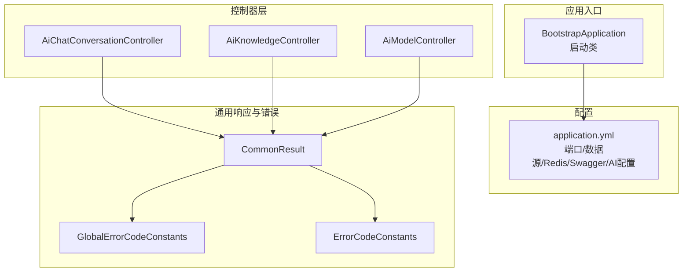
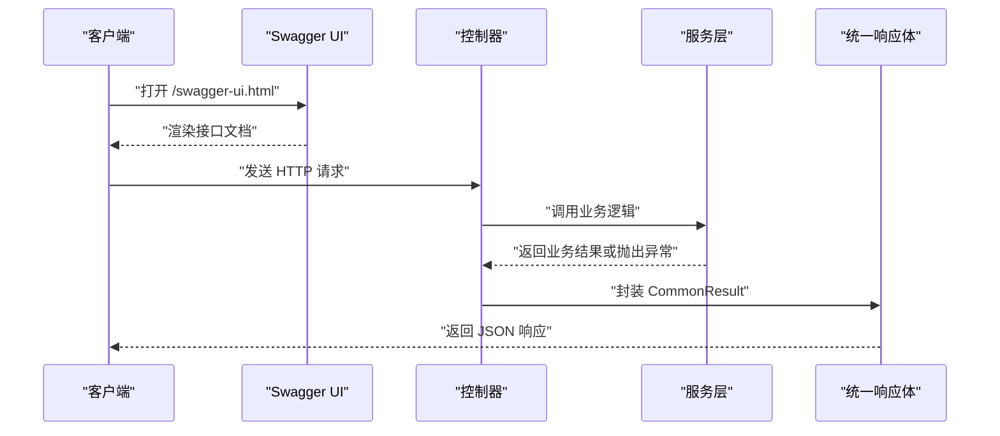
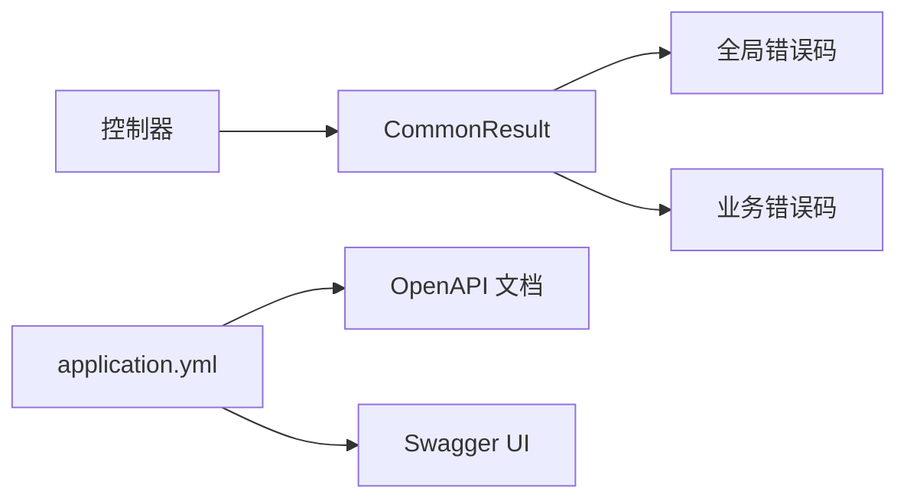

# API接口文档

<cite>
**本文引用的文件**
- [BootstrapApplication.java](file://src/main/java/cn/boss/data/ai/BootstrapApplication.java)
- [application.yml](file://src/main/resources/application.yml)
- [CommonResult.java](file://src/main/java/cn/boss/data/ai/framework/common/pojo/CommonResult.java)
- [GlobalErrorCodeConstants.java](file://src/main/java/cn/boss/data/ai/framework/common/exception/enums/GlobalErrorCodeConstants.java)
- [ErrorCode.java](file://src/main/java/cn/boss/data/ai/framework/common/exception/ErrorCode.java)
- [ErrorCodeConstants.java](file://src/main/java/cn/boss/data/ai/enums/ErrorCodeConstants.java)
- [AiChatConversationController.java](file://src/main/java/cn/boss/data/ai/controller/chat/AiChatConversationController.java)
- [AiChatConversationCreateMyReqVO.java](file://src/main/java/cn/boss/data/ai/controller/chat/vo/conversation/AiChatConversationCreateMyReqVO.java)
- [AiChatConversationRespVO.java](file://src/main/java/cn/boss/data/ai/controller/chat/vo/conversation/AiChatConversationRespVO.java)
- [AiKnowledgeController.java](file://src/main/java/cn/boss/data/ai/controller/knowledge/AiKnowledgeController.java)
- [AiKnowledgeSegmentSearchReqVO.java](file://src/main/java/cn/boss/data/ai/controller/knowledge/vo/segment/AiKnowledgeSegmentSearchReqVO.java)
- [AiModelController.java](file://src/main/java/cn/boss/data/ai/controller/model/AiModelController.java)
- [AiApiKeySaveReqVO.java](file://src/main/java/cn/boss/data/ai/controller/model/vo/apikey/AiApiKeySaveReqVO.java)
</cite>

## 目录
1. [简介](#简介)
2. [项目结构](#项目结构)
3. [核心组件](#核心组件)
4. [架构总览](#架构总览)
5. [详细组件分析](#详细组件分析)
6. [依赖分析](#依赖分析)
7. [性能考量](#性能考量)
8. [故障排查指南](#故障排查指南)
9. [结论](#结论)
10. [附录](#附录)

## 简介
本文件为 Data-AI 项目的 API 接口文档，覆盖 RESTful 接口的 HTTP 方法、URL 模式、请求参数与响应格式，并提供统一的响应体结构说明、错误码体系、认证授权与安全注意事项、版本与兼容性策略、Swagger UI 使用指南以及 API 测试方法与最佳实践。

## 项目结构
Data-AI 基于 Spring Boot 构建，采用分层架构：控制器层（Controller）、服务层（Service）、数据访问层（Mapper/DO），并通过统一响应体与错误码体系对外提供能力。应用通过 Swagger/OpenAPI 生成接口文档，可通过浏览器访问 Swagger UI 进行在线调试。

图表来源
- [BootstrapApplication.java:1-18](file://src/main/java/cn/boss/data/ai/BootstrapApplication.java#L1-L18)
- [application.yml:1-190](file://src/main/resources/application.yml#L1-L190)
- [CommonResult.java:1-85](file://src/main/java/cn/boss/data/ai/framework/common/pojo/CommonResult.java#L1-L85)
- [GlobalErrorCodeConstants.java:1-27](file://src/main/java/cn/boss/data/ai/framework/common/exception/enums/GlobalErrorCodeConstants.java#L1-L27)
- [ErrorCodeConstants.java:1-50](file://src/main/java/cn/boss/data/ai/enums/ErrorCodeConstants.java#L1-L50)
- [AiChatConversationController.java:1-113](file://src/main/java/cn/boss/data/ai/controller/chat/AiChatConversationController.java#L1-L113)
- [AiKnowledgeController.java:1-79](file://src/main/java/cn/boss/data/ai/controller/knowledge/AiKnowledgeController.java#L1-L79)
- [AiModelController.java:1-84](file://src/main/java/cn/boss/data/ai/controller/model/AiModelController.java#L1-L84)

章节来源
- [BootstrapApplication.java:1-18](file://src/main/java/cn/boss/data/ai/BootstrapApplication.java#L1-L18)
- [application.yml:1-190](file://src/main/resources/application.yml#L1-L190)

## 核心组件
- 统一响应体 CommonResult<T>
  - 字段：code（整数）、msg（字符串）、data（泛型对象）
  - 成功：code=0，msg 为空；失败：code 非 0，msg 为错误描述
  - 提供 success(data)、error(code,msg)、error(errorCode,...) 等静态工厂方法
- 全局错误码 GlobalErrorCodeConstants
  - 包含通用 HTTP 语义错误码（如 400、401、403、404、429、500 等）与系统级错误码（如 900、901、999）
- 业务错误码 ErrorCodeConstants
  - 聚合 API 密钥、模型、聊天角色、聊天会话/消息、知识库/文档/段落、工具等模块的错误码
- 控制器层
  - 聊天对话：创建、更新、查询、删除、分页、管理删除等
  - 知识库：分页、详情、创建、更新、删除、简易列表
  - 模型：创建、更新、删除、详情、分页、简易列表
  - API 密钥：保存（新增/修改）

章节来源
- [CommonResult.java:1-85](file://src/main/java/cn/boss/data/ai/framework/common/pojo/CommonResult.java#L1-L85)
- [GlobalErrorCodeConstants.java:1-27](file://src/main/java/cn/boss/data/ai/framework/common/exception/enums/GlobalErrorCodeConstants.java#L1-L27)
- [ErrorCode.java:1-17](file://src/main/java/cn/boss/data/ai/framework/common/exception/ErrorCode.java#L1-L17)
- [ErrorCodeConstants.java:1-50](file://src/main/java/cn/boss/data/ai/enums/ErrorCodeConstants.java#L1-L50)

## 架构总览
Data-AI 的 API 层通过 Spring MVC 暴露，控制器负责参数校验、调用服务层并封装统一响应体。Swagger UI 可在启动后通过 /swagger-ui.html 访问，接口文档路径为 /v3/api-docs。

图表来源
- [application.yml:63-71](file://src/main/resources/application.yml#L63-L71)
- [CommonResult.java:1-85](file://src/main/java/cn/boss/data/ai/framework/common/pojo/CommonResult.java#L1-L85)

## 详细组件分析

### 聊天对话接口
- 基础路径：/ai/chat/conversation
- 默认用户：控制器内固定使用默认用户 ID（便于演示与后台管理）

1) 创建【我的】聊天对话
- 方法与路径：POST /ai/chat/conversation/create-my
- 请求体：AiChatConversationCreateMyReqVO
  - roleId：聊天角色编号（示例：666）
  - knowledgeId：知识库编号（示例：1204）
- 响应体：CommonResult<Long>（data 为新建对话编号）

2) 更新【我的】聊天对话
- 方法与路径：PUT /ai/chat/conversation/update-my
- 请求体：AiChatConversationUpdateMyReqVO（字段由具体 VO 定义）
- 响应体：CommonResult<Boolean>（true 表示成功）

3) 获取【我的】聊天对话列表
- 方法与路径：GET /ai/chat/conversation/my-list
- 响应体：CommonResult<List<AiChatConversationRespVO>>

4) 获取【我的】聊天对话
- 方法与路径：GET /ai/chat/conversation/get-my?id={id}
- 查询参数：id（对话编号，示例：1024）
- 响应体：CommonResult<AiChatConversationRespVO>

5) 删除【我的】聊天对话
- 方法与路径：DELETE /ai/chat/conversation/delete-my?id={id}
- 查询参数：id（对话编号）
- 响应体：CommonResult<Boolean>

6) 删除未置顶的聊天对话
- 方法与路径：DELETE /ai/chat/conversation/delete-by-unpinned
- 响应体：CommonResult<Boolean>

7) 对话分页（管理后台）
- 方法与路径：GET /ai/chat/conversation/page
- 请求参数：AiChatConversationPageReqVO（分页与筛选参数）
- 响应体：CommonResult<PageResult<AiChatConversationRespVO>>
  - 响应中额外注入消息数量字段（仅管理场景）

8) 管理员删除对话
- 方法与路径：DELETE /ai/chat/conversation/delete-by-admin?id={id}
- 查询参数：id（对话编号）
- 响应体：CommonResult<Boolean>

请求示例（以创建为例）
- 请求方法：POST
- 请求地址：/ai/chat/conversation/create-my
- 请求头：Content-Type: application/json
- 请求体（示例字段）：roleId、knowledgeId
- 响应体（示例）：code=0，data=新建对话编号，msg 为空

响应示例
- 成功：{"code":0,"msg":"","data":123456}
- 失败：{"code":400,"msg":"请求参数不正确","data":null}

章节来源
- [AiChatConversationController.java:1-113](file://src/main/java/cn/boss/data/ai/controller/chat/AiChatConversationController.java#L1-L113)
- [AiChatConversationCreateMyReqVO.java:1-17](file://src/main/java/cn/boss/data/ai/controller/chat/vo/conversation/AiChatConversationCreateMyReqVO.java#L1-L17)
- [AiChatConversationRespVO.java:1-65](file://src/main/java/cn/boss/data/ai/controller/chat/vo/conversation/AiChatConversationRespVO.java#L1-L65)

### 知识库接口
- 基础路径：/ai/knowledge

1) 获取知识库分页
- 方法与路径：GET /ai/knowledge/page
- 请求参数：AiKnowledgePageReqVO
- 响应体：CommonResult<PageResult<AiKnowledgeRespVO>>

2) 获得知识库
- 方法与路径：GET /ai/knowledge/get?id={id}
- 查询参数：id（编号，示例：1024）
- 响应体：CommonResult<AiKnowledgeRespVO>

3) 创建知识库
- 方法与路径：POST /ai/knowledge/create
- 请求体：AiKnowledgeSaveReqVO
- 响应体：CommonResult<Long>

4) 更新知识库
- 方法与路径：PUT /ai/knowledge/update
- 请求体：AiKnowledgeSaveReqVO
- 响应体：CommonResult<Boolean>

5) 删除知识库
- 方法与路径：DELETE /ai/knowledge/delete?id={id}
- 查询参数：id（编号，示例：1024）
- 响应体：CommonResult<Boolean>

6) 精简列表（按启用状态）
- 方法与路径：GET /ai/knowledge/simple-list
- 响应体：CommonResult<List<AiKnowledgeRespVO>>

请求示例
- 请求方法：GET
- 请求地址：/ai/knowledge/page
- 响应体（示例）：{"code":0,"msg":"","data":{"list":[],"total":0}}

章节来源
- [AiKnowledgeController.java:1-79](file://src/main/java/cn/boss/data/ai/controller/knowledge/AiKnowledgeController.java#L1-L79)

### 知识库段落搜索接口
- 基础路径：/ai/knowledge（同上）
- 适用场景：基于知识库编号与内容进行向量检索，返回 TopK 与相似度阈值过滤后的段落

1) 搜索段落
- 方法与路径：GET /ai/knowledge/segment/search
- 请求参数：AiKnowledgeSegmentSearchReqVO
  - knowledgeId：知识库编号（必填）
  - content：内容（必填）
  - topK：最大返回数量（可选）
  - similarityThreshold：相似度阈值（可选）
- 响应体：CommonResult<List<...>>（具体响应结构由服务层定义）

请求示例
- 请求方法：GET
- 请求地址：/ai/knowledge/segment/search
- 查询参数：knowledgeId、content、topK、similarityThreshold
- 响应体（示例）：{"code":0,"msg":"","data":[]}

章节来源
- [AiKnowledgeSegmentSearchReqVO.java:1-27](file://src/main/java/cn/boss/data/ai/controller/knowledge/vo/segment/AiKnowledgeSegmentSearchReqVO.java#L1-L27)

### 模型接口
- 基础路径：/ai/model

1) 创建模型
- 方法与路径：POST /ai/model/create
- 请求体：AiModelSaveReqVO
- 响应体：CommonResult<Long>

2) 更新模型
- 方法与路径：PUT /ai/model/update
- 请求体：AiModelSaveReqVO
- 响应体：CommonResult<Boolean>

3) 删除模型
- 方法与路径：DELETE /ai/model/delete?id={id}
- 查询参数：id（编号）
- 响应体：CommonResult<Boolean>

4) 获得模型
- 方法与路径：GET /ai/model/get?id={id}
- 查询参数：id（编号，示例：1024）
- 响应体：CommonResult<AiModelRespVO>

5) 获得模型分页
- 方法与路径：GET /ai/model/page
- 请求参数：AiModelPageReqVO
- 响应体：CommonResult<PageResult<AiModelRespVO>>

6) 获得模型简易列表
- 方法与路径：GET /ai/model/simple-list?type={type}&platform={platform}
- 查询参数：type（类型，必填）、platform（平台，可选）
- 响应体：CommonResult<List<AiModelRespVO>>

请求示例
- 请求方法：GET
- 请求地址：/ai/model/simple-list?type=1&platform=midjourney
- 响应体（示例）：{"code":0,"msg":"","data":[{"id":1,"name":"模型A","model":"xxx","platform":"midjourney"}]}

章节来源
- [AiModelController.java:1-84](file://src/main/java/cn/boss/data/ai/controller/model/AiModelController.java#L1-L84)

### API 密钥接口
- 基础路径：/ai/model（与模型同模块）
- 用途：新增/修改 API 密钥（平台、名称、密钥、URL、状态等）

1) 保存 API 密钥
- 方法与路径：POST /ai/model/save-api-key（注：控制器实际映射为 /ai/model/create 或 /ai/model/update，此处以保存为例）
- 请求体：AiApiKeySaveReqVO
  - id：编号（可选）
  - name：名称（必填）
  - apiKey：密钥（必填）
  - platform：平台（必填）
  - url：自定义 API 地址（可选）
  - status：状态（必填）
- 响应体：CommonResult<Long/Boolean>

请求示例
- 请求方法：POST
- 请求地址：/ai/model/create（或对应保存接口）
- 请求体：name、apiKey、platform、status 等
- 响应体（示例）：{"code":0,"msg":"","data":123456}

章节来源
- [AiApiKeySaveReqVO.java:1-35](file://src/main/java/cn/boss/data/ai/controller/model/vo/apikey/AiApiKeySaveReqVO.java#L1-L35)

## 依赖分析
- 控制器依赖统一响应体 CommonResult<T>，确保所有接口返回一致的数据结构
- 错误码体系分为全局错误码与业务错误码，分别对应通用 HTTP 语义与各模块业务
- Swagger UI 与 OpenAPI 文档由 springdoc-openapi 配置启用，便于在线调试与联调

图表来源
- [CommonResult.java:1-85](file://src/main/java/cn/boss/data/ai/framework/common/pojo/CommonResult.java#L1-L85)
- [GlobalErrorCodeConstants.java:1-27](file://src/main/java/cn/boss/data/ai/framework/common/exception/enums/GlobalErrorCodeConstants.java#L1-L27)
- [ErrorCodeConstants.java:1-50](file://src/main/java/cn/boss/data/ai/enums/ErrorCodeConstants.java#L1-L50)
- [application.yml:63-71](file://src/main/resources/application.yml#L63-L71)

## 性能考量
- 分页接口建议设置合理的分页大小与排序字段，避免一次性返回大量数据
- 知识库段落搜索建议合理设置 topK 与相似度阈值，减少向量检索成本
- 控制器层尽量避免在接口中执行复杂计算，将耗时逻辑下沉至服务层并结合缓存
- 统一响应体与错误码可减少前端解析成本，提升联调效率

## 故障排查指南
- 常见错误码
  - 400：请求参数不正确（如必填字段缺失）
  - 401：账号未登录（需鉴权）
  - 403：没有该操作权限
  - 404：请求未找到
  - 429：请求过于频繁，请稍后重试
  - 500：系统异常
  - 900：重复请求，请稍后重试
  - 901：演示模式，禁止写操作
  - 999：未知错误
- 业务错误码示例
  - API 密钥相关：不存在、已禁用
  - 模型相关：不存在、已禁用、默认模型不存在、类型不正确
  - 聊天相关：对话不存在、消息不存在、流式生成异常
  - 知识库/文档/段落：不存在、内容为空、加载失败、内容过长
  - 工具相关：不存在、找不到 Bean
- 排查步骤
  - 确认请求方法与路径是否匹配
  - 校验必填参数与格式
  - 查看响应中的 code 与 msg，定位全局或业务错误原因
  - 若为 500 异常，查看服务端日志定位具体异常堆栈

章节来源
- [GlobalErrorCodeConstants.java:1-27](file://src/main/java/cn/boss/data/ai/framework/common/exception/enums/GlobalErrorCodeConstants.java#L1-L27)
- [ErrorCodeConstants.java:1-50](file://src/main/java/cn/boss/data/ai/enums/ErrorCodeConstants.java#L1-L50)

## 结论
Data-AI 的 API 采用统一响应体与清晰的错误码体系，结合 Swagger UI 实现了良好的可发现性与可测试性。通过分层架构与模块化设计，接口具备良好的扩展性与维护性。建议在生产环境中配合鉴权、限流与日志审计，确保安全与稳定性。

## 附录

### 认证授权与安全
- 当前控制器未显式声明鉴权注解，若需鉴权，请在控制器或方法上增加相应安全注解，并在网关或拦截器中实现统一鉴权
- API 密钥与平台配置位于 application.yml 的 AI 配置区域，建议在生产环境使用更安全的密钥管理方案

章节来源
- [application.yml:79-190](file://src/main/resources/application.yml#L79-L190)

### 版本与兼容性
- 当前未发现显式的 API 版本号（如 /api/v1/...），建议在后续迭代中引入版本前缀，以保障向后兼容
- Swagger 文档路径为 /v3/api-docs，UI 路径为 /swagger-ui.html，便于集成到文档平台

章节来源
- [application.yml:63-71](file://src/main/resources/application.yml#L63-L71)

### Swagger UI 使用指南
- 启动应用后，在浏览器访问：http://localhost:48090/swagger-ui.html
- 在页面中可查看所有接口的请求方法、路径、参数与示例
- 可直接在页面发起请求进行联调与测试

章节来源
- [application.yml:63-71](file://src/main/resources/application.yml#L63-L71)

### API 测试方法与最佳实践
- 使用 Swagger UI 进行接口测试，优先验证必填参数与边界值
- 对分页接口设置合理的页码与大小，避免超大数据量
- 对知识库段落搜索接口，先以较小 topK 与较宽松阈值进行验证，再逐步收紧
- 对写操作接口（创建/更新/删除）建议在测试环境模拟重复请求，验证 900 重复请求保护
- 对模型与 API 密钥接口，建议先创建/启用后再进行调用，避免 401/403/业务错误