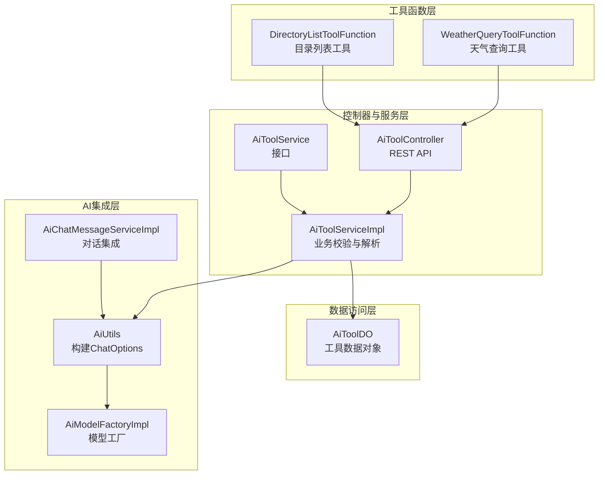
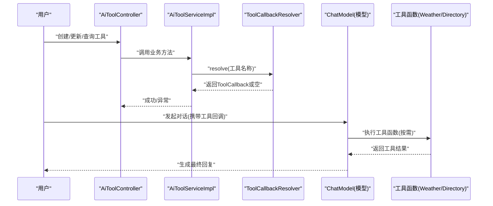
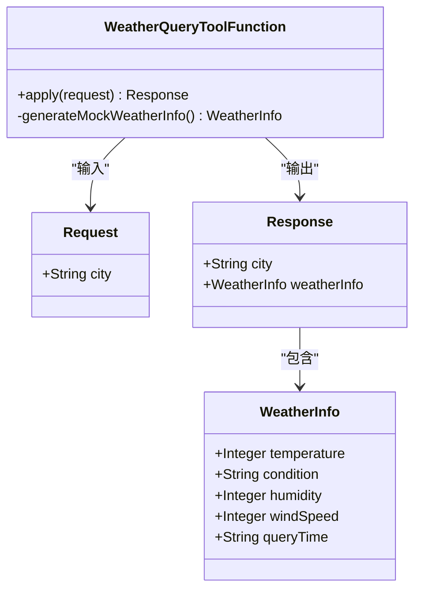
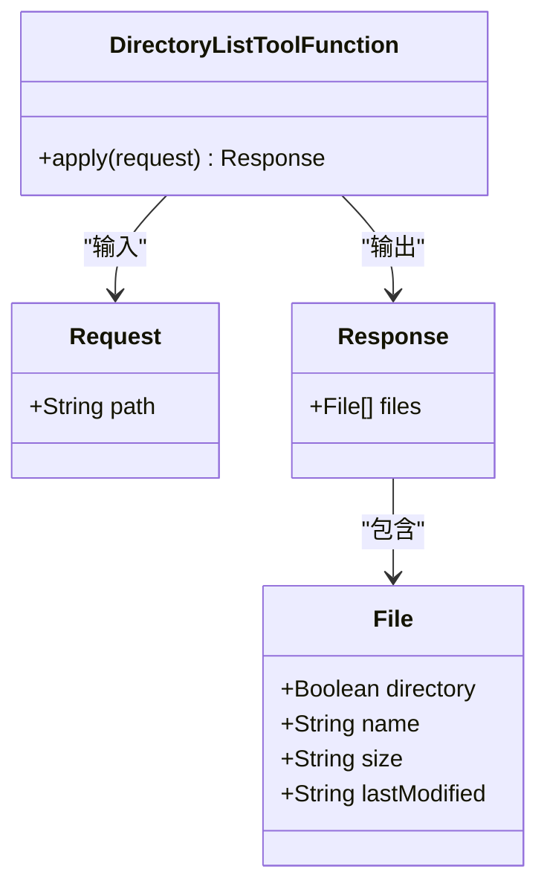
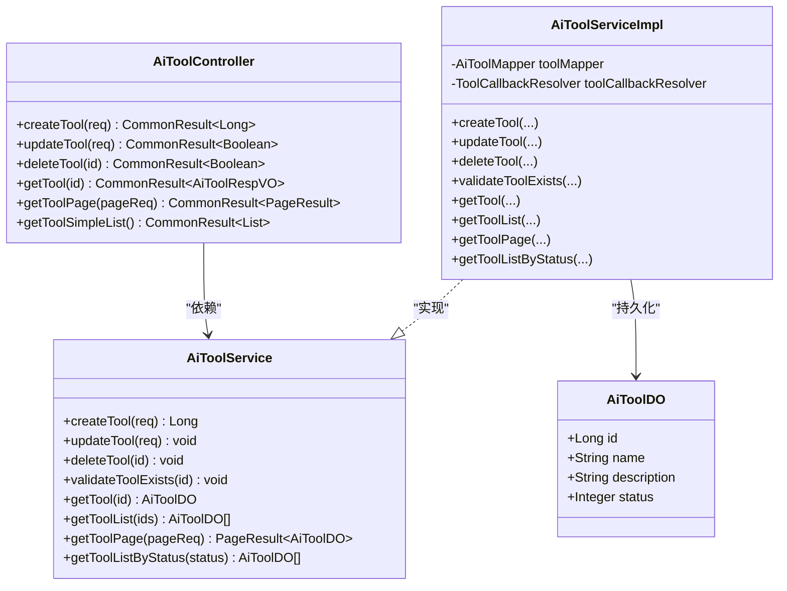
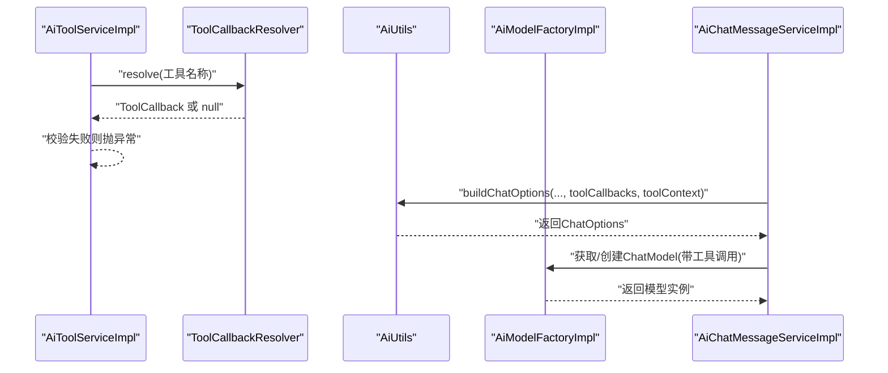
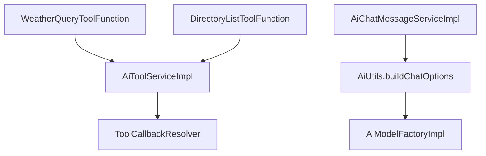

# 工具函数系统

<cite>
**本文引用的文件**
- [WeatherQueryToolFunction.java](file://src/main/java/cn/boss/data/ai/tool/function/WeatherQueryToolFunction.java)
- [DirectoryListToolFunction.java](file://src/main/java/cn/boss/data/ai/tool/function/DirectoryListToolFunction.java)
- [AiToolController.java](file://src/main/java/cn/boss/data/ai/controller/model/AiToolController.java)
- [AiToolService.java](file://src/main/java/cn/boss/data/ai/service/model/AiToolService.java)
- [AiToolServiceImpl.java](file://src/main/java/cn/boss/data/ai/service/model/AiToolServiceImpl.java)
- [AiToolDO.java](file://src/main/java/cn/boss/data/ai/dal/dataobject/model/AiToolDO.java)
- [AiToolRespVO.java](file://src/main/java/cn/boss/data/ai/controller/model/vo/tool/AiToolRespVO.java)
- [AiToolSaveReqVO.java](file://src/main/java/cn/boss/data/ai/controller/model/vo/tool/AiToolSaveReqVO.java)
- [AiUtils.java](file://src/main/java/cn/boss/data/ai/util/AiUtils.java)
- [AiModelFactoryImpl.java](file://src/main/java/cn/boss/data/ai/framework/ai/core/model/AiModelFactoryImpl.java)
- [AiChatMessageServiceImpl.java](file://src/main/java/cn/boss/data/ai/service/chat/AiChatMessageServiceImpl.java)
- [application.yml](file://src/main/resources/application.yml)
</cite>

## 目录
1. [简介](#简介)
2. [项目结构](#项目结构)
3. [核心组件](#核心组件)
4. [架构总览](#架构总览)
5. [详细组件分析](#详细组件分析)
6. [依赖分析](#依赖分析)
7. [性能考虑](#性能考虑)
8. [故障排查指南](#故障排查指南)
9. [结论](#结论)
10. [附录](#附录)

## 简介
本技术文档围绕工具函数系统展开，系统性阐述工具函数的设计理念、实现模式与扩展机制，覆盖内置工具如“天气查询”“目录列表”，并说明工具函数的注册与调用流程、与AI模型的集成方式以及在对话中的使用方法。文档同时提供开发指南（接口规范、参数定义、返回值格式）与最佳实践，帮助开发者快速理解与扩展工具函数体系。

## 项目结构
工具函数系统主要由以下层次构成：
- 工具函数层：以函数式接口实现具体工具能力，如天气查询、目录列表。
- 控制器与服务层：提供工具的增删改查、校验与分页能力。
- 数据访问层：持久化工具元数据。
- AI集成层：通过工具回调解析器与聊天选项构建工具调用链路，实现与多平台模型的对接。

图表来源
- [WeatherQueryToolFunction.java:1-81](file://src/main/java/cn/boss/data/ai/tool/function/WeatherQueryToolFunction.java#L1-L81)
- [DirectoryListToolFunction.java:1-75](file://src/main/java/cn/boss/data/ai/tool/function/DirectoryListToolFunction.java#L1-L75)
- [AiToolController.java:1-79](file://src/main/java/cn/boss/data/ai/controller/model/AiToolController.java#L1-L79)
- [AiToolServiceImpl.java:1-92](file://src/main/java/cn/boss/data/ai/service/model/AiToolServiceImpl.java#L1-L92)
- [AiToolDO.java:1-32](file://src/main/java/cn/boss/data/ai/dal/dataobject/model/AiToolDO.java#L1-L32)
- [AiUtils.java:1-128](file://src/main/java/cn/boss/data/ai/util/AiUtils.java#L1-L128)
- [AiModelFactoryImpl.java:1-200](file://src/main/java/cn/boss/data/ai/framework/ai/core/model/AiModelFactoryImpl.java#L1-L200)
- [AiChatMessageServiceImpl.java:343-371](file://src/main/java/cn/boss/data/ai/service/chat/AiChatMessageServiceImpl.java#L343-L371)

章节来源
- [AiToolController.java:1-79](file://src/main/java/cn/boss/data/ai/controller/model/AiToolController.java#L1-L79)
- [AiToolServiceImpl.java:1-92](file://src/main/java/cn/boss/data/ai/service/model/AiToolServiceImpl.java#L1-L92)
- [AiToolDO.java:1-32](file://src/main/java/cn/boss/data/ai/dal/dataobject/model/AiToolDO.java#L1-L32)
- [AiUtils.java:1-128](file://src/main/java/cn/boss/data/ai/util/AiUtils.java#L1-L128)
- [AiModelFactoryImpl.java:1-200](file://src/main/java/cn/boss/data/ai/framework/ai/core/model/AiModelFactoryImpl.java#L1-L200)
- [AiChatMessageServiceImpl.java:343-371](file://src/main/java/cn/boss/data/ai/service/chat/AiChatMessageServiceImpl.java#L343-L371)

## 核心组件
- 工具函数实现
  - 天气查询工具：接收城市名，返回温度、湿度、风速、天气状况与查询时间等信息。
  - 目录列表工具：接收目录路径，返回该目录下的文件/子目录清单（含是否目录、名称、大小、最后修改时间）。
- 工具元数据管理
  - 控制器：提供创建、更新、删除、查询、分页、简单列表等接口。
  - 服务：负责工具名称存在性校验（通过工具回调解析器），并提供分页与状态筛选。
  - 数据对象：持久化工具的编号、名称、描述与状态。
- AI集成
  - 工具回调解析器：根据工具名称解析到具体工具回调实例。
  - 聊天选项构建：将工具回调与上下文注入到不同平台的ChatOptions中。
  - 模型工厂：按平台创建具备工具调用能力的聊天模型。

章节来源
- [WeatherQueryToolFunction.java:19-81](file://src/main/java/cn/boss/data/ai/tool/function/WeatherQueryToolFunction.java#L19-L81)
- [DirectoryListToolFunction.java:24-75](file://src/main/java/cn/boss/data/ai/tool/function/DirectoryListToolFunction.java#L24-L75)
- [AiToolController.java:25-79](file://src/main/java/cn/boss/data/ai/controller/model/AiToolController.java#L25-L79)
- [AiToolService.java:12-34](file://src/main/java/cn/boss/data/ai/service/model/AiToolService.java#L12-L34)
- [AiToolServiceImpl.java:22-92](file://src/main/java/cn/boss/data/ai/service/model/AiToolServiceImpl.java#L22-L92)
- [AiToolDO.java:9-32](file://src/main/java/cn/boss/data/ai/dal/dataobject/model/AiToolDO.java#L9-L32)
- [AiUtils.java:24-79](file://src/main/java/cn/boss/data/ai/util/AiUtils.java#L24-L79)
- [AiModelFactoryImpl.java:110-200](file://src/main/java/cn/boss/data/ai/framework/ai/core/model/AiModelFactoryImpl.java#L110-L200)

## 架构总览
工具函数系统采用“函数式实现 + 元数据管理 + AI回调集成”的三层架构。工具函数通过Spring组件注解注册，服务层通过工具回调解析器完成名称到回调的映射，最终在构建聊天选项时注入工具回调，使模型在推理过程中可调用工具。

图表来源
- [AiToolServiceImpl.java:32-69](file://src/main/java/cn/boss/data/ai/service/model/AiToolServiceImpl.java#L32-L69)
- [AiUtils.java:29-79](file://src/main/java/cn/boss/data/ai/util/AiUtils.java#L29-L79)
- [AiModelFactoryImpl.java:115-159](file://src/main/java/cn/boss/data/ai/framework/ai/core/model/AiModelFactoryImpl.java#L115-L159)
- [AiChatMessageServiceImpl.java:343-371](file://src/main/java/cn/boss/data/ai/service/chat/AiChatMessageServiceImpl.java#L343-L371)

## 详细组件分析

### 天气查询工具（WeatherQueryToolFunction）
- 设计理念
  - 使用函数式接口实现工具能力，请求与响应均以POJO形式定义，便于序列化与文档化。
  - 请求体包含必填字段“城市名”，响应体包含城市名与天气信息对象。
  - 天气信息包含温度、湿度、风速、天气状况与查询时间，模拟真实场景的数据结构。
- 参数与返回值
  - 请求参数：城市名（字符串，必填）
  - 返回值：包含城市名与天气信息的对象；天气信息包含温度、天气状况、湿度、风速、查询时间
- 错误处理
  - 当城市名为空时，返回“未知城市”占位，避免抛出异常影响整体流程
- 性能与复杂度
  - 函数内部为纯计算与随机生成，时间复杂度为O(1)，空间复杂度为O(1)

图表来源
- [WeatherQueryToolFunction.java:19-81](file://src/main/java/cn/boss/data/ai/tool/function/WeatherQueryToolFunction.java#L19-L81)

章节来源
- [WeatherQueryToolFunction.java:19-81](file://src/main/java/cn/boss/data/ai/tool/function/WeatherQueryToolFunction.java#L19-L81)

### 目录列表工具（DirectoryListToolFunction）
- 设计理念
  - 读取本地文件系统，返回目录下的文件/子目录清单
  - 对不存在或非目录路径进行安全检查，返回空列表避免异常
  - 文件项包含是否目录、名称、大小、最后修改时间等字段
- 参数与返回值
  - 请求参数：目录路径（字符串，必填）
  - 返回值：文件列表，每项包含目录标志、名称、大小、最后修改时间
- 错误处理
  - 路径不存在或不是目录时，返回空列表
- 性能与复杂度
  - 列表读取为O(n)，n为目录下文件数量；内存占用与文件数量线性相关

图表来源
- [DirectoryListToolFunction.java:24-75](file://src/main/java/cn/boss/data/ai/tool/function/DirectoryListToolFunction.java#L24-L75)

章节来源
- [DirectoryListToolFunction.java:24-75](file://src/main/java/cn/boss/data/ai/tool/function/DirectoryListToolFunction.java#L24-L75)

### 工具元数据管理（控制器、服务、数据对象）
- 控制器职责
  - 提供创建、更新、删除、查询单个、分页查询、简单列表（按状态）等接口
  - 统一返回包装结果，便于前端消费
- 服务职责
  - 创建/更新前校验工具名称是否存在（通过工具回调解析器resolve）
  - 删除前校验工具是否存在
  - 提供分页查询与按状态筛选
- 数据对象
  - 工具编号、名称、描述、状态（启用/禁用）

图表来源
- [AiToolController.java:25-79](file://src/main/java/cn/boss/data/ai/controller/model/AiToolController.java#L25-L79)
- [AiToolService.java:12-34](file://src/main/java/cn/boss/data/ai/service/model/AiToolService.java#L12-L34)
- [AiToolServiceImpl.java:22-92](file://src/main/java/cn/boss/data/ai/service/model/AiToolServiceImpl.java#L22-L92)
- [AiToolDO.java:9-32](file://src/main/java/cn/boss/data/ai/dal/dataobject/model/AiToolDO.java#L9-L32)

章节来源
- [AiToolController.java:25-79](file://src/main/java/cn/boss/data/ai/controller/model/AiToolController.java#L25-L79)
- [AiToolService.java:12-34](file://src/main/java/cn/boss/data/ai/service/model/AiToolService.java#L12-L34)
- [AiToolServiceImpl.java:22-92](file://src/main/java/cn/boss/data/ai/service/model/AiToolServiceImpl.java#L22-L92)
- [AiToolDO.java:9-32](file://src/main/java/cn/boss/data/ai/dal/dataobject/model/AiToolDO.java#L9-L32)

### AI集成与工具调用流程
- 工具回调解析
  - 服务层在创建/更新工具时，通过工具回调解析器resolve工具名称，若解析不到则抛出“工具名称不存在”错误
- 聊天选项构建
  - 工具回调与上下文被注入到不同平台的ChatOptions中，确保模型在推理时具备调用工具的能力
- 模型工厂
  - 工厂按平台创建具备工具调用能力的聊天模型，统一管理工具调用管理器
- 对话集成
  - 在构建Prompt时，将工具回调与上下文传入ChatOptions，从而在对话中触发工具调用

图表来源
- [AiToolServiceImpl.java:64-69](file://src/main/java/cn/boss/data/ai/service/model/AiToolServiceImpl.java#L64-L69)
- [AiUtils.java:29-79](file://src/main/java/cn/boss/data/ai/util/AiUtils.java#L29-L79)
- [AiModelFactoryImpl.java:115-159](file://src/main/java/cn/boss/data/ai/framework/ai/core/model/AiModelFactoryImpl.java#L115-L159)
- [AiChatMessageServiceImpl.java:343-371](file://src/main/java/cn/boss/data/ai/service/chat/AiChatMessageServiceImpl.java#L343-L371)

章节来源
- [AiToolServiceImpl.java:64-69](file://src/main/java/cn/boss/data/ai/service/model/AiToolServiceImpl.java#L64-L69)
- [AiUtils.java:29-79](file://src/main/java/cn/boss/data/ai/util/AiUtils.java#L29-L79)
- [AiModelFactoryImpl.java:115-159](file://src/main/java/cn/boss/data/ai/framework/ai/core/model/AiModelFactoryImpl.java#L115-L159)
- [AiChatMessageServiceImpl.java:343-371](file://src/main/java/cn/boss/data/ai/service/chat/AiChatMessageServiceImpl.java#L343-L371)

## 依赖分析
- 组件耦合
  - 工具函数通过Spring组件注解注册，名称即工具回调名称，与服务层的工具回调解析器形成松耦合
  - 服务层依赖工具回调解析器与数据访问层，保持业务逻辑清晰
- 外部依赖
  - Spring AI工具回调与工具调用管理器
  - 多平台模型客户端（OpenAI、Azure OpenAI、Anthropic、Gemini等）
- 风险点
  - 工具名称唯一性：创建/更新时必须通过解析器校验名称有效性
  - 路径安全：目录列表工具仅在本地文件系统生效，需谨慎控制访问范围

图表来源
- [AiToolServiceImpl.java:32-69](file://src/main/java/cn/boss/data/ai/service/model/AiToolServiceImpl.java#L32-L69)
- [AiUtils.java:29-79](file://src/main/java/cn/boss/data/ai/util/AiUtils.java#L29-L79)
- [AiModelFactoryImpl.java:115-159](file://src/main/java/cn/boss/data/ai/framework/ai/core/model/AiModelFactoryImpl.java#L115-L159)
- [AiChatMessageServiceImpl.java:343-371](file://src/main/java/cn/boss/data/ai/service/chat/AiChatMessageServiceImpl.java#L343-L371)

章节来源
- [AiToolServiceImpl.java:32-69](file://src/main/java/cn/boss/data/ai/service/model/AiToolServiceImpl.java#L32-L69)
- [AiUtils.java:29-79](file://src/main/java/cn/boss/data/ai/util/AiUtils.java#L29-L79)
- [AiModelFactoryImpl.java:115-159](file://src/main/java/cn/boss/data/ai/framework/ai/core/model/AiModelFactoryImpl.java#L115-L159)
- [AiChatMessageServiceImpl.java:343-371](file://src/main/java/cn/boss/data/ai/service/chat/AiChatMessageServiceImpl.java#L343-L371)

## 性能考虑
- 工具函数本身为轻量级计算或本地IO，建议：
  - 对于目录列表工具，限制遍历深度与文件数量，避免长时间阻塞
  - 对于天气查询工具，尽量复用随机数生成策略，减少不必要的对象创建
- 服务层校验与解析
  - 工具名称解析应避免频繁重复解析，可在上层缓存工具名称到回调的映射
- 模型集成
  - ChatOptions中工具回调列表应按需传递，避免冗余工具导致推理开销增加

## 故障排查指南
- 工具名称不存在
  - 现象：创建/更新工具时报错“工具名称不存在”
  - 原因：工具回调解析器无法解析该名称
  - 处理：确认工具函数组件注解的名称与工具名称一致，且组件已正确注册
- 工具不存在
  - 现象：删除/查询工具时报错“工具不存在”
  - 原因：数据库中不存在对应ID
  - 处理：确认ID正确或先创建工具
- 目录不可用
  - 现象：目录列表返回空列表
  - 原因：路径不存在或非目录
  - 处理：检查路径权限与存在性

章节来源
- [AiToolServiceImpl.java:58-69](file://src/main/java/cn/boss/data/ai/service/model/AiToolServiceImpl.java#L58-L69)
- [DirectoryListToolFunction.java:60-68](file://src/main/java/cn/boss/data/ai/tool/function/DirectoryListToolFunction.java#L60-L68)

## 结论
工具函数系统通过函数式实现与元数据管理相结合，实现了工具能力的标准化与可扩展性。借助工具回调解析器与ChatOptions注入，系统能够灵活地与多平台模型集成，在对话中按需调用工具，提升AI应用的实际价值。开发者可遵循本文档的接口规范与最佳实践，快速扩展新的工具函数并安全地接入AI对话流程。

## 附录

### 开发指南：如何扩展新的工具函数
- 接口规范
  - 工具函数实现函数式接口，方法名为apply，输入为请求对象，输出为响应对象
  - 请求对象使用JSON注解声明字段含义与必填性
  - 响应对象包含业务所需字段，必要时嵌套子对象
- 参数定义
  - 必填字段使用required标记，配合校验注解确保数据完整性
  - 字段描述使用注释说明用途，便于文档生成与使用者理解
- 返回值格式
  - 返回对象应包含明确的业务语义字段，避免返回原始底层对象
  - 对于列表类工具，返回统一的列表包装对象
- 注册机制
  - 使用Spring组件注解为工具函数命名，名称即工具回调名称
  - 确保组件扫描路径包含工具函数所在包
- 与AI模型集成
  - 在对话构建阶段，将工具回调与上下文注入ChatOptions
  - 通过模型工厂创建具备工具调用能力的聊天模型
- 最佳实践
  - 对外部资源访问（如文件系统、网络）进行安全与边界控制
  - 对异常情况进行优雅降级，避免中断对话流程
  - 为工具函数编写单元测试，覆盖正常与异常分支

章节来源
- [WeatherQueryToolFunction.java:28-59](file://src/main/java/cn/boss/data/ai/tool/function/WeatherQueryToolFunction.java#L28-L59)
- [DirectoryListToolFunction.java:30-57](file://src/main/java/cn/boss/data/ai/tool/function/DirectoryListToolFunction.java#L30-L57)
- [AiToolServiceImpl.java:32-69](file://src/main/java/cn/boss/data/ai/service/model/AiToolServiceImpl.java#L32-L69)
- [AiUtils.java:29-79](file://src/main/java/cn/boss/data/ai/util/AiUtils.java#L29-L79)
- [AiModelFactoryImpl.java:115-159](file://src/main/java/cn/boss/data/ai/framework/ai/core/model/AiModelFactoryImpl.java#L115-L159)

### 配置参考
- 平台与API Key配置位于应用配置文件中，用于初始化各平台模型客户端
- 工具函数系统通过工具回调解析器与聊天选项构建工具调用链路

章节来源
- [application.yml:79-190](file://src/main/resources/application.yml#L79-L190)