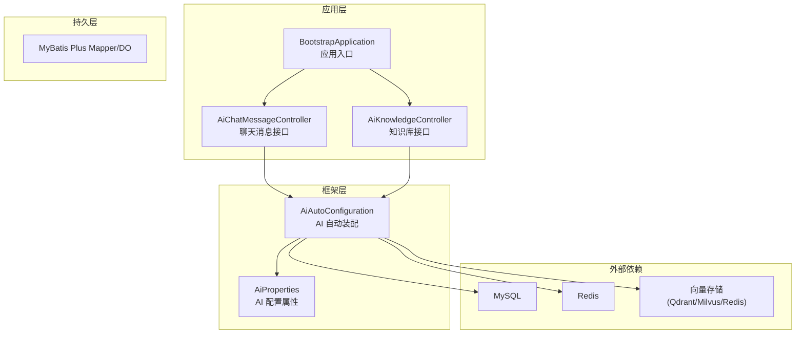
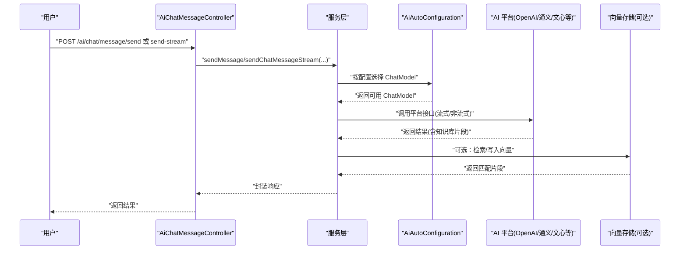
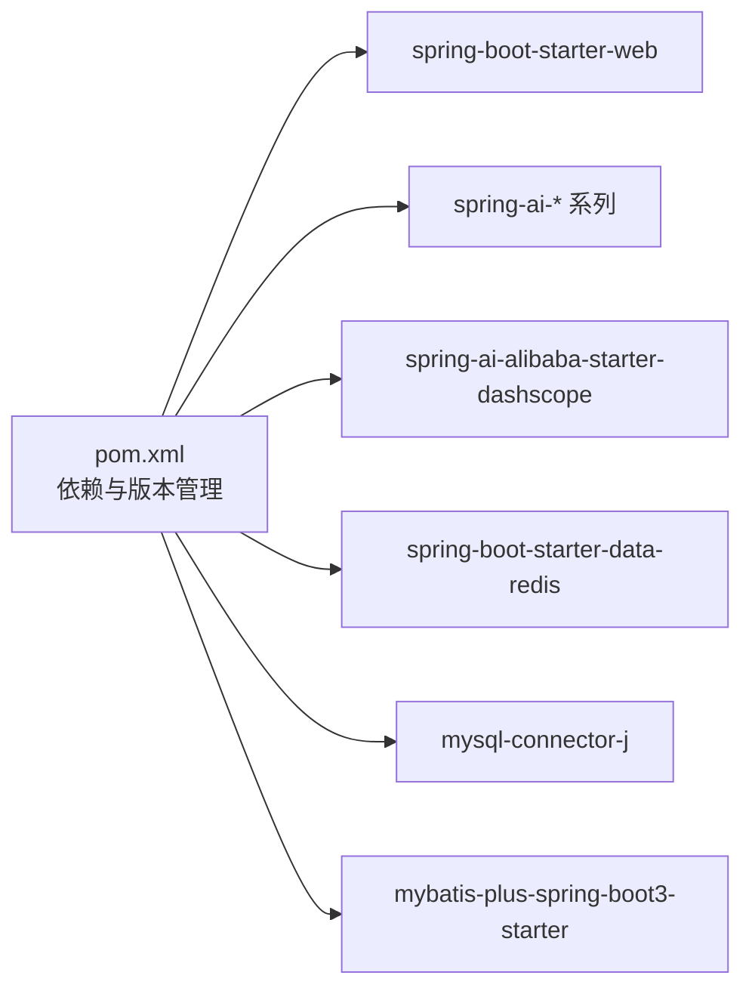

# 快速开始

<cite>
**本文引用的文件**
- [pom.xml](file://pom.xml)
- [application.yml](file://src/main/resources/application.yml)
- [BootstrapApplication.java](file://src/main/java/cn/boss/data/ai/BootstrapApplication.java)
- [AiAutoConfiguration.java](file://src/main/java/cn/boss/data/ai/framework/ai/config/AiAutoConfiguration.java)
- [AiProperties.java](file://src/main/java/cn/boss/data/ai/framework/ai/config/AiProperties.java)
- [AiChatMessageController.java](file://src/main/java/cn/boss/data/ai/controller/chat/AiChatMessageController.java)
- [AiKnowledgeController.java](file://src/main/java/cn/boss/data/ai/controller/knowledge/AiKnowledgeController.java)
- [ErrorCodeConstants.java](file://src/main/java/cn/boss/data/ai/enums/ErrorCodeConstants.java)
- [logback-spring.xml](file://src/main/resources/logback-spring.xml)
</cite>

## 目录
1. [简介](#简介)
2. [项目结构](#项目结构)
3. [核心组件](#核心组件)
4. [架构总览](#架构总览)
5. [详细组件分析](#详细组件分析)
6. [依赖关系分析](#依赖关系分析)
7. [性能注意事项](#性能注意事项)
8. [故障排查指南](#故障排查指南)
9. [结论](#结论)
10. [附录](#附录)

## 简介
本指南面向初学者与快速上手开发者，帮助你在最短时间内完成 Data-AI 项目的环境准备、安装配置与启动验证。你将学到：
- 环境准备：JDK 版本、Maven、开发工具
- 项目安装与配置：数据库初始化、Redis、AI 平台 API 密钥
- 完整启动流程与验证方法
- 常见配置问题与解决方案
- 基本使用示例与入口路径

## 项目结构
Data-AI 是基于 Spring Boot 3.5.9 的 Java 应用，采用模块化分层设计：
- controller 层：对外提供 REST API，如聊天消息、知识库等
- service 层：业务逻辑编排，调用模型工厂与向量存储
- framework 层：AI 自动装配、配置属性、通用工具与异常体系
- dal 层：MyBatis Plus 映射与数据对象
- resources：应用配置、日志与 SQL 初始化脚本

图表来源
- [BootstrapApplication.java:1-18](file://src/main/java/cn/boss/data/ai/BootstrapApplication.java#L1-L18)
- [AiAutoConfiguration.java:1-286](file://src/main/java/cn/boss/data/ai/framework/ai/config/AiAutoConfiguration.java#L1-L286)
- [AiProperties.java:1-134](file://src/main/java/cn/boss/data/ai/framework/ai/config/AiProperties.java#L1-L134)
- [AiChatMessageController.java:1-156](file://src/main/java/cn/boss/data/ai/controller/chat/AiChatMessageController.java#L1-L156)
- [AiKnowledgeController.java:1-79](file://src/main/java/cn/boss/data/ai/controller/knowledge/AiKnowledgeController.java#L1-L79)

章节来源
- [pom.xml:11-358](file://pom.xml#L11-L358)
- [application.yml:1-190](file://src/main/resources/application.yml#L1-L190)

## 核心组件
- 应用入口与扫描：通过 @SpringBootApplication 与 @MapperScan 扫描 MyBatis Mapper，开启异步任务
- AI 自动装配：根据 boss.ai.* 配置动态创建各平台 ChatModel、向量存储与工具调用管理器
- 配置属性：AiProperties 统一承载 boss.ai.* 下的多平台密钥、模型与参数
- 控制器：提供聊天消息发送（同步/流式）、分页与删除；知识库的增删改查与分页
- 异常与错误码：集中定义业务错误码，便于统一处理与前端提示

章节来源
- [BootstrapApplication.java:8-17](file://src/main/java/cn/boss/data/ai/BootstrapApplication.java#L8-L17)
- [AiAutoConfiguration.java:44-55](file://src/main/java/cn/boss/data/ai/framework/ai/config/AiAutoConfiguration.java#L44-L55)
- [AiProperties.java:9-133](file://src/main/java/cn/boss/data/ai/framework/ai/config/AiProperties.java#L9-L133)
- [AiChatMessageController.java:40-156](file://src/main/java/cn/boss/data/ai/controller/chat/AiChatMessageController.java#L40-L156)
- [AiKnowledgeController.java:25-79](file://src/main/java/cn/boss/data/ai/controller/knowledge/AiKnowledgeController.java#L25-L79)
- [ErrorCodeConstants.java:10-50](file://src/main/java/cn/boss/data/ai/enums/ErrorCodeConstants.java#L10-L50)

## 架构总览
Data-AI 采用“控制器 → 服务 → AI 自动装配 → 外部平台/向量存储”的链路。AI 自动装配根据 boss.ai.* 配置按需启用不同平台，并注入对应的 ChatModel 与向量存储。

图表来源
- [AiChatMessageController.java:60-69](file://src/main/java/cn/boss/data/ai/controller/chat/AiChatMessageController.java#L60-L69)
- [AiAutoConfiguration.java:65-91](file://src/main/java/cn/boss/data/ai/framework/ai/config/AiAutoConfiguration.java#L65-L91)
- [AiAutoConfiguration.java:279-283](file://src/main/java/cn/boss/data/ai/framework/ai/config/AiAutoConfiguration.java#L279-L283)

## 详细组件分析

### 环境准备
- JDK 版本：Java 17（由 Maven 属性统一指定）
- Maven：标准 Maven 仓库与阿里云/Huawei 仓库镜像
- IDE：推荐 IntelliJ IDEA 或 Eclipse（.gitignore 已包含常见 IDE 忽略项）

章节来源
- [pom.xml:13](file://pom.xml#L13)
- [.gitignore:16-33](file://.gitignore#L16-L33)

### 安装与配置

#### 1) 数据库初始化
- 连接地址与凭据：默认连接本地 MySQL，库名为 data-ai，账号密码在配置文件中
- 初始化建议：首次启动前请先创建数据库与必要表结构（可通过 MyBatis Plus 生成或导入 SQL 脚本）

章节来源
- [application.yml:23-26](file://src/main/resources/application.yml#L23-L26)

#### 2) Redis 配置
- 默认连接：127.0.0.1:6379，database: 0
- 向量存储：若使用 Redis 作为向量存储，需确保开启 initialize-schema 并正确设置 index 名称与键前缀

章节来源
- [application.yml:31-33](file://src/main/resources/application.yml#L31-L33)
- [application.yml:84-87](file://src/main/resources/application.yml#L84-L87)

#### 3) AI 平台 API 密钥设置
- 配置前缀：boss.ai.*
- 支持平台：Gemini、豆包、混元、硅基流动、讯飞星火、百川、通义、文心一言、Moonshot、DeepSeek、Ollama、Stability AI 等
- 使用方式：将对应平台的 enable、api-key/model/base-url 等参数填入配置文件相应位置

章节来源
- [application.yml:150-189](file://src/main/resources/application.yml#L150-L189)
- [AiProperties.java:16-51](file://src/main/java/cn/boss/data/ai/framework/ai/config/AiProperties.java#L16-L51)

#### 4) Swagger 接口文档
- 可选启用：springdoc.api-docs.enabled=true，访问 /swagger-ui.html 查看接口

章节来源
- [application.yml:65-71](file://src/main/resources/application.yml#L65-L71)

### 启动步骤与验证

#### 步骤 1：准备数据库与 Redis
- 启动本地 MySQL 与 Redis
- 在 MySQL 中创建数据库 data-ai
- 确认 application.yml 中的数据库与 Redis 地址、端口、认证信息正确

章节来源
- [application.yml:23-33](file://src/main/resources/application.yml#L23-L33)

#### 步骤 2：配置 AI 平台密钥
- 在 boss.ai.* 下填写任一平台的 enable 与 api-key/model/base-url
- 若使用通义/文心等国内平台，请确认网络可达性与代理设置

章节来源
- [application.yml:150-189](file://src/main/resources/application.yml#L150-L189)

#### 步骤 3：启动应用
- 使用 Maven 打包并启动：执行打包命令后运行生成的可执行 JAR
- 或在 IDE 中直接运行 BootstrapApplication.main()

章节来源
- [pom.xml:282-296](file://pom.xml#L282-L296)
- [BootstrapApplication.java:13-15](file://src/main/java/cn/boss/data/ai/BootstrapApplication.java#L13-L15)

#### 步骤 4：验证接口
- 访问 Swagger UI：/swagger-ui.html
- 调用聊天消息发送接口：
  - 同步：POST /ai/chat/message/send
  - 流式：POST /ai/chat/message/send-stream
- 调用知识库接口：
  - 分页：GET /ai/knowledge/page
  - 新增：POST /ai/knowledge/create
  - 更新/删除：PUT/DELETE /ai/knowledge/update、/ai/knowledge/delete

章节来源
- [AiChatMessageController.java:60-69](file://src/main/java/cn/boss/data/ai/controller/chat/AiChatMessageController.java#L60-L69)
- [AiChatMessageController.java:132-145](file://src/main/java/cn/boss/data/ai/controller/chat/AiChatMessageController.java#L132-L145)
- [AiKnowledgeController.java:34-67](file://src/main/java/cn/boss/data/ai/controller/knowledge/AiKnowledgeController.java#L34-L67)

### 常见配置问题与解决方案

- 数据库连接失败
  - 检查主机、端口、库名、用户名与密码是否正确
  - 确保 MySQL 已启动且允许本地连接
  - 参考：[application.yml:23-26](file://src/main/resources/application.yml#L23-L26)

- Redis 连接失败
  - 检查 Redis 主机、端口与认证
  - 若使用向量存储，确认 initialize-schema 与 index/prefix 配置
  - 参考：[application.yml:31-33](file://src/main/resources/application.yml#L31-L33)，[application.yml:84-87](file://src/main/resources/application.yml#L84-L87)

- AI 平台密钥无效或网络异常
  - 确认 boss.ai.* 下的 enable 与 api-key/model/base-url
  - 如使用国内平台，检查代理与域名解析
  - 参考：[application.yml:150-189](file://src/main/resources/application.yml#L150-L189)

- 启动报错或端口占用
  - 修改 server.port 或释放端口占用
  - 参考：[application.yml:1-2](file://src/main/resources/application.yml#L1-L2)

- 日志级别与输出
  - 可调整 logging.level 以观察调试信息
  - 参考：[logback-spring.xml:16-18](file://src/main/resources/logback-spring.xml#L16-L18)

章节来源
- [application.yml:1-2](file://src/main/resources/application.yml#L1-L2)
- [application.yml:23-33](file://src/main/resources/application.yml#L23-L33)
- [application.yml:84-87](file://src/main/resources/application.yml#L84-L87)
- [application.yml:150-189](file://src/main/resources/application.yml#L150-L189)
- [logback-spring.xml:16-18](file://src/main/resources/logback-spring.xml#L16-L18)

### 基本使用示例（路径指引）
- 发送一条普通消息（同步）：POST /ai/chat/message/send
- 发送一条消息并获取流式响应：POST /ai/chat/message/send-stream
- 获取某对话的消息列表：GET /ai/chat/message/list-by-conversation-id?conversationId=...
- 创建一个知识库：POST /ai/knowledge/create
- 获取知识库分页：GET /ai/knowledge/page

章节来源
- [AiChatMessageController.java:60-69](file://src/main/java/cn/boss/data/ai/controller/chat/AiChatMessageController.java#L60-L69)
- [AiChatMessageController.java:72-112](file://src/main/java/cn/boss/data/ai/controller/chat/AiChatMessageController.java#L72-L112)
- [AiKnowledgeController.java:34-67](file://src/main/java/cn/boss/data/ai/controller/knowledge/AiKnowledgeController.java#L34-L67)

## 依赖关系分析
项目使用 Spring Boot 3.5.9 与 Spring AI 生态，集成多种国产与国际大模型，同时支持向量存储（Redis/Qdrant/Milvus）与工具调用。

图表来源
- [pom.xml:47-280](file://pom.xml#L47-L280)

章节来源
- [pom.xml:35-45](file://pom.xml#L35-L45)
- [pom.xml:47-280](file://pom.xml#L47-L280)

## 性能注意事项
- 流式响应：使用 /send-stream 可降低首字延迟，提升交互体验
- 向量检索：合理设置向量索引名称与键前缀，避免冲突与重复初始化
- 日志级别：生产环境建议降低 DEBUG 输出，减少 IO 压力
- 网络与限流：AI 平台可能有限流策略，建议在服务层做重试与熔断

## 故障排查指南
- 错误码集中定义于 ErrorCodeConstants，便于定位业务异常
- 常见错误场景：API 密钥不存在/禁用、模型不存在/禁用、聊天会话/消息不存在、知识库文档/段落缺失等
- 建议：结合 Swagger 接口文档与日志，逐步缩小问题范围

章节来源
- [ErrorCodeConstants.java:12-48](file://src/main/java/cn/boss/data/ai/enums/ErrorCodeConstants.java#L12-L48)

## 结论
按照本指南完成环境准备、数据库与 Redis 初始化、AI 平台密钥配置后，即可通过 Maven 或 IDE 启动应用，并使用 Swagger 快速验证核心接口。遇到问题时，优先检查配置文件中的连接参数与密钥有效性，并参考错误码与日志进行定位。

## 附录

### 配置清单（关键项）
- 数据库：host/port/db/username/password
- Redis：host/port/database
- AI 平台：boss.ai.* 下的 enable、api-key/model/base-url
- 接口文档：springdoc.api-docs.enabled 与访问路径

章节来源
- [application.yml:17-33](file://src/main/resources/application.yml#L17-L33)
- [application.yml:150-189](file://src/main/resources/application.yml#L150-L189)
- [application.yml:65-71](file://src/main/resources/application.yml#L65-L71)