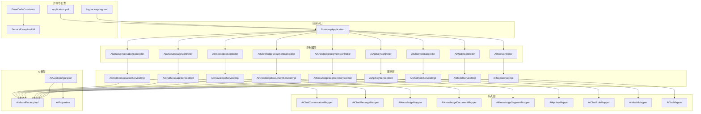
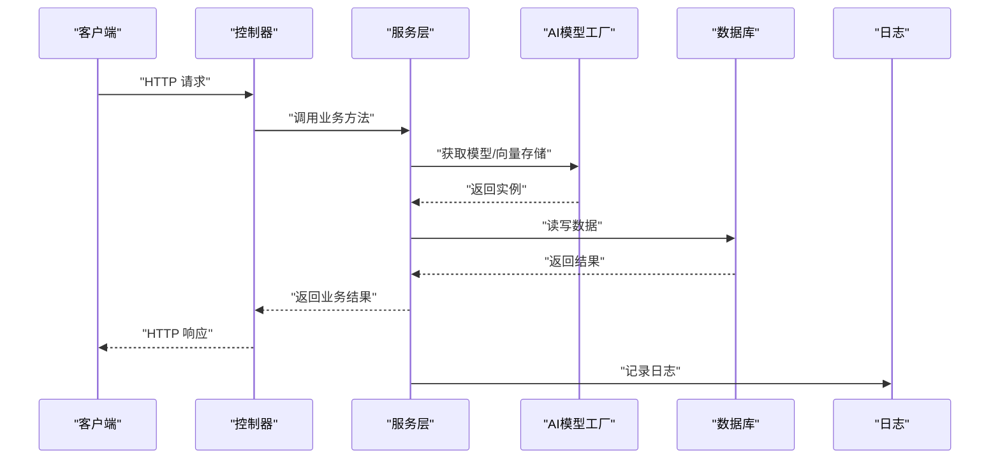
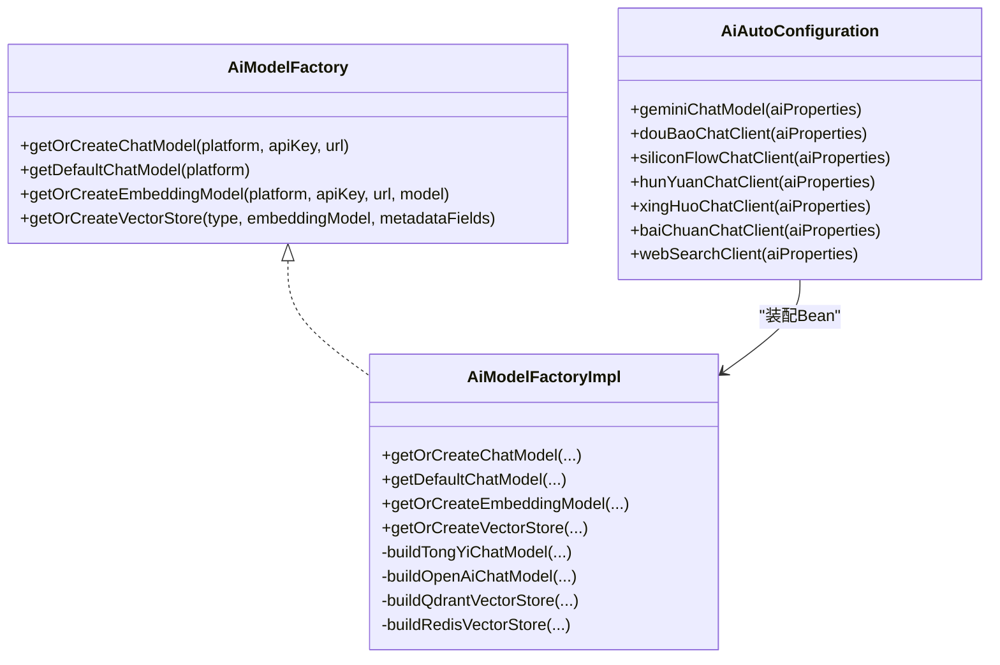
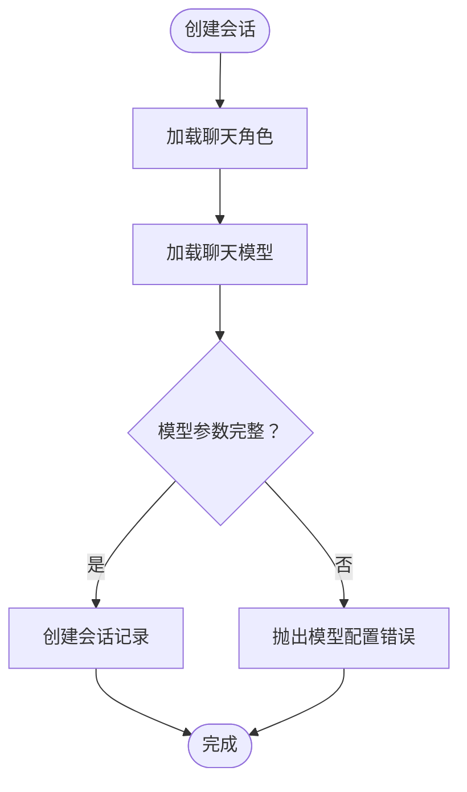
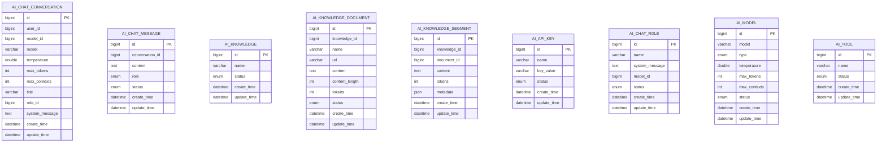
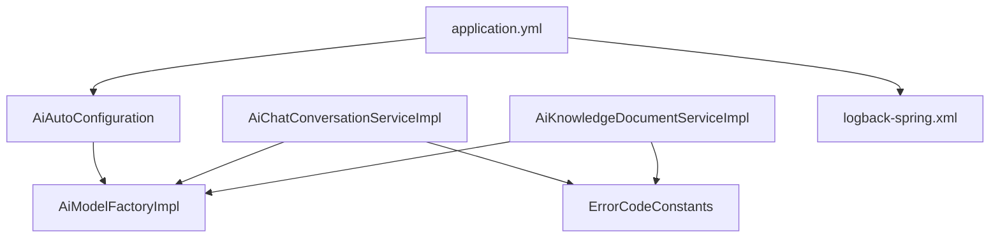

# 故障排除

<cite>
**本文引用的文件**
- [application.yml](file://src/main/resources/application.yml)
- [logback-spring.xml](file://src/main/resources/logback-spring.xml)
- [AiAutoConfiguration.java](file://src/main/java/cn/boss/data/ai/framework/ai/config/AiAutoConfiguration.java)
- [AiProperties.java](file://src/main/java/cn/boss/data/ai/framework/ai/config/AiProperties.java)
- [AiModelFactory.java](file://src/main/java/cn/boss/data/ai/framework/ai/core/model/AiModelFactory.java)
- [AiModelFactoryImpl.java](file://src/main/java/cn/boss/data/ai/framework/ai/core/model/AiModelFactoryImpl.java)
- [ErrorCodeConstants.java](file://src/main/java/cn/boss/data/ai/enums/ErrorCodeConstants.java)
- [ErrorCode.java](file://src/main/java/cn/boss/data/ai/framework/common/exception/ErrorCode.java)
- [ServiceException.java](file://src/main/java/cn/boss/data/ai/framework/common/exception/ServiceException.java)
- [ServiceExceptionUtil.java](file://src/main/java/cn/boss/data/ai/framework/common/exception/util/ServiceExceptionUtil.java)
- [GlobalErrorCodeConstants.java](file://src/main/java/cn/boss/data/ai/framework/common/exception/enums/GlobalErrorCodeConstants.java)
- [AiChatConversationServiceImpl.java](file://src/main/java/cn/boss/data/ai/service/chat/AiChatConversationServiceImpl.java)
- [AiKnowledgeDocumentServiceImpl.java](file://src/main/java/cn/boss/data/ai/service/knowledge/AiKnowledgeDocumentServiceImpl.java)
- [AiKnowledgeSegmentServiceImpl.java](file://src/main/java/cn/boss/data/ai/service/knowledge/AiKnowledgeSegmentServiceImpl.java)
- [AiKnowledgeServiceImpl.java](file://src/main/java/cn/boss/data/ai/service/knowledge/AiKnowledgeServiceImpl.java)
- [AiKnowledgeDocumentMapper.java](file://src/main/java/cn/boss/data/ai/dal/mysql/knowledge/AiKnowledgeDocumentMapper.java)
- [AiKnowledgeSegmentMapper.java](file://src/main/java/cn/boss/data/ai/dal/mysql/knowledge/AiKnowledgeSegmentMapper.java)
- [AiKnowledgeMapper.java](file://src/main/java/cn/boss/data/ai/dal/mysql/knowledge/AiKnowledgeMapper.java)
- [AiChatConversationMapper.java](file://src/main/java/cn/boss/data/ai/dal/mysql/chat/AiChatConversationMapper.java)
- [AiChatMessageMapper.java](file://src/main/java/cn/boss/data/ai/dal/mysql/chat/AiChatMessageMapper.java)
- [AiApiKeyMapper.java](file://src/main/java/cn/boss/data/ai/dal/mysql/model/AiApiKeyMapper.java)
- [AiChatRoleMapper.java](file://src/main/java/cn/boss/data/ai/dal/mysql/model/AiChatRoleMapper.java)
- [AiModelMapper.java](file://src/main/java/cn/boss/data/ai/dal/mysql/model/AiModelMapper.java)
- [AiToolMapper.java](file://src/main/java/cn/boss/data/ai/dal/mysql/model/AiToolMapper.java)
- [AiChatConversationController.java](file://src/main/java/cn/boss/data/ai/controller/chat/AiChatConversationController.java)
- [AiChatMessageController.java](file://src/main/java/cn/boss/data/ai/controller/chat/AiChatMessageController.java)
- [AiKnowledgeController.java](file://src/main/java/cn/boss/data/ai/controller/knowledge/AiKnowledgeController.java)
- [AiKnowledgeDocumentController.java](file://src/main/java/cn/boss/data/ai/controller/knowledge/AiKnowledgeDocumentController.java)
- [AiKnowledgeSegmentController.java](file://src/main/java/cn/boss/data/ai/controller/knowledge/AiKnowledgeSegmentController.java)
- [AiApiKeyController.java](file://src/main/java/cn/boss/data/ai/controller/model/AiApiKeyController.java)
- [AiChatRoleController.java](file://src/main/java/cn/boss/data/ai/controller/model/AiChatRoleController.java)
- [AiModelController.java](file://src/main/java/cn/boss/data/ai/controller/model/AiModelController.java)
- [AiToolController.java](file://src/main/java/cn/boss/data/ai/controller/model/AiToolController.java)
- [AiChatConversationDO.java](file://src/main/java/cn/boss/data/ai/dal/dataobject/chat/AiChatConversationDO.java)
- [AiChatMessageDO.java](file://src/main/java/cn/boss/data/ai/dal/dataobject/chat/AiChatMessageDO.java)
- [AiKnowledgeDO.java](file://src/main/java/cn/boss/data/ai/dal/dataobject/knowledge/AiKnowledgeDO.java)
- [AiKnowledgeDocumentDO.java](file://src/main/java/cn/boss/data/ai/dal/dataobject/knowledge/AiKnowledgeDocumentDO.java)
- [AiKnowledgeSegmentDO.java](file://src/main/java/cn/boss/data/ai/dal/dataobject/knowledge/AiKnowledgeSegmentDO.java)
- [AiApiKeyDO.java](file://src/main/java/cn/boss/data/ai/dal/dataobject/model/AiApiKeyDO.java)
- [AiChatRoleDO.java](file://src/main/java/cn/boss/data/ai/dal/dataobject/model/AiChatRoleDO.java)
- [AiModelDO.java](file://src/main/java/cn/boss/data/ai/dal/dataobject/model/AiModelDO.java)
- [AiToolDO.java](file://src/main/java/cn/boss/data/ai/dal/dataobject/model/AiToolDO.java)
- [AiModelTypeEnum.java](file://src/main/java/cn/boss/data/ai/enums/model/AiModelTypeEnum.java)
- [AiPlatformEnum.java](file://src/main/java/cn/boss/data/ai/enums/model/AiPlatformEnum.java)
- [BootstrapApplication.java](file://src/main/java/cn/boss/data/ai/BootstrapApplication.java)
</cite>

## 目录
1. [简介](#简介)
2. [项目结构](#项目结构)
3. [核心组件](#核心组件)
4. [架构总览](#架构总览)
5. [详细组件分析](#详细组件分析)
6. [依赖分析](#依赖分析)
7. [性能考虑](#性能考虑)
8. [故障排除指南](#故障排除指南)
9. [结论](#结论)
10. [附录](#附录)

## 简介
本指南面向Data-AI项目的开发者与运维人员，提供系统化的故障排除方法与最佳实践。覆盖AI模型连接失败、数据库连接异常、Redis缓存问题、网络连接问题、性能瓶颈、内存与资源耗尽风险、监控与告警解读，以及问题上报与社区支持渠道。文档结合代码结构与配置文件，给出可落地的定位与修复步骤。

## 项目结构
Data-AI采用分层架构：控制器层负责HTTP请求入口；服务层封装业务逻辑；持久层通过MyBatis-Plus访问数据库；AI框架通过Spring配置与工厂类统一管理多平台模型与向量存储；异常体系提供统一错误码与错误信息格式化能力；日志与配置文件定义运行期行为。

**图表来源**
- [BootstrapApplication.java](file://src/main/java/cn/boss/data/ai/BootstrapApplication.java)
- [AiChatConversationController.java](file://src/main/java/cn/boss/data/ai/controller/chat/AiChatConversationController.java)
- [AiChatMessageController.java](file://src/main/java/cn/boss/data/ai/controller/chat/AiChatMessageController.java)
- [AiKnowledgeController.java](file://src/main/java/cn/boss/data/ai/controller/knowledge/AiKnowledgeController.java)
- [AiKnowledgeDocumentController.java](file://src/main/java/cn/boss/data/ai/controller/knowledge/AiKnowledgeDocumentController.java)
- [AiKnowledgeSegmentController.java](file://src/main/java/cn/boss/data/ai/controller/knowledge/AiKnowledgeSegmentController.java)
- [AiApiKeyController.java](file://src/main/java/cn/boss/data/ai/controller/model/AiApiKeyController.java)
- [AiChatRoleController.java](file://src/main/java/cn/boss/data/ai/controller/model/AiChatRoleController.java)
- [AiModelController.java](file://src/main/java/cn/boss/data/ai/controller/model/AiModelController.java)
- [AiToolController.java](file://src/main/java/cn/boss/data/ai/controller/model/AiToolController.java)
- [AiChatConversationServiceImpl.java](file://src/main/java/cn/boss/data/ai/service/chat/AiChatConversationServiceImpl.java)
- [AiChatMessageServiceImpl.java](file://src/main/java/cn/boss/data/ai/service/chat/AiChatMessageServiceImpl.java)
- [AiKnowledgeServiceImpl.java](file://src/main/java/cn/boss/data/ai/service/knowledge/AiKnowledgeServiceImpl.java)
- [AiKnowledgeDocumentServiceImpl.java](file://src/main/java/cn/boss/data/ai/service/knowledge/AiKnowledgeDocumentServiceImpl.java)
- [AiKnowledgeSegmentServiceImpl.java](file://src/main/java/cn/boss/data/ai/service/knowledge/AiKnowledgeSegmentServiceImpl.java)
- [AiApiKeyServiceImpl.java](file://src/main/java/cn/boss/data/ai/service/model/AiApiKeyServiceImpl.java)
- [AiChatRoleServiceImpl.java](file://src/main/java/cn/boss/data/ai/service/model/AiChatRoleServiceImpl.java)
- [AiModelServiceImpl.java](file://src/main/java/cn/boss/data/ai/service/model/AiModelServiceImpl.java)
- [AiToolServiceImpl.java](file://src/main/java/cn/boss/data/ai/service/model/AiToolServiceImpl.java)
- [AiAutoConfiguration.java](file://src/main/java/cn/boss/data/ai/framework/ai/config/AiAutoConfiguration.java)
- [AiModelFactoryImpl.java](file://src/main/java/cn/boss/data/ai/framework/ai/core/model/AiModelFactoryImpl.java)
- [AiProperties.java](file://src/main/java/cn/boss/data/ai/framework/ai/config/AiProperties.java)
- [application.yml](file://src/main/resources/application.yml)
- [logback-spring.xml](file://src/main/resources/logback-spring.xml)

**章节来源**
- [BootstrapApplication.java](file://src/main/java/cn/boss/data/ai/BootstrapApplication.java)
- [application.yml](file://src/main/resources/application.yml)
- [logback-spring.xml](file://src/main/resources/logback-spring.xml)

## 核心组件
- 异常与错误码体系：统一的错误码定义与格式化工具，便于快速定位问题来源与类型。
- AI模型工厂与自动配置：集中管理多平台模型、嵌入模型与向量存储，支持按平台与配置动态创建与复用。
- 服务层业务校验：对模型、角色、知识库等关键对象进行存在性与完整性校验，防止无效调用导致的链路异常。
- 数据访问层：基于MyBatis-Plus的Mapper与DO，提供分页、条件查询与批量操作能力。
- 日志与配置：应用端口、数据源、Redis、AI平台配置、日志级别等均在配置文件中集中管理。

**章节来源**
- [ErrorCodeConstants.java](file://src/main/java/cn/boss/data/ai/enums/ErrorCodeConstants.java)
- [ServiceExceptionUtil.java](file://src/main/java/cn/boss/data/ai/framework/common/exception/util/ServiceExceptionUtil.java)
- [AiAutoConfiguration.java](file://src/main/java/cn/boss/data/ai/framework/ai/config/AiAutoConfiguration.java)
- [AiModelFactoryImpl.java](file://src/main/java/cn/boss/data/ai/framework/ai/core/model/AiModelFactoryImpl.java)
- [AiChatConversationServiceImpl.java](file://src/main/java/cn/boss/data/ai/service/chat/AiChatConversationServiceImpl.java)
- [application.yml](file://src/main/resources/application.yml)
- [logback-spring.xml](file://src/main/resources/logback-spring.xml)

## 架构总览
Data-AI通过控制器接收请求，调用服务层执行业务逻辑，服务层根据需要访问数据库或调用AI模型工厂获取模型实例，最终返回结果。异常通过统一的错误码与异常工具抛出，日志由Logback输出。

**图表来源**
- [AiChatConversationController.java](file://src/main/java/cn/boss/data/ai/controller/chat/AiChatConversationController.java)
- [AiChatConversationServiceImpl.java](file://src/main/java/cn/boss/data/ai/service/chat/AiChatConversationServiceImpl.java)
- [AiModelFactoryImpl.java](file://src/main/java/cn/boss/data/ai/framework/ai/core/model/AiModelFactoryImpl.java)
- [AiChatConversationMapper.java](file://src/main/java/cn/boss/data/ai/dal/mysql/chat/AiChatConversationMapper.java)
- [logback-spring.xml](file://src/main/resources/logback-spring.xml)

## 详细组件分析

### AI模型工厂与自动配置
- 工厂接口定义了获取ChatModel、EmbeddingModel与VectorStore的方法，并支持基于平台与配置的缓存复用。
- 工厂实现根据平台分支构建不同供应商的模型客户端，同时支持本地Ollama与云端平台（如OpenAI、Azure、文心一言、智谱、通义、字节豆包、腾讯混元、硅基流动、讯飞星火、百川、Moonshot、Grok等）。
- 自动配置类按boss.ai.*开关启用对应平台客户端，并注入工具调用管理器与观测注册表，便于追踪与性能分析。

**图表来源**
- [AiModelFactory.java](file://src/main/java/cn/boss/data/ai/framework/ai/core/model/AiModelFactory.java)
- [AiModelFactoryImpl.java](file://src/main/java/cn/boss/data/ai/framework/ai/core/model/AiModelFactoryImpl.java)
- [AiAutoConfiguration.java](file://src/main/java/cn/boss/data/ai/framework/ai/config/AiAutoConfiguration.java)

**章节来源**
- [AiModelFactory.java](file://src/main/java/cn/boss/data/ai/framework/ai/core/model/AiModelFactory.java)
- [AiModelFactoryImpl.java](file://src/main/java/cn/boss/data/ai/framework/ai/core/model/AiModelFactoryImpl.java)
- [AiAutoConfiguration.java](file://src/main/java/cn/boss/data/ai/framework/ai/config/AiAutoConfiguration.java)
- [AiProperties.java](file://src/main/java/cn/boss/data/ai/framework/ai/config/AiProperties.java)

### 服务层业务校验与错误处理
- 会话服务在创建会话时校验聊天角色与模型配置的完整性，若模型参数缺失或类型不匹配则抛出相应错误码。
- 知识库文档服务在读取远程URL时进行下载与解析，若下载失败或解析为空则抛出对应错误码，并记录日志。

**图表来源**
- [AiChatConversationServiceImpl.java](file://src/main/java/cn/boss/data/ai/service/chat/AiChatConversationServiceImpl.java)
- [ErrorCodeConstants.java](file://src/main/java/cn/boss/data/ai/enums/ErrorCodeConstants.java)

**章节来源**
- [AiChatConversationServiceImpl.java](file://src/main/java/cn/boss/data/ai/service/chat/AiChatConversationServiceImpl.java)
- [AiKnowledgeDocumentServiceImpl.java](file://src/main/java/cn/boss/data/ai/service/knowledge/AiKnowledgeDocumentServiceImpl.java)
- [ErrorCodeConstants.java](file://src/main/java/cn/boss/data/ai/enums/ErrorCodeConstants.java)

### 数据访问层与实体对象
- Mapper与DO构成标准的MyBatis-Plus访问层，提供分页、条件查询、批量插入与更新能力。
- 实体DO包含通用字段填充逻辑（创建时间、更新时间），确保数据一致性。

**图表来源**
- [AiChatConversationDO.java](file://src/main/java/cn/boss/data/ai/dal/dataobject/chat/AiChatConversationDO.java)
- [AiChatMessageDO.java](file://src/main/java/cn/boss/data/ai/dal/dataobject/chat/AiChatMessageDO.java)
- [AiKnowledgeDO.java](file://src/main/java/cn/boss/data/ai/dal/dataobject/knowledge/AiKnowledgeDO.java)
- [AiKnowledgeDocumentDO.java](file://src/main/java/cn/boss/data/ai/dal/dataobject/knowledge/AiKnowledgeDocumentDO.java)
- [AiKnowledgeSegmentDO.java](file://src/main/java/cn/boss/data/ai/dal/dataobject/knowledge/AiKnowledgeSegmentDO.java)
- [AiApiKeyDO.java](file://src/main/java/cn/boss/data/ai/dal/dataobject/model/AiApiKeyDO.java)
- [AiChatRoleDO.java](file://src/main/java/cn/boss/data/ai/dal/dataobject/model/AiChatRoleDO.java)
- [AiModelDO.java](file://src/main/java/cn/boss/data/ai/dal/dataobject/model/AiModelDO.java)
- [AiToolDO.java](file://src/main/java/cn/boss/data/ai/dal/dataobject/model/AiToolDO.java)

**章节来源**
- [AiChatConversationMapper.java](file://src/main/java/cn/boss/data/ai/dal/mysql/chat/AiChatConversationMapper.java)
- [AiChatMessageMapper.java](file://src/main/java/cn/boss/data/ai/dal/mysql/chat/AiChatMessageMapper.java)
- [AiKnowledgeMapper.java](file://src/main/java/cn/boss/data/ai/dal/mysql/knowledge/AiKnowledgeMapper.java)
- [AiKnowledgeDocumentMapper.java](file://src/main/java/cn/boss/data/ai/dal/mysql/knowledge/AiKnowledgeDocumentMapper.java)
- [AiKnowledgeSegmentMapper.java](file://src/main/java/cn/boss/data/ai/dal/mysql/knowledge/AiKnowledgeSegmentMapper.java)
- [AiApiKeyMapper.java](file://src/main/java/cn/boss/data/ai/dal/mysql/model/AiApiKeyMapper.java)
- [AiChatRoleMapper.java](file://src/main/java/cn/boss/data/ai/dal/mysql/model/AiChatRoleMapper.java)
- [AiModelMapper.java](file://src/main/java/cn/boss/data/ai/dal/mysql/model/AiModelMapper.java)
- [AiToolMapper.java](file://src/main/java/cn/boss/data/ai/dal/mysql/model/AiToolMapper.java)

## 依赖分析
- 应用配置集中于application.yml，涵盖服务器端口、数据源、Redis、MyBatis-Plus、AI平台配置与日志级别。
- AI模块通过AiAutoConfiguration按boss.ai.*开关启用不同平台客户端，AiModelFactoryImpl按平台分支构建具体实现。
- 服务层通过异常工具与错误码常量抛出标准化错误，便于前端与监控系统识别。

**图表来源**
- [application.yml](file://src/main/resources/application.yml)
- [AiAutoConfiguration.java](file://src/main/java/cn/boss/data/ai/framework/ai/config/AiAutoConfiguration.java)
- [AiModelFactoryImpl.java](file://src/main/java/cn/boss/data/ai/framework/ai/core/model/AiModelFactoryImpl.java)
- [AiChatConversationServiceImpl.java](file://src/main/java/cn/boss/data/ai/service/chat/AiChatConversationServiceImpl.java)
- [AiKnowledgeDocumentServiceImpl.java](file://src/main/java/cn/boss/data/ai/service/knowledge/AiKnowledgeDocumentServiceImpl.java)
- [ErrorCodeConstants.java](file://src/main/java/cn/boss/data/ai/enums/ErrorCodeConstants.java)
- [logback-spring.xml](file://src/main/resources/logback-spring.xml)

**章节来源**
- [application.yml](file://src/main/resources/application.yml)
- [AiAutoConfiguration.java](file://src/main/java/cn/boss/data/ai/framework/ai/config/AiAutoConfiguration.java)
- [AiModelFactoryImpl.java](file://src/main/java/cn/boss/data/ai/framework/ai/core/model/AiModelFactoryImpl.java)
- [AiChatConversationServiceImpl.java](file://src/main/java/cn/boss/data/ai/service/chat/AiChatConversationServiceImpl.java)
- [AiKnowledgeDocumentServiceImpl.java](file://src/main/java/cn/boss/data/ai/service/knowledge/AiKnowledgeDocumentServiceImpl.java)
- [ErrorCodeConstants.java](file://src/main/java/cn/boss/data/ai/enums/ErrorCodeConstants.java)
- [logback-spring.xml](file://src/main/resources/logback-spring.xml)

## 性能考虑
- 向量存储策略：支持Redis、Qdrant与本地SimpleVectorStore。Redis与Qdrant具备分布式与高并发能力，SimpleVectorStore适用于开发测试场景。
- 批量策略：通过TokenCountBatchingStrategy减少嵌入调用次数，提升吞吐。
- 观测与追踪：注入ObservationRegistry与自定义Convention，便于埋点与性能分析。
- 日志级别：生产环境建议调整日志级别，避免INFO以上级别对性能的影响。

**章节来源**
- [AiModelFactoryImpl.java](file://src/main/java/cn/boss/data/ai/framework/ai/core/model/AiModelFactoryImpl.java)
- [AiAutoConfiguration.java](file://src/main/java/cn/boss/data/ai/framework/ai/config/AiAutoConfiguration.java)
- [application.yml](file://src/main/resources/application.yml)

## 故障排除指南

### 一、AI模型连接失败
常见症状
- 调用模型接口报错，提示模型不可用或鉴权失败。
- 控制台出现平台特定异常或超时。

排查步骤
1. 检查AI平台配置
   - 确认boss.ai.*平台的enable开关是否开启，API Key与Base URL是否正确。
   - 参考路径：[application.yml](file://src/main/resources/application.yml)
2. 校验模型工厂
   - 确认AiModelFactoryImpl中对应平台分支是否被正确构建。
   - 参考路径：[AiModelFactoryImpl.java](file://src/main/java/cn/boss/data/ai/framework/ai/core/model/AiModelFactoryImpl.java)
3. 查看自动配置
   - 确认AiAutoConfiguration中对应平台Bean是否被创建。
   - 参考路径：[AiAutoConfiguration.java](file://src/main/java/cn/boss/data/ai/framework/ai/config/AiAutoConfiguration.java)
4. 检查日志
   - 提升日志级别至DEBUG，观察模型初始化与调用过程。
   - 参考路径：[logback-spring.xml](file://src/main/resources/logback-spring.xml)

错误码参考
- API密钥不存在/已禁用：参考[ErrorCodeConstants.java](file://src/main/java/cn/boss/data/ai/enums/ErrorCodeConstants.java)
- 模型不存在/已禁用/默认模型不存在/模型类型错误：参考同上

**章节来源**
- [application.yml](file://src/main/resources/application.yml)
- [AiModelFactoryImpl.java](file://src/main/java/cn/boss/data/ai/framework/ai/core/model/AiModelFactoryImpl.java)
- [AiAutoConfiguration.java](file://src/main/java/cn/boss/data/ai/framework/ai/config/AiAutoConfiguration.java)
- [logback-spring.xml](file://src/main/resources/logback-spring.xml)
- [ErrorCodeConstants.java](file://src/main/java/cn/boss/data/ai/enums/ErrorCodeConstants.java)

### 二、数据库连接异常
常见症状
- 启动时报数据库连接失败或SQL执行异常。
- 运行期出现连接池耗尽、超时。

排查步骤
1. 检查数据源配置
   - 确认spring.datasource.dynamic.*配置与MySQL地址、端口、用户名、密码一致。
   - 参考路径：[application.yml](file://src/main/resources/application.yml)
2. 校验驱动与URL
   - 确认驱动类名与URL参数正确，特别是时区与SSL设置。
   - 参考路径：[application.yml](file://src/main/resources/application.yml)
3. 查看MyBatis-Plus配置
   - 确认类型别名包与全局配置（逻辑删除值、ID策略等）。
   - 参考路径：[application.yml](file://src/main/resources/application.yml)
4. 检查Mapper与DO映射
   - 确保实体类与表结构一致，字段命名符合驼峰规则。
   - 参考路径：[AiChatConversationMapper.java](file://src/main/java/cn/boss/data/ai/dal/mysql/chat/AiChatConversationMapper.java) 等

**章节来源**
- [application.yml](file://src/main/resources/application.yml)
- [AiChatConversationMapper.java](file://src/main/java/cn/boss/data/ai/dal/mysql/chat/AiChatConversationMapper.java)

### 三、Redis缓存问题
常见症状
- 向量存储写入/读取失败，或Redis连接超时。
- 缓存键冲突或数据结构异常。

排查步骤
1. 检查Redis配置
   - 确认host、port、database等配置正确。
   - 参考路径：[application.yml](file://src/main/resources/application.yml)
2. 校验向量存储构建
   - 确认RedisVectorStore的indexName、prefix与initializeSchema配置。
   - 参考路径：[AiModelFactoryImpl.java](file://src/main/java/cn/boss/data/ai/framework/ai/core/model/AiModelFactoryImpl.java)
3. 验证连接池
   - 使用JedisPooled连接验证连通性与认证。
   - 参考路径：[AiModelFactoryImpl.java](file://src/main/java/cn/boss/data/ai/framework/ai/core/model/AiModelFactoryImpl.java)
4. 清理与重建索引
   - 若schema初始化失败，尝试关闭initializeSchema后手动重建。

**章节来源**
- [application.yml](file://src/main/resources/application.yml)
- [AiModelFactoryImpl.java](file://src/main/java/cn/boss/data/ai/framework/ai/core/model/AiModelFactoryImpl.java)

### 四、网络连接问题
常见症状
- 远程URL下载失败、HTTP请求超时。
- AI平台接口调用失败。

排查步骤
1. 检查外网连通性
   - 使用ping/traceroute验证目标域名可达。
2. 校验代理与防火墙
   - 确认代理设置与安全组放行必要端口。
3. 重试与超时
   - 在客户端增加指数退避重试与合理超时时间。
4. 本地回环与容器网络
   - 若使用容器，确认端口映射与网络模式。

**章节来源**
- [AiKnowledgeDocumentServiceImpl.java](file://src/main/java/cn/boss/data/ai/service/knowledge/AiKnowledgeDocumentServiceImpl.java)

### 五、性能问题诊断与优化
常见症状
- 响应时间长、吞吐量低、CPU/内存占用高。

诊断方法
1. 启用观测与埋点
   - 确认ObservationRegistry与Convention已注入，查看模型调用耗时。
   - 参考路径：[AiAutoConfiguration.java](file://src/main/java/cn/boss/data/ai/framework/ai/config/AiAutoConfiguration.java)
2. 批量策略优化
   - 使用TokenCountBatchingStrategy减少嵌入调用次数。
   - 参考路径：[AiAutoConfiguration.java](file://src/main/java/cn/boss/data/ai/framework/ai/config/AiAutoConfiguration.java)
3. 向量存储选择
   - 生产优先Redis/Qdrant，避免SimpleVectorStore的磁盘IO瓶颈。
   - 参考路径：[AiModelFactoryImpl.java](file://src/main/java/cn/boss/data/ai/framework/ai/core/model/AiModelFactoryImpl.java)
4. 日志级别
   - 降低日志级别，避免INFO以上级别带来的开销。
   - 参考路径：[logback-spring.xml](file://src/main/resources/logback-spring.xml)

**章节来源**
- [AiAutoConfiguration.java](file://src/main/java/cn/boss/data/ai/framework/ai/config/AiAutoConfiguration.java)
- [AiModelFactoryImpl.java](file://src/main/java/cn/boss/data/ai/framework/ai/core/model/AiModelFactoryImpl.java)
- [logback-spring.xml](file://src/main/resources/logback-spring.xml)

### 六、内存泄漏与资源耗尽预防
常见症状
- 进程内存持续增长、Full GC频繁、OOM。

预防措施
1. 向量存储定时保存
   - SimpleVectorStore使用定时任务定期保存，退出时也会保存，避免数据丢失。
   - 参考路径：[AiModelFactoryImpl.java](file://src/main/java/cn/boss/data/ai/framework/ai/core/model/AiModelFactoryImpl.java)
2. 连接池管理
   - Redis/Jedis连接池需正确关闭，避免连接泄漏。
   - 参考路径：[AiModelFactoryImpl.java](file://src/main/java/cn/boss/data/ai/framework/ai/core/model/AiModelFactoryImpl.java)
3. 事务边界
   - 确保数据库事务边界清晰，避免长时间持有连接。
   - 参考路径：[AiKnowledgeDocumentServiceImpl.java](file://src/main/java/cn/boss/data/ai/service/knowledge/AiKnowledgeDocumentServiceImpl.java)

**章节来源**
- [AiModelFactoryImpl.java](file://src/main/java/cn/boss/data/ai/framework/ai/core/model/AiModelFactoryImpl.java)
- [AiKnowledgeDocumentServiceImpl.java](file://src/main/java/cn/boss/data/ai/service/knowledge/AiKnowledgeDocumentServiceImpl.java)

### 七、监控指标与告警处理
监控建议
- 指标维度：请求QPS、P95/P99延迟、错误率、模型调用耗时、向量存储写入/查询耗时、数据库连接池使用率。
- 告警阈值：错误率超1%、延迟P95超阈值、连接池空闲数为0、向量存储写入失败率高。
- 观测手段：利用ObservationRegistry与自定义Convention采集指标，结合日志与APM系统。

**章节来源**
- [AiAutoConfiguration.java](file://src/main/java/cn/boss/data/ai/framework/ai/config/AiAutoConfiguration.java)
- [logback-spring.xml](file://src/main/resources/logback-spring.xml)

### 八、错误码与解决步骤对照
- API密钥相关
  - 错误码：API_KEY_NOT_EXISTS、API_KEY_DISABLE
  - 解决：检查API Key有效性与启用状态，确认boss.ai.*平台配置。
  - 参考：[ErrorCodeConstants.java](file://src/main/java/cn/boss/data/ai/enums/ErrorCodeConstants.java)
- 模型相关
  - 错误码：MODEL_NOT_EXISTS、MODEL_DISABLE、MODEL_DEFAULT_NOT_EXISTS、MODEL_USE_TYPE_ERROR
  - 解决：确认模型存在且类型正确，检查默认模型配置。
  - 参考：[ErrorCodeConstants.java](file://src/main/java/cn/boss/data/ai/enums/ErrorCodeConstants.java)
- 会话相关
  - 错误码：CHAT_CONVERSATION_NOT_EXISTS、CHAT_CONVERSATION_MODEL_ERROR
  - 解决：校验会话存在性与模型配置完整性。
  - 参考：[AiChatConversationServiceImpl.java](file://src/main/java/cn/boss/data/ai/service/chat/AiChatConversationServiceImpl.java)
- 知识库文档相关
  - 错误码：KNOWLEDGE_DOCUMENT_NOT_EXISTS、KNOWLEDGE_DOCUMENT_FILE_EMPTY、KNOWLEDGE_DOCUMENT_FILE_DOWNLOAD_FAIL、KNOWLEDGE_DOCUMENT_FILE_READ_FAIL
  - 解决：检查URL可访问性与文件内容，确认Tika解析正常。
  - 参考：[AiKnowledgeDocumentServiceImpl.java](file://src/main/java/cn/boss/data/ai/service/knowledge/AiKnowledgeDocumentServiceImpl.java)
- 全局错误码
  - 参考：[GlobalErrorCodeConstants.java](file://src/main/java/cn/boss/data/ai/framework/common/exception/enums/GlobalErrorCodeConstants.java)

**章节来源**
- [ErrorCodeConstants.java](file://src/main/java/cn/boss/data/ai/enums/ErrorCodeConstants.java)
- [GlobalErrorCodeConstants.java](file://src/main/java/cn/boss/data/ai/framework/common/exception/enums/GlobalErrorCodeConstants.java)
- [AiChatConversationServiceImpl.java](file://src/main/java/cn/boss/data/ai/service/chat/AiChatConversationServiceImpl.java)
- [AiKnowledgeDocumentServiceImpl.java](file://src/main/java/cn/boss/data/ai/service/knowledge/AiKnowledgeDocumentServiceImpl.java)

### 九、日志分析技巧
- 日志级别：生产环境建议INFO，问题排查时临时提升至DEBUG。
- 关键日志：模型初始化、向量存储读写、数据库操作、异常栈。
- 日志格式：Console与文件格式在配置中定义，便于统一收集与分析。
- 参考路径：
  - [application.yml](file://src/main/resources/application.yml)
  - [logback-spring.xml](file://src/main/resources/logback-spring.xml)

**章节来源**
- [application.yml](file://src/main/resources/application.yml)
- [logback-spring.xml](file://src/main/resources/logback-spring.xml)

### 十、问题上报与社区支持
- 问题上报
  - 提供最小可复现步骤、环境信息（JDK版本、Spring Boot版本、数据库版本）、相关配置片段与关键日志。
  - 附带错误码与异常堆栈，便于快速定位。
- 社区支持
  - 通过项目仓库Issue页面提交问题，遵循模板要求。
  - 参考项目README中的贡献指南与联系方式。

**章节来源**
- [BootstrapApplication.java](file://src/main/java/cn/boss/data/ai/BootstrapApplication.java)

## 结论
通过统一的错误码体系、标准化的AI模型工厂与自动配置、完善的日志与监控机制，Data-AI能够快速定位并解决常见问题。建议在生产环境中启用分布式向量存储、合理设置批处理策略与观测埋点，并建立完善的告警与应急预案，以保障系统的稳定性与性能。

## 附录

### A. 常见错误码速查
- API密钥：API_KEY_NOT_EXISTS、API_KEY_DISABLE
- 模型：MODEL_NOT_EXISTS、MODEL_DISABLE、MODEL_DEFAULT_NOT_EXISTS、MODEL_USE_TYPE_ERROR
- 会话：CHAT_CONVERSATION_NOT_EXISTS、CHAT_CONVERSATION_MODEL_ERROR
- 知识库文档：KNOWLEDGE_DOCUMENT_NOT_EXISTS、KNOWLEDGE_DOCUMENT_FILE_EMPTY、KNOWLEDGE_DOCUMENT_FILE_DOWNLOAD_FAIL、KNOWLEDGE_DOCUMENT_FILE_READ_FAIL
- 全局：BAD_REQUEST、UNAUTHORIZED、FORBIDDEN、NOT_FOUND、TOO_MANY_REQUESTS、INTERNAL_SERVER_ERROR、NOT_IMPLEMENTED、ERROR_CONFIGURATION

**章节来源**
- [ErrorCodeConstants.java](file://src/main/java/cn/boss/data/ai/enums/ErrorCodeConstants.java)
- [GlobalErrorCodeConstants.java](file://src/main/java/cn/boss/data/ai/framework/common/exception/enums/GlobalErrorCodeConstants.java)