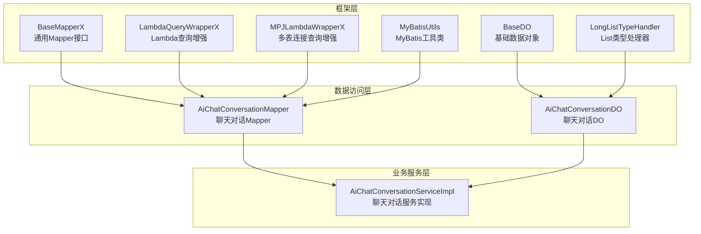
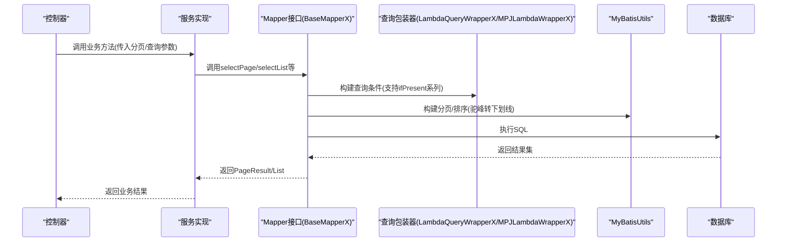
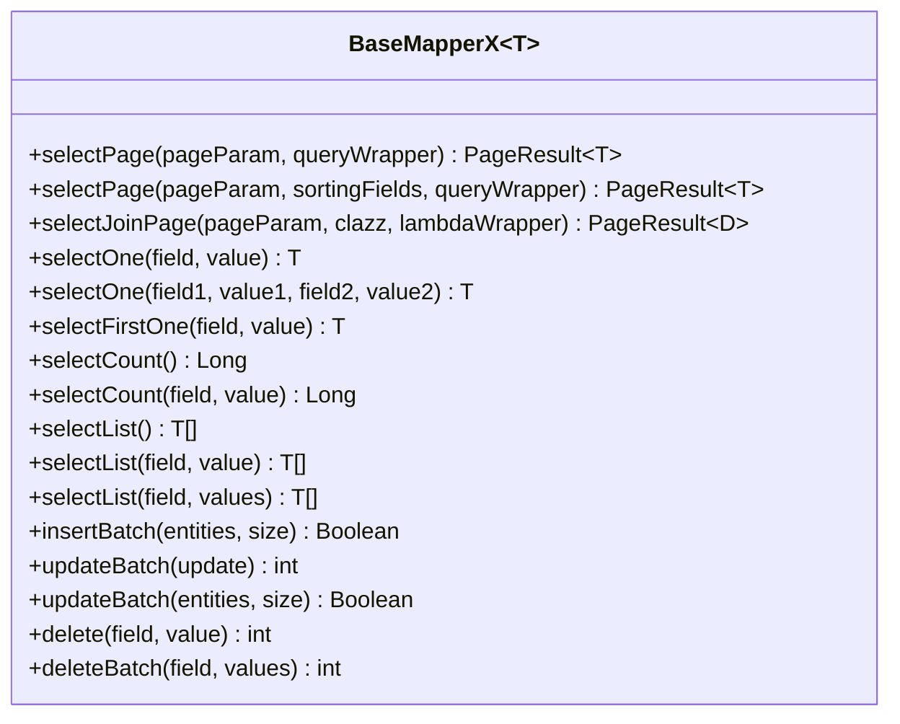
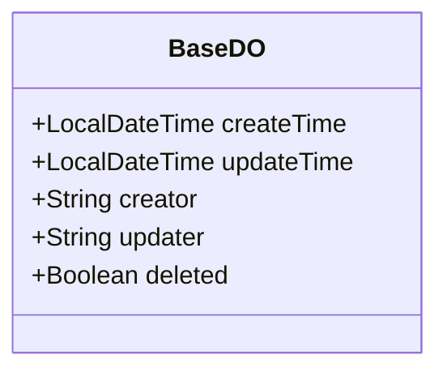
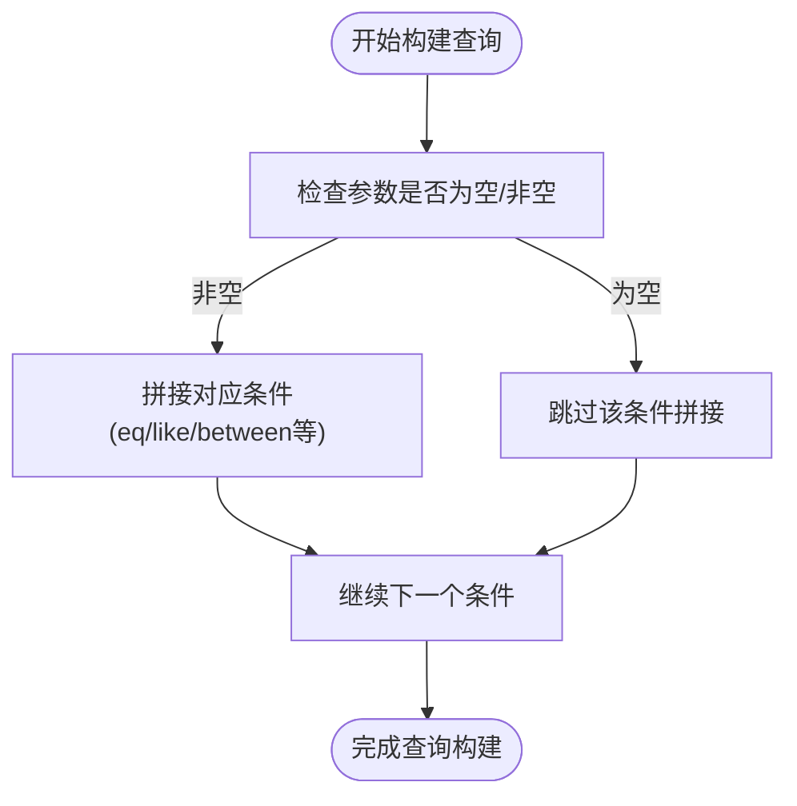
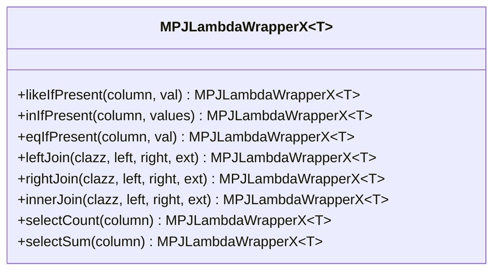
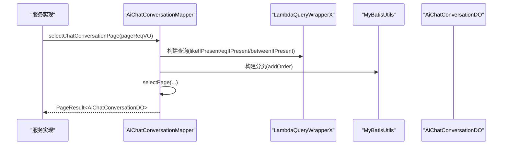
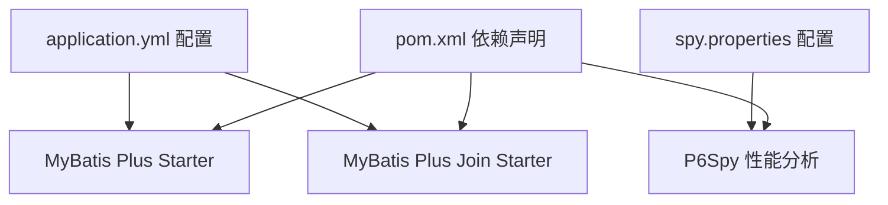

# 数据访问层设计

<cite>
**本文档引用的文件**
- [BaseMapperX.java](file://src/main/java/cn/boss/data/ai/framework/mybatis/core/mapper/BaseMapperX.java)
- [BaseDO.java](file://src/main/java/cn/boss/data/ai/framework/mybatis/core/dataobject/BaseDO.java)
- [LambdaQueryWrapperX.java](file://src/main/java/cn/boss/data/ai/framework/mybatis/core/query/LambdaQueryWrapperX.java)
- [MPJLambdaWrapperX.java](file://src/main/java/cn/boss/data/ai/framework/mybatis/core/query/MPJLambdaWrapperX.java)
- [MyBatisUtils.java](file://src/main/java/cn/boss/data/ai/framework/mybatis/core/util/MyBatisUtils.java)
- [LongListTypeHandler.java](file://src/main/java/cn/boss/data/ai/framework/mybatis/core/type/LongListTypeHandler.java)
- [AiChatConversationMapper.java](file://src/main/java/cn/boss/data/ai/dal/mysql/chat/AiChatConversationMapper.java)
- [AiChatConversationDO.java](file://src/main/java/cn/boss/data/ai/dal/dataobject/chat/AiChatConversationDO.java)
- [application.yml](file://src/main/resources/application.yml)
- [pom.xml](file://pom.xml)
- [spy.properties](file://src/main/resources/spy.properties)
- [BootstrapApplication.java](file://src/main/java/cn/boss/data/ai/BootstrapApplication.java)
- [AiChatConversationServiceImpl.java](file://src/main/java/cn/boss/data/ai/service/chat/AiChatConversationServiceImpl.java)
- [PageParam.java](file://src/main/java/cn/boss/data/ai/framework/common/pojo/PageParam.java)
- [SortablePageParam.java](file://src/main/java/cn/boss/data/ai/framework/common/pojo/SortablePageParam.java)
- [SortingField.java](file://src/main/java/cn/boss/data/ai/framework/common/pojo/SortingField.java)
</cite>

## 目录
1. [简介](#简介)
2. [项目结构](#项目结构)
3. [核心组件](#核心组件)
4. [架构概览](#架构概览)
5. [详细组件分析](#详细组件分析)
6. [依赖分析](#依赖分析)
7. [性能考虑](#性能考虑)
8. [故障排查指南](#故障排查指南)
9. [结论](#结论)
10. [附录](#附录)

## 简介
本文件面向数据访问层设计，系统性阐述 MyBatis Plus 在本项目中的配置与使用方式，重点解析以下内容：
- 通用 Mapper 基类 BaseMapperX 的设计理念与实现细节
- 数据对象（DO）设计模式，特别是 BaseDO 提供的通用字段与方法
- Lambda 表达式查询包装器的增强能力，如何简化复杂查询构建
- 数据访问层最佳实践，包括分页、批量操作、事务管理、性能优化等
- 结合具体业务场景（聊天对话、知识库等）展示完整调用链路

## 项目结构
数据访问层采用分层清晰的组织方式：
- framework/mybatis/core：MyBatis Plus 核心扩展（通用 Mapper、查询包装器、工具类、类型处理器）
- dal/dataobject：数据对象（DO），继承 BaseDO 获取统一字段
- dal/mysql：各模块对应的 Mapper 接口，继承 BaseMapperX
- service：业务服务层，调用 Mapper 完成数据操作
- resources：MyBatis Plus 配置、SQL 性能分析插件配置

**图表来源**
- [BaseMapperX.java:23-178](file://src/main/java/cn/boss/data/ai/framework/mybatis/core/mapper/BaseMapperX.java#L23-L178)
- [BaseDO.java:13-30](file://src/main/java/cn/boss/data/ai/framework/mybatis/core/dataobject/BaseDO.java#L13-L30)
- [LambdaQueryWrapperX.java:12-126](file://src/main/java/cn/boss/data/ai/framework/mybatis/core/query/LambdaQueryWrapperX.java#L12-L126)
- [MPJLambdaWrapperX.java:13-265](file://src/main/java/cn/boss/data/ai/framework/mybatis/core/query/MPJLambdaWrapperX.java#L13-L265)
- [MyBatisUtils.java:24-90](file://src/main/java/cn/boss/data/ai/framework/mybatis/core/util/MyBatisUtils.java#L24-L90)
- [LongListTypeHandler.java:21-54](file://src/main/java/cn/boss/data/ai/framework/mybatis/core/type/LongListTypeHandler.java#L21-L54)
- [AiChatConversationMapper.java:16-36](file://src/main/java/cn/boss/data/ai/dal/mysql/chat/AiChatConversationMapper.java#L16-L36)
- [AiChatConversationDO.java:22-58](file://src/main/java/cn/boss/data/ai/dal/dataobject/chat/AiChatConversationDO.java#L22-L58)
- [AiChatConversationServiceImpl.java:40-161](file://src/main/java/cn/boss/data/ai/service/chat/AiChatConversationServiceImpl.java#L40-L161)

**章节来源**
- [BootstrapApplication.java:8-16](file://src/main/java/cn/boss/data/ai/BootstrapApplication.java#L8-L16)
- [application.yml:35-55](file://src/main/resources/application.yml#L35-L55)

## 核心组件
本节深入解析数据访问层的关键组件及其职责与实现要点。

- 通用 Mapper 基类 BaseMapperX
  - 设计理念：在 MyBatis-Plus 的 MPJBaseMapper 基础上，统一提供分页、单条查询、批量插入/更新、条件删除等常用方法，减少重复代码
  - 关键能力：
    - 分页查询：selectPage 支持 PageParam 和 SortablePageParam，自动处理排序字段转换与分页构建
    - 连接分页：selectJoinPage 支持多表连接分页查询
    - 单条查询：selectOne/selectFirstOne 提供按字段精确匹配的便捷方法
    - 条件查询：selectList 支持 eq/in/多字段组合等
    - 批量操作：insertBatch/updateBatch 提供批量保存与批量更新
    - 删除：delete/deleteBatch 提供按字段或批量删除
  - 适用范围：所有 Mapper 接口均继承该接口，获得一致的 CRUD 能力

- 数据对象基类 BaseDO
  - 设计理念：通过统一的字段与注解，确保所有数据对象具备一致的审计信息与逻辑删除能力
  - 统一字段：
    - createTime/updateTime：自动填充创建与更新时间
    - creator/updater：自动填充创建与更新人
    - deleted：逻辑删除标记
  - 价值：降低重复注解与字段定义，提升一致性与可维护性

- Lambda 查询包装器增强
  - LambdaQueryWrapperX：在原生 LambdaQueryWrapper 基础上，新增 ifPresent 系列方法（如 likeIfPresent、eqIfPresent、betweenIfPresent 等），仅在参数非空时拼接条件，避免冗余 SQL
  - MPJLambdaWrapperX：在 MPJLambdaWrapper 基础上，提供 ifPresent 系列方法与丰富的连接查询、聚合查询、子查询选择等能力，便于复杂联表查询

- MyBatis 工具类 MyBatisUtils
  - 分页构建：buildPage 支持 PageParam 与排序字段，自动将驼峰字段转下划线
  - 排序追加：addOrder 支持在 QueryWrapper/LambdaQueryWrapper 上追加排序
  - 拦截器管理：提供向 MyBatis Plus 拦截器链中插入内层拦截器的方法

- 类型处理器 LongListTypeHandler
  - 作用：将 List<Long> 序列化为逗号分隔字符串存储到 VARCHAR 字段，并在读取时反序列化
  - 场景：适用于需要将多个数值 ID 存储为单列的场景

**章节来源**
- [BaseMapperX.java:23-178](file://src/main/java/cn/boss/data/ai/framework/mybatis/core/mapper/BaseMapperX.java#L23-L178)
- [BaseDO.java:13-30](file://src/main/java/cn/boss/data/ai/framework/mybatis/core/dataobject/BaseDO.java#L13-L30)
- [LambdaQueryWrapperX.java:12-126](file://src/main/java/cn/boss/data/ai/framework/mybatis/core/query/LambdaQueryWrapperX.java#L12-L126)
- [MPJLambdaWrapperX.java:13-265](file://src/main/java/cn/boss/data/ai/framework/mybatis/core/query/MPJLambdaWrapperX.java#L13-L265)
- [MyBatisUtils.java:24-90](file://src/main/java/cn/boss/data/ai/framework/mybatis/core/util/MyBatisUtils.java#L24-L90)
- [LongListTypeHandler.java:21-54](file://src/main/java/cn/boss/data/ai/framework/mybatis/core/type/LongListTypeHandler.java#L21-L54)

## 架构概览
数据访问层遵循“接口继承 + 基类增强 + 工具辅助”的架构模式，形成从 Mapper 到 DO 的完整链路。

**图表来源**
- [AiChatConversationServiceImpl.java:157-159](file://src/main/java/cn/boss/data/ai/service/chat/AiChatConversationServiceImpl.java#L157-L159)
- [AiChatConversationMapper.java:28-34](file://src/main/java/cn/boss/data/ai/dal/mysql/chat/AiChatConversationMapper.java#L28-L34)
- [BaseMapperX.java:25-62](file://src/main/java/cn/boss/data/ai/framework/mybatis/core/mapper/BaseMapperX.java#L25-L62)
- [LambdaQueryWrapperX.java:14-94](file://src/main/java/cn/boss/data/ai/framework/mybatis/core/query/LambdaQueryWrapperX.java#L14-L94)
- [MyBatisUtils.java:26-71](file://src/main/java/cn/boss/data/ai/framework/mybatis/core/util/MyBatisUtils.java#L26-L71)

## 详细组件分析

### BaseMapperX 组件分析
- 设计目标：统一 CRUD 与分页能力，减少 Mapper 层样板代码
- 关键方法族：
  - 分页查询：selectPage(支持 PageParam/SortablePageParam/带排序字段)
  - 连接分页：selectJoinPage(支持多表连接与结果映射)
  - 单条查询：selectOne/selectFirstOne(支持多字段组合)
  - 条件查询：selectList(支持 eq/in/多字段组合)
  - 批量操作：insertBatch/updateBatch(支持批量保存/更新)
  - 删除：delete/deleteBatch(支持按字段或批量删除)
- 实现要点：
  - 通过 MyBatisUtils 构建 Page 与排序，兼容 LambdaQueryWrapper 与 QueryWrapper
  - 使用 Db 工具类实现批量保存与批量更新，简化事务与性能优化

**图表来源**
- [BaseMapperX.java:23-178](file://src/main/java/cn/boss/data/ai/framework/mybatis/core/mapper/BaseMapperX.java#L23-L178)

**章节来源**
- [BaseMapperX.java:23-178](file://src/main/java/cn/boss/data/ai/framework/mybatis/core/mapper/BaseMapperX.java#L23-L178)

### BaseDO 组件分析
- 设计目标：为所有数据对象提供统一的审计字段与逻辑删除能力
- 字段与注解：
  - createTime/updateTime：FieldFill.INSERT/INSERT_UPDATE 自动填充
  - creator/updater：FieldFill.INSERT/INSERT_UPDATE 自动填充
  - deleted：@TableLogic 逻辑删除
- 价值：统一审计与软删除策略，减少重复配置

**图表来源**
- [BaseDO.java:13-30](file://src/main/java/cn/boss/data/ai/framework/mybatis/core/dataobject/BaseDO.java#L13-L30)

**章节来源**
- [BaseDO.java:13-30](file://src/main/java/cn/boss/data/ai/framework/mybatis/core/dataobject/BaseDO.java#L13-L30)

### LambdaQueryWrapperX 组件分析
- 设计目标：在 LambdaQueryWrapper 基础上增加“按需拼接”能力，避免空值导致的无效条件
- 关键增强：
  - likeIfPresent、eqIfPresent、neIfPresent、gt/ge/lt/le、betweenIfPresent
  - 支持 Collection/Object... 两种入参形式
  - 保持链式调用返回自身
- 使用场景：动态查询构建，如根据用户输入条件拼接 where 条件

**图表来源**
- [LambdaQueryWrapperX.java:14-94](file://src/main/java/cn/boss/data/ai/framework/mybatis/core/query/LambdaQueryWrapperX.java#L14-L94)

**章节来源**
- [LambdaQueryWrapperX.java:12-126](file://src/main/java/cn/boss/data/ai/framework/mybatis/core/query/LambdaQueryWrapperX.java#L12-L126)

### MPJLambdaWrapperX 组件分析
- 设计目标：在多表连接查询场景下，提供丰富的连接、选择、聚合、子查询能力，并支持 ifPresent 系列方法
- 关键增强：
  - 连接查询：leftJoin/rightJoin/innerJoin 及带扩展回调的重载
  - 字段选择：selectAll/selectAs/selectCount/selectSum 等
  - 条件拼接：eq/ne/gt/ge/lt/le/between 等 ifPresent 版本
- 使用场景：复杂联表查询、统计分析、子查询嵌套等

**图表来源**
- [MPJLambdaWrapperX.java:13-265](file://src/main/java/cn/boss/data/ai/framework/mybatis/core/query/MPJLambdaWrapperX.java#L13-L265)

**章节来源**
- [MPJLambdaWrapperX.java:13-265](file://src/main/java/cn/boss/data/ai/framework/mybatis/core/query/MPJLambdaWrapperX.java#L13-L265)

### MyBatisUtils 组件分析
- 设计目标：封装 MyBatis Plus 常用工具方法，统一分页与排序处理
- 关键能力：
  - buildPage：根据 PageParam 构建 Page，并设置排序字段（驼峰转下划线）
  - addOrder：在 QueryWrapper/LambdaQueryWrapper 上追加排序
  - addInterceptor：向拦截器链插入内层拦截器
  - toUnderlineCase：将 Lambda 表达式函数转换为下划线命名
- 使用场景：分页查询、排序字段处理、拦截器扩展

**章节来源**
- [MyBatisUtils.java:24-90](file://src/main/java/cn/boss/data/ai/framework/mybatis/core/util/MyBatisUtils.java#L24-L90)

### 类型处理器 LongListTypeHandler 组件分析
- 设计目标：解决 List<Long> 与数据库 VARCHAR 字段之间的映射问题
- 实现机制：
  - 写入：使用逗号分隔序列化为字符串
  - 读取：从字符串按逗号拆分为 List<Long>
- 使用场景：存储多个数值 ID 的场景

**章节来源**
- [LongListTypeHandler.java:21-54](file://src/main/java/cn/boss/data/ai/framework/mybatis/core/type/LongListTypeHandler.java#L21-L54)

### Mapper 与 DO 的实际应用
- AiChatConversationMapper：演示了 BaseMapperX 的分页查询、条件查询与 ifPresent 条件拼接的实际用法
- AiChatConversationDO：继承 BaseDO，具备统一审计字段与逻辑删除能力

**图表来源**
- [AiChatConversationServiceImpl.java:157-159](file://src/main/java/cn/boss/data/ai/service/chat/AiChatConversationServiceImpl.java#L157-L159)
- [AiChatConversationMapper.java:28-34](file://src/main/java/cn/boss/data/ai/dal/mysql/chat/AiChatConversationMapper.java#L28-L34)
- [LambdaQueryWrapperX.java:14-94](file://src/main/java/cn/boss/data/ai/framework/mybatis/core/query/LambdaQueryWrapperX.java#L14-L94)
- [MyBatisUtils.java:26-71](file://src/main/java/cn/boss/data/ai/framework/mybatis/core/util/MyBatisUtils.java#L26-L71)

**章节来源**
- [AiChatConversationMapper.java:16-36](file://src/main/java/cn/boss/data/ai/dal/mysql/chat/AiChatConversationMapper.java#L16-L36)
- [AiChatConversationDO.java:22-58](file://src/main/java/cn/boss/data/ai/dal/dataobject/chat/AiChatConversationDO.java#L22-L58)

## 依赖分析
- MyBatis Plus 与多表连接扩展
  - 依赖：mybatis-plus-spring-boot3-starter、mybatis-plus-join-boot-starter
  - 配置：application.yml 中 mybatis-plus 与 mybatis-plus-join 的全局配置
- SQL 性能分析
  - 依赖：p6spy
  - 配置：spy.properties 控制日志输出、慢 SQL 阈值等
- Mapper 扫描
  - 配置：@MapperScan("cn.boss.data.ai.dal.mysql")

**图表来源**
- [pom.xml:223-233](file://pom.xml#L223-L233)
- [application.yml:35-55](file://src/main/resources/application.yml#L35-L55)
- [spy.properties:1-28](file://src/main/resources/spy.properties#L1-L28)

**章节来源**
- [pom.xml:217-251](file://pom.xml#L217-L251)
- [application.yml:35-55](file://src/main/resources/application.yml#L35-L55)
- [spy.properties:1-28](file://src/main/resources/spy.properties#L1-L28)

## 性能考虑
- 分页与排序
  - 使用 MyBatisUtils 的 buildPage 与 addOrder，确保排序字段从驼峰转下划线，避免 SQL 错误
  - 对大数据量分页建议配合索引与必要条件过滤，避免全表扫描
- 批量操作
  - insertBatch/updateBatch 使用 Db 工具类，减少逐条执行带来的网络往返
  - 注意批量大小（size 参数），过大可能导致内存压力或数据库超时
- 条件拼接
  - 使用 LambdaQueryWrapperX/MPJLambdaWrapperX 的 ifPresent 系列方法，避免无效条件导致的全表扫描
- 逻辑删除
  - 启用逻辑删除后，查询时应避免忽略 deleted 字段，确保软删除数据被正确过滤
- SQL 性能分析
  - 通过 P6Spy 输出慢 SQL，结合数据库 EXPLAIN 分析执行计划，定位性能瓶颈

[本节为通用指导，无需特定文件来源]

## 故障排查指南
- 分页排序异常
  - 现象：排序字段不生效或报错
  - 排查：确认 PageParam/SortablePageParam 的字段是否为驼峰命名；检查 MyBatisUtils 的 addOrder 是否正确转换为下划线
- 条件拼接无效
  - 现象：传入空值时仍拼接了条件
  - 排查：确认使用的是 ifPresent 系列方法；检查参数是否为 null 或空字符串
- 批量操作失败
  - 现象：批量插入/更新失败或性能差
  - 排查：检查批量大小；确认数据库驱动与连接池配置；查看 P6Spy 慢 SQL 日志
- 逻辑删除数据泄露
  - 现象：查询返回了已删除数据
  - 排查：确认实体类是否正确标注 @TableLogic；Mapper 查询是否使用了逻辑删除过滤

**章节来源**
- [MyBatisUtils.java:44-71](file://src/main/java/cn/boss/data/ai/framework/mybatis/core/util/MyBatisUtils.java#L44-L71)
- [LambdaQueryWrapperX.java:14-94](file://src/main/java/cn/boss/data/ai/framework/mybatis/core/query/LambdaQueryWrapperX.java#L14-L94)
- [application.yml:35-55](file://src/main/resources/application.yml#L35-L55)

## 结论
本数据访问层通过 BaseMapperX、BaseDO、Lambda 查询包装器与 MyBatisUtils 等组件，实现了统一的 CRUD、分页、批量操作与条件拼接能力。结合 MPJLambdaWrapperX 的多表连接能力与类型处理器，能够高效支撑复杂业务场景的数据访问需求。配合 P6Spy 的 SQL 性能分析与合理的索引设计，可在保证开发效率的同时兼顾性能与稳定性。

[本节为总结性内容，无需特定文件来源]

## 附录

### 最佳实践清单
- 统一使用 BaseMapperX 的分页与批量方法，避免重复实现
- 所有 DO 继承 BaseDO，确保审计字段与逻辑删除一致
- 动态查询优先使用 LambdaQueryWrapperX/MPJLambdaWrapperX 的 ifPresent 系列方法
- 分页查询时明确排序字段，使用 MyBatisUtils 的 addOrder
- 批量操作合理设置批量大小，关注数据库与连接池配置
- 启用逻辑删除后，确保查询始终包含逻辑删除过滤
- 使用 P6Spy 分析慢 SQL，定期审查执行计划

### 常用代码示例路径
- 分页查询示例：[AiChatConversationMapper.java:28-34](file://src/main/java/cn/boss/data/ai/dal/mysql/chat/AiChatConversationMapper.java#L28-L34)
- 条件查询示例：[AiChatConversationMapper.java:18-26](file://src/main/java/cn/boss/data/ai/dal/mysql/chat/AiChatConversationMapper.java#L18-L26)
- 批量操作示例：[BaseMapperX.java:143-161](file://src/main/java/cn/boss/data/ai/framework/mybatis/core/mapper/BaseMapperX.java#L143-L161)
- Lambda 条件拼接示例：[LambdaQueryWrapperX.java:14-94](file://src/main/java/cn/boss/data/ai/framework/mybatis/core/query/LambdaQueryWrapperX.java#L14-L94)

**章节来源**
- [AiChatConversationMapper.java:16-36](file://src/main/java/cn/boss/data/ai/dal/mysql/chat/AiChatConversationMapper.java#L16-L36)
- [BaseMapperX.java:143-161](file://src/main/java/cn/boss/data/ai/framework/mybatis/core/mapper/BaseMapperX.java#L143-L161)
- [LambdaQueryWrapperX.java:14-94](file://src/main/java/cn/boss/data/ai/framework/mybatis/core/query/LambdaQueryWrapperX.java#L14-L94)