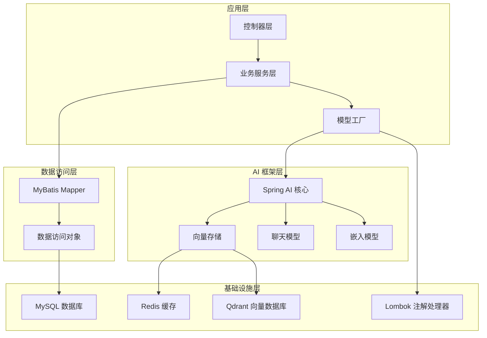
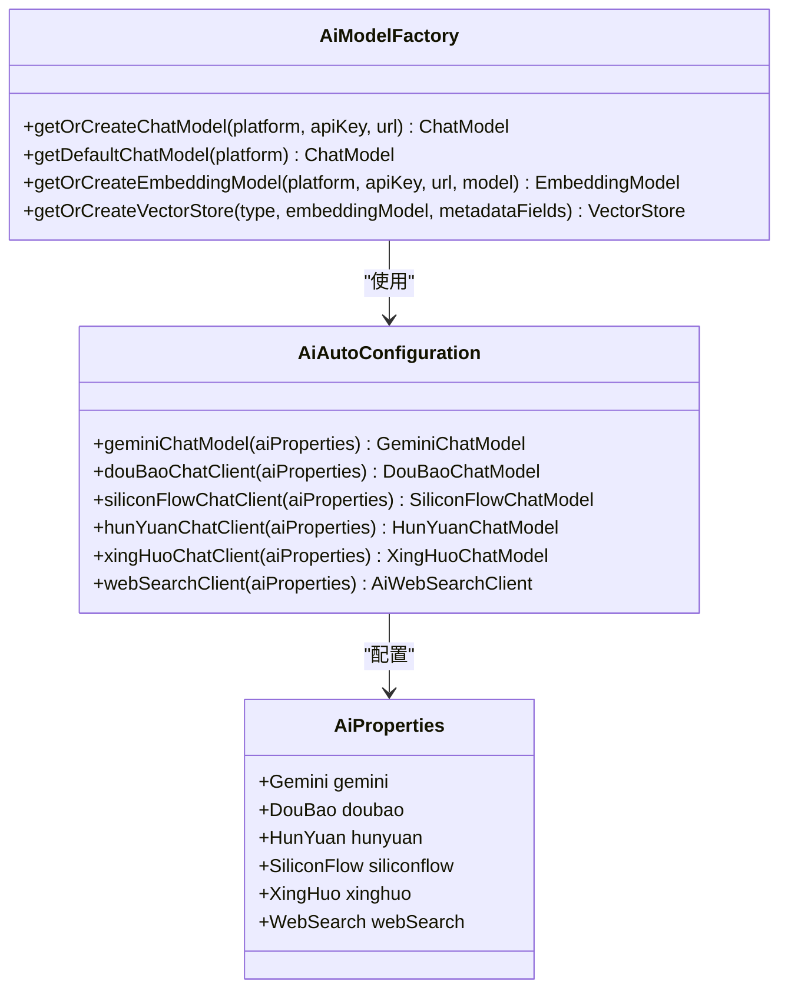
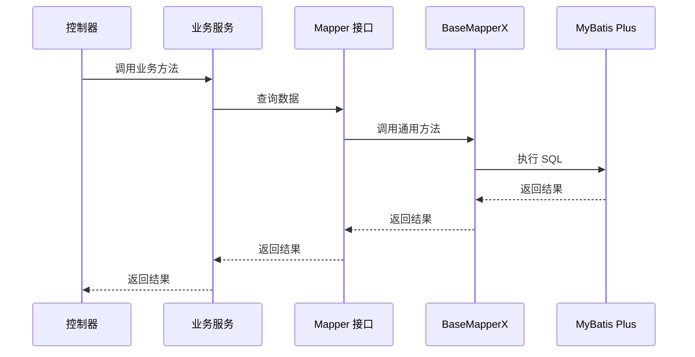
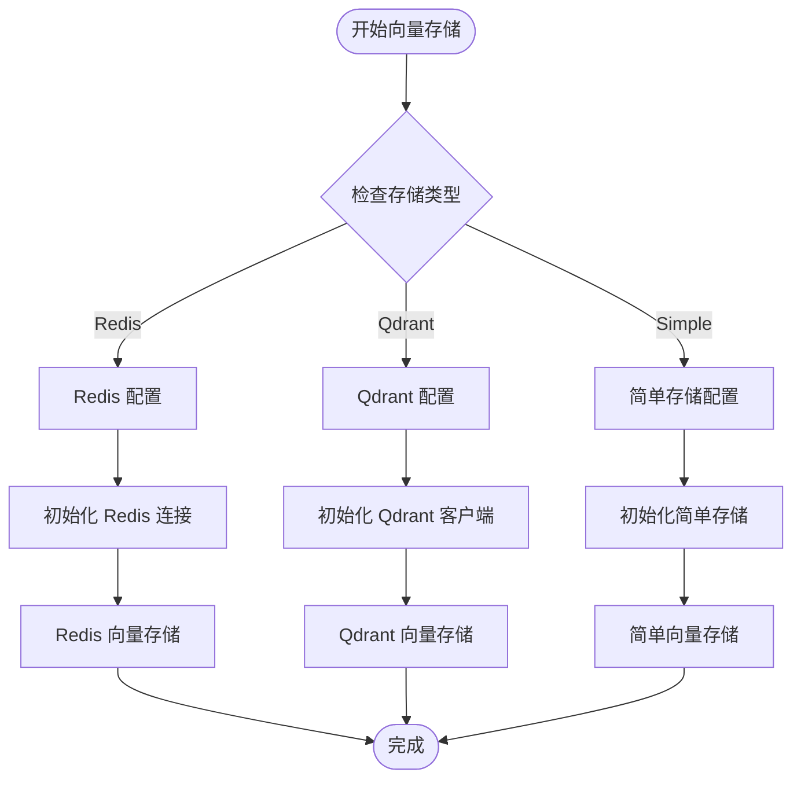
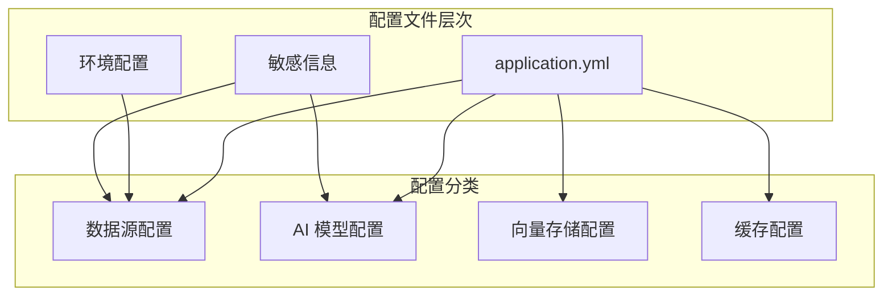
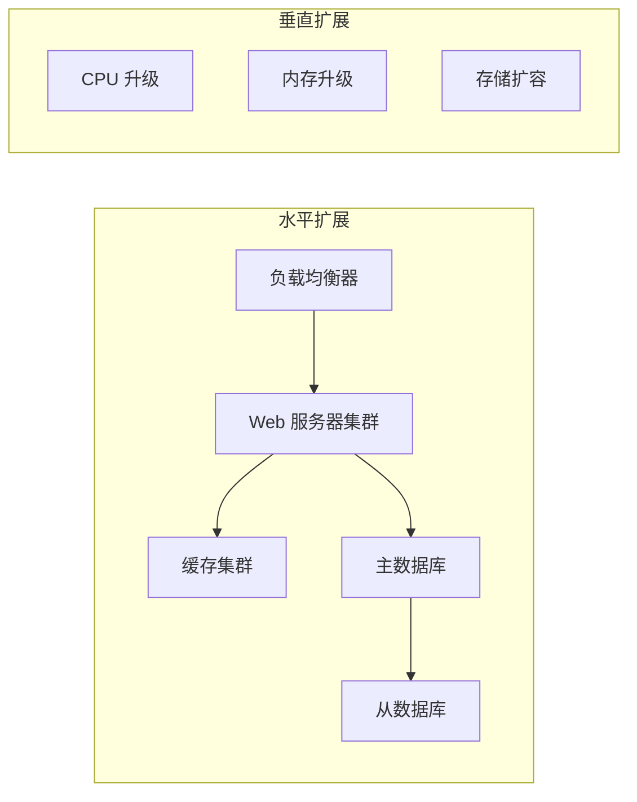

# 技术栈选型

<cite>
**本文档引用的文件**
- [pom.xml](file://pom.xml)
- [application.yml](file://src/main/resources/application.yml)
- [AiAutoConfiguration.java](file://src/main/java/cn/boss/data/ai/framework/ai/config/AiAutoConfiguration.java)
- [AiProperties.java](file://src/main/java/cn/boss/data/ai/framework/ai/config/AiProperties.java)
- [AiModelFactory.java](file://src/main/java/cn/boss/data/ai/framework/ai/core/model/AiModelFactory.java)
- [AiModelFactoryImpl.java](file://src/main/java/cn/boss/data/ai/framework/ai/core/model/AiModelFactoryImpl.java)
- [BootstrapApplication.java](file://src/main/java/cn/boss/data/ai/BootstrapApplication.java)
- [BaseMapperX.java](file://src/main/java/cn/boss/data/ai/framework/mybatis/core/mapper/BaseMapperX.java)
- [AiChatConversationMapper.java](file://src/main/java/cn/boss/data/ai/dal/mysql/chat/AiChatConversationMapper.java)
- [AiChatConversationController.java](file://src/main/java/cn/boss/data/ai/controller/chat/AiChatConversationController.java)
- [AiChatConversationServiceImpl.java](file://src/main/java/cn/boss/data/ai/service/chat/AiChatConversationServiceImpl.java)
- [SpringUtils.java](file://src/main/java/cn/boss/data/ai/framework/common/util/spring/SpringUtils.java)
</cite>

## 目录
1. [项目概述](#项目概述)
2. [核心技术栈架构](#核心技术栈架构)
3. [Spring Boot 选型分析](#spring-boot-选型分析)
4. [Spring AI 选型分析](#spring-ai-选型分析)
5. [MyBatis Plus 选型分析](#mybatis-plus-选型分析)
6. [Redis 选型分析](#redis-选型分析)
7. [Qdrant 选型分析](#qdrant-选型分析)
8. [技术栈兼容性与版本规划](#技术栈兼容性与版本规划)
9. [替代方案对比](#替代方案对比)
10. [配置管理策略](#配置管理策略)
11. [性能与扩展性考量](#性能与扩展性考量)
12. [总结](#总结)

## 项目概述

Data-AI 是一个基于 Spring Boot 和 Spring AI 构建的智能对话系统，集成了多种大语言模型提供商，支持向量存储、知识库管理和对话管理等功能。项目采用现代化的技术栈，旨在提供高性能、可扩展的 AI 应用解决方案。

## 核心技术栈架构

**图表来源**
- [BootstrapApplication.java:8-16](file://src/main/java/cn/boss/data/ai/BootstrapApplication.java#L8-L16)
- [AiAutoConfiguration.java:50-55](file://src/main/java/cn/boss/data/ai/framework/ai/config/AiAutoConfiguration.java#L50-L55)
- [AiModelFactoryImpl.java:113-159](file://src/main/java/cn/boss/data/ai/framework/ai/core/model/AiModelFactoryImpl.java#L113-L159)

## Spring Boot 选型分析

### 技术选择理由

**Java 17 LTS 版本**
- 选择 Java 17 作为项目基础版本，确保长期支持和性能优化
- 支持最新的语言特性和 JVM 性能改进

**Spring Boot 3.5.9 版本**
- 采用最新的稳定版本，获得最新的安全补丁和性能改进
- 与 Spring AI 生态系统完美兼容

**WebFlux 支持**
- 集成 Spring WebFlux，支持响应式编程模型
- 提供更好的异步处理能力和内存效率

### 优势分析

1. **生态系统成熟度**：Spring Boot 拥有庞大的社区支持和丰富的第三方集成
2. **开发效率**：自动配置和 Starter 机制大幅减少配置工作量
3. **生产就绪**：经过大量生产环境验证，稳定性可靠
4. **可观测性**：内置 Actuator 支持，便于监控和调试

**章节来源**
- [pom.xml:18-20](file://pom.xml#L18-L20)
- [BootstrapApplication.java:8-16](file://src/main/java/cn/boss/data/ai/BootstrapApplication.java#L8-L16)

## Spring AI 选型分析

### 技术选择理由

**统一抽象层**
- Spring AI 提供统一的 AI 模型抽象，简化多平台集成
- 支持 OpenAI、Azure OpenAI、Anthropic、通义千问等多种模型提供商

**向量存储集成**
- 内置对 Redis、Qdrant、Milvus 等向量存储的支持
- 提供统一的向量检索和嵌入生成功能

**RAG 支持**
- 原生支持检索增强生成（RAG）模式
- 集成文档读取和预处理功能

### 核心组件分析

**图表来源**
- [AiModelFactory.java:13-62](file://src/main/java/cn/boss/data/ai/framework/ai/core/model/AiModelFactory.java#L13-L62)
- [AiAutoConfiguration.java:50-55](file://src/main/java/cn/boss/data/ai/framework/ai/config/AiAutoConfiguration.java#L50-L55)
- [AiProperties.java:11-133](file://src/main/java/cn/boss/data/ai/framework/ai/config/AiProperties.java#L11-L133)

### 多模型支持架构

项目支持以下 AI 模型提供商：
- **通义千问（DashScope）**：阿里巴巴云大模型服务
- **文心一言（QianFan）**：百度文心系列模型
- **月之暗面（Moonshot）**：Kimi 大模型
- **DeepSeek**：深度求索开源模型
- **OpenAI**：OpenAI 官方 API
- **Azure OpenAI**：微软 Azure 平台
- **Anthropic Claude**：Anthropic 人工智能助手
- **Ollama**：本地化开源模型运行
- **智谱清言（ZhiPu）**：智谱 AI 平台
- **Minimax**：小马智行大模型
- **字节豆包（DouBao）**：字节跳动大模型
- **腾讯混元（HunYuan）**：腾讯 AI 平台
- **硅基流动（SiliconFlow）**：专业 AI 模型平台
- **讯飞星火（XingHuo）**：科大讯飞大模型
- **百川智能（BaiChuan）**：百川智能 AI 平台
- **Google Gemini**：谷歌 Gemini 模型

**章节来源**
- [AiAutoConfiguration.java:65-237](file://src/main/java/cn/boss/data/ai/framework/ai/config/AiAutoConfiguration.java#L65-L237)
- [AiModelFactoryImpl.java:115-200](file://src/main/java/cn/boss/data/ai/framework/ai/core/model/AiModelFactoryImpl.java#L115-L200)

## MyBatis Plus 选型分析

### 技术选择理由

**代码生成与简化**
- MyBatis Plus 提供强大的代码生成能力，减少重复代码
- 内置通用 CRUD 操作，大幅提升开发效率

**链式编程接口**
- 提供流畅的 API 设计，代码更加直观易读
- 支持复杂查询的链式构建

**多数据源支持**
- 集成 Dynamic Datasource，支持多数据源切换
- 适用于复杂的业务场景

### 核心特性

**图表来源**
- [AiChatConversationController.java:44-78](file://src/main/java/cn/boss/data/ai/controller/chat/AiChatConversationController.java#L44-L78)
- [AiChatConversationServiceImpl.java:53-78](file://src/main/java/cn/boss/data/ai/service/chat/AiChatConversationServiceImpl.java#L53-L78)
- [AiChatConversationMapper.java:16-34](file://src/main/java/cn/boss/data/ai/dal/mysql/chat/AiChatConversationMapper.java#L16-L34)

### 自定义扩展

项目实现了 `BaseMapperX` 接口，提供以下增强功能：

1. **分页查询**：支持排序和复杂条件的分页查询
2. **连接查询**：集成 MyBatis-Plus-Join，支持多表关联查询
3. **批量操作**：提供批量插入和更新功能
4. **条件查询**：支持动态条件构建

**章节来源**
- [BaseMapperX.java:23-178](file://src/main/java/cn/boss/data/ai/framework/mybatis/core/mapper/BaseMapperX.java#L23-L178)
- [AiChatConversationMapper.java:16-34](file://src/main/java/cn/boss/data/ai/dal/mysql/chat/AiChatConversationMapper.java#L16-L34)

## Redis 选型分析

### 技术选择理由

**高性能缓存**
- Redis 提供内存级的读写性能，满足高并发场景需求
- 支持多种数据结构，适应不同的缓存策略

**向量存储支持**
- Spring AI Redis Vector Store 提供原生向量检索能力
- 支持相似度搜索和元数据过滤

**分布式特性**
- 支持集群部署，具备良好的扩展性
- 适合微服务架构下的共享缓存

### 配置策略

项目采用以下 Redis 配置：
- **主机地址**：127.0.0.1:6379
- **数据库索引**：0
- **向量索引名称**：knowledge_index
- **键名前缀**：knowledge_segment:
- **自动初始化**：启用向量索引初始化

**章节来源**
- [application.yml:29-87](file://src/main/resources/application.yml#L29-L87)
- [AiModelFactoryImpl.java:504-530](file://src/main/java/cn/boss/data/ai/framework/ai/core/model/AiModelFactoryImpl.java#L504-L530)

## Qdrant 选型分析

### 技术选择理由

**专业向量数据库**
- Qdrant 是专为向量搜索设计的数据库，性能优异
- 支持复杂的向量操作和元数据管理

**企业级特性**
- 提供事务支持和数据一致性保证
- 支持大规模向量数据的高效存储和检索

**灵活的查询能力**
- 支持复杂的空间搜索和过滤条件
- 提供多种距离度量和相似度计算方法

### 集成架构

**图表来源**
- [AiModelFactoryImpl.java:229-245](file://src/main/java/cn/boss/data/ai/framework/ai/core/model/AiModelFactoryImpl.java#L229-L245)
- [application.yml:88-99](file://src/main/resources/application.yml#L88-L99)

**章节来源**
- [AiModelFactoryImpl.java:488-502](file://src/main/java/cn/boss/data/ai/framework/ai/core/model/AiModelFactoryImpl.java#L488-L502)
- [application.yml:88-99](file://src/main/resources/application.yml#L88-L99)

## 技术栈兼容性与版本规划

### 版本兼容性矩阵

| 组件 | 当前版本 | 最低要求 | 兼容性状态 |
|------|----------|----------|------------|
| Spring Boot | 3.5.9 | 3.0+ | ✅ 完全兼容 |
| Spring AI | 1.1.2 | 1.0+ | ✅ 完全兼容 |
| MyBatis Plus | 3.5.8 | 3.0+ | ✅ 完全兼容 |
| Java | 17 | 17+ | ✅ 完全兼容 |
| Redis | 6.0+ | 5.0+ | ✅ 完全兼容 |
| Qdrant | 1.0+ | 1.0+ | ✅ 完全兼容 |

### 升级路径建议

**短期升级（3-6个月）**
- Spring Boot：从 3.5.9 升级到 3.6.x
- Spring AI：从 1.1.2 升级到 1.2.x
- MyBatis Plus：从 3.5.8 升级到 3.5.9

**中期升级（6-12个月）**
- Java：考虑升级到 21 LTS
- Redis：升级到 7.x
- Qdrant：升级到最新稳定版

**长期规划（12+个月）**
- 考虑升级到 Spring Boot 3.7+
- 评估新的向量数据库选项
- 优化微服务架构

## 替代方案对比

### Spring AI 替代方案

| 方案 | 优点 | 缺点 | 适用场景 |
|------|------|------|----------|
| **原生 OpenAI SDK** | 功能最完整，更新最快 | 需要手动处理各种细节 | 简单项目或特定需求 |
| **LangChain** | 生态系统丰富，功能强大 | 学习曲线陡峭，配置复杂 | 复杂 AI 应用场景 |
| **Llama.cpp** | 完全本地化，隐私安全 | 性能受限，资源消耗大 | 本地部署场景 |
| **自研封装** | 完全可控，性能最优 | 开发成本高，维护困难 | 特殊定制需求 |

### 向量存储替代方案

| 方案 | Redis | Qdrant | Milvus | Elasticsearch |
|------|-------|--------|--------|---------------|
| **性能** | ⭐⭐⭐⭐ | ⭐⭐⭐⭐⭐ | ⭐⭐⭐⭐⭐ | ⭐⭐⭐ |
| **易用性** | ⭐⭐⭐⭐⭐ | ⭐⭐⭐⭐ | ⭐⭐⭐ | ⭐⭐ |
| **功能** | ⭐⭐⭐⭐ | ⭐⭐⭐⭐⭐ | ⭐⭐⭐⭐⭐ | ⭐⭐⭐⭐ |
| **成本** | ⭐⭐⭐⭐ | ⭐⭐⭐ | ⭐⭐ | ⭐⭐⭐ |
| **扩展性** | ⭐⭐⭐ | ⭐⭐⭐⭐ | ⭐⭐⭐⭐⭐ | ⭐⭐⭐⭐ |

## 配置管理策略

### 配置层次结构

**图表来源**
- [application.yml:17-189](file://src/main/resources/application.yml#L17-L189)

### 配置最佳实践

1. **环境分离**：使用不同配置文件区分开发、测试、生产环境
2. **敏感信息保护**：将 API 密钥等敏感信息单独管理
3. **默认值设置**：为所有配置项提供合理的默认值
4. **配置验证**：在启动时验证关键配置的有效性

**章节来源**
- [application.yml:17-189](file://src/main/resources/application.yml#L17-L189)
- [AiProperties.java:11-133](file://src/main/java/cn/boss/data/ai/framework/ai/config/AiProperties.java#L11-L133)

## 性能与扩展性考量

### 性能优化策略

1. **连接池优化**
   - Redis 使用 Jedis 连接池
   - 数据库连接池参数调优
   - 向量存储连接复用

2. **缓存策略**
   - 多级缓存架构（本地缓存 + Redis 缓存）
   - 智能缓存失效策略
   - 缓存预热机制

3. **异步处理**
   - 使用 Spring Async 处理耗时任务
   - 异步向量嵌入生成
   - 流式响应处理

### 扩展性设计

## 总结

Data-AI 项目的技术栈选型体现了现代企业级应用开发的最佳实践：

**核心优势**：
- **技术栈成熟稳定**：Spring Boot + Spring AI 生态系统经过充分验证
- **多模型支持**：统一抽象层支持多家 AI 供应商
- **向量化能力**：原生支持多种向量存储方案
- **开发效率**：丰富的自动化配置和代码生成

**技术特色**：
- **模块化设计**：清晰的分层架构和职责分离
- **配置驱动**：灵活的配置管理和环境隔离
- **性能优化**：针对高并发场景的专门优化
- **可扩展性**：支持水平和垂直扩展

**未来展望**：
- 持续关注 Spring AI 生态系统的演进
- 评估新的向量数据库和 AI 模型提供商
- 优化微服务架构和容器化部署
- 加强监控和可观测性建设

通过合理的技术选型和架构设计，Data-AI 项目为构建企业级 AI 应用提供了坚实的技术基础。