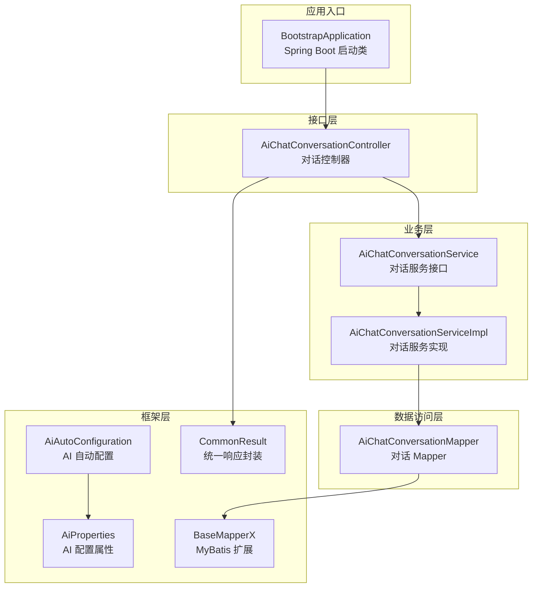
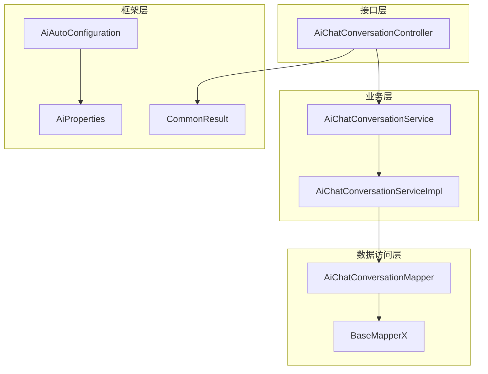
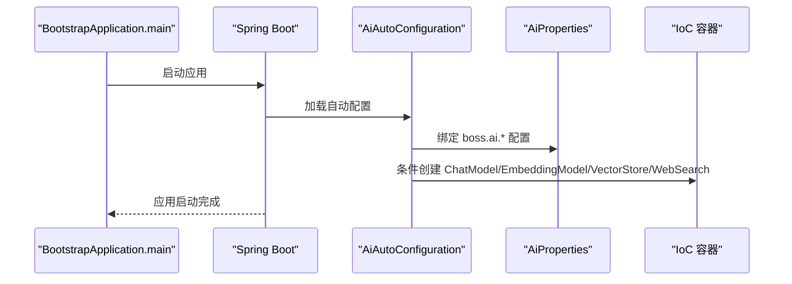
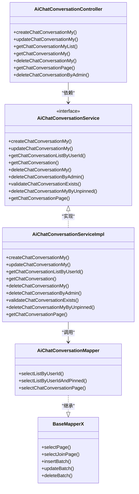
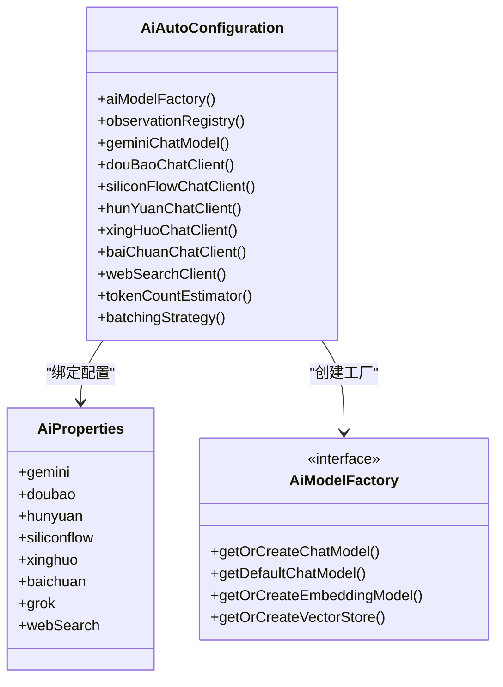
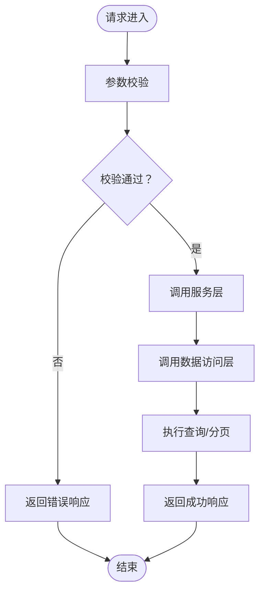
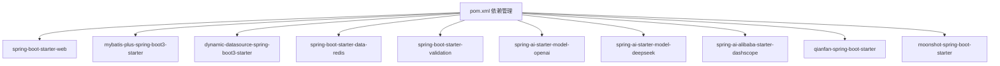

# 整体架构概览

<cite>
**本文引用的文件**
- [BootstrapApplication.java](file://src/main/java/cn/boss/data/ai/BootstrapApplication.java)
- [AiAutoConfiguration.java](file://src/main/java/cn/boss/data/ai/framework/ai/config/AiAutoConfiguration.java)
- [AiProperties.java](file://src/main/java/cn/boss/data/ai/framework/ai/config/AiProperties.java)
- [application.yml](file://src/main/resources/application.yml)
- [pom.xml](file://pom.xml)
- [AiChatConversationController.java](file://src/main/java/cn/boss/data/ai/controller/chat/AiChatConversationController.java)
- [AiChatConversationService.java](file://src/main/java/cn/boss/data/ai/service/chat/AiChatConversationService.java)
- [AiChatConversationServiceImpl.java](file://src/main/java/cn/boss/data/ai/service/chat/AiChatConversationServiceImpl.java)
- [AiChatConversationMapper.java](file://src/main/java/cn/boss/data/ai/dal/mysql/chat/AiChatConversationMapper.java)
- [BaseMapperX.java](file://src/main/java/cn/boss/data/ai/framework/mybatis/core/mapper/BaseMapperX.java)
- [CommonResult.java](file://src/main/java/cn/boss/data/ai/framework/common/pojo/CommonResult.java)
- [AiModelFactory.java](file://src/main/java/cn/boss/data/ai/framework/ai/core/model/AiModelFactory.java)
</cite>

## 目录
1. [简介](#简介)
2. [项目结构](#项目结构)
3. [核心组件](#核心组件)
4. [架构总览](#架构总览)
5. [详细组件分析](#详细组件分析)
6. [依赖关系分析](#依赖关系分析)
7. [性能考虑](#性能考虑)
8. [故障排查指南](#故障排查指南)
9. [结论](#结论)

## 简介
本项目为基于 Spring Boot 的 AI 应用平台，采用 Controller-Service-DAL 三层架构与 Spring Boot 框架组织结构，结合 Spring AI 生态实现多平台大模型接入、向量检索与知识库管理能力。项目通过自动配置机制集中管理 AI 模型客户端、嵌入模型与向量存储等组件，并以统一的返回封装与异常体系保障接口稳定性与可维护性。

## 项目结构
项目采用按功能域划分的目录组织方式：
- controller：对外 HTTP 接口层，负责请求接收、参数校验与响应封装
- service：业务逻辑层，编排 DAL 与外部 AI 能力，处理业务规则
- dal：数据访问层，包含 DO、Mapper 与 MyBatis Plus 扩展
- framework：框架层，包含通用工具、异常体系、MyBatis 扩展与 AI 自动配置
- resources：配置文件与日志配置

图表来源
- [BootstrapApplication.java:1-18](file://src/main/java/cn/boss/data/ai/BootstrapApplication.java#L1-L18)
- [AiAutoConfiguration.java:1-286](file://src/main/java/cn/boss/data/ai/framework/ai/config/AiAutoConfiguration.java#L1-L286)
- [AiProperties.java:1-134](file://src/main/java/cn/boss/data/ai/framework/ai/config/AiProperties.java#L1-L134)
- [AiChatConversationController.java:1-113](file://src/main/java/cn/boss/data/ai/controller/chat/AiChatConversationController.java#L1-L113)
- [AiChatConversationService.java:1-35](file://src/main/java/cn/boss/data/ai/service/chat/AiChatConversationService.java#L1-L35)
- [AiChatConversationServiceImpl.java:1-162](file://src/main/java/cn/boss/data/ai/service/chat/AiChatConversationServiceImpl.java#L1-L162)
- [AiChatConversationMapper.java:1-37](file://src/main/java/cn/boss/data/ai/dal/mysql/chat/AiChatConversationMapper.java#L1-L37)
- [BaseMapperX.java:1-179](file://src/main/java/cn/boss/data/ai/framework/mybatis/core/mapper/BaseMapperX.java#L1-L179)
- [CommonResult.java:1-85](file://src/main/java/cn/boss/data/ai/framework/common/pojo/CommonResult.java#L1-L85)

章节来源
- [BootstrapApplication.java:1-18](file://src/main/java/cn/boss/data/ai/BootstrapApplication.java#L1-L18)
- [pom.xml:1-358](file://pom.xml#L1-L358)

## 核心组件
- 启动类与扫描配置
  - 启动类使用注解启用 Spring Boot 自动装配、Mapper 扫描与异步执行能力
- 框架层
  - AI 自动配置：集中创建并注册多平台 ChatModel、嵌入模型、向量存储与网络搜索客户端
  - AI 配置属性：集中管理 boss.ai 下的多平台开关与参数
  - 通用响应封装：统一接口返回格式与错误处理
  - MyBatis 扩展：提供分页、联表查询、批量操作等通用能力
- 控制器层
  - 对外暴露 REST 接口，完成参数校验与 VO/DO 转换
- 服务层
  - 实现业务规则与跨模块编排，调用 DAL 与外部 AI 能力
- 数据访问层
  - 基于 MyBatis Plus 扩展，提供通用 Mapper 能力与分页查询

章节来源
- [BootstrapApplication.java:8-11](file://src/main/java/cn/boss/data/ai/BootstrapApplication.java#L8-L11)
- [AiAutoConfiguration.java:44-55](file://src/main/java/cn/boss/data/ai/framework/ai/config/AiAutoConfiguration.java#L44-L55)
- [AiProperties.java:9-11](file://src/main/java/cn/boss/data/ai/framework/ai/config/AiProperties.java#L9-L11)
- [CommonResult.java:14-51](file://src/main/java/cn/boss/data/ai/framework/common/pojo/CommonResult.java#L14-L51)
- [BaseMapperX.java:23-62](file://src/main/java/cn/boss/data/ai/framework/mybatis/core/mapper/BaseMapperX.java#L23-L62)

## 架构总览
项目采用典型的三层架构与 Spring Boot 组织结构：
- 框架层：提供通用基础设施与自动配置，屏蔽第三方 AI SDK 差异
- 业务层：封装领域业务，协调数据与外部能力
- 数据访问层：抽象持久化细节，提供统一查询与分页能力
- 接口层：面向前端或调用方的 REST 接口

图表来源
- [AiChatConversationController.java:30-40](file://src/main/java/cn/boss/data/ai/controller/chat/AiChatConversationController.java#L30-L40)
- [AiChatConversationService.java:14-34](file://src/main/java/cn/boss/data/ai/service/chat/AiChatConversationService.java#L14-L34)
- [AiChatConversationServiceImpl.java:40-50](file://src/main/java/cn/boss/data/ai/service/chat/AiChatConversationServiceImpl.java#L40-L50)
- [AiChatConversationMapper.java:15-36](file://src/main/java/cn/boss/data/ai/dal/mysql/chat/AiChatConversationMapper.java#L15-L36)
- [BaseMapperX.java:23-62](file://src/main/java/cn/boss/data/ai/framework/mybatis/core/mapper/BaseMapperX.java#L23-L62)
- [AiAutoConfiguration.java:44-55](file://src/main/java/cn/boss/data/ai/framework/ai/config/AiAutoConfiguration.java#L44-L55)
- [AiProperties.java:9-11](file://src/main/java/cn/boss/data/ai/framework/ai/config/AiProperties.java#L9-L11)
- [CommonResult.java:14-51](file://src/main/java/cn/boss/data/ai/framework/common/pojo/CommonResult.java#L14-L51)

## 详细组件分析

### 启动流程与自动配置机制
- 启动流程
  - 启动类通过注解启用 Spring Boot 自动装配、Mapper 扫描与异步执行
  - Spring Boot 在启动时加载自动配置，读取配置文件中的 AI 与数据源配置
- 自动配置机制
  - AI 自动配置根据 boss.ai 下的开关与参数动态创建 ChatModel、嵌入模型、向量存储与网络搜索客户端
  - 使用条件注解按需创建，避免未启用模块的资源浪费
  - 通过配置属性类集中管理各平台参数，便于扩展与维护

图表来源
- [BootstrapApplication.java:13-15](file://src/main/java/cn/boss/data/ai/BootstrapApplication.java#L13-L15)
- [AiAutoConfiguration.java:44-55](file://src/main/java/cn/boss/data/ai/framework/ai/config/AiAutoConfiguration.java#L44-L55)
- [AiProperties.java:9-11](file://src/main/java/cn/boss/data/ai/framework/ai/config/AiProperties.java#L9-L11)

章节来源
- [BootstrapApplication.java:8-11](file://src/main/java/cn/boss/data/ai/BootstrapApplication.java#L8-L11)
- [AiAutoConfiguration.java:44-55](file://src/main/java/cn/boss/data/ai/framework/ai/config/AiAutoConfiguration.java#L44-L55)
- [AiProperties.java:9-11](file://src/main/java/cn/boss/data/ai/framework/ai/config/AiProperties.java#L9-L11)

### Controller-Service-DAL 三层架构
- 控制器层
  - 负责接收请求、参数校验与 VO/DO 转换
  - 返回统一响应封装对象
- 业务层
  - 实现业务规则与跨模块编排
  - 调用数据访问层与外部 AI 能力
- 数据访问层
  - 基于 MyBatis Plus 扩展提供通用查询、分页与批量操作
  - Mapper 层仅关注 SQL 与查询条件，不包含业务逻辑

图表来源
- [AiChatConversationController.java:33-112](file://src/main/java/cn/boss/data/ai/controller/chat/AiChatConversationController.java#L33-L112)
- [AiChatConversationService.java:14-34](file://src/main/java/cn/boss/data/ai/service/chat/AiChatConversationService.java#L14-L34)
- [AiChatConversationServiceImpl.java:40-161](file://src/main/java/cn/boss/data/ai/service/chat/AiChatConversationServiceImpl.java#L40-L161)
- [AiChatConversationMapper.java:15-36](file://src/main/java/cn/boss/data/ai/dal/mysql/chat/AiChatConversationMapper.java#L15-L36)
- [BaseMapperX.java:23-178](file://src/main/java/cn/boss/data/ai/framework/mybatis/core/mapper/BaseMapperX.java#L23-L178)

章节来源
- [AiChatConversationController.java:33-112](file://src/main/java/cn/boss/data/ai/controller/chat/AiChatConversationController.java#L33-L112)
- [AiChatConversationService.java:14-34](file://src/main/java/cn/boss/data/ai/service/chat/AiChatConversationService.java#L14-L34)
- [AiChatConversationServiceImpl.java:40-161](file://src/main/java/cn/boss/data/ai/service/chat/AiChatConversationServiceImpl.java#L40-L161)
- [AiChatConversationMapper.java:15-36](file://src/main/java/cn/boss/data/ai/dal/mysql/chat/AiChatConversationMapper.java#L15-L36)
- [BaseMapperX.java:23-178](file://src/main/java/cn/boss/data/ai/framework/mybatis/core/mapper/BaseMapperX.java#L23-L178)

### AI 自动配置与组件初始化
- 组件初始化策略
  - 通过条件注解按需创建 ChatModel、嵌入模型、向量存储与网络搜索客户端
  - 使用配置属性类集中管理各平台参数，避免硬编码
- 组件关系
  - 工厂接口定义统一获取与创建能力
  - 自动配置类实现具体创建逻辑并注入容器

图表来源
- [AiAutoConfiguration.java:44-285](file://src/main/java/cn/boss/data/ai/framework/ai/config/AiAutoConfiguration.java#L44-L285)
- [AiProperties.java:11-133](file://src/main/java/cn/boss/data/ai/framework/ai/config/AiProperties.java#L11-L133)
- [AiModelFactory.java:13-62](file://src/main/java/cn/boss/data/ai/framework/ai/core/model/AiModelFactory.java#L13-L62)

章节来源
- [AiAutoConfiguration.java:44-285](file://src/main/java/cn/boss/data/ai/framework/ai/config/AiAutoConfiguration.java#L44-L285)
- [AiProperties.java:11-133](file://src/main/java/cn/boss/data/ai/framework/ai/config/AiProperties.java#L11-L133)
- [AiModelFactory.java:13-62](file://src/main/java/cn/boss/data/ai/framework/ai/core/model/AiModelFactory.java#L13-L62)

### 数据流与处理逻辑
- 请求处理流程
  - 控制器接收请求并进行参数校验
  - 服务层执行业务逻辑并调用数据访问层
  - 数据访问层通过通用 Mapper 进行查询与分页
- 错误处理
  - 统一响应封装对象包含状态码、消息与数据
  - 异常转换为标准错误响应

图表来源
- [AiChatConversationController.java:44-110](file://src/main/java/cn/boss/data/ai/controller/chat/AiChatConversationController.java#L44-L110)
- [AiChatConversationServiceImpl.java:52-159](file://src/main/java/cn/boss/data/ai/service/chat/AiChatConversationServiceImpl.java#L52-L159)
- [AiChatConversationMapper.java:18-34](file://src/main/java/cn/boss/data/ai/dal/mysql/chat/AiChatConversationMapper.java#L18-L34)
- [CommonResult.java:21-51](file://src/main/java/cn/boss/data/ai/framework/common/pojo/CommonResult.java#L21-L51)

章节来源
- [AiChatConversationController.java:44-110](file://src/main/java/cn/boss/data/ai/controller/chat/AiChatConversationController.java#L44-L110)
- [AiChatConversationServiceImpl.java:52-159](file://src/main/java/cn/boss/data/ai/service/chat/AiChatConversationServiceImpl.java#L52-L159)
- [AiChatConversationMapper.java:18-34](file://src/main/java/cn/boss/data/ai/dal/mysql/chat/AiChatConversationMapper.java#L18-L34)
- [CommonResult.java:21-51](file://src/main/java/cn/boss/data/ai/framework/common/pojo/CommonResult.java#L21-L51)

## 依赖关系分析
- 外部依赖
  - Spring Boot Starter Web、Validation、Redis、MyBatis Plus、动态数据源等
  - Spring AI 生态：OpenAI、DeepSeek、DashScope、QianFan、Moonshot 等
- 内部依赖
  - 控制器依赖服务接口
  - 服务实现依赖 Mapper 与通用工具
  - Mapper 继承通用扩展接口

图表来源
- [pom.xml:47-280](file://pom.xml#L47-L280)

章节来源
- [pom.xml:47-280](file://pom.xml#L47-L280)

## 性能考虑
- 分页与排序
  - 通过通用分页工具构建分页对象，减少一次性加载大量数据
- 批量操作
  - 提供批量插入与更新能力，降低数据库往返次数
- 条件查询
  - 使用条件构造器按需拼装查询条件，避免全表扫描
- 异步执行
  - 启用异步执行能力，提升非阻塞场景下的吞吐

章节来源
- [BaseMapperX.java:25-62](file://src/main/java/cn/boss/data/ai/framework/mybatis/core/mapper/BaseMapperX.java#L25-L62)
- [BaseMapperX.java:143-161](file://src/main/java/cn/boss/data/ai/framework/mybatis/core/mapper/BaseMapperX.java#L143-L161)
- [BootstrapApplication.java:10](file://src/main/java/cn/boss/data/ai/BootstrapApplication.java#L10)

## 故障排查指南
- 启动失败
  - 检查配置文件中的数据源与 AI 平台开关是否正确
  - 确认自动配置类是否被加载
- 接口异常
  - 查看统一响应封装中的状态码与消息
  - 检查服务层异常抛出与转换逻辑
- 数据访问问题
  - 确认 Mapper 是否正确继承通用扩展接口
  - 检查分页参数与排序字段是否合理

章节来源
- [application.yml:17-189](file://src/main/resources/application.yml#L17-L189)
- [AiAutoConfiguration.java:44-55](file://src/main/java/cn/boss/data/ai/framework/ai/config/AiAutoConfiguration.java#L44-L55)
- [CommonResult.java:21-84](file://src/main/java/cn/boss/data/ai/framework/common/pojo/CommonResult.java#L21-L84)
- [BaseMapperX.java:23-62](file://src/main/java/cn/boss/data/ai/framework/mybatis/core/mapper/BaseMapperX.java#L23-L62)

## 结论
本项目通过清晰的三层架构与 Spring Boot 自动配置机制，实现了对多平台 AI 能力的统一接入与管理。框架层提供通用工具与自动配置，业务层聚焦领域逻辑，数据访问层抽象持久化细节，接口层统一对外输出。配合完善的依赖管理与性能优化策略，项目具备良好的可扩展性与可维护性。