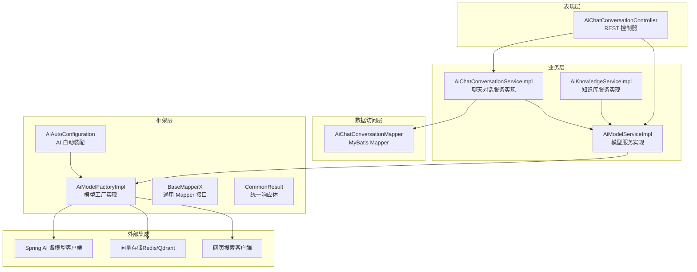
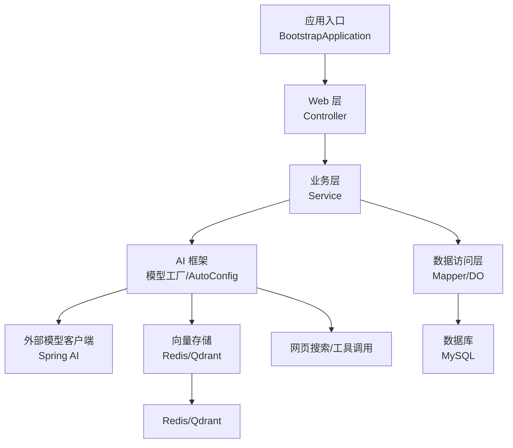
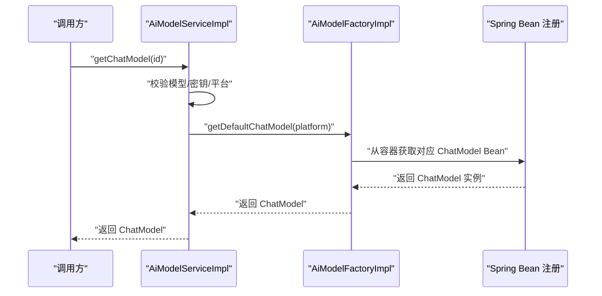
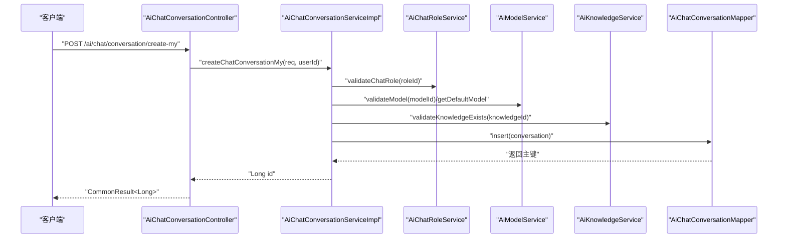
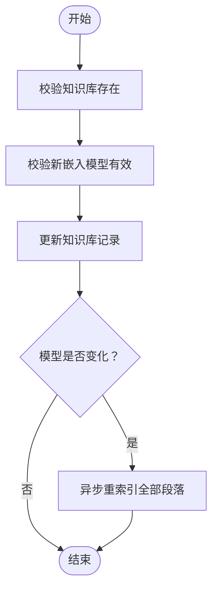
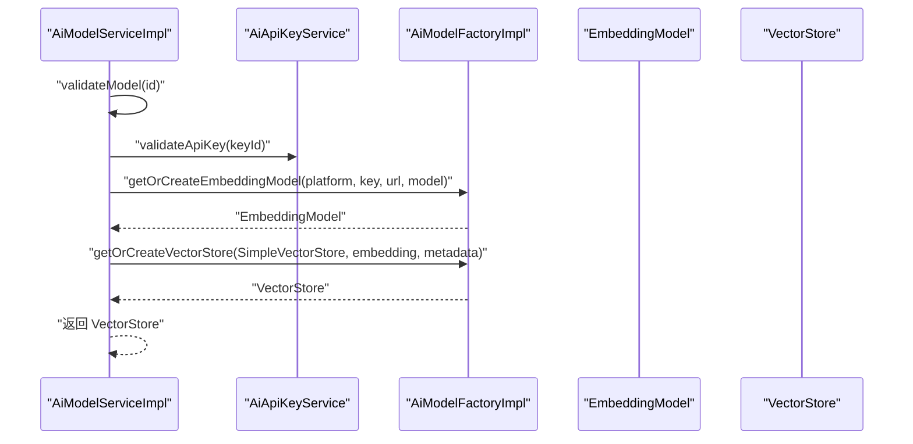
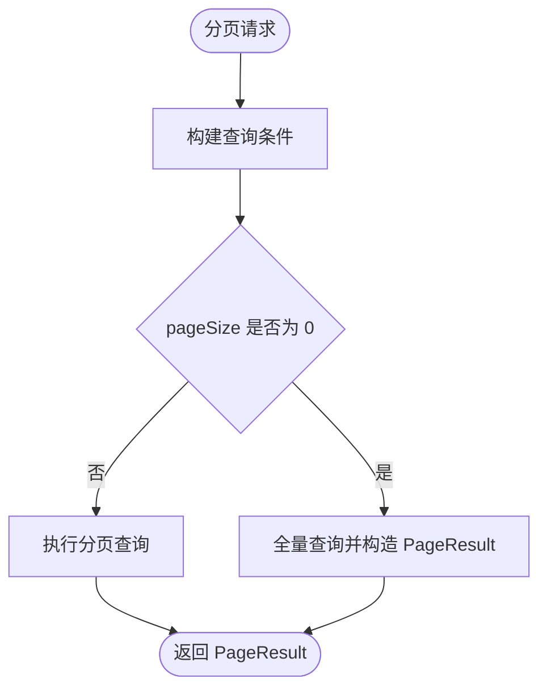
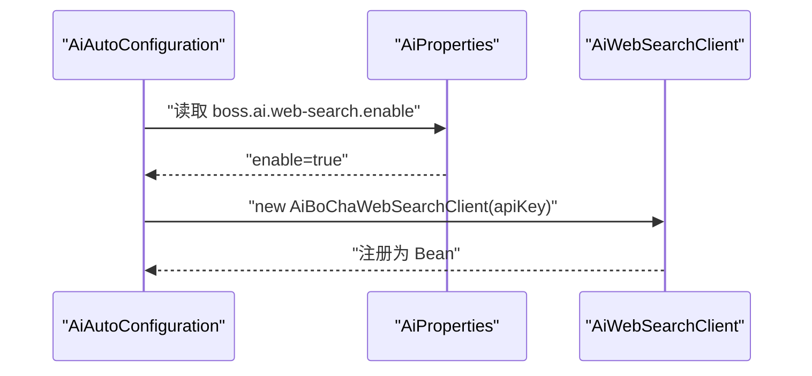
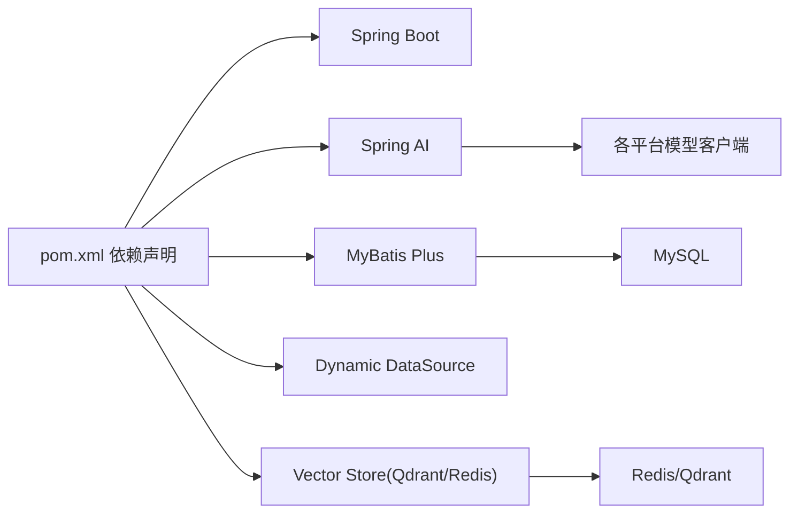

# 架构设计

<cite>
**本文引用的文件**   
- [BootstrapApplication.java](file://src/main/java/cn/boss/data/ai/BootstrapApplication.java)
- [pom.xml](file://pom.xml)
- [application.yml](file://src/main/resources/application.yml)
- [AiAutoConfiguration.java](file://src/main/java/cn/boss/data/ai/framework/ai/config/AiAutoConfiguration.java)
- [AiModelFactory.java](file://src/main/java/cn/boss/data/ai/framework/ai/core/model/AiModelFactory.java)
- [AiModelFactoryImpl.java](file://src/main/java/cn/boss/data/ai/framework/ai/core/model/AiModelFactoryImpl.java)
- [AiChatConversationController.java](file://src/main/java/cn/boss/data/ai/controller/chat/AiChatConversationController.java)
- [AiChatConversationServiceImpl.java](file://src/main/java/cn/boss/data/ai/service/chat/AiChatConversationServiceImpl.java)
- [AiChatConversationMapper.java](file://src/main/java/cn/boss/data/ai/dal/mysql/chat/AiChatConversationMapper.java)
- [CommonResult.java](file://src/main/java/cn/boss/data/ai/framework/common/pojo/CommonResult.java)
- [AiKnowledgeServiceImpl.java](file://src/main/java/cn/boss/data/ai/service/knowledge/AiKnowledgeServiceImpl.java)
- [AiModelServiceImpl.java](file://src/main/java/cn/boss/data/ai/service/model/AiModelServiceImpl.java)
- [AiPlatformEnum.java](file://src/main/java/cn/boss/data/ai/enums/model/AiPlatformEnum.java)
- [BaseMapperX.java](file://src/main/java/cn/boss/data/ai/framework/mybatis/core/mapper/BaseMapperX.java)
- [AiWebSearchClient.java](file://src/main/java/cn/boss/data/ai/framework/ai/core/websearch/AiWebSearchClient.java)
</cite>

## 目录
1. [简介](#简介)
2. [项目结构](#项目结构)
3. [核心组件](#核心组件)
4. [架构总览](#架构总览)
5. [详细组件分析](#详细组件分析)
6. [依赖分析](#依赖分析)
7. [性能考量](#性能考量)
8. [故障排查指南](#故障排查指南)
9. [结论](#结论)
10. [附录](#附录)

## 简介
本项目为 Data-AI 人工智能服务平台，采用分层架构设计（Controller-Service-DAL），围绕“AI 模型工厂”“聊天服务”“知识库服务”等核心模块构建，支持多平台大模型接入（国内/国外）、嵌入向量化、RAG 检索增强生成、网页搜索与工具调用等能力。通过 Spring Boot + Spring AI + MyBatis Plus 的技术组合，实现高扩展性与可维护性的企业级 AI 应用。

## 项目结构
项目采用按功能域分层的组织方式：
- 控制层（Controller）：对外暴露 REST API，负责参数校验、返回统一响应体。
- 业务层（Service）：编排领域逻辑，协调模型工厂、数据访问与外部服务。
- 数据访问层（DAL）：基于 MyBatis Plus 提供通用 Mapper 能力，封装分页与查询。
- 框架层（Framework）：包含 AI 自动装配、模型工厂、通用 POJO、异常体系、MyBatis 扩展等。
- 资源配置：Spring Boot 配置文件集中管理数据源、Redis、AI 向量存储与各平台密钥。

**图表来源**
- [AiChatConversationController.java:33-112](file://src/main/java/cn/boss/data/ai/controller/chat/AiChatConversationController.java#L33-L112)
- [AiChatConversationServiceImpl.java:40-161](file://src/main/java/cn/boss/data/ai/service/chat/AiChatConversationServiceImpl.java#L40-L161)
- [AiChatConversationMapper.java:15-36](file://src/main/java/cn/boss/data/ai/dal/mysql/chat/AiChatConversationMapper.java#L15-L36)
- [AiAutoConfiguration.java:50-285](file://src/main/java/cn/boss/data/ai/framework/ai/config/AiAutoConfiguration.java#L50-L285)
- [AiModelFactoryImpl.java:113-567](file://src/main/java/cn/boss/data/ai/framework/ai/core/model/AiModelFactoryImpl.java#L113-L567)
- [BaseMapperX.java:23-178](file://src/main/java/cn/boss/data/ai/framework/mybatis/core/mapper/BaseMapperX.java#L23-L178)
- [CommonResult.java:14-84](file://src/main/java/cn/boss/data/ai/framework/common/pojo/CommonResult.java#L14-L84)

**章节来源**
- [BootstrapApplication.java:8-17](file://src/main/java/cn/boss/data/ai/BootstrapApplication.java#L8-L17)
- [application.yml:1-190](file://src/main/resources/application.yml#L1-L190)
- [pom.xml:11-358](file://pom.xml#L11-L358)

## 核心组件
- AI 模型工厂与自动装配
  - 工厂接口定义统一的 Chat/Embedding/VectorStore 获取策略；实现类基于平台枚举与配置动态创建或复用实例，并通过单例缓存降低开销。
  - 自动装配根据配置开关按需注册各平台模型客户端与向量存储，支持 Gemini、DouBao、HunYuan、SiliconFlow、XingHuo、BaiChuan、DeepSeek、OpenAI、AzureOpenAI、Anthropic、Ollama、Grok 等。
- 聊天对话服务
  - 控制器负责接收请求、参数校验与统一响应包装；服务层完成角色/模型校验、知识库绑定、对话持久化与分页查询。
- 知识库服务
  - 支持知识库创建、更新、删除与分页；当嵌入模型变更时触发段落重索引异步任务。
- 模型服务
  - 将模型配置与 API Key 解耦，通过工厂创建 ChatModel/VectorStore，支撑聊天与 RAG 场景。
- 数据访问层
  - 通用 Mapper 提供分页、排序、联表查询等能力，简化 SQL 编写。
- 统一响应体
  - 统一返回 code/msg/data 结构，便于前端与监控系统消费。

**章节来源**
- [AiModelFactory.java:13-62](file://src/main/java/cn/boss/data/ai/framework/ai/core/model/AiModelFactory.java#L13-L62)
- [AiModelFactoryImpl.java:113-567](file://src/main/java/cn/boss/data/ai/framework/ai/core/model/AiModelFactoryImpl.java#L113-L567)
- [AiAutoConfiguration.java:50-285](file://src/main/java/cn/boss/data/ai/framework/ai/config/AiAutoConfiguration.java#L50-L285)
- [AiChatConversationController.java:33-112](file://src/main/java/cn/boss/data/ai/controller/chat/AiChatConversationController.java#L33-L112)
- [AiChatConversationServiceImpl.java:40-161](file://src/main/java/cn/boss/data/ai/service/chat/AiChatConversationServiceImpl.java#L40-L161)
- [AiKnowledgeServiceImpl.java:27-109](file://src/main/java/cn/boss/data/ai/service/knowledge/AiKnowledgeServiceImpl.java#L27-L109)
- [AiModelServiceImpl.java:30-128](file://src/main/java/cn/boss/data/ai/service/model/AiModelServiceImpl.java#L30-L128)
- [BaseMapperX.java:23-178](file://src/main/java/cn/boss/data/ai/framework/mybatis/core/mapper/BaseMapperX.java#L23-L178)
- [CommonResult.java:14-84](file://src/main/java/cn/boss/data/ai/framework/common/pojo/CommonResult.java#L14-L84)

## 架构总览
系统采用分层架构，职责清晰：
- 框架层：提供 AI 自动装配、模型工厂、通用 Mapper、统一响应体与异常体系。
- 业务层：编排领域流程，协调模型工厂与数据访问。
- 数据访问层：基于 MyBatis Plus 的通用 Mapper，提供分页与复杂查询能力。
- 外部集成：Spring AI 模型客户端、向量存储（Redis/Qdrant）、网页搜索与工具调用。

**图表来源**
- [BootstrapApplication.java:8-17](file://src/main/java/cn/boss/data/ai/BootstrapApplication.java#L8-L17)
- [AiAutoConfiguration.java:50-285](file://src/main/java/cn/boss/data/ai/framework/ai/config/AiAutoConfiguration.java#L50-L285)
- [AiModelFactoryImpl.java:113-567](file://src/main/java/cn/boss/data/ai/framework/ai/core/model/AiModelFactoryImpl.java#L113-L567)
- [application.yml:18-190](file://src/main/resources/application.yml#L18-L190)

## 详细组件分析

### AI 模型工厂与自动装配
- 设计要点
  - 工厂接口抽象多种模型对象的创建与复用，避免上层对具体平台细节的感知。
  - 自动装配按配置开关创建各平台客户端，统一注入 Spring 容器，支持条件化启用。
  - 向量存储支持 Simple/Redis/Qdrant，结合嵌入模型与元数据字段动态构建。
- 关键流程（获取默认 ChatModel）

**图表来源**
- [AiModelServiceImpl.java:110-116](file://src/main/java/cn/boss/data/ai/service/model/AiModelServiceImpl.java#L110-L116)
- [AiModelFactoryImpl.java:162-200](file://src/main/java/cn/boss/data/ai/framework/ai/core/model/AiModelFactoryImpl.java#L162-L200)
- [AiAutoConfiguration.java:65-118](file://src/main/java/cn/boss/data/ai/framework/ai/config/AiAutoConfiguration.java#L65-L118)

**章节来源**
- [AiModelFactory.java:13-62](file://src/main/java/cn/boss/data/ai/framework/ai/core/model/AiModelFactory.java#L13-L62)
- [AiModelFactoryImpl.java:113-567](file://src/main/java/cn/boss/data/ai/framework/ai/core/model/AiModelFactoryImpl.java#L113-L567)
- [AiAutoConfiguration.java:50-285](file://src/main/java/cn/boss/data/ai/framework/ai/config/AiAutoConfiguration.java#L50-L285)
- [AiPlatformEnum.java:14-70](file://src/main/java/cn/boss/data/ai/enums/model/AiPlatformEnum.java#L14-L70)

### 聊天对话服务
- 设计要点
  - 控制器统一返回 CommonResult，屏蔽底层异常细节。
  - 服务层在创建对话时校验角色与模型，必要时回退默认模型；支持知识库绑定与分页查询。
  - Mapper 提供常用查询方法与分页封装。
- 关键流程（创建对话）

**图表来源**
- [AiChatConversationController.java:42-46](file://src/main/java/cn/boss/data/ai/controller/chat/AiChatConversationController.java#L42-L46)
- [AiChatConversationServiceImpl.java:52-78](file://src/main/java/cn/boss/data/ai/service/chat/AiChatConversationServiceImpl.java#L52-L78)
- [AiChatConversationMapper.java:15-36](file://src/main/java/cn/boss/data/ai/dal/mysql/chat/AiChatConversationMapper.java#L15-L36)

**章节来源**
- [AiChatConversationController.java:33-112](file://src/main/java/cn/boss/data/ai/controller/chat/AiChatConversationController.java#L33-L112)
- [AiChatConversationServiceImpl.java:40-161](file://src/main/java/cn/boss/data/ai/service/chat/AiChatConversationServiceImpl.java#L40-L161)
- [AiChatConversationMapper.java:15-36](file://src/main/java/cn/boss/data/ai/dal/mysql/chat/AiChatConversationMapper.java#L15-L36)
- [CommonResult.java:14-84](file://src/main/java/cn/boss/data/ai/framework/common/pojo/CommonResult.java#L14-L84)

### 知识库服务
- 设计要点
  - 创建/更新/删除知识库时进行模型校验；当嵌入模型变更时触发段落重索引异步任务。
  - 删除知识库时先清理文档与段落，再删除知识库本身，确保依赖完整性。
- 关键流程（更新知识库并触发重索引）

**图表来源**
- [AiKnowledgeServiceImpl.java:53-69](file://src/main/java/cn/boss/data/ai/service/knowledge/AiKnowledgeServiceImpl.java#L53-L69)

**章节来源**
- [AiKnowledgeServiceImpl.java:27-109](file://src/main/java/cn/boss/data/ai/service/knowledge/AiKnowledgeServiceImpl.java#L27-L109)

### 模型服务与平台枚举
- 设计要点
  - 模型服务将“模型配置”与“API Key”解耦，通过工厂创建 ChatModel/VectorStore。
  - 平台枚举统一管理国内外平台常量，提供校验与数组输出。
- 关键流程（获取向量存储）

**图表来源**
- [AiModelServiceImpl.java:118-126](file://src/main/java/cn/boss/data/ai/service/model/AiModelServiceImpl.java#L118-L126)
- [AiModelFactoryImpl.java:228-245](file://src/main/java/cn/boss/data/ai/framework/ai/core/model/AiModelFactoryImpl.java#L228-L245)

**章节来源**
- [AiModelServiceImpl.java:30-128](file://src/main/java/cn/boss/data/ai/service/model/AiModelServiceImpl.java#L30-L128)
- [AiPlatformEnum.java:14-70](file://src/main/java/cn/boss/data/ai/enums/model/AiPlatformEnum.java#L14-L70)

### 数据访问层与通用 Mapper
- 设计要点
  - BaseMapperX 提供分页、排序、联表查询、批量插入/更新等通用能力，减少重复 SQL。
  - Mapper 接口通过 Lambda 包装器实现条件查询与分页封装。
- 关键流程（分页查询）

**图表来源**
- [BaseMapperX.java:25-62](file://src/main/java/cn/boss/data/ai/framework/mybatis/core/mapper/BaseMapperX.java#L25-L62)
- [AiChatConversationMapper.java:28-34](file://src/main/java/cn/boss/data/ai/dal/mysql/chat/AiChatConversationMapper.java#L28-L34)

**章节来源**
- [BaseMapperX.java:23-178](file://src/main/java/cn/boss/data/ai/framework/mybatis/core/mapper/BaseMapperX.java#L23-L178)
- [AiChatConversationMapper.java:15-36](file://src/main/java/cn/boss/data/ai/dal/mysql/chat/AiChatConversationMapper.java#L15-L36)

### 网页搜索与工具调用
- 设计要点
  - 网页搜索客户端接口抽象统一搜索能力，当前自动装配提供 Bocha 实现。
  - 工具调用管理器由 Spring 容器提供，配合模型客户端实现函数/工具调用。
- 关键流程（启用网页搜索）

**图表来源**
- [AiAutoConfiguration.java:279-283](file://src/main/java/cn/boss/data/ai/framework/ai/config/AiAutoConfiguration.java#L279-L283)
- [AiWebSearchClient.java:6-16](file://src/main/java/cn/boss/data/ai/framework/ai/core/websearch/AiWebSearchClient.java#L6-L16)

**章节来源**
- [AiAutoConfiguration.java:277-283](file://src/main/java/cn/boss/data/ai/framework/ai/config/AiAutoConfiguration.java#L277-L283)
- [AiWebSearchClient.java:6-16](file://src/main/java/cn/boss/data/ai/framework/ai/core/websearch/AiWebSearchClient.java#L6-L16)

## 依赖分析
- 技术栈与版本
  - Spring Boot 3.5.9、Spring AI 1.1.2、MyBatis Plus 3.5.8、MyBatis Plus Join 1.5.3、动态数据源 4.3.1、P6Spy 3.9.1、Hutool 5.8.32、Guava 33.4.0-jre、Swagger 2.2.25。
  - 各大模型客户端：OpenAI/AzureOpenAI/Anthropic/Ollama、通义千问、文心一言、月之暗面、Grok、智谱、DeepSeek、硅基流动、混元、豆包、星火、百川智能等。
  - 向量存储：Qdrant、Redis、Simple（本地 JSON 文件）。
- 组件耦合
  - 控制器仅依赖服务接口，服务依赖工厂与 Mapper 接口，工厂依赖 Spring Bean 注册与外部 SDK。
  - 低耦合高内聚，便于替换平台与扩展新模型。

**图表来源**
- [pom.xml:47-280](file://pom.xml#L47-L280)

**章节来源**
- [pom.xml:11-358](file://pom.xml#L11-L358)

## 性能考量
- 模型实例缓存
  - 工厂使用单例缓存不同平台/密钥/URL/模型的实例，避免重复初始化带来的网络与内存开销。
- 向量存储选择
  - Redis/Qdrant 适合生产环境高并发检索；Simple 适合开发/测试场景。
- 异步重索引
  - 知识库模型变更时触发异步重索引，避免阻塞主线程。
- 分页与联表查询
  - 通过通用 Mapper 与 Join 库优化分页与联表查询性能，合理设置排序字段与过滤条件。

## 故障排查指南
- 统一响应体
  - 使用 CommonResult 统一返回结构，便于前端与监控系统识别错误码与消息。
- 错误码与异常
  - 通过 ServiceExceptionUtil 统一格式化错误消息；控制器层捕获并转换为 CommonResult。
- 常见问题定位
  - 模型不可用：检查模型状态、平台与密钥配置；确认工厂是否成功创建实例。
  - 知识库重索引失败：关注异步任务日志与向量存储连接状态。
  - 分页查询异常：核对排序字段与过滤条件，避免全表扫描。

**章节来源**
- [CommonResult.java:14-84](file://src/main/java/cn/boss/data/ai/framework/common/pojo/CommonResult.java#L14-L84)
- [AiChatConversationServiceImpl.java:131-137](file://src/main/java/cn/boss/data/ai/service/chat/AiChatConversationServiceImpl.java#L131-L137)
- [AiKnowledgeServiceImpl.java:66-68](file://src/main/java/cn/boss/data/ai/service/knowledge/AiKnowledgeServiceImpl.java#L66-L68)

## 结论
本项目以分层架构为核心，通过 AI 模型工厂与自动装配实现多平台模型的统一接入与管理；聊天与知识库服务围绕统一响应体与通用 Mapper 构建，具备良好的扩展性与可维护性。结合向量存储与网页搜索能力，满足企业级 RAG 与智能问答场景需求。

## 附录
- 系统边界与组件划分
  - 框架层：AI 自动装配、模型工厂、通用 Mapper、统一响应体、异常体系。
  - 业务层：聊天对话、知识库、模型管理等服务实现。
  - 数据访问层：Mapper 接口与通用查询封装。
  - 外部集成：Spring AI 模型客户端、向量存储、网页搜索与工具调用。
- 配置参考
  - 数据源、Redis、MyBatis Plus、AI 向量存储与各平台密钥均在配置文件中集中管理。

**章节来源**
- [application.yml:17-190](file://src/main/resources/application.yml#L17-L190)
- [BootstrapApplication.java:8-17](file://src/main/java/cn/boss/data/ai/BootstrapApplication.java#L8-L17)