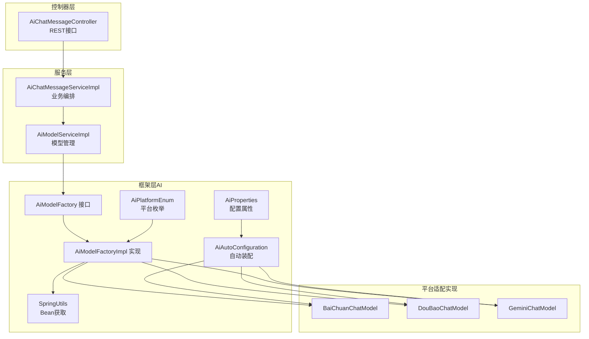
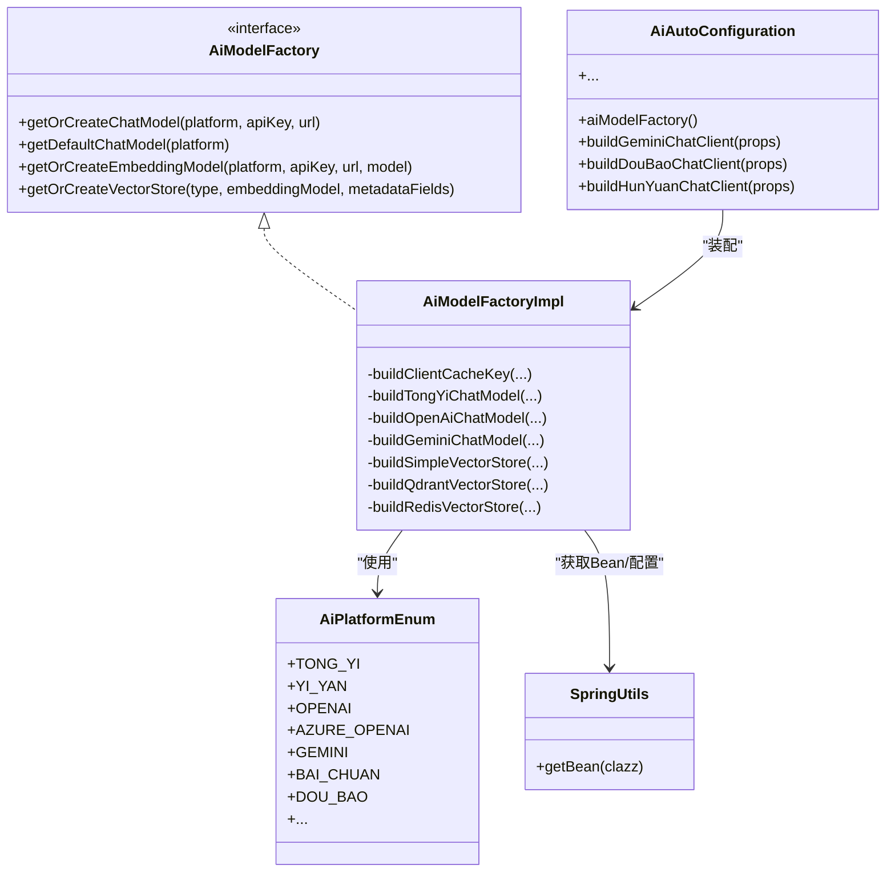
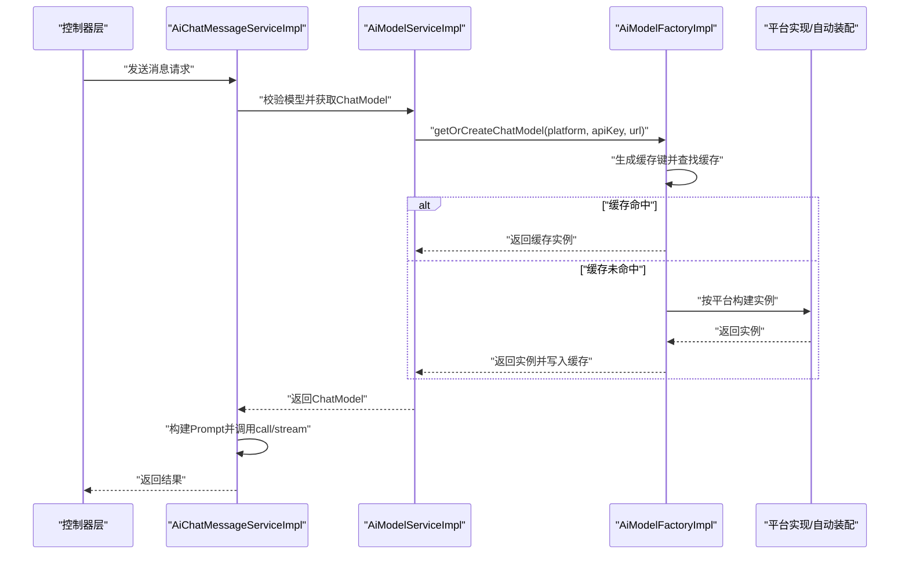
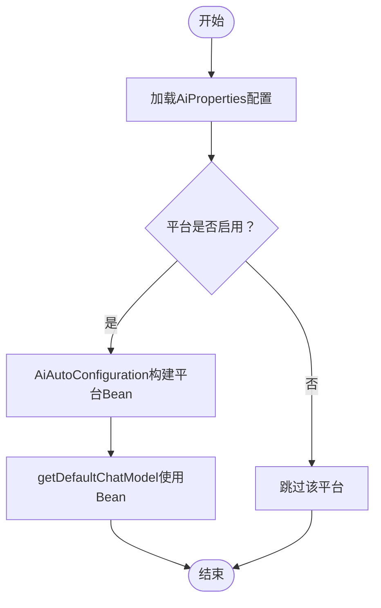
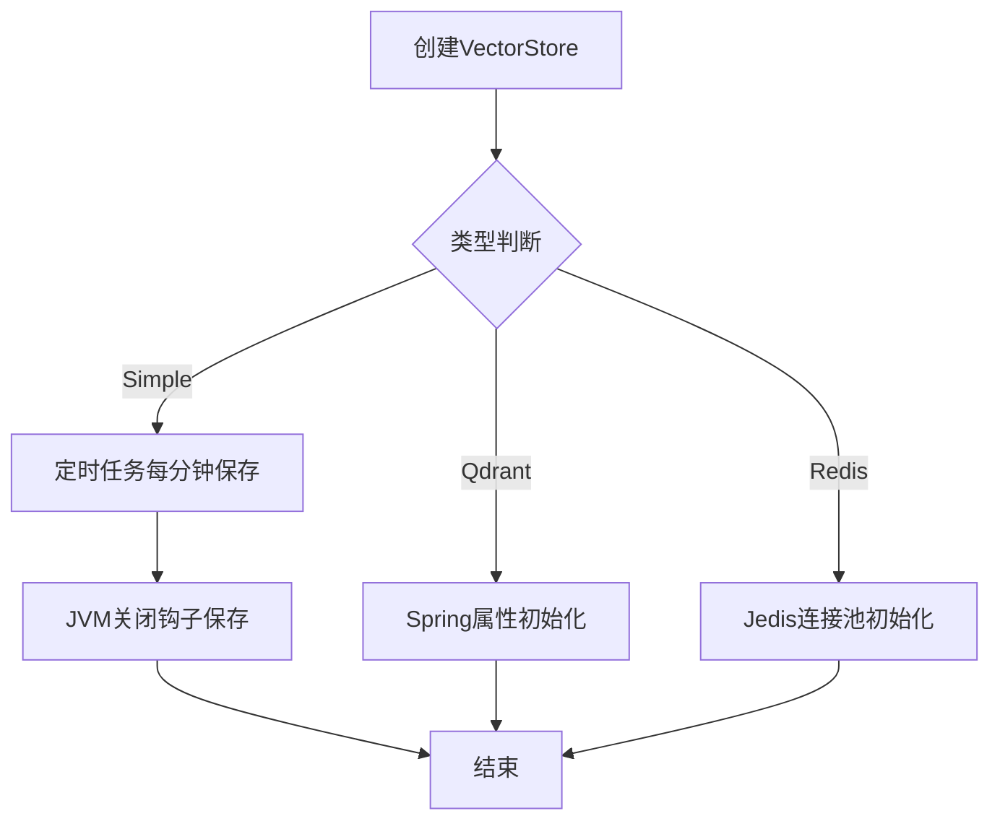
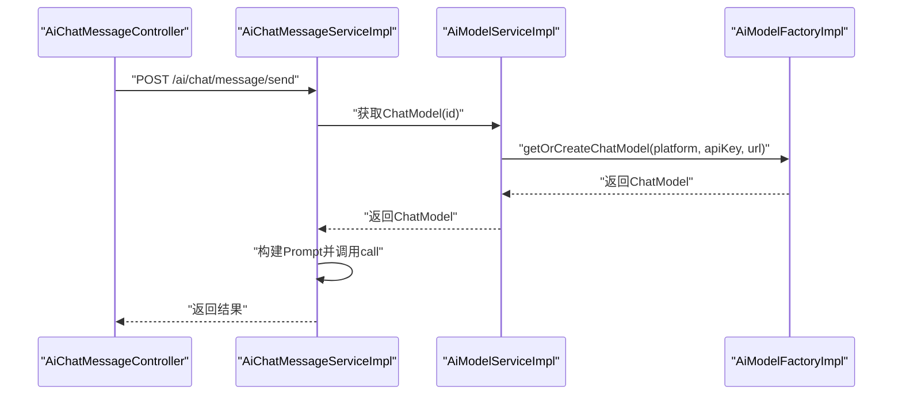
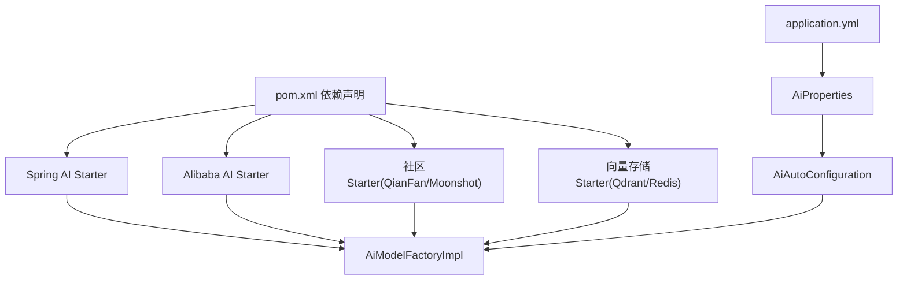

# AI模型工厂交互

<cite>
**本文引用的文件**
- [AiModelFactory.java](file://src/main/java/cn/boss/data/ai/framework/ai/core/model/AiModelFactory.java)
- [AiModelFactoryImpl.java](file://src/main/java/cn/boss/data/ai/framework/ai/core/model/AiModelFactoryImpl.java)
- [AiAutoConfiguration.java](file://src/main/java/cn/boss/data/ai/framework/ai/config/AiAutoConfiguration.java)
- [AiProperties.java](file://src/main/java/cn/boss/data/ai/framework/ai/config/AiProperties.java)
- [AiPlatformEnum.java](file://src/main/java/cn/boss/data/ai/enums/model/AiPlatformEnum.java)
- [BaiChuanChatModel.java](file://src/main/java/cn/boss/data/ai/framework/ai/core/model/baichuan/BaiChuanChatModel.java)
- [DouBaoChatModel.java](file://src/main/java/cn/boss/data/ai/framework/ai/core/model/doubao/DouBaoChatModel.java)
- [GeminiChatModel.java](file://src/main/java/cn/boss/data/ai/framework/ai/core/model/gemini/GeminiChatModel.java)
- [AiChatMessageServiceImpl.java](file://src/main/java/cn/boss/data/ai/service/chat/AiChatMessageServiceImpl.java)
- [AiModelServiceImpl.java](file://src/main/java/cn/boss/data/ai/service/model/AiModelServiceImpl.java)
- [application.yml](file://src/main/resources/application.yml)
- [SpringUtils.java](file://src/main/java/cn/boss/data/ai/framework/common/util/spring/SpringUtils.java)
- [pom.xml](file://pom.xml)
</cite>

## 目录
1. [简介](#简介)
2. [项目结构](#项目结构)
3. [核心组件](#核心组件)
4. [架构总览](#架构总览)
5. [详细组件分析](#详细组件分析)
6. [依赖分析](#依赖分析)
7. [性能考量](#性能考量)
8. [故障排查指南](#故障排查指南)
9. [结论](#结论)
10. [附录](#附录)

## 简介
本文件围绕AI模型工厂组件，系统化阐述AiModelFactory接口的设计理念与实现机制，覆盖ChatModel、EmbeddingModel、VectorStore的创建与管理策略；详解工厂模式在多平台AI模型集成中的适配机制（如Baichuan、Doubao、Gemini等）；说明模型实例的缓存策略、生命周期与资源回收；并提供工厂方法的调用时序图与依赖注入关系图，展示控制器层如何通过工厂获取AI模型实例。

## 项目结构
该项目采用分层+模块化的组织方式：
- 控制器层：对外暴露聊天消息接口，负责请求编排与响应封装
- 服务层：业务编排，调用模型工厂获取具体模型实例
- 框架层（AI）：包含自动装配、配置属性、模型工厂与各平台适配实现
- 枚举与工具：平台枚举、Spring上下文工具等

图表来源
- [AiAutoConfiguration.java:52-91](file://src/main/java/cn/boss/data/ai/framework/ai/config/AiAutoConfiguration.java#L52-L91)
- [AiModelFactoryImpl.java:113-245](file://src/main/java/cn/boss/data/ai/framework/ai/core/model/AiModelFactoryImpl.java#L113-L245)
- [AiModelServiceImpl.java:110-126](file://src/main/java/cn/boss/data/ai/service/model/AiModelServiceImpl.java#L110-L126)
- [AiPlatformEnum.java:14-43](file://src/main/java/cn/boss/data/ai/enums/model/AiPlatformEnum.java#L14-L43)
- [SpringUtils.java:18-28](file://src/main/java/cn/boss/data/ai/framework/common/util/spring/SpringUtils.java#L18-L28)

章节来源
- [AiAutoConfiguration.java:52-91](file://src/main/java/cn/boss/data/ai/framework/ai/config/AiAutoConfiguration.java#L52-L91)
- [AiModelFactoryImpl.java:113-245](file://src/main/java/cn/boss/data/ai/framework/ai/core/model/AiModelFactoryImpl.java#L113-L245)
- [AiModelServiceImpl.java:110-126](file://src/main/java/cn/boss/data/ai/service/model/AiModelServiceImpl.java#L110-L126)
- [AiPlatformEnum.java:14-43](file://src/main/java/cn/boss/data/ai/enums/model/AiPlatformEnum.java#L14-L43)
- [SpringUtils.java:18-28](file://src/main/java/cn/boss/data/ai/framework/common/util/spring/SpringUtils.java#L18-L28)

## 核心组件
- 工厂接口与实现
  - AiModelFactory：定义ChatModel、EmbeddingModel、VectorStore的获取与创建能力
  - AiModelFactoryImpl：基于平台枚举与配置参数，构建并缓存模型实例
- 自动装配与配置
  - AiAutoConfiguration：按平台启用对应ChatModel Bean，并提供工具与观察性配置
  - AiProperties：集中管理各平台的启用开关、API Key、模型、温度、最大令牌数等
- 平台适配实现
  - 多个平台的ChatModel包装类（如BaiChuan、DouBao、Gemini），统一实现ChatModel接口
- 服务层对接
  - AiModelServiceImpl：根据模型配置调用工厂获取ChatModel与VectorStore
  - AiChatMessageServiceImpl：在聊天流程中通过模型服务获取模型并执行推理

章节来源
- [AiModelFactory.java:13-61](file://src/main/java/cn/boss/data/ai/framework/ai/core/model/AiModelFactory.java#L13-L61)
- [AiModelFactoryImpl.java:113-245](file://src/main/java/cn/boss/data/ai/framework/ai/core/model/AiModelFactoryImpl.java#L113-L245)
- [AiAutoConfiguration.java:52-91](file://src/main/java/cn/boss/data/ai/framework/ai/config/AiAutoConfiguration.java#L52-L91)
- [AiProperties.java:11-134](file://src/main/java/cn/boss/data/ai/framework/ai/config/AiProperties.java#L11-L134)
- [AiModelServiceImpl.java:110-126](file://src/main/java/cn/boss/data/ai/service/model/AiModelServiceImpl.java#L110-L126)

## 架构总览
工厂模式在本项目中的作用是：
- 解耦上层调用与底层平台差异，屏蔽不同SDK的初始化细节
- 统一缓存策略，避免重复创建昂贵的模型实例
- 支持多种平台与配置组合，便于扩展新平台

图表来源
- [AiModelFactory.java:13-61](file://src/main/java/cn/boss/data/ai/framework/ai/core/model/AiModelFactory.java#L13-L61)
- [AiModelFactoryImpl.java:113-245](file://src/main/java/cn/boss/data/ai/framework/ai/core/model/AiModelFactoryImpl.java#L113-L245)
- [AiAutoConfiguration.java:52-91](file://src/main/java/cn/boss/data/ai/framework/ai/config/AiAutoConfiguration.java#L52-L91)
- [AiPlatformEnum.java:14-43](file://src/main/java/cn/boss/data/ai/enums/model/AiPlatformEnum.java#L14-L43)
- [SpringUtils.java:18-28](file://src/main/java/cn/boss/data/ai/framework/common/util/spring/SpringUtils.java#L18-L28)

## 详细组件分析

### 工厂接口与实现
- 设计理念
  - 将“平台识别—配置解析—实例创建—缓存复用”解耦，面向接口编程，便于替换与扩展
  - 提供两类获取方式：按配置创建（getOrCreate）、按默认Bean获取（getDefault）
- 实现要点
  - 使用全局单例缓存（基于Hutool Singleton）以平台+密钥+URL+模型等参数拼接的键进行缓存
  - 通过AiAutoConfiguration提供的Bean或平台特定构造器创建实例
  - VectorStore支持Simple/Qdrant/Redis三种类型，按需选择并初始化

图表来源
- [AiModelFactoryImpl.java:116-159](file://src/main/java/cn/boss/data/ai/framework/ai/core/model/AiModelFactoryImpl.java#L116-L159)
- [AiModelServiceImpl.java:110-116](file://src/main/java/cn/boss/data/ai/service/model/AiModelServiceImpl.java#L110-L116)
- [AiChatMessageServiceImpl.java:127-180](file://src/main/java/cn/boss/data/ai/service/chat/AiChatMessageServiceImpl.java#L127-L180)

章节来源
- [AiModelFactory.java:13-61](file://src/main/java/cn/boss/data/ai/framework/ai/core/model/AiModelFactory.java#L13-L61)
- [AiModelFactoryImpl.java:113-245](file://src/main/java/cn/boss/data/ai/framework/ai/core/model/AiModelFactoryImpl.java#L113-L245)

### 多平台适配机制
- 平台枚举与验证
  - AiPlatformEnum涵盖国内外主流平台，提供平台字符串与名称映射，并提供校验方法
- 平台实现
  - BaiChuanChatModel、DouBaoChatModel、GeminiChatModel等均包装底层OpenAI兼容模型，统一实现ChatModel接口
  - AiAutoConfiguration按配置启用对应平台的ChatModel Bean，或在工厂中按需构建
- 配置驱动
  - AiProperties集中管理各平台的启用开关、API Key、模型、温度、最大令牌数等
  - application.yml提供示例配置，便于快速启用/切换平台

图表来源
- [AiAutoConfiguration.java:66-91](file://src/main/java/cn/boss/data/ai/framework/ai/config/AiAutoConfiguration.java#L66-L91)
- [AiProperties.java:54-61](file://src/main/java/cn/boss/data/ai/framework/ai/config/AiProperties.java#L54-L61)
- [application.yml:152-176](file://src/main/resources/application.yml#L152-L176)

章节来源
- [AiPlatformEnum.java:14-43](file://src/main/java/cn/boss/data/ai/enums/model/AiPlatformEnum.java#L14-L43)
- [BaiChuanChatModel.java:17-40](file://src/main/java/cn/boss/data/ai/framework/ai/core/model/baichuan/BaiChuanChatModel.java#L17-L40)
- [DouBaoChatModel.java:16-40](file://src/main/java/cn/boss/data/ai/framework/ai/core/model/doubao/DouBaoChatModel.java#L16-L40)
- [GeminiChatModel.java:17-41](file://src/main/java/cn/boss/data/ai/framework/ai/core/model/gemini/GeminiChatModel.java#L17-L41)
- [AiAutoConfiguration.java:66-91](file://src/main/java/cn/boss/data/ai/framework/ai/config/AiAutoConfiguration.java#L66-L91)
- [AiProperties.java:54-125](file://src/main/java/cn/boss/data/ai/framework/ai/config/AiProperties.java#L54-L125)
- [application.yml:152-176](file://src/main/resources/application.yml#L152-L176)

### 模型实例的缓存策略、生命周期与资源回收
- 缓存策略
  - 工厂内部使用全局单例缓存，键由类名与参数拼接而成，确保同配置复用同一实例
  - 对ChatModel、EmbeddingModel、VectorStore分别缓存，避免重复初始化
- 生命周期
  - ChatModel/EmbeddingModel：随应用启动创建，随应用销毁释放
  - VectorStore：
    - SimpleVectorStore：定时任务每分钟持久化一次，JVM退出时触发保存
    - Qdrant/Redis：通过Spring配置与属性初始化，随容器生命周期管理
- 资源回收
  - SimpleVectorStore注册JVM关闭钩子，确保退出前持久化
  - 其他外部客户端（如Qdrant、Redis）由Spring容器管理其连接池与生命周期

图表来源
- [AiModelFactoryImpl.java:467-486](file://src/main/java/cn/boss/data/ai/framework/ai/core/model/AiModelFactoryImpl.java#L467-L486)
- [AiModelFactoryImpl.java:489-502](file://src/main/java/cn/boss/data/ai/framework/ai/core/model/AiModelFactoryImpl.java#L489-L502)
- [AiModelFactoryImpl.java:504-530](file://src/main/java/cn/boss/data/ai/framework/ai/core/model/AiModelFactoryImpl.java#L504-L530)

章节来源
- [AiModelFactoryImpl.java:247-252](file://src/main/java/cn/boss/data/ai/framework/ai/core/model/AiModelFactoryImpl.java#L247-L252)
- [AiModelFactoryImpl.java:467-530](file://src/main/java/cn/boss/data/ai/framework/ai/core/model/AiModelFactoryImpl.java#L467-L530)

### 控制器层通过工厂获取AI模型实例
- 控制器层仅负责请求编排与响应封装
- 业务层通过AiModelServiceImpl获取模型配置，再调用AiModelFactoryImpl创建或获取模型
- 工厂根据平台与配置参数决定实例化路径，并进行缓存

图表来源
- [AiChatMessageServiceImpl.java:127-180](file://src/main/java/cn/boss/data/ai/service/chat/AiChatMessageServiceImpl.java#L127-L180)
- [AiModelServiceImpl.java:110-116](file://src/main/java/cn/boss/data/ai/service/model/AiModelServiceImpl.java#L110-L116)
- [AiModelFactoryImpl.java:116-159](file://src/main/java/cn/boss/data/ai/framework/ai/core/model/AiModelFactoryImpl.java#L116-L159)

章节来源
- [AiChatMessageServiceImpl.java:127-180](file://src/main/java/cn/boss/data/ai/service/chat/AiChatMessageServiceImpl.java#L127-L180)
- [AiModelServiceImpl.java:110-116](file://src/main/java/cn/boss/data/ai/service/model/AiModelServiceImpl.java#L110-L116)

## 依赖分析
- Spring AI生态与第三方SDK
  - 通过starter引入OpenAI、Azure OpenAI、Anthropic、Ollama、Minimax、ZhiPu等模型支持
  - 国产平台通过Alibaba Cloud AI与社区starter接入（DashScope、QianFan、Moonshot）
- 向量存储
  - Qdrant与Redis向量存储通过starter引入，工厂中按需装配
- 配置与自动装配
  - AiAutoConfiguration按平台启用Bean，AiProperties集中管理配置，application.yml提供示例

图表来源
- [pom.xml:57-142](file://pom.xml#L57-L142)
- [AiAutoConfiguration.java:52-91](file://src/main/java/cn/boss/data/ai/framework/ai/config/AiAutoConfiguration.java#L52-L91)
- [AiProperties.java:11-134](file://src/main/java/cn/boss/data/ai/framework/ai/config/AiProperties.java#L11-L134)
- [application.yml:79-189](file://src/main/resources/application.yml#L79-L189)

章节来源
- [pom.xml:57-142](file://pom.xml#L57-L142)
- [AiAutoConfiguration.java:52-91](file://src/main/java/cn/boss/data/ai/framework/ai/config/AiAutoConfiguration.java#L52-L91)
- [AiProperties.java:11-134](file://src/main/java/cn/boss/data/ai/framework/ai/config/AiProperties.java#L11-L134)
- [application.yml:79-189](file://src/main/resources/application.yml#L79-L189)

## 性能考量
- 缓存命中率
  - 同一平台、密钥、URL、模型参数组合可复用实例，显著降低初始化开销
- I/O与持久化
  - SimpleVectorStore定时持久化与关闭钩子保存，建议结合业务场景调整频率，避免频繁磁盘IO
- 连接池与并发
  - Qdrant/Redis使用各自连接池，建议结合业务QPS与延迟目标调优连接数与超时参数
- 流式响应
  - 控制器层支持SSE流式返回，前端可即时感知生成进度，提升用户体验

## 故障排查指南
- 平台启用与配置
  - 检查AiProperties与application.yml中平台启用开关与API Key是否正确
- 未知平台异常
  - AiPlatformEnum.validatePlatform会抛出非法平台异常，确认平台字符串是否匹配
- 密钥格式错误
  - 部分平台（如YiYan/XingHuo）要求特定格式的密钥组合，需按要求提供
- Bean缺失
  - 若使用getDefaultChatModel，需确保AiAutoConfiguration已按平台启用对应Bean
- VectorStore初始化失败
  - Qdrant/Redis需检查网络连通性与鉴权配置；SimpleVectorStore需确认文件权限与磁盘空间

章节来源
- [AiPlatformEnum.java:56-63](file://src/main/java/cn/boss/data/ai/enums/model/AiPlatformEnum.java#L56-L63)
- [AiAutoConfiguration.java:66-91](file://src/main/java/cn/boss/data/ai/framework/ai/config/AiAutoConfiguration.java#L66-L91)
- [AiModelFactoryImpl.java:267-274](file://src/main/java/cn/boss/data/ai/framework/ai/core/model/AiModelFactoryImpl.java#L267-L274)
- [AiModelFactoryImpl.java:489-502](file://src/main/java/cn/boss/data/ai/framework/ai/core/model/AiModelFactoryImpl.java#L489-L502)

## 结论
本项目通过工厂模式实现了多平台AI模型的统一接入与管理，配合自动装配与配置驱动，既保证了扩展性，又兼顾了性能与可维护性。工厂的缓存策略有效降低了实例化成本，而对SimpleVectorStore的定时与关闭钩子保障了数据持久化与资源回收。服务层通过模型工厂透明地获取模型实例，控制器层专注于业务编排，形成清晰的分层架构。

## 附录
- 关键配置项
  - boss.ai.*：平台启用与参数（API Key、模型、温度、最大令牌数等）
  - spring.ai.vectorstore.*：向量存储配置（Redis/Qdrant）
- 常见平台启用示例
  - Gemini、豆包、混元、硅基流动、星火、百川、OpenAI、Azure OpenAI、Anthropic、Ollama、Grok等

章节来源
- [application.yml:152-189](file://src/main/resources/application.yml#L152-L189)
- [AiProperties.java:54-125](file://src/main/java/cn/boss/data/ai/framework/ai/config/AiProperties.java#L54-L125)