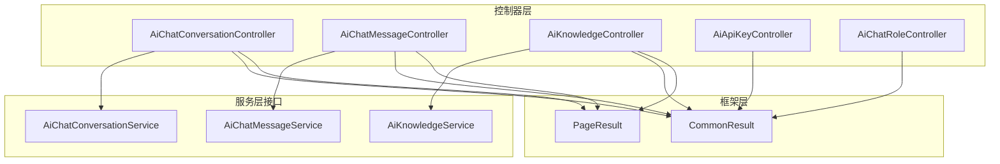
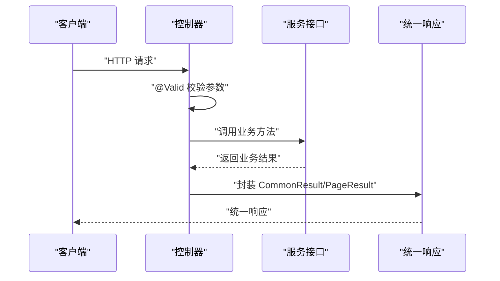
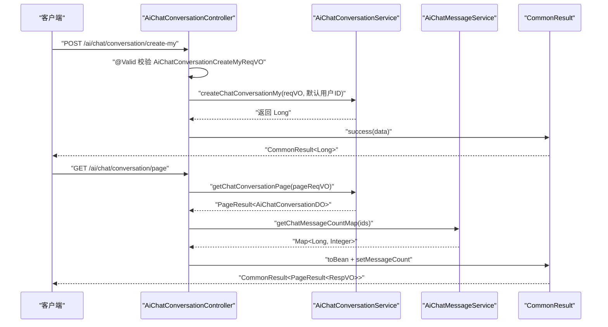
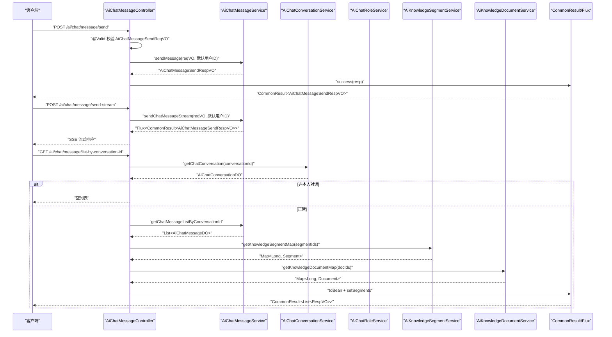
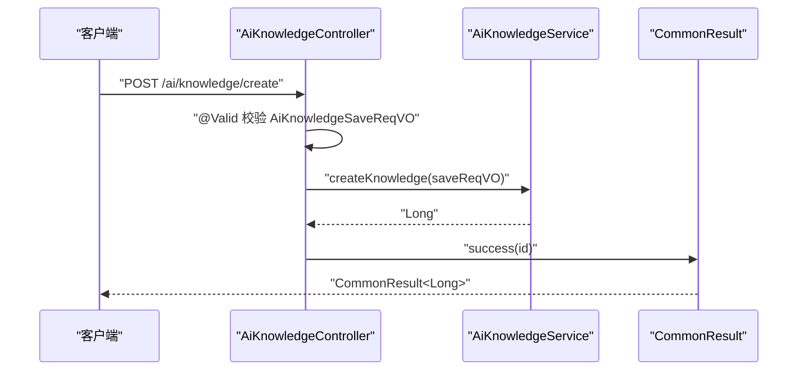
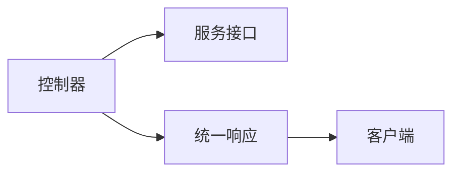

# 控制器层交互

<cite>
**本文档引用的文件**
- [AiChatConversationController.java](file://src/main/java/cn/boss/data/ai/controller/chat/AiChatConversationController.java)
- [AiChatMessageController.java](file://src/main/java/cn/boss/data/ai/controller/chat/AiChatMessageController.java)
- [AiKnowledgeController.java](file://src/main/java/cn/boss/data/ai/controller/knowledge/AiKnowledgeController.java)
- [AiApiKeyController.java](file://src/main/java/cn/boss/data/ai/controller/model/AiApiKeyController.java)
- [AiChatRoleController.java](file://src/main/java/cn/boss/data/ai/controller/model/AiChatRoleController.java)
- [CommonResult.java](file://src/main/java/cn/boss/data/ai/framework/common/pojo/CommonResult.java)
- [PageResult.java](file://src/main/java/cn/boss/data/ai/framework/common/pojo/PageResult.java)
- [AiChatConversationService.java](file://src/main/java/cn/boss/data/ai/service/chat/AiChatConversationService.java)
- [AiChatMessageService.java](file://src/main/java/cn/boss/data/ai/service/chat/AiChatMessageService.java)
- [AiKnowledgeService.java](file://src/main/java/cn/boss/data/ai/service/knowledge/AiKnowledgeService.java)
- [AiChatConversationCreateMyReqVO.java](file://src/main/java/cn/boss/data/ai/controller/chat/vo/conversation/AiChatConversationCreateMyReqVO.java)
- [AiChatMessageSendReqVO.java](file://src/main/java/cn/boss/data/ai/controller/chat/vo/message/AiChatMessageSendReqVO.java)
- [AiKnowledgeSaveReqVO.java](file://src/main/java/cn/boss/data/ai/controller/knowledge/vo/knowledge/AiKnowledgeSaveReqVO.java)
- [AiApiKeySaveReqVO.java](file://src/main/java/cn/boss/data/ai/controller/model/vo/apikey/AiApiKeySaveReqVO.java)
- [AiChatRoleSaveMyReqVO.java](file://src/main/java/cn/boss/data/ai/controller/model/vo/chatRole/AiChatRoleSaveMyReqVO.java)
</cite>

## 目录
1. [引言](#引言)
2. [项目结构](#项目结构)
3. [核心组件](#核心组件)
4. [架构总览](#架构总览)
5. [详细组件分析](#详细组件分析)
6. [依赖分析](#依赖分析)
7. [性能考虑](#性能考虑)
8. [故障排查指南](#故障排查指南)
9. [结论](#结论)
10. [附录](#附录)

## 引言
本文件聚焦于控制器层组件的交互关系，系统化阐述REST控制器与服务层之间的调用关系、参数传递机制、请求验证与响应封装策略，以及异常处理原则。通过对聊天、知识库、模型与API密钥等模块的统一处理模式与差异化逻辑进行对比分析，帮助读者快速理解从HTTP请求到业务响应的完整调用链路。

## 项目结构
控制器层采用按业务域分包组织：chat、knowledge、model，每个域内包含控制器、VO（请求/响应值对象）、服务接口与实现、DAO与Mapper。框架层提供统一响应包装、分页结果、通用异常与校验工具。

图表来源
- [AiChatConversationController.java:30-112](file://src/main/java/cn/boss/data/ai/controller/chat/AiChatConversationController.java#L30-L112)
- [AiChatMessageController.java:40-155](file://src/main/java/cn/boss/data/ai/controller/chat/AiChatMessageController.java#L40-L155)
- [AiKnowledgeController.java:25-78](file://src/main/java/cn/boss/data/ai/controller/knowledge/AiKnowledgeController.java#L25-L78)
- [AiApiKeyController.java:25-77](file://src/main/java/cn/boss/data/ai/controller/model/AiApiKeyController.java#L25-L77)
- [AiChatRoleController.java:25-119](file://src/main/java/cn/boss/data/ai/controller/model/AiChatRoleController.java#L25-L119)
- [CommonResult.java:14-84](file://src/main/java/cn/boss/data/ai/framework/common/pojo/CommonResult.java#L14-L84)
- [PageResult.java:10-41](file://src/main/java/cn/boss/data/ai/framework/common/pojo/PageResult.java#L10-L41)

章节来源
- [AiChatConversationController.java:1-113](file://src/main/java/cn/boss/data/ai/controller/chat/AiChatConversationController.java#L1-L113)
- [AiChatMessageController.java:1-156](file://src/main/java/cn/boss/data/ai/controller/chat/AiChatMessageController.java#L1-L156)
- [AiKnowledgeController.java:1-79](file://src/main/java/cn/boss/data/ai/controller/knowledge/AiKnowledgeController.java#L1-L79)
- [AiApiKeyController.java:1-78](file://src/main/java/cn/boss/data/ai/controller/model/AiApiKeyController.java#L1-L78)
- [AiChatRoleController.java:1-120](file://src/main/java/cn/boss/data/ai/controller/model/AiChatRoleController.java#L1-L120)
- [CommonResult.java:1-85](file://src/main/java/cn/boss/data/ai/framework/common/pojo/CommonResult.java#L1-L85)
- [PageResult.java:1-42](file://src/main/java/cn/boss/data/ai/framework/common/pojo/PageResult.java#L1-L42)

## 核心组件
- 控制器层：以@RestController注解暴露HTTP端点，使用@RequestMapping定义资源路径，结合Swagger注解描述接口语义；通过@Valid/@Validated对入参进行校验，使用@RequestBody/@RequestParam接收请求体与查询参数。
- 服务层接口：定义业务契约，控制器仅面向接口编程，便于替换实现与测试。
- 响应封装：统一使用CommonResult<T>封装响应码、消息与数据；分页场景使用PageResult<T>承载总量与列表。
- 参数VO：在控制器层定义请求/响应值对象，明确字段含义、示例与校验规则，降低耦合并提升可维护性。

章节来源
- [AiChatConversationController.java:29-112](file://src/main/java/cn/boss/data/ai/controller/chat/AiChatConversationController.java#L29-L112)
- [AiChatMessageController.java:40-155](file://src/main/java/cn/boss/data/ai/controller/chat/AiChatMessageController.java#L40-L155)
- [AiKnowledgeController.java:25-78](file://src/main/java/cn/boss/data/ai/controller/knowledge/AiKnowledgeController.java#L25-L78)
- [AiApiKeyController.java:25-77](file://src/main/java/cn/boss/data/ai/controller/model/AiApiKeyController.java#L25-L77)
- [AiChatRoleController.java:25-119](file://src/main/java/cn/boss/data/ai/controller/model/AiChatRoleController.java#L25-L119)
- [CommonResult.java:14-84](file://src/main/java/cn/boss/data/ai/framework/common/pojo/CommonResult.java#L14-L84)
- [PageResult.java:10-41](file://src/main/java/cn/boss/data/ai/framework/common/pojo/PageResult.java#L10-L41)

## 架构总览
控制器层负责请求接入与参数校验，随后调用对应服务接口执行业务逻辑，最后将结果封装为统一响应返回。部分控制器在返回前会进行数据拼装或权限校验。

图表来源
- [AiChatConversationController.java:42-78](file://src/main/java/cn/boss/data/ai/controller/chat/AiChatConversationController.java#L42-L78)
- [AiChatMessageController.java:60-68](file://src/main/java/cn/boss/data/ai/controller/chat/AiChatMessageController.java#L60-L68)
- [AiKnowledgeController.java:34-67](file://src/main/java/cn/boss/data/ai/controller/knowledge/AiKnowledgeController.java#L34-L67)
- [CommonResult.java:45-51](file://src/main/java/cn/boss/data/ai/framework/common/pojo/CommonResult.java#L45-L51)
- [PageResult.java:20-39](file://src/main/java/cn/boss/data/ai/framework/common/pojo/PageResult.java#L20-L39)

## 详细组件分析

### 聊天对话控制器（AiChatConversationController）
- 职责分离
  - 个人维度操作：创建、更新、查询我的对话列表与单条对话、删除我的对话、按未置顶条件批量删除。
  - 管理维度操作：对话分页、管理员删除。
- 参数传递
  - 创建/更新：使用AiChatConversationCreateMyReqVO/AiChatConversationUpdateMyReqVO作为请求体，经@Valid校验后传入服务层。
  - 查询/删除：使用@RequestParam接收id等路径参数。
- 统一响应
  - 返回CommonResult<Long>/CommonResult<Boolean>/CommonResult<List>/CommonResult<AiChatConversationRespVO>。
- 差异化逻辑
  - 个人维度均注入默认用户ID，查询时对userId进行校验，防止越权访问。
  - 分页场景在返回前拼接消息数量统计，调用AiChatMessageService获取计数映射。

图表来源
- [AiChatConversationController.java:42-102](file://src/main/java/cn/boss/data/ai/controller/chat/AiChatConversationController.java#L42-L102)
- [AiChatConversationService.java:14-34](file://src/main/java/cn/boss/data/ai/service/chat/AiChatConversationService.java#L14-L34)
- [AiChatMessageService.java:18-36](file://src/main/java/cn/boss/data/ai/service/chat/AiChatMessageService.java#L18-L36)
- [CommonResult.java:45-51](file://src/main/java/cn/boss/data/ai/framework/common/pojo/CommonResult.java#L45-L51)
- [PageResult.java:20-39](file://src/main/java/cn/boss/data/ai/framework/common/pojo/PageResult.java#L20-L39)

章节来源
- [AiChatConversationController.java:35-112](file://src/main/java/cn/boss/data/ai/controller/chat/AiChatConversationController.java#L35-L112)
- [AiChatConversationService.java:14-34](file://src/main/java/cn/boss/data/ai/service/chat/AiChatConversationService.java#L14-L34)

### 聊天消息控制器（AiChatMessageController）
- 职责分离
  - 发送消息：支持一次性返回与流式返回两种模式，分别返回CommonResult或Flux<CommonResult>。
  - 列表查询：按对话ID查询消息列表，并拼接知识库段落与文档信息。
  - 删除操作：支持按消息ID、按对话ID、管理员删除。
  - 管理分页：返回消息分页并拼接聊天角色名称。
- 参数传递
  - 发送：AiChatMessageSendReqVO作为请求体，包含对话ID、内容、上下文开关、联网搜索开关与附件URL数组。
  - 查询/删除：使用@RequestParam接收conversationId或id。
- 统一响应
  - 成功返回CommonResult<Boolean>/CommonResult<List>/CommonResult<PageResult>或Flux<CommonResult>。
- 差异化逻辑
  - 流式发送：直接返回服务层的Flux，由Spring WebFlux处理SSE推送。
  - 数据拼装：在返回前根据消息中的段落ID映射知识库段落与文档，增强响应信息。

图表来源
- [AiChatMessageController.java:60-112](file://src/main/java/cn/boss/data/ai/controller/chat/AiChatMessageController.java#L60-L112)
- [AiChatMessageService.java:18-36](file://src/main/java/cn/boss/data/ai/service/chat/AiChatMessageService.java#L18-L36)
- [AiChatConversationService.java:20-22](file://src/main/java/cn/boss/data/ai/service/chat/AiChatConversationService.java#L20-L22)
- [AiKnowledgeSegmentService.java](file://src/main/java/cn/boss/data/ai/service/knowledge/AiKnowledgeSegmentService.java)
- [AiKnowledgeDocumentService.java](file://src/main/java/cn/boss/data/ai/service/knowledge/AiKnowledgeDocumentService.java)
- [CommonResult.java:45-51](file://src/main/java/cn/boss/data/ai/framework/common/pojo/CommonResult.java#L45-L51)

章节来源
- [AiChatMessageController.java:46-155](file://src/main/java/cn/boss/data/ai/controller/chat/AiChatMessageController.java#L46-L155)
- [AiChatMessageService.java:18-36](file://src/main/java/cn/boss/data/ai/service/chat/AiChatMessageService.java#L18-L36)

### 知识库控制器（AiKnowledgeController）
- 职责分离
  - 知识库CRUD与分页查询，提供精简列表（启用状态）。
- 参数传递
  - 新增/修改：AiKnowledgeSaveReqVO，包含名称、描述、向量模型、topK、相似度阈值与状态等字段。
  - 查询/删除：使用@RequestParam接收id。
- 统一响应
  - 返回CommonResult<Long>/CommonResult<Boolean>/CommonResult<PageResult>/CommonResult<List>。
- 差异化逻辑
  - 精简列表仅返回启用状态的知识库，便于前端选择。

图表来源
- [AiKnowledgeController.java:49-53](file://src/main/java/cn/boss/data/ai/controller/knowledge/AiKnowledgeController.java#L49-L53)
- [AiKnowledgeService.java:15-70](file://src/main/java/cn/boss/data/ai/service/knowledge/AiKnowledgeService.java#L15-L70)
- [AiKnowledgeSaveReqVO.java:10-41](file://src/main/java/cn/boss/data/ai/controller/knowledge/vo/knowledge/AiKnowledgeSaveReqVO.java#L10-L41)
- [CommonResult.java:45-51](file://src/main/java/cn/boss/data/ai/framework/common/pojo/CommonResult.java#L45-L51)

章节来源
- [AiKnowledgeController.java:29-78](file://src/main/java/cn/boss/data/ai/controller/knowledge/AiKnowledgeController.java#L29-L78)
- [AiKnowledgeService.java:15-70](file://src/main/java/cn/boss/data/ai/service/knowledge/AiKnowledgeService.java#L15-L70)

### API密钥控制器（AiApiKeyController）
- 职责分离
  - API密钥CRUD与分页查询，提供精简列表（用于模型绑定）。
- 参数传递
  - 新增/修改：AiApiKeySaveReqVO，包含名称、密钥、平台、自定义地址与状态。
  - 查询/删除：使用@RequestParam接收id。
- 统一响应
  - 返回CommonResult<Long>/CommonResult<Boolean>/CommonResult<PageResult>/CommonResult<List>。

章节来源
- [AiApiKeyController.java:29-77](file://src/main/java/cn/boss/data/ai/controller/model/AiApiKeyController.java#L29-L77)
- [AiApiKeySaveReqVO.java:10-34](file://src/main/java/cn/boss/data/ai/controller/model/vo/apikey/AiApiKeySaveReqVO.java#L10-L34)

### 聊天角色控制器（AiChatRoleController）
- 职责分离
  - 个人维度：分页、查询、创建、更新、删除我的聊天角色。
  - 管理维度：角色CRUD与分页。
- 参数传递
  - 个人创建/更新：AiChatRoleSaveMyReqVO，包含名称、头像、描述、系统消息及引用的知识库/工具/MCP客户端。
  - 查询/删除：使用@RequestParam接收id。
- 统一响应
  - 返回CommonResult<Long>/CommonResult<Boolean>/CommonResult<PageResult>/CommonResult<AiChatRoleRespVO>。
- 差异化逻辑
  - 个人维度注入默认用户ID并在查询时校验，防止越权。

章节来源
- [AiChatRoleController.java:31-119](file://src/main/java/cn/boss/data/ai/controller/model/AiChatRoleController.java#L31-L119)
- [AiChatRoleSaveMyReqVO.java:10-43](file://src/main/java/cn/boss/data/ai/controller/model/vo/chatRole/AiChatRoleSaveMyReqVO.java#L10-L43)

## 依赖分析
- 控制器与服务层：控制器通过@Resource注入服务接口，遵循面向接口编程原则，降低耦合。
- 控制器与框架层：统一使用CommonResult与PageResult进行响应封装，保证前后端契约一致。
- 控制器内部协作：部分控制器在返回前进行数据拼装（如聊天对话分页拼接消息数、消息列表拼接知识库段落与文档），体现“轻控制器、重服务”的设计思想。

图表来源
- [AiChatConversationController.java:37-40](file://src/main/java/cn/boss/data/ai/controller/chat/AiChatConversationController.java#L37-L40)
- [AiChatMessageController.java:48-57](file://src/main/java/cn/boss/data/ai/controller/chat/AiChatMessageController.java#L48-L57)
- [AiKnowledgeController.java:31-32](file://src/main/java/cn/boss/data/ai/controller/knowledge/AiKnowledgeController.java#L31-L32)
- [AiApiKeyController.java:31-32](file://src/main/java/cn/boss/data/ai/controller/model/AiApiKeyController.java#L31-L32)
- [AiChatRoleController.java:33-34](file://src/main/java/cn/boss/data/ai/controller/model/AiChatRoleController.java#L33-L34)
- [CommonResult.java:14-84](file://src/main/java/cn/boss/data/ai/framework/common/pojo/CommonResult.java#L14-L84)
- [PageResult.java:10-41](file://src/main/java/cn/boss/data/ai/framework/common/pojo/PageResult.java#L10-L41)

章节来源
- [AiChatConversationController.java:37-40](file://src/main/java/cn/boss/data/ai/controller/chat/AiChatConversationController.java#L37-L40)
- [AiChatMessageController.java:48-57](file://src/main/java/cn/boss/data/ai/controller/chat/AiChatMessageController.java#L48-L57)
- [AiKnowledgeController.java:31-32](file://src/main/java/cn/boss/data/ai/controller/knowledge/AiKnowledgeController.java#L31-L32)
- [AiApiKeyController.java:31-32](file://src/main/java/cn/boss/data/ai/controller/model/AiApiKeyController.java#L31-L32)
- [AiChatRoleController.java:33-34](file://src/main/java/cn/boss/data/ai/controller/model/AiChatRoleController.java#L33-L34)
- [CommonResult.java:14-84](file://src/main/java/cn/boss/data/ai/framework/common/pojo/CommonResult.java#L14-L84)
- [PageResult.java:10-41](file://src/main/java/cn/boss/data/ai/framework/common/pojo/PageResult.java#L10-L41)

## 性能考虑
- 流式响应：消息发送支持SSE流式返回，适合长耗时推理过程的实时反馈，减少首字节延迟。
- 批量拼装：分页返回前进行批量映射（如消息计数、角色名称、知识库段落与文档），避免N+1查询，提升整体吞吐。
- 响应封装：统一响应结构减少序列化开销，便于前端缓存与错误处理。

## 故障排查指南
- 请求参数校验失败
  - 现象：返回非2xx但包含错误码与消息的统一响应。
  - 定位：检查各VO上的校验注解（如@NotNull、@NotBlank、@URL、@InEnum）与提示信息。
  - 参考
    - [AiChatMessageSendReqVO.java:14-31](file://src/main/java/cn/boss/data/ai/controller/chat/vo/message/AiChatMessageSendReqVO.java#L14-L31)
    - [AiKnowledgeSaveReqVO.java:17-41](file://src/main/java/cn/boss/data/ai/controller/knowledge/vo/knowledge/AiKnowledgeSaveReqVO.java#L17-L41)
    - [AiApiKeySaveReqVO.java:15-34](file://src/main/java/cn/boss/data/ai/controller/model/vo/apikey/AiApiKeySaveReqVO.java#L15-L34)
    - [AiChatRoleSaveMyReqVO.java:17-43](file://src/main/java/cn/boss/data/ai/controller/model/vo/chatRole/AiChatRoleSaveMyReqVO.java#L17-L43)
- 业务异常
  - 现象：服务层抛出业务异常，统一由框架层转换为CommonResult.error。
  - 处理：捕获ServiceException并返回对应错误码与消息。
  - 参考
    - [CommonResult.java:21-43](file://src/main/java/cn/boss/data/ai/framework/common/pojo/CommonResult.java#L21-L43)
    - [CommonResult.java:67-72](file://src/main/java/cn/boss/data/ai/framework/common/pojo/CommonResult.java#L67-L72)
- 权限校验
  - 现象：查询个人资源时若非本人，返回空或null。
  - 处理：确认默认用户ID注入与业务校验逻辑。
  - 参考
    - [AiChatConversationController.java:67-70](file://src/main/java/cn/boss/data/ai/controller/chat/AiChatConversationController.java#L67-L70)
    - [AiChatMessageController.java:76-80](file://src/main/java/cn/boss/data/ai/controller/chat/AiChatMessageController.java#L76-L80)
    - [AiChatRoleController.java:47-51](file://src/main/java/cn/boss/data/ai/controller/model/AiChatRoleController.java#L47-L51)

章节来源
- [AiChatMessageSendReqVO.java:10-31](file://src/main/java/cn/boss/data/ai/controller/chat/vo/message/AiChatMessageSendReqVO.java#L10-L31)
- [AiKnowledgeSaveReqVO.java:10-41](file://src/main/java/cn/boss/data/ai/controller/knowledge/vo/knowledge/AiKnowledgeSaveReqVO.java#L10-L41)
- [AiApiKeySaveReqVO.java:8-34](file://src/main/java/cn/boss/data/ai/controller/model/vo/apikey/AiApiKeySaveReqVO.java#L8-L34)
- [AiChatRoleSaveMyReqVO.java:10-43](file://src/main/java/cn/boss/data/ai/controller/model/vo/chatRole/AiChatRoleSaveMyReqVO.java#L10-L43)
- [CommonResult.java:21-72](file://src/main/java/cn/boss/data/ai/framework/common/pojo/CommonResult.java#L21-L72)
- [AiChatConversationController.java:67-70](file://src/main/java/cn/boss/data/ai/controller/chat/AiChatConversationController.java#L67-L70)
- [AiChatMessageController.java:76-80](file://src/main/java/cn/boss/data/ai/controller/chat/AiChatMessageController.java#L76-L80)
- [AiChatRoleController.java:47-51](file://src/main/java/cn/boss/data/ai/controller/model/AiChatRoleController.java#L47-L51)

## 结论
控制器层通过清晰的职责划分与统一的响应封装，实现了与服务层松耦合的交互模式。各模块在保持统一处理风格的同时，针对个人/管理、流式/同步、分页/单条等差异化场景提供了灵活的实现策略。建议在扩展新功能时遵循现有模式：面向接口编程、严格参数校验、统一响应封装、必要时进行批量数据拼装。

## 附录
- 统一响应结构
  - 字段：code（整型错误码）、msg（字符串消息）、data（泛型数据）。
  - 成功：code为成功码，msg为空，data为业务数据。
  - 错误：code为错误码，msg为错误消息，data为null。
- 分页结构
  - 字段：total（总量）、list（列表）。
  - 空列表：total为0，list为空集合。

章节来源
- [CommonResult.java:14-84](file://src/main/java/cn/boss/data/ai/framework/common/pojo/CommonResult.java#L14-L84)
- [PageResult.java:10-41](file://src/main/java/cn/boss/data/ai/framework/common/pojo/PageResult.java#L10-L41)