# 知识库服务交互

<cite>
**本文引用的文件**
- [AiKnowledgeService.java](file://src/main/java/cn/boss/data/ai/service/knowledge/AiKnowledgeService.java)
- [AiKnowledgeServiceImpl.java](file://src/main/java/cn/boss/data/ai/service/knowledge/AiKnowledgeServiceImpl.java)
- [AiKnowledgeDocumentService.java](file://src/main/java/cn/boss/data/ai/service/knowledge/AiKnowledgeDocumentService.java)
- [AiKnowledgeDocumentServiceImpl.java](file://src/main/java/cn/boss/data/ai/service/knowledge/AiKnowledgeDocumentServiceImpl.java)
- [AiKnowledgeSegmentService.java](file://src/main/java/cn/boss/data/ai/service/knowledge/AiKnowledgeSegmentService.java)
- [AiKnowledgeSegmentServiceImpl.java](file://src/main/java/cn/boss/data/ai/service/knowledge/AiKnowledgeSegmentServiceImpl.java)
- [AiKnowledgeController.java](file://src/main/java/cn/boss/data/ai/controller/knowledge/AiKnowledgeController.java)
- [AiKnowledgeDocumentController.java](file://src/main/java/cn/boss/data/ai/controller/knowledge/AiKnowledgeDocumentController.java)
- [AiKnowledgeSegmentController.java](file://src/main/java/cn/boss/data/ai/controller/knowledge/AiKnowledgeSegmentController.java)
- [AiKnowledgeDO.java](file://src/main/java/cn/boss/data/ai/dal/dataobject/knowledge/AiKnowledgeDO.java)
- [AiKnowledgeDocumentDO.java](file://src/main/java/cn/boss/data/ai/dal/dataobject/knowledge/AiKnowledgeDocumentDO.java)
- [AiKnowledgeSegmentDO.java](file://src/main/java/cn/boss/data/ai/dal/dataobject/knowledge/AiKnowledgeSegmentDO.java)
- [AiDocumentSplitStrategyEnum.java](file://src/main/java/cn/boss/data/ai/enums/AiDocumentSplitStrategyEnum.java)
- [MarkdownQaSplitter.java](file://src/main/java/cn/boss/data/ai/service/knowledge/splitter/MarkdownQaSplitter.java)
- [SemanticTextSplitter.java](file://src/main/java/cn/boss/data/ai/service/knowledge/splitter/SemanticTextSplitter.java)
- [CommonStatusEnum.java](file://src/main/java/cn/boss/data/ai/framework/common/enums/CommonStatusEnum.java)
</cite>

## 目录
1. [简介](#简介)
2. [项目结构](#项目结构)
3. [核心组件](#核心组件)
4. [架构总览](#架构总览)
5. [详细组件分析](#详细组件分析)
6. [依赖分析](#依赖分析)
7. [性能考量](#性能考量)
8. [故障排查指南](#故障排查指南)
9. [结论](#结论)
10. [附录](#附录)

## 简介
本文件聚焦知识库服务模块的组件交互关系，系统性梳理 AiKnowledgeService、AiKnowledgeDocumentService、AiKnowledgeSegmentService 三层服务的职责边界、协作机制与数据流。重点覆盖以下主题：
- 文档上传、段落切分、向量索引的完整处理流程
- 服务层与向量存储的交互模式
- 知识库检索的查询处理机制与结果返回策略
- 文档状态管理、段落状态控制与元数据处理的数据流转
- 典型业务场景的时序图与组件调用关系图

## 项目结构
知识库服务采用“控制器-服务-数据访问”分层设计，围绕知识库、文档、段落三类实体构建完整的生命周期管理与检索能力。

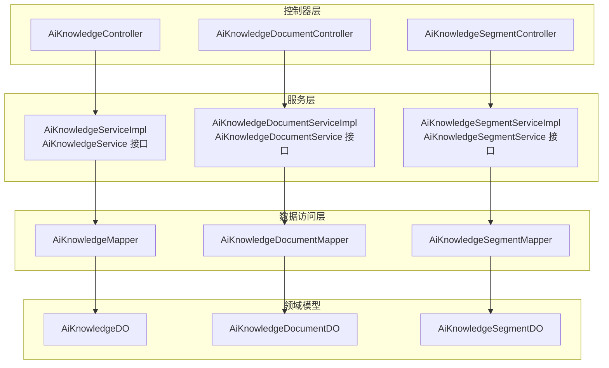

图表来源
- [AiKnowledgeController.java:29-78](file://src/main/java/cn/boss/data/ai/controller/knowledge/AiKnowledgeController.java#L29-L78)
- [AiKnowledgeDocumentController.java:26-83](file://src/main/java/cn/boss/data/ai/controller/knowledge/AiKnowledgeDocumentController.java#L26-L83)
- [AiKnowledgeSegmentController.java:33-122](file://src/main/java/cn/boss/data/ai/controller/knowledge/AiKnowledgeSegmentController.java#L33-L122)
- [AiKnowledgeServiceImpl.java:27-109](file://src/main/java/cn/boss/data/ai/service/knowledge/AiKnowledgeServiceImpl.java#L27-L109)
- [AiKnowledgeDocumentServiceImpl.java:41-226](file://src/main/java/cn/boss/data/ai/service/knowledge/AiKnowledgeDocumentServiceImpl.java#L41-L226)
- [AiKnowledgeSegmentServiceImpl.java:54-496](file://src/main/java/cn/boss/data/ai/service/knowledge/AiKnowledgeSegmentServiceImpl.java#L54-L496)

章节来源
- [AiKnowledgeController.java:29-78](file://src/main/java/cn/boss/data/ai/controller/knowledge/AiKnowledgeController.java#L29-L78)
- [AiKnowledgeDocumentController.java:26-83](file://src/main/java/cn/boss/data/ai/controller/knowledge/AiKnowledgeDocumentController.java#L26-L83)
- [AiKnowledgeSegmentController.java:33-122](file://src/main/java/cn/boss/data/ai/controller/knowledge/AiKnowledgeSegmentController.java#L33-L122)

## 核心组件
- 知识库服务接口与实现：负责知识库基本信息的增删改查、模型变更触发的全量重索引等。
- 文档服务接口与实现：负责文档的下载、解析、入库、批量导入、状态变更联动切片处理等。
- 段落服务接口与实现：负责内容切片、向量化写入/删除、检索召回、重索引、状态变更同步向量等。

章节来源
- [AiKnowledgeService.java:15-70](file://src/main/java/cn/boss/data/ai/service/knowledge/AiKnowledgeService.java#L15-L70)
- [AiKnowledgeServiceImpl.java:27-109](file://src/main/java/cn/boss/data/ai/service/knowledge/AiKnowledgeServiceImpl.java#L27-L109)
- [AiKnowledgeDocumentService.java:22-126](file://src/main/java/cn/boss/data/ai/service/knowledge/AiKnowledgeDocumentService.java#L22-L126)
- [AiKnowledgeDocumentServiceImpl.java:41-226](file://src/main/java/cn/boss/data/ai/service/knowledge/AiKnowledgeDocumentServiceImpl.java#L41-L226)
- [AiKnowledgeSegmentService.java:24-150](file://src/main/java/cn/boss/data/ai/service/knowledge/AiKnowledgeSegmentService.java#L24-L150)
- [AiKnowledgeSegmentServiceImpl.java:54-496](file://src/main/java/cn/boss/data/ai/service/knowledge/AiKnowledgeSegmentServiceImpl.java#L54-L496)

## 架构总览
三层服务通过控制器对外暴露 REST 接口，内部通过延迟注入避免循环依赖，统一通过向量存储进行相似度检索与重排序，确保检索质量与性能平衡。

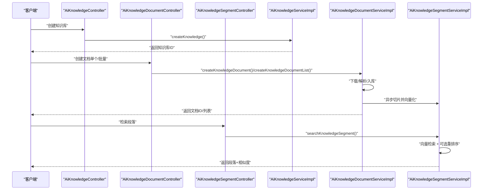

图表来源
- [AiKnowledgeController.java:49-68](file://src/main/java/cn/boss/data/ai/controller/knowledge/AiKnowledgeController.java#L49-L68)
- [AiKnowledgeDocumentController.java:46-81](file://src/main/java/cn/boss/data/ai/controller/knowledge/AiKnowledgeDocumentController.java#L46-L81)
- [AiKnowledgeSegmentController.java:103-121](file://src/main/java/cn/boss/data/ai/controller/knowledge/AiKnowledgeSegmentController.java#L103-L121)
- [AiKnowledgeServiceImpl.java:42-83](file://src/main/java/cn/boss/data/ai/service/knowledge/AiKnowledgeServiceImpl.java#L42-L83)
- [AiKnowledgeDocumentServiceImpl.java:57-102](file://src/main/java/cn/boss/data/ai/service/knowledge/AiKnowledgeDocumentServiceImpl.java#L57-L102)
- [AiKnowledgeSegmentServiceImpl.java:227-295](file://src/main/java/cn/boss/data/ai/service/knowledge/AiKnowledgeSegmentServiceImpl.java#L227-L295)

## 详细组件分析

### 知识库服务层（AiKnowledgeService/Impl）
- 职责
  - 创建/更新知识库：校验嵌入模型，持久化冗余模型标识，便于检索阶段快速定位向量存储。
  - 删除知识库：先删除其下所有文档与段落，再删除知识库本身，保证外键一致性。
  - 模型变更触发重索引：若嵌入模型变更，异步触发基于知识库维度的全量重索引。
- 关键交互
  - 依赖 AiModelService 获取/校验模型；依赖 AiKnowledgeSegmentService 和 AiKnowledgeDocumentService 进行级联操作。

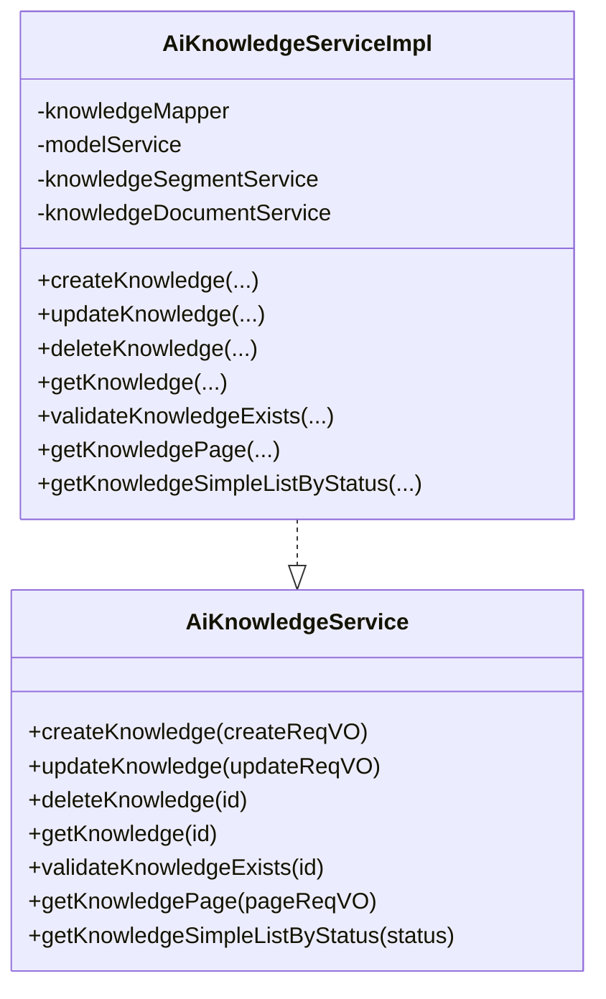

图表来源
- [AiKnowledgeService.java:15-70](file://src/main/java/cn/boss/data/ai/service/knowledge/AiKnowledgeService.java#L15-L70)
- [AiKnowledgeServiceImpl.java:27-109](file://src/main/java/cn/boss/data/ai/service/knowledge/AiKnowledgeServiceImpl.java#L27-L109)

章节来源
- [AiKnowledgeServiceImpl.java:41-83](file://src/main/java/cn/boss/data/ai/service/knowledge/AiKnowledgeServiceImpl.java#L41-L83)

### 文档服务层（AiKnowledgeDocumentService/Impl）
- 职责
  - 文档创建：校验知识库存在，下载 URL 内容，解析为纯文本，计算长度与 Token 数，入库并异步触发切片与向量化。
  - 批量导入：对多个文档并行下载、入库，批量异步切片。
  - 更新/状态变更：根据状态与阈值变化决定删除或重建段落切片；必要时触发重切片。
  - 删除：级联删除对应段落并向量存储同步删除。
  - 读取 URL：使用 Tika 解析器抽取文本，异常时抛出业务错误。
- 关键交互
  - 依赖 AiKnowledgeService 校验知识库；依赖 AiKnowledgeSegmentService 进行切片与向量化；延迟注入避免循环依赖。

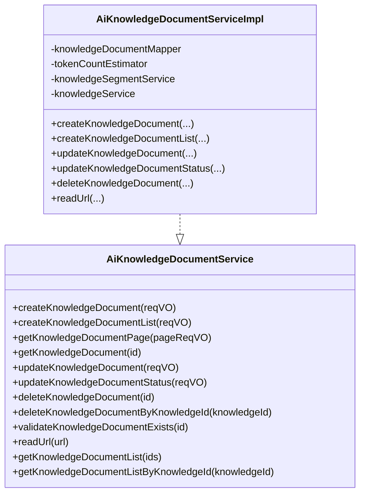

图表来源
- [AiKnowledgeDocumentService.java:22-126](file://src/main/java/cn/boss/data/ai/service/knowledge/AiKnowledgeDocumentService.java#L22-L126)
- [AiKnowledgeDocumentServiceImpl.java:41-226](file://src/main/java/cn/boss/data/ai/service/knowledge/AiKnowledgeDocumentServiceImpl.java#L41-L226)

章节来源
- [AiKnowledgeDocumentServiceImpl.java:57-162](file://src/main/java/cn/boss/data/ai/service/knowledge/AiKnowledgeDocumentServiceImpl.java#L57-L162)

### 段落服务层（AiKnowledgeSegmentService/Impl）
- 职责
  - 切片与向量化：根据策略自动识别文档类型，执行 Markdown QA、语义切分或 Token 切分；写入向量存储并回填向量 ID。
  - 检索：基于知识库嵌入模型与过滤条件执行相似度检索；可选重排序；更新召回计数。
  - 状态与重索引：段落启停状态与向量存储同步；知识库模型变更触发全量重索引。
  - 手工切片：支持直接对 URL 内容进行切片预览。
- 关键交互
  - 依赖 AiKnowledgeService/AiKnowledgeDocumentService 校验与获取上下文；通过 AiModelService 获取/复用向量存储实例；使用 TokenCountEstimator 估算 Token 数；使用 RerankModel 进行重排序。

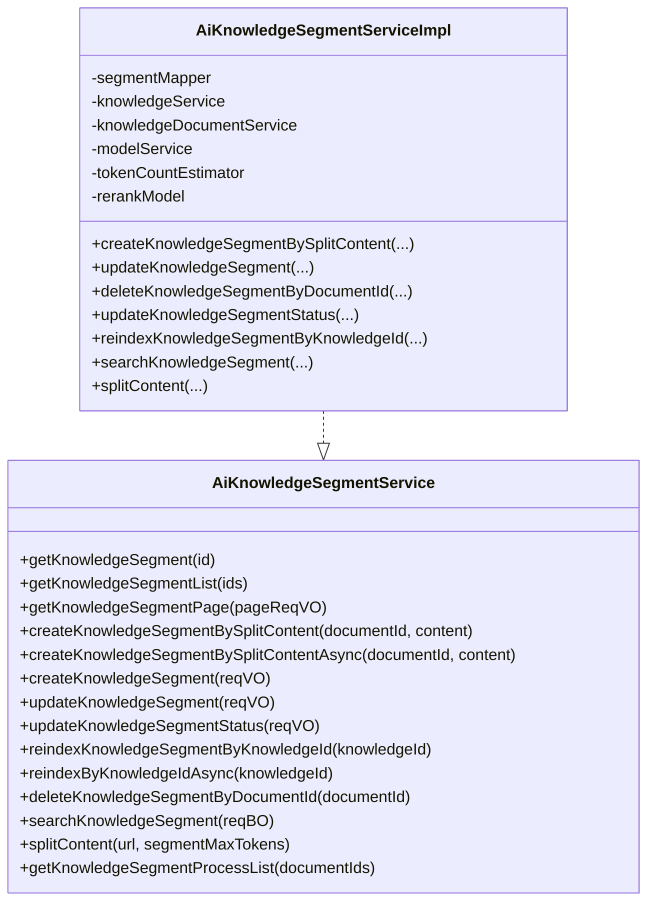

图表来源
- [AiKnowledgeSegmentService.java:24-150](file://src/main/java/cn/boss/data/ai/service/knowledge/AiKnowledgeSegmentService.java#L24-L150)
- [AiKnowledgeSegmentServiceImpl.java:54-496](file://src/main/java/cn/boss/data/ai/service/knowledge/AiKnowledgeSegmentServiceImpl.java#L54-L496)

章节来源
- [AiKnowledgeSegmentServiceImpl.java:94-201](file://src/main/java/cn/boss/data/ai/service/knowledge/AiKnowledgeSegmentServiceImpl.java#L94-L201)

### 数据模型与状态
- 知识库（AiKnowledgeDO）：包含嵌入模型 ID 与冗余模型标识、TopK、相似度阈值、状态等。
- 文档（AiKnowledgeDocumentDO）：包含内容、长度、Token 数、最大分段 Token、检索计数、状态等。
- 段落（AiKnowledgeSegmentDO）：包含内容、长度、向量 ID、Token 数、检索计数、状态等。
- 状态枚举（CommonStatusEnum）：统一的启用/禁用状态管理。

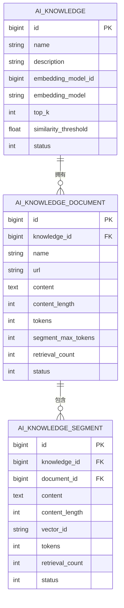

图表来源
- [AiKnowledgeDO.java:17-44](file://src/main/java/cn/boss/data/ai/dal/dataobject/knowledge/AiKnowledgeDO.java#L17-L44)
- [AiKnowledgeDocumentDO.java:16-40](file://src/main/java/cn/boss/data/ai/dal/dataobject/knowledge/AiKnowledgeDocumentDO.java#L16-L40)
- [AiKnowledgeSegmentDO.java:16-46](file://src/main/java/cn/boss/data/ai/dal/dataobject/knowledge/AiKnowledgeSegmentDO.java#L16-L46)

章节来源
- [AiKnowledgeDO.java:17-44](file://src/main/java/cn/boss/data/ai/dal/dataobject/knowledge/AiKnowledgeDO.java#L17-L44)
- [AiKnowledgeDocumentDO.java:16-40](file://src/main/java/cn/boss/data/ai/dal/dataobject/knowledge/AiKnowledgeDocumentDO.java#L16-L40)
- [AiKnowledgeSegmentDO.java:16-46](file://src/main/java/cn/boss/data/ai/dal/dataobject/knowledge/AiKnowledgeSegmentDO.java#L16-L46)
- [CommonStatusEnum.java:12-35](file://src/main/java/cn/boss/data/ai/framework/common/enums/CommonStatusEnum.java#L12-L35)

### 文档切片策略与算法
- 策略枚举：自动、Token、段落、Markdown QA、语义切分。
- Markdown QA 切片器：识别二级标题作为问题，保持 QA 对完整性，长答案智能切分并保留问题上下文。
- 语义切分器：优先段落边界，其次句子边界，避免截断，支持重叠以保持上下文连贯。

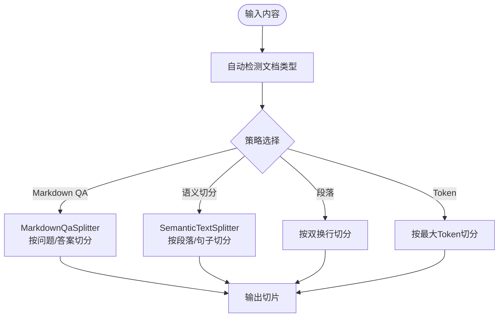

图表来源
- [AiDocumentSplitStrategyEnum.java:11-50](file://src/main/java/cn/boss/data/ai/enums/AiDocumentSplitStrategyEnum.java#L11-L50)
- [MarkdownQaSplitter.java:30-343](file://src/main/java/cn/boss/data/ai/service/knowledge/splitter/MarkdownQaSplitter.java#L30-L343)
- [SemanticTextSplitter.java:28-302](file://src/main/java/cn/boss/data/ai/service/knowledge/splitter/SemanticTextSplitter.java#L28-L302)
- [AiKnowledgeSegmentServiceImpl.java:351-401](file://src/main/java/cn/boss/data/ai/service/knowledge/AiKnowledgeSegmentServiceImpl.java#L351-L401)

章节来源
- [AiKnowledgeSegmentServiceImpl.java:297-401](file://src/main/java/cn/boss/data/ai/service/knowledge/AiKnowledgeSegmentServiceImpl.java#L297-L401)

### 检索与重排序机制
- 向量检索：按知识库 TopK 与相似度阈值检索，若启用重排序则扩大召回倍数后重排，再按阈值过滤。
- 结果返回：将向量 ID 映射回段落记录，补充相似度分数并按分数降序返回；同时增加召回计数。

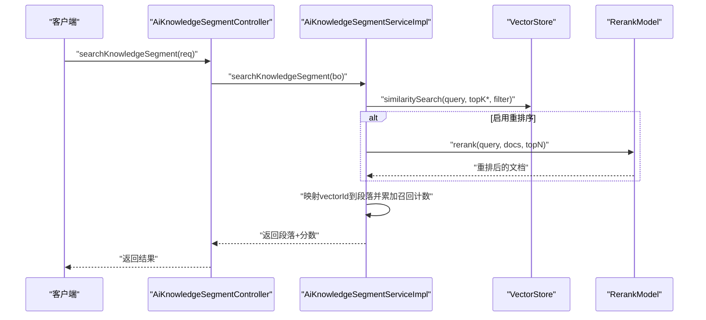

图表来源
- [AiKnowledgeSegmentController.java:103-121](file://src/main/java/cn/boss/data/ai/controller/knowledge/AiKnowledgeSegmentController.java#L103-L121)
- [AiKnowledgeSegmentServiceImpl.java:227-295](file://src/main/java/cn/boss/data/ai/service/knowledge/AiKnowledgeSegmentServiceImpl.java#L227-L295)

章节来源
- [AiKnowledgeSegmentServiceImpl.java:268-295](file://src/main/java/cn/boss/data/ai/service/knowledge/AiKnowledgeSegmentServiceImpl.java#L268-L295)

### 典型业务场景时序图

#### 场景一：文档上传与异步切片
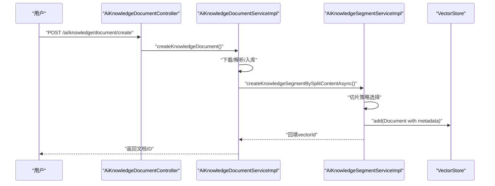

图表来源
- [AiKnowledgeDocumentController.java:46-51](file://src/main/java/cn/boss/data/ai/controller/knowledge/AiKnowledgeDocumentController.java#L46-L51)
- [AiKnowledgeDocumentServiceImpl.java:57-74](file://src/main/java/cn/boss/data/ai/service/knowledge/AiKnowledgeDocumentServiceImpl.java#L57-L74)
- [AiKnowledgeSegmentServiceImpl.java:94-123](file://src/main/java/cn/boss/data/ai/service/knowledge/AiKnowledgeSegmentServiceImpl.java#L94-L123)

#### 场景二：知识库模型变更触发重索引
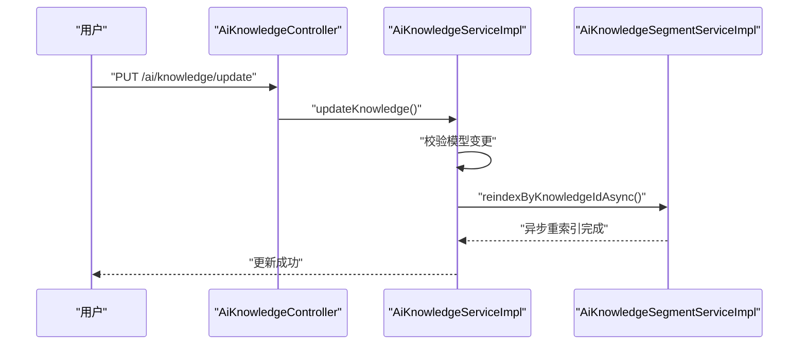

图表来源
- [AiKnowledgeController.java:55-59](file://src/main/java/cn/boss/data/ai/controller/knowledge/AiKnowledgeController.java#L55-L59)
- [AiKnowledgeServiceImpl.java:53-69](file://src/main/java/cn/boss/data/ai/service/knowledge/AiKnowledgeServiceImpl.java#L53-L69)
- [AiKnowledgeSegmentServiceImpl.java:180-201](file://src/main/java/cn/boss/data/ai/service/knowledge/AiKnowledgeSegmentServiceImpl.java#L180-L201)

#### 场景三：段落状态变更同步向量存储
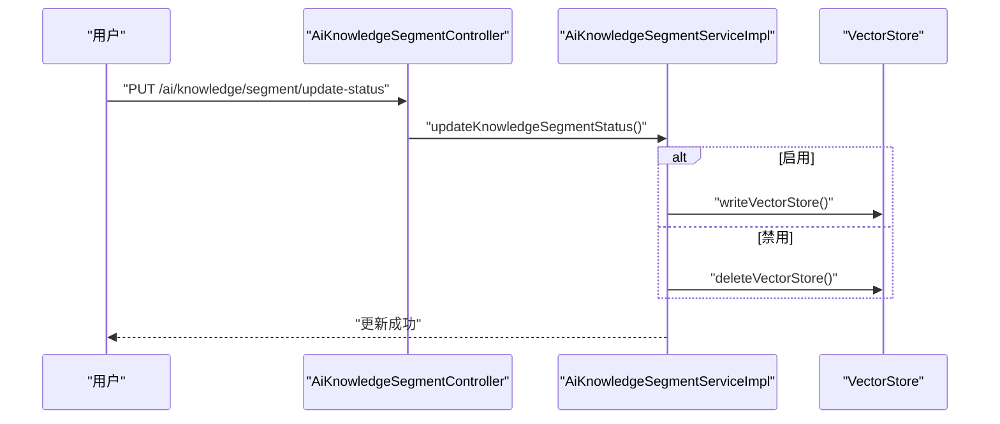

图表来源
- [AiKnowledgeSegmentController.java:73-79](file://src/main/java/cn/boss/data/ai/controller/knowledge/AiKnowledgeSegmentController.java#L73-L79)
- [AiKnowledgeSegmentServiceImpl.java:160-177](file://src/main/java/cn/boss/data/ai/service/knowledge/AiKnowledgeSegmentServiceImpl.java#L160-L177)

## 依赖分析
- 控制器依赖服务接口，服务实现依赖数据访问层与外部组件（向量存储、重排序模型、Tika、Token 估算器）。
- 服务层之间通过接口解耦，AiKnowledgeDocumentServiceImpl 与 AiKnowledgeSegmentServiceImpl 通过延迟注入避免循环依赖。
- 向量存储元数据携带知识库、文档、段落 ID，确保检索与更新的一致性。

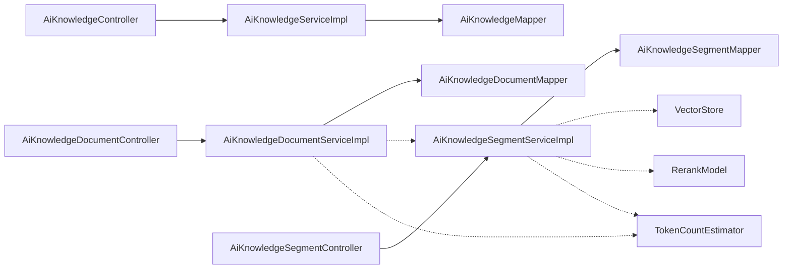

图表来源
- [AiKnowledgeController.java:29-78](file://src/main/java/cn/boss/data/ai/controller/knowledge/AiKnowledgeController.java#L29-L78)
- [AiKnowledgeDocumentController.java:26-83](file://src/main/java/cn/boss/data/ai/controller/knowledge/AiKnowledgeDocumentController.java#L26-L83)
- [AiKnowledgeSegmentController.java:33-122](file://src/main/java/cn/boss/data/ai/controller/knowledge/AiKnowledgeSegmentController.java#L33-L122)
- [AiKnowledgeDocumentServiceImpl.java:41-226](file://src/main/java/cn/boss/data/ai/service/knowledge/AiKnowledgeDocumentServiceImpl.java#L41-L226)
- [AiKnowledgeSegmentServiceImpl.java:54-496](file://src/main/java/cn/boss/data/ai/service/knowledge/AiKnowledgeSegmentServiceImpl.java#L54-L496)

章节来源
- [AiKnowledgeDocumentServiceImpl.java:51-55](file://src/main/java/cn/boss/data/ai/service/knowledge/AiKnowledgeDocumentServiceImpl.java#L51-L55)
- [AiKnowledgeSegmentServiceImpl.java:76-87](file://src/main/java/cn/boss/data/ai/service/knowledge/AiKnowledgeSegmentServiceImpl.java#L76-L87)

## 性能考量
- 异步处理：文档创建与切片、重索引均采用异步方式，降低主流程阻塞。
- 向量检索优化：启用重排序时扩大召回规模，再按阈值过滤，兼顾准确率与性能。
- Token 估算：在入库与手工切片阶段提前估算 Token 数，避免超限导致的失败与重试。
- 切片策略：语义切分与 Markdown QA 切分减少无效切分，提高检索质量与召回效率。

## 故障排查指南
- 文档下载失败：检查 URL 可达性与文件类型，确认 Tika 解析器可用；查看业务异常码。
- 文档为空或解析失败：确认文件格式与内容有效性，必要时调整切片策略。
- 向量存储异常：核对向量 ID 回填与删除流程，确保元数据字段一致。
- 检索结果为空：检查 TopK、相似度阈值与过滤条件，确认知识库模型与向量存储一致。

章节来源
- [AiKnowledgeDocumentServiceImpl.java:173-196](file://src/main/java/cn/boss/data/ai/service/knowledge/AiKnowledgeDocumentServiceImpl.java#L173-L196)
- [AiKnowledgeSegmentServiceImpl.java:203-225](file://src/main/java/cn/boss/data/ai/service/knowledge/AiKnowledgeSegmentServiceImpl.java#L203-L225)

## 结论
本知识库服务模块通过清晰的分层与接口设计，实现了从文档上传、智能切片、向量化索引到检索重排序的完整闭环。服务层与向量存储的交互遵循明确的元数据约定，保障了检索的准确性与性能。通过异步化与策略化切分，系统在复杂文档场景下仍能保持良好的吞吐与质量。

## 附录
- 控制器 REST 接口概览
  - 知识库：分页、详情、创建、更新、删除、简易列表
  - 文档：分页、详情、创建（单个/批量）、更新、更新状态、删除
  - 段落：详情、分页、创建、更新、更新状态、切片预览、处理进度、检索

章节来源
- [AiKnowledgeController.java:34-76](file://src/main/java/cn/boss/data/ai/controller/knowledge/AiKnowledgeController.java#L34-L76)
- [AiKnowledgeDocumentController.java:31-81](file://src/main/java/cn/boss/data/ai/controller/knowledge/AiKnowledgeDocumentController.java#L31-L81)
- [AiKnowledgeSegmentController.java:44-121](file://src/main/java/cn/boss/data/ai/controller/knowledge/AiKnowledgeSegmentController.java#L44-L121)