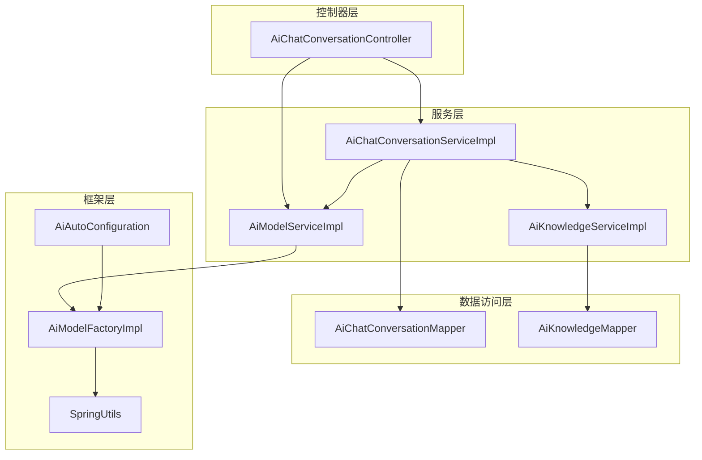
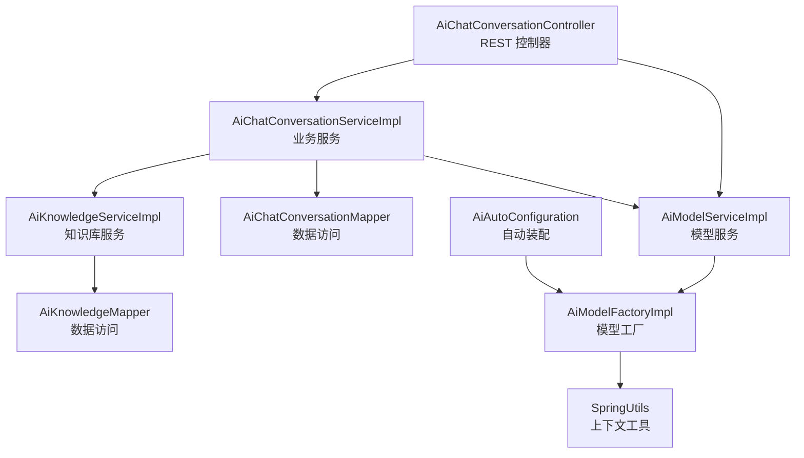
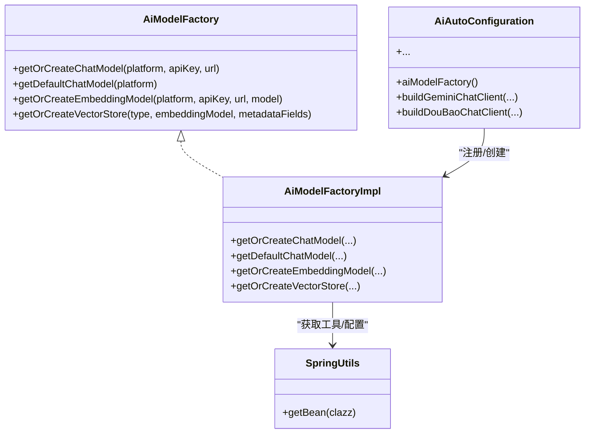
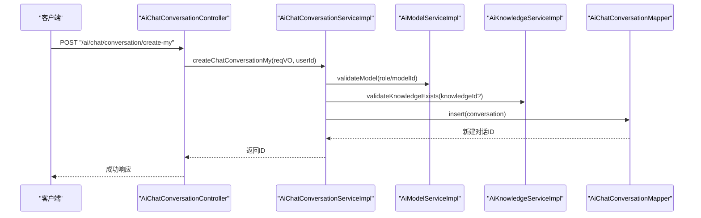
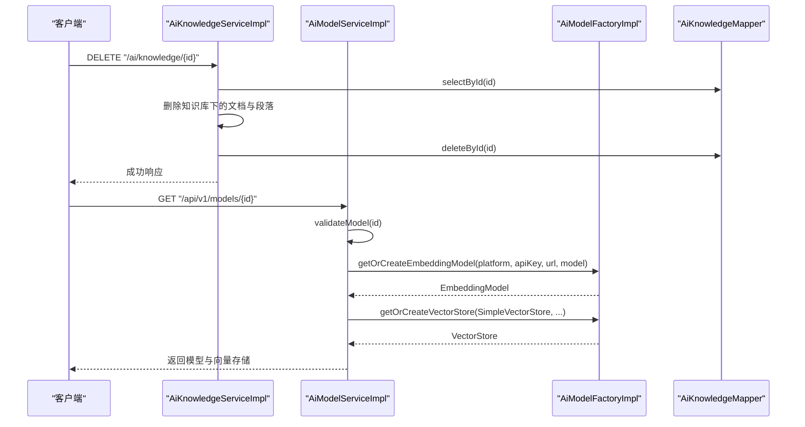
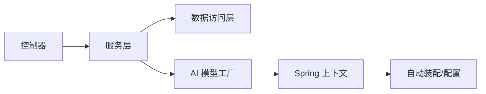

# 组件交互关系

<cite>
**本文引用的文件**
- [AiModelFactory.java](file://src/main/java/cn/boss/data/ai/framework/ai/core/model/AiModelFactory.java)
- [AiModelFactoryImpl.java](file://src/main/java/cn/boss/data/ai/framework/ai/core/model/AiModelFactoryImpl.java)
- [AiAutoConfiguration.java](file://src/main/java/cn/boss/data/ai/framework/ai/config/AiAutoConfiguration.java)
- [SpringUtils.java](file://src/main/java/cn/boss/data/ai/framework/common/util/spring/SpringUtils.java)
- [AiChatConversationController.java](file://src/main/java/cn/boss/data/ai/controller/chat/AiChatConversationController.java)
- [AiChatConversationService.java](file://src/main/java/cn/boss/data/ai/service/chat/AiChatConversationService.java)
- [AiChatConversationServiceImpl.java](file://src/main/java/cn/boss/data/ai/service/chat/AiChatConversationServiceImpl.java)
- [AiChatConversationMapper.java](file://src/main/java/cn/boss/data/ai/dal/mysql/chat/AiChatConversationMapper.java)
- [AiKnowledgeService.java](file://src/main/java/cn/boss/data/ai/service/knowledge/AiKnowledgeService.java)
- [AiKnowledgeServiceImpl.java](file://src/main/java/cn/boss/data/ai/service/knowledge/AiKnowledgeServiceImpl.java)
- [AiKnowledgeMapper.java](file://src/main/java/cn/boss/data/ai/dal/mysql/knowledge/AiKnowledgeMapper.java)
- [AiModelService.java](file://src/main/java/cn/boss/data/ai/service/model/AiModelService.java)
- [AiModelServiceImpl.java](file://src/main/java/cn/boss/data/ai/service/model/AiModelServiceImpl.java)
- [AiWebSearchClient.java](file://src/main/java/cn/boss/data/ai/framework/ai/core/websearch/AiWebSearchClient.java)
- [application.yml](file://src/main/resources/application.yml)
</cite>

## 目录
1. [简介](#简介)
2. [项目结构](#项目结构)
3. [核心组件](#核心组件)
4. [架构总览](#架构总览)
5. [详细组件分析](#详细组件分析)
6. [依赖分析](#依赖分析)
7. [性能考虑](#性能考虑)
8. [故障排查指南](#故障排查指南)
9. [结论](#结论)
10. [附录](#附录)

## 简介
本文件聚焦 Data-AI 项目的组件交互关系，系统性梳理控制器层、服务层、数据访问层以及 AI 模型工厂与知识库服务之间的协作方式与通信机制。重点解释：
- AI 模型工厂如何按平台动态构建 ChatModel/EmbeddingModel/VectorStore，并通过依赖注入在服务层被统一调用；
- 控制器层如何编排服务层与数据访问层，完成聊天对话与知识库的完整业务闭环；
- 组件间通过 Spring 上下文与工具类进行解耦，避免硬编码耦合；
- 提供时序图与交互图，帮助读者快速理解典型业务流程。

## 项目结构
项目采用典型的分层架构：控制器层（Controller）、服务层（Service）、数据访问层（Mapper/DO）与框架层（AI 自动装配、模型工厂、通用工具）。AI 相关能力由框架层统一暴露，服务层通过接口抽象与工厂解耦具体实现。

图表来源
- [AiChatConversationController.java:33-112](file://src/main/java/cn/boss/data/ai/controller/chat/AiChatConversationController.java#L33-L112)
- [AiChatConversationServiceImpl.java:40-161](file://src/main/java/cn/boss/data/ai/service/chat/AiChatConversationServiceImpl.java#L40-L161)
- [AiKnowledgeServiceImpl.java:27-109](file://src/main/java/cn/boss/data/ai/service/knowledge/AiKnowledgeServiceImpl.java#L27-L109)
- [AiModelServiceImpl.java:30-128](file://src/main/java/cn/boss/data/ai/service/model/AiModelServiceImpl.java#L30-L128)
- [AiAutoConfiguration.java:50-285](file://src/main/java/cn/boss/data/ai/framework/ai/config/AiAutoConfiguration.java#L50-L285)
- [AiModelFactoryImpl.java:113-245](file://src/main/java/cn/boss/data/ai/framework/ai/core/model/AiModelFactoryImpl.java#L113-L245)
- [SpringUtils.java:8-34](file://src/main/java/cn/boss/data/ai/framework/common/util/spring/SpringUtils.java#L8-L34)

章节来源
- [AiChatConversationController.java:33-112](file://src/main/java/cn/boss/data/ai/controller/chat/AiChatConversationController.java#L33-L112)
- [AiAutoConfiguration.java:50-285](file://src/main/java/cn/boss/data/ai/framework/ai/config/AiAutoConfiguration.java#L50-L285)

## 核心组件
- AI 模型工厂与自动装配
  - 工厂接口定义统一的 ChatModel/EmbeddingModel/VectorStore 获取与创建能力；
  - 工厂实现根据平台枚举选择具体实现，内部使用单例缓存与 Spring Bean 解耦；
  - 自动装配负责注册工厂与各平台客户端 Bean，并提供工具方法构建客户端。
- 聊天对话服务
  - 负责对话的创建、更新、查询、分页与清理等；
  - 在创建时校验角色与模型，必要时联动知识库校验；
  - 通过 Mapper 完成持久化。
- 知识库服务
  - 负责知识库的创建、更新、删除与分页；
  - 更新时如嵌入模型变更则触发段落重索引异步任务；
  - 删除时先删文档再删知识库，保证依赖完整性。
- 模型服务
  - 将模型配置与 API Key 绑定，对外提供 ChatModel 与 VectorStore 获取；
  - 通过工厂按需创建或复用实例，屏蔽平台差异。

章节来源
- [AiModelFactory.java:13-62](file://src/main/java/cn/boss/data/ai/framework/ai/core/model/AiModelFactory.java#L13-L62)
- [AiModelFactoryImpl.java:113-245](file://src/main/java/cn/boss/data/ai/framework/ai/core/model/AiModelFactoryImpl.java#L113-L245)
- [AiAutoConfiguration.java:50-285](file://src/main/java/cn/boss/data/ai/framework/ai/config/AiAutoConfiguration.java#L50-L285)
- [AiChatConversationService.java:14-34](file://src/main/java/cn/boss/data/ai/service/chat/AiChatConversationService.java#L14-L34)
- [AiChatConversationServiceImpl.java:40-161](file://src/main/java/cn/boss/data/ai/service/chat/AiChatConversationServiceImpl.java#L40-L161)
- [AiKnowledgeService.java:15-70](file://src/main/java/cn/boss/data/ai/service/knowledge/AiKnowledgeService.java#L15-L70)
- [AiKnowledgeServiceImpl.java:27-109](file://src/main/java/cn/boss/data/ai/service/knowledge/AiKnowledgeServiceImpl.java#L27-L109)
- [AiModelService.java:18-43](file://src/main/java/cn/boss/data/ai/service/model/AiModelService.java#L18-L43)
- [AiModelServiceImpl.java:30-128](file://src/main/java/cn/boss/data/ai/service/model/AiModelServiceImpl.java#L30-L128)

## 架构总览
下图展示控制器、服务、数据访问与 AI 框架的整体交互关系，突出依赖注入与解耦设计。

图表来源
- [AiChatConversationController.java:33-112](file://src/main/java/cn/boss/data/ai/controller/chat/AiChatConversationController.java#L33-L112)
- [AiChatConversationServiceImpl.java:40-161](file://src/main/java/cn/boss/data/ai/service/chat/AiChatConversationServiceImpl.java#L40-L161)
- [AiKnowledgeServiceImpl.java:27-109](file://src/main/java/cn/boss/data/ai/service/knowledge/AiKnowledgeServiceImpl.java#L27-L109)
- [AiModelServiceImpl.java:30-128](file://src/main/java/cn/boss/data/ai/service/model/AiModelServiceImpl.java#L30-L128)
- [AiAutoConfiguration.java:50-285](file://src/main/java/cn/boss/data/ai/framework/ai/config/AiAutoConfiguration.java#L50-L285)
- [AiModelFactoryImpl.java:113-245](file://src/main/java/cn/boss/data/ai/framework/ai/core/model/AiModelFactoryImpl.java#L113-L245)
- [SpringUtils.java:8-34](file://src/main/java/cn/boss/data/ai/framework/common/util/spring/SpringUtils.java#L8-L34)

## 详细组件分析

### 组件 A：AI 模型工厂与自动装配
- 设计要点
  - 工厂接口抽象不同平台的 ChatModel/EmbeddingModel/VectorStore 获取与创建；
  - 工厂实现按平台分支，结合缓存单例避免重复创建；
  - 自动装配注册工厂 Bean，并按配置开关创建各平台客户端；
  - 通过 SpringUtils 从上下文获取工具与配置 Bean，降低耦合。
- 依赖注入与生命周期
  - 工厂与客户端由自动装配注册为 Spring Bean；
  - 服务层通过 @Resource 获取工厂实例，按需创建或复用；
  - 工具类 SpringUtils 在容器启动时注入 ApplicationContext，提供静态获取能力。

图表来源
- [AiModelFactory.java:13-62](file://src/main/java/cn/boss/data/ai/framework/ai/core/model/AiModelFactory.java#L13-L62)
- [AiModelFactoryImpl.java:113-245](file://src/main/java/cn/boss/data/ai/framework/ai/core/model/AiModelFactoryImpl.java#L113-L245)
- [AiAutoConfiguration.java:50-285](file://src/main/java/cn/boss/data/ai/framework/ai/config/AiAutoConfiguration.java#L50-L285)
- [SpringUtils.java:8-34](file://src/main/java/cn/boss/data/ai/framework/common/util/spring/SpringUtils.java#L8-L34)

章节来源
- [AiModelFactory.java:13-62](file://src/main/java/cn/boss/data/ai/framework/ai/core/model/AiModelFactory.java#L13-L62)
- [AiModelFactoryImpl.java:113-245](file://src/main/java/cn/boss/data/ai/framework/ai/core/model/AiModelFactoryImpl.java#L113-L245)
- [AiAutoConfiguration.java:50-285](file://src/main/java/cn/boss/data/ai/framework/ai/config/AiAutoConfiguration.java#L50-L285)
- [SpringUtils.java:8-34](file://src/main/java/cn/boss/data/ai/framework/common/util/spring/SpringUtils.java#L8-L34)

### 组件 B：聊天对话服务与控制器
- 控制器职责
  - 提供创建、更新、查询、分页、删除等接口；
  - 与消息服务联动计算消息数量，丰富返回数据；
  - 使用 VO/DO 映射与分页封装。
- 服务层职责
  - 创建对话时解析角色与模型，校验知识库；
  - 更新对话时校验用户权限与模型/知识库有效性；
  - 删除对话支持个人与管理员两种场景；
  - 提供分页查询与未置顶清理能力。

图表来源
- [AiChatConversationController.java:42-78](file://src/main/java/cn/boss/data/ai/controller/chat/AiChatConversationController.java#L42-L78)
- [AiChatConversationServiceImpl.java:52-78](file://src/main/java/cn/boss/data/ai/service/chat/AiChatConversationServiceImpl.java#L52-L78)
- [AiModelServiceImpl.java:110-116](file://src/main/java/cn/boss/data/ai/service/model/AiModelServiceImpl.java#L110-L116)
- [AiKnowledgeServiceImpl.java:90-97](file://src/main/java/cn/boss/data/ai/service/knowledge/AiKnowledgeServiceImpl.java#L90-L97)
- [AiChatConversationMapper.java:16-36](file://src/main/java/cn/boss/data/ai/dal/mysql/chat/AiChatConversationMapper.java#L16-L36)

章节来源
- [AiChatConversationController.java:33-112](file://src/main/java/cn/boss/data/ai/controller/chat/AiChatConversationController.java#L33-L112)
- [AiChatConversationService.java:14-34](file://src/main/java/cn/boss/data/ai/service/chat/AiChatConversationService.java#L14-L34)
- [AiChatConversationServiceImpl.java:40-161](file://src/main/java/cn/boss/data/ai/service/chat/AiChatConversationServiceImpl.java#L40-L161)
- [AiChatConversationMapper.java:16-36](file://src/main/java/cn/boss/data/ai/dal/mysql/chat/AiChatConversationMapper.java#L16-L36)

### 组件 C：知识库服务与模型服务
- 知识库服务
  - 创建/更新时校验嵌入模型并写入；
  - 更新模型时触发段落重索引异步任务；
  - 删除时先删文档再删知识库，保证依赖完整性。
- 模型服务
  - 将模型配置与 API Key 绑定，提供 ChatModel 与 VectorStore 获取；
  - 通过工厂按平台创建实例，屏蔽外部 SDK 差异。

图表来源
- [AiKnowledgeServiceImpl.java:71-83](file://src/main/java/cn/boss/data/ai/service/knowledge/AiKnowledgeServiceImpl.java#L71-L83)
- [AiKnowledgeMapper.java:16-30](file://src/main/java/cn/boss/data/ai/dal/mysql/knowledge/AiKnowledgeMapper.java#L16-L30)
- [AiModelServiceImpl.java:118-126](file://src/main/java/cn/boss/data/ai/service/model/AiModelServiceImpl.java#L118-L126)
- [AiModelFactoryImpl.java:228-245](file://src/main/java/cn/boss/data/ai/framework/ai/core/model/AiModelFactoryImpl.java#L228-L245)

章节来源
- [AiKnowledgeService.java:15-70](file://src/main/java/cn/boss/data/ai/service/knowledge/AiKnowledgeService.java#L15-L70)
- [AiKnowledgeServiceImpl.java:27-109](file://src/main/java/cn/boss/data/ai/service/knowledge/AiKnowledgeServiceImpl.java#L27-L109)
- [AiKnowledgeMapper.java:16-30](file://src/main/java/cn/boss/data/ai/dal/mysql/knowledge/AiKnowledgeMapper.java#L16-L30)
- [AiModelService.java:18-43](file://src/main/java/cn/boss/data/ai/service/model/AiModelService.java#L18-L43)
- [AiModelServiceImpl.java:30-128](file://src/main/java/cn/boss/data/ai/service/model/AiModelServiceImpl.java#L30-L128)
- [AiModelFactoryImpl.java:228-245](file://src/main/java/cn/boss/data/ai/framework/ai/core/model/AiModelFactoryImpl.java#L228-L245)

### 组件 D：网络搜索客户端（扩展）
- 接口抽象
  - 定义统一的网页搜索请求与响应接口，便于接入不同搜索引擎。
- 配置开关
  - 通过自动装配按配置启用/禁用，避免不必要的依赖加载。

章节来源
- [AiWebSearchClient.java:6-16](file://src/main/java/cn/boss/data/ai/framework/ai/core/websearch/AiWebSearchClient.java#L6-L16)
- [AiAutoConfiguration.java:277-283](file://src/main/java/cn/boss/data/ai/framework/ai/config/AiAutoConfiguration.java#L277-L283)

## 依赖分析
- 组件内聚与耦合
  - 控制器仅负责参数接收、映射与调用服务，内聚度高；
  - 服务层通过接口与工厂解耦具体实现，耦合度低；
  - 数据访问层仅关注 SQL 与分页，职责单一。
- 外部依赖与集成点
  - Spring AI 各平台客户端与向量存储；
  - Redis/Qdrant/Milvus 等向量存储；
  - 动态数据源与 MyBatis Plus。
- 可能的循环依赖
  - 当前结构通过接口与工厂避免直接循环依赖；若出现循环，建议引入接口隔离或延迟初始化。

图表来源
- [AiChatConversationController.java:33-112](file://src/main/java/cn/boss/data/ai/controller/chat/AiChatConversationController.java#L33-L112)
- [AiChatConversationServiceImpl.java:40-161](file://src/main/java/cn/boss/data/ai/service/chat/AiChatConversationServiceImpl.java#L40-L161)
- [AiAutoConfiguration.java:50-285](file://src/main/java/cn/boss/data/ai/framework/ai/config/AiAutoConfiguration.java#L50-L285)
- [AiModelFactoryImpl.java:113-245](file://src/main/java/cn/boss/data/ai/framework/ai/core/model/AiModelFactoryImpl.java#L113-L245)

章节来源
- [application.yml:11-16](file://src/main/resources/application.yml#L11-L16)
- [AiAutoConfiguration.java:50-285](file://src/main/java/cn/boss/data/ai/framework/ai/config/AiAutoConfiguration.java#L50-L285)

## 性能考虑
- 工厂缓存与单例
  - 工厂实现使用缓存单例减少重复创建开销，建议合理设置缓存键与失效策略。
- 向量存储选择
  - SimpleVectorStore 适合本地开发与小规模数据；生产环境建议使用 Redis/Qdrant 等高性能向量存储。
- 异步重索引
  - 知识库模型变更触发段落重索引，建议在服务层异步执行并加入队列/批处理策略。
- 连接池与超时
  - 向量存储与外部平台客户端应配置合理的连接池、超时与重试策略，避免阻塞。

## 故障排查指南
- 常见错误定位
  - 对话创建失败：检查角色与模型是否有效，知识库是否存在；
  - 知识库更新失败：确认嵌入模型可用且未被禁用；
  - 向量存储异常：核对 Redis/Qdrant 配置与网络连通性。
- 日志与监控
  - AI 模块日志级别已在配置中设置，可按需调整；
  - 观测与指标可通过自动装配注册的 ObservationRegistry 集成。
- 配置核对
  - 平台启用开关、API Key、Base URL、模型名称等应在配置文件中正确填写。

章节来源
- [AiChatConversationServiceImpl.java:131-137](file://src/main/java/cn/boss/data/ai/service/chat/AiChatConversationServiceImpl.java#L131-L137)
- [AiKnowledgeServiceImpl.java:90-97](file://src/main/java/cn/boss/data/ai/service/knowledge/AiKnowledgeServiceImpl.java#L90-L97)
- [application.yml:58-61](file://src/main/resources/application.yml#L58-L61)
- [AiAutoConfiguration.java:57-61](file://src/main/java/cn/boss/data/ai/framework/ai/config/AiAutoConfiguration.java#L57-L61)

## 结论
本项目通过清晰的分层与接口抽象，实现了控制器、服务、数据访问与 AI 框架的松耦合协作。AI 模型工厂与自动装配承担了平台差异与资源管理的职责，服务层通过接口与工厂解耦具体实现，既保证了可扩展性，也提升了可维护性。建议在生产环境中进一步完善异步任务、缓存策略与可观测性配置，以提升整体性能与稳定性。

## 附录
- 关键流程时序图（对话创建）

图表来源
- [AiChatConversationController.java:42-78](file://src/main/java/cn/boss/data/ai/controller/chat/AiChatConversationController.java#L42-L78)
- [AiChatConversationServiceImpl.java:52-78](file://src/main/java/cn/boss/data/ai/service/chat/AiChatConversationServiceImpl.java#L52-L78)
- [AiModelServiceImpl.java:110-116](file://src/main/java/cn/boss/data/ai/service/model/AiModelServiceImpl.java#L110-L116)
- [AiKnowledgeServiceImpl.java:90-97](file://src/main/java/cn/boss/data/ai/service/knowledge/AiKnowledgeServiceImpl.java#L90-L97)
- [AiChatConversationMapper.java:16-36](file://src/main/java/cn/boss/data/ai/dal/mysql/chat/AiChatConversationMapper.java#L16-L36)