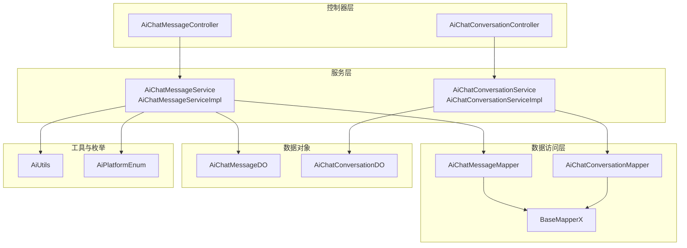
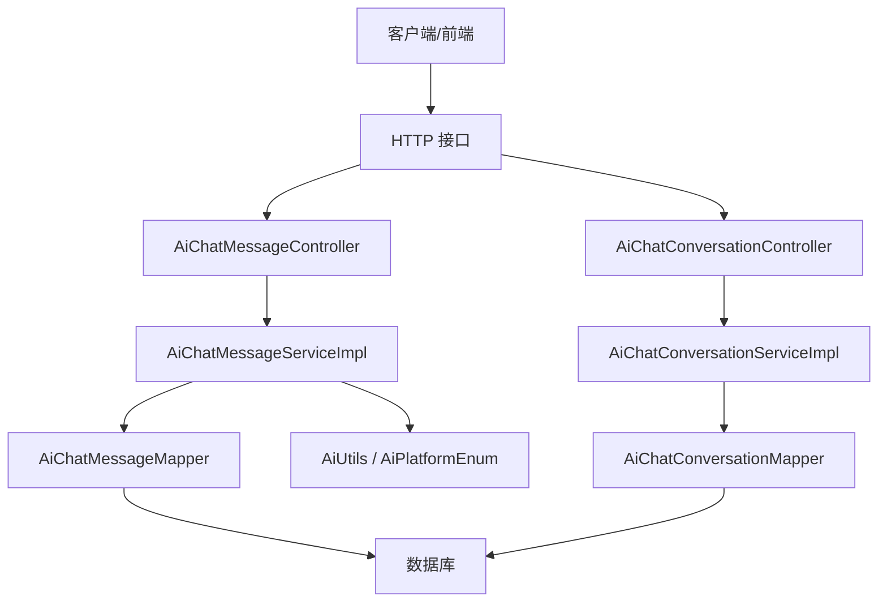
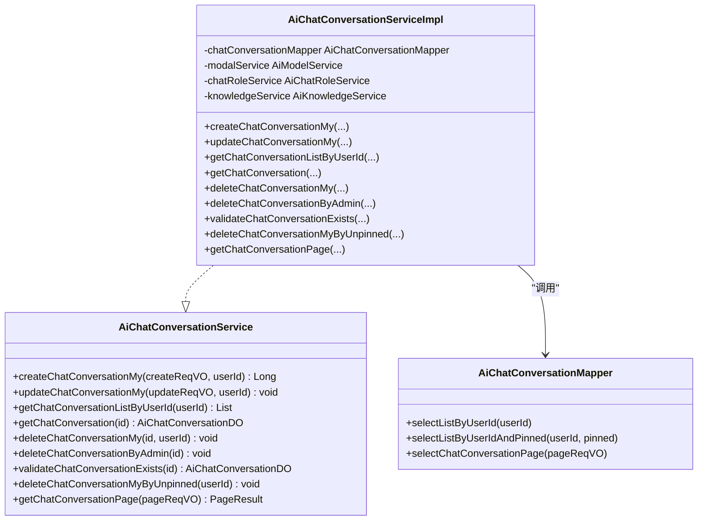
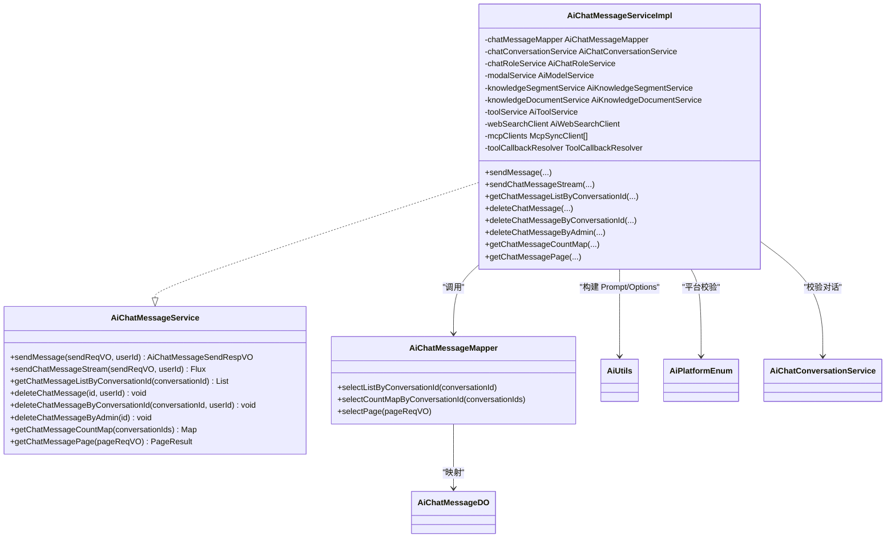
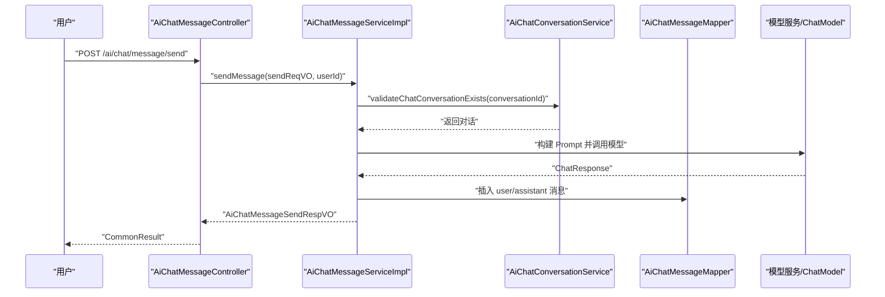
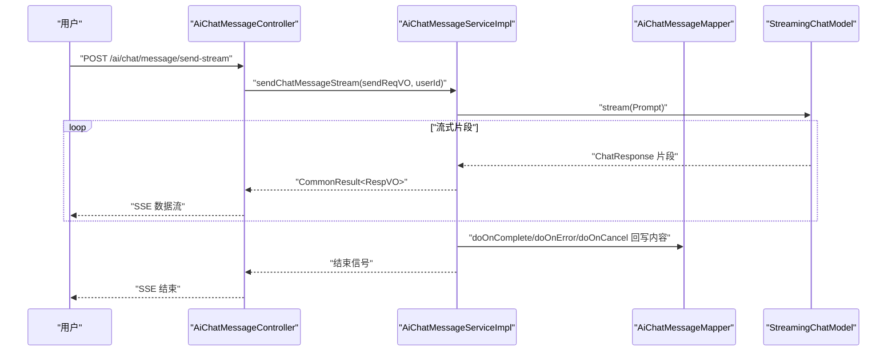
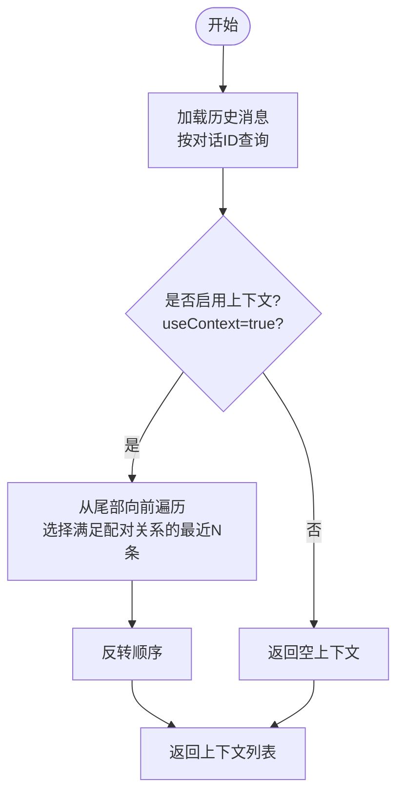
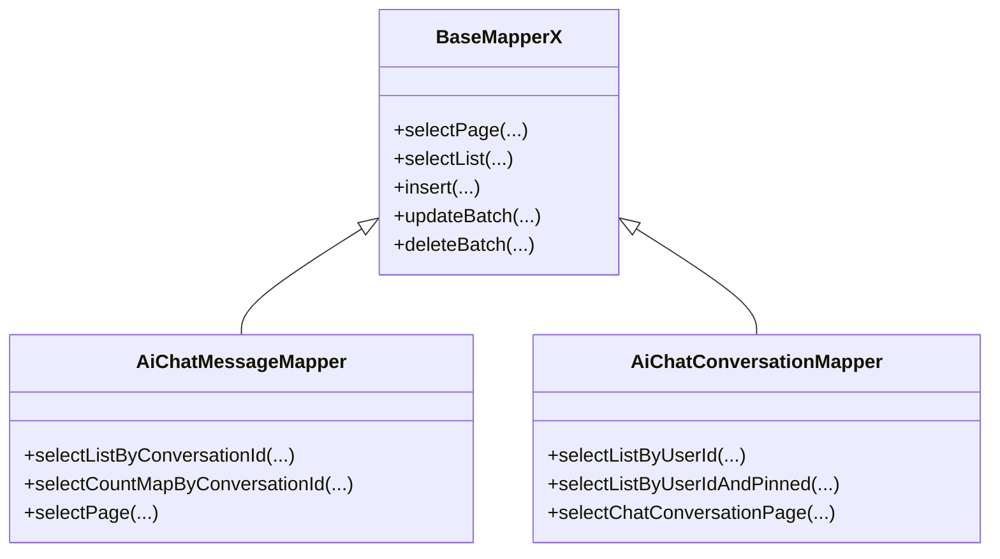
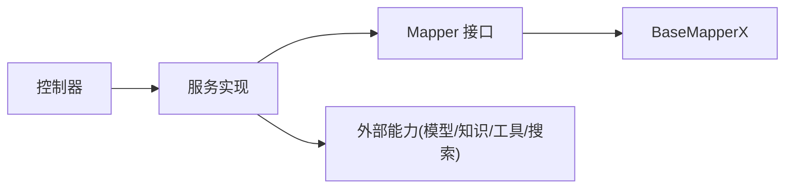

# 聊天服务交互

<cite>
**本文引用的文件**
- [AiChatMessageService.java](file://src/main/java/cn/boss/data/ai/service/chat/AiChatMessageService.java)
- [AiChatMessageServiceImpl.java](file://src/main/java/cn/boss/data/ai/service/chat/AiChatMessageServiceImpl.java)
- [AiChatConversationService.java](file://src/main/java/cn/boss/data/ai/service/chat/AiChatConversationService.java)
- [AiChatConversationServiceImpl.java](file://src/main/java/cn/boss/data/ai/service/chat/AiChatConversationServiceImpl.java)
- [AiChatMessageController.java](file://src/main/java/cn/boss/data/ai/controller/chat/AiChatMessageController.java)
- [AiChatConversationController.java](file://src/main/java/cn/boss/data/ai/controller/chat/AiChatConversationController.java)
- [AiChatMessageMapper.java](file://src/main/java/cn/boss/data/ai/dal/mysql/chat/AiChatMessageMapper.java)
- [AiChatConversationMapper.java](file://src/main/java/cn/boss/data/ai/dal/mysql/chat/AiChatConversationMapper.java)
- [AiChatMessageDO.java](file://src/main/java/cn/boss/data/ai/dal/dataobject/chat/AiChatMessageDO.java)
- [AiChatConversationDO.java](file://src/main/java/cn/boss/data/ai/dal/dataobject/chat/AiChatConversationDO.java)
- [AiChatMessageSendReqVO.java](file://src/main/java/cn/boss/data/ai/controller/chat/vo/message/AiChatMessageSendReqVO.java)
- [AiChatConversationCreateMyReqVO.java](file://src/main/java/cn/boss/data/ai/controller/chat/vo/conversation/AiChatConversationCreateMyReqVO.java)
- [AiUtils.java](file://src/main/java/cn/boss/data/ai/util/AiUtils.java)
- [AiPlatformEnum.java](file://src/main/java/cn/boss/data/ai/enums/model/AiPlatformEnum.java)
- [BaseMapperX.java](file://src/main/java/cn/boss/data/ai/framework/mybatis/core/mapper/BaseMapperX.java)
</cite>

## 目录
1. [简介](#简介)
2. [项目结构](#项目结构)
3. [核心组件](#核心组件)
4. [架构总览](#架构总览)
5. [详细组件分析](#详细组件分析)
6. [依赖分析](#依赖分析)
7. [性能考虑](#性能考虑)
8. [故障排查指南](#故障排查指南)
9. [结论](#结论)
10. [附录](#附录)

## 简介
本文件聚焦于聊天服务模块的组件交互关系，系统性阐述 AiChatMessageService 与 AiChatConversationService 的协作机制，覆盖对话创建、消息发送、历史记录管理的完整流程；解释服务层与数据访问层的交互模式（Mapper 接口调用链路与数据持久化策略）；说明聊天消息的流式响应处理机制与 SSE 连接管理；并提供典型聊天场景的组件交互时序图，展示从用户请求到 AI 响应的完整数据流转过程。

## 项目结构
聊天服务相关代码采用按领域分层组织：
- 控制器层：AiChatMessageController、AiChatConversationController 提供对外 HTTP 接口
- 服务层：AiChatMessageService 及实现、AiChatConversationService 及实现
- 数据访问层：AiChatMessageMapper、AiChatConversationMapper 继承 BaseMapperX
- 数据对象：AiChatMessageDO、AiChatConversationDO
- VO/DTO：AiChatMessageSendReqVO、AiChatConversationCreateMyReqVO
- 工具与枚举：AiUtils、AiPlatformEnum
- 基类映射器：BaseMapperX 提供分页、批量操作等通用能力

图表来源
- [AiChatMessageController.java:44-155](file://src/main/java/cn/boss/data/ai/controller/chat/AiChatMessageController.java#L44-L155)
- [AiChatConversationController.java:33-112](file://src/main/java/cn/boss/data/ai/controller/chat/AiChatConversationController.java#L33-L112)
- [AiChatMessageService.java:18-36](file://src/main/java/cn/boss/data/ai/service/chat/AiChatMessageService.java#L18-L36)
- [AiChatMessageServiceImpl.java:78-505](file://src/main/java/cn/boss/data/ai/service/chat/AiChatMessageServiceImpl.java#L78-L505)
- [AiChatConversationService.java:14-34](file://src/main/java/cn/boss/data/ai/service/chat/AiChatConversationService.java#L14-L34)
- [AiChatConversationServiceImpl.java:40-161](file://src/main/java/cn/boss/data/ai/service/chat/AiChatConversationServiceImpl.java#L40-L161)
- [AiChatMessageMapper.java:22-53](file://src/main/java/cn/boss/data/ai/dal/mysql/chat/AiChatMessageMapper.java#L22-L53)
- [AiChatConversationMapper.java:15-36](file://src/main/java/cn/boss/data/ai/dal/mysql/chat/AiChatConversationMapper.java#L15-L36)
- [BaseMapperX.java:23-178](file://src/main/java/cn/boss/data/ai/framework/mybatis/core/mapper/BaseMapperX.java#L23-L178)
- [AiChatMessageDO.java:26-90](file://src/main/java/cn/boss/data/ai/dal/dataobject/chat/AiChatMessageDO.java#L26-L90)
- [AiChatConversationDO.java:16-58](file://src/main/java/cn/boss/data/ai/dal/dataobject/chat/AiChatConversationDO.java#L16-L58)
- [AiUtils.java:27-127](file://src/main/java/cn/boss/data/ai/util/AiUtils.java#L27-L127)
- [AiPlatformEnum.java:14-70](file://src/main/java/cn/boss/data/ai/enums/model/AiPlatformEnum.java#L14-L70)

章节来源
- [AiChatMessageController.java:44-155](file://src/main/java/cn/boss/data/ai/controller/chat/AiChatMessageController.java#L44-L155)
- [AiChatConversationController.java:33-112](file://src/main/java/cn/boss/data/ai/controller/chat/AiChatConversationController.java#L33-L112)
- [AiChatMessageService.java:18-36](file://src/main/java/cn/boss/data/ai/service/chat/AiChatMessageService.java#L18-L36)
- [AiChatMessageServiceImpl.java:78-505](file://src/main/java/cn/boss/data/ai/service/chat/AiChatMessageServiceImpl.java#L78-L505)
- [AiChatConversationService.java:14-34](file://src/main/java/cn/boss/data/ai/service/chat/AiChatConversationService.java#L14-L34)
- [AiChatConversationServiceImpl.java:40-161](file://src/main/java/cn/boss/data/ai/service/chat/AiChatConversationServiceImpl.java#L40-L161)
- [AiChatMessageMapper.java:22-53](file://src/main/java/cn/boss/data/ai/dal/mysql/chat/AiChatMessageMapper.java#L22-L53)
- [AiChatConversationMapper.java:15-36](file://src/main/java/cn/boss/data/ai/dal/mysql/chat/AiChatConversationMapper.java#L15-L36)
- [BaseMapperX.java:23-178](file://src/main/java/cn/boss/data/ai/framework/mybatis/core/mapper/BaseMapperX.java#L23-L178)
- [AiChatMessageDO.java:26-90](file://src/main/java/cn/boss/data/ai/dal/dataobject/chat/AiChatMessageDO.java#L26-L90)
- [AiChatConversationDO.java:16-58](file://src/main/java/cn/boss/data/ai/dal/dataobject/chat/AiChatConversationDO.java#L16-L58)
- [AiUtils.java:27-127](file://src/main/java/cn/boss/data/ai/util/AiUtils.java#L27-L127)
- [AiPlatformEnum.java:14-70](file://src/main/java/cn/boss/data/ai/enums/model/AiPlatformEnum.java#L14-L70)

## 核心组件
- 控制器层
  - AiChatMessageController：提供消息发送（同步/流式）、历史列表查询、分页、删除等接口
  - AiChatConversationController：提供对话创建、更新、列表、分页、删除等接口
- 服务层
  - AiChatMessageService：定义消息发送、流式发送、历史查询、分页、删除等能力
  - AiChatConversationService：定义对话创建、更新、校验、分页、删除等能力
- 数据访问层
  - AiChatMessageMapper、AiChatConversationMapper：基于 BaseMapperX 提供 CRUD、分页、聚合统计等
- 数据对象
  - AiChatMessageDO、AiChatConversationDO：对应数据库表结构，包含消息、对话、上下文、附件、检索结果等字段
- 工具与枚举
  - AiUtils：构建 Prompt、ChatOptions、解析响应内容
  - AiPlatformEnum：平台枚举及校验

章节来源
- [AiChatMessageController.java:44-155](file://src/main/java/cn/boss/data/ai/controller/chat/AiChatMessageController.java#L44-L155)
- [AiChatConversationController.java:33-112](file://src/main/java/cn/boss/data/ai/controller/chat/AiChatConversationController.java#L33-L112)
- [AiChatMessageService.java:18-36](file://src/main/java/cn/boss/data/ai/service/chat/AiChatMessageService.java#L18-L36)
- [AiChatConversationService.java:14-34](file://src/main/java/cn/boss/data/ai/service/chat/AiChatConversationService.java#L14-L34)
- [AiChatMessageMapper.java:22-53](file://src/main/java/cn/boss/data/ai/dal/mysql/chat/AiChatMessageMapper.java#L22-L53)
- [AiChatConversationMapper.java:15-36](file://src/main/java/cn/boss/data/ai/dal/mysql/chat/AiChatConversationMapper.java#L15-L36)
- [AiChatMessageDO.java:26-90](file://src/main/java/cn/boss/data/ai/dal/dataobject/chat/AiChatMessageDO.java#L26-L90)
- [AiChatConversationDO.java:16-58](file://src/main/java/cn/boss/data/ai/dal/dataobject/chat/AiChatConversationDO.java#L16-L58)
- [AiUtils.java:27-127](file://src/main/java/cn/boss/data/ai/util/AiUtils.java#L27-L127)
- [AiPlatformEnum.java:14-70](file://src/main/java/cn/boss/data/ai/enums/model/AiPlatformEnum.java#L14-L70)

## 架构总览
聊天服务遵循典型的三层架构：
- 表现层：REST 控制器接收请求，返回统一结果包装
- 领域服务：业务编排，协调模型、知识库、工具、搜索等外部能力
- 数据访问：基于 MyBatis Plus 的 Mapper 抽象，提供分页、聚合、批量等能力

图表来源
- [AiChatMessageController.java:44-155](file://src/main/java/cn/boss/data/ai/controller/chat/AiChatMessageController.java#L44-L155)
- [AiChatConversationController.java:33-112](file://src/main/java/cn/boss/data/ai/controller/chat/AiChatConversationController.java#L33-L112)
- [AiChatMessageServiceImpl.java:78-505](file://src/main/java/cn/boss/data/ai/service/chat/AiChatMessageServiceImpl.java#L78-L505)
- [AiChatConversationServiceImpl.java:40-161](file://src/main/java/cn/boss/data/ai/service/chat/AiChatConversationServiceImpl.java#L40-L161)
- [AiChatMessageMapper.java:22-53](file://src/main/java/cn/boss/data/ai/dal/mysql/chat/AiChatMessageMapper.java#L22-L53)
- [AiChatConversationMapper.java:15-36](file://src/main/java/cn/boss/data/ai/dal/mysql/chat/AiChatConversationMapper.java#L15-L36)
- [AiUtils.java:27-127](file://src/main/java/cn/boss/data/ai/util/AiUtils.java#L27-L127)
- [AiPlatformEnum.java:14-70](file://src/main/java/cn/boss/data/ai/enums/model/AiPlatformEnum.java#L14-L70)

## 详细组件分析

### 组件 A：对话创建与校验（AiChatConversationService）
- 职责
  - 创建“我的”对话：根据角色或默认模型初始化对话配置（温度、最大令牌、上下文数等），并持久化
  - 更新对话：支持模型切换、置顶时间、知识库校验等
  - 校验对话存在性与归属
  - 分页与列表查询
- 关键交互
  - 依赖模型服务校验模型可用性与参数完整性
  - 依赖知识服务校验知识库存在性
  - 依赖 Mapper 完成持久化与查询

图表来源
- [AiChatConversationService.java:14-34](file://src/main/java/cn/boss/data/ai/service/chat/AiChatConversationService.java#L14-L34)
- [AiChatConversationServiceImpl.java:40-161](file://src/main/java/cn/boss/data/ai/service/chat/AiChatConversationServiceImpl.java#L40-L161)
- [AiChatConversationMapper.java:15-36](file://src/main/java/cn/boss/data/ai/dal/mysql/chat/AiChatConversationMapper.java#L15-L36)

章节来源
- [AiChatConversationService.java:14-34](file://src/main/java/cn/boss/data/ai/service/chat/AiChatConversationService.java#L14-L34)
- [AiChatConversationServiceImpl.java:40-161](file://src/main/java/cn/boss/data/ai/service/chat/AiChatConversationServiceImpl.java#L40-L161)
- [AiChatConversationMapper.java:15-36](file://src/main/java/cn/boss/data/ai/dal/mysql/chat/AiChatConversationMapper.java#L15-L36)

### 组件 B：消息发送与历史管理（AiChatMessageService）
- 职责
  - 同步发送：构建 Prompt，调用模型，回写助手消息内容，返回完整响应
  - 流式发送：构建 Prompt，调用模型流式接口，逐片返回，完成后回写内容
  - 历史管理：按对话查询、分页、删除（单条/整会话/管理员）
  - 上下文过滤：根据配置截取最近 N 条问答对
  - 附件处理：图片 Base64、非图片文本读取，注入到 Prompt
  - 知识库与联网搜索：召回段落与网页，注入到 Prompt
- 关键交互
  - 依赖对话服务校验对话存在与归属
  - 依赖模型服务获取 ChatModel/StreamingChatModel 与参数
  - 依赖知识服务执行段落检索与文档读取
  - 依赖 Mapper 完成消息持久化与查询
  - 依赖 AiUtils 构建 Prompt 与 ChatOptions，解析响应

图表来源
- [AiChatMessageService.java:18-36](file://src/main/java/cn/boss/data/ai/service/chat/AiChatMessageService.java#L18-L36)
- [AiChatMessageServiceImpl.java:78-505](file://src/main/java/cn/boss/data/ai/service/chat/AiChatMessageServiceImpl.java#L78-L505)
- [AiChatMessageMapper.java:22-53](file://src/main/java/cn/boss/data/ai/dal/mysql/chat/AiChatMessageMapper.java#L22-L53)
- [AiChatMessageDO.java:26-90](file://src/main/java/cn/boss/data/ai/dal/dataobject/chat/AiChatMessageDO.java#L26-L90)
- [AiUtils.java:27-127](file://src/main/java/cn/boss/data/ai/util/AiUtils.java#L27-L127)
- [AiPlatformEnum.java:14-70](file://src/main/java/cn/boss/data/ai/enums/model/AiPlatformEnum.java#L14-L70)

章节来源
- [AiChatMessageService.java:18-36](file://src/main/java/cn/boss/data/ai/service/chat/AiChatMessageService.java#L18-L36)
- [AiChatMessageServiceImpl.java:78-505](file://src/main/java/cn/boss/data/ai/service/chat/AiChatMessageServiceImpl.java#L78-L505)
- [AiChatMessageMapper.java:22-53](file://src/main/java/cn/boss/data/ai/dal/mysql/chat/AiChatMessageMapper.java#L22-L53)
- [AiChatMessageDO.java:26-90](file://src/main/java/cn/boss/data/ai/dal/dataobject/chat/AiChatMessageDO.java#L26-L90)
- [AiUtils.java:27-127](file://src/main/java/cn/boss/data/ai/util/AiUtils.java#L27-L127)
- [AiPlatformEnum.java:14-70](file://src/main/java/cn/boss/data/ai/enums/model/AiPlatformEnum.java#L14-L70)

### 组件 C：控制器层（请求入口与响应封装）
- AiChatMessageController
  - /ai/chat/message/send：POST，同步发送
  - /ai/chat/message/send-stream：POST，SSE 流式发送
  - /ai/chat/message/list-by-conversation-id：GET，按对话查询历史并拼接知识库段落
  - /ai/chat/message/delete、/ai/chat/message/delete-by-conversation-id、/ai/chat/message/delete-by-admin：删除消息
  - /ai/chat/message/page：分页查询消息并拼接角色名称
- AiChatConversationController
  - /ai/chat/conversation/create-my、/ai/chat/conversation/update-my、/ai/chat/conversation/my-list、/ai/chat/conversation/get-my、/ai/chat/conversation/delete-my、/ai/chat/conversation/delete-by-unpinned：对话 CRUD 与分页
  - /ai/chat/conversation/page：分页查询并拼接消息数量

图表来源
- [AiChatMessageController.java:61-62](file://src/main/java/cn/boss/data/ai/controller/chat/AiChatMessageController.java#L61-L62)
- [AiChatMessageServiceImpl.java:127-180](file://src/main/java/cn/boss/data/ai/service/chat/AiChatMessageServiceImpl.java#L127-L180)
- [AiChatConversationService.java:28-28](file://src/main/java/cn/boss/data/ai/service/chat/AiChatConversationService.java#L28-L28)
- [AiChatMessageMapper.java:25-29](file://src/main/java/cn/boss/data/ai/dal/mysql/chat/AiChatMessageMapper.java#L25-L29)

章节来源
- [AiChatMessageController.java:44-155](file://src/main/java/cn/boss/data/ai/controller/chat/AiChatMessageController.java#L44-L155)
- [AiChatMessageServiceImpl.java:127-180](file://src/main/java/cn/boss/data/ai/service/chat/AiChatMessageServiceImpl.java#L127-L180)
- [AiChatConversationService.java:28-28](file://src/main/java/cn/boss/data/ai/service/chat/AiChatConversationService.java#L28-L28)
- [AiChatMessageMapper.java:25-29](file://src/main/java/cn/boss/data/ai/dal/mysql/chat/AiChatMessageMapper.java#L25-L29)

### 组件 D：流式响应与 SSE 连接管理
- 流式发送流程
  - 校验对话与模型
  - 执行知识库召回与联网搜索
  - 插入 user/assistant 消息占位
  - 构建 Prompt 并调用模型流式接口
  - 逐片返回响应，首次附加知识库与搜索结果
  - 完成/取消/错误时回写最终内容或清理占位消息
- SSE 连接管理
  - 控制器以 TEXT_EVENT_STREAM 返回 Flux
  - 客户端侧需正确处理连接中断、重连与错误码

图表来源
- [AiChatMessageController.java:66-69](file://src/main/java/cn/boss/data/ai/controller/chat/AiChatMessageController.java#L66-L69)
- [AiChatMessageServiceImpl.java:182-276](file://src/main/java/cn/boss/data/ai/service/chat/AiChatMessageServiceImpl.java#L182-L276)
- [AiChatMessageMapper.java:25-29](file://src/main/java/cn/boss/data/ai/dal/mysql/chat/AiChatMessageMapper.java#L25-L29)

章节来源
- [AiChatMessageController.java:66-69](file://src/main/java/cn/boss/data/ai/controller/chat/AiChatMessageController.java#L66-L69)
- [AiChatMessageServiceImpl.java:182-276](file://src/main/java/cn/boss/data/ai/service/chat/AiChatMessageServiceImpl.java#L182-L276)
- [AiChatMessageMapper.java:25-29](file://src/main/java/cn/boss/data/ai/dal/mysql/chat/AiChatMessageMapper.java#L25-L29)

### 组件 E：历史记录管理与上下文过滤
- 历史查询
  - 按对话 ID 查询所有消息，按主键升序排列
  - 支持分页查询与聚合统计（按对话计数）
- 上下文过滤
  - 根据配置与“useContext”标志，从历史中筛选最近的问答对，保证 assistant-replyId-user 的配对关系
- 删除策略
  - 用户删除：校验归属后删除
  - 管理员删除：直接删除
  - 清理未置顶对话：批量删除

图表来源
- [AiChatMessageServiceImpl.java:384-410](file://src/main/java/cn/boss/data/ai/service/chat/AiChatMessageServiceImpl.java#L384-L410)
- [AiChatMessageMapper.java:25-29](file://src/main/java/cn/boss/data/ai/dal/mysql/chat/AiChatMessageMapper.java#L25-L29)

章节来源
- [AiChatMessageServiceImpl.java:384-410](file://src/main/java/cn/boss/data/ai/service/chat/AiChatMessageServiceImpl.java#L384-L410)
- [AiChatMessageMapper.java:25-29](file://src/main/java/cn/boss/data/ai/dal/mysql/chat/AiChatMessageMapper.java#L25-L29)

### 组件 F：数据持久化策略与 Mapper 调用链
- Mapper 抽象
  - BaseMapperX 提供分页、批量保存/更新、条件查询等通用能力
- 典型调用链
  - 创建对话：构造 AiChatConversationDO → Mapper.insert → 返回主键
  - 发送消息：构造 AiChatMessageDO（user/assistant）→ Mapper.insert → 完成后回写 assistant.content
  - 查询历史：Mapper.selectListByConversationId → 按 ID 升序
  - 分页：Mapper.selectPage → BaseMapperX.selectPage → MyBatis 分页
  - 聚合统计：Mapper.selectCountMapByConversationId → GROUP BY 聚合
- 数据对象字段要点
  - AiChatMessageDO：content、reasoningContent、segmentIds、webSearchPages、attachmentUrls、useContext
  - AiChatConversationDO：title、pinned、roleId、modelId/model、systemMessage、temperature、maxTokens、maxContexts

图表来源
- [BaseMapperX.java:23-178](file://src/main/java/cn/boss/data/ai/framework/mybatis/core/mapper/BaseMapperX.java#L23-L178)
- [AiChatMessageMapper.java:22-53](file://src/main/java/cn/boss/data/ai/dal/mysql/chat/AiChatMessageMapper.java#L22-L53)
- [AiChatConversationMapper.java:15-36](file://src/main/java/cn/boss/data/ai/dal/mysql/chat/AiChatConversationMapper.java#L15-L36)

章节来源
- [BaseMapperX.java:23-178](file://src/main/java/cn/boss/data/ai/framework/mybatis/core/mapper/BaseMapperX.java#L23-L178)
- [AiChatMessageMapper.java:22-53](file://src/main/java/cn/boss/data/ai/dal/mysql/chat/AiChatMessageMapper.java#L22-L53)
- [AiChatConversationMapper.java:15-36](file://src/main/java/cn/boss/data/ai/dal/mysql/chat/AiChatConversationMapper.java#L15-L36)
- [AiChatMessageDO.java:26-90](file://src/main/java/cn/boss/data/ai/dal/dataobject/chat/AiChatMessageDO.java#L26-L90)
- [AiChatConversationDO.java:16-58](file://src/main/java/cn/boss/data/ai/dal/dataobject/chat/AiChatConversationDO.java#L16-L58)

## 依赖分析
- 组件耦合
  - 控制器仅依赖服务接口，低耦合
  - 服务实现依赖 Mapper 接口与外部服务（模型、知识、工具、搜索）
  - Mapper 依赖 BaseMapperX 与 MyBatis Plus
- 外部依赖
  - Spring AI ChatModel/StreamingChatModel：用于调用不同平台模型
  - AiUtils/AiPlatformEnum：统一构建 ChatOptions 与消息类型
  - 知识库/工具/搜索：可选集成，通过服务层解耦

图表来源
- [AiChatMessageController.java:44-155](file://src/main/java/cn/boss/data/ai/controller/chat/AiChatMessageController.java#L44-L155)
- [AiChatConversationController.java:33-112](file://src/main/java/cn/boss/data/ai/controller/chat/AiChatConversationController.java#L33-L112)
- [AiChatMessageServiceImpl.java:78-505](file://src/main/java/cn/boss/data/ai/service/chat/AiChatMessageServiceImpl.java#L78-L505)
- [AiChatConversationServiceImpl.java:40-161](file://src/main/java/cn/boss/data/ai/service/chat/AiChatConversationServiceImpl.java#L40-L161)
- [AiChatMessageMapper.java:22-53](file://src/main/java/cn/boss/data/ai/dal/mysql/chat/AiChatMessageMapper.java#L22-L53)
- [AiChatConversationMapper.java:15-36](file://src/main/java/cn/boss/data/ai/dal/mysql/chat/AiChatConversationMapper.java#L15-L36)
- [BaseMapperX.java:23-178](file://src/main/java/cn/boss/data/ai/framework/mybatis/core/mapper/BaseMapperX.java#L23-L178)

章节来源
- [AiChatMessageController.java:44-155](file://src/main/java/cn/boss/data/ai/controller/chat/AiChatMessageController.java#L44-L155)
- [AiChatConversationController.java:33-112](file://src/main/java/cn/boss/data/ai/controller/chat/AiChatConversationController.java#L33-L112)
- [AiChatMessageServiceImpl.java:78-505](file://src/main/java/cn/boss/data/ai/service/chat/AiChatMessageServiceImpl.java#L78-L505)
- [AiChatConversationServiceImpl.java:40-161](file://src/main/java/cn/boss/data/ai/service/chat/AiChatConversationServiceImpl.java#L40-L161)
- [AiChatMessageMapper.java:22-53](file://src/main/java/cn/boss/data/ai/dal/mysql/chat/AiChatMessageMapper.java#L22-L53)
- [AiChatConversationMapper.java:15-36](file://src/main/java/cn/boss/data/ai/dal/mysql/chat/AiChatConversationMapper.java#L15-L36)
- [BaseMapperX.java:23-178](file://src/main/java/cn/boss/data/ai/framework/mybatis/core/mapper/BaseMapperX.java#L23-L178)

## 性能考虑
- 流式响应
  - 使用 Reactor Flux 将模型输出片段实时推送，降低首字节延迟
  - 首次片段附加知识库与搜索结果，避免重复计算
- 分页与聚合
  - 分页查询与按对话计数使用 GROUP BY，减少应用层聚合开销
- 批量操作
  - Mapper 提供批量插入/更新，适合高并发场景
- 缓存与去重
  - 首次流式返回时缓存知识库段落与搜索页面，避免后续重复查询

## 故障排查指南
- 对话不存在或越权
  - 现象：抛出“对话不存在”异常
  - 排查：确认 conversationId 是否正确，用户 ID 是否匹配
- 模型参数不完整
  - 现象：创建对话时报模型参数错误
  - 排查：检查模型温度、最大令牌、上下文数是否配置完整
- 流式发送异常
  - 现象：客户端收到错误码或连接中断
  - 排查：查看服务端日志，确认模型流式接口可用性与网络状况；确保 doOnError/doOnCancel 分支正确回写内容
- 附件读取失败
  - 现象：附件内容为空
  - 排查：检查附件 URL 可达性与类型判断逻辑

章节来源
- [AiChatConversationServiceImpl.java:131-137](file://src/main/java/cn/boss/data/ai/service/chat/AiChatConversationServiceImpl.java#L131-L137)
- [AiChatMessageServiceImpl.java:127-133](file://src/main/java/cn/boss/data/ai/service/chat/AiChatMessageServiceImpl.java#L127-L133)
- [AiChatMessageServiceImpl.java:259-275](file://src/main/java/cn/boss/data/ai/service/chat/AiChatMessageServiceImpl.java#L259-L275)
- [AiChatMessageServiceImpl.java:412-442](file://src/main/java/cn/boss/data/ai/service/chat/AiChatMessageServiceImpl.java#L412-L442)

## 结论
本聊天服务模块通过清晰的分层设计与接口抽象，实现了对话与消息的完整生命周期管理。AiChatMessageService 与 AiChatConversationService 协同完成对话创建、消息发送（同步/流式）、历史记录管理与上下文过滤；服务层与数据访问层通过 Mapper 接口解耦，结合 BaseMapperX 提供的通用能力，形成稳定的数据持久化策略。流式响应与 SSE 连接管理提升了用户体验，配合完善的异常处理与性能优化建议，可在生产环境中可靠运行。

## 附录
- 请求体示例
  - 发送消息请求体：AiChatMessageSendReqVO
  - 创建对话请求体：AiChatConversationCreateMyReqVO
- 关键路径参考
  - 同步发送：[AiChatMessageController.java:61-62](file://src/main/java/cn/boss/data/ai/controller/chat/AiChatMessageController.java#L61-L62) → [AiChatMessageServiceImpl.java:127-180](file://src/main/java/cn/boss/data/ai/service/chat/AiChatMessageServiceImpl.java#L127-L180)
  - 流式发送：[AiChatMessageController.java:66-69](file://src/main/java/cn/boss/data/ai/controller/chat/AiChatMessageController.java#L66-L69) → [AiChatMessageServiceImpl.java:182-276](file://src/main/java/cn/boss/data/ai/service/chat/AiChatMessageServiceImpl.java#L182-L276)
  - 对话创建：[AiChatConversationController.java:44-45](file://src/main/java/cn/boss/data/ai/controller/chat/AiChatConversationController.java#L44-L45) → [AiChatConversationServiceImpl.java:53-78](file://src/main/java/cn/boss/data/ai/service/chat/AiChatConversationServiceImpl.java#L53-L78)
  - 历史查询：[AiChatMessageController.java:74-112](file://src/main/java/cn/boss/data/ai/controller/chat/AiChatMessageController.java#L74-L112) → [AiChatMessageMapper.java:25-29](file://src/main/java/cn/boss/data/ai/dal/mysql/chat/AiChatMessageMapper.java#L25-L29)