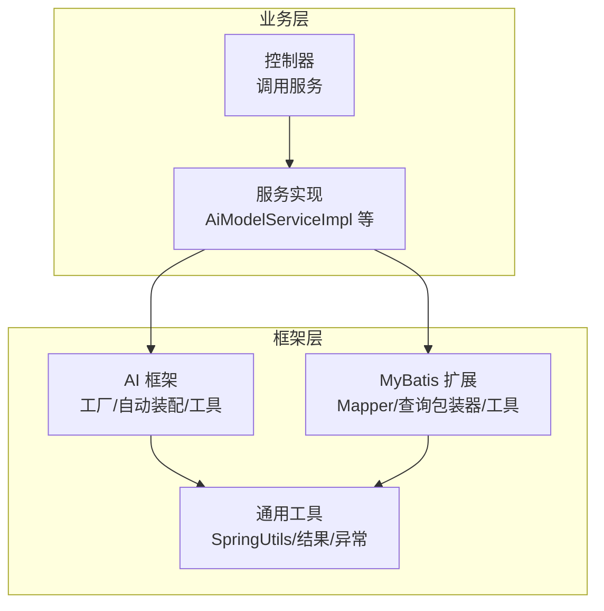
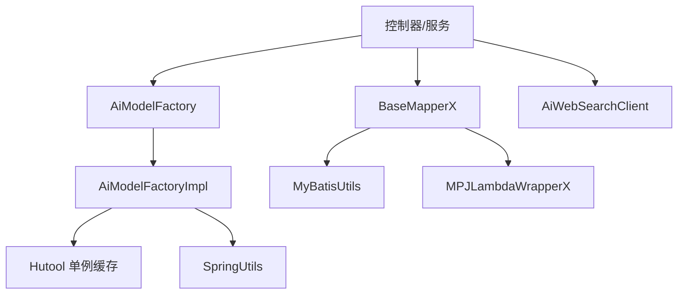
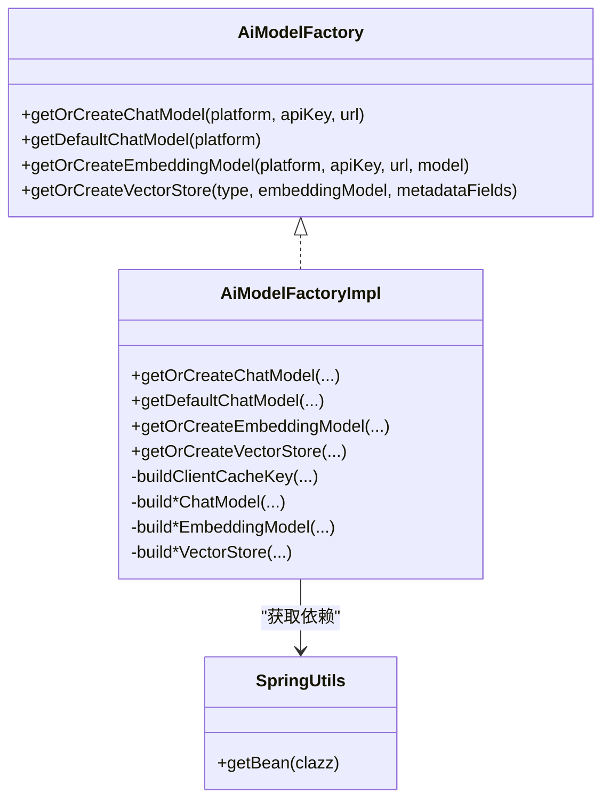
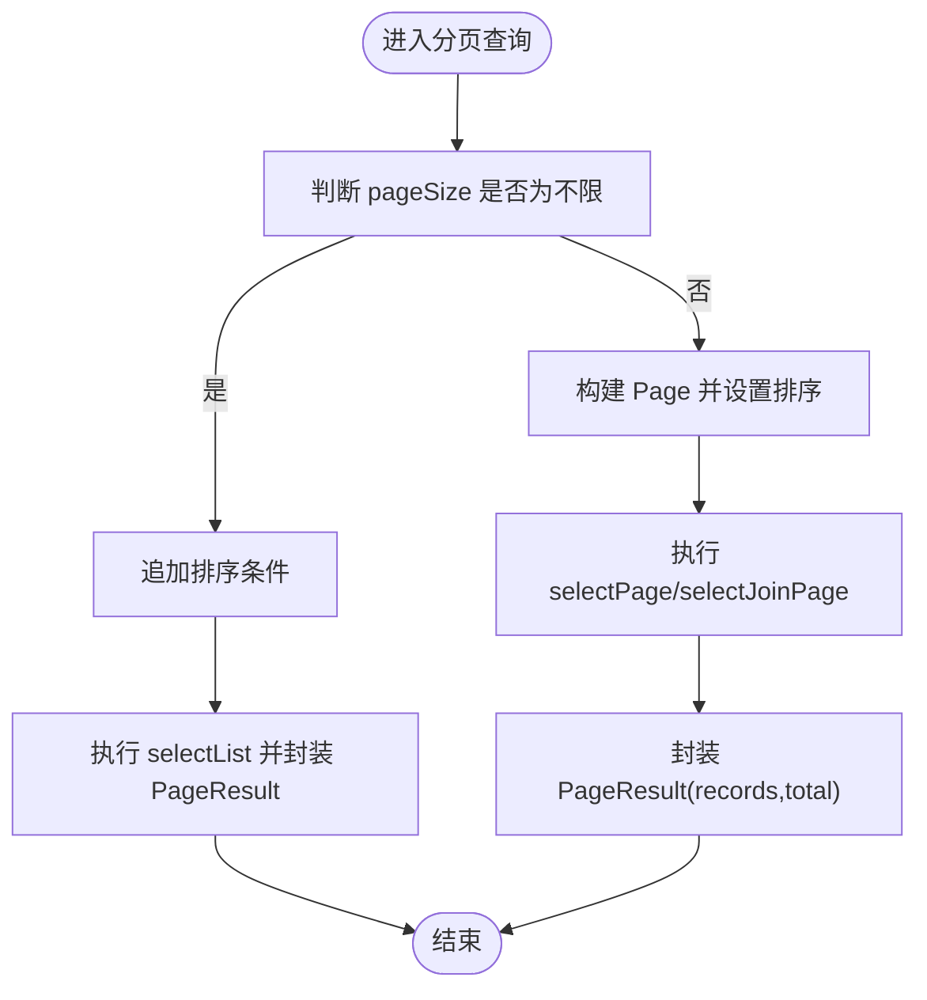
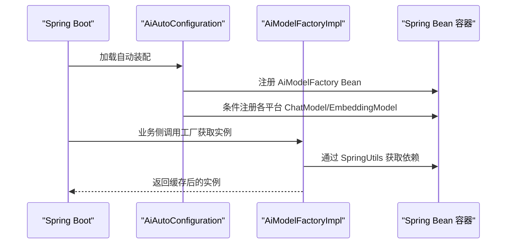
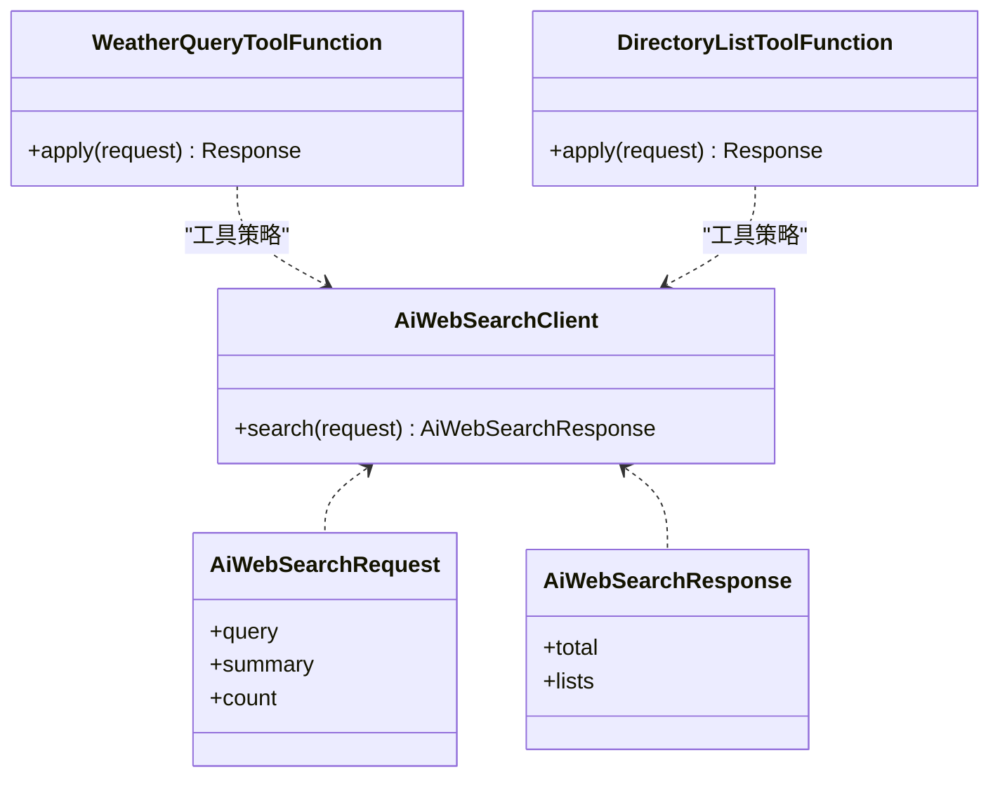
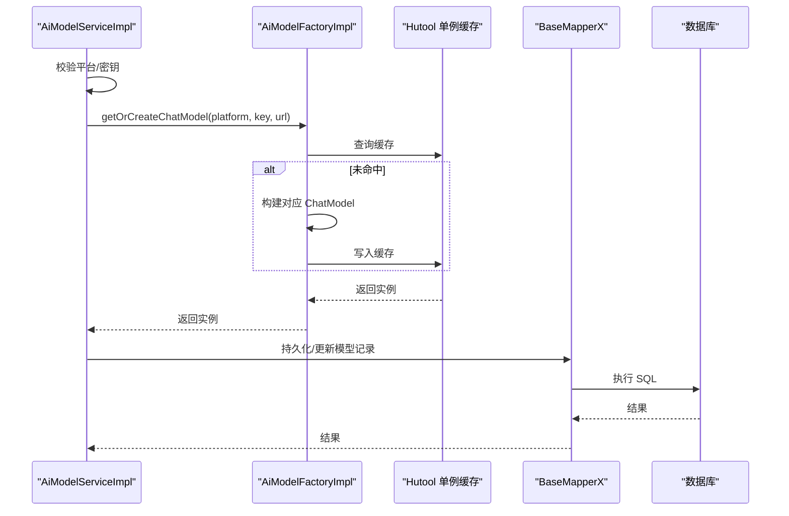
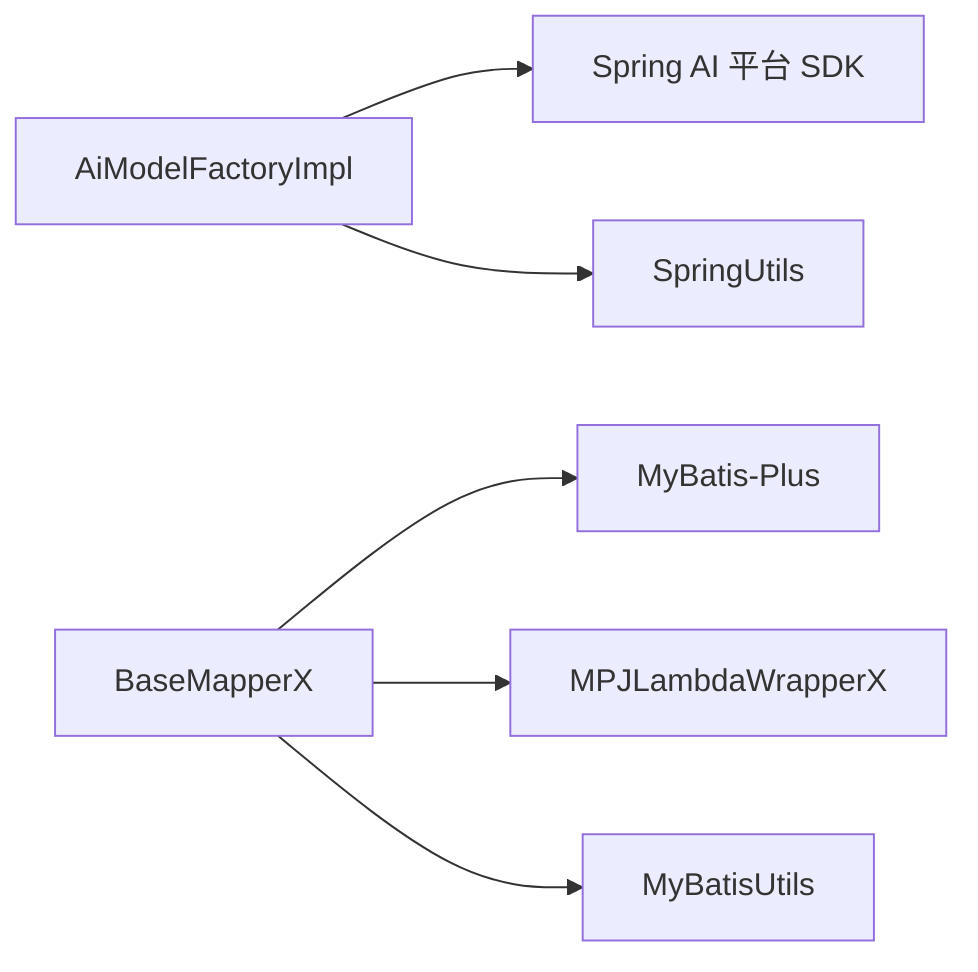

# 设计模式应用

<cite>
**本文引用的文件**
- [AiModelFactory.java](file://src/main/java/cn/boss/data/ai/framework/ai/core/model/AiModelFactory.java)
- [AiModelFactoryImpl.java](file://src/main/java/cn/boss/data/ai/framework/ai/core/model/AiModelFactoryImpl.java)
- [BaseMapperX.java](file://src/main/java/cn/boss/data/ai/framework/mybatis/core/mapper/BaseMapperX.java)
- [MyBatisUtils.java](file://src/main/java/cn/boss/data/ai/framework/mybatis/core/util/MyBatisUtils.java)
- [MPJLambdaWrapperX.java](file://src/main/java/cn/boss/data/ai/framework/mybatis/core/query/MPJLambdaWrapperX.java)
- [AiAutoConfiguration.java](file://src/main/java/cn/boss/data/ai/framework/ai/config/AiAutoConfiguration.java)
- [SpringUtils.java](file://src/main/java/cn/boss/data/ai/framework/common/util/spring/SpringUtils.java)
- [AiWebSearchClient.java](file://src/main/java/cn/boss/data/ai/framework/ai/core/websearch/AiWebSearchClient.java)
- [AiWebSearchRequest.java](file://src/main/java/cn/boss/data/ai/framework/ai/core/websearch/AiWebSearchRequest.java)
- [AiWebSearchResponse.java](file://src/main/java/cn/boss/data/ai/framework/ai/core/websearch/AiWebSearchResponse.java)
- [WeatherQueryToolFunction.java](file://src/main/java/cn/boss/data/ai/tool/function/WeatherQueryToolFunction.java)
- [DirectoryListToolFunction.java](file://src/main/java/cn/boss/data/ai/tool/function/DirectoryListToolFunction.java)
- [AiModelServiceImpl.java](file://src/main/java/cn/boss/data/ai/service/model/AiModelServiceImpl.java)
</cite>

## 目录
1. [引言](#引言)
2. [项目结构](#项目结构)
3. [核心组件](#核心组件)
4. [架构总览](#架构总览)
5. [详细组件分析](#详细组件分析)
6. [依赖分析](#依赖分析)
7. [性能考虑](#性能考虑)
8. [故障排查指南](#故障排查指南)
9. [结论](#结论)
10. [附录](#附录)

## 引言
本文件聚焦 Data-AI 项目中设计模式的应用与实践，系统梳理并深入解析以下模式在项目中的落地方式与价值：
- 工厂模式：AiModelFactory/AiModelFactoryImpl 统一构建与缓存各类 AI 客户端与向量库实例
- 模板方法模式：BaseMapperX 提供分页查询与批量操作的统一流程骨架
- 单例模式：通过 Hutool 单例容器对 AI 客户端与向量库进行缓存复用
- 策略模式：AiAutoConfiguration 中基于条件装配的多种 AI 平台与工具策略
- 简单工厂与外观模式：AiModelFactoryImpl 将复杂客户端创建封装为统一入口
- 可选的策略模式：AiWebSearchClient 接口定义网络搜索策略扩展点

这些模式协同提升了系统的可维护性、可扩展性与运行时性能。

## 项目结构
围绕“框架层”与“业务层”的分层组织，设计模式主要分布在如下模块：
- 框架层（framework）
  - ai：AI 模型工厂、自动装配、Web 搜索、工具函数
  - mybatis：通用 Mapper 接口、查询包装器、工具类
  - common：Spring 上下文工具、通用结果与异常
- 业务层（service/controller/dal）
  - 服务实现通过注入工厂与工具类完成具体业务逻辑

[本图为概念性结构示意，不直接映射具体源码文件，故不提供图示来源]

## 核心组件
- 工厂与自动装配
  - AiModelFactory/AiModelFactoryImpl：统一创建与缓存 ChatModel/EmbeddingModel/VectorStore
  - AiAutoConfiguration：按条件装配各平台客户端与观察统计组件
  - SpringUtils：静态访问 ApplicationContext 获取 Bean
- MyBatis 扩展
  - BaseMapperX：定义分页、连接分页、批量插入/更新、条件查询等统一接口
  - MyBatisUtils：构建分页、排序、拦截器管理
  - MPJLambdaWrapperX：增强条件构造器，支持“存在即拼接”等便捷方法
- 策略与工具
  - AiWebSearchClient/AiWebSearchRequest/AiWebSearchResponse：网络搜索策略接口与数据载体
  - WeatherQueryToolFunction/DirectoryListToolFunction：工具函数作为策略执行体

**章节来源**
- [AiModelFactory.java:1-63](file://src/main/java/cn/boss/data/ai/framework/ai/core/model/AiModelFactory.java#L1-L63)
- [AiModelFactoryImpl.java:110-567](file://src/main/java/cn/boss/data/ai/framework/ai/core/model/AiModelFactoryImpl.java#L110-L567)
- [AiAutoConfiguration.java:48-285](file://src/main/java/cn/boss/data/ai/framework/ai/config/AiAutoConfiguration.java#L48-L285)
- [SpringUtils.java:1-35](file://src/main/java/cn/boss/data/ai/framework/common/util/spring/SpringUtils.java#L1-L35)
- [BaseMapperX.java:1-179](file://src/main/java/cn/boss/data/ai/framework/mybatis/core/mapper/BaseMapperX.java#L1-L179)
- [MyBatisUtils.java:1-90](file://src/main/java/cn/boss/data/ai/framework/mybatis/core/util/MyBatisUtils.java#L1-L90)
- [MPJLambdaWrapperX.java:1-265](file://src/main/java/cn/boss/data/ai/framework/mybatis/core/query/MPJLambdaWrapperX.java#L1-L265)
- [AiWebSearchClient.java:1-17](file://src/main/java/cn/boss/data/ai/framework/ai/core/websearch/AiWebSearchClient.java#L1-L17)
- [AiWebSearchRequest.java:1-32](file://src/main/java/cn/boss/data/ai/framework/ai/core/websearch/AiWebSearchRequest.java#L1-L32)
- [AiWebSearchResponse.java:1-36](file://src/main/java/cn/boss/data/ai/framework/ai/core/websearch/AiWebSearchResponse.java#L1-L36)
- [WeatherQueryToolFunction.java:1-80](file://src/main/java/cn/boss/data/ai/tool/function/WeatherQueryToolFunction.java#L1-L80)
- [DirectoryListToolFunction.java:1-75](file://src/main/java/cn/boss/data/ai/tool/function/DirectoryListToolFunction.java#L1-L75)

## 架构总览
从“统一入口 + 条件策略 + 缓存复用”的角度，系统形成如下协作关系：
- 控制器/服务通过注入 AiModelFactory 获取所需 AI 客户端或向量库
- AiAutoConfiguration 在启动阶段按配置启用不同平台策略
- SpringUtils 提供静态 Bean 访问，简化工厂内部获取依赖
- BaseMapperX/MyBatisUtils/MPJLambdaWrapperX 提供稳定的数据库访问骨架与便利能力

**图示来源**
- [AiModelFactory.java:13-61](file://src/main/java/cn/boss/data/ai/framework/ai/core/model/AiModelFactory.java#L13-L61)
- [AiModelFactoryImpl.java:113-245](file://src/main/java/cn/boss/data/ai/framework/ai/core/model/AiModelFactoryImpl.java#L113-L245)
- [SpringUtils.java:18-32](file://src/main/java/cn/boss/data/ai/framework/common/util/spring/SpringUtils.java#L18-L32)
- [BaseMapperX.java:23-179](file://src/main/java/cn/boss/data/ai/framework/mybatis/core/mapper/BaseMapperX.java#L23-L179)
- [MyBatisUtils.java:24-90](file://src/main/java/cn/boss/data/ai/framework/mybatis/core/util/MyBatisUtils.java#L24-L90)
- [MPJLambdaWrapperX.java:13-265](file://src/main/java/cn/boss/data/ai/framework/mybatis/core/query/MPJLambdaWrapperX.java#L13-L265)
- [AiAutoConfiguration.java:52-285](file://src/main/java/cn/boss/data/ai/framework/ai/config/AiAutoConfiguration.java#L52-L285)

## 详细组件分析

### 工厂模式：AiModelFactory 与 AiModelFactoryImpl
- 角色划分
  - 接口 AiModelFactory：定义统一的创建与获取方法族（ChatModel/EmbeddingModel/VectorStore）
  - 实现 AiModelFactoryImpl：根据平台枚举与参数选择具体实现，并通过 Hutool 单例缓存避免重复创建
- 关键实现要点
  - 使用缓存键拼接策略，确保同配置复用同一实例
  - 针对不同平台（如 TongYi、QianFan、OpenAI、AzureOpenAI、Anthropic、Gemini、Ollama、Grok 等）分别构建对应客户端
  - 向量库支持 Simple/Qdrant/Redis 三种类型，按类型分支创建
  - 通过 SpringUtils 从上下文获取 ObservationRegistry、BatchingStrategy、ToolCallingManager 等依赖
- 优势
  - 解耦上层调用与底层平台差异
  - 降低资源消耗，提升响应速度
  - 易于新增平台或向量库类型

**图示来源**
- [AiModelFactory.java:13-61](file://src/main/java/cn/boss/data/ai/framework/ai/core/model/AiModelFactory.java#L13-L61)
- [AiModelFactoryImpl.java:113-245](file://src/main/java/cn/boss/data/ai/framework/ai/core/model/AiModelFactoryImpl.java#L113-L245)
- [SpringUtils.java:18-32](file://src/main/java/cn/boss/data/ai/framework/common/util/spring/SpringUtils.java#L18-L32)

**章节来源**
- [AiModelFactory.java:13-61](file://src/main/java/cn/boss/data/ai/framework/ai/core/model/AiModelFactory.java#L13-L61)
- [AiModelFactoryImpl.java:115-245](file://src/main/java/cn/boss/data/ai/framework/ai/core/model/AiModelFactoryImpl.java#L115-L245)
- [AiAutoConfiguration.java:52-285](file://src/main/java/cn/boss/data/ai/framework/ai/config/AiAutoConfiguration.java#L52-L285)
- [SpringUtils.java:18-32](file://src/main/java/cn/boss/data/ai/framework/common/util/spring/SpringUtils.java#L18-L32)

### 模板方法模式：BaseMapperX
- 角色定位
  - BaseMapperX 是 MyBatis-Plus 的扩展接口，提供统一的分页、连接分页、批量操作、条件查询等模板化方法
- 处理流程
  - 分页：根据 PageParam 与 SortingField 构建 Page 并执行 selectPage/selectJoinPage
  - 连接分页：针对多表连接场景提供 MPJLambdaWrapper 支持
  - 批量：insertBatch/updateBatch 提供批量保存与更新
  - 条件：selectOne/selectList/selectCount 等常用条件查询的便捷封装
- 优势
  - 统一分页与排序处理，减少重复代码
  - 与 MyBatisUtils/MPJLambdaWrapperX 协作，提升查询表达力与可读性

**图示来源**
- [BaseMapperX.java:25-62](file://src/main/java/cn/boss/data/ai/framework/mybatis/core/mapper/BaseMapperX.java#L25-L62)
- [MyBatisUtils.java:26-71](file://src/main/java/cn/boss/data/ai/framework/mybatis/core/util/MyBatisUtils.java#L26-L71)

**章节来源**
- [BaseMapperX.java:23-179](file://src/main/java/cn/boss/data/ai/framework/mybatis/core/mapper/BaseMapperX.java#L23-L179)
- [MyBatisUtils.java:24-90](file://src/main/java/cn/boss/data/ai/framework/mybatis/core/util/MyBatisUtils.java#L24-L90)
- [MPJLambdaWrapperX.java:13-265](file://src/main/java/cn/boss/data/ai/framework/mybatis/core/query/MPJLambdaWrapperX.java#L13-L265)

### 单例模式：Hutool 单例缓存
- 应用位置
  - AiModelFactoryImpl 使用 Hutool 的 Singleton.get(...) 对 ChatModel/EmbeddingModel/VectorStore 进行缓存
  - 缓存键由类名与参数拼接生成，保证相同配置共享实例
- 效果
  - 避免重复初始化昂贵对象
  - 减少内存占用与启动时间
  - 保持全局一致性

**章节来源**
- [AiModelFactoryImpl.java:117-158](file://src/main/java/cn/boss/data/ai/framework/ai/core/model/AiModelFactoryImpl.java#L117-L158)
- [AiModelFactoryImpl.java:205-226](file://src/main/java/cn/boss/data/ai/framework/ai/core/model/AiModelFactoryImpl.java#L205-L226)
- [AiModelFactoryImpl.java:232-244](file://src/main/java/cn/boss/data/ai/framework/ai/core/model/AiModelFactoryImpl.java#L232-L244)

### 策略模式：AiAutoConfiguration 条件装配
- 角色定位
  - AiAutoConfiguration 依据配置属性（如 boss.ai.gemini.enable）按需创建并注册不同平台的 ChatModel/EmbeddingModel/VectorStore
- 实现方式
  - 使用 @ConditionalOnProperty/@ConditionalOnMissingBean 等注解控制 Bean 的创建与覆盖
  - 将“平台策略”与“工具策略”（如 WebSearch）解耦，便于扩展
- 优势
  - 按需加载，降低启动成本
  - 易于新增平台或替换默认实现

**图示来源**
- [AiAutoConfiguration.java:52-285](file://src/main/java/cn/boss/data/ai/framework/ai/config/AiAutoConfiguration.java#L52-L285)
- [AiModelFactoryImpl.java:113-245](file://src/main/java/cn/boss/data/ai/framework/ai/core/model/AiModelFactoryImpl.java#L113-L245)
- [SpringUtils.java:18-32](file://src/main/java/cn/boss/data/ai/framework/common/util/spring/SpringUtils.java#L18-L32)

**章节来源**
- [AiAutoConfiguration.java:52-285](file://src/main/java/cn/boss/data/ai/framework/ai/config/AiAutoConfiguration.java#L52-L285)

### 策略模式：AiWebSearchClient 与工具函数
- 网络搜索策略
  - AiWebSearchClient 定义统一的 search(request) 接口，AiWebSearchRequest/AiWebSearchResponse 描述请求与响应
  - AiAutoConfiguration 可按配置注册具体实现（如 AiBoChaWebSearchClient）
- 工具函数策略
  - WeatherQueryToolFunction/DirectoryListToolFunction 实现 Function 接口，作为可插拔的工具策略
  - 通过 ToolCallingManager 与 ChatModel 协作，实现“工具调用”策略

**图示来源**
- [AiWebSearchClient.java:6-16](file://src/main/java/cn/boss/data/ai/framework/ai/core/websearch/AiWebSearchClient.java#L6-L16)
- [AiWebSearchRequest.java:10-31](file://src/main/java/cn/boss/data/ai/framework/ai/core/websearch/AiWebSearchRequest.java#L10-L31)
- [AiWebSearchResponse.java:8-35](file://src/main/java/cn/boss/data/ai/framework/ai/core/websearch/AiWebSearchResponse.java#L8-L35)
- [WeatherQueryToolFunction.java:23-79](file://src/main/java/cn/boss/data/ai/tool/function/WeatherQueryToolFunction.java#L23-L79)
- [DirectoryListToolFunction.java:28-72](file://src/main/java/cn/boss/data/ai/tool/function/DirectoryListToolFunction.java#L28-L72)

**章节来源**
- [AiWebSearchClient.java:6-16](file://src/main/java/cn/boss/data/ai/framework/ai/core/websearch/AiWebSearchClient.java#L6-L16)
- [AiWebSearchRequest.java:10-31](file://src/main/java/cn/boss/data/ai/framework/ai/core/websearch/AiWebSearchRequest.java#L10-L31)
- [AiWebSearchResponse.java:8-35](file://src/main/java/cn/boss/data/ai/framework/ai/core/websearch/AiWebSearchResponse.java#L8-L35)
- [WeatherQueryToolFunction.java:23-79](file://src/main/java/cn/boss/data/ai/tool/function/WeatherQueryToolFunction.java#L23-L79)
- [DirectoryListToolFunction.java:28-72](file://src/main/java/cn/boss/data/ai/tool/function/DirectoryListToolFunction.java#L28-L72)

### 组合使用：服务层对接工厂与工具
- AiModelServiceImpl 展示了典型的服务层用法：校验平台与密钥、调用工厂创建/获取模型、持久化与更新
- 该流程体现了“策略 + 工厂 + 单例”的组合效果：按配置选择平台策略，通过工厂统一创建与缓存，最终在服务层以简洁 API 使用

**图示来源**
- [AiModelServiceImpl.java:31-75](file://src/main/java/cn/boss/data/ai/service/model/AiModelServiceImpl.java#L31-L75)
- [AiModelFactoryImpl.java:115-159](file://src/main/java/cn/boss/data/ai/framework/ai/core/model/AiModelFactoryImpl.java#L115-L159)
- [BaseMapperX.java:143-179](file://src/main/java/cn/boss/data/ai/framework/mybatis/core/mapper/BaseMapperX.java#L143-L179)

**章节来源**
- [AiModelServiceImpl.java:31-75](file://src/main/java/cn/boss/data/ai/service/model/AiModelServiceImpl.java#L31-L75)
- [AiModelFactoryImpl.java:115-159](file://src/main/java/cn/boss/data/ai/framework/ai/core/model/AiModelFactoryImpl.java#L115-L159)
- [BaseMapperX.java:143-179](file://src/main/java/cn/boss/data/ai/framework/mybatis/core/mapper/BaseMapperX.java#L143-L179)

## 依赖分析
- 组件内聚与耦合
  - 工厂实现对平台 SDK 的依赖通过条件装配与 SpringUtils 解耦
  - MyBatis 扩展通过工具类与包装器提升内聚度，降低 Mapper 实现类的样板代码
- 外部依赖与集成点
  - Spring AI 生态（ChatModel/EmbeddingModel/VectorStore）
  - MyBatis-Plus 与 MPJ（多表连接）
  - Hutool 单例缓存与 Spring 上下文

**图示来源**
- [AiModelFactoryImpl.java:113-567](file://src/main/java/cn/boss/data/ai/framework/ai/core/model/AiModelFactoryImpl.java#L113-L567)
- [BaseMapperX.java:23-179](file://src/main/java/cn/boss/data/ai/framework/mybatis/core/mapper/BaseMapperX.java#L23-L179)
- [MyBatisUtils.java:24-90](file://src/main/java/cn/boss/data/ai/framework/mybatis/core/util/MyBatisUtils.java#L24-L90)
- [MPJLambdaWrapperX.java:13-265](file://src/main/java/cn/boss/data/ai/framework/mybatis/core/query/MPJLambdaWrapperX.java#L13-L265)

**章节来源**
- [AiModelFactoryImpl.java:113-567](file://src/main/java/cn/boss/data/ai/framework/ai/core/model/AiModelFactoryImpl.java#L113-L567)
- [BaseMapperX.java:23-179](file://src/main/java/cn/boss/data/ai/framework/mybatis/core/mapper/BaseMapperX.java#L23-L179)
- [MyBatisUtils.java:24-90](file://src/main/java/cn/boss/data/ai/framework/mybatis/core/util/MyBatisUtils.java#L24-L90)
- [MPJLambdaWrapperX.java:13-265](file://src/main/java/cn/boss/data/ai/framework/mybatis/core/query/MPJLambdaWrapperX.java#L13-L265)

## 性能考虑
- 缓存复用
  - 工厂通过单例缓存显著降低客户端创建开销，建议在高并发场景下保持合理缓存键粒度
- 分页与排序
  - BaseMapperX 与 MyBatisUtils 统一构建分页与排序，避免重复逻辑；注意大数据量分页时的排序字段索引优化
- 批量操作
  - insertBatch/updateBatch 提升写入效率，建议结合合适的批次大小
- 观测与批处理
  - 通过 BatchingStrategy 与 ObservationRegistry 提升可观测性与吞吐

[本节为通用指导，不直接分析具体文件，故不提供章节来源]

## 故障排查指南
- 平台未知或配置错误
  - 现象：抛出“未知平台”异常
  - 排查：确认 AiPlatformEnum 与配置项一致，检查 AiAutoConfiguration 条件装配是否生效
- 密钥格式不正确
  - 现象：特定平台（如 YiYan/XingHuo）校验失败
  - 排查：核对密钥格式要求（如 appKey|secretKey），确保 SpringUtils 能正常注入依赖
- 向量库类型不支持
  - 现象：创建 VectorStore 抛出“未知类型”
  - 排查：确认传入类型为 Simple/Qdrant/Redis 之一，检查对应属性配置
- 分页/排序异常
  - 现象：分页查询报错或排序无效
  - 排查：确认 PageParam 与 SortingField 设置，检查 MyBatisUtils 的排序拼接逻辑

**章节来源**
- [AiModelFactoryImpl.java:155-157](file://src/main/java/cn/boss/data/ai/framework/ai/core/model/AiModelFactoryImpl.java#L155-L157)
- [AiModelFactoryImpl.java:243](file://src/main/java/cn/boss/data/ai/framework/ai/core/model/AiModelFactoryImpl.java#L243)
- [MyBatisUtils.java:69](file://src/main/java/cn/boss/data/ai/framework/mybatis/core/util/MyBatisUtils.java#L69)

## 结论
Data-AI 项目通过“工厂 + 模板方法 + 单例 + 策略”的组合设计，实现了：
- 平台与工具的可插拔扩展
- 数据访问的标准化与易用性
- 资源的高效复用与可观测性增强
这些模式共同提升了系统的可维护性、可扩展性与运行时性能，为后续新增平台与功能提供了清晰的演进路径。

## 附录
- 代码片段路径示例（用于快速定位）
  - 工厂接口与实现：[AiModelFactory.java:1-63](file://src/main/java/cn/boss/data/ai/framework/ai/core/model/AiModelFactory.java#L1-L63)，[AiModelFactoryImpl.java:110-567](file://src/main/java/cn/boss/data/ai/framework/ai/core/model/AiModelFactoryImpl.java#L110-L567)
  - MyBatis 扩展：[BaseMapperX.java:1-179](file://src/main/java/cn/boss/data/ai/framework/mybatis/core/mapper/BaseMapperX.java#L1-L179)，[MyBatisUtils.java:1-90](file://src/main/java/cn/boss/data/ai/framework/mybatis/core/util/MyBatisUtils.java#L1-L90)，[MPJLambdaWrapperX.java:1-265](file://src/main/java/cn/boss/data/ai/framework/mybatis/core/query/MPJLambdaWrapperX.java#L1-L265)
  - 自动装配与策略：[AiAutoConfiguration.java:48-285](file://src/main/java/cn/boss/data/ai/framework/ai/config/AiAutoConfiguration.java#L48-L285)
  - Spring 上下文工具：[SpringUtils.java:1-35](file://src/main/java/cn/boss/data/ai/framework/common/util/spring/SpringUtils.java#L1-L35)
  - 网络搜索与工具函数：[AiWebSearchClient.java:1-17](file://src/main/java/cn/boss/data/ai/framework/ai/core/websearch/AiWebSearchClient.java#L1-L17)，[AiWebSearchRequest.java:1-32](file://src/main/java/cn/boss/data/ai/framework/ai/core/websearch/AiWebSearchRequest.java#L1-L32)，[AiWebSearchResponse.java:1-36](file://src/main/java/cn/boss/data/ai/framework/ai/core/websearch/AiWebSearchResponse.java#L1-L36)，[WeatherQueryToolFunction.java:1-80](file://src/main/java/cn/boss/data/ai/tool/function/WeatherQueryToolFunction.java#L1-L80)，[DirectoryListToolFunction.java:1-75](file://src/main/java/cn/boss/data/ai/tool/function/DirectoryListToolFunction.java#L1-L75)
  - 服务层示例：[AiModelServiceImpl.java:31-75](file://src/main/java/cn/boss/data/ai/service/model/AiModelServiceImpl.java#L31-L75)