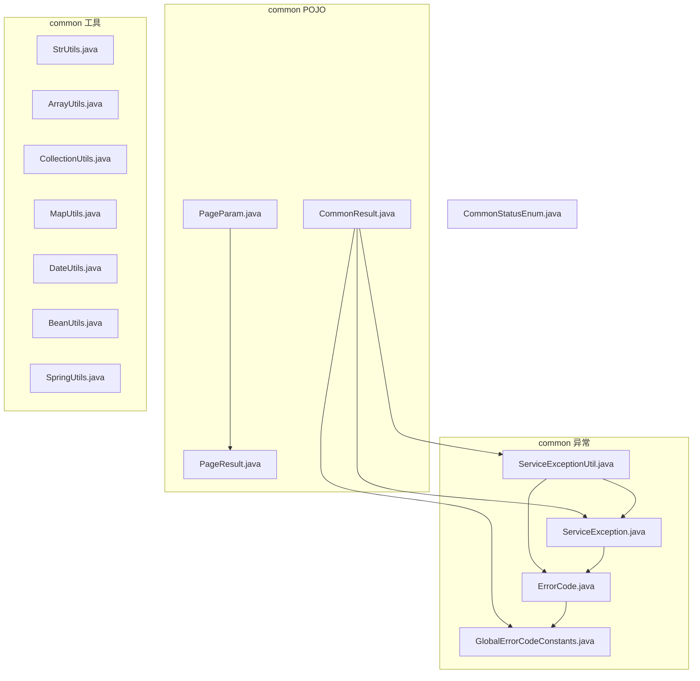
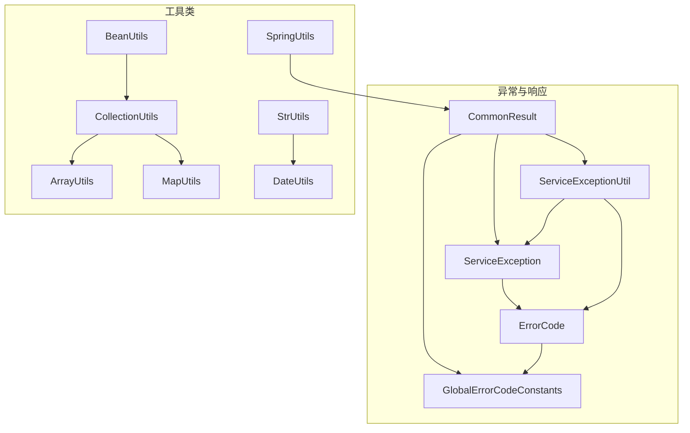
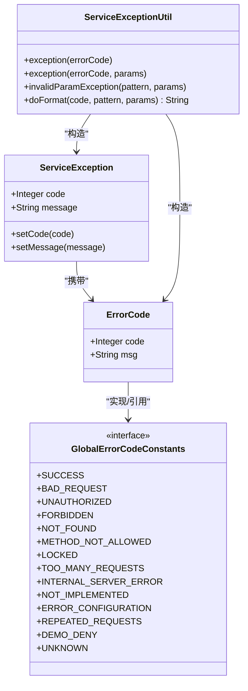
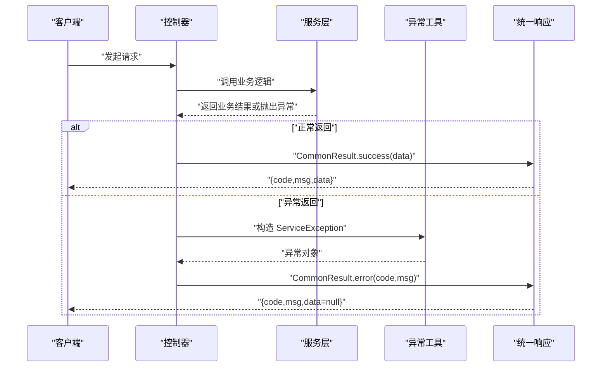
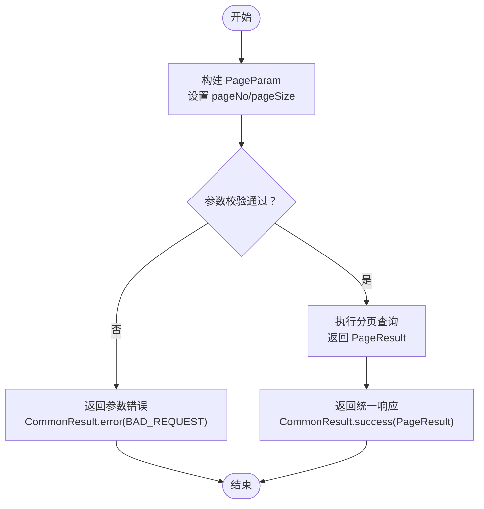
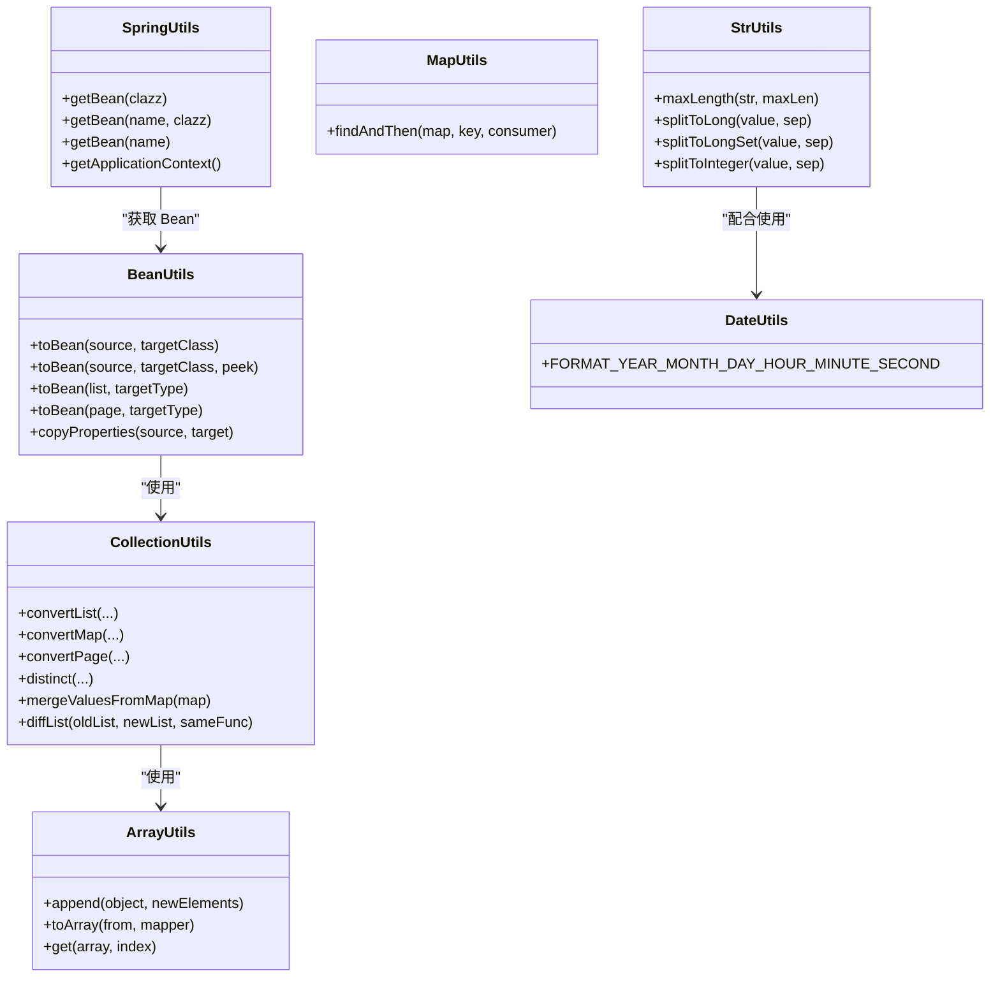
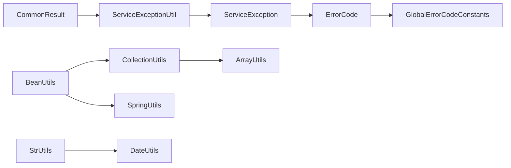

# 框架组件设计

<cite>
**本文引用的文件**   
- [ServiceException.java](file://src/main/java/cn/boss/data/ai/framework/common/exception/ServiceException.java)
- [ErrorCode.java](file://src/main/java/cn/boss/data/ai/framework/common/exception/ErrorCode.java)
- [GlobalErrorCodeConstants.java](file://src/main/java/cn/boss/data/ai/framework/common/exception/enums/GlobalErrorCodeConstants.java)
- [ServiceExceptionUtil.java](file://src/main/java/cn/boss/data/ai/framework/common/exception/util/ServiceExceptionUtil.java)
- [CommonResult.java](file://src/main/java/cn/boss/data/ai/framework/common/pojo/CommonResult.java)
- [PageParam.java](file://src/main/java/cn/boss/data/ai/framework/common/pojo/PageParam.java)
- [PageResult.java](file://src/main/java/cn/boss/data/ai/framework/common/pojo/PageResult.java)
- [StrUtils.java](file://src/main/java/cn/boss/data/ai/framework/common/util/string/StrUtils.java)
- [ArrayUtils.java](file://src/main/java/cn/boss/data/ai/framework/common/util/collection/ArrayUtils.java)
- [CollectionUtils.java](file://src/main/java/cn/boss/data/ai/framework/common/util/collection/CollectionUtils.java)
- [MapUtils.java](file://src/main/java/cn/boss/data/ai/framework/common/util/collection/MapUtils.java)
- [DateUtils.java](file://src/main/java/cn/boss/data/ai/framework/common/util/date/DateUtils.java)
- [BeanUtils.java](file://src/main/java/cn/boss/data/ai/framework/common/util/object/BeanUtils.java)
- [SpringUtils.java](file://src/main/java/cn/boss/data/ai/framework/common/util/spring/SpringUtils.java)
- [CommonStatusEnum.java](file://src/main/java/cn/boss/data/ai/framework/common/enums/CommonStatusEnum.java)
</cite>

## 目录
1. [简介](#简介)
2. [项目结构](#项目结构)
3. [核心组件](#核心组件)
4. [架构总览](#架构总览)
5. [详细组件分析](#详细组件分析)
6. [依赖关系分析](#依赖关系分析)
7. [性能考量](#性能考量)
8. [故障排查指南](#故障排查指南)
9. [结论](#结论)
10. [附录](#附录)

## 简介
本技术文档聚焦于框架组件设计，围绕以下主题展开：
- 通用异常处理机制：ServiceException 的设计与使用场景，结合 ErrorCode 与全局错误码常量，以及 ServiceExceptionUtil 的消息格式化能力。
- 分页查询实现：PageParam 与 PageResult 的设计理念与典型用法。
- 工具类库组织：字符串处理（StrUtils）、集合操作（ArrayUtils、CollectionUtils、MapUtils）、日期处理（DateUtils）、对象转换（BeanUtils）、Spring 上下文工具（SpringUtils）等。
- 统一响应格式：CommonResult 的设计思路、使用场景与最佳实践。

## 项目结构
框架组件位于 cn.boss.data.ai.framework.common 下，按职责划分为 exception（异常）、pojo（通用响应与分页）、util（工具类库）与 enums（枚举）等包。整体采用“按领域/职责”组织方式，便于复用与扩展。

图表来源
- [ErrorCode.java:1-17](file://src/main/java/cn/boss/data/ai/framework/common/exception/ErrorCode.java#L1-L17)
- [GlobalErrorCodeConstants.java:1-27](file://src/main/java/cn/boss/data/ai/framework/common/exception/enums/GlobalErrorCodeConstants.java#L1-L27)
- [ServiceException.java:1-46](file://src/main/java/cn/boss/data/ai/framework/common/exception/ServiceException.java#L1-L46)
- [ServiceExceptionUtil.java:1-57](file://src/main/java/cn/boss/data/ai/framework/common/exception/util/ServiceExceptionUtil.java#L1-L57)
- [CommonResult.java:1-85](file://src/main/java/cn/boss/data/ai/framework/common/pojo/CommonResult.java#L1-L85)
- [PageParam.java:1-32](file://src/main/java/cn/boss/data/ai/framework/common/pojo/PageParam.java#L1-L32)
- [PageResult.java:1-42](file://src/main/java/cn/boss/data/ai/framework/common/pojo/PageResult.java#L1-L42)
- [StrUtils.java:1-32](file://src/main/java/cn/boss/data/ai/framework/common/util/string/StrUtils.java#L1-L32)
- [ArrayUtils.java:1-46](file://src/main/java/cn/boss/data/ai/framework/common/util/collection/ArrayUtils.java#L1-L46)
- [CollectionUtils.java:1-310](file://src/main/java/cn/boss/data/ai/framework/common/util/collection/CollectionUtils.java#L1-L310)
- [MapUtils.java:1-23](file://src/main/java/cn/boss/data/ai/framework/common/util/collection/MapUtils.java#L1-L23)
- [DateUtils.java:1-11](file://src/main/java/cn/boss/data/ai/framework/common/util/date/DateUtils.java#L1-L11)
- [BeanUtils.java:1-62](file://src/main/java/cn/boss/data/ai/framework/common/util/object/BeanUtils.java#L1-L62)
- [SpringUtils.java:1-35](file://src/main/java/cn/boss/data/ai/framework/common/util/spring/SpringUtils.java#L1-L35)
- [CommonStatusEnum.java:1-36](file://src/main/java/cn/boss/data/ai/framework/common/enums/CommonStatusEnum.java#L1-L36)

章节来源
- [CommonResult.java:1-85](file://src/main/java/cn/boss/data/ai/framework/common/pojo/CommonResult.java#L1-L85)
- [PageParam.java:1-32](file://src/main/java/cn/boss/data/ai/framework/common/pojo/PageParam.java#L1-L32)
- [PageResult.java:1-42](file://src/main/java/cn/boss/data/ai/framework/common/pojo/PageResult.java#L1-L42)

## 核心组件
本节对关键组件进行深入解析，并给出使用建议与最佳实践。

- 通用异常处理机制
  - ServiceException：面向业务的运行时异常，封装 code 与 message，支持链式设置。
  - ErrorCode：不可变错误码载体，用于定义业务错误。
  - GlobalErrorCodeConstants：全局错误码常量接口，覆盖常见 HTTP 语义与系统级错误。
  - ServiceExceptionUtil：异常构造与消息格式化工具，支持占位符替换与日志告警。

- 统一响应格式
  - CommonResult：泛型统一响应体，包含 code、msg、data；提供 success/error 工厂方法、断言校验与异常抛出能力。

- 分页查询
  - PageParam：分页输入参数，含默认页码与页大小、校验约束与特殊“无分页”标记。
  - PageResult：分页输出结果，包含 total 与 list，提供空结果便捷构造。

- 工具类库
  - 字符串处理：StrUtils 基于 Hutool，提供截断、分割转数字集合等。
  - 集合操作：ArrayUtils、CollectionUtils、MapUtils 提供数组、集合、映射的常用操作与转换。
  - 对象转换：BeanUtils 封装 Bean 转换与 PageResult 转换。
  - Spring 工具：SpringUtils 提供静态获取 Bean 与上下文的能力。
  - 日期工具：DateUtils 定义常用日期时间格式常量。

章节来源
- [ServiceException.java:1-46](file://src/main/java/cn/boss/data/ai/framework/common/exception/ServiceException.java#L1-L46)
- [ErrorCode.java:1-17](file://src/main/java/cn/boss/data/ai/framework/common/exception/ErrorCode.java#L1-L17)
- [GlobalErrorCodeConstants.java:1-27](file://src/main/java/cn/boss/data/ai/framework/common/exception/enums/GlobalErrorCodeConstants.java#L1-L27)
- [ServiceExceptionUtil.java:1-57](file://src/main/java/cn/boss/data/ai/framework/common/exception/util/ServiceExceptionUtil.java#L1-L57)
- [CommonResult.java:1-85](file://src/main/java/cn/boss/data/ai/framework/common/pojo/CommonResult.java#L1-L85)
- [PageParam.java:1-32](file://src/main/java/cn/boss/data/ai/framework/common/pojo/PageParam.java#L1-L32)
- [PageResult.java:1-42](file://src/main/java/cn/boss/data/ai/framework/common/pojo/PageResult.java#L1-L42)
- [StrUtils.java:1-32](file://src/main/java/cn/boss/data/ai/framework/common/util/string/StrUtils.java#L1-L32)
- [ArrayUtils.java:1-46](file://src/main/java/cn/boss/data/ai/framework/common/util/collection/ArrayUtils.java#L1-L46)
- [CollectionUtils.java:1-310](file://src/main/java/cn/boss/data/ai/framework/common/util/collection/CollectionUtils.java#L1-L310)
- [MapUtils.java:1-23](file://src/main/java/cn/boss/data/ai/framework/common/util/collection/MapUtils.java#L1-L23)
- [DateUtils.java:1-11](file://src/main/java/cn/boss/data/ai/framework/common/util/date/DateUtils.java#L1-L11)
- [BeanUtils.java:1-62](file://src/main/java/cn/boss/data/ai/framework/common/util/object/BeanUtils.java#L1-L62)
- [SpringUtils.java:1-35](file://src/main/java/cn/boss/data/ai/framework/common/util/spring/SpringUtils.java#L1-L35)

## 架构总览
下图展示了异常与响应在框架中的交互关系，以及工具类如何支撑上层业务。

图表来源
- [CommonResult.java:1-85](file://src/main/java/cn/boss/data/ai/framework/common/pojo/CommonResult.java#L1-L85)
- [ServiceException.java:1-46](file://src/main/java/cn/boss/data/ai/framework/common/exception/ServiceException.java#L1-L46)
- [ErrorCode.java:1-17](file://src/main/java/cn/boss/data/ai/framework/common/exception/ErrorCode.java#L1-L17)
- [GlobalErrorCodeConstants.java:1-27](file://src/main/java/cn/boss/data/ai/framework/common/exception/enums/GlobalErrorCodeConstants.java#L1-L27)
- [ServiceExceptionUtil.java:1-57](file://src/main/java/cn/boss/data/ai/framework/common/exception/util/ServiceExceptionUtil.java#L1-L57)
- [BeanUtils.java:1-62](file://src/main/java/cn/boss/data/ai/framework/common/util/object/BeanUtils.java#L1-L62)
- [CollectionUtils.java:1-310](file://src/main/java/cn/boss/data/ai/framework/common/util/collection/CollectionUtils.java#L1-L310)
- [ArrayUtils.java:1-46](file://src/main/java/cn/boss/data/ai/framework/common/util/collection/ArrayUtils.java#L1-L46)
- [MapUtils.java:1-23](file://src/main/java/cn/boss/data/ai/framework/common/util/collection/MapUtils.java#L1-L23)
- [StrUtils.java:1-32](file://src/main/java/cn/boss/data/ai/framework/common/util/string/StrUtils.java#L1-L32)
- [DateUtils.java:1-11](file://src/main/java/cn/boss/data/ai/framework/common/util/date/DateUtils.java#L1-L11)
- [SpringUtils.java:1-35](file://src/main/java/cn/boss/data/ai/framework/common/util/spring/SpringUtils.java#L1-L35)

## 详细组件分析

### 通用异常处理机制
- 设计要点
  - 不可变错误码载体：通过 ErrorCode 表达 code 与 msg，避免误修改。
  - 全局错误码常量：集中管理通用错误码，统一对外语义。
  - 运行时异常：ServiceException 承载业务异常，便于在调用链中快速中断。
  - 消息格式化：ServiceExceptionUtil 支持占位符格式化与参数数量校验，防止日志污染。

- 使用场景
  - 参数校验失败：使用 invalidParamException 快速构造 400 错误。
  - 业务断言失败：使用 exception 或 exception(ErrorCode, params) 构造带参异常。
  - 响应层抛错：在 Controller 层捕获 ServiceException 并通过 CommonResult.error 输出。

- 最佳实践
  - 在服务层统一抛出 ServiceException，避免直接抛出底层异常。
  - 使用 ServiceExceptionUtil.doFormat 进行国际化或本地化消息拼接。
  - 在统一异常拦截器中将 ServiceException 转换为 CommonResult 返回。

图表来源
- [ErrorCode.java:1-17](file://src/main/java/cn/boss/data/ai/framework/common/exception/ErrorCode.java#L1-L17)
- [GlobalErrorCodeConstants.java:1-27](file://src/main/java/cn/boss/data/ai/framework/common/exception/enums/GlobalErrorCodeConstants.java#L1-L27)
- [ServiceException.java:1-46](file://src/main/java/cn/boss/data/ai/framework/common/exception/ServiceException.java#L1-L46)
- [ServiceExceptionUtil.java:1-57](file://src/main/java/cn/boss/data/ai/framework/common/exception/util/ServiceExceptionUtil.java#L1-L57)

章节来源
- [ServiceException.java:1-46](file://src/main/java/cn/boss/data/ai/framework/common/exception/ServiceException.java#L1-L46)
- [ErrorCode.java:1-17](file://src/main/java/cn/boss/data/ai/framework/common/exception/ErrorCode.java#L1-L17)
- [GlobalErrorCodeConstants.java:1-27](file://src/main/java/cn/boss/data/ai/framework/common/exception/enums/GlobalErrorCodeConstants.java#L1-L27)
- [ServiceExceptionUtil.java:1-57](file://src/main/java/cn/boss/data/ai/framework/common/exception/util/ServiceExceptionUtil.java#L1-L57)

### 统一响应格式 CommonResult
- 设计思路
  - 泛型响应体：data 可承载任意类型，提升复用性。
  - 成功/错误工厂方法：success(data) 与 error(...) 多重重载，满足不同场景。
  - 断言与抛错：isSuccess/isError 判断，checkError 抛出 ServiceException，getCheckedData 获取安全数据。
  - 与异常协作：与 ServiceException/ErrorCode/ServiceExceptionUtil 协同，保证前后端一致的错误语义。

- 使用场景
  - 控制器返回：所有接口统一返回 CommonResult<T>。
  - 业务层透传：服务层返回 CommonResult，控制器无需再次包装。
  - 错误处理：通过 checkError 或 isError 统一处理异常分支。

- 最佳实践
  - 前端约定：约定 code=0 为成功，非 0 为失败，msg 为提示信息。
  - 参数校验：使用 GlobalErrorCodeConstants.BAD_REQUEST 统一返回参数错误。
  - 日志记录：在网关/拦截器中记录 CommonResult 的 code 与 msg，便于监控。

图表来源
- [CommonResult.java:1-85](file://src/main/java/cn/boss/data/ai/framework/common/pojo/CommonResult.java#L1-L85)
- [ServiceExceptionUtil.java:1-57](file://src/main/java/cn/boss/data/ai/framework/common/exception/util/ServiceExceptionUtil.java#L1-L57)
- [ServiceException.java:1-46](file://src/main/java/cn/boss/data/ai/framework/common/exception/ServiceException.java#L1-L46)

章节来源
- [CommonResult.java:1-85](file://src/main/java/cn/boss/data/ai/framework/common/pojo/CommonResult.java#L1-L85)

### 分页查询 PageParam 与 PageResult
- 设计理念
  - PageParam：默认页码与页大小、参数校验（最小值、最大值），支持“无分页”标记（PAGE_SIZE_NONE=-1）。
  - PageResult：包含 total 与 list，提供空结果便捷构造，适配前端分页组件。

- 实现要点
  - 输入约束：通过注解与校验确保 pageNo≥1、pageSize∈[1,200]。
  - 输出结构：list 为空列表时保持一致性，total 记录总数。

- 使用指南
  - 控制器接收 PageParam，服务层执行分页查询并返回 PageResult。
  - 前端根据 total 与 list 渲染分页组件。

图表来源
- [PageParam.java:1-32](file://src/main/java/cn/boss/data/ai/framework/common/pojo/PageParam.java#L1-L32)
- [PageResult.java:1-42](file://src/main/java/cn/boss/data/ai/framework/common/pojo/PageResult.java#L1-L42)
- [CommonResult.java:1-85](file://src/main/java/cn/boss/data/ai/framework/common/pojo/CommonResult.java#L1-L85)

章节来源
- [PageParam.java:1-32](file://src/main/java/cn/boss/data/ai/framework/common/pojo/PageParam.java#L1-L32)
- [PageResult.java:1-42](file://src/main/java/cn/boss/data/ai/framework/common/pojo/PageResult.java#L1-L42)

### 工具类库组织与使用
- 字符串处理（StrUtils）
  - 截断与分割：maxLength、splitToLong、splitToLongSet、splitToInteger。
  - 依赖 Hutool：基于 StrUtil 的增强封装，简化常用字符串操作。

- 集合操作（ArrayUtils、CollectionUtils、MapUtils）
  - ArrayUtils：数组工具，如 append、toArray、get。
  - CollectionUtils：集合转换与聚合，如 convertList、convertMap、convertPage、distinct、mergeValuesFromMap、diffList 等。
  - MapUtils：安全取值与消费，findAndThen。

- 对象转换（BeanUtils）
  - Bean 转换：toBean(source, targetClass)，支持 peek 回调。
  - PageResult 转换：toBean(PageResult<S>, targetType) 保留 total 并逐项转换。

- Spring 工具（SpringUtils）
  - 静态获取 Bean 与 ApplicationContext，便于在非 Spring 环境中访问 Bean。

- 日期工具（DateUtils）
  - 定义常用格式常量，便于统一格式化与解析。

图表来源
- [StrUtils.java:1-32](file://src/main/java/cn/boss/data/ai/framework/common/util/string/StrUtils.java#L1-L32)
- [ArrayUtils.java:1-46](file://src/main/java/cn/boss/data/ai/framework/common/util/collection/ArrayUtils.java#L1-L46)
- [CollectionUtils.java:1-310](file://src/main/java/cn/boss/data/ai/framework/common/util/collection/CollectionUtils.java#L1-L310)
- [MapUtils.java:1-23](file://src/main/java/cn/boss/data/ai/framework/common/util/collection/MapUtils.java#L1-L23)
- [BeanUtils.java:1-62](file://src/main/java/cn/boss/data/ai/framework/common/util/object/BeanUtils.java#L1-L62)
- [SpringUtils.java:1-35](file://src/main/java/cn/boss/data/ai/framework/common/util/spring/SpringUtils.java#L1-L35)
- [DateUtils.java:1-11](file://src/main/java/cn/boss/data/ai/framework/common/util/date/DateUtils.java#L1-L11)

章节来源
- [StrUtils.java:1-32](file://src/main/java/cn/boss/data/ai/framework/common/util/string/StrUtils.java#L1-L32)
- [ArrayUtils.java:1-46](file://src/main/java/cn/boss/data/ai/framework/common/util/collection/ArrayUtils.java#L1-L46)
- [CollectionUtils.java:1-310](file://src/main/java/cn/boss/data/ai/framework/common/util/collection/CollectionUtils.java#L1-L310)
- [MapUtils.java:1-23](file://src/main/java/cn/boss/data/ai/framework/common/util/collection/MapUtils.java#L1-L23)
- [BeanUtils.java:1-62](file://src/main/java/cn/boss/data/ai/framework/common/util/object/BeanUtils.java#L1-L62)
- [SpringUtils.java:1-35](file://src/main/java/cn/boss/data/ai/framework/common/util/spring/SpringUtils.java#L1-L35)
- [DateUtils.java:1-11](file://src/main/java/cn/boss/data/ai/framework/common/util/date/DateUtils.java#L1-L11)

## 依赖关系分析
- 内聚与耦合
  - 异常模块内聚：ErrorCode、GlobalErrorCodeConstants、ServiceException、ServiceExceptionUtil 形成完整的异常体系。
  - 响应模块内聚：CommonResult 与异常模块强关联，提供统一错误输出。
  - 工具模块松耦合：各工具类相对独立，通过 Hutool 与 Spring 进行外部依赖。

- 关键依赖链
  - CommonResult.error(...) → ServiceExceptionUtil.doFormat → ServiceException
  - BeanUtils → CollectionUtils/ArrayUtils → Hutool
  - SpringUtils → ApplicationContext → Bean 注入

图表来源
- [CommonResult.java:1-85](file://src/main/java/cn/boss/data/ai/framework/common/pojo/CommonResult.java#L1-L85)
- [ServiceExceptionUtil.java:1-57](file://src/main/java/cn/boss/data/ai/framework/common/exception/util/ServiceExceptionUtil.java#L1-L57)
- [ServiceException.java:1-46](file://src/main/java/cn/boss/data/ai/framework/common/exception/ServiceException.java#L1-L46)
- [ErrorCode.java:1-17](file://src/main/java/cn/boss/data/ai/framework/common/exception/ErrorCode.java#L1-L17)
- [GlobalErrorCodeConstants.java:1-27](file://src/main/java/cn/boss/data/ai/framework/common/exception/enums/GlobalErrorCodeConstants.java#L1-L27)
- [BeanUtils.java:1-62](file://src/main/java/cn/boss/data/ai/framework/common/util/object/BeanUtils.java#L1-L62)
- [CollectionUtils.java:1-310](file://src/main/java/cn/boss/data/ai/framework/common/util/collection/CollectionUtils.java#L1-L310)
- [ArrayUtils.java:1-46](file://src/main/java/cn/boss/data/ai/framework/common/util/collection/ArrayUtils.java#L1-L46)
- [SpringUtils.java:1-35](file://src/main/java/cn/boss/data/ai/framework/common/util/spring/SpringUtils.java#L1-L35)
- [StrUtils.java:1-32](file://src/main/java/cn/boss/data/ai/framework/common/util/string/StrUtils.java#L1-L32)
- [DateUtils.java:1-11](file://src/main/java/cn/boss/data/ai/framework/common/util/date/DateUtils.java#L1-L11)

章节来源
- [CommonResult.java:1-85](file://src/main/java/cn/boss/data/ai/framework/common/pojo/CommonResult.java#L1-L85)
- [ServiceExceptionUtil.java:1-57](file://src/main/java/cn/boss/data/ai/framework/common/exception/util/ServiceExceptionUtil.java#L1-L57)
- [BeanUtils.java:1-62](file://src/main/java/cn/boss/data/ai/framework/common/util/object/BeanUtils.java#L1-L62)
- [CollectionUtils.java:1-310](file://src/main/java/cn/boss/data/ai/framework/common/util/collection/CollectionUtils.java#L1-L310)

## 性能考量
- 异常与格式化
  - ServiceExceptionUtil.doFormat 采用 StringBuilder 顺序拼接，避免多次字符串分配；当参数不足或过多时记录日志，便于定位问题。
- 集合与转换
  - CollectionUtils 的转换方法优先过滤 null，减少下游空指针风险；convertPage 仅在非空时转换 list，空结果直接保留 total。
- 工具类选择
  - 优先使用 Hutool 的高性能实现；在高频路径中避免不必要的装箱拆箱与中间集合创建。

## 故障排查指南
- 常见问题
  - 参数校验失败：检查 PageParam 的 pageNo 与 pageSize 是否符合最小/最大值要求。
  - 响应状态异常：确认 CommonResult.isSuccess 判断是否正确，必要时调用 getCheckedData 获取安全数据。
  - 异常未被捕获：确保在统一异常处理器中将 ServiceException 转换为 CommonResult.error。

- 排查步骤
  - 在 ServiceExceptionUtil.doFormat 中观察日志，确认参数数量与占位符匹配。
  - 使用 CommonResult.checkError 抛出 ServiceException，便于定位调用栈。
  - 在 BeanUtils/CollectionUtils 转换过程中，注意空集合与 null 的处理差异。

章节来源
- [ServiceExceptionUtil.java:1-57](file://src/main/java/cn/boss/data/ai/framework/common/exception/util/ServiceExceptionUtil.java#L1-L57)
- [CommonResult.java:1-85](file://src/main/java/cn/boss/data/ai/framework/common/pojo/CommonResult.java#L1-L85)
- [BeanUtils.java:1-62](file://src/main/java/cn/boss/data/ai/framework/common/util/object/BeanUtils.java#L1-L62)
- [CollectionUtils.java:1-310](file://src/main/java/cn/boss/data/ai/framework/common/util/collection/CollectionUtils.java#L1-L310)

## 结论
本框架通过统一异常、统一响应与分页模型，以及完善的工具类库，实现了高内聚、低耦合的通用组件设计。开发者可基于这些组件快速搭建稳定、易维护的业务系统，同时遵循最佳实践以获得更好的可读性与可扩展性。

## 附录
- 枚举与状态
  - CommonStatusEnum 提供启用/禁用状态与数组化能力，便于数据库存储与前端展示。

章节来源
- [CommonStatusEnum.java:1-36](file://src/main/java/cn/boss/data/ai/framework/common/enums/CommonStatusEnum.java#L1-L36)