# 估值系统集成

<cite>
**本文档引用的文件**
- [AiValuationClient.java](file://src/main/java/cn/boss/data/ai/framework/ai/core/valuation/AiValuationClient.java)
- [AiLlmServiceImpl.java](file://src/main/java/cn/boss/data/ai/service/llm/AiLlmServiceImpl.java)
- [AiLlmController.java](file://src/main/java/cn/boss/data/ai/controller/llm/AiLlmController.java)
- [AiAutoConfiguration.java](file://src/main/java/cn/boss/data/ai/framework/ai/config/AiAutoConfiguration.java)
- [AiProperties.java](file://src/main/java/cn/boss/data/ai/framework/ai/config/AiProperties.java)
- [AiModelFactoryImpl.java](file://src/main/java/cn/boss/data/ai/framework/ai/core/model/AiModelFactoryImpl.java)
- [AiProductKnowledgeRecord.java](file://src/main/java/cn/boss/data/ai/service/llm/vo/AiProductKnowledgeRecord.java)
- [application.yml](file://src/main/resources/application.yml)
- [pom.xml](file://pom.xml)
- [AiPlatformEnum.java](file://src/main/java/cn/boss/data/ai/enums/model/AiPlatformEnum.java)
- [CommonResult.java](file://src/main/java/cn/boss/data/ai/framework/common/pojo/CommonResult.java)
</cite>

## 更新摘要
**变更内容**
- 更新估值客户端架构：从分页系统迁移到统一'all-list'端点
- 移除复杂的分页逻辑和错误处理机制
- 新增内部API密钥认证支持
- 简化数据获取流程和错误处理

## 目录
1. [项目概述](#项目概述)
2. [架构概览](#架构概览)
3. [核心组件分析](#核心组件分析)
4. [估值系统集成流程](#估值系统集成流程)
5. [配置管理](#配置管理)
6. [API 接口设计](#api-接口设计)
7. [数据模型](#数据模型)
8. [性能优化策略](#性能优化策略)
9. [故障排除指南](#故障排除指南)
10. [总结](#总结)

## 项目概述

估值系统集成本项目是一个基于 Spring Boot 和 Spring AI 的智能估值服务平台，主要功能包括：

- **产品知识检索与匹配**：通过语义搜索技术从估值后端获取产品知识，实现智能产品匹配
- **字段重要性分析**：基于产品信息和使用场景，分析各字段对产品业务的重要性
- **多平台 AI 模型支持**：支持通义千问、DeepSeek、OpenAI、Ollama 等多种 AI 平台
- **向量存储集成**：集成 Redis、Qdrant、Milvus 等多种向量存储方案
- **内部API密钥认证**：支持估值后端的内部服务调用认证机制

该项目采用模块化设计，通过自动配置机制实现灵活的组件装配，为后续的估值系统集成提供了强大的基础设施支持。

## 架构概览

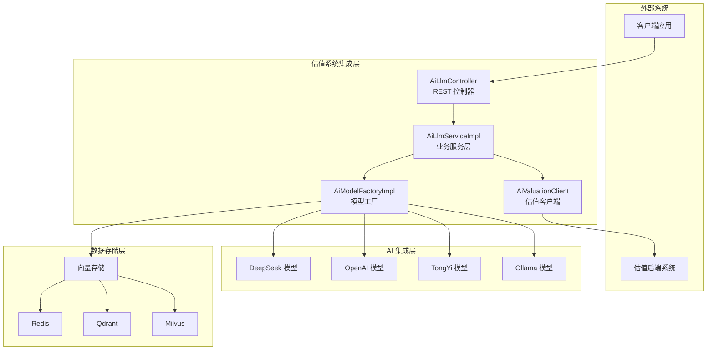

**图表来源**
- [AiLlmController.java:18-46](file://src/main/java/cn/boss/data/ai/controller/llm/AiLlmController.java#L18-L46)
- [AiLlmServiceImpl.java:33-39](file://src/main/java/cn/boss/data/ai/service/llm/AiLlmServiceImpl.java#L33-L39)
- [AiAutoConfiguration.java:35-78](file://src/main/java/cn/boss/data/ai/framework/ai/config/AiAutoConfiguration.java#L35-L78)

## 核心组件分析

### 估值客户端 (AiValuationClient)

**更新** 估值客户端已从复杂的分页系统迁移到简化的统一'all-list'端点架构，移除了PAGE_SIZE和MAX_RECORDS常量，增加了内部API密钥认证支持。

估值客户端是系统与估值后端通信的核心组件，负责从估值后端获取产品知识数据。

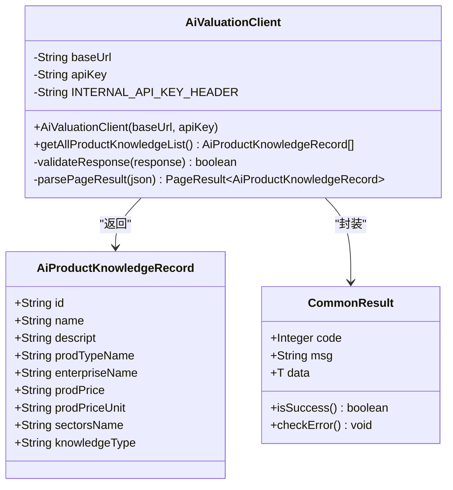

**图表来源**
- [AiValuationClient.java:21-71](file://src/main/java/cn/boss/data/ai/framework/ai/core/valuation/AiValuationClient.java#L21-L71)
- [AiProductKnowledgeRecord.java:9-56](file://src/main/java/cn/boss/data/ai/service/llm/vo/AiProductKnowledgeRecord.java#L9-L56)

### LLM 服务实现 (AiLlmServiceImpl)

LLM 服务实现了智能产品匹配和字段分析功能，是整个系统的核心业务逻辑。

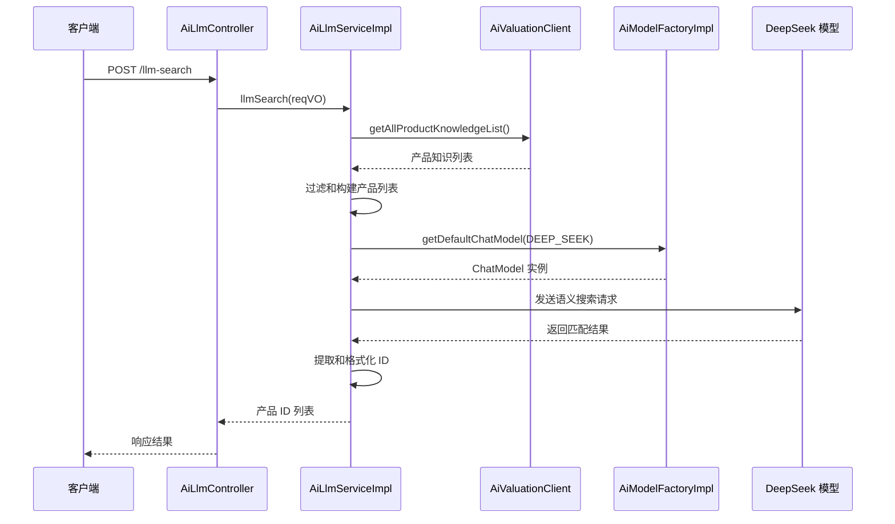

**图表来源**
- [AiLlmController.java:26-34](file://src/main/java/cn/boss/data/ai/controller/llm/AiLlmController.java#L26-L34)
- [AiLlmServiceImpl.java:82-133](file://src/main/java/cn/boss/data/ai/service/llm/AiLlmServiceImpl.java#L82-L133)
- [AiValuationClient.java:39-69](file://src/main/java/cn/boss/data/ai/framework/ai/core/valuation/AiValuationClient.java#L39-L69)

**章节来源**
- [AiLlmServiceImpl.java:33-185](file://src/main/java/cn/boss/data/ai/service/llm/AiLlmServiceImpl.java#L33-L185)

### 模型工厂 (AiModelFactoryImpl)

模型工厂提供了统一的 AI 模型管理接口，支持多种 AI 平台的动态切换。

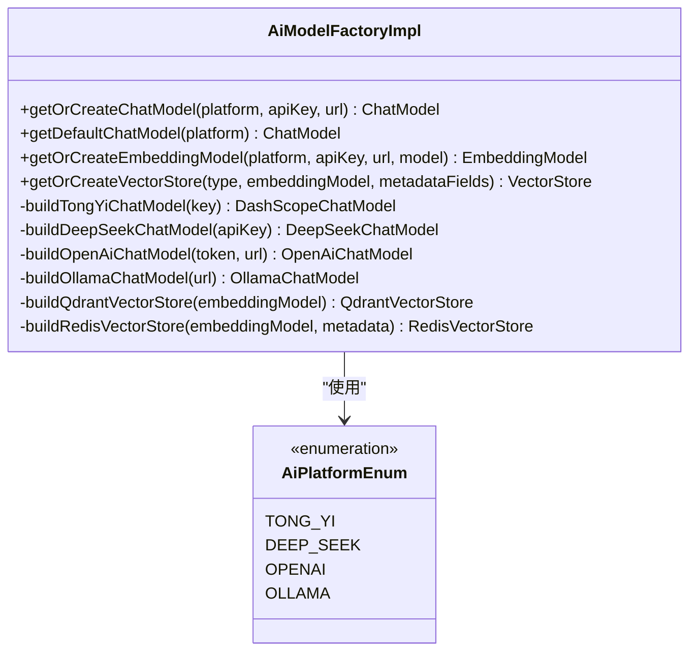

**图表来源**
- [AiModelFactoryImpl.java:71-323](file://src/main/java/cn/boss/data/ai/framework/ai/core/model/AiModelFactoryImpl.java#L71-L323)
- [AiPlatformEnum.java:14-53](file://src/main/java/cn/boss/data/ai/enums/model/AiPlatformEnum.java#L14-L53)

**章节来源**
- [AiModelFactoryImpl.java:71-323](file://src/main/java/cn/boss/data/ai/framework/ai/core/model/AiModelFactoryImpl.java#L71-L323)

## 估值系统集成流程

### 数据获取流程

**更新** 数据获取流程已从复杂的分页系统简化为统一的'all-list'端点调用，移除了PAGE_SIZE和MAX_RECORDS的限制。

系统通过以下流程从估值后端获取产品知识数据：

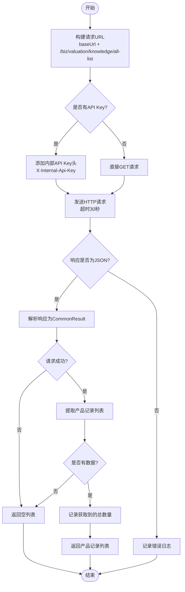

**图表来源**
- [AiValuationClient.java:39-69](file://src/main/java/cn/boss/data/ai/framework/ai/core/valuation/AiValuationClient.java#L39-L69)

### 产品匹配流程

系统实现智能产品匹配的完整流程：

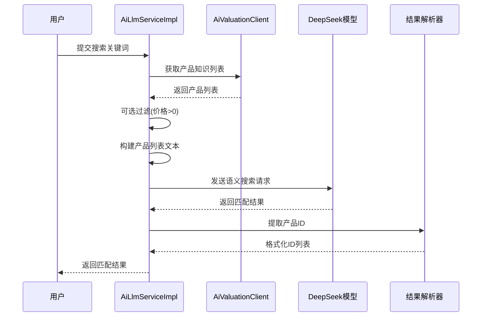

**图表来源**
- [AiLlmServiceImpl.java:82-133](file://src/main/java/cn/boss/data/ai/service/llm/AiLlmServiceImpl.java#L82-L133)

**章节来源**
- [AiLlmServiceImpl.java:82-133](file://src/main/java/cn/boss/data/ai/service/llm/AiLlmServiceImpl.java#L82-L133)

## 配置管理

### 应用配置

**更新** 应用配置已增加内部API密钥认证支持，移除了web-search配置项。

系统通过 `application.yml` 进行集中配置管理，支持多种 AI 平台和向量存储的配置。

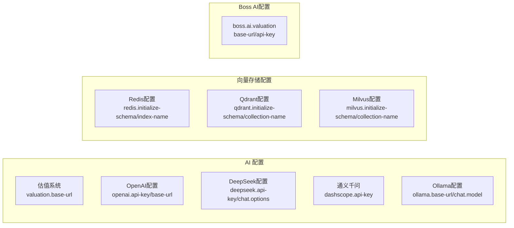

**图表来源**
- [application.yml:65-128](file://src/main/resources/application.yml#L65-L128)

### 自动配置机制

通过 `AiAutoConfiguration` 实现了智能的组件装配：

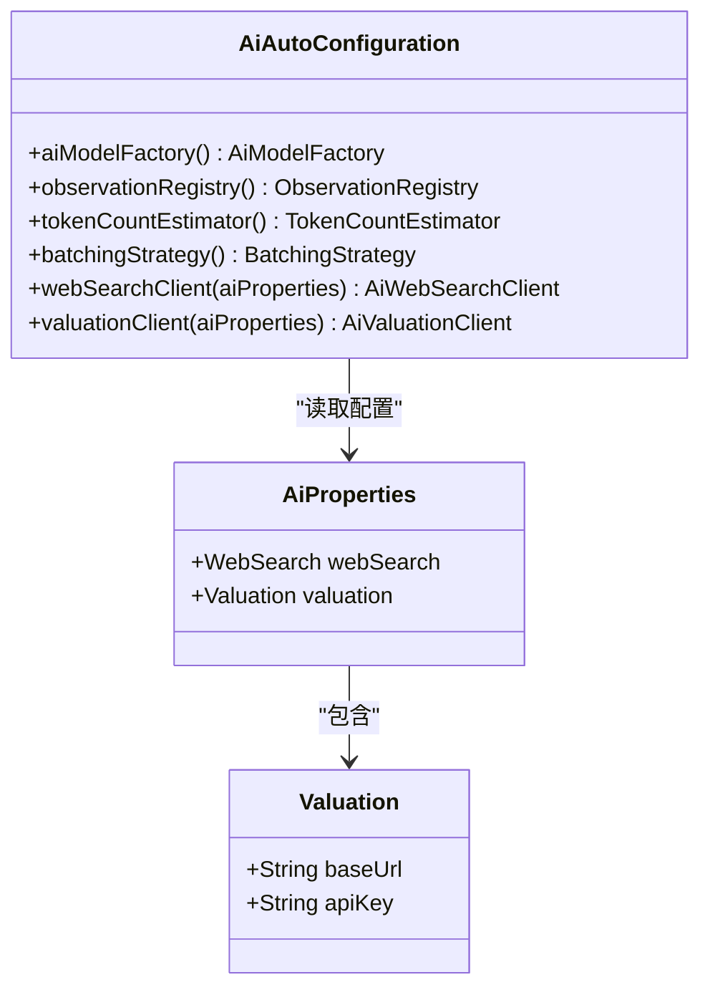

**图表来源**
- [AiAutoConfiguration.java:33-79](file://src/main/java/cn/boss/data/ai/framework/ai/config/AiAutoConfiguration.java#L33-L79)
- [AiProperties.java:11-43](file://src/main/java/cn/boss/data/ai/framework/ai/config/AiProperties.java#L11-L43)

**章节来源**
- [AiAutoConfiguration.java:33-79](file://src/main/java/cn/boss/data/ai/framework/ai/config/AiAutoConfiguration.java#L33-L79)
- [AiProperties.java:11-43](file://src/main/java/cn/boss/data/ai/framework/ai/config/AiProperties.java#L11-L43)

## API 接口设计

### REST API 接口定义

系统提供两个主要的 REST API 接口：

| 接口 | 方法 | 路径 | 请求体 | 响应类型 | 功能描述 |
|------|------|------|--------|----------|----------|
| 产品语义搜索 | POST | `/llm-search` | AiLlmSearchReqVO | text/plain | 基于语义相似度的产品匹配 |
| 字段重要性分析 | POST | `/field/analyze-by-llm` | AiFieldAnalyzeReqVO | application/json | 分析字段对产品业务的重要性 |

### 请求响应示例

**产品语义搜索响应示例：**
```
# 成功响应
123456,654321,789012

# 无匹配
空
```

**字段重要性分析响应示例：**
```json
[
  {
    "id": "字段ID",
    "name": "字段名称",
    "level": "important",
    "reason": "对产品核心业务起到决定性作用"
  }
]
```

**章节来源**
- [AiLlmController.java:26-44](file://src/main/java/cn/boss/data/ai/controller/llm/AiLlmController.java#L26-L44)

## 数据模型

### 核心数据结构

**更新** 核心数据结构已增加knowledgeType字段，用于标识知识库类型。

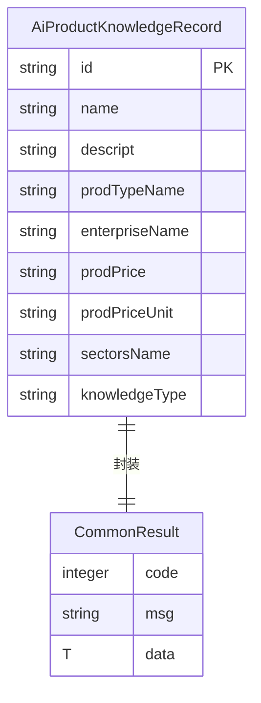

**图表来源**
- [AiProductKnowledgeRecord.java:9-56](file://src/main/java/cn/boss/data/ai/service/llm/vo/AiProductKnowledgeRecord.java#L9-L56)
- [CommonResult.java:15-84](file://src/main/java/cn/boss/data/ai/framework/common/pojo/CommonResult.java#L15-L84)

### 配置数据模型

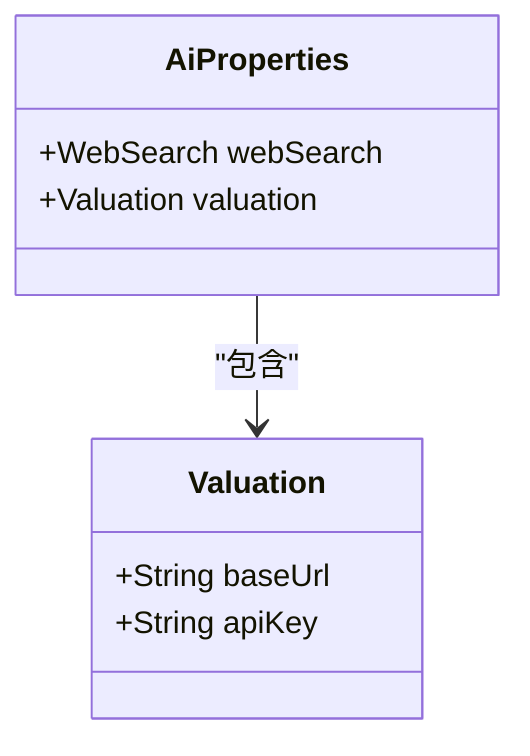

**图表来源**
- [AiProperties.java:23-43](file://src/main/java/cn/boss/data/ai/framework/ai/config/AiProperties.java#L23-L43)

**章节来源**
- [AiProductKnowledgeRecord.java:9-56](file://src/main/java/cn/boss/data/ai/service/llm/vo/AiProductKnowledgeRecord.java#L9-L56)
- [CommonResult.java:15-84](file://src/main/java/cn/boss/data/ai/framework/common/pojo/CommonResult.java#L15-L84)

## 性能优化策略

### 缓存机制

系统采用了多层缓存策略来提升性能：

1. **模型实例缓存**：通过单例模式缓存 AI 模型实例，避免重复创建
2. **向量存储持久化**：SimpleVectorStore 支持定时保存到本地文件
3. **HTTP 请求缓存**：合理设置超时时间，避免长时间阻塞

### 异步处理

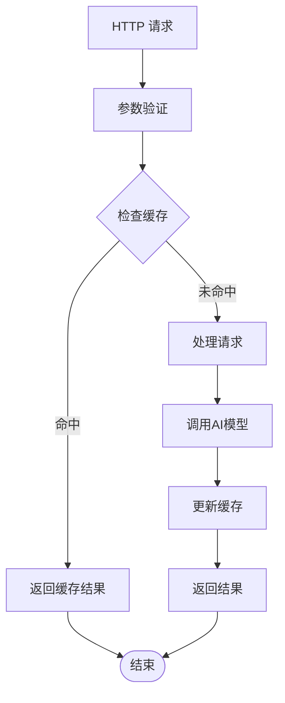

### 资源管理

- **连接池管理**：合理配置 Redis 连接池参数
- **内存管理**：移除最大记录数限制，简化内存管理
- **线程池管理**：使用 Spring 的异步执行机制

## 故障排除指南

### 常见问题及解决方案

**更新** 故障排除指南已增加内部API密钥认证相关的解决方案。

| 问题类型 | 症状 | 可能原因 | 解决方案 |
|----------|------|----------|----------|
| 估值后端连接失败 | 日志显示连接超时 | 估值后端未启动或地址错误 | 检查 `boss.ai.valuation.base-url` 配置 |
| API Key 认证失败 | 返回认证错误 | API Key 不正确或过期 | 验证 `boss.ai.valuation.api-key` 配置 |
| 内部API密钥认证失败 | 返回401未授权 | 内部API密钥不匹配 | 确认内部API密钥与估值后端配置一致 |
| AI 模型调用失败 | LLM 调用异常 | 模型配置错误或网络问题 | 检查对应平台的 API Key 和网络连接 |
| 向量存储连接失败 | 向量检索异常 | Redis/Qdrant/Milvus 服务不可用 | 检查对应服务的连接配置 |

### 日志分析

系统提供了详细的日志记录机制：

- **错误级别日志**：记录严重的系统错误和异常
- **警告级别日志**：记录潜在的问题和异常情况
- **信息级别日志**：记录正常的业务流程和状态变化

**章节来源**
- [AiValuationClient.java:46-68](file://src/main/java/cn/boss/data/ai/framework/ai/core/valuation/AiValuationClient.java#L46-L68)
- [AiLlmServiceImpl.java:118-169](file://src/main/java/cn/boss/data/ai/service/llm/AiLlmServiceImpl.java#L118-L169)

## 总结

**更新** 总结部分已反映架构变更带来的改进。

估值系统集成本项目通过模块化的设计和完善的架构，为智能估值服务提供了强大的技术支撑。主要特点包括：

1. **高度模块化**：通过自动配置机制实现灵活的组件装配
2. **多平台支持**：支持多种 AI 平台，便于根据需求选择合适的模型
3. **完善的监控**：提供详细的日志记录和错误处理机制
4. **可扩展性**：通过接口抽象和工厂模式，便于添加新的功能模块
5. **简化架构**：从复杂的分页系统迁移到统一'all-list'端点，提升了系统的简洁性和可靠性
6. **安全增强**：增加了内部API密钥认证支持，提高了系统安全性

该系统为后续的估值系统集成奠定了坚实的技术基础，能够有效提升产品的智能化水平和用户体验。新的架构设计不仅简化了代码逻辑，还提高了系统的稳定性和可维护性。