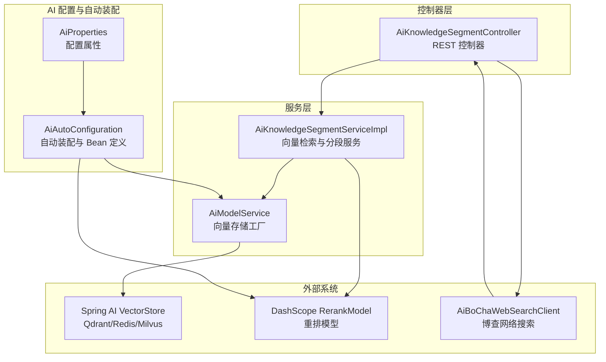
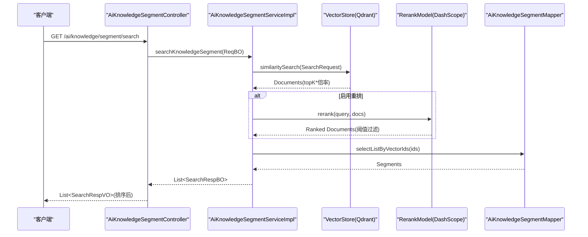
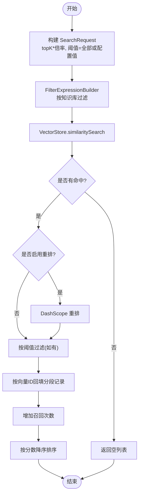
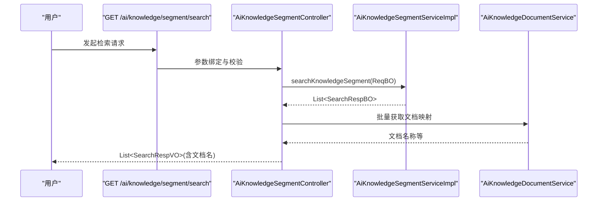
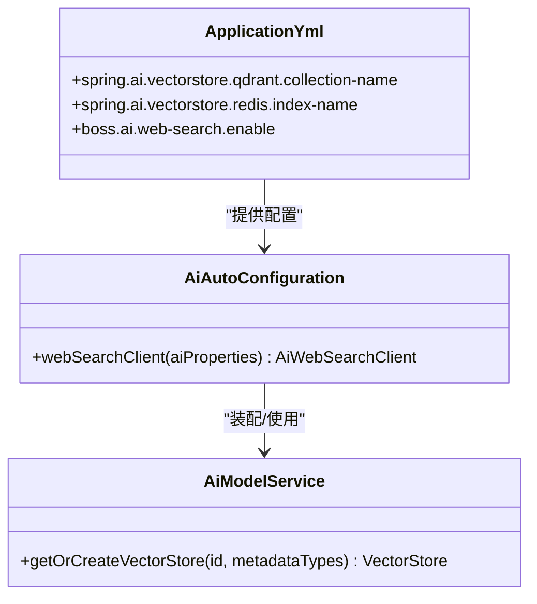
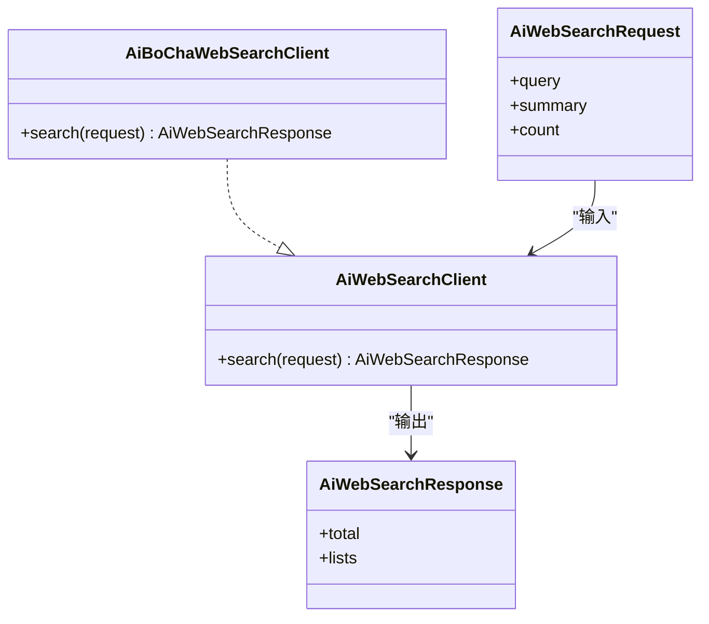
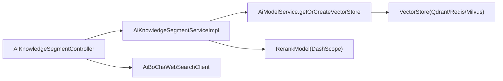

# 向量检索

<cite>
**本文引用的文件**
- [AiKnowledgeSegmentServiceImpl.java](file://src/main/java/cn/boss/data/ai/service/knowledge/AiKnowledgeSegmentServiceImpl.java)
- [AiKnowledgeSegmentController.java](file://src/main/java/cn/boss/data/ai/controller/knowledge/AiKnowledgeSegmentController.java)
- [AiAutoConfiguration.java](file://src/main/java/cn/boss/data/ai/framework/ai/config/AiAutoConfiguration.java)
- [AiProperties.java](file://src/main/java/cn/boss/data/ai/framework/ai/config/AiProperties.java)
- [AiModelService.java](file://src/main/java/cn/boss/data/ai/service/model/AiModelService.java)
- [AiWebSearchClient.java](file://src/main/java/cn/boss/data/ai/framework/ai/core/websearch/AiWebSearchClient.java)
- [AiWebSearchRequest.java](file://src/main/java/cn/boss/data/ai/framework/ai/core/websearch/AiWebSearchRequest.java)
- [AiWebSearchResponse.java](file://src/main/java/cn/boss/data/ai/framework/ai/core/websearch/AiWebSearchResponse.java)
- [AiBoChaWebSearchClient.java](file://src/main/java/cn/boss/data/ai/framework/ai/core/websearch/bocha/AiBoChaWebSearchClient.java)
- [application.yml](file://src/main/resources/application.yml)
</cite>

## 目录
1. [简介](#简介)
2. [项目结构](#项目结构)
3. [核心组件](#核心组件)
4. [架构总览](#架构总览)
5. [详细组件分析](#详细组件分析)
6. [依赖分析](#依赖分析)
7. [性能考虑](#性能考虑)
8. [故障排查指南](#故障排查指南)
9. [结论](#结论)
10. [附录](#附录)

## 简介
本技术文档围绕基于 Qdrant 的向量检索能力展开，系统性阐述相似度计算、过滤条件与排序机制；详解 RAG（检索增强生成）实现流程，从查询向量化到结果匹配；说明检索参数配置（topK、相似度阈值、过滤条件）；给出 Web 搜索与本地知识库融合的实现方案；总结检索性能优化策略（索引优化、缓存、并发处理）；并提供检索 API 使用示例与最佳实践。

## 项目结构
本项目采用分层架构，向量检索相关代码主要集中在知识库分段服务层与控制器层，并通过自动配置装配 Spring AI 的向量存储与重排模型。Web 搜索能力以插件化方式接入，便于按需启用。

图表来源
- [AiKnowledgeSegmentController.java:1-123](file://src/main/java/cn/boss/data/ai/controller/knowledge/AiKnowledgeSegmentController.java#L1-L123)
- [AiKnowledgeSegmentServiceImpl.java:1-497](file://src/main/java/cn/boss/data/ai/service/knowledge/AiKnowledgeSegmentServiceImpl.java#L1-L497)
- [AiAutoConfiguration.java:1-286](file://src/main/java/cn/boss/data/ai/framework/ai/config/AiAutoConfiguration.java#L1-L286)
- [AiProperties.java:1-134](file://src/main/java/cn/boss/data/ai/framework/ai/config/AiProperties.java#L1-L134)
- [AiBoChaWebSearchClient.java:1-135](file://src/main/java/cn/boss/data/ai/framework/ai/core/websearch/bocha/AiBoChaWebSearchClient.java#L1-L135)

章节来源
- [AiKnowledgeSegmentController.java:1-123](file://src/main/java/cn/boss/data/ai/controller/knowledge/AiKnowledgeSegmentController.java#L1-L123)
- [AiKnowledgeSegmentServiceImpl.java:1-497](file://src/main/java/cn/boss/data/ai/service/knowledge/AiKnowledgeSegmentServiceImpl.java#L1-L497)
- [AiAutoConfiguration.java:1-286](file://src/main/java/cn/boss/data/ai/framework/ai/config/AiAutoConfiguration.java#L1-L286)
- [AiProperties.java:1-134](file://src/main/java/cn/boss/data/ai/framework/ai/config/AiProperties.java#L1-L134)
- [AiBoChaWebSearchClient.java:1-135](file://src/main/java/cn/boss/data/ai/framework/ai/core/websearch/bocha/AiBoChaWebSearchClient.java#L1-L135)

## 核心组件
- 向量检索服务实现：负责将知识库分段写入向量存储、执行相似度检索、可选重排、结果回填与排序。
- 控制器：对外暴露检索、分页、切片等 REST 接口。
- 自动配置：装配向量存储（Qdrant/Redis/Milvus）、重排模型、Web 搜索客户端等。
- Web 搜索客户端：提供统一的网络搜索接口，支持博查平台。
- 配置属性：集中管理各模型与向量存储的启用开关与参数。

章节来源
- [AiKnowledgeSegmentServiceImpl.java:227-295](file://src/main/java/cn/boss/data/ai/service/knowledge/AiKnowledgeSegmentServiceImpl.java#L227-L295)
- [AiKnowledgeSegmentController.java:103-120](file://src/main/java/cn/boss/data/ai/controller/knowledge/AiKnowledgeSegmentController.java#L103-L120)
- [AiAutoConfiguration.java:277-283](file://src/main/java/cn/boss/data/ai/framework/ai/config/AiAutoConfiguration.java#L277-L283)
- [AiWebSearchClient.java:1-17](file://src/main/java/cn/boss/data/ai/framework/ai/core/websearch/AiWebSearchClient.java#L1-L17)

## 架构总览
系统以“控制器 → 服务 → 向量存储/重排模型/Web 搜索”的链路组织，向量检索与重排均基于 Spring AI 抽象，便于替换底层实现（Qdrant/Redis/Milvus）。检索参数由请求与知识库默认值共同决定，支持按知识库维度的过滤与排序。

图表来源
- [AiKnowledgeSegmentController.java:103-120](file://src/main/java/cn/boss/data/ai/controller/knowledge/AiKnowledgeSegmentController.java#L103-L120)
- [AiKnowledgeSegmentServiceImpl.java:227-295](file://src/main/java/cn/boss/data/ai/service/knowledge/AiKnowledgeSegmentServiceImpl.java#L227-L295)

## 详细组件分析

### 向量检索服务实现
- 元数据与过滤
  - 将知识库、文档、分段 ID 写入向量元数据，检索时通过 FilterExpressionBuilder 进行精确过滤，确保仅在当前知识库内检索。
- 相似度检索
  - 使用 SearchRequest.Builder 构造查询，设置 topK 与相似度阈值；当启用重排时，扩大 topK 以提升重排效果。
- 可选重排
  - 若配置了重排模型，则先进行相似度检索，再调用重排模型，最后根据相似度阈值过滤并截断至 topK。
- 结果回填与排序
  - 依据向量 ID 回填分段记录，增加召回次数统计，最终按分数降序排序返回。

图表来源
- [AiKnowledgeSegmentServiceImpl.java:268-295](file://src/main/java/cn/boss/data/ai/service/knowledge/AiKnowledgeSegmentServiceImpl.java#L268-L295)

章节来源
- [AiKnowledgeSegmentServiceImpl.java:58-65](file://src/main/java/cn/boss/data/ai/service/knowledge/AiKnowledgeSegmentServiceImpl.java#L58-L65)
- [AiKnowledgeSegmentServiceImpl.java:268-295](file://src/main/java/cn/boss/data/ai/service/knowledge/AiKnowledgeSegmentServiceImpl.java#L268-L295)
- [AiKnowledgeSegmentServiceImpl.java:227-259](file://src/main/java/cn/boss/data/ai/service/knowledge/AiKnowledgeSegmentServiceImpl.java#L227-L259)

### 控制器与检索 API
- 检索接口
  - 提供 GET /ai/knowledge/segment/search，接收检索请求体，内部转换为业务对象后调用服务层。
  - 返回结果中补充文档名称等上下文信息。
- 其他相关接口
  - 分页、创建、更新、启禁用、切片、处理进度查询等，支撑知识库全生命周期管理。

图表来源
- [AiKnowledgeSegmentController.java:103-120](file://src/main/java/cn/boss/data/ai/controller/knowledge/AiKnowledgeSegmentController.java#L103-L120)
- [AiKnowledgeSegmentServiceImpl.java:227-259](file://src/main/java/cn/boss/data/ai/service/knowledge/AiKnowledgeSegmentServiceImpl.java#L227-L259)

章节来源
- [AiKnowledgeSegmentController.java:103-120](file://src/main/java/cn/boss/data/ai/controller/knowledge/AiKnowledgeSegmentController.java#L103-L120)

### 自动配置与向量存储工厂
- 向量存储工厂
  - 通过 AiModelService.getOrCreateVectorStore 提供统一的 VectorStore 获取/创建入口，支持按嵌入模型与元数据类型注册。
- 启用与参数
  - application.yml 中配置了 Qdrant/Redis/Milvus 的连接参数与索引/集合名称；AiAutoConfiguration 负责装配。
- 重排模型
  - 当配置开启时，自动注入 RerankModel，用于检索后的二次排序。

图表来源
- [AiModelService.java:41](file://src/main/java/cn/boss/data/ai/service/model/AiModelService.java#L41)
- [AiAutoConfiguration.java:277-283](file://src/main/java/cn/boss/data/ai/framework/ai/config/AiAutoConfiguration.java#L277-L283)
- [application.yml:88-99](file://src/main/resources/application.yml#L88-L99)

章节来源
- [AiModelService.java:18-43](file://src/main/java/cn/boss/data/ai/service/model/AiModelService.java#L18-L43)
- [AiAutoConfiguration.java:261-283](file://src/main/java/cn/boss/data/ai/framework/ai/config/AiAutoConfiguration.java#L261-L283)
- [application.yml:88-99](file://src/main/resources/application.yml#L88-L99)

### Web 搜索集成
- 接口定义
  - AiWebSearchClient 定义统一搜索接口；AiWebSearchRequest/AiWebSearchResponse 规范请求与响应结构。
- 博查实现
  - AiBoChaWebSearchClient 基于 WebClient 调用博查搜索服务，封装鉴权头、错误处理与响应映射。
- 启用开关
  - boss.ai.web-search.enable 控制是否装配该客户端。

图表来源
- [AiWebSearchClient.java:1-17](file://src/main/java/cn/boss/data/ai/framework/ai/core/websearch/AiWebSearchClient.java#L1-L17)
- [AiWebSearchRequest.java:1-32](file://src/main/java/cn/boss/data/ai/framework/ai/core/websearch/AiWebSearchRequest.java#L1-L32)
- [AiWebSearchResponse.java:1-36](file://src/main/java/cn/boss/data/ai/framework/ai/core/websearch/AiWebSearchResponse.java#L1-L36)
- [AiBoChaWebSearchClient.java:28-86](file://src/main/java/cn/boss/data/ai/framework/ai/core/websearch/bocha/AiBoChaWebSearchClient.java#L28-L86)

章节来源
- [AiWebSearchClient.java:1-17](file://src/main/java/cn/boss/data/ai/framework/ai/core/websearch/AiWebSearchClient.java#L1-L17)
- [AiWebSearchRequest.java:1-32](file://src/main/java/cn/boss/data/ai/framework/ai/core/websearch/AiWebSearchRequest.java#L1-L32)
- [AiWebSearchResponse.java:1-36](file://src/main/java/cn/boss/data/ai/framework/ai/core/websearch/AiWebSearchResponse.java#L1-L36)
- [AiBoChaWebSearchClient.java:28-86](file://src/main/java/cn/boss/data/ai/framework/ai/core/websearch/bocha/AiBoChaWebSearchClient.java#L28-L86)
- [AiAutoConfiguration.java:279-283](file://src/main/java/cn/boss/data/ai/framework/ai/config/AiAutoConfiguration.java#L279-L283)
- [application.yml:187-189](file://src/main/resources/application.yml#L187-L189)

## 依赖分析
- 组件耦合
  - 控制器仅依赖服务接口；服务实现依赖向量存储工厂与可选的重排模型；自动配置负责装配与参数绑定。
- 外部依赖
  - Qdrant/Redis/Milvus 作为向量存储后端；DashScope 重排模型；博查 Web 搜索服务。
- 循环依赖规避
  - 服务层对文档服务使用延迟加载，避免循环依赖。

图表来源
- [AiKnowledgeSegmentController.java:39-42](file://src/main/java/cn/boss/data/ai/controller/knowledge/AiKnowledgeSegmentController.java#L39-L42)
- [AiKnowledgeSegmentServiceImpl.java:78-87](file://src/main/java/cn/boss/data/ai/service/knowledge/AiKnowledgeSegmentServiceImpl.java#L78-L87)
- [AiModelService.java:41](file://src/main/java/cn/boss/data/ai/service/model/AiModelService.java#L41)
- [AiBoChaWebSearchClient.java:28](file://src/main/java/cn/boss/data/ai/framework/ai/core/websearch/bocha/AiBoChaWebSearchClient.java#L28)

章节来源
- [AiKnowledgeSegmentServiceImpl.java:78-87](file://src/main/java/cn/boss/data/ai/service/knowledge/AiKnowledgeSegmentServiceImpl.java#L78-L87)
- [AiAutoConfiguration.java:279-283](file://src/main/java/cn/boss/data/ai/framework/ai/config/AiAutoConfiguration.java#L279-L283)

## 性能考虑
- 索引与集合命名
  - Qdrant/Redis/Milvus 的集合/索引名称应与知识库维度绑定，避免跨库扫描带来的性能损耗。
- topK 与阈值
  - 启用重排时建议适当放大 topK（服务端已按固定倍率扩大），以提升重排质量；随后按阈值过滤，减少下游处理量。
- 并发与批处理
  - 向量写入与删除采用批量操作；分段向量化可按批次顺序执行，避免阻塞主线程。
- 缓存与预热
  - 对热点知识库的向量索引进行预热；对频繁检索的分段可考虑缓存其元数据与统计信息。
- 网络搜索
  - Web 搜索建议设置合理超时与重试策略，避免阻塞主检索链路。

[本节为通用性能建议，无需特定文件引用]

## 故障排查指南
- 向量检索无结果
  - 检查 FilterExpressionBuilder 是否正确按知识库过滤；确认向量 ID 已写入并更新。
- 重排未生效
  - 确认配置中已开启重排模型；检查 RerankModel 是否成功注入。
- Web 搜索异常
  - 校验 boss.ai.web-search.enable 与 api-key；查看博查客户端的错误日志与状态码处理。
- 配置问题
  - 检查 application.yml 中向量存储与模型配置是否正确；确认自动装配 Bean 是否加载。

章节来源
- [AiKnowledgeSegmentServiceImpl.java:268-295](file://src/main/java/cn/boss/data/ai/service/knowledge/AiKnowledgeSegmentServiceImpl.java#L268-L295)
- [AiAutoConfiguration.java:279-283](file://src/main/java/cn/boss/data/ai/framework/ai/config/AiAutoConfiguration.java#L279-L283)
- [AiBoChaWebSearchClient.java:36-42](file://src/main/java/cn/boss/data/ai/framework/ai/core/websearch/bocha/AiBoChaWebSearchClient.java#L36-L42)
- [application.yml:88-99](file://src/main/resources/application.yml#L88-L99)

## 结论
本系统以 Spring AI 为核心抽象，结合 Qdrant 等向量存储与 DashScope 重排模型，实现了高可用的向量检索能力。通过严格的过滤与排序策略、可插拔的 Web 搜索集成以及完善的配置体系，既满足本地知识库的高效检索，又可与在线搜索协同，形成完整的 RAG 能力闭环。

[本节为总结性内容，无需特定文件引用]

## 附录

### 检索参数配置与含义
- topK
  - 控制相似度检索返回的候选数量；启用重排时会按固定倍率扩大检索规模，再由重排模型截断至 topK。
- 相似度阈值
  - 控制相似度得分的最低门槛；启用重排时可暂时放宽阈值，重排后再应用阈值过滤。
- 过滤条件
  - 通过 FilterExpressionBuilder 按知识库 ID 精确过滤，确保检索范围限定在当前知识库内。

章节来源
- [AiKnowledgeSegmentServiceImpl.java:270-281](file://src/main/java/cn/boss/data/ai/service/knowledge/AiKnowledgeSegmentServiceImpl.java#L270-L281)

### RAG 实现流程（查询到匹配）
- 查询向量化
  - 通过嵌入模型将查询文本编码为向量。
- 相似度检索
  - 在目标集合/索引中执行相似度搜索，得到候选分段。
- 可选重排
  - 使用重排模型对候选进行二次排序，提高相关性。
- 结果匹配与后处理
  - 回填分段记录、增加召回统计、按分数排序，最终返回给前端。

章节来源
- [AiKnowledgeSegmentServiceImpl.java:268-295](file://src/main/java/cn/boss/data/ai/service/knowledge/AiKnowledgeSegmentServiceImpl.java#L268-L295)

### Web 搜索与本地知识库融合
- 流程概述
  - 先执行本地向量检索，得到高相关度的分段；同时发起网络搜索，获取最新信息；将两者结果合并，按统一规则排序后返回。
- 注意事项
  - 保持两路结果的独立评分与来源标注；对网络结果进行必要的摘要与去重处理。

[本节为概念性说明，无需特定文件引用]

### 检索 API 使用示例与最佳实践
- 使用示例
  - GET /ai/knowledge/segment/search：传入知识库 ID、查询内容、可选 topK 与相似度阈值。
- 最佳实践
  - 明确检索范围（按知识库过滤）；合理设置 topK 与阈值；启用重排以提升相关性；对热点内容进行索引预热；对网络搜索设置超时与限流。

章节来源
- [AiKnowledgeSegmentController.java:103-120](file://src/main/java/cn/boss/data/ai/controller/knowledge/AiKnowledgeSegmentController.java#L103-L120)