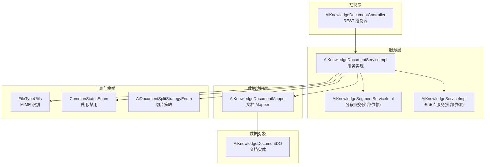
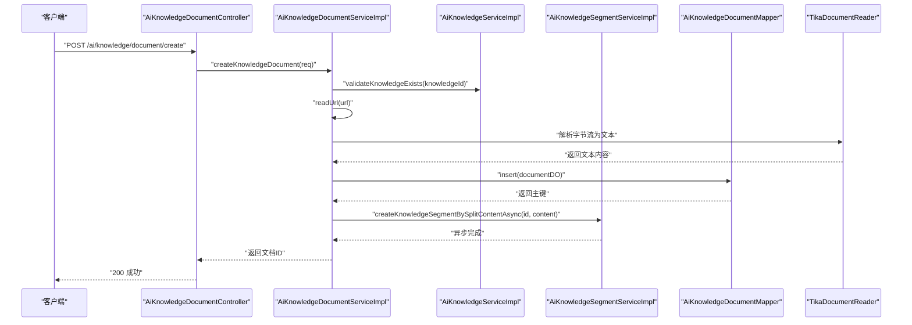
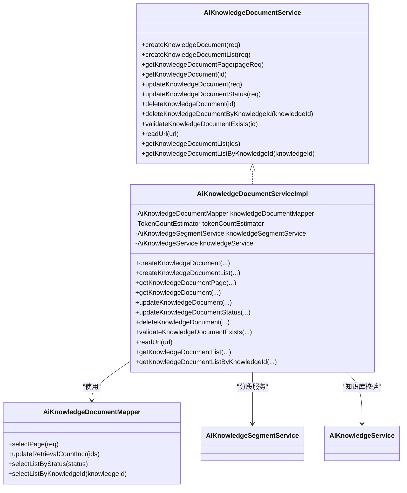
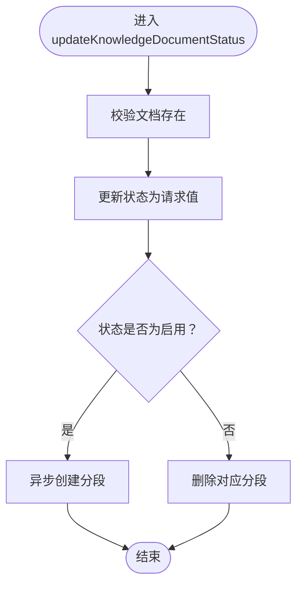
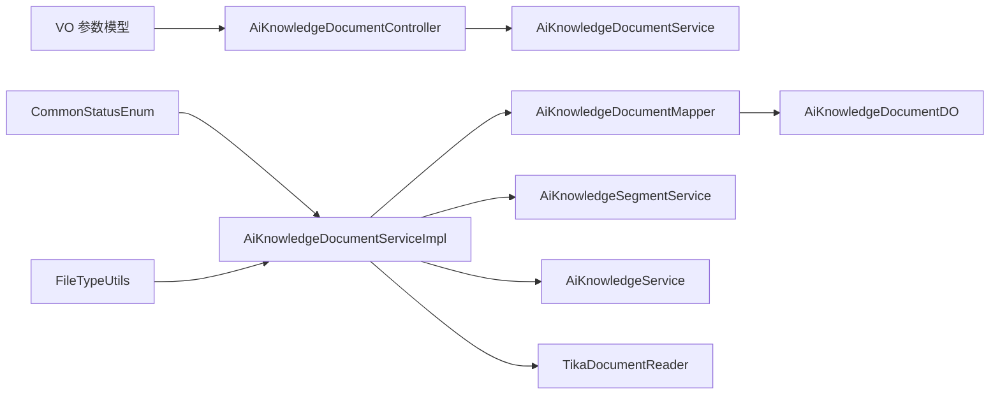

# 文档管理

<cite>
**本文引用的文件**
- [AiKnowledgeDocumentController.java](file://src/main/java/cn/boss/data/ai/controller/knowledge/AiKnowledgeDocumentController.java)
- [AiKnowledgeDocumentService.java](file://src/main/java/cn/boss/data/ai/service/knowledge/AiKnowledgeDocumentService.java)
- [AiKnowledgeDocumentServiceImpl.java](file://src/main/java/cn/boss/data/ai/service/knowledge/AiKnowledgeDocumentServiceImpl.java)
- [AiKnowledgeDocumentDO.java](file://src/main/java/cn/boss/data/ai/dal/dataobject/knowledge/AiKnowledgeDocumentDO.java)
- [AiKnowledgeDocumentMapper.java](file://src/main/java/cn/boss/data/ai/dal/mysql/knowledge/AiKnowledgeDocumentMapper.java)
- [AiKnowledgeDocumentCreateListReqVO.java](file://src/main/java/cn/boss/data/ai/controller/knowledge/vo/document/AiKnowledgeDocumentCreateListReqVO.java)
- [AiKnowledgeDocumentPageReqVO.java](file://src/main/java/cn/boss/data/ai/controller/knowledge/vo/document/AiKnowledgeDocumentPageReqVO.java)
- [AiKnowledgeDocumentUpdateReqVO.java](file://src/main/java/cn/boss/data/ai/controller/knowledge/vo/document/AiKnowledgeDocumentUpdateReqVO.java)
- [AiKnowledgeDocumentUpdateStatusReqVO.java](file://src/main/java/cn/boss/data/ai/controller/knowledge/vo/document/AiKnowledgeDocumentUpdateStatusReqVO.java)
- [CommonStatusEnum.java](file://src/main/java/cn/boss/data/ai/framework/common/enums/CommonStatusEnum.java)
- [FileTypeUtils.java](file://src/main/java/cn/boss/data/ai/util/FileTypeUtils.java)
- [AiDocumentSplitStrategyEnum.java](file://src/main/java/cn/boss/data/ai/enums/AiDocumentSplitStrategyEnum.java)
</cite>

## 目录
1. [简介](#简介)
2. [项目结构](#项目结构)
3. [核心组件](#核心组件)
4. [架构总览](#架构总览)
5. [详细组件分析](#详细组件分析)
6. [依赖分析](#依赖分析)
7. [性能考虑](#性能考虑)
8. [故障排查指南](#故障排查指南)
9. [结论](#结论)
10. [附录：API 接口定义](#附录api-接口定义)

## 简介
本技术文档围绕“文档管理”能力进行系统性梳理，覆盖以下主题：
- 文档上传与内容解析：从 URL 下载、格式识别、内容提取到入库
- 状态管理：启用/禁用的业务规则与联动处理
- 分页查询：基于知识库维度的分页检索
- 存储策略：文档正文、长度、Token 计数、分段最大 Token 等字段设计
- 错误处理与安全校验：下载失败、空文件、读取失败、状态枚举约束
- 文档与知识库的关系：一对多关联与级联删除
- 前端集成建议与后端处理流程图

## 项目结构
文档管理相关模块采用典型的分层架构：
- 控制层：对外暴露 REST API，负责请求参数校验与响应封装
- 服务层：编排业务逻辑，协调 Mapper、分段服务与外部工具
- 数据访问层：MyBatis Mapper 负责数据库 CRUD 与分页
- 数据对象：DO 描述表结构，包含状态、内容、统计字段等
- VO/DTO：请求与响应参数模型，配合校验注解
- 工具与枚举：Tika 类型识别、通用状态枚举、切片策略枚举

图表来源
- [AiKnowledgeDocumentController.java:1-84](file://src/main/java/cn/boss/data/ai/controller/knowledge/AiKnowledgeDocumentController.java#L1-L84)
- [AiKnowledgeDocumentServiceImpl.java:1-227](file://src/main/java/cn/boss/data/ai/service/knowledge/AiKnowledgeDocumentServiceImpl.java#L1-L227)
- [AiKnowledgeDocumentMapper.java:1-42](file://src/main/java/cn/boss/data/ai/dal/mysql/knowledge/AiKnowledgeDocumentMapper.java#L1-L42)
- [AiKnowledgeDocumentDO.java:1-41](file://src/main/java/cn/boss/data/ai/dal/dataobject/knowledge/AiKnowledgeDocumentDO.java#L1-L41)
- [FileTypeUtils.java:1-24](file://src/main/java/cn/boss/data/ai/util/FileTypeUtils.java#L1-L24)
- [CommonStatusEnum.java:1-36](file://src/main/java/cn/boss/data/ai/framework/common/enums/CommonStatusEnum.java#L1-L36)
- [AiDocumentSplitStrategyEnum.java:1-52](file://src/main/java/cn/boss/data/ai/enums/AiDocumentSplitStrategyEnum.java#L1-L52)

章节来源
- [AiKnowledgeDocumentController.java:1-84](file://src/main/java/cn/boss/data/ai/controller/knowledge/AiKnowledgeDocumentController.java#L1-L84)
- [AiKnowledgeDocumentServiceImpl.java:1-227](file://src/main/java/cn/boss/data/ai/service/knowledge/AiKnowledgeDocumentServiceImpl.java#L1-L227)
- [AiKnowledgeDocumentMapper.java:1-42](file://src/main/java/cn/boss/data/ai/dal/mysql/knowledge/AiKnowledgeDocumentMapper.java#L1-L42)
- [AiKnowledgeDocumentDO.java:1-41](file://src/main/java/cn/boss/data/ai/dal/dataobject/knowledge/AiKnowledgeDocumentDO.java#L1-L41)

## 核心组件
- 控制器：提供分页查询、详情获取、创建（单个/批量）、更新、更新状态、删除等接口
- 服务接口与实现：封装业务规则，协调下载、解析、入库、分段、状态联动
- Mapper：提供分页、按状态/知识库筛选、批量更新检索计数等方法
- DO：持久化文档元数据与统计字段
- VO：请求参数模型，含必填、URL 校验、状态枚举校验
- 工具与枚举：Tika 类型识别、通用状态枚举、切片策略枚举

章节来源
- [AiKnowledgeDocumentController.java:22-84](file://src/main/java/cn/boss/data/ai/controller/knowledge/AiKnowledgeDocumentController.java#L22-L84)
- [AiKnowledgeDocumentService.java:17-126](file://src/main/java/cn/boss/data/ai/service/knowledge/AiKnowledgeDocumentService.java#L17-L126)
- [AiKnowledgeDocumentServiceImpl.java:36-227](file://src/main/java/cn/boss/data/ai/service/knowledge/AiKnowledgeDocumentServiceImpl.java#L36-L227)
- [AiKnowledgeDocumentMapper.java:14-42](file://src/main/java/cn/boss/data/ai/dal/mysql/knowledge/AiKnowledgeDocumentMapper.java#L14-L42)
- [AiKnowledgeDocumentDO.java:10-41](file://src/main/java/cn/boss/data/ai/dal/dataobject/knowledge/AiKnowledgeDocumentDO.java#L10-L41)
- [AiKnowledgeDocumentCreateListReqVO.java:12-43](file://src/main/java/cn/boss/data/ai/controller/knowledge/vo/document/AiKnowledgeDocumentCreateListReqVO.java#L12-L43)
- [AiKnowledgeDocumentPageReqVO.java:7-18](file://src/main/java/cn/boss/data/ai/controller/knowledge/vo/document/AiKnowledgeDocumentPageReqVO.java#L7-L18)
- [AiKnowledgeDocumentUpdateReqVO.java:7-22](file://src/main/java/cn/boss/data/ai/controller/knowledge/vo/document/AiKnowledgeDocumentUpdateReqVO.java#L7-L22)
- [AiKnowledgeDocumentUpdateStatusReqVO.java:9-23](file://src/main/java/cn/boss/data/ai/controller/knowledge/vo/document/AiKnowledgeDocumentUpdateStatusReqVO.java#L9-L23)
- [CommonStatusEnum.java:10-36](file://src/main/java/cn/boss/data/ai/framework/common/enums/CommonStatusEnum.java#L10-L36)
- [FileTypeUtils.java:7-24](file://src/main/java/cn/boss/data/ai/util/FileTypeUtils.java#L7-L24)
- [AiDocumentSplitStrategyEnum.java:6-52](file://src/main/java/cn/boss/data/ai/enums/AiDocumentSplitStrategyEnum.java#L6-L52)

## 架构总览
文档管理的端到端流程如下：
- 控制器接收请求，调用服务层
- 服务层校验知识库存在性，下载 URL 内容，使用 Tika 解析文本
- 将文档正文、长度、Token 数、状态等写入数据库
- 异步触发分段服务，按策略生成向量片段
- 更新状态时，根据启用/禁用联动创建或删除分段
- 分页查询基于知识库 ID 与名称模糊匹配

图表来源
- [AiKnowledgeDocumentController.java:46-51](file://src/main/java/cn/boss/data/ai/controller/knowledge/AiKnowledgeDocumentController.java#L46-L51)
- [AiKnowledgeDocumentServiceImpl.java:57-74](file://src/main/java/cn/boss/data/ai/service/knowledge/AiKnowledgeDocumentServiceImpl.java#L57-L74)
- [AiKnowledgeDocumentMapper.java:18-25](file://src/main/java/cn/boss/data/ai/dal/mysql/knowledge/AiKnowledgeDocumentMapper.java#L18-L25)

## 详细组件分析

### 控制器层：AiKnowledgeDocumentController
- 提供的接口
  - GET /ai/knowledge/document/page：分页查询
  - GET /ai/knowledge/document/get：获取详情
  - POST /ai/knowledge/document/create：创建单个文档
  - POST /ai/knowledge/document/create-list：批量创建文档
  - PUT /ai/knowledge/document/update：更新文档
  - PUT /ai/knowledge/document/update-status：更新文档状态
  - DELETE /ai/knowledge/document/delete：删除文档
- 参数模型
  - 分页：AiKnowledgeDocumentPageReqVO（继承 PageParam）
  - 创建：AiKnowledgeDocumentCreateListReqVO（批量）；另见知识库文档创建 VO（未在本文展开）
  - 更新：AiKnowledgeDocumentUpdateReqVO
  - 更新状态：AiKnowledgeDocumentUpdateStatusReqVO（状态值受 CommonStatusEnum 约束）

章节来源
- [AiKnowledgeDocumentController.java:31-81](file://src/main/java/cn/boss/data/ai/controller/knowledge/AiKnowledgeDocumentController.java#L31-L81)
- [AiKnowledgeDocumentPageReqVO.java:7-18](file://src/main/java/cn/boss/data/ai/controller/knowledge/vo/document/AiKnowledgeDocumentPageReqVO.java#L7-L18)
- [AiKnowledgeDocumentCreateListReqVO.java:12-43](file://src/main/java/cn/boss/data/ai/controller/knowledge/vo/document/AiKnowledgeDocumentCreateListReqVO.java#L12-L43)
- [AiKnowledgeDocumentUpdateReqVO.java:7-22](file://src/main/java/cn/boss/data/ai/controller/knowledge/vo/document/AiKnowledgeDocumentUpdateReqVO.java#L7-L22)
- [AiKnowledgeDocumentUpdateStatusReqVO.java:9-23](file://src/main/java/cn/boss/data/ai/controller/knowledge/vo/document/AiKnowledgeDocumentUpdateStatusReqVO.java#L9-L23)

### 服务层：AiKnowledgeDocumentService 与实现
- 主要职责
  - 单个/批量创建：下载 URL 内容，解析文本，计算长度与 Token 数，写入状态为启用
  - 分页查询：基于知识库 ID 与名称模糊匹配
  - 更新：支持名称与分段最大 Token 数变更；当处于启用状态且分段最大 Token 变更时，重建分段
  - 更新状态：启用则异步创建分段；禁用则删除对应分段
  - 删除：删除文档并级联删除其分段
  - 校验：文档存在性校验与知识库存在性校验
  - 读取 URL：下载字节流，使用 Tika 解析为文本
- 关键点
  - 使用 TokenCountEstimator 进行 Token 估算
  - 使用 TikaDocumentReader 读取多种格式文本
  - 状态枚举统一为 CommonStatusEnum（启用/禁用）

图表来源
- [AiKnowledgeDocumentService.java:17-126](file://src/main/java/cn/boss/data/ai/service/knowledge/AiKnowledgeDocumentService.java#L17-L126)
- [AiKnowledgeDocumentServiceImpl.java:36-227](file://src/main/java/cn/boss/data/ai/service/knowledge/AiKnowledgeDocumentServiceImpl.java#L36-L227)
- [AiKnowledgeDocumentMapper.java:14-42](file://src/main/java/cn/boss/data/ai/dal/mysql/knowledge/AiKnowledgeDocumentMapper.java#L14-L42)

章节来源
- [AiKnowledgeDocumentService.java:17-126](file://src/main/java/cn/boss/data/ai/service/knowledge/AiKnowledgeDocumentService.java#L17-L126)
- [AiKnowledgeDocumentServiceImpl.java:36-227](file://src/main/java/cn/boss/data/ai/service/knowledge/AiKnowledgeDocumentServiceImpl.java#L36-L227)
- [AiKnowledgeDocumentMapper.java:14-42](file://src/main/java/cn/boss/data/ai/dal/mysql/knowledge/AiKnowledgeDocumentMapper.java#L14-L42)

### 数据访问层：AiKnowledgeDocumentMapper
- 分页查询：按知识库 ID 与名称模糊匹配，按 ID 倒序
- 统计字段：提供按状态与知识库 ID 的查询
- 原子更新：提供按 ID 集合自增检索计数的 SQL

章节来源
- [AiKnowledgeDocumentMapper.java:20-39](file://src/main/java/cn/boss/data/ai/dal/mysql/knowledge/AiKnowledgeDocumentMapper.java#L20-L39)

### 数据对象：AiKnowledgeDocumentDO
- 字段说明
  - 主键、知识库编号、名称、URL、内容、内容长度、Token 数、分段最大 Token、检索计数、状态
- 状态枚举：启用/禁用，通过 CommonStatusEnum 管理

章节来源
- [AiKnowledgeDocumentDO.java:10-41](file://src/main/java/cn/boss/data/ai/dal/dataobject/knowledge/AiKnowledgeDocumentDO.java#L10-L41)
- [CommonStatusEnum.java:10-36](file://src/main/java/cn/boss/data/ai/framework/common/enums/CommonStatusEnum.java#L10-L36)

### 请求参数模型与校验
- 批量创建：知识库编号、分段最大 Token、文档列表（名称、URL），URL 格式校验
- 分页：知识库 ID、名称（模糊匹配）
- 更新：文档编号、可选名称、可选分段最大 Token
- 更新状态：文档编号、状态值（枚举校验）

章节来源
- [AiKnowledgeDocumentCreateListReqVO.java:12-43](file://src/main/java/cn/boss/data/ai/controller/knowledge/vo/document/AiKnowledgeDocumentCreateListReqVO.java#L12-L43)
- [AiKnowledgeDocumentPageReqVO.java:7-18](file://src/main/java/cn/boss/data/ai/controller/knowledge/vo/document/AiKnowledgeDocumentPageReqVO.java#L7-L18)
- [AiKnowledgeDocumentUpdateReqVO.java:7-22](file://src/main/java/cn/boss/data/ai/controller/knowledge/vo/document/AiKnowledgeDocumentUpdateReqVO.java#L7-L22)
- [AiKnowledgeDocumentUpdateStatusReqVO.java:9-23](file://src/main/java/cn/boss/data/ai/controller/knowledge/vo/document/AiKnowledgeDocumentUpdateStatusReqVO.java#L9-L23)

### 文档格式识别与文件类型验证
- 内容解析：使用 TikaDocumentReader 读取 URL 下载的字节流，提取文本内容
- MIME 类型识别：FileTypeUtils 提供 MIME 类型检测与图片类型判断
- 文件类型验证：URL 格式由 VO 层校验；实际下载与解析由 Tika 执行

章节来源
- [AiKnowledgeDocumentServiceImpl.java:173-196](file://src/main/java/cn/boss/data/ai/service/knowledge/AiKnowledgeDocumentServiceImpl.java#L173-L196)
- [FileTypeUtils.java:13-23](file://src/main/java/cn/boss/data/ai/util/FileTypeUtils.java#L13-L23)

### 存储策略与字段设计
- 文档正文 content：存储解析后的纯文本
- 内容长度 contentLength：字符长度
- Token 数 tokens：基于 TokenCountEstimator 的估算值
- 分段最大 Token segmentMaxTokens：影响后续分段策略
- 状态 status：启用/禁用
- 检索计数 retrievalCount：用于统计命中次数（原子自增）

章节来源
- [AiKnowledgeDocumentDO.java:18-38](file://src/main/java/cn/boss/data/ai/dal/dataobject/knowledge/AiKnowledgeDocumentDO.java#L18-L38)
- [AiKnowledgeDocumentMapper.java:27-31](file://src/main/java/cn/boss/data/ai/dal/mysql/knowledge/AiKnowledgeDocumentMapper.java#L27-L31)

### 文档状态管理（启用/禁用）
- 启用：异步创建分段；若分段最大 Token 变更且文档处于启用状态，先删除旧分段再重建
- 禁用：删除对应分段
- 状态枚举：CommonStatusEnum.ENALBE/DISABLE

图表来源
- [AiKnowledgeDocumentServiceImpl.java:134-149](file://src/main/java/cn/boss/data/ai/service/knowledge/AiKnowledgeDocumentServiceImpl.java#L134-L149)

章节来源
- [AiKnowledgeDocumentServiceImpl.java:134-149](file://src/main/java/cn/boss/data/ai/service/knowledge/AiKnowledgeDocumentServiceImpl.java#L134-L149)
- [CommonStatusEnum.java:12-36](file://src/main/java/cn/boss/data/ai/framework/common/enums/CommonStatusEnum.java#L12-L36)

### 分页查询实现
- 条件：知识库 ID（可选）、名称（模糊匹配）
- 排序：按 ID 倒序
- 返回：PageResult 包裹 DO 列表

章节来源
- [AiKnowledgeDocumentMapper.java:20-25](file://src/main/java/cn/boss/data/ai/dal/mysql/knowledge/AiKnowledgeDocumentMapper.java#L20-L25)
- [AiKnowledgeDocumentPageReqVO.java:9-17](file://src/main/java/cn/boss/data/ai/controller/knowledge/vo/document/AiKnowledgeDocumentPageReqVO.java#L9-L17)

### 错误处理机制
- 文档不存在：抛出“文档不存在”异常
- 下载失败：抛出“文件下载失败”异常
- 空文件：抛出“文件为空”异常
- 读取失败：抛出“文件读取失败”异常
- 状态枚举：通过 InEnum 校验

章节来源
- [AiKnowledgeDocumentServiceImpl.java:164-171](file://src/main/java/cn/boss/data/ai/service/knowledge/AiKnowledgeDocumentServiceImpl.java#L164-L171)
- [AiKnowledgeDocumentServiceImpl.java:173-196](file://src/main/java/cn/boss/data/ai/service/knowledge/AiKnowledgeDocumentServiceImpl.java#L173-L196)
- [AiKnowledgeDocumentUpdateStatusReqVO.java:19](file://src/main/java/cn/boss/data/ai/controller/knowledge/vo/document/AiKnowledgeDocumentUpdateStatusReqVO.java#L19)

### 安全与验证策略
- URL 格式校验：使用 @URL 注解
- 必填字段校验：@NotNull/@NotBlank
- 状态值校验：@InEnum(CommonStatusEnum.class)
- 下载与解析：仅允许已知格式的文本内容被入库

章节来源
- [AiKnowledgeDocumentCreateListReqVO.java:37](file://src/main/java/cn/boss/data/ai/controller/knowledge/vo/document/AiKnowledgeDocumentCreateListReqVO.java#L37)
- [AiKnowledgeDocumentUpdateStatusReqVO.java:19](file://src/main/java/cn/boss/data/ai/controller/knowledge/vo/document/AiKnowledgeDocumentUpdateStatusReqVO.java#L19)

### 文档与知识库的关系与数据流转
- 关系：一个知识库可包含多个文档（一对多）
- 级联删除：删除知识库时，会遍历并删除其下所有文档及对应分段
- 流转：创建文档时先校验知识库存在性，再下载解析，入库后异步分段

章节来源
- [AiKnowledgeDocumentServiceImpl.java:211-224](file://src/main/java/cn/boss/data/ai/service/knowledge/AiKnowledgeDocumentServiceImpl.java#L211-L224)
- [AiKnowledgeDocumentDO.java:21-24](file://src/main/java/cn/boss/data/ai/dal/dataobject/knowledge/AiKnowledgeDocumentDO.java#L21-L24)

## 依赖分析
- 控制器依赖服务接口
- 服务实现依赖 Mapper、分段服务、知识库服务、Tika、Token 计数器
- Mapper 依赖 MyBatis 基类与查询包装器
- DO 依赖基础实体基类
- VO 依赖 Swagger 注解与校验注解
- 工具与枚举提供通用能力

图表来源
- [AiKnowledgeDocumentController.java:28-29](file://src/main/java/cn/boss/data/ai/controller/knowledge/AiKnowledgeDocumentController.java#L28-L29)
- [AiKnowledgeDocumentServiceImpl.java:45-55](file://src/main/java/cn/boss/data/ai/service/knowledge/AiKnowledgeDocumentServiceImpl.java#L45-L55)
- [AiKnowledgeDocumentMapper.java:18](file://src/main/java/cn/boss/data/ai/dal/mysql/knowledge/AiKnowledgeDocumentMapper.java#L18)
- [AiKnowledgeDocumentDO.java:16](file://src/main/java/cn/boss/data/ai/dal/dataobject/knowledge/AiKnowledgeDocumentDO.java#L16)

## 性能考虑
- 异步分段：创建/更新/状态变更触发分段异步处理，避免阻塞主流程
- 批量插入：批量创建使用批量插入，减少数据库往返
- Token 估算：提前估算 Token 数，便于后续分段策略与检索优化
- 原子自增：检索计数使用原生 SQL 自增，降低并发冲突概率

## 故障排查指南
- “文件下载失败”：检查 URL 可达性、网络代理、超时设置
- “文件为空”：确认 URL 指向有效资源，避免空字节流
- “文件读取失败”：确认文件格式可被 Tika 识别，必要时转换为标准文本格式
- “文档不存在”：确认文档 ID 正确，或检查是否已被删除
- “状态更新无效”：确认状态值在枚举范围内

章节来源
- [AiKnowledgeDocumentServiceImpl.java:173-196](file://src/main/java/cn/boss/data/ai/service/knowledge/AiKnowledgeDocumentServiceImpl.java#L173-L196)
- [AiKnowledgeDocumentServiceImpl.java:164-171](file://src/main/java/cn/boss/data/ai/service/knowledge/AiKnowledgeDocumentServiceImpl.java#L164-L171)
- [AiKnowledgeDocumentUpdateStatusReqVO.java:19](file://src/main/java/cn/boss/data/ai/controller/knowledge/vo/document/AiKnowledgeDocumentUpdateStatusReqVO.java#L19)

## 结论
文档管理模块通过清晰的分层设计与完善的校验机制，实现了从 URL 下载、格式识别、内容入库到异步分段的完整闭环。状态管理与知识库级联删除进一步增强了系统的可维护性与一致性。建议在生产环境中结合 Token 估算与分段策略进行容量规划，并持续监控下载与解析成功率。

## 附录：API 接口定义

- 获取文档分页
  - 方法：GET
  - 路径：/ai/knowledge/document/page
  - 请求参数：AiKnowledgeDocumentPageReqVO
  - 响应：PageResult<AiKnowledgeDocumentRespVO>

- 获取文档详情
  - 方法：GET
  - 路径：/ai/knowledge/document/get
  - 查询参数：id（Long）
  - 响应：AiKnowledgeDocumentRespVO

- 新建文档（单个）
  - 方法：POST
  - 路径：/ai/knowledge/document/create
  - 请求体：AiKnowledgeDocumentCreateReqVO
  - 响应：Long（文档 ID）

- 新建文档（多个）
  - 方法：POST
  - 路径：/ai/knowledge/document/create-list
  - 请求体：AiKnowledgeDocumentCreateListReqVO
  - 响应：List<Long>

- 更新文档
  - 方法：PUT
  - 路径：/ai/knowledge/document/update
  - 请求体：AiKnowledgeDocumentUpdateReqVO
  - 响应：Boolean（true）

- 更新文档状态
  - 方法：PUT
  - 路径：/ai/knowledge/document/update-status
  - 请求体：AiKnowledgeDocumentUpdateStatusReqVO
  - 响应：Boolean（true）

- 删除文档
  - 方法：DELETE
  - 路径：/ai/knowledge/document/delete
  - 查询参数：id（Long）
  - 响应：Boolean（true）

章节来源
- [AiKnowledgeDocumentController.java:31-81](file://src/main/java/cn/boss/data/ai/controller/knowledge/AiKnowledgeDocumentController.java#L31-L81)