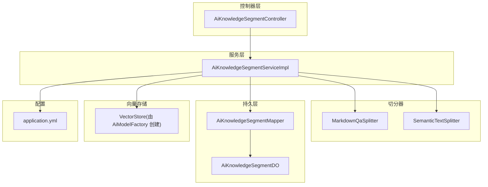
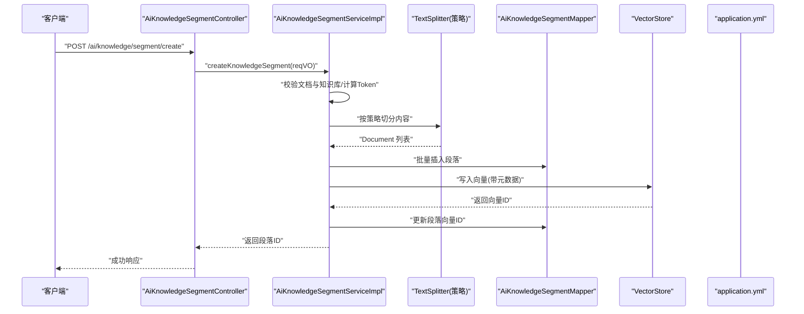
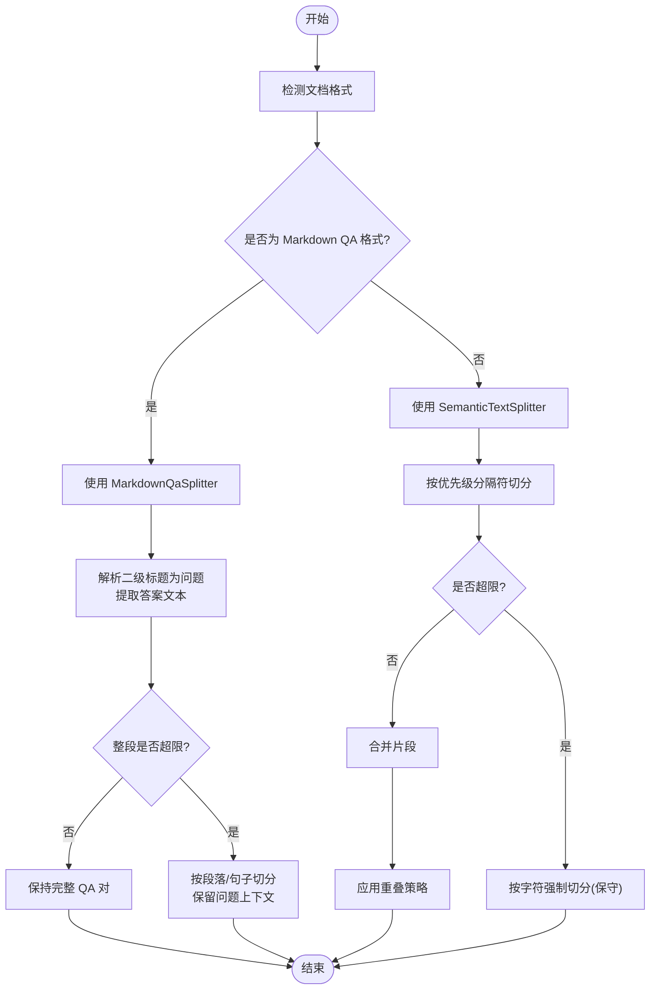
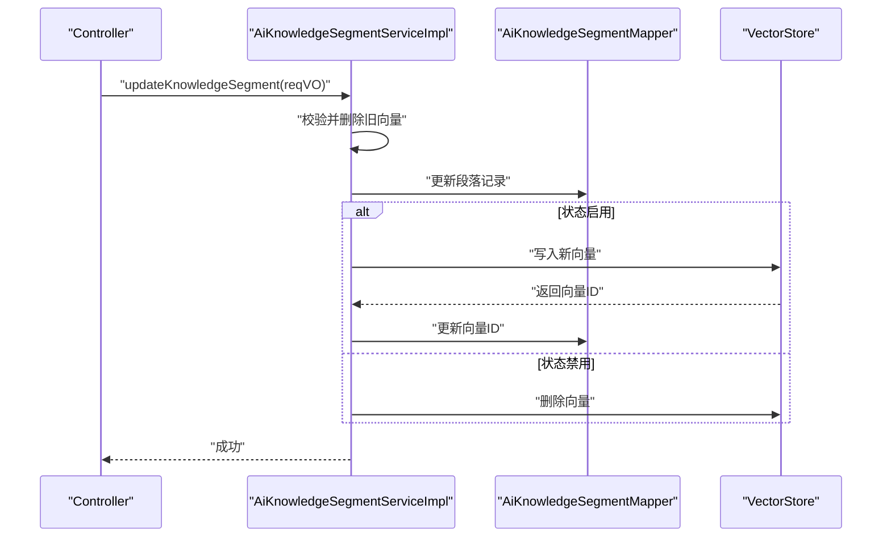
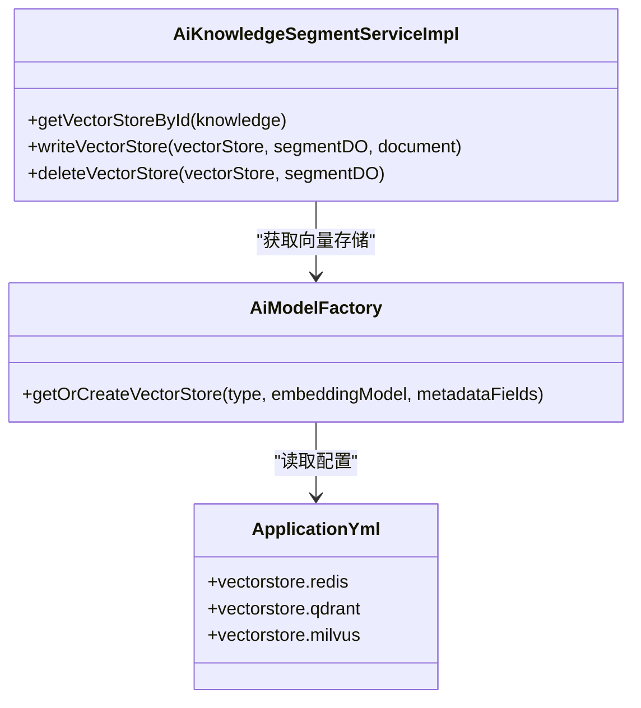
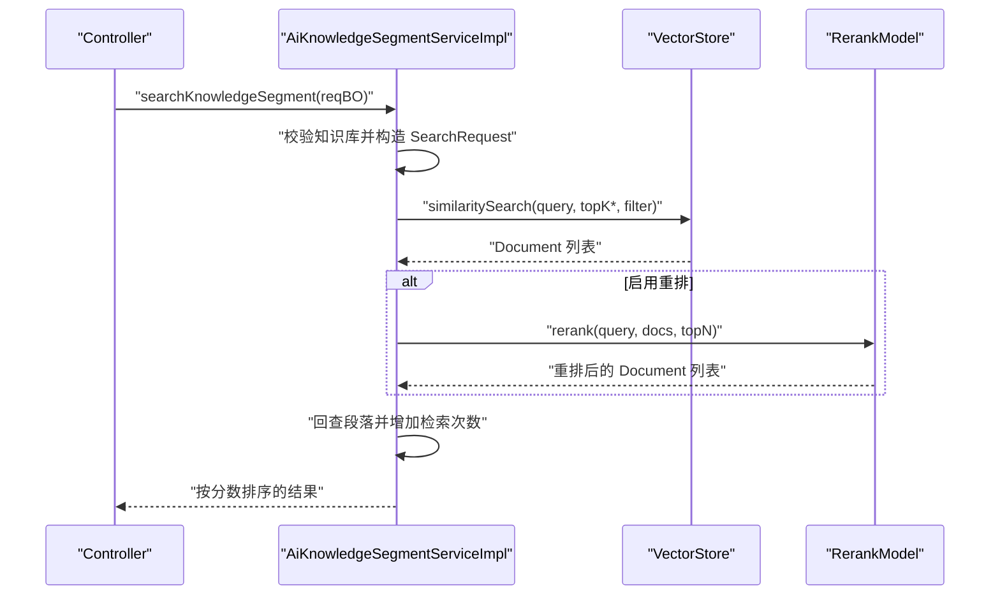
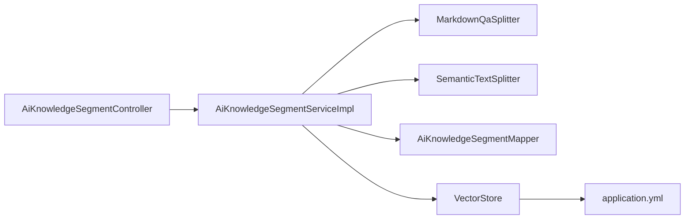
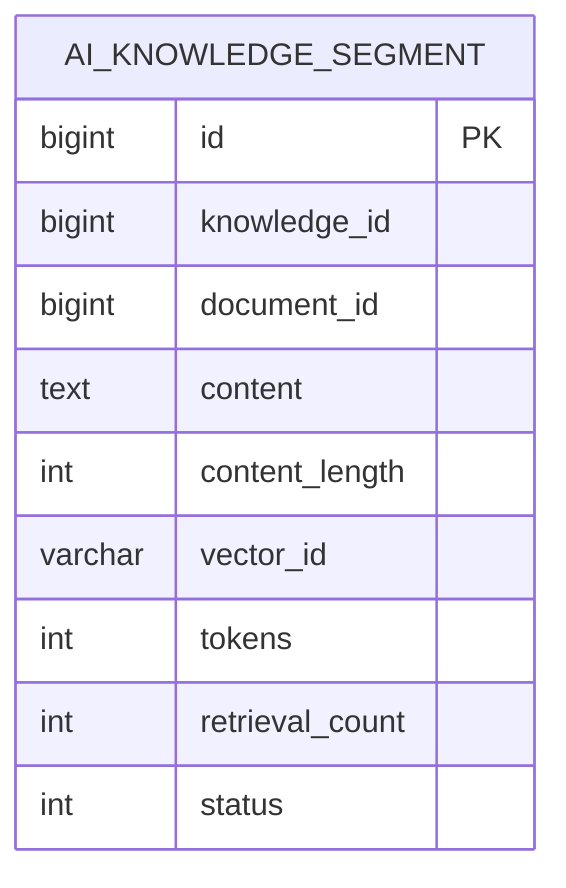

# 段落处理

<cite>
**本文引用的文件**
- [MarkdownQaSplitter.java](file://src/main/java/cn/boss/data/ai/service/knowledge/splitter/MarkdownQaSplitter.java)
- [SemanticTextSplitter.java](file://src/main/java/cn/boss/data/ai/service/knowledge/splitter/SemanticTextSplitter.java)
- [AiKnowledgeSegmentServiceImpl.java](file://src/main/java/cn/boss/data/ai/service/knowledge/AiKnowledgeSegmentServiceImpl.java)
- [AiKnowledgeSegmentController.java](file://src/main/java/cn/boss/data/ai/controller/knowledge/AiKnowledgeSegmentController.java)
- [AiKnowledgeSegmentDO.java](file://src/main/java/cn/boss/data/ai/dal/dataobject/knowledge/AiKnowledgeSegmentDO.java)
- [AiKnowledgeSegmentMapper.java](file://src/main/java/cn/boss/data/ai/dal/mysql/knowledge/AiKnowledgeSegmentMapper.java)
- [AiDocumentSplitStrategyEnum.java](file://src/main/java/cn/boss/data/ai/enums/AiDocumentSplitStrategyEnum.java)
- [AiKnowledgeSegmentSearchReqBO.java](file://src/main/java/cn/boss/data/ai/service/knowledge/bo/AiKnowledgeSegmentSearchReqBO.java)
- [AiKnowledgeSegmentSearchRespBO.java](file://src/main/java/cn/boss/data/ai/service/knowledge/bo/AiKnowledgeSegmentSearchRespBO.java)
- [AiKnowledgeSegmentSaveReqVO.java](file://src/main/java/cn/boss/data/ai/controller/knowledge/vo/segment/AiKnowledgeSegmentSaveReqVO.java)
- [AiKnowledgeSegmentPageReqVO.java](file://src/main/java/cn/boss/data/ai/controller/knowledge/vo/segment/AiKnowledgeSegmentPageReqVO.java)
- [application.yml](file://src/main/resources/application.yml)
- [AiModelFactory.java](file://src/main/java/cn/boss/data/ai/framework/ai/core/model/AiModelFactory.java)
</cite>

## 目录
1. [简介](#简介)
2. [项目结构](#项目结构)
3. [核心组件](#核心组件)
4. [架构总览](#架构总览)
5. [详细组件分析](#详细组件分析)
6. [依赖分析](#依赖分析)
7. [性能考虑](#性能考虑)
8. [故障排查指南](#故障排查指南)
9. [结论](#结论)
10. [附录](#附录)

## 简介
本技术文档围绕“段落处理”能力，系统阐述文档切分算法与向量化检索的完整实现。重点包括：
- 文档切分算法：MarkdownQA 切分器与语义切分器的工作机制与差异
- 段落保存、状态管理与分页查询流程
- 向量化处理：嵌入模型选择与向量维度配置
- RAG 检索：从查询到结果返回的端到端流程
- 性能优化与批量处理策略
- 完整 API 接口说明与使用示例

## 项目结构
段落处理相关模块位于知识库服务层，采用“控制器-服务-持久层-切分器-向量存储”的分层设计，配合策略枚举与 VO/BO 对象完成端到端流程。

图表来源
- [AiKnowledgeSegmentController.java:1-123](file://src/main/java/cn/boss/data/ai/controller/knowledge/AiKnowledgeSegmentController.java#L1-L123)
- [AiKnowledgeSegmentServiceImpl.java:1-497](file://src/main/java/cn/boss/data/ai/service/knowledge/AiKnowledgeSegmentServiceImpl.java#L1-L497)
- [MarkdownQaSplitter.java:1-343](file://src/main/java/cn/boss/data/ai/service/knowledge/splitter/MarkdownQaSplitter.java#L1-L343)
- [SemanticTextSplitter.java:1-302](file://src/main/java/cn/boss/data/ai/service/knowledge/splitter/SemanticTextSplitter.java#L1-L302)
- [AiKnowledgeSegmentMapper.java:1-65](file://src/main/java/cn/boss/data/ai/dal/mysql/knowledge/AiKnowledgeSegmentMapper.java#L1-L65)
- [AiKnowledgeSegmentDO.java:1-47](file://src/main/java/cn/boss/data/ai/dal/dataobject/knowledge/AiKnowledgeSegmentDO.java#L1-L47)
- [application.yml:79-149](file://src/main/resources/application.yml#L79-L149)

章节来源
- [AiKnowledgeSegmentController.java:1-123](file://src/main/java/cn/boss/data/ai/controller/knowledge/AiKnowledgeSegmentController.java#L1-L123)
- [AiKnowledgeSegmentServiceImpl.java:1-497](file://src/main/java/cn/boss/data/ai/service/knowledge/AiKnowledgeSegmentServiceImpl.java#L1-L497)
- [MarkdownQaSplitter.java:1-343](file://src/main/java/cn/boss/data/ai/service/knowledge/splitter/MarkdownQaSplitter.java#L1-L343)
- [SemanticTextSplitter.java:1-302](file://src/main/java/cn/boss/data/ai/service/knowledge/splitter/SemanticTextSplitter.java#L1-L302)
- [AiKnowledgeSegmentMapper.java:1-65](file://src/main/java/cn/boss/data/ai/dal/mysql/knowledge/AiKnowledgeSegmentMapper.java#L1-L65)
- [AiKnowledgeSegmentDO.java:1-47](file://src/main/java/cn/boss/data/ai/dal/dataobject/knowledge/AiKnowledgeSegmentDO.java#L1-L47)
- [application.yml:79-149](file://src/main/resources/application.yml#L79-L149)

## 核心组件
- 文档切分器
  - MarkdownQaSplitter：面向 Markdown QA 格式的专用切分器，识别二级标题作为问题，保持 QA 对完整性，并对长答案进行智能切分，同时保留问题作为上下文。
  - SemanticTextSplitter：语义化切分器，优先在段落边界（双换行）切分，其次在句子边界切分，避免截断，支持中英文标点识别，并可配置重叠以增强上下文连贯性。
- 段落服务实现
  - AiKnowledgeSegmentServiceImpl：负责段落的切分、保存、状态变更、向量化写入与删除、重新索引、RAG 检索与重排等全流程。
- 控制器
  - AiKnowledgeSegmentController：对外暴露分页、详情、创建、更新、状态更新、切片预览、处理进度查询、检索等接口。
- 数据对象与映射
  - AiKnowledgeSegmentDO：段落数据对象，包含内容、向量 ID、Token 数、状态、检索次数等字段。
  - AiKnowledgeSegmentMapper：提供分页、按向量 ID 查询、按文档/知识库状态查询、处理进度统计、检索次数自增等方法。
- 策略枚举
  - AiDocumentSplitStrategyEnum：定义自动、Token 切分、段落切分、Markdown QA 切分、语义切分五种策略及描述。
- 检索 BO/VO
  - AiKnowledgeSegmentSearchReqBO：检索请求 BO，包含知识库编号、内容、topK、相似度阈值。
  - AiKnowledgeSegmentSearchRespBO：检索响应 BO，包含段落基础信息与相似度分数。

章节来源
- [MarkdownQaSplitter.java:15-343](file://src/main/java/cn/boss/data/ai/service/knowledge/splitter/MarkdownQaSplitter.java#L15-L343)
- [SemanticTextSplitter.java:14-302](file://src/main/java/cn/boss/data/ai/service/knowledge/splitter/SemanticTextSplitter.java#L14-L302)
- [AiKnowledgeSegmentServiceImpl.java:49-497](file://src/main/java/cn/boss/data/ai/service/knowledge/AiKnowledgeSegmentServiceImpl.java#L49-L497)
- [AiKnowledgeSegmentController.java:33-123](file://src/main/java/cn/boss/data/ai/controller/knowledge/AiKnowledgeSegmentController.java#L33-L123)
- [AiKnowledgeSegmentDO.java:10-47](file://src/main/java/cn/boss/data/ai/dal/dataobject/knowledge/AiKnowledgeSegmentDO.java#L10-L47)
- [AiKnowledgeSegmentMapper.java:17-65](file://src/main/java/cn/boss/data/ai/dal/mysql/knowledge/AiKnowledgeSegmentMapper.java#L17-L65)
- [AiDocumentSplitStrategyEnum.java:6-52](file://src/main/java/cn/boss/data/ai/enums/AiDocumentSplitStrategyEnum.java#L6-L52)
- [AiKnowledgeSegmentSearchReqBO.java:7-36](file://src/main/java/cn/boss/data/ai/service/knowledge/bo/AiKnowledgeSegmentSearchReqBO.java#L7-L36)
- [AiKnowledgeSegmentSearchRespBO.java:5-44](file://src/main/java/cn/boss/data/ai/service/knowledge/bo/AiKnowledgeSegmentSearchRespBO.java#L5-L44)

## 架构总览
段落处理的端到端架构如下：

图表来源
- [AiKnowledgeSegmentController.java:60-71](file://src/main/java/cn/boss/data/ai/controller/knowledge/AiKnowledgeSegmentController.java#L60-L71)
- [AiKnowledgeSegmentServiceImpl.java:458-481](file://src/main/java/cn/boss/data/ai/service/knowledge/AiKnowledgeSegmentServiceImpl.java#L458-L481)
- [MarkdownQaSplitter.java:62-81](file://src/main/java/cn/boss/data/ai/service/knowledge/splitter/MarkdownQaSplitter.java#L62-L81)
- [SemanticTextSplitter.java:71-77](file://src/main/java/cn/boss/data/ai/service/knowledge/splitter/SemanticTextSplitter.java#L71-L77)
- [AiKnowledgeSegmentMapper.java:23-29](file://src/main/java/cn/boss/data/ai/dal/mysql/knowledge/AiKnowledgeSegmentMapper.java#L23-L29)
- [application.yml:83-99](file://src/main/resources/application.yml#L83-L99)

## 详细组件分析

### 文档切分算法
- MarkdownQA 切分器（MarkdownQaSplitter）
  - 识别规则：通过二级标题（## ）定位问题，提取问题与答案文本，形成 QA 对。
  - 切分策略：
    - 若整个 QA 对未超限，保持完整；
    - 若超限，先按段落切分，再按句子切分，确保语义完整；每个切分片段均保留问题作为上下文。
  - Token 估算：中文按字符估算，英文按单词估算，提供可插拔的 TokenEstimator 接口。
- 语义切分器（SemanticTextSplitter）
  - 切分优先级：段落边界（三换行、双换行、单换行）> 句子边界（中英文标点）。
  - 上下文重叠：可配置 chunkOverlap，合并时保留尾部片段以维持上下文连贯。
  - 强制切分：若仍超限，按字符保守切分，降低语义完整性但保证可用性。
  - Token 估算：复用相同估算策略。

图表来源
- [MarkdownQaSplitter.java:89-143](file://src/main/java/cn/boss/data/ai/service/knowledge/splitter/MarkdownQaSplitter.java#L89-L143)
- [MarkdownQaSplitter.java:152-247](file://src/main/java/cn/boss/data/ai/service/knowledge/splitter/MarkdownQaSplitter.java#L152-L247)
- [SemanticTextSplitter.java:85-115](file://src/main/java/cn/boss/data/ai/service/knowledge/splitter/SemanticTextSplitter.java#L85-L115)
- [SemanticTextSplitter.java:153-205](file://src/main/java/cn/boss/data/ai/service/knowledge/splitter/SemanticTextSplitter.java#L153-L205)

章节来源
- [MarkdownQaSplitter.java:15-343](file://src/main/java/cn/boss/data/ai/service/knowledge/splitter/MarkdownQaSplitter.java#L15-L343)
- [SemanticTextSplitter.java:14-302](file://src/main/java/cn/boss/data/ai/service/knowledge/splitter/SemanticTextSplitter.java#L14-L302)

### 段落保存、状态管理与分页查询
- 保存流程
  - 校验文档与知识库存在性，计算内容 Token 数，按策略切分为 Document 列表。
  - 批量插入段落记录，随后逐条写入向量存储并回填向量 ID。
- 状态管理
  - 更新段落内容时，先删除旧向量，再根据状态决定是否重新向量化。
  - 启用/禁用状态切换时，按状态写入或删除向量。
- 重新索引
  - 按知识库筛选启用状态段落，遍历删除旧向量并重建向量。
- 分页查询
  - 支持按文档 ID、内容关键字、状态分页查询，按 ID 倒序。

图表来源
- [AiKnowledgeSegmentServiceImpl.java:126-142](file://src/main/java/cn/boss/data/ai/service/knowledge/AiKnowledgeSegmentServiceImpl.java#L126-L142)
- [AiKnowledgeSegmentServiceImpl.java:160-177](file://src/main/java/cn/boss/data/ai/service/knowledge/AiKnowledgeSegmentServiceImpl.java#L160-L177)
- [AiKnowledgeSegmentMapper.java:37-41](file://src/main/java/cn/boss/data/ai/dal/mysql/knowledge/AiKnowledgeSegmentMapper.java#L37-L41)

章节来源
- [AiKnowledgeSegmentServiceImpl.java:94-123](file://src/main/java/cn/boss/data/ai/service/knowledge/AiKnowledgeSegmentServiceImpl.java#L94-L123)
- [AiKnowledgeSegmentServiceImpl.java:126-177](file://src/main/java/cn/boss/data/ai/service/knowledge/AiKnowledgeSegmentServiceImpl.java#L126-L177)
- [AiKnowledgeSegmentServiceImpl.java:180-201](file://src/main/java/cn/boss/data/ai/service/knowledge/AiKnowledgeSegmentServiceImpl.java#L180-L201)
- [AiKnowledgeSegmentMapper.java:23-29](file://src/main/java/cn/boss/data/ai/dal/mysql/knowledge/AiKnowledgeSegmentMapper.java#L23-L29)

### 向量化处理与嵌入模型配置
- 向量存储与元数据
  - 段落向量 ID 与知识库 ID、文档 ID、段落 ID 绑定，便于检索后回查。
  - 支持多种向量存储（Redis、Qdrant、Milvus），由配置文件统一声明。
- 嵌入模型与维度
  - 通过 AiModelFactory 获取/创建 EmbeddingModel 与 VectorStore，具体模型与维度取决于配置项。
  - 本项目使用 TokenCountEstimator 进行 Token 估算，向量维度由所选嵌入模型决定。

图表来源
- [AiKnowledgeSegmentServiceImpl.java:203-225](file://src/main/java/cn/boss/data/ai/service/knowledge/AiKnowledgeSegmentServiceImpl.java#L203-L225)
- [AiKnowledgeSegmentServiceImpl.java:333-340](file://src/main/java/cn/boss/data/ai/service/knowledge/AiKnowledgeSegmentServiceImpl.java#L333-L340)
- [AiModelFactory.java:48-60](file://src/main/java/cn/boss/data/ai/framework/ai/core/model/AiModelFactory.java#L48-L60)
- [application.yml:83-99](file://src/main/resources/application.yml#L83-L99)

章节来源
- [AiKnowledgeSegmentServiceImpl.java:203-225](file://src/main/java/cn/boss/data/ai/service/knowledge/AiKnowledgeSegmentServiceImpl.java#L203-L225)
- [AiKnowledgeSegmentServiceImpl.java:333-340](file://src/main/java/cn/boss/data/ai/service/knowledge/AiKnowledgeSegmentServiceImpl.java#L333-L340)
- [AiModelFactory.java:48-60](file://src/main/java/cn/boss/data/ai/framework/ai/core/model/AiModelFactory.java#L48-L60)
- [application.yml:83-99](file://src/main/resources/application.yml#L83-L99)

### RAG 检索完整流程
- 检索步骤
  - 构造 SearchRequest，设置 query、topK、相似度阈值与过滤条件（仅当前知识库）。
  - 向量检索命中后，若启用重排（RerankModel），则调用重排模型，按阈值过滤并返回最终结果。
  - 回查段落记录并增加检索次数，按分数降序返回。
- 重排系数
  - 为提升重排效果，检索 topK 会放大为原始 topK 的倍数，再由重排模型筛选。

图表来源
- [AiKnowledgeSegmentController.java:103-120](file://src/main/java/cn/boss/data/ai/controller/knowledge/AiKnowledgeSegmentController.java#L103-L120)
- [AiKnowledgeSegmentServiceImpl.java:228-295](file://src/main/java/cn/boss/data/ai/service/knowledge/AiKnowledgeSegmentServiceImpl.java#L228-L295)

章节来源
- [AiKnowledgeSegmentServiceImpl.java:228-295](file://src/main/java/cn/boss/data/ai/service/knowledge/AiKnowledgeSegmentServiceImpl.java#L228-L295)
- [AiKnowledgeSegmentController.java:103-120](file://src/main/java/cn/boss/data/ai/controller/knowledge/AiKnowledgeSegmentController.java#L103-L120)

### API 接口文档
- 获取段落详情
  - 方法：GET
  - 路径：/ai/knowledge/segment/get
  - 参数：id（段落编号）
  - 返回：段落详情 VO
- 获取段落分页
  - 方法：GET
  - 路径：/ai/knowledge/segment/page
  - 请求体：AiKnowledgeSegmentPageReqVO（包含文档编号、内容关键字、状态）
  - 返回：分页结果 VO
- 创建段落
  - 方法：POST
  - 路径：/ai/knowledge/segment/create
  - 请求体：AiKnowledgeSegmentSaveReqVO（包含文档编号与内容）
  - 返回：段落 ID
- 更新段落内容
  - 方法：PUT
  - 路径：/ai/knowledge/segment/update
  - 请求体：AiKnowledgeSegmentSaveReqVO
  - 返回：布尔成功
- 启/禁用段落
  - 方法：PUT
  - 路径：/ai/knowledge/segment/update-status
  - 请求体：AiKnowledgeSegmentUpdateStatusReqVO
  - 返回：布尔成功
- 切片内容（预览）
  - 方法：GET
  - 路径：/ai/knowledge/segment/split
  - 参数：url（文档 URL）、segmentMaxTokens（最大 Token 数）
  - 返回：切片后的段落列表
- 获取文档处理列表
  - 方法：GET
  - 路径：/ai/knowledge/segment/get-process-list
  - 参数：documentIds（文档编号列表）
  - 返回：各文档的段落数与已向量化数量
- 搜索段落内容
  - 方法：GET
  - 路径：/ai/knowledge/segment/search
  - 请求体：AiKnowledgeSegmentSearchReqBO（包含知识库编号、内容、topK、相似度阈值）
  - 返回：段落搜索结果 VO（含文档名）

章节来源
- [AiKnowledgeSegmentController.java:44-120](file://src/main/java/cn/boss/data/ai/controller/knowledge/AiKnowledgeSegmentController.java#L44-L120)
- [AiKnowledgeSegmentPageReqVO.java:9-24](file://src/main/java/cn/boss/data/ai/controller/knowledge/vo/segment/AiKnowledgeSegmentPageReqVO.java#L9-L24)
- [AiKnowledgeSegmentSaveReqVO.java:7-22](file://src/main/java/cn/boss/data/ai/controller/knowledge/vo/segment/AiKnowledgeSegmentSaveReqVO.java#L7-L22)
- [AiKnowledgeSegmentSearchReqBO.java:10-36](file://src/main/java/cn/boss/data/ai/service/knowledge/bo/AiKnowledgeSegmentSearchReqBO.java#L10-L36)

## 依赖分析
- 组件耦合
  - 控制器依赖服务；服务依赖切分器、Mapper、VectorStore、配置与工具类。
  - 切分器之间无直接依赖，均基于 TextSplitter 抽象。
- 外部依赖
  - 向量存储：Redis、Qdrant、Milvus 三种实现，由配置文件统一声明。
  - 重排模型：DashScope Rerank 可选启用，提升检索质量。
- 潜在风险
  - 向量存储实现对主键类型敏感（如 Qdrant 不支持 Long），服务层统一转换为字符串以兼容。
  - Token 估算为近似值，实际嵌入维度由模型决定，需结合业务阈值调整。

图表来源
- [AiKnowledgeSegmentController.java:39-42](file://src/main/java/cn/boss/data/ai/controller/knowledge/AiKnowledgeSegmentController.java#L39-L42)
- [AiKnowledgeSegmentServiceImpl.java:22-28](file://src/main/java/cn/boss/data/ai/service/knowledge/AiKnowledgeSegmentServiceImpl.java#L22-L28)
- [AiKnowledgeSegmentMapper.java:1-15](file://src/main/java/cn/boss/data/ai/dal/mysql/knowledge/AiKnowledgeSegmentMapper.java#L1-L15)
- [application.yml:83-99](file://src/main/resources/application.yml#L83-L99)

章节来源
- [AiKnowledgeSegmentServiceImpl.java:22-28](file://src/main/java/cn/boss/data/ai/service/knowledge/AiKnowledgeSegmentServiceImpl.java#L22-L28)
- [AiKnowledgeSegmentMapper.java:1-15](file://src/main/java/cn/boss/data/ai/dal/mysql/knowledge/AiKnowledgeSegmentMapper.java#L1-L15)
- [application.yml:83-99](file://src/main/resources/application.yml#L83-L99)

## 性能考虑
- 切分策略选择
  - 自动策略：优先识别 Markdown QA 格式，否则按语义切分；语义切分优于 Token 切分，兼顾语义完整性与性能。
  - 段落切分（无重叠）适合对上下文要求较低的场景；语义切分（默认）适合大多数文档。
- Token 估算与重叠
  - 合理设置 segmentMaxTokens，避免过小导致过度切分，过大导致检索开销上升。
  - chunkOverlap 建议在 50 左右，平衡上下文连贯性与存储/检索成本。
- 批量处理
  - 插入与向量化采用批量/逐条结合的方式，减少多次往返；重排阶段按需扩大 topK，再筛选，避免过多无效向量参与重排。
- 向量存储
  - Redis 适合低延迟、中小规模；Qdrant/Milvus 适合大规模高维向量检索；按业务规模选择合适实现。

[本节为通用性能建议，无需特定文件引用]

## 故障排查指南
- 常见错误与定位
  - 段落不存在：校验失败抛出异常，确认段落 ID 与所属文档/知识库关系。
  - 内容过长：创建/更新时按 Token 估算校验，超过阈值会报错，需调整切分策略或增大阈值。
  - 向量写入失败：检查向量存储配置与连接，确认元数据字段类型与向量 ID 格式。
  - 重排不可用：若未启用 RerankModel 或配置缺失，检索将退化为纯向量检索。
- 建议排查步骤
  - 查看日志级别与输出，确认切分策略与 Token 估算是否符合预期。
  - 核对 application.yml 中向量存储配置与平台密钥。
  - 检查段落状态与向量 ID 是否一致，必要时执行重新索引。

章节来源
- [AiKnowledgeSegmentServiceImpl.java:325-331](file://src/main/java/cn/boss/data/ai/service/knowledge/AiKnowledgeSegmentServiceImpl.java#L325-L331)
- [AiKnowledgeSegmentServiceImpl.java:464-468](file://src/main/java/cn/boss/data/ai/service/knowledge/AiKnowledgeSegmentServiceImpl.java#L464-L468)
- [application.yml:131](file://src/main/resources/application.yml#L131)

## 结论
本方案通过“策略化切分 + 语义保留 + 向量检索 + 可选重排”的组合，实现了高效、可扩展的段落处理与 RAG 检索能力。MarkdownQA 切分器与语义切分器分别适用于问答型与常规文档场景；通过合理的 Token 阈值、重叠与批量策略，可在准确性与性能之间取得良好平衡。配合灵活的向量存储与可插拔的嵌入模型，满足多平台与多规模需求。

[本节为总结性内容，无需特定文件引用]

## 附录
- 策略枚举说明
  - AUTO：自动识别文档类型并选择最佳策略
  - TOKEN：基于 Token 数量的机械切分
  - PARAGRAPH：按段落边界切分（无重叠）
  - MARKDOWN_QA：Markdown QA 格式专用切分
  - SEMANTIC：语义化切分，优先段落边界，其次句子边界
- 数据模型概览

图表来源
- [AiKnowledgeSegmentDO.java:16-46](file://src/main/java/cn/boss/data/ai/dal/dataobject/knowledge/AiKnowledgeSegmentDO.java#L16-L46)

章节来源
- [AiDocumentSplitStrategyEnum.java:6-52](file://src/main/java/cn/boss/data/ai/enums/AiDocumentSplitStrategyEnum.java#L6-L52)
- [AiKnowledgeSegmentDO.java:16-46](file://src/main/java/cn/boss/data/ai/dal/dataobject/knowledge/AiKnowledgeSegmentDO.java#L16-L46)