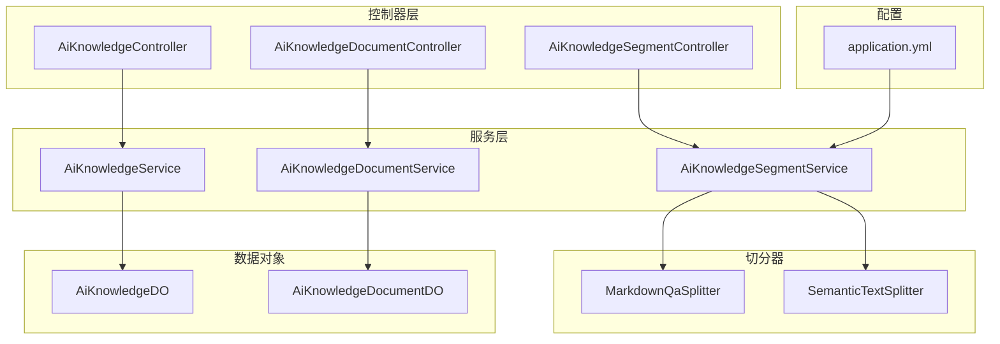
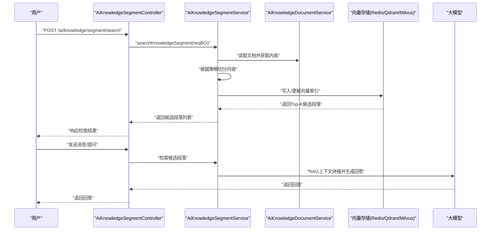
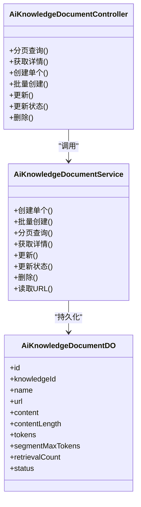
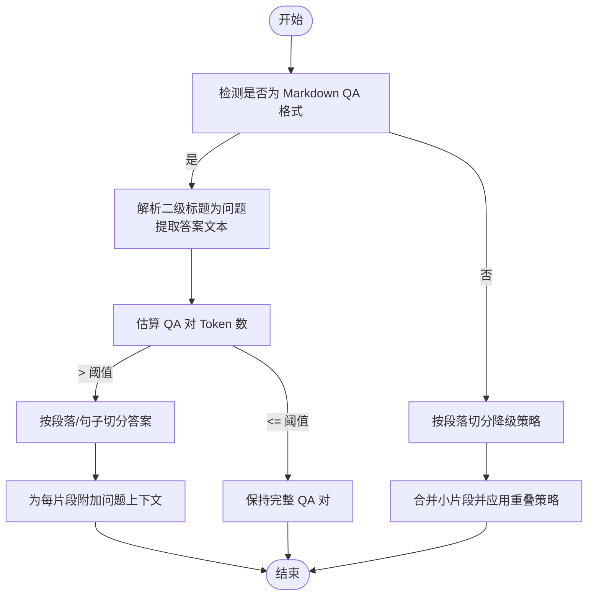
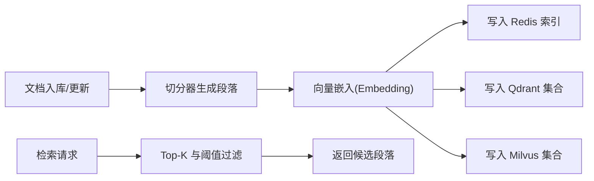
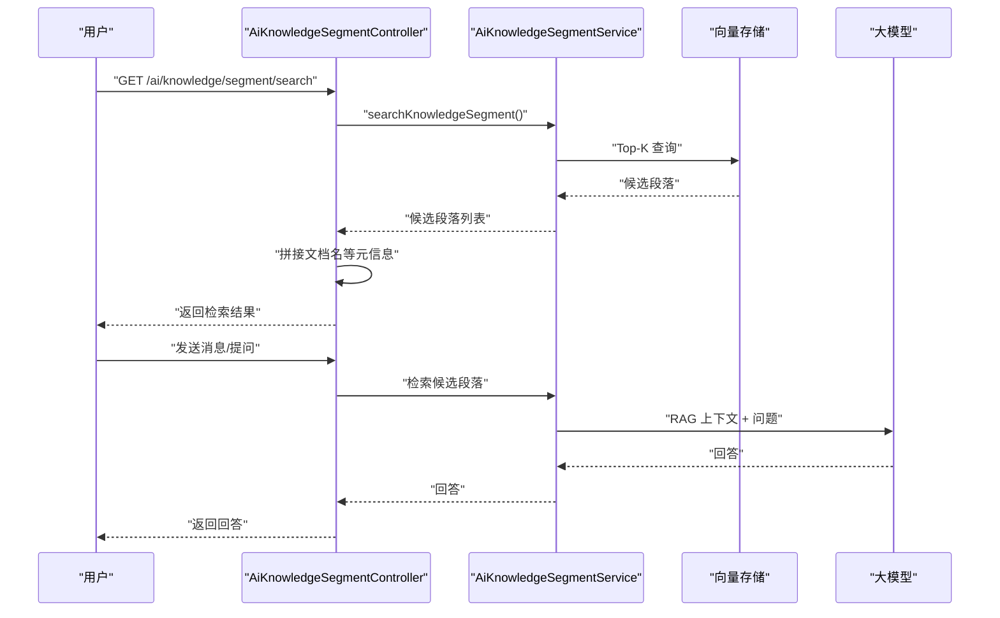
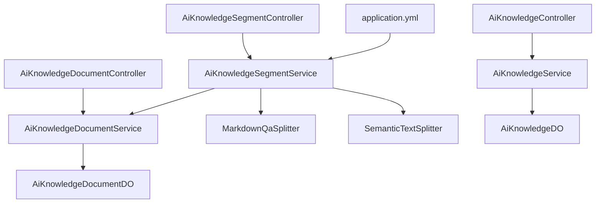

# 知识库管理系统

<cite>
**本文引用的文件**
- [AiKnowledgeController.java](file://src/main/java/cn/boss/data/ai/controller/knowledge/AiKnowledgeController.java)
- [AiKnowledgeDocumentController.java](file://src/main/java/cn/boss/data/ai/controller/knowledge/AiKnowledgeDocumentController.java)
- [AiKnowledgeSegmentController.java](file://src/main/java/cn/boss/data/ai/controller/knowledge/AiKnowledgeSegmentController.java)
- [MarkdownQaSplitter.java](file://src/main/java/cn/boss/data/ai/service/knowledge/splitter/MarkdownQaSplitter.java)
- [SemanticTextSplitter.java](file://src/main/java/cn/boss/data/ai/service/knowledge/splitter/SemanticTextSplitter.java)
- [AiKnowledgeService.java](file://src/main/java/cn/boss/data/ai/service/knowledge/AiKnowledgeService.java)
- [AiKnowledgeDocumentService.java](file://src/main/java/cn/boss/data/ai/service/knowledge/AiKnowledgeDocumentService.java)
- [AiKnowledgeSegmentService.java](file://src/main/java/cn/boss/data/ai/service/knowledge/AiKnowledgeSegmentService.java)
- [AiKnowledgeDO.java](file://src/main/java/cn/boss/data/ai/dal/dataobject/knowledge/AiKnowledgeDO.java)
- [AiKnowledgeDocumentDO.java](file://src/main/java/cn/boss/data/ai/dal/dataobject/knowledge/AiKnowledgeDocumentDO.java)
- [AiDocumentSplitStrategyEnum.java](file://src/main/java/cn/boss/data/ai/enums/AiDocumentSplitStrategyEnum.java)
- [application.yml](file://src/main/resources/application.yml)
</cite>

## 目录
1. [简介](#简介)
2. [项目结构](#项目结构)
3. [核心组件](#核心组件)
4. [架构总览](#架构总览)
5. [详细组件分析](#详细组件分析)
6. [依赖分析](#依赖分析)
7. [性能考量](#性能考量)
8. [故障排查指南](#故障排查指南)
9. [结论](#结论)
10. [附录](#附录)

## 简介
本项目为知识库管理系统，围绕“文档管理—段落处理—向量检索—RAG问答”的完整链路展开，提供：
- 文档上传与多格式内容读取
- 基于策略的智能切分（Markdown QA、语义切分等）
- 向量索引构建与检索（Redis 与 Qdrant 双栈）
- RAG 检索增强生成的问答流程
- 完整的管理端 API，覆盖知识库、文档、段落的增删改查与检索

## 项目结构
系统采用分层架构：控制器层（Controller）、服务层（Service）、数据访问层（DAO/DO）、枚举与配置。知识库相关模块集中在 knowledge 包内，配合 Spring AI 的向量存储能力与多种大模型平台。

图示来源
- [AiKnowledgeController.java:25-79](file://src/main/java/cn/boss/data/ai/controller/knowledge/AiKnowledgeController.java#L25-L79)
- [AiKnowledgeDocumentController.java:22-84](file://src/main/java/cn/boss/data/ai/controller/knowledge/AiKnowledgeDocumentController.java#L22-L84)
- [AiKnowledgeSegmentController.java:33-123](file://src/main/java/cn/boss/data/ai/controller/knowledge/AiKnowledgeSegmentController.java#L33-L123)
- [MarkdownQaSplitter.java:30-343](file://src/main/java/cn/boss/data/ai/service/knowledge/splitter/MarkdownQaSplitter.java#L30-L343)
- [SemanticTextSplitter.java:28-302](file://src/main/java/cn/boss/data/ai/service/knowledge/splitter/SemanticTextSplitter.java#L28-L302)
- [AiKnowledgeDO.java:14-45](file://src/main/java/cn/boss/data/ai/dal/dataobject/knowledge/AiKnowledgeDO.java#L14-L45)
- [AiKnowledgeDocumentDO.java:13-41](file://src/main/java/cn/boss/data/ai/dal/dataobject/knowledge/AiKnowledgeDocumentDO.java#L13-L41)
- [application.yml:80-149](file://src/main/resources/application.yml#L80-L149)

章节来源
- [AiKnowledgeController.java:25-79](file://src/main/java/cn/boss/data/ai/controller/knowledge/AiKnowledgeController.java#L25-L79)
- [AiKnowledgeDocumentController.java:22-84](file://src/main/java/cn/boss/data/ai/controller/knowledge/AiKnowledgeDocumentController.java#L22-L84)
- [AiKnowledgeSegmentController.java:33-123](file://src/main/java/cn/boss/data/ai/controller/knowledge/AiKnowledgeSegmentController.java#L33-L123)
- [application.yml:1-190](file://src/main/resources/application.yml#L1-L190)

## 核心组件
- 控制器层：提供知识库、文档、段落的 REST API；段落控制器还提供切分与检索接口。
- 服务层：封装业务逻辑，负责文档内容读取、切分策略调度、段落创建与检索。
- 切分器：MarkdownQaSplitter 与 SemanticTextSplitter 实现不同场景下的高质量切分。
- 数据对象：映射知识库、文档、段落的持久化字段。
- 配置：Spring AI 向量存储（Redis、Qdrant、Milvus）与各模型平台配置。

章节来源
- [AiKnowledgeService.java:15-71](file://src/main/java/cn/boss/data/ai/service/knowledge/AiKnowledgeService.java#L15-L71)
- [AiKnowledgeDocumentService.java:22-127](file://src/main/java/cn/boss/data/ai/service/knowledge/AiKnowledgeDocumentService.java#L22-L127)
- [AiKnowledgeSegmentService.java:24-151](file://src/main/java/cn/boss/data/ai/service/knowledge/AiKnowledgeSegmentService.java#L24-L151)
- [MarkdownQaSplitter.java:30-343](file://src/main/java/cn/boss/data/ai/service/knowledge/splitter/MarkdownQaSplitter.java#L30-L343)
- [SemanticTextSplitter.java:28-302](file://src/main/java/cn/boss/data/ai/service/knowledge/splitter/SemanticTextSplitter.java#L28-L302)
- [AiKnowledgeDO.java:14-45](file://src/main/java/cn/boss/data/ai/dal/dataobject/knowledge/AiKnowledgeDO.java#L14-L45)
- [AiKnowledgeDocumentDO.java:13-41](file://src/main/java/cn/boss/data/ai/dal/dataobject/knowledge/AiKnowledgeDocumentDO.java#L13-L41)
- [application.yml:80-149](file://src/main/resources/application.yml#L80-L149)

## 架构总览
系统通过控制器接收请求，调用服务层执行业务，服务层根据切分策略对文档内容进行切分，随后将段落转换为向量并写入向量存储（Redis、Qdrant、Milvus），检索阶段基于 Top-K 与相似度阈值返回候选段落，最终进入 RAG 流程生成回答。

图示来源
- [AiKnowledgeSegmentController.java:103-121](file://src/main/java/cn/boss/data/ai/controller/knowledge/AiKnowledgeSegmentController.java#L103-L121)
- [AiKnowledgeSegmentService.java:126-131](file://src/main/java/cn/boss/data/ai/service/knowledge/AiKnowledgeSegmentService.java#L126-L131)
- [AiKnowledgeDocumentService.java:93-98](file://src/main/java/cn/boss/data/ai/service/knowledge/AiKnowledgeDocumentService.java#L93-L98)
- [application.yml:80-149](file://src/main/resources/application.yml#L80-L149)

## 详细组件分析

### 文档管理与上传
- 功能要点
  - 支持单个/批量创建知识库文档
  - 读取 URL 内容并持久化
  - 支持状态更新与删除
- 关键接口
  - GET /ai/knowledge/document/page：分页查询
  - GET /ai/knowledge/document/get：获取详情
  - POST /ai/knowledge/document/create：创建单个
  - POST /ai/knowledge/document/create-list：批量创建
  - PUT /ai/knowledge/document/update：更新
  - PUT /ai/knowledge/document/update-status：更新状态
  - DELETE /ai/knowledge/document/delete：删除
- 数据对象
  - AiKnowledgeDocumentDO：包含文档基本信息、URL、内容长度、Token 数、切分策略参数、检索计数与状态

图示来源
- [AiKnowledgeDocumentController.java:22-84](file://src/main/java/cn/boss/data/ai/controller/knowledge/AiKnowledgeDocumentController.java#L22-L84)
- [AiKnowledgeDocumentService.java:22-127](file://src/main/java/cn/boss/data/ai/service/knowledge/AiKnowledgeDocumentService.java#L22-L127)
- [AiKnowledgeDocumentDO.java:13-41](file://src/main/java/cn/boss/data/ai/dal/dataobject/knowledge/AiKnowledgeDocumentDO.java#L13-L41)

章节来源
- [AiKnowledgeDocumentController.java:31-81](file://src/main/java/cn/boss/data/ai/controller/knowledge/AiKnowledgeDocumentController.java#L31-L81)
- [AiKnowledgeDocumentService.java:24-99](file://src/main/java/cn/boss/data/ai/service/knowledge/AiKnowledgeDocumentService.java#L24-L99)
- [AiKnowledgeDocumentDO.java:18-38](file://src/main/java/cn/boss/data/ai/dal/dataobject/knowledge/AiKnowledgeDocumentDO.java#L18-L38)

### 段落处理与切分算法
- MarkdownQaSplitter
  - 识别二级标题作为问题，保持 QA 对完整性
  - 长答案按段落/句子切分，保留问题作为上下文
  - Token 估算器支持中英混合估算
- SemanticTextSplitter
  - 优先段落边界（双换行）切分，其次句子边界
  - 支持 chunkOverlap 保持上下文连贯
  - 强制切分兜底策略，避免语义断裂
- 切分策略枚举
  - AUTO/TOKEN/PARAGRAPH/MARKDOWN_QA/SEMANTIC

图示来源
- [MarkdownQaSplitter.java:62-143](file://src/main/java/cn/boss/data/ai/service/knowledge/splitter/MarkdownQaSplitter.java#L62-L143)
- [MarkdownQaSplitter.java:255-287](file://src/main/java/cn/boss/data/ai/service/knowledge/splitter/MarkdownQaSplitter.java#L255-L287)
- [SemanticTextSplitter.java:71-115](file://src/main/java/cn/boss/data/ai/service/knowledge/splitter/SemanticTextSplitter.java#L71-L115)
- [SemanticTextSplitter.java:146-205](file://src/main/java/cn/boss/data/ai/service/knowledge/splitter/SemanticTextSplitter.java#L146-L205)
- [AiDocumentSplitStrategyEnum.java:11-39](file://src/main/java/cn/boss/data/ai/enums/AiDocumentSplitStrategyEnum.java#L11-L39)

章节来源
- [MarkdownQaSplitter.java:15-343](file://src/main/java/cn/boss/data/ai/service/knowledge/splitter/MarkdownQaSplitter.java#L15-L343)
- [SemanticTextSplitter.java:14-302](file://src/main/java/cn/boss/data/ai/service/knowledge/splitter/SemanticTextSplitter.java#L14-L302)
- [AiDocumentSplitStrategyEnum.java:6-52](file://src/main/java/cn/boss/data/ai/enums/AiDocumentSplitStrategyEnum.java#L6-L52)

### 向量索引创建与管理（Redis/Qdrant/Milvus）
- 配置要点
  - Redis：索引名、键前缀、初始化开关
  - Qdrant：集合名、主机与端口、初始化开关
  - Milvus：数据库名、集合名、客户端地址与端口、初始化开关
- 索引命名与键空间
  - Redis 前缀统一为“knowledge_segment:”，便于按文档维度隔离
  - Qdrant 集合名为“knowledge_segment”
  - Milvus 集合名为“knowledge_segment”，数据库为“default”
- 索引生命周期
  - 文档入库时触发切分与向量化
  - 段落变更或知识库重建时触发 reindex

图示来源
- [application.yml:80-149](file://src/main/resources/application.yml#L80-L149)

章节来源
- [application.yml:80-149](file://src/main/resources/application.yml#L80-L149)

### RAG（检索增强生成）实现
- 流程概述
  - 输入问题 → 检索候选段落（Top-K、相似度阈值）→ 拼接上下文 → 大模型生成回答
- 控制器协作
  - 段落检索接口返回候选段落，控制器再拼接文档名等信息返回给前端
- 配置联动
  - 知识库对象包含 embeddingModelId/embeddingModel/topK/similarityThreshold 等检索参数

图示来源
- [AiKnowledgeSegmentController.java:103-121](file://src/main/java/cn/boss/data/ai/controller/knowledge/AiKnowledgeSegmentController.java#L103-L121)
- [AiKnowledgeSegmentService.java:126-131](file://src/main/java/cn/boss/data/ai/service/knowledge/AiKnowledgeSegmentService.java#L126-L131)
- [AiKnowledgeDO.java:23-36](file://src/main/java/cn/boss/data/ai/dal/dataobject/knowledge/AiKnowledgeDO.java#L23-L36)

章节来源
- [AiKnowledgeSegmentController.java:103-121](file://src/main/java/cn/boss/data/ai/controller/knowledge/AiKnowledgeSegmentController.java#L103-L121)
- [AiKnowledgeSegmentService.java:126-131](file://src/main/java/cn/boss/data/ai/service/knowledge/AiKnowledgeSegmentService.java#L126-L131)
- [AiKnowledgeDO.java:23-36](file://src/main/java/cn/boss/data/ai/dal/dataobject/knowledge/AiKnowledgeDO.java#L23-L36)

### API 接口文档（管理端）

- 知识库管理
  - GET /ai/knowledge/page：分页查询
  - GET /ai/knowledge/get?id=...：获取详情
  - POST /ai/knowledge/create：创建
  - PUT /ai/knowledge/update：更新
  - DELETE /ai/knowledge/delete?id=...：删除
  - GET /ai/knowledge/simple-list：获取启用状态的精简列表

- 文档管理
  - GET /ai/knowledge/document/page：分页查询
  - GET /ai/knowledge/document/get?id=...：获取详情
  - POST /ai/knowledge/document/create：创建单个
  - POST /ai/knowledge/document/create-list：批量创建
  - PUT /ai/knowledge/document/update：更新
  - PUT /ai/knowledge/document/update-status：更新状态
  - DELETE /ai/knowledge/document/delete?id=...：删除

- 段落管理与检索
  - GET /ai/knowledge/segment/get?id=...：获取详情
  - GET /ai/knowledge/segment/page：分页查询
  - POST /ai/knowledge/segment/create：创建
  - PUT /ai/knowledge/segment/update：更新
  - PUT /ai/knowledge/segment/update-status：更新状态
  - GET /ai/knowledge/segment/split?url=...&segmentMaxTokens=...：切分内容
  - GET /ai/knowledge/segment/get-process-list?documentIds=...：获取处理进度
  - GET /ai/knowledge/segment/search：检索段落

章节来源
- [AiKnowledgeController.java:34-76](file://src/main/java/cn/boss/data/ai/controller/knowledge/AiKnowledgeController.java#L34-L76)
- [AiKnowledgeDocumentController.java:31-81](file://src/main/java/cn/boss/data/ai/controller/knowledge/AiKnowledgeDocumentController.java#L31-L81)
- [AiKnowledgeSegmentController.java:44-121](file://src/main/java/cn/boss/data/ai/controller/knowledge/AiKnowledgeSegmentController.java#L44-L121)

## 依赖分析
- 控制器依赖服务接口，服务接口依赖切分器与向量存储配置
- 文档/段落 DO 映射到数据库表，知识库 DO 关联嵌入模型与检索参数
- 配置文件集中管理 Spring AI 向量存储与各模型平台

图示来源
- [AiKnowledgeController.java:29-32](file://src/main/java/cn/boss/data/ai/controller/knowledge/AiKnowledgeController.java#L29-L32)
- [AiKnowledgeDocumentController.java:28-30](file://src/main/java/cn/boss/data/ai/controller/knowledge/AiKnowledgeDocumentController.java#L28-L30)
- [AiKnowledgeSegmentController.java:39-42](file://src/main/java/cn/boss/data/ai/controller/knowledge/AiKnowledgeSegmentController.java#L39-L42)
- [MarkdownQaSplitter.java:30-30](file://src/main/java/cn/boss/data/ai/service/knowledge/splitter/MarkdownQaSplitter.java#L30-L30)
- [SemanticTextSplitter.java:28-65](file://src/main/java/cn/boss/data/ai/service/knowledge/splitter/SemanticTextSplitter.java#L28-L65)
- [AiKnowledgeDO.java:17-42](file://src/main/java/cn/boss/data/ai/dal/dataobject/knowledge/AiKnowledgeDO.java#L17-L42)
- [AiKnowledgeDocumentDO.java:16-38](file://src/main/java/cn/boss/data/ai/dal/dataobject/knowledge/AiKnowledgeDocumentDO.java#L16-L38)
- [application.yml:80-149](file://src/main/resources/application.yml#L80-L149)

章节来源
- [AiKnowledgeController.java:29-32](file://src/main/java/cn/boss/data/ai/controller/knowledge/AiKnowledgeController.java#L29-L32)
- [AiKnowledgeDocumentController.java:28-30](file://src/main/java/cn/boss/data/ai/controller/knowledge/AiKnowledgeDocumentController.java#L28-L30)
- [AiKnowledgeSegmentController.java:39-42](file://src/main/java/cn/boss/data/ai/controller/knowledge/AiKnowledgeSegmentController.java#L39-L42)
- [AiKnowledgeDO.java:17-42](file://src/main/java/cn/boss/data/ai/dal/dataobject/knowledge/AiKnowledgeDO.java#L17-L42)
- [AiKnowledgeDocumentDO.java:16-38](file://src/main/java/cn/boss/data/ai/dal/dataobject/knowledge/AiKnowledgeDocumentDO.java#L16-L38)
- [application.yml:80-149](file://src/main/resources/application.yml#L80-L149)

## 性能考量
- 切分策略选择
  - Markdown QA：适合问答对密集文档，提升检索准确性
  - 语义切分：优先保持语义完整性，减少截断
- Token 估算与阈值
  - 通过 segmentMaxTokens 控制段落长度，结合 Top-K 与相似度阈值平衡召回与质量
- 异步处理
  - 段落创建与重新索引支持异步，降低请求延迟
- 向量存储
  - Redis/Qdrant/Milvus 多栈部署，按场景选择最优索引与硬件资源

## 故障排查指南
- 向量存储不可用
  - 检查 application.yml 中 Redis/Qdrant/Milvus 的连接参数与 initialize-schema 配置
- 检索结果为空
  - 核对知识库 Top-K 与相似度阈值设置
  - 确认文档已成功切分并写入向量索引
- 切分异常或语义断裂
  - 更换切分策略（AUTO/SEMANTIC/MARKDOWN_QA）
  - 调整 segmentMaxTokens 与 chunkOverlap 参数
- 文档读取失败
  - 确认 URL 可访问且内容可被正确读取

章节来源
- [application.yml:80-149](file://src/main/resources/application.yml#L80-L149)
- [AiKnowledgeSegmentService.java:102-116](file://src/main/java/cn/boss/data/ai/service/knowledge/AiKnowledgeSegmentService.java#L102-L116)
- [AiKnowledgeSegmentController.java:103-121](file://src/main/java/cn/boss/data/ai/controller/knowledge/AiKnowledgeSegmentController.java#L103-L121)

## 结论
本系统提供了从文档入库、智能切分、向量索引到 RAG 检索的完整能力，具备良好的扩展性与可维护性。通过策略化的切分器与多向量存储方案，可在不同场景下取得更优的检索效果与性能表现。

## 附录
- 安全性建议
  - 对外暴露的 API 应增加鉴权与限流
  - 向量存储需配置访问控制与网络隔离
  - 文档 URL 读取应校验来源与内容类型
- 性能优化建议
  - 使用异步批量切分与索引
  - 合理设置 Top-K 与相似度阈值
  - 对热点文档建立预索引与缓存