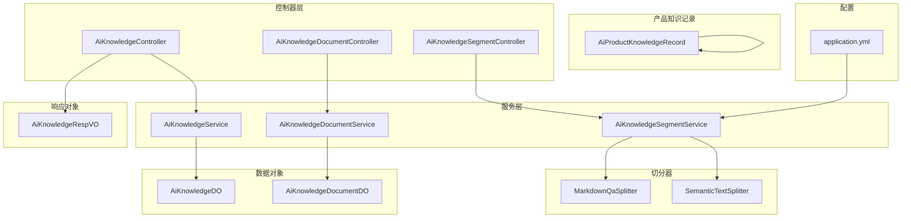
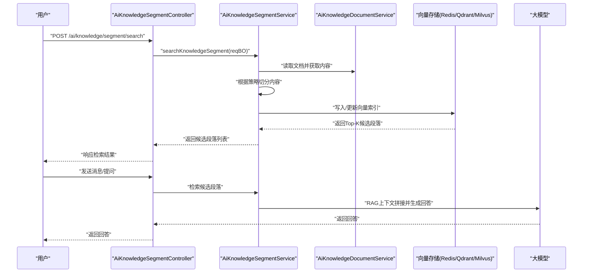
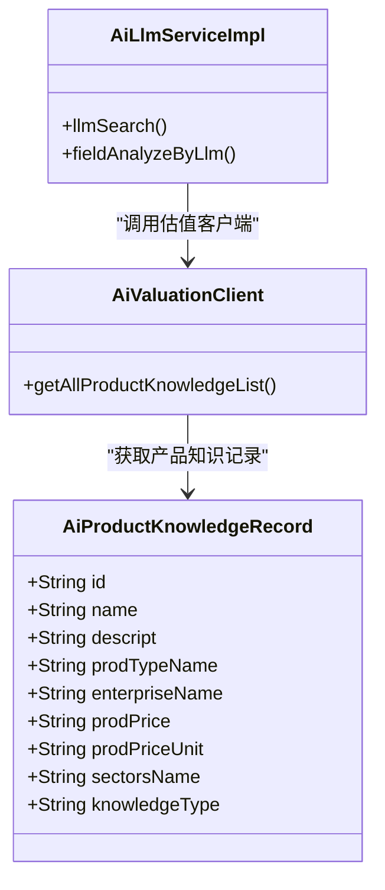
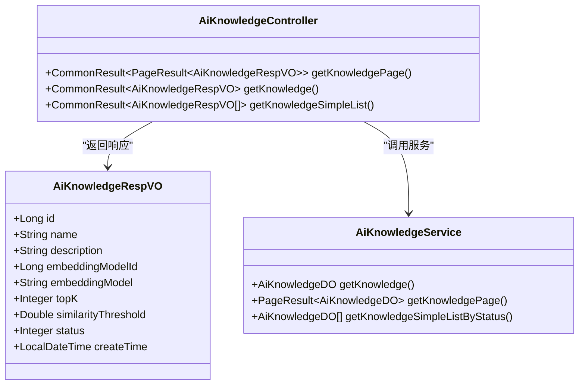
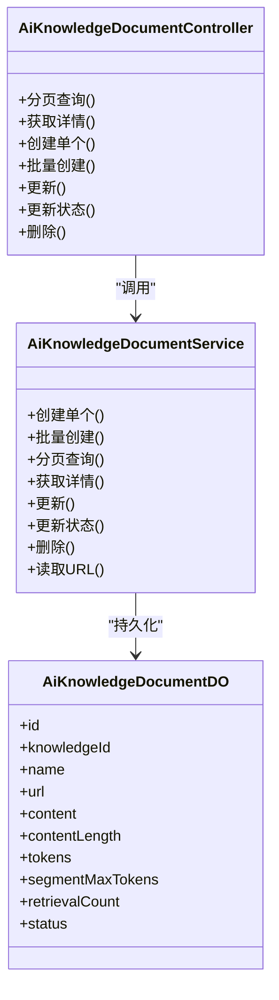
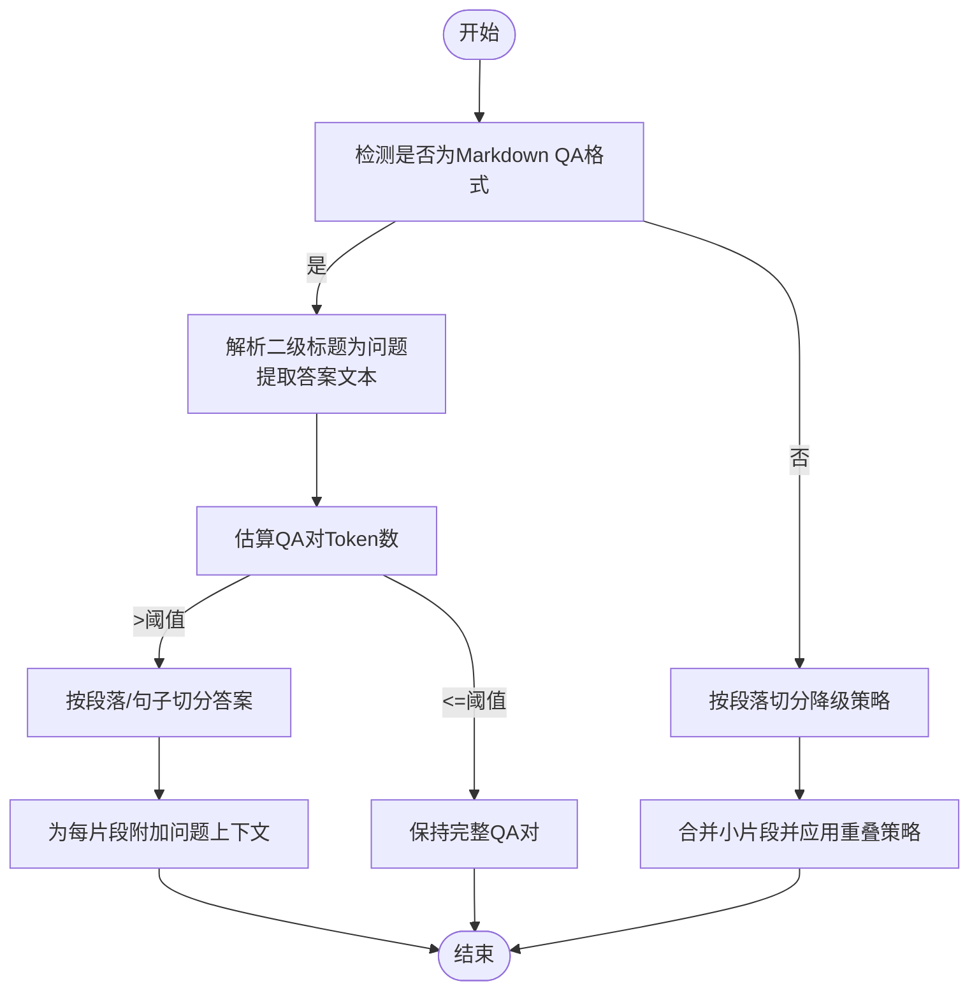
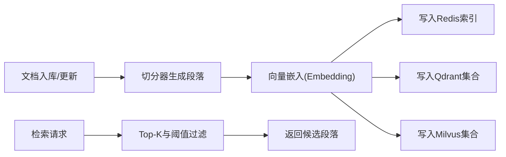
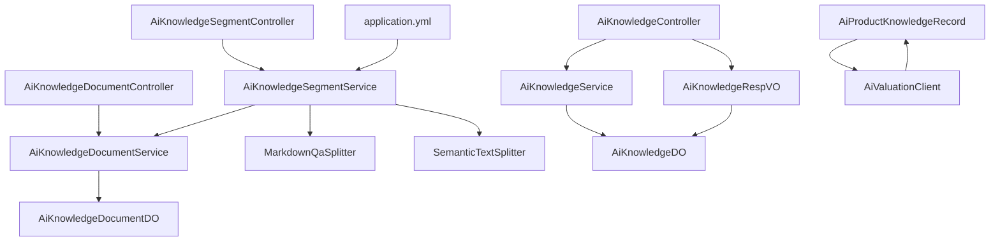

# 知识库管理系统

<cite>
**本文引用的文件**
- [AiKnowledgeController.java](file://src/main/java/cn/boss/data/ai/controller/knowledge/AiKnowledgeController.java)
- [AiKnowledgeDocumentController.java](file://src/main/java/cn/boss/data/ai/controller/knowledge/AiKnowledgeDocumentController.java)
- [AiKnowledgeSegmentController.java](file://src/main/java/cn/boss/data/ai/controller/knowledge/AiKnowledgeSegmentController.java)
- [MarkdownQaSplitter.java](file://src/main/java/cn/boss/data/ai/service/knowledge/splitter/MarkdownQaSplitter.java)
- [SemanticTextSplitter.java](file://src/main/java/cn/boss/data/ai/service/knowledge/splitter/SemanticTextSplitter.java)
- [AiKnowledgeService.java](file://src/main/java/cn/boss/data/ai/service/knowledge/AiKnowledgeService.java)
- [AiKnowledgeDocumentService.java](file://src/main/java/cn/boss/data/ai/service/knowledge/AiKnowledgeDocumentService.java)
- [AiKnowledgeSegmentService.java](file://src/main/java/cn/boss/data/ai/service/knowledge/AiKnowledgeSegmentService.java)
- [AiKnowledgeDO.java](file://src/main/java/cn/boss/data/ai/dal/dataobject/knowledge/AiKnowledgeDO.java)
- [AiKnowledgeDocumentDO.java](file://src/main/java/cn/boss/data/ai/dal/dataobject/knowledge/AiKnowledgeDocumentDO.java)
- [AiKnowledgeRespVO.java](file://src/main/java/cn/boss/data/ai/controller/knowledge/vo/knowledge/AiKnowledgeRespVO.java)
- [AiKnowledgeSaveReqVO.java](file://src/main/java/cn/boss/data/ai/controller/knowledge/vo/knowledge/AiKnowledgeSaveReqVO.java)
- [AiKnowledgePageReqVO.java](file://src/main/java/cn/boss/data/ai/controller/knowledge/vo/knowledge/AiKnowledgePageReqVO.java)
- [AiProductKnowledgeRecord.java](file://src/main/java/cn/boss/data/ai/service/llm/vo/AiProductKnowledgeRecord.java)
- [AiValuationClient.java](file://src/main/java/cn/boss/data/ai/framework/ai/core/valuation/AiValuationClient.java)
- [AiLlmServiceImpl.java](file://src/main/java/cn/boss/data/ai/service/llm/AiLlmServiceImpl.java)
- [AiDocumentSplitStrategyEnum.java](file://src/main/java/cn/boss/data/ai/enums/AiDocumentSplitStrategyEnum.java)
- [application.yml](file://src/main/resources/application.yml)
</cite>

## 更新摘要
**所做更改**
- 更新了产品知识记录结构的字段命名：从产品中心的('productName','info')改为知识中心的('name','descript')
- 新增了knowledgeType字段，用于指示数据来源类型（market市场价格交易库、his历史经验交易库）
- 更新了AiProductKnowledgeRecord类的字段定义以反映新的命名约定
- 保持了原有的知识库响应对象AiKnowledgeRespVO，提供增强的知识库交互能力
- 管理端API保持完整，包括知识库、文档、段落的增删改查与检索接口
- 切分器和向量存储配置继续支持Redis、Qdrant、Milvus多栈部署

## 目录
1. [简介](#简介)
2. [项目结构](#项目结构)
3. [核心组件](#核心组件)
4. [架构总览](#架构总览)
5. [详细组件分析](#详细组件分析)
6. [依赖分析](#依赖分析)
7. [性能考量](#性能考量)
8. [故障排查指南](#故障排查指南)
9. [结论](#结论)
10. [附录](#附录)

## 简介
本项目为知识库管理系统，围绕"文档管理—段落处理—向量检索—RAG问答"的完整链路展开，提供：
- 文档上传与多格式内容读取
- 基于策略的智能切分（Markdown QA、语义切分等）
- 向量索引构建与检索（Redis与Qdrant双栈）
- RAG检索增强生成的问答流程
- 完整的管理端API，覆盖知识库、文档、段落的增删改查与检索
- 增强的知识库响应对象AiKnowledgeRespVO，提供更丰富的知识库交互能力
- **新增**：产品知识记录结构优化，采用统一的('name','descript')命名规范和knowledgeType数据源标识

## 项目结构
系统采用分层架构：控制器层（Controller）、服务层（Service）、数据访问层（DAO/DO）、枚举与配置。知识库相关模块集中在knowledge包内，配合Spring AI的向量存储能力与多种大模型平台。

```mermaid
graph TB
subgraph "控制器层"
KCtrl["AiKnowledgeController"]
DCtrl["AiKnowledgeDocumentController"]
SCtrl["AiKnowledgeSegmentController"]
end
subgraph "服务层"
KSvc["AiKnowledgeService"]
DSvc["AiKnowledgeDocumentService"]
SSvc["AiKnowledgeSegmentService"]
end
subgraph "产品知识记录"
PR["AiProductKnowledgeRecord"]
end
subgraph "切分器"
MDS["MarkdownQaSplitter"]
SDS["SemanticTextSplitter"]
end
subgraph "数据对象"
KDO["AiKnowledgeDO"]
DDO["AiKnowledgeDocumentDO"]
end
subgraph "响应对象"
KResp["AiKnowledgeRespVO"]
end
subgraph "配置"
CFG["application.yml"]
end
KCtrl --> KSvc
DCtrl --> DSvc
SCtrl --> SSvc
PR --> PR
SSvc --> MDS
SSvc --> SDS
KSvc --> KDO
DSvc --> DDO
KCtrl --> KResp
CFG --> SSvc
```

**图示来源**
- [AiKnowledgeController.java:25-67](file://src/main/java/cn/boss/data/ai/controller/knowledge/AiKnowledgeController.java#L25-L67)
- [AiKnowledgeRespVO.java:8-29](file://src/main/java/cn/boss/data/ai/controller/knowledge/vo/knowledge/AiKnowledgeRespVO.java#L8-L29)
- [AiProductKnowledgeRecord.java:8-56](file://src/main/java/cn/boss/data/ai/service/llm/vo/AiProductKnowledgeRecord.java#L8-L56)
- [application.yml:80-149](file://src/main/resources/application.yml#L80-L149)

**章节来源**
- [AiKnowledgeController.java:25-67](file://src/main/java/cn/boss/data/ai/controller/knowledge/AiKnowledgeController.java#L25-L67)
- [AiKnowledgeDocumentController.java:22-74](file://src/main/java/cn/boss/data/ai/controller/knowledge/AiKnowledgeDocumentController.java#L22-L74)
- [AiKnowledgeSegmentController.java:33-104](file://src/main/java/cn/boss/data/ai/controller/knowledge/AiKnowledgeSegmentController.java#L33-L104)
- [AiProductKnowledgeRecord.java:8-56](file://src/main/java/cn/boss/data/ai/service/llm/vo/AiProductKnowledgeRecord.java#L8-L56)
- [application.yml:1-190](file://src/main/resources/application.yml#L1-L190)

## 核心组件
- **控制器层**：提供知识库、文档、段落的REST API；段落控制器还提供切分与检索接口。
- **服务层**：封装业务逻辑，负责文档内容读取、切分策略调度、段落创建与检索。
- **产品知识记录**：AiProductKnowledgeRecord统一了产品知识的数据结构，采用('name','descript')命名规范和knowledgeType标识。
- **切分器**：MarkdownQaSplitter与SemanticTextSplitter实现不同场景下的高质量切分。
- **数据对象**：映射知识库、文档、段落的持久化字段。
- **响应对象**：AiKnowledgeRespVO提供增强的知识库响应能力。
- **配置**：Spring AI向量存储（Redis、Qdrant、Milvus）与各模型平台配置。

**章节来源**
- [AiKnowledgeService.java:15-71](file://src/main/java/cn/boss/data/ai/service/knowledge/AiKnowledgeService.java#L15-L71)
- [AiKnowledgeDocumentService.java:22-127](file://src/main/java/cn/boss/data/ai/service/knowledge/AiKnowledgeDocumentService.java#L22-L127)
- [AiKnowledgeSegmentService.java:24-151](file://src/main/java/cn/boss/data/ai/service/knowledge/AiKnowledgeSegmentService.java#L24-L151)
- [AiProductKnowledgeRecord.java:8-56](file://src/main/java/cn/boss/data/ai/service/llm/vo/AiProductKnowledgeRecord.java#L8-L56)
- [AiKnowledgeRespVO.java:8-29](file://src/main/java/cn/boss/data/ai/controller/knowledge/vo/knowledge/AiKnowledgeRespVO.java#L8-L29)
- [application.yml:80-149](file://src/main/resources/application.yml#L80-L149)

## 架构总览
系统通过控制器接收请求，调用服务层执行业务，服务层根据切分策略对文档内容进行切分，随后将段落转换为向量并写入向量存储（Redis、Qdrant、Milvus），检索阶段基于Top-K与相似度阈值返回候选段落，最终进入RAG流程生成回答。

```mermaid
sequenceDiagram
participant U as "用户"
participant C as "AiKnowledgeSegmentController"
participant S as "AiKnowledgeSegmentService"
participant D as "AiKnowledgeDocumentService"
participant VS as "向量存储(Redis/Qdrant/Milvus)"
participant LLM as "大模型"
U->>C : "POST /ai/knowledge/segment/search"
C->>S : "searchKnowledgeSegment(reqBO)"
S->>D : "读取文档并获取内容"
S->>S : "根据策略切分内容"
S->>VS : "写入/更新向量索引"
VS-->>S : "返回Top-K候选段落"
S-->>C : "返回候选段落列表"
C-->>U : "响应检索结果"
U->>C : "发送消息/提问"
C->>S : "检索候选段落"
S->>LLM : "RAG上下文拼接并生成回答"
LLM-->>C : "返回回答"
C-->>U : "返回回答"
```

**图示来源**
- [AiKnowledgeSegmentController.java:85-101](file://src/main/java/cn/boss/data/ai/controller/knowledge/AiKnowledgeSegmentController.java#L85-L101)
- [AiKnowledgeSegmentService.java:126-131](file://src/main/java/cn/boss/data/ai/service/knowledge/AiKnowledgeSegmentService.java#L126-L131)
- [AiKnowledgeDocumentService.java:93-98](file://src/main/java/cn/boss/data/ai/service/knowledge/AiKnowledgeDocumentService.java#L93-L98)
- [application.yml:80-149](file://src/main/resources/application.yml#L80-L149)

## 详细组件分析

### 产品知识记录结构优化
**更新** 产品知识记录结构已从产品中心的('productName','info')命名调整为知识中心的('name','descript')命名规范，并新增knowledgeType字段用于标识数据来源类型。

- **字段命名调整**
  - productName → name（产品名称统一为name字段）
  - info → descript（产品介绍统一为descript字段）
- **新增字段**
  - knowledgeType：标识数据来源类型
    - market：市场价格交易库
    - his：历史经验交易库
- **字段含义**
  - id：知识库ID
  - name：产品名称
  - descript：产品描述信息
  - prodTypeName：产品类型
  - enterpriseName：归属单位
  - prodPrice：价格
  - prodPriceUnit：价格单位
  - sectorsName：使用场景
  - knowledgeType：知识库类型

```mermaid
classDiagram
class AiProductKnowledgeRecord {
+String id
+String name
+String descript
+String prodTypeName
+String enterpriseName
+String prodPrice
+String prodPriceUnit
+String sectorsName
+String knowledgeType
}
class AiValuationClient {
+getAllProductKnowledgeList()
}
class AiLlmServiceImpl {
+llmSearch()
+fieldAnalyzeByLlm()
}
AiValuationClient --> AiProductKnowledgeRecord : "获取产品知识记录"
AiLlmServiceImpl --> AiValuationClient : "调用估值客户端"
```

**图示来源**
- [AiProductKnowledgeRecord.java:8-56](file://src/main/java/cn/boss/data/ai/service/llm/vo/AiProductKnowledgeRecord.java#L8-L56)
- [AiValuationClient.java:30-62](file://src/main/java/cn/boss/data/ai/framework/ai/core/valuation/AiValuationClient.java#L30-L62)
- [AiLlmServiceImpl.java:7-84](file://src/main/java/cn/boss/data/ai/service/llm/AiLlmServiceImpl.java#L7-84)

**章节来源**
- [AiProductKnowledgeRecord.java:8-56](file://src/main/java/cn/boss/data/ai/service/llm/vo/AiProductKnowledgeRecord.java#L8-L56)
- [AiValuationClient.java:30-62](file://src/main/java/cn/boss/data/ai/framework/ai/core/valuation/AiValuationClient.java#L30-L62)
- [AiLlmServiceImpl.java:7-84](file://src/main/java/cn/boss/data/ai/service/llm/AiLlmServiceImpl.java#L7-84)

### 知识库响应对象增强
AiKnowledgeRespVO响应对象显著增强了知识库交互的响应能力，提供更丰富的知识库信息展示。

- **功能特性**
  - 完整的知识库基本信息展示（ID、名称、描述）
  - 向量模型关联信息（模型ID、模型标识）
  - 检索配置参数（topK、相似度阈值）
  - 状态管理和创建时间
  - 支持Swagger注解的API文档生成

- **关键字段**
  - `id`：知识库唯一标识符
  - `name`：知识库名称
  - `description`：知识库描述信息
  - `embeddingModelId`：向量模型编号
  - `embeddingModel`：向量模型标识
  - `topK`：检索返回数量
  - `similarityThreshold`：相似度阈值
  - `status`：知识库状态
  - `createTime`：创建时间

```mermaid
classDiagram
class AiKnowledgeRespVO {
+Long id
+String name
+String description
+Long embeddingModelId
+String embeddingModel
+Integer topK
+Double similarityThreshold
+Integer status
+LocalDateTime createTime
}
class AiKnowledgeController {
+CommonResult~PageResult~AiKnowledgeRespVO~~ getKnowledgePage()
+CommonResult~AiKnowledgeRespVO~ getKnowledge()
+CommonResult~AiKnowledgeRespVO[]~ getKnowledgeSimpleList()
}
class AiKnowledgeService {
+AiKnowledgeDO getKnowledge()
+PageResult~AiKnowledgeDO~ getKnowledgePage()
+AiKnowledgeDO[] getKnowledgeSimpleListByStatus()
}
AiKnowledgeController --> AiKnowledgeRespVO : "返回响应"
AiKnowledgeController --> AiKnowledgeService : "调用服务"
```

**图示来源**
- [AiKnowledgeRespVO.java:10-29](file://src/main/java/cn/boss/data/ai/controller/knowledge/vo/knowledge/AiKnowledgeRespVO.java#L10-L29)
- [AiKnowledgeController.java:30-64](file://src/main/java/cn/boss/data/ai/controller/knowledge/AiKnowledgeController.java#L30-L64)

**章节来源**
- [AiKnowledgeRespVO.java:8-29](file://src/main/java/cn/boss/data/ai/controller/knowledge/vo/knowledge/AiKnowledgeRespVO.java#L8-L29)
- [AiKnowledgeController.java:30-64](file://src/main/java/cn/boss/data/ai/controller/knowledge/AiKnowledgeController.java#L30-L64)

### 文档管理与上传
- **功能要点**
  - 支持单个/批量创建知识库文档
  - 读取URL内容并持久化
  - 支持状态更新与删除
- **关键接口**
  - GET /ai/knowledge/document/page：分页查询
  - GET /ai/knowledge/document/get：获取详情
  - POST /ai/knowledge/document/create：创建单个
  - POST /ai/knowledge/document/create-list：批量创建
  - PUT /ai/knowledge/document/update：更新
  - PUT /ai/knowledge/document/update-status：更新状态
  - DELETE /ai/knowledge/document/delete：删除
- **数据对象**
  - AiKnowledgeDocumentDO：包含文档基本信息、URL、内容长度、Token数、切分策略参数、检索计数与状态

```mermaid
classDiagram
class AiKnowledgeDocumentController {
+分页查询()
+获取详情()
+创建单个()
+批量创建()
+更新()
+更新状态()
+删除()
}
class AiKnowledgeDocumentService {
+创建单个()
+批量创建()
+分页查询()
+获取详情()
+更新()
+更新状态()
+删除()
+读取URL()
}
class AiKnowledgeDocumentDO {
+id
+knowledgeId
+name
+url
+content
+contentLength
+tokens
+segmentMaxTokens
+retrievalCount
+status
}
AiKnowledgeDocumentController --> AiKnowledgeDocumentService : "调用"
AiKnowledgeDocumentService --> AiKnowledgeDocumentDO : "持久化"
```

**图示来源**
- [AiKnowledgeDocumentController.java:28-71](file://src/main/java/cn/boss/data/ai/controller/knowledge/AiKnowledgeDocumentController.java#L28-L71)
- [AiKnowledgeDocumentService.java:22-127](file://src/main/java/cn/boss/data/ai/service/knowledge/AiKnowledgeDocumentService.java#L22-L127)
- [AiKnowledgeDocumentDO.java:13-41](file://src/main/java/cn/boss/data/ai/dal/dataobject/knowledge/AiKnowledgeDocumentDO.java#L13-L41)

**章节来源**
- [AiKnowledgeDocumentController.java:28-71](file://src/main/java/cn/boss/data/ai/controller/knowledge/AiKnowledgeDocumentController.java#L28-L71)
- [AiKnowledgeDocumentService.java:24-99](file://src/main/java/cn/boss/data/ai/service/knowledge/AiKnowledgeDocumentService.java#L24-L99)
- [AiKnowledgeDocumentDO.java:18-38](file://src/main/java/cn/boss/data/ai/dal/dataobject/knowledge/AiKnowledgeDocumentDO.java#L18-L38)

### 段落处理与切分算法
- **MarkdownQaSplitter**
  - 识别二级标题作为问题，保持QA对完整性
  - 长答案按段落/句子切分，保留问题作为上下文
  - Token估算器支持中英混合估算
- **SemanticTextSplitter**
  - 优先段落边界（双换行）切分，其次句子边界
  - 支持chunkOverlap保持上下文连贯
  - 强制切分兜底策略，避免语义断裂
- **切分策略枚举**
  - AUTO/TOKEN/PARAGRAPH/MARKDOWN_QA/SEMANTIC

```mermaid
flowchart TD
Start(["开始"]) --> Detect["检测是否为Markdown QA格式"]
Detect --> |是| ParseQA["解析二级标题为问题<br/>提取答案文本"]
ParseQA --> CheckTokens["估算QA对Token数"]
CheckTokens --> |<=阈值| KeepFull["保持完整QA对"]
CheckTokens --> |>阈值| SplitAnswer["按段落/句子切分答案"]
SplitAnswer --> ReattachQ["为每片段附加问题上下文"]
Detect --> |否| Fallback["按段落切分降级策略"]
Fallback --> Merge["合并小片段并应用重叠策略"]
ReattachQ --> End(["结束"])
KeepFull --> End
Merge --> End
```

**图示来源**
- [MarkdownQaSplitter.java:62-143](file://src/main/java/cn/boss/data/ai/service/knowledge/splitter/MarkdownQaSplitter.java#L62-L143)
- [MarkdownQaSplitter.java:255-287](file://src/main/java/cn/boss/data/ai/service/knowledge/splitter/MarkdownQaSplitter.java#L255-L287)
- [SemanticTextSplitter.java:71-115](file://src/main/java/cn/boss/data/ai/service/knowledge/splitter/SemanticTextSplitter.java#L71-L115)
- [SemanticTextSplitter.java:146-205](file://src/main/java/cn/boss/data/ai/service/knowledge/splitter/SemanticTextSplitter.java#L146-L205)
- [AiDocumentSplitStrategyEnum.java:11-39](file://src/main/java/cn/boss/data/ai/enums/AiDocumentSplitStrategyEnum.java#L11-L39)

**章节来源**
- [MarkdownQaSplitter.java:15-343](file://src/main/java/cn/boss/data/ai/service/knowledge/splitter/MarkdownQaSplitter.java#L15-L343)
- [SemanticTextSplitter.java:14-302](file://src/main/java/cn/boss/data/ai/service/knowledge/splitter/SemanticTextSplitter.java#L14-L302)
- [AiDocumentSplitStrategyEnum.java:6-52](file://src/main/java/cn/boss/data/ai/enums/AiDocumentSplitStrategyEnum.java#L6-L52)

### 向量索引创建与管理（Redis/Qdrant/Milvus）
- **配置要点**
  - Redis：索引名、键前缀、初始化开关
  - Qdrant：集合名、主机与端口、初始化开关
  - Milvus：数据库名、集合名、客户端地址与端口、初始化开关
- **索引命名与键空间**
  - Redis前缀统一为"knowledge_segment:"，便于按文档维度隔离
  - Qdrant集合名为"knowledge_segment"
  - Milvus集合名为"knowledge_segment"，数据库为"default"
- **索引生命周期**
  - 文档入库时触发切分与向量化
  - 段落变更或知识库重建时触发reindex

```mermaid
graph LR
A["文档入库/更新"] --> B["切分器生成段落"]
B --> C["向量嵌入(Embedding)"]
C --> D["写入Redis索引"]
C --> E["写入Qdrant集合"]
C --> F["写入Milvus集合"]
G["检索请求"] --> H["Top-K与阈值过滤"]
H --> I["返回候选段落"]
```

**图示来源**
- [application.yml:80-149](file://src/main/resources/application.yml#L80-L149)

**章节来源**
- [application.yml:80-149](file://src/main/resources/application.yml#L80-L149)

### RAG（检索增强生成）实现
- **流程概述**
  - 输入问题→检索候选段落（Top-K、相似度阈值）→拼接上下文→大模型生成回答
- **控制器协作**
  - 段落检索接口返回候选段落，控制器再拼接文档名等信息返回给前端
- **配置联动**
  - 知识库对象包含embeddingModelId/embeddingModel/topK/similarityThreshold等检索参数

```mermaid
sequenceDiagram
participant U as "用户"
participant C as "AiKnowledgeSegmentController"
participant S as "AiKnowledgeSegmentService"
participant VS as "向量存储"
participant M as "大模型"
U->>C : "GET /ai/knowledge/segment/search"
C->>S : "searchKnowledgeSegment()"
S->>VS : "Top-K查询"
VS-->>S : "候选段落"
S-->>C : "候选段落列表"
C->>C : "拼接文档名等元信息"
C-->>U : "返回检索结果"
U->>C : "发送消息/提问"
C->>S : "检索候选段落"
S->>M : "RAG上下文+问题"
M-->>S : "回答"
S-->>C : "回答"
C-->>U : "返回回答"
```

**图示来源**
- [AiKnowledgeSegmentController.java:85-101](file://src/main/java/cn/boss/data/ai/controller/knowledge/AiKnowledgeSegmentController.java#L85-L101)
- [AiKnowledgeSegmentService.java:126-131](file://src/main/java/cn/boss/data/ai/service/knowledge/AiKnowledgeSegmentService.java#L126-L131)
- [AiKnowledgeDO.java:23-42](file://src/main/java/cn/boss/data/ai/dal/dataobject/knowledge/AiKnowledgeDO.java#L23-L42)

**章节来源**
- [AiKnowledgeSegmentController.java:85-101](file://src/main/java/cn/boss/data/ai/controller/knowledge/AiKnowledgeSegmentController.java#L85-L101)
- [AiKnowledgeSegmentService.java:126-131](file://src/main/java/cn/boss/data/ai/service/knowledge/AiKnowledgeSegmentService.java#L126-L131)
- [AiKnowledgeDO.java:23-42](file://src/main/java/cn/boss/data/ai/dal/dataobject/knowledge/AiKnowledgeDO.java#L23-L42)

### API接口文档（管理端）

- **知识库管理**
  - GET /ai/knowledge/page：分页查询（返回AiKnowledgeRespVO列表）
  - GET /ai/knowledge/get?id=...：获取详情（返回AiKnowledgeRespVO）
  - POST /ai/knowledge/create：创建
  - PUT /ai/knowledge/update：更新
  - DELETE /ai/knowledge/delete?id=...：删除
  - GET /ai/knowledge/simple-list：获取启用状态的精简列表（返回AiKnowledgeRespVO）

- **文档管理**
  - GET /ai/knowledge/document/page：分页查询
  - GET /ai/knowledge/document/get?id=...：获取详情
  - POST /ai/knowledge/document/create：创建单个
  - POST /ai/knowledge/document/create-list：批量创建
  - PUT /ai/knowledge/document/update：更新
  - PUT /ai/knowledge/document/update-status：更新状态
  - DELETE /ai/knowledge/document/delete?id=...：删除

- **段落管理与检索**
  - GET /ai/knowledge/segment/get?id=...：获取详情
  - GET /ai/knowledge/segment/page：分页查询
  - POST /ai/knowledge/segment/create：创建
  - PUT /ai/knowledge/segment/update：更新
  - PUT /ai/knowledge/segment/update-status：更新状态
  - GET /ai/knowledge/segment/split?url=...&segmentMaxTokens=...：切分内容
  - GET /ai/knowledge/segment/get-process-list?documentIds=...：获取处理进度
  - GET /ai/knowledge/segment/search：检索段落

**章节来源**
- [AiKnowledgeController.java:30-64](file://src/main/java/cn/boss/data/ai/controller/knowledge/AiKnowledgeController.java#L30-L64)
- [AiKnowledgeDocumentController.java:28-71](file://src/main/java/cn/boss/data/ai/controller/knowledge/AiKnowledgeDocumentController.java#L28-L71)
- [AiKnowledgeSegmentController.java:39-101](file://src/main/java/cn/boss/data/ai/controller/knowledge/AiKnowledgeSegmentController.java#L39-L101)

## 依赖分析
- **控制器依赖服务接口，服务接口依赖切分器与向量存储配置**
- **文档/段落DO映射到数据库表，知识库DO关联嵌入模型与检索参数**
- **AiKnowledgeRespVO作为增强的响应对象，与AiKnowledgeDO通过BeanUtils进行转换**
- **AiProductKnowledgeRecord作为产品知识记录载体，通过AiValuationClient获取数据**
- **配置文件集中管理Spring AI向量存储与各模型平台**

```mermaid
graph TB
C1["AiKnowledgeController"] --> S1["AiKnowledgeService"]
C2["AiKnowledgeDocumentController"] --> S2["AiKnowledgeDocumentService"]
C3["AiKnowledgeSegmentController"] --> S3["AiKnowledgeSegmentService"]
S3 --> S2
S3 --> Split1["MarkdownQaSplitter"]
S3 --> Split2["SemanticTextSplitter"]
S1 --> KDO["AiKnowledgeDO"]
S2 --> DDO["AiKnowledgeDocumentDO"]
C1 --> KResp["AiKnowledgeRespVO"]
KResp --> KDO
PR["AiProductKnowledgeRecord"] --> VC["AiValuationClient"]
VC --> PR
CFG["application.yml"] --> S3
```

**图示来源**
- [AiKnowledgeController.java:27-28](file://src/main/java/cn/boss/data/ai/controller/knowledge/AiKnowledgeController.java#L27-L28)
- [AiKnowledgeDocumentController.java:25-26](file://src/main/java/cn/boss/data/ai/controller/knowledge/AiKnowledgeDocumentController.java#L25-L26)
- [AiKnowledgeSegmentController.java:34-37](file://src/main/java/cn/boss/data/ai/controller/knowledge/AiKnowledgeSegmentController.java#L34-L37)
- [AiKnowledgeRespVO.java:8-29](file://src/main/java/cn/boss/data/ai/controller/knowledge/vo/knowledge/AiKnowledgeRespVO.java#L8-L29)
- [AiProductKnowledgeRecord.java:8-56](file://src/main/java/cn/boss/data/ai/service/llm/vo/AiProductKnowledgeRecord.java#L8-L56)
- [AiValuationClient.java:30-62](file://src/main/java/cn/boss/data/ai/framework/ai/core/valuation/AiValuationClient.java#L30-L62)
- [application.yml:80-149](file://src/main/resources/application.yml#L80-L149)

**章节来源**
- [AiKnowledgeController.java:27-28](file://src/main/java/cn/boss/data/ai/controller/knowledge/AiKnowledgeController.java#L27-L28)
- [AiKnowledgeDocumentController.java:25-26](file://src/main/java/cn/boss/data/ai/controller/knowledge/AiKnowledgeDocumentController.java#L25-L26)
- [AiKnowledgeSegmentController.java:34-37](file://src/main/java/cn/boss/data/ai/controller/knowledge/AiKnowledgeSegmentController.java#L34-L37)
- [AiKnowledgeRespVO.java:8-29](file://src/main/java/cn/boss/data/ai/controller/knowledge/vo/knowledge/AiKnowledgeRespVO.java#L8-L29)
- [AiKnowledgeDO.java:17-42](file://src/main/java/cn/boss/data/ai/dal/dataobject/knowledge/AiKnowledgeDO.java#L17-L42)
- [AiKnowledgeDocumentDO.java:16-38](file://src/main/java/cn/boss/data/ai/dal/dataobject/knowledge/AiKnowledgeDocumentDO.java#L16-L38)
- [AiProductKnowledgeRecord.java:8-56](file://src/main/java/cn/boss/data/ai/service/llm/vo/AiProductKnowledgeRecord.java#L8-L56)
- [AiValuationClient.java:30-62](file://src/main/java/cn/boss/data/ai/framework/ai/core/valuation/AiValuationClient.java#L30-L62)
- [application.yml:80-149](file://src/main/resources/application.yml#L80-L149)

## 性能考量
- **切分策略选择**
  - Markdown QA：适合问答对密集文档，提升检索准确性
  - 语义切分：优先保持语义完整性，减少截断
- **Token估算与阈值**
  - 通过segmentMaxTokens控制段落长度，结合Top-K与相似度阈值平衡召回与质量
- **异步处理**
  - 段落创建与重新索引支持异步，降低请求延迟
- **向量存储**
  - Redis/Qdrant/Milvus多栈部署，按场景选择最优索引与硬件资源
- **响应对象优化**
  - AiKnowledgeRespVO提供标准化的响应结构，减少前端处理复杂度
- **产品知识记录优化**
  - 统一的('name','descript')命名规范减少了字段映射复杂度
  - knowledgeType字段支持快速区分数据来源类型

## 故障排查指南
- **向量存储不可用**
  - 检查application.yml中Redis/Qdrant/Milvus的连接参数与initialize-schema配置
- **检索结果为空**
  - 核对知识库Top-K与相似度阈值设置
  - 确认文档已成功切分并写入向量索引
- **切分异常或语义断裂**
  - 更换切分策略（AUTO/SEMANTIC/MARKDOWN_QA）
  - 调整segmentMaxTokens与chunkOverlap参数
- **文档读取失败**
  - 确认URL可访问且内容可被正确读取
- **响应对象转换错误**
  - 检查AiKnowledgeRespVO与AiKnowledgeDO字段映射关系
  - 确认BeanUtils转换配置正确
- **产品知识记录字段映射错误**
  - 确认productName已映射到name字段
  - 确认info已映射到descript字段
  - 验证knowledgeType字段的值（market/his）

**章节来源**
- [application.yml:80-149](file://src/main/resources/application.yml#L80-L149)
- [AiKnowledgeSegmentService.java:102-116](file://src/main/java/cn/boss/data/ai/service/knowledge/AiKnowledgeSegmentService.java#L102-L116)
- [AiKnowledgeSegmentController.java:85-101](file://src/main/java/cn/boss/data/ai/controller/knowledge/AiKnowledgeSegmentController.java#L85-L101)
- [AiKnowledgeRespVO.java:8-29](file://src/main/java/cn/boss/data/ai/controller/knowledge/vo/knowledge/AiKnowledgeRespVO.java#L8-L29)
- [AiProductKnowledgeRecord.java:8-56](file://src/main/java/cn/boss/data/ai/service/llm/vo/AiProductKnowledgeRecord.java#L8-L56)

## 结论
本系统提供了从文档入库、智能切分、向量索引到RAG检索的完整能力，具备良好的扩展性与可维护性。AiKnowledgeRespVO响应对象进一步增强了系统的响应能力，为前端提供了更丰富、标准化的知识库信息展示。通过策略化的切分器与多向量存储方案，可在不同场景下取得更优的检索效果与性能表现。

**更新亮点**：
- 产品知识记录结构优化：统一('name','descript')命名规范，提升代码一致性
- 新增knowledgeType字段：支持数据来源类型标识，便于后续功能扩展
- 保持向量存储多栈部署：Redis/Qdrant/Milvus配置继续支持
- 维护现有API兼容性：所有管理端接口保持不变

## 附录
- **安全性建议**
  - 对外暴露的API应增加鉴权与限流
  - 向量存储需配置访问控制与网络隔离
  - 文档URL读取应校验来源与内容类型
  - 响应对象字段需进行适当的权限控制和脱敏处理
  - knowledgeType字段需进行白名单验证

- **性能优化建议**
  - 使用异步批量切分与索引
  - 合理设置Top-K与相似度阈值
  - 对热点文档建立预索引与缓存
  - 优化AiKnowledgeRespVO的序列化性能，避免不必要的字段传输
  - 在分页查询中合理使用AiKnowledgeRespVO，避免大数据量传输
  - 产品知识记录的knowledgeType字段可用于快速过滤和索引优化