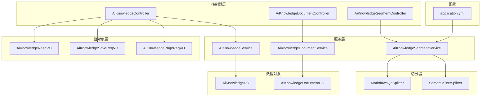
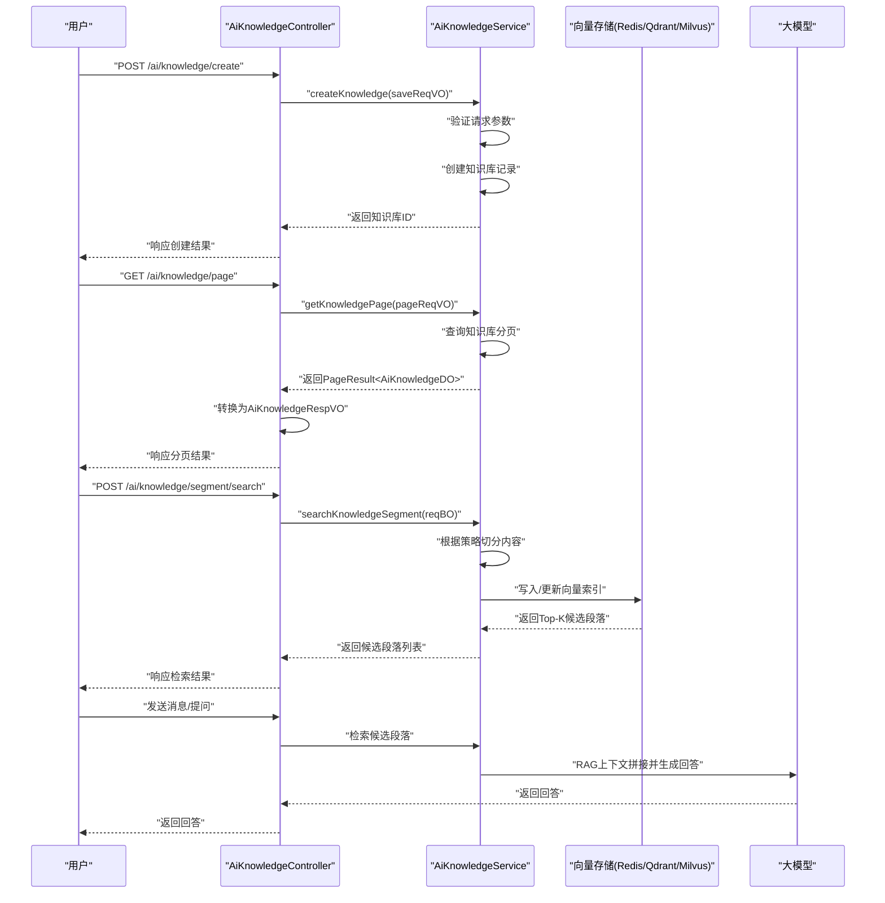
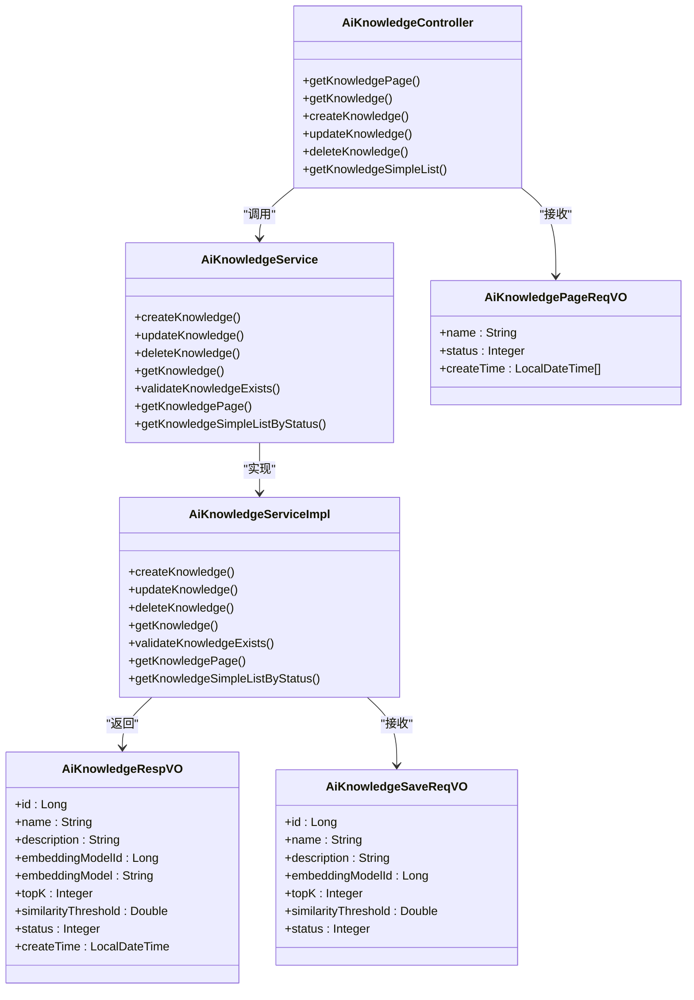
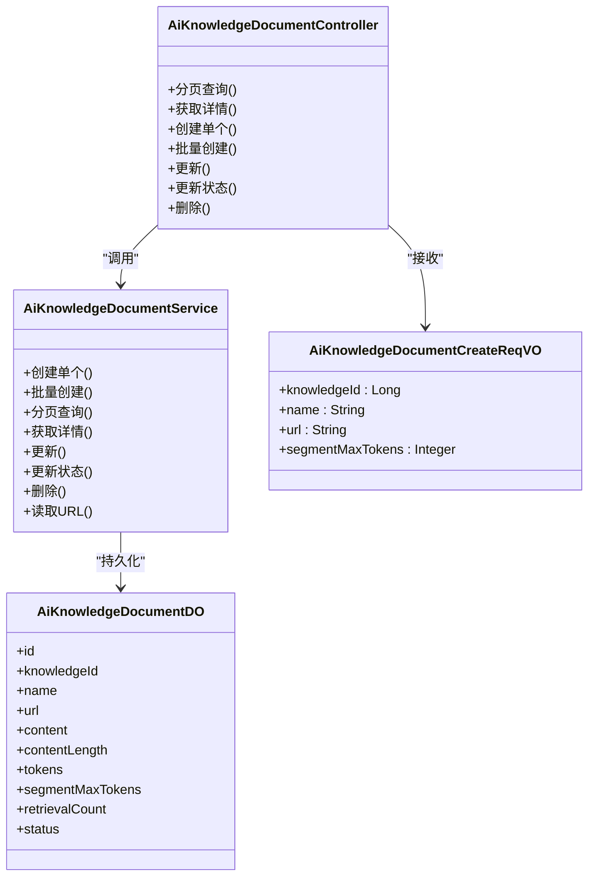
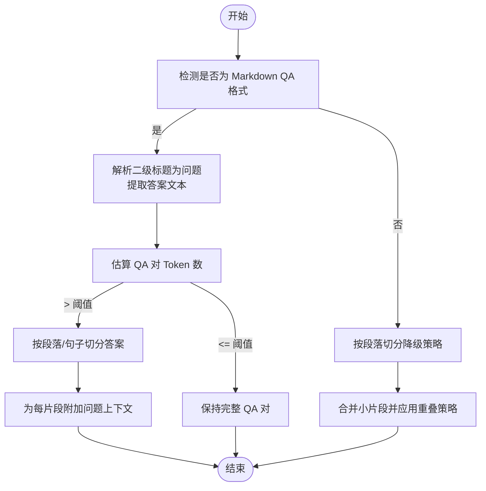
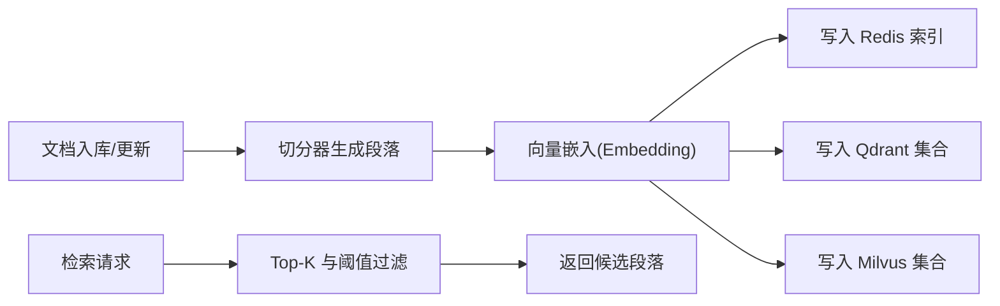
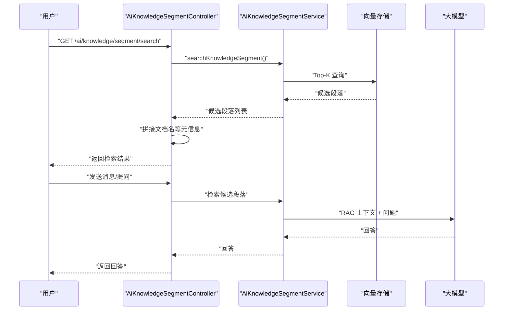
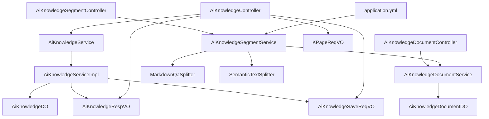

# 知识库管理系统

<cite>
**本文引用的文件**
- [AiKnowledgeController.java](file://src/main/java/cn/boss/data/ai/controller/knowledge/AiKnowledgeController.java)
- [AiKnowledgeDocumentController.java](file://src/main/java/cn/boss/data/ai/controller/knowledge/AiKnowledgeDocumentController.java)
- [AiKnowledgeSegmentController.java](file://src/main/java/cn/boss/data/ai/controller/knowledge/AiKnowledgeSegmentController.java)
- [MarkdownQaSplitter.java](file://src/main/java/cn/boss/data/ai/service/knowledge/splitter/MarkdownQaSplitter.java)
- [SemanticTextSplitter.java](file://src/main/java/cn/boss/data/ai/service/knowledge/splitter/SemanticTextSplitter.java)
- [AiKnowledgeService.java](file://src/main/java/cn/boss/data/ai/service/knowledge/AiKnowledgeService.java)
- [AiKnowledgeServiceImpl.java](file://src/main/java/cn/boss/data/ai/service/knowledge/AiKnowledgeServiceImpl.java)
- [AiKnowledgeDocumentService.java](file://src/main/java/cn/boss/data/ai/service/knowledge/AiKnowledgeDocumentService.java)
- [AiKnowledgeSegmentService.java](file://src/main/java/cn/boss/data/ai/service/knowledge/AiKnowledgeSegmentService.java)
- [AiKnowledgeDO.java](file://src/main/java/cn/boss/data/ai/dal/dataobject/knowledge/AiKnowledgeDO.java)
- [AiKnowledgeDocumentDO.java](file://src/main/java/cn/boss/data/ai/dal/dataobject/knowledge/AiKnowledgeDocumentDO.java)
- [AiKnowledgeRespVO.java](file://src/main/java/cn/boss/data/ai/controller/knowledge/vo/knowledge/AiKnowledgeRespVO.java)
- [AiKnowledgeSaveReqVO.java](file://src/main/java/cn/boss/data/ai/controller/knowledge/vo/knowledge/AiKnowledgeSaveReqVO.java)
- [AiKnowledgePageReqVO.java](file://src/main/java/cn/boss/data/ai/controller/knowledge/vo/knowledge/AiKnowledgePageReqVO.java)
- [AiKnowledgeDocumentCreateReqVO.java](file://src/main/java/cn/boss/data/ai/controller/knowledge/vo/knowledge/AiKnowledgeDocumentCreateReqVO.java)
- [AiDocumentSplitStrategyEnum.java](file://src/main/java/cn/boss/data/ai/enums/AiDocumentSplitStrategyEnum.java)
- [application.yml](file://src/main/resources/application.yml)
</cite>

## 更新摘要
**所做更改**
- 新增 AiKnowledgeRespVO 和 AiKnowledgeSaveReqVO 值对象类，完善知识库管理的数据传输对象设计
- 更新知识库管理 API 接口文档，反映新的响应结构和请求验证机制
- 增强知识库管理的响应结构，提供更丰富的知识库信息展示
- 完善知识库创建和更新的请求验证规则

## 目录
1. [简介](#简介)
2. [项目结构](#项目结构)
3. [核心组件](#核心组件)
4. [架构总览](#架构总览)
5. [详细组件分析](#详细组件分析)
6. [依赖分析](#依赖分析)
7. [性能考量](#性能考量)
8. [故障排查指南](#故障排查指南)
9. [结论](#结论)
10. [附录](#附录)

## 简介
本项目为知识库管理系统，围绕"文档管理—段落处理—向量检索—RAG问答"的完整链路展开，提供：
- 文档上传与多格式内容读取
- 基于策略的智能切分（Markdown QA、语义切分等）
- 向量索引构建与检索（Redis 与 Qdrant 双栈）
- RAG 检索增强生成的问答流程
- 完整的管理端 API，覆盖知识库、文档、段落的增删改查与检索

**更新** 新增 AiKnowledgeRespVO 和 AiKnowledgeSaveReqVO 值对象类，增强了知识库管理的数据传输对象设计，完善了响应结构和请求验证机制。

## 项目结构
系统采用分层架构：控制器层（Controller）、服务层（Service）、数据访问层（DAO/DO）、枚举与配置。知识库相关模块集中在 knowledge 包内，配合 Spring AI 的向量存储能力与多种大模型平台。

```mermaid
graph TB
subgraph "控制器层"
KCtrl["AiKnowledgeController"]
DCtrl["AiKnowledgeDocumentController"]
SCtrl["AiKnowledgeSegmentController"]
end
subgraph "服务层"
KSvc["AiKnowledgeService"]
DSvc["AiKnowledgeDocumentService"]
SSvc["AiKnowledgeSegmentService"]
end
subgraph "值对象层"
KRespVO["AiKnowledgeRespVO"]
KSaveReqVO["AiKnowledgeSaveReqVO"]
KPageReqVO["AiKnowledgePageReqVO"]
end
subgraph "切分器"
MDS["MarkdownQaSplitter"]
SDS["SemanticTextSplitter"]
end
subgraph "数据对象"
KDO["AiKnowledgeDO"]
DDO["AiKnowledgeDocumentDO"]
end
subgraph "配置"
CFG["application.yml"]
end
KCtrl --> KSvc
KCtrl --> KRespVO
KCtrl --> KSaveReqVO
KCtrl --> KPageReqVO
DCtrl --> DSvc
SCtrl --> SSvc
SSvc --> MDS
SSvc --> SDS
KSvc --> KDO
DSvc --> DDO
CFG --> SSvc
```

**图示来源**
- [AiKnowledgeController.java:25-79](file://src/main/java/cn/boss/data/ai/controller/knowledge/AiKnowledgeController.java#L25-L79)
- [AiKnowledgeServiceImpl.java:27-110](file://src/main/java/cn/boss/data/ai/service/knowledge/AiKnowledgeServiceImpl.java#L27-L110)
- [AiKnowledgeRespVO.java:8-40](file://src/main/java/cn/boss/data/ai/controller/knowledge/vo/knowledge/AiKnowledgeRespVO.java#L8-L40)
- [AiKnowledgeSaveReqVO.java:10-42](file://src/main/java/cn/boss/data/ai/controller/knowledge/vo/knowledge/AiKnowledgeSaveReqVO.java#L10-L42)
- [AiKnowledgePageReqVO.java:14-30](file://src/main/java/cn/boss/data/ai/controller/knowledge/vo/knowledge/AiKnowledgePageReqVO.java#L14-L30)

**章节来源**
- [AiKnowledgeController.java:25-79](file://src/main/java/cn/boss/data/ai/controller/knowledge/AiKnowledgeController.java#L25-L79)
- [AiKnowledgeServiceImpl.java:27-110](file://src/main/java/cn/boss/data/ai/service/knowledge/AiKnowledgeServiceImpl.java#L27-L110)
- [AiKnowledgeRespVO.java:8-40](file://src/main/java/cn/boss/data/ai/controller/knowledge/vo/knowledge/AiKnowledgeRespVO.java#L8-L40)
- [AiKnowledgeSaveReqVO.java:10-42](file://src/main/java/cn/boss/data/ai/controller/knowledge/vo/knowledge/AiKnowledgeSaveReqVO.java#L10-L42)
- [AiKnowledgePageReqVO.java:14-30](file://src/main/java/cn/boss/data/ai/controller/knowledge/vo/knowledge/AiKnowledgePageReqVO.java#L14-L30)

## 核心组件
- 控制器层：提供知识库、文档、段落的 REST API；段落控制器还提供切分与检索接口。
- 服务层：封装业务逻辑，负责文档内容读取、切分策略调度、段落创建与检索。
- 值对象层：AiKnowledgeRespVO 和 AiKnowledgeSaveReqVO 提供标准化的响应和请求数据结构。
- 切分器：MarkdownQaSplitter 与 SemanticTextSplitter 实现不同场景下的高质量切分。
- 数据对象：映射知识库、文档、段落的持久化字段。
- 配置：Spring AI 向量存储（Redis、Qdrant、Milvus）与各模型平台配置。

**更新** 新增值对象层组件，提供标准化的数据传输格式和验证机制。

**章节来源**
- [AiKnowledgeController.java:25-79](file://src/main/java/cn/boss/data/ai/controller/knowledge/AiKnowledgeController.java#L25-L79)
- [AiKnowledgeServiceImpl.java:27-110](file://src/main/java/cn/boss/data/ai/service/knowledge/AiKnowledgeServiceImpl.java#L27-L110)
- [AiKnowledgeRespVO.java:8-40](file://src/main/java/cn/boss/data/ai/controller/knowledge/vo/knowledge/AiKnowledgeRespVO.java#L8-L40)
- [AiKnowledgeSaveReqVO.java:10-42](file://src/main/java/cn/boss/data/ai/controller/knowledge/vo/knowledge/AiKnowledgeSaveReqVO.java#L10-L42)
- [MarkdownQaSplitter.java:30-343](file://src/main/java/cn/boss/data/ai/service/knowledge/splitter/MarkdownQaSplitter.java#L30-L343)
- [SemanticTextSplitter.java:28-302](file://src/main/java/cn/boss/data/ai/service/knowledge/splitter/SemanticTextSplitter.java#L28-L302)
- [AiKnowledgeDO.java:14-45](file://src/main/java/cn/boss/data/ai/dal/dataobject/knowledge/AiKnowledgeDO.java#L14-L45)
- [AiKnowledgeDocumentDO.java:13-41](file://src/main/java/cn/boss/data/ai/dal/dataobject/knowledge/AiKnowledgeDocumentDO.java#L13-L41)
- [application.yml:80-149](file://src/main/resources/application.yml#L80-L149)

## 架构总览
系统通过控制器接收请求，调用服务层执行业务，服务层根据切分策略对文档内容进行切分，随后将段落转换为向量并写入向量存储（Redis、Qdrant、Milvus），检索阶段基于 Top-K 与相似度阈值返回候选段落，最终进入 RAG 流程生成回答。

```mermaid
sequenceDiagram
participant U as "用户"
participant C as "AiKnowledgeController"
participant S as "AiKnowledgeService"
participant VS as "向量存储(Redis/Qdrant/Milvus)"
participant LLM as "大模型"
U->>C : "POST /ai/knowledge/create"
C->>S : "createKnowledge(saveReqVO)"
S->>S : "验证请求参数"
S->>S : "创建知识库记录"
S-->>C : "返回知识库ID"
C-->>U : "响应创建结果"
U->>C : "GET /ai/knowledge/page"
C->>S : "getKnowledgePage(pageReqVO)"
S->>S : "查询知识库分页"
S-->>C : "返回PageResult<AiKnowledgeDO>"
C->>C : "转换为AiKnowledgeRespVO"
C-->>U : "响应分页结果"
U->>C : "POST /ai/knowledge/segment/search"
C->>S : "searchKnowledgeSegment(reqBO)"
S->>S : "根据策略切分内容"
S->>VS : "写入/更新向量索引"
VS-->>S : "返回Top-K候选段落"
S-->>C : "返回候选段落列表"
C-->>U : "响应检索结果"
U->>C : "发送消息/提问"
C->>S : "检索候选段落"
S->>LLM : "RAG上下文拼接并生成回答"
LLM-->>C : "返回回答"
C-->>U : "返回回答"
```

**图示来源**
- [AiKnowledgeController.java:49-76](file://src/main/java/cn/boss/data/ai/controller/knowledge/AiKnowledgeController.java#L49-L76)
- [AiKnowledgeServiceImpl.java:42-51](file://src/main/java/cn/boss/data/ai/service/knowledge/AiKnowledgeServiceImpl.java#L42-L51)
- [AiKnowledgeRespVO.java:8-40](file://src/main/java/cn/boss/data/ai/controller/knowledge/vo/knowledge/AiKnowledgeRespVO.java#L8-L40)
- [AiKnowledgeSaveReqVO.java:10-42](file://src/main/java/cn/boss/data/ai/controller/knowledge/vo/knowledge/AiKnowledgeSaveReqVO.java#L10-L42)

## 详细组件分析

### 知识库管理与数据传输对象

#### AiKnowledgeRespVO - 响应值对象
提供标准化的知识库响应数据结构，包含完整的知识库信息展示：
- 基础信息：id、name、description
- 向量模型信息：embeddingModelId、embeddingModel
- 检索配置：topK、similarityThreshold
- 状态管理：status、createTime

#### AiKnowledgeSaveReqVO - 请求值对象
提供标准化的知识库创建和更新请求数据结构，包含完整的验证规则：
- 必填字段验证：name、embeddingModelId、topK、similarityThreshold、status
- 格式验证：使用 @NotBlank、@NotNull、@InEnum 等注解
- 状态枚举验证：确保 status 值在有效范围内

#### AiKnowledgePageReqVO - 分页请求值对象
提供知识库分页查询的请求数据结构：
- 支持按 name 和 status 过滤
- 支持时间范围查询
- 继承通用分页参数

```mermaid
classDiagram
class AiKnowledgeController {
+getKnowledgePage()
+getKnowledge()
+createKnowledge()
+updateKnowledge()
+deleteKnowledge()
+getKnowledgeSimpleList()
}
class AiKnowledgeService {
+createKnowledge()
+updateKnowledge()
+deleteKnowledge()
+getKnowledge()
+validateKnowledgeExists()
+getKnowledgePage()
+getKnowledgeSimpleListByStatus()
}
class AiKnowledgeServiceImpl {
+createKnowledge()
+updateKnowledge()
+deleteKnowledge()
+getKnowledge()
+validateKnowledgeExists()
+getKnowledgePage()
+getKnowledgeSimpleListByStatus()
}
class AiKnowledgeRespVO {
+id : Long
+name : String
+description : String
+embeddingModelId : Long
+embeddingModel : String
+topK : Integer
+similarityThreshold : Double
+status : Integer
+createTime : LocalDateTime
}
class AiKnowledgeSaveReqVO {
+id : Long
+name : String
+description : String
+embeddingModelId : Long
+topK : Integer
+similarityThreshold : Double
+status : Integer
}
class AiKnowledgePageReqVO {
+name : String
+status : Integer
+createTime : LocalDateTime[]
}
AiKnowledgeController --> AiKnowledgeService : "调用"
AiKnowledgeService --> AiKnowledgeServiceImpl : "实现"
AiKnowledgeServiceImpl --> AiKnowledgeRespVO : "返回"
AiKnowledgeServiceImpl --> AiKnowledgeSaveReqVO : "接收"
AiKnowledgeController --> AiKnowledgePageReqVO : "接收"
```

**图示来源**
- [AiKnowledgeController.java:29-78](file://src/main/java/cn/boss/data/ai/controller/knowledge/AiKnowledgeController.java#L29-L78)
- [AiKnowledgeServiceImpl.java:29-109](file://src/main/java/cn/boss/data/ai/service/knowledge/AiKnowledgeServiceImpl.java#L29-L109)
- [AiKnowledgeRespVO.java:10-39](file://src/main/java/cn/boss/data/ai/controller/knowledge/vo/knowledge/AiKnowledgeRespVO.java#L10-L39)
- [AiKnowledgeSaveReqVO.java:12-41](file://src/main/java/cn/boss/data/ai/controller/knowledge/vo/knowledge/AiKnowledgeSaveReqVO.java#L12-L41)
- [AiKnowledgePageReqVO.java:16-29](file://src/main/java/cn/boss/data/ai/controller/knowledge/vo/knowledge/AiKnowledgePageReqVO.java#L16-L29)

**章节来源**
- [AiKnowledgeController.java:34-76](file://src/main/java/cn/boss/data/ai/controller/knowledge/AiKnowledgeController.java#L34-L76)
- [AiKnowledgeServiceImpl.java:41-107](file://src/main/java/cn/boss/data/ai/service/knowledge/AiKnowledgeServiceImpl.java#L41-L107)
- [AiKnowledgeRespVO.java:8-40](file://src/main/java/cn/boss/data/ai/controller/knowledge/vo/knowledge/AiKnowledgeRespVO.java#L8-L40)
- [AiKnowledgeSaveReqVO.java:10-42](file://src/main/java/cn/boss/data/ai/controller/knowledge/vo/knowledge/AiKnowledgeSaveReqVO.java#L10-L42)
- [AiKnowledgePageReqVO.java:14-30](file://src/main/java/cn/boss/data/ai/controller/knowledge/vo/knowledge/AiKnowledgePageReqVO.java#L14-L30)

### 文档管理与上传
- 功能要点
  - 支持单个/批量创建知识库文档
  - 读取 URL 内容并持久化
  - 支持状态更新与删除
- 关键接口
  - GET /ai/knowledge/document/page：分页查询
  - GET /ai/knowledge/document/get：获取详情
  - POST /ai/knowledge/document/create：创建单个
  - POST /ai/knowledge/document/create-list：批量创建
  - PUT /ai/knowledge/document/update：更新
  - PUT /ai/knowledge/document/update-status：更新状态
  - DELETE /ai/knowledge/document/delete：删除
- 数据对象
  - AiKnowledgeDocumentDO：包含文档基本信息、URL、内容长度、Token 数、切分策略参数、检索计数与状态

```mermaid
classDiagram
class AiKnowledgeDocumentController {
+分页查询()
+获取详情()
+创建单个()
+批量创建()
+更新()
+更新状态()
+删除()
}
class AiKnowledgeDocumentService {
+创建单个()
+批量创建()
+分页查询()
+获取详情()
+更新()
+更新状态()
+删除()
+读取URL()
}
class AiKnowledgeDocumentCreateReqVO {
+knowledgeId : Long
+name : String
+url : String
+segmentMaxTokens : Integer
}
class AiKnowledgeDocumentDO {
+id
+knowledgeId
+name
+url
+content
+contentLength
+tokens
+segmentMaxTokens
+retrievalCount
+status
}
AiKnowledgeDocumentController --> AiKnowledgeDocumentService : "调用"
AiKnowledgeDocumentService --> AiKnowledgeDocumentDO : "持久化"
AiKnowledgeDocumentController --> AiKnowledgeDocumentCreateReqVO : "接收"
```

**图示来源**
- [AiKnowledgeDocumentController.java:22-84](file://src/main/java/cn/boss/data/ai/controller/knowledge/AiKnowledgeDocumentController.java#L22-L84)
- [AiKnowledgeDocumentService.java:22-127](file://src/main/java/cn/boss/data/ai/service/knowledge/AiKnowledgeDocumentService.java#L22-L127)
- [AiKnowledgeDocumentCreateReqVO.java:11-29](file://src/main/java/cn/boss/data/ai/controller/knowledge/vo/knowledge/AiKnowledgeDocumentCreateReqVO.java#L11-L29)
- [AiKnowledgeDocumentDO.java:13-41](file://src/main/java/cn/boss/data/ai/dal/dataobject/knowledge/AiKnowledgeDocumentDO.java#L13-L41)

**章节来源**
- [AiKnowledgeDocumentController.java:31-81](file://src/main/java/cn/boss/data/ai/controller/knowledge/AiKnowledgeDocumentController.java#L31-L81)
- [AiKnowledgeDocumentService.java:24-99](file://src/main/java/cn/boss/data/ai/service/knowledge/AiKnowledgeDocumentService.java#L24-L99)
- [AiKnowledgeDocumentCreateReqVO.java:11-29](file://src/main/java/cn/boss/data/ai/controller/knowledge/vo/knowledge/AiKnowledgeDocumentCreateReqVO.java#L11-L29)
- [AiKnowledgeDocumentDO.java:18-38](file://src/main/java/cn/boss/data/ai/dal/dataobject/knowledge/AiKnowledgeDocumentDO.java#L18-L38)

### 段落处理与切分算法
- MarkdownQaSplitter
  - 识别二级标题作为问题，保持 QA 对完整性
  - 长答案按段落/句子切分，保留问题作为上下文
  - Token 估算器支持中英混合估算
- SemanticTextSplitter
  - 优先段落边界（双换行）切分，其次句子边界
  - 支持 chunkOverlap 保持上下文连贯
  - 强制切分兜底策略，避免语义断裂
- 切分策略枚举
  - AUTO/TOKEN/PARAGRAPH/MARKDOWN_QA/SEMANTIC

```mermaid
flowchart TD
Start(["开始"]) --> Detect["检测是否为 Markdown QA 格式"]
Detect --> |是| ParseQA["解析二级标题为问题<br/>提取答案文本"]
ParseQA --> CheckTokens["估算 QA 对 Token 数"]
CheckTokens --> |<= 阈值| KeepFull["保持完整 QA 对"]
CheckTokens --> |> 阈值| SplitAnswer["按段落/句子切分答案"]
SplitAnswer --> ReattachQ["为每片段附加问题上下文"]
Detect --> |否| Fallback["按段落切分降级策略"]
Fallback --> Merge["合并小片段并应用重叠策略"]
ReattachQ --> End(["结束"])
KeepFull --> End
Merge --> End
```

**图示来源**
- [MarkdownQaSplitter.java:62-143](file://src/main/java/cn/boss/data/ai/service/knowledge/splitter/MarkdownQaSplitter.java#L62-L143)
- [MarkdownQaSplitter.java:255-287](file://src/main/java/cn/boss/data/ai/service/knowledge/splitter/MarkdownQaSplitter.java#L255-L287)
- [SemanticTextSplitter.java:71-115](file://src/main/java/cn/boss/data/ai/service/knowledge/splitter/SemanticTextSplitter.java#L71-L115)
- [SemanticTextSplitter.java:146-205](file://src/main/java/cn/boss/data/ai/service/knowledge/splitter/SemanticTextSplitter.java#L146-L205)
- [AiDocumentSplitStrategyEnum.java:11-39](file://src/main/java/cn/boss/data/ai/enums/AiDocumentSplitStrategyEnum.java#L11-L39)

**章节来源**
- [MarkdownQaSplitter.java:15-343](file://src/main/java/cn/boss/data/ai/service/knowledge/splitter/MarkdownQaSplitter.java#L15-L343)
- [SemanticTextSplitter.java:14-302](file://src/main/java/cn/boss/data/ai/service/knowledge/splitter/SemanticTextSplitter.java#L14-L302)
- [AiDocumentSplitStrategyEnum.java:6-52](file://src/main/java/cn/boss/data/ai/enums/AiDocumentSplitStrategyEnum.java#L6-L52)

### 向量索引创建与管理（Redis/Qdrant/Milvus）
- 配置要点
  - Redis：索引名、键前缀、初始化开关
  - Qdrant：集合名、主机与端口、初始化开关
  - Milvus：数据库名、集合名、客户端地址与端口、初始化开关
- 索引命名与键空间
  - Redis 前缀统一为"knowledge_segment:"，便于按文档维度隔离
  - Qdrant 集合名为"knowledge_segment"
  - Milvus 集合名为"knowledge_segment"，数据库为"default"
- 索引生命周期
  - 文档入库时触发切分与向量化
  - 段落变更或知识库重建时触发 reindex

```mermaid
graph LR
A["文档入库/更新"] --> B["切分器生成段落"]
B --> C["向量嵌入(Embedding)"]
C --> D["写入 Redis 索引"]
C --> E["写入 Qdrant 集合"]
C --> F["写入 Milvus 集合"]
G["检索请求"] --> H["Top-K 与阈值过滤"]
H --> I["返回候选段落"]
```

**图示来源**
- [application.yml:80-149](file://src/main/resources/application.yml#L80-L149)

**章节来源**
- [application.yml:80-149](file://src/main/resources/application.yml#L80-L149)

### RAG（检索增强生成）实现
- 流程概述
  - 输入问题 → 检索候选段落（Top-K、相似度阈值）→ 拼接上下文 → 大模型生成回答
- 控制器协作
  - 段落检索接口返回候选段落，控制器再拼接文档名等信息返回给前端
- 配置联动
  - 知识库对象包含 embeddingModelId/embeddingModel/topK/similarityThreshold 等检索参数

```mermaid
sequenceDiagram
participant U as "用户"
participant C as "AiKnowledgeSegmentController"
participant S as "AiKnowledgeSegmentService"
participant VS as "向量存储"
participant M as "大模型"
U->>C : "GET /ai/knowledge/segment/search"
C->>S : "searchKnowledgeSegment()"
S->>VS : "Top-K 查询"
VS-->>S : "候选段落"
S-->>C : "候选段落列表"
C->>C : "拼接文档名等元信息"
C-->>U : "返回检索结果"
U->>C : "发送消息/提问"
C->>S : "检索候选段落"
S->>M : "RAG 上下文 + 问题"
M-->>S : "回答"
S-->>C : "回答"
C-->>U : "返回回答"
```

**图示来源**
- [AiKnowledgeSegmentController.java:103-121](file://src/main/java/cn/boss/data/ai/controller/knowledge/AiKnowledgeSegmentController.java#L103-L121)
- [AiKnowledgeSegmentService.java:126-131](file://src/main/java/cn/boss/data/ai/service/knowledge/AiKnowledgeSegmentService.java#L126-L131)
- [AiKnowledgeDO.java:23-36](file://src/main/java/cn/boss/data/ai/dal/dataobject/knowledge/AiKnowledgeDO.java#L23-L36)

**章节来源**
- [AiKnowledgeSegmentController.java:103-121](file://src/main/java/cn/boss/data/ai/controller/knowledge/AiKnowledgeSegmentController.java#L103-L121)
- [AiKnowledgeSegmentService.java:126-131](file://src/main/java/cn/boss/data/ai/service/knowledge/AiKnowledgeSegmentService.java#L126-L131)
- [AiKnowledgeDO.java:23-36](file://src/main/java/cn/boss/data/ai/dal/dataobject/knowledge/AiKnowledgeDO.java#L23-L36)

### API 接口文档（管理端）

#### 知识库管理
- GET /ai/knowledge/page：分页查询
  - 请求参数：AiKnowledgePageReqVO
  - 响应数据：PageResult<AiKnowledgeRespVO>
- GET /ai/knowledge/get?id=...：获取详情
  - 请求参数：id（路径参数）
  - 响应数据：AiKnowledgeRespVO
- POST /ai/knowledge/create：创建
  - 请求体：AiKnowledgeSaveReqVO
  - 响应数据：Long（知识库ID）
- PUT /ai/knowledge/update：更新
  - 请求体：AiKnowledgeSaveReqVO
  - 响应数据：Boolean
- DELETE /ai/knowledge/delete?id=...：删除
  - 请求参数：id（路径参数）
  - 响应数据：Boolean
- GET /ai/knowledge/simple-list：获取启用状态的精简列表
  - 响应数据：List<AiKnowledgeRespVO>

#### 文档管理
- GET /ai/knowledge/document/page：分页查询
  - 请求参数：AiKnowledgeDocumentPageReqVO
  - 响应数据：PageResult<AiKnowledgeDocumentRespVO>
- GET /ai/knowledge/document/get?id=...：获取详情
  - 请求参数：id（路径参数）
  - 响应数据：AiKnowledgeDocumentRespVO
- POST /ai/knowledge/document/create：创建单个
  - 请求体：AiKnowledgeDocumentCreateReqVO
  - 响应数据：Long（文档ID）
- POST /ai/knowledge/document/create-list：批量创建
  - 请求体：AiKnowledgeDocumentCreateListReqVO
  - 响应数据：List<Long>
- PUT /ai/knowledge/document/update：更新
  - 请求体：AiKnowledgeDocumentUpdateReqVO
  - 响应数据：Boolean
- PUT /ai/knowledge/document/update-status：更新状态
  - 请求体：AiKnowledgeDocumentUpdateStatusReqVO
  - 响应数据：Boolean
- DELETE /ai/knowledge/document/delete?id=...：删除
  - 请求参数：id（路径参数）
  - 响应数据：Boolean

#### 段落管理与检索
- GET /ai/knowledge/segment/get?id=...：获取详情
  - 请求参数：id（路径参数）
  - 响应数据：AiKnowledgeSegmentRespVO
- GET /ai/knowledge/segment/page：分页查询
  - 请求参数：AiKnowledgeSegmentPageReqVO
  - 响应数据：PageResult<AiKnowledgeSegmentRespVO>
- POST /ai/knowledge/segment/create：创建
  - 请求体：AiKnowledgeSegmentSaveReqVO
  - 响应数据：Long（段落数字ID）
- PUT /ai/knowledge/segment/update：更新
  - 请求体：AiKnowledgeSegmentUpdateReqVO
  - 响应数据：Boolean
- PUT /ai/knowledge/segment/update-status：更新状态
  - 请求体：AiKnowledgeSegmentUpdateStatusReqVO
  - 响应数据：Boolean
- GET /ai/knowledge/segment/split?url=...&segmentMaxTokens=...：切分内容
  - 请求参数：url（查询参数）、segmentMaxTokens（查询参数）
  - 响应数据：List<AiKnowledgeSegmentRespVO>
- GET /ai/knowledge/segment/get-process-list?documentIds=...：获取处理进度
  - 请求参数：documentIds（查询参数）
  - 响应数据：AiKnowledgeSegmentProcessRespVO
- GET /ai/knowledge/segment/search：检索段落
  - 请求体：AiKnowledgeSegmentSearchReqVO
  - 响应数据：AiKnowledgeSegmentSearchRespVO

**更新** 新增 AiKnowledgeRespVO 和 AiKnowledgeSaveReqVO 的 API 接口文档，完善了知识库管理的数据传输对象设计。

**章节来源**
- [AiKnowledgeController.java:34-76](file://src/main/java/cn/boss/data/ai/controller/knowledge/AiKnowledgeController.java#L34-L76)
- [AiKnowledgeDocumentController.java:31-81](file://src/main/java/cn/boss/data/ai/controller/knowledge/AiKnowledgeDocumentController.java#L31-L81)
- [AiKnowledgeSegmentController.java:44-121](file://src/main/java/cn/boss/data/ai/controller/knowledge/AiKnowledgeSegmentController.java#L44-L121)
- [AiKnowledgeRespVO.java:8-40](file://src/main/java/cn/boss/data/ai/controller/knowledge/vo/knowledge/AiKnowledgeRespVO.java#L8-L40)
- [AiKnowledgeSaveReqVO.java:10-42](file://src/main/java/cn/boss/data/ai/controller/knowledge/vo/knowledge/AiKnowledgeSaveReqVO.java#L10-L42)
- [AiKnowledgePageReqVO.java:14-30](file://src/main/java/cn/boss/data/ai/controller/knowledge/vo/knowledge/AiKnowledgePageReqVO.java#L14-L30)

## 依赖分析
- 控制器依赖服务接口，服务接口依赖切分器与向量存储配置
- 新增值对象层提供标准化的数据传输格式
- 文档/段落 DO 映射到数据库表，知识库 DO 关联嵌入模型与检索参数
- 配置文件集中管理 Spring AI 向量存储与各模型平台

```mermaid
graph TB
C1["AiKnowledgeController"] --> S1["AiKnowledgeService"]
C2["AiKnowledgeDocumentController"] --> S2["AiKnowledgeDocumentService"]
C3["AiKnowledgeSegmentController"] --> S3["AiKnowledgeSegmentService"]
S1 --> SI1["AiKnowledgeServiceImpl"]
S3 --> S2
S3 --> Split1["MarkdownQaSplitter"]
S3 --> Split2["SemanticTextSplitter"]
SI1 --> KDO["AiKnowledgeDO"]
S2 --> DDO["AiKnowledgeDocumentDO"]
SI1 --> KRespVO["AiKnowledgeRespVO"]
SI1 --> KSaveReqVO["AiKnowledgeSaveReqVO"]
C1 --> KRespVO
C1 --> KSaveReqVO
C1 --> KPageReqVO
CFG["application.yml"] --> S3
```

**图示来源**
- [AiKnowledgeController.java:29-32](file://src/main/java/cn/boss/data/ai/controller/knowledge/AiKnowledgeController.java#L29-L32)
- [AiKnowledgeServiceImpl.java:29-39](file://src/main/java/cn/boss/data/ai/service/knowledge/AiKnowledgeServiceImpl.java#L29-L39)
- [AiKnowledgeRespVO.java:8-40](file://src/main/java/cn/boss/data/ai/controller/knowledge/vo/knowledge/AiKnowledgeRespVO.java#L8-L40)
- [AiKnowledgeSaveReqVO.java:10-42](file://src/main/java/cn/boss/data/ai/controller/knowledge/vo/knowledge/AiKnowledgeSaveReqVO.java#L10-L42)
- [AiKnowledgePageReqVO.java:14-30](file://src/main/java/cn/boss/data/ai/controller/knowledge/vo/knowledge/AiKnowledgePageReqVO.java#L14-L30)
- [MarkdownQaSplitter.java:30-30](file://src/main/java/cn/boss/data/ai/service/knowledge/splitter/MarkdownQaSplitter.java#L30-L30)
- [SemanticTextSplitter.java:28-65](file://src/main/java/cn/boss/data/ai/service/knowledge/splitter/SemanticTextSplitter.java#L28-L65)
- [AiKnowledgeDO.java:17-42](file://src/main/java/cn/boss/data/ai/dal/dataobject/knowledge/AiKnowledgeDO.java#L17-L42)
- [AiKnowledgeDocumentDO.java:16-38](file://src/main/java/cn/boss/data/ai/dal/dataobject/knowledge/AiKnowledgeDocumentDO.java#L16-L38)
- [application.yml:80-149](file://src/main/resources/application.yml#L80-L149)

**章节来源**
- [AiKnowledgeController.java:29-32](file://src/main/java/cn/boss/data/ai/controller/knowledge/AiKnowledgeController.java#L29-L32)
- [AiKnowledgeServiceImpl.java:29-39](file://src/main/java/cn/boss/data/ai/service/knowledge/AiKnowledgeServiceImpl.java#L29-L39)
- [AiKnowledgeRespVO.java:8-40](file://src/main/java/cn/boss/data/ai/controller/knowledge/vo/knowledge/AiKnowledgeRespVO.java#L8-L40)
- [AiKnowledgeSaveReqVO.java:10-42](file://src/main/java/cn/boss/data/ai/controller/knowledge/vo/knowledge/AiKnowledgeSaveReqVO.java#L10-L42)
- [AiKnowledgePageReqVO.java:14-30](file://src/main/java/cn/boss/data/ai/controller/knowledge/vo/knowledge/AiKnowledgePageReqVO.java#L14-L30)
- [AiKnowledgeDO.java:17-42](file://src/main/java/cn/boss/data/ai/dal/dataobject/knowledge/AiKnowledgeDO.java#L17-L42)
- [AiKnowledgeDocumentDO.java:16-38](file://src/main/java/cn/boss/data/ai/dal/dataobject/knowledge/AiKnowledgeDocumentDO.java#L16-L38)
- [application.yml:80-149](file://src/main/resources/application.yml#L80-L149)

## 性能考量
- 切分策略选择
  - Markdown QA：适合问答对密集文档，提升检索准确性
  - 语义切分：优先保持语义完整性，减少截断
- Token 估算与阈值
  - 通过 segmentMaxTokens 控制段落长度，结合 Top-K 与相似度阈值平衡召回与质量
- 异步处理
  - 段落创建与重新索引支持异步，降低请求延迟
- 向量存储
  - Redis/Qdrant/Milvus 多栈部署，按场景选择最优索引与硬件资源
- 数据传输优化
  - 值对象层提供标准化的数据结构，减少不必要的字段传输
  - 响应对象包含必要的展示信息，避免重复查询

**更新** 新增值对象层的数据传输优化考量，提高 API 响应效率。

## 故障排查指南
- 向量存储不可用
  - 检查 application.yml 中 Redis/Qdrant/Milvus 的连接参数与 initialize-schema 配置
- 检索结果为空
  - 核对知识库 Top-K 与相似度阈值设置
  - 确认文档已成功切分并写入向量索引
- 切分异常或语义断裂
  - 更换切分策略（AUTO/SEMANTIC/MARKDOWN_QA）
  - 调整 segmentMaxTokens 与 chunkOverlap 参数
- 文档读取失败
  - 确认 URL 可访问且内容可被正确读取
- 值对象转换错误
  - 检查 AiKnowledgeRespVO 和 AiKnowledgeSaveReqVO 字段映射关系
  - 确认 BeanUtils 转换过程中的数据类型兼容性
- 请求参数验证失败
  - 检查 AiKnowledgeSaveReqVO 中的验证注解配置
  - 确认必填字段和格式要求

**更新** 新增值对象层相关的故障排查指导。

**章节来源**
- [application.yml:80-149](file://src/main/resources/application.yml#L80-L149)
- [AiKnowledgeSegmentService.java:102-116](file://src/main/java/cn/boss/data/ai/service/knowledge/AiKnowledgeSegmentService.java#L102-L116)
- [AiKnowledgeSegmentController.java:103-121](file://src/main/java/cn/boss/data/ai/controller/knowledge/AiKnowledgeSegmentController.java#L103-L121)
- [AiKnowledgeRespVO.java:8-40](file://src/main/java/cn/boss/data/ai/controller/knowledge/vo/knowledge/AiKnowledgeRespVO.java#L8-L40)
- [AiKnowledgeSaveReqVO.java:10-42](file://src/main/java/cn/boss/data/ai/controller/knowledge/vo/knowledge/AiKnowledgeSaveReqVO.java#L10-L42)

## 结论
本系统提供了从文档入库、智能切分、向量索引到 RAG 检索的完整能力，具备良好的扩展性与可维护性。通过策略化的切分器与多向量存储方案，可在不同场景下取得更优的检索效果与性能表现。

**更新** 新增的 AiKnowledgeRespVO 和 AiKnowledgeSaveReqVO 值对象类进一步完善了系统的数据传输对象设计，提供了标准化的响应结构和严格的请求验证机制，提升了系统的数据一致性和安全性。

## 附录
- 安全性建议
  - 对外暴露的 API 应增加鉴权与限流
  - 向量存储需配置访问控制与网络隔离
  - 文档 URL 读取应校验来源与内容类型
  - 值对象层的验证注解确保输入数据的有效性
- 性能优化建议
  - 使用异步批量切分与索引
  - 合理设置 Top-K 与相似度阈值
  - 对热点文档建立预索引与缓存
  - 值对象层的数据结构优化减少序列化开销