# 对话管理

<cite>
**本文引用的文件**
- [AiChatConversationController.java](file://src/main/java/cn/boss/data/ai/controller/chat/AiChatConversationController.java)
- [AiChatConversationService.java](file://src/main/java/cn/boss/data/ai/service/chat/AiChatConversationService.java)
- [AiChatConversationServiceImpl.java](file://src/main/java/cn/boss/data/ai/service/chat/AiChatConversationServiceImpl.java)
- [AiChatConversationDO.java](file://src/main/java/cn/boss/data/ai/dal/dataobject/chat/AiChatConversationDO.java)
- [AiChatConversationMapper.java](file://src/main/java/cn/boss/data/ai/dal/mysql/chat/AiChatConversationMapper.java)
- [AiChatConversationCreateMyReqVO.java](file://src/main/java/cn/boss/data/ai/controller/chat/vo/conversation/AiChatConversationCreateMyReqVO.java)
- [AiChatConversationUpdateMyReqVO.java](file://src/main/java/cn/boss/data/ai/controller/chat/vo/conversation/AiChatConversationUpdateMyReqVO.java)
- [AiChatConversationPageReqVO.java](file://src/main/java/cn/boss/data/ai/controller/chat/vo/conversation/AiChatConversationPageReqVO.java)
- [AiChatConversationRespVO.java](file://src/main/java/cn/boss/data/ai/controller/chat/vo/conversation/AiChatConversationRespVO.java)
- [ErrorCodeConstants.java](file://src/main/java/cn/boss/data/ai/enums/ErrorCodeConstants.java)
- [BaseMapperX.java](file://src/main/java/cn/boss/data/ai/framework/mybatis/core/mapper/BaseMapperX.java)
- [PageResult.java](file://src/main/java/cn/boss/data/ai/framework/common/pojo/PageResult.java)
- [application.yml](file://src/main/resources/application.yml)
</cite>

## 目录
1. [简介](#简介)
2. [项目结构](#项目结构)
3. [核心组件](#核心组件)
4. [架构总览](#架构总览)
5. [详细组件分析](#详细组件分析)
6. [依赖分析](#依赖分析)
7. [性能考虑](#性能考虑)
8. [故障排查指南](#故障排查指南)
9. [结论](#结论)
10. [附录](#附录)

## 简介
本技术文档围绕“对话管理”功能，系统性阐述聊天对话的生命周期管理与数据模型设计，覆盖创建、更新、查询、删除等操作；同时提供完整的 RESTful API 接口说明、管理员权限下的批量清理能力、以及面向开发者的最佳实践与排障建议。读者可据此快速理解并扩展对话管理模块。

## 项目结构
对话管理相关代码采用典型的分层架构组织：
- 控制层：负责接收请求、参数校验、返回统一响应体
- 业务层：封装对话的业务规则与流程（如默认模型选择、置顶时间维护等）
- 数据访问层：MyBatis Mapper 提供分页、条件查询、批量删除等能力
- 数据对象层：DO 描述数据库表结构，VO 用于请求/响应传输
- 枚举与通用组件：错误码、分页结果、基础字段填充等

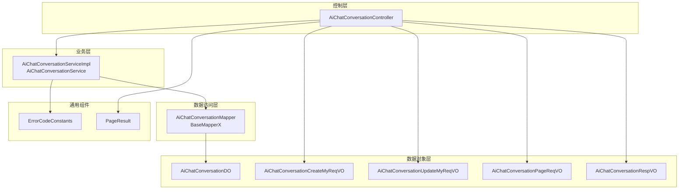

图表来源
- [AiChatConversationController.java:1-113](file://src/main/java/cn/boss/data/ai/controller/chat/AiChatConversationController.java#L1-113)
- [AiChatConversationService.java:1-35](file://src/main/java/cn/boss/data/ai/service/chat/AiChatConversationService.java#L1-35)
- [AiChatConversationServiceImpl.java:1-162](file://src/main/java/cn/boss/data/ai/service/chat/AiChatConversationServiceImpl.java#L1-162)
- [AiChatConversationMapper.java:1-37](file://src/main/java/cn/boss/data/ai/dal/mysql/chat/AiChatConversationMapper.java#L1-37)
- [AiChatConversationDO.java:1-59](file://src/main/java/cn/boss/data/ai/dal/dataobject/chat/AiChatConversationDO.java#L1-59)
- [AiChatConversationCreateMyReqVO.java:1-17](file://src/main/java/cn/boss/data/ai/controller/chat/vo/conversation/AiChatConversationCreateMyReqVO.java#L1-17)
- [AiChatConversationUpdateMyReqVO.java:1-40](file://src/main/java/cn/boss/data/ai/controller/chat/vo/conversation/AiChatConversationUpdateMyReqVO.java#L1-40)
- [AiChatConversationPageReqVO.java:1-27](file://src/main/java/cn/boss/data/ai/controller/chat/vo/conversation/AiChatConversationPageReqVO.java#L1-27)
- [AiChatConversationRespVO.java:1-65](file://src/main/java/cn/boss/data/ai/controller/chat/vo/conversation/AiChatConversationRespVO.java#L1-65)
- [ErrorCodeConstants.java:1-50](file://src/main/java/cn/boss/data/ai/enums/ErrorCodeConstants.java#L1-50)
- [BaseMapperX.java:1-179](file://src/main/java/cn/boss/data/ai/framework/mybatis/core/mapper/BaseMapperX.java#L1-179)
- [PageResult.java:1-42](file://src/main/java/cn/boss/data/ai/framework/common/pojo/PageResult.java#L1-42)

章节来源
- [AiChatConversationController.java:1-113](file://src/main/java/cn/boss/data/ai/controller/chat/AiChatConversationController.java#L1-113)
- [AiChatConversationServiceImpl.java:1-162](file://src/main/java/cn/boss/data/ai/service/chat/AiChatConversationServiceImpl.java#L1-162)
- [AiChatConversationMapper.java:1-37](file://src/main/java/cn/boss/data/ai/dal/mysql/chat/AiChatConversationMapper.java#L1-37)
- [AiChatConversationDO.java:1-59](file://src/main/java/cn/boss/data/ai/dal/dataobject/chat/AiChatConversationDO.java#L1-59)
- [AiChatConversationCreateMyReqVO.java:1-17](file://src/main/java/cn/boss/data/ai/controller/chat/vo/conversation/AiChatConversationCreateMyReqVO.java#L1-17)
- [AiChatConversationUpdateMyReqVO.java:1-40](file://src/main/java/cn/boss/data/ai/controller/chat/vo/conversation/AiChatConversationUpdateMyReqVO.java#L1-40)
- [AiChatConversationPageReqVO.java:1-27](file://src/main/java/cn/boss/data/ai/controller/chat/vo/conversation/AiChatConversationPageReqVO.java#L1-27)
- [AiChatConversationRespVO.java:1-65](file://src/main/java/cn/boss/data/ai/controller/chat/vo/conversation/AiChatConversationRespVO.java#L1-65)
- [ErrorCodeConstants.java:1-50](file://src/main/java/cn/boss/data/ai/enums/ErrorCodeConstants.java#L1-50)
- [BaseMapperX.java:1-179](file://src/main/java/cn/boss/data/ai/framework/mybatis/core/mapper/BaseMapperX.java#L1-179)
- [PageResult.java:1-42](file://src/main/java/cn/boss/data/ai/framework/common/pojo/PageResult.java#L1-42)

## 核心组件
- 控制器：提供 RESTful 接口，包括创建、更新、查询、删除、分页、管理员删除等
- 服务接口与实现：封装业务规则（默认模型选择、置顶时间维护、未置顶批量删除、分页查询）
- Mapper：提供按用户、置顶状态、分页查询与批量删除等能力
- 数据对象：定义对话表结构及冗余字段
- VO：请求/响应参数载体
- 错误码：标准化业务异常

章节来源
- [AiChatConversationController.java:1-113](file://src/main/java/cn/boss/data/ai/controller/chat/AiChatConversationController.java#L1-113)
- [AiChatConversationService.java:1-35](file://src/main/java/cn/boss/data/ai/service/chat/AiChatConversationService.java#L1-35)
- [AiChatConversationServiceImpl.java:1-162](file://src/main/java/cn/boss/data/ai/service/chat/AiChatConversationServiceImpl.java#L1-162)
- [AiChatConversationMapper.java:1-37](file://src/main/java/cn/boss/data/ai/dal/mysql/chat/AiChatConversationMapper.java#L1-37)
- [AiChatConversationDO.java:1-59](file://src/main/java/cn/boss/data/ai/dal/dataobject/chat/AiChatConversationDO.java#L1-59)
- [AiChatConversationCreateMyReqVO.java:1-17](file://src/main/java/cn/boss/data/ai/controller/chat/vo/conversation/AiChatConversationCreateMyReqVO.java#L1-17)
- [AiChatConversationUpdateMyReqVO.java:1-40](file://src/main/java/cn/boss/data/ai/controller/chat/vo/conversation/AiChatConversationUpdateMyReqVO.java#L1-40)
- [AiChatConversationPageReqVO.java:1-27](file://src/main/java/cn/boss/data/ai/controller/chat/vo/conversation/AiChatConversationPageReqVO.java#L1-27)
- [AiChatConversationRespVO.java:1-65](file://src/main/java/cn/boss/data/ai/controller/chat/vo/conversation/AiChatConversationRespVO.java#L1-65)
- [ErrorCodeConstants.java:1-50](file://src/main/java/cn/boss/data/ai/enums/ErrorCodeConstants.java#L1-50)

## 架构总览
对话管理遵循“控制器-服务-数据访问-数据对象”的分层架构，统一通过 CommonResult 包裹返回，分页使用 PageResult 统一结构。管理员权限下提供额外的批量清理与强制删除能力。

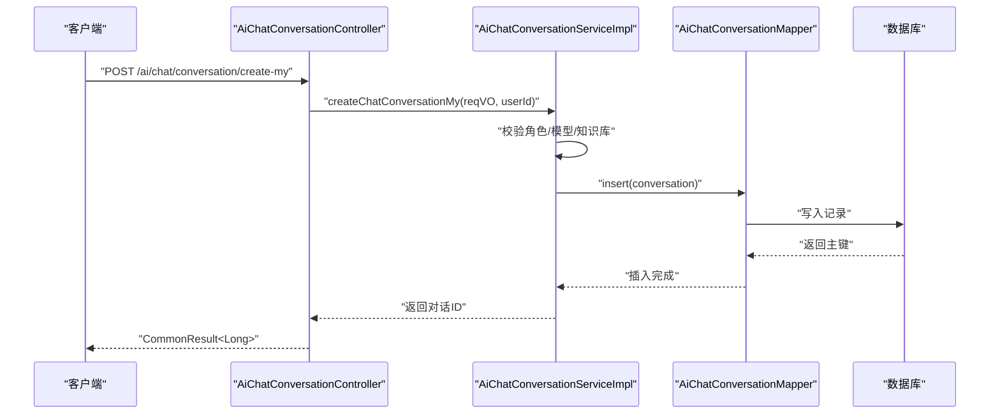

图表来源
- [AiChatConversationController.java:42-46](file://src/main/java/cn/boss/data/ai/controller/chat/AiChatConversationController.java#L42-L46)
- [AiChatConversationServiceImpl.java:52-78](file://src/main/java/cn/boss/data/ai/service/chat/AiChatConversationServiceImpl.java#L52-L78)
- [AiChatConversationMapper.java](file://src/main/java/cn/boss/data/ai/dal/mysql/chat/AiChatConversationMapper.java#L16)

## 详细组件分析

### 数据模型与字段说明
AiChatConversationDO 是对话的核心数据对象，承载用户关联、置顶状态、模型冗余字段、对话配置等。其关键字段含义如下：
- id：主键
- userId：用户编号，用于“我的对话”隔离
- title：对话标题，默认值为“新对话”
- pinned/pinnedTime：置顶标记与置顶时间，置顶时写入当前时间
- roleId/modelId/model：角色、模型编号与模型标志（冗余）
- systemMessage/temperature/maxTokens/maxContexts：对话配置项
- createTime/updateTime/deleted：通用字段由 BaseDO 提供

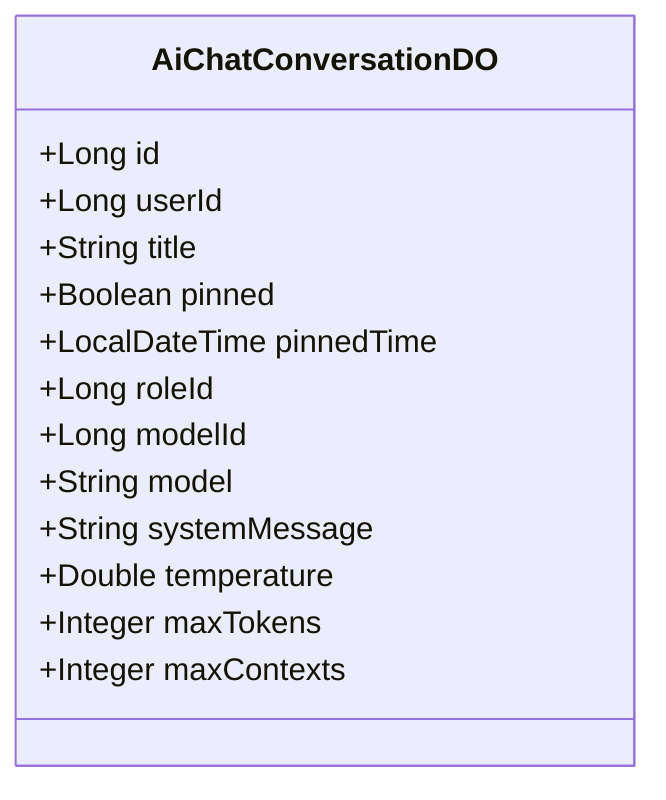

图表来源
- [AiChatConversationDO.java:16-58](file://src/main/java/cn/boss/data/ai/dal/dataobject/chat/AiChatConversationDO.java#L16-L58)

章节来源
- [AiChatConversationDO.java:1-59](file://src/main/java/cn/boss/data/ai/dal/dataobject/chat/AiChatConversationDO.java#L1-59)

### 业务流程与控制流

#### 创建对话
- 输入：AiChatConversationCreateMyReqVO（可选 roleId、knowledgeId）
- 流程要点：
  - 解析并校验聊天角色与模型，若未指定角色则选择默认聊天模型
  - 校验知识库存在性（如有）
  - 构造 AiChatConversationDO 并插入数据库
- 返回：CommonResult<Long>，包含新建对话的 id

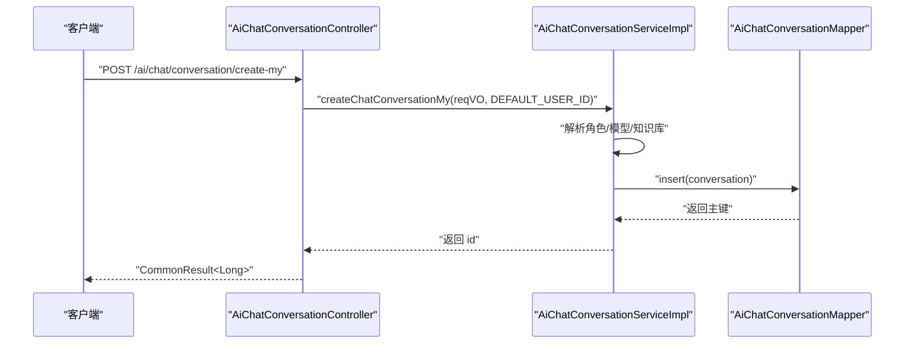

图表来源
- [AiChatConversationController.java:42-46](file://src/main/java/cn/boss/data/ai/controller/chat/AiChatConversationController.java#L42-L46)
- [AiChatConversationServiceImpl.java:52-78](file://src/main/java/cn/boss/data/ai/service/chat/AiChatConversationServiceImpl.java#L52-L78)
- [AiChatConversationMapper.java](file://src/main/java/cn/boss/data/ai/dal/mysql/chat/AiChatConversationMapper.java#L16)

章节来源
- [AiChatConversationController.java:42-46](file://src/main/java/cn/boss/data/ai/controller/chat/AiChatConversationController.java#L42-L46)
- [AiChatConversationServiceImpl.java:52-78](file://src/main/java/cn/boss/data/ai/service/chat/AiChatConversationServiceImpl.java#L52-L78)

#### 更新对话
- 输入：AiChatConversationUpdateMyReqVO（必填 id，其余字段可选）
- 流程要点：
  - 校验对话存在且属于当前用户
  - 校验模型与知识库（如有）
  - 若置顶为真，则设置 pinnedTime
  - 将模型标志同步到冗余字段
  - 更新数据库记录

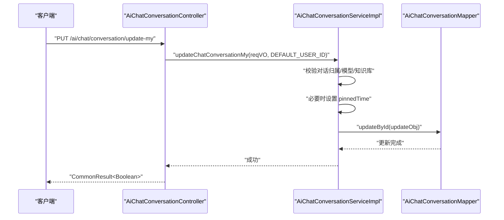

图表来源
- [AiChatConversationController.java:48-53](file://src/main/java/cn/boss/data/ai/controller/chat/AiChatConversationController.java#L48-L53)
- [AiChatConversationServiceImpl.java:80-101](file://src/main/java/cn/boss/data/ai/service/chat/AiChatConversationServiceImpl.java#L80-L101)
- [AiChatConversationMapper.java](file://src/main/java/cn/boss/data/ai/dal/mysql/chat/AiChatConversationMapper.java#L16)

章节来源
- [AiChatConversationController.java:48-53](file://src/main/java/cn/boss/data/ai/controller/chat/AiChatConversationController.java#L48-L53)
- [AiChatConversationServiceImpl.java:80-101](file://src/main/java/cn/boss/data/ai/service/chat/AiChatConversationServiceImpl.java#L80-L101)

#### 查询我的对话列表
- 接口：GET /ai/chat/conversation/my-list
- 流程：按 userId 查询所有对话并映射为响应 VO

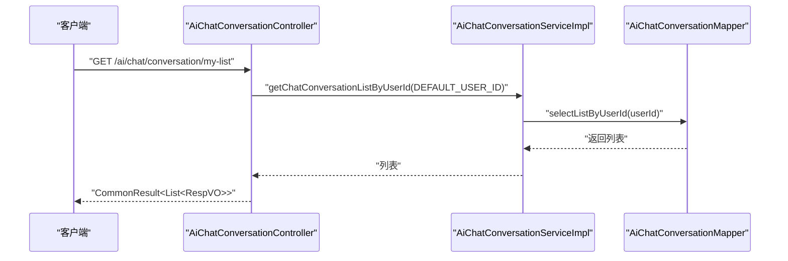

图表来源
- [AiChatConversationController.java:55-60](file://src/main/java/cn/boss/data/ai/controller/chat/AiChatConversationController.java#L55-L60)
- [AiChatConversationServiceImpl.java:103-106](file://src/main/java/cn/boss/data/ai/service/chat/AiChatConversationServiceImpl.java#L103-L106)
- [AiChatConversationMapper.java:18-20](file://src/main/java/cn/boss/data/ai/dal/mysql/chat/AiChatConversationMapper.java#L18-L20)

章节来源
- [AiChatConversationController.java:55-60](file://src/main/java/cn/boss/data/ai/controller/chat/AiChatConversationController.java#L55-L60)
- [AiChatConversationServiceImpl.java:103-106](file://src/main/java/cn/boss/data/ai/service/chat/AiChatConversationServiceImpl.java#L103-L106)

#### 获取单个对话详情（带权限校验）
- 接口：GET /ai/chat/conversation/get-my?id={id}
- 流程：查询对话并校验归属，确保仅能访问自己的对话

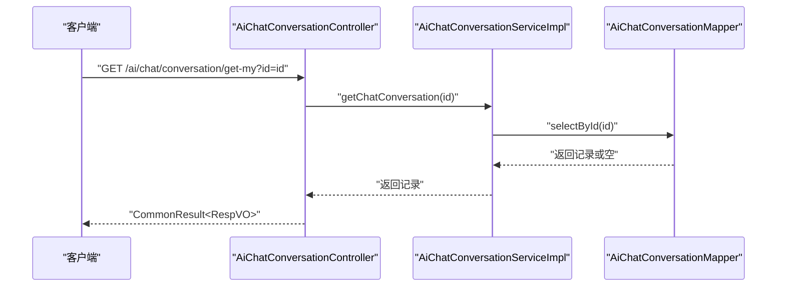

图表来源
- [AiChatConversationController.java:62-71](file://src/main/java/cn/boss/data/ai/controller/chat/AiChatConversationController.java#L62-L71)
- [AiChatConversationServiceImpl.java:108-111](file://src/main/java/cn/boss/data/ai/service/chat/AiChatConversationServiceImpl.java#L108-L111)

章节来源
- [AiChatConversationController.java:62-71](file://src/main/java/cn/boss/data/ai/controller/chat/AiChatConversationController.java#L62-L71)
- [AiChatConversationServiceImpl.java:108-111](file://src/main/java/cn/boss/data/ai/service/chat/AiChatConversationServiceImpl.java#L108-L111)

#### 删除我的对话
- 接口：DELETE /ai/chat/conversation/delete-my?id={id}
- 流程：校验归属后删除

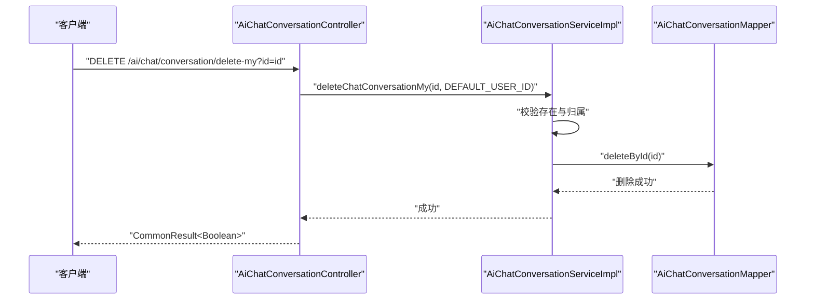

图表来源
- [AiChatConversationController.java:73-79](file://src/main/java/cn/boss/data/ai/controller/chat/AiChatConversationController.java#L73-L79)
- [AiChatConversationServiceImpl.java:113-120](file://src/main/java/cn/boss/data/ai/service/chat/AiChatConversationServiceImpl.java#L113-L120)
- [AiChatConversationMapper.java](file://src/main/java/cn/boss/data/ai/dal/mysql/chat/AiChatConversationMapper.java#L16)

章节来源
- [AiChatConversationController.java:73-79](file://src/main/java/cn/boss/data/ai/controller/chat/AiChatConversationController.java#L73-L79)
- [AiChatConversationServiceImpl.java:113-120](file://src/main/java/cn/boss/data/ai/service/chat/AiChatConversationServiceImpl.java#L113-L120)

#### 删除未置顶对话（我的）
- 接口：DELETE /ai/chat/conversation/delete-by-unpinned
- 流程：按用户筛选未置顶对话并批量删除

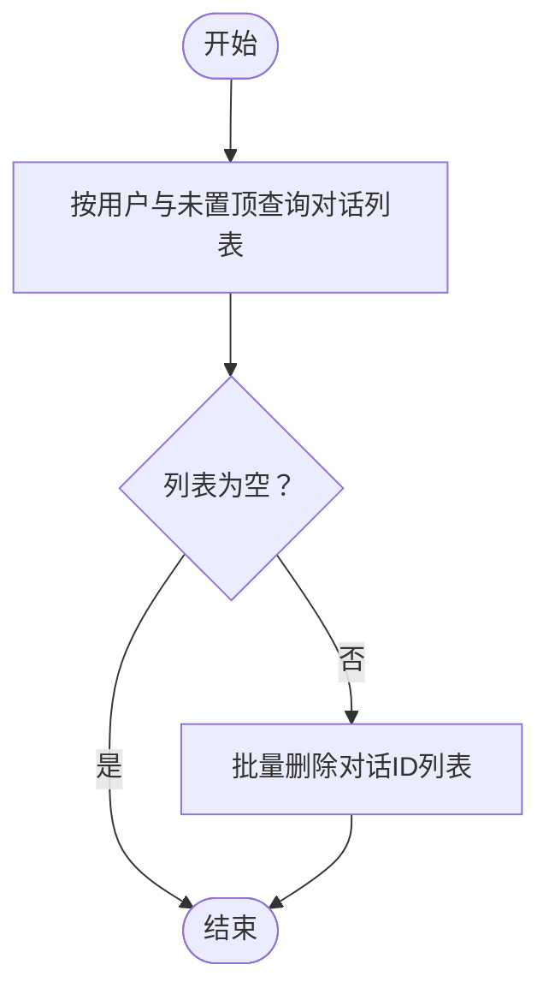

图表来源
- [AiChatConversationController.java:81-86](file://src/main/java/cn/boss/data/ai/controller/chat/AiChatConversationController.java#L81-L86)
- [AiChatConversationServiceImpl.java:147-154](file://src/main/java/cn/boss/data/ai/service/chat/AiChatConversationServiceImpl.java#L147-L154)
- [AiChatConversationMapper.java:22-26](file://src/main/java/cn/boss/data/ai/dal/mysql/chat/AiChatConversationMapper.java#L22-L26)

章节来源
- [AiChatConversationController.java:81-86](file://src/main/java/cn/boss/data/ai/controller/chat/AiChatConversationController.java#L81-L86)
- [AiChatConversationServiceImpl.java:147-154](file://src/main/java/cn/boss/data/ai/service/chat/AiChatConversationServiceImpl.java#L147-L154)

#### 管理员删除对话
- 接口：DELETE /ai/chat/conversation/delete-by-admin?id={id}
- 流程：无需归属校验，仅需存在即删

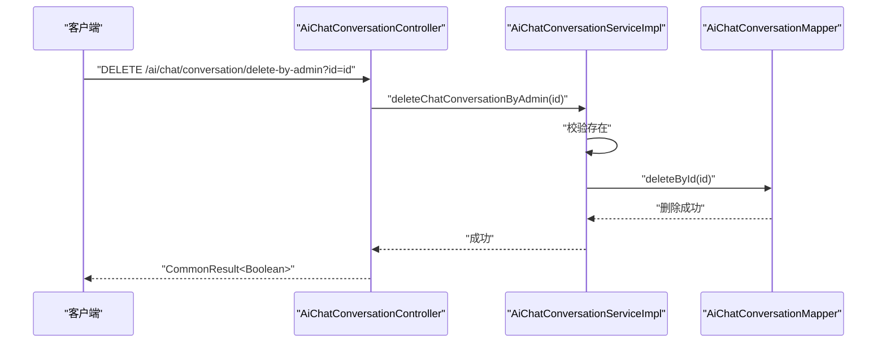

图表来源
- [AiChatConversationController.java:104-110](file://src/main/java/cn/boss/data/ai/controller/chat/AiChatConversationController.java#L104-L110)
- [AiChatConversationServiceImpl.java:122-129](file://src/main/java/cn/boss/data/ai/service/chat/AiChatConversationServiceImpl.java#L122-L129)
- [AiChatConversationMapper.java](file://src/main/java/cn/boss/data/ai/dal/mysql/chat/AiChatConversationMapper.java#L16)

章节来源
- [AiChatConversationController.java:104-110](file://src/main/java/cn/boss/data/ai/controller/chat/AiChatConversationController.java#L104-L110)
- [AiChatConversationServiceImpl.java:122-129](file://src/main/java/cn/boss/data/ai/service/chat/AiChatConversationServiceImpl.java#L122-L129)

#### 对话分页查询（管理后台）
- 接口：GET /ai/chat/conversation/page
- 流程：
  - 调用服务层分页查询
  - 若非空，调用消息服务计算消息数量并回填到响应 VO
  - 返回 PageResult<RespVO>

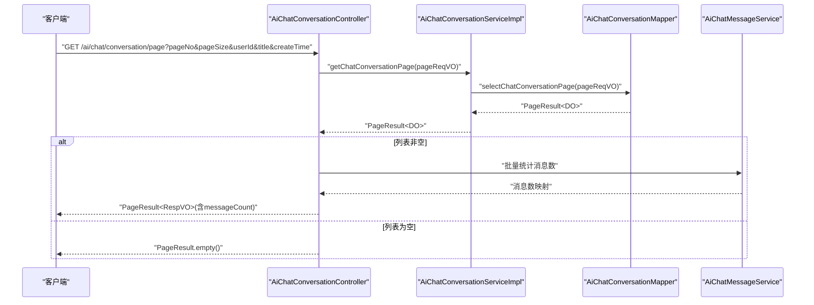

图表来源
- [AiChatConversationController.java:90-102](file://src/main/java/cn/boss/data/ai/controller/chat/AiChatConversationController.java#L90-L102)
- [AiChatConversationServiceImpl.java:156-159](file://src/main/java/cn/boss/data/ai/service/chat/AiChatConversationServiceImpl.java#L156-L159)
- [AiChatConversationMapper.java:28-34](file://src/main/java/cn/boss/data/ai/dal/mysql/chat/AiChatConversationMapper.java#L28-L34)
- [PageResult.java:12-42](file://src/main/java/cn/boss/data/ai/framework/common/pojo/PageResult.java#L12-L42)

章节来源
- [AiChatConversationController.java:90-102](file://src/main/java/cn/boss/data/ai/controller/chat/AiChatConversationController.java#L90-L102)
- [AiChatConversationServiceImpl.java:156-159](file://src/main/java/cn/boss/data/ai/service/chat/AiChatConversationServiceImpl.java#L156-L159)

### API 接口清单

- 创建【我的】对话
  - 方法：POST
  - 路径：/ai/chat/conversation/create-my
  - 请求体：AiChatConversationCreateMyReqVO
  - 返回：CommonResult<Long>

- 更新【我的】对话
  - 方法：PUT
  - 路径：/ai/chat/conversation/update-my
  - 请求体：AiChatConversationUpdateMyReqVO
  - 返回：CommonResult<Boolean>

- 获取【我的】对话列表
  - 方法：GET
  - 路径：/ai/chat/conversation/my-list
  - 返回：CommonResult<List<AiChatConversationRespVO>>

- 获取【我的】对话详情
  - 方法：GET
  - 路径：/ai/chat/conversation/get-my
  - 参数：id（Long，必填）
  - 返回：CommonResult<AiChatConversationRespVO>

- 删除【我的】对话
  - 方法：DELETE
  - 路径：/ai/chat/conversation/delete-my
  - 参数：id（Long，必填）
  - 返回：CommonResult<Boolean>

- 删除未置顶对话（我的）
  - 方法：DELETE
  - 路径：/ai/chat/conversation/delete-by-unpinned
  - 返回：CommonResult<Boolean>

- 获取对话分页（管理后台）
  - 方法：GET
  - 路径：/ai/chat/conversation/page
  - 查询参数：AiChatConversationPageReqVO（包含分页、userId、title、createTime）
  - 返回：CommonResult<PageResult<AiChatConversationRespVO>>
  - 说明：响应 VO 中包含 messageCount 字段（仅在管理后台分页时加载）

- 管理员删除对话
  - 方法：DELETE
  - 路径：/ai/chat/conversation/delete-by-admin
  - 参数：id（Long，必填）
  - 返回：CommonResult<Boolean>

章节来源
- [AiChatConversationController.java:42-110](file://src/main/java/cn/boss/data/ai/controller/chat/AiChatConversationController.java#L42-L110)
- [AiChatConversationPageReqVO.java:14-26](file://src/main/java/cn/boss/data/ai/controller/chat/vo/conversation/AiChatConversationPageReqVO.java#L14-L26)
- [AiChatConversationRespVO.java:10-64](file://src/main/java/cn/boss/data/ai/controller/chat/vo/conversation/AiChatConversationRespVO.java#L10-L64)

## 依赖分析
- 控制器依赖服务层与消息服务（用于分页时统计消息数）
- 服务层依赖 Mapper 与若干领域服务（模型、角色、知识库）
- Mapper 继承 BaseMapperX，复用分页、条件查询、批量删除等通用能力
- 错误码集中定义，便于统一处理与国际化

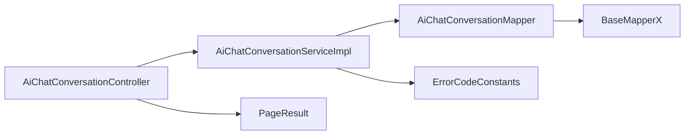

图表来源
- [AiChatConversationController.java:13-40](file://src/main/java/cn/boss/data/ai/controller/chat/AiChatConversationController.java#L13-L40)
- [AiChatConversationServiceImpl.java:13-50](file://src/main/java/cn/boss/data/ai/service/chat/AiChatConversationServiceImpl.java#L13-L50)
- [AiChatConversationMapper.java](file://src/main/java/cn/boss/data/ai/dal/mysql/chat/AiChatConversationMapper.java#L16)
- [BaseMapperX.java:23-42](file://src/main/java/cn/boss/data/ai/framework/mybatis/core/mapper/BaseMapperX.java#L23-L42)
- [PageResult.java:12-42](file://src/main/java/cn/boss/data/ai/framework/common/pojo/PageResult.java#L12-L42)
- [ErrorCodeConstants.java:10-50](file://src/main/java/cn/boss/data/ai/enums/ErrorCodeConstants.java#L10-L50)

章节来源
- [AiChatConversationController.java:1-113](file://src/main/java/cn/boss/data/ai/controller/chat/AiChatConversationController.java#L1-113)
- [AiChatConversationServiceImpl.java:1-162](file://src/main/java/cn/boss/data/ai/service/chat/AiChatConversationServiceImpl.java#L1-162)
- [AiChatConversationMapper.java:1-37](file://src/main/java/cn/boss/data/ai/dal/mysql/chat/AiChatConversationMapper.java#L1-37)
- [BaseMapperX.java:1-179](file://src/main/java/cn/boss/data/ai/framework/mybatis/core/mapper/BaseMapperX.java#L1-179)
- [PageResult.java:1-42](file://src/main/java/cn/boss/data/ai/framework/common/pojo/PageResult.java#L1-42)
- [ErrorCodeConstants.java:1-50](file://src/main/java/cn/boss/data/ai/enums/ErrorCodeConstants.java#L1-50)

## 性能考虑
- 分页查询：使用 LambdaQueryWrapperX 进行条件拼装，避免全表扫描；排序按主键倒序，有利于热点数据的快速定位
- 批量删除：未置顶对话按用户筛选后一次性批量删除，减少多次往返
- 消息数量统计：管理后台分页时按对话 ID 批量统计消息数，避免 N+1 查询
- 默认用户隔离：通过固定 DEFAULT_USER_ID 强制“我的”操作范围，降低跨用户过滤成本

[本节为通用指导，无需列出具体文件来源]

## 故障排查指南
- 对话不存在
  - 现象：更新/删除/查询时抛出“对话不存在”
  - 处理：确认 id 正确、用户归属、是否已被删除
  - 参考：错误码 CHAT_CONVERSATION_NOT_EXISTS

- 聊天模型配置不完整
  - 现象：创建对话时报错“聊天模型配置不完整”
  - 处理：检查模型的 temperature、maxTokens、maxContexts 是否齐全
  - 参考：错误码 CHAT_CONVERSATION_MODEL_ERROR

- 权限问题
  - 现象：查询他人对话为空或报错
  - 处理：确认请求使用的是“我的”接口，或具备管理员权限
  - 参考：控制器中对 DEFAULT_USER_ID 的校验逻辑

章节来源
- [ErrorCodeConstants.java:26-29](file://src/main/java/cn/boss/data/ai/enums/ErrorCodeConstants.java#L26-L29)
- [AiChatConversationServiceImpl.java:131-137](file://src/main/java/cn/boss/data/ai/service/chat/AiChatConversationServiceImpl.java#L131-L137)
- [AiChatConversationController.java:67-69](file://src/main/java/cn/boss/data/ai/controller/chat/AiChatConversationController.java#L67-L69)

## 结论
对话管理模块通过清晰的分层设计与统一的错误码体系，实现了从创建、更新、查询到删除的完整生命周期管理。结合管理员权限下的批量清理与分页统计能力，满足了多场景下的运营与运维需求。建议在扩展时保持 VO/DO 的职责边界，优先使用服务层封装业务规则，并通过分页与批量操作优化性能。

[本节为总结性内容，无需列出具体文件来源]

## 附录

### 关键配置参考
- 数据源与 MyBatis Plus 配置位于 application.yml
- 逻辑删除值与未删除值、驼峰映射等全局配置可在此处查看

章节来源
- [application.yml:18-56](file://src/main/resources/application.yml#L18-L56)