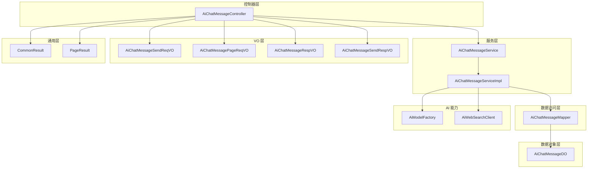
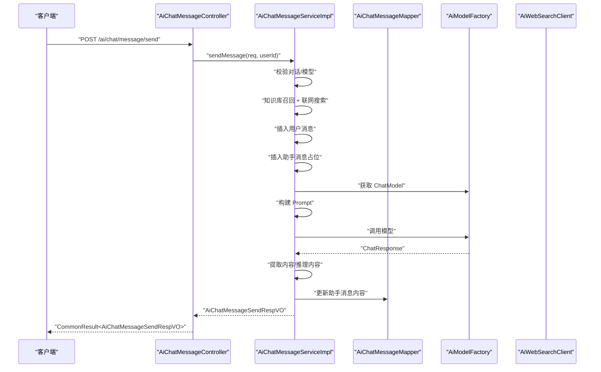
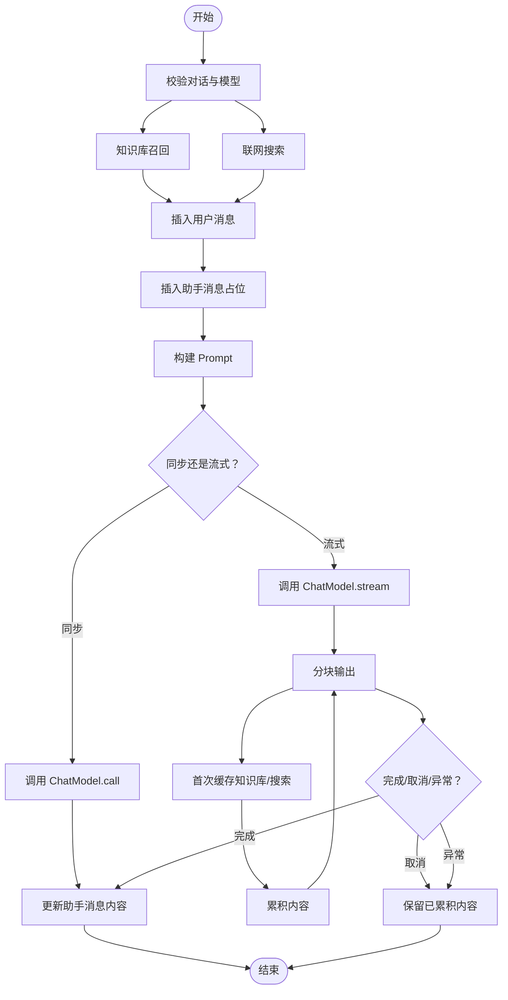
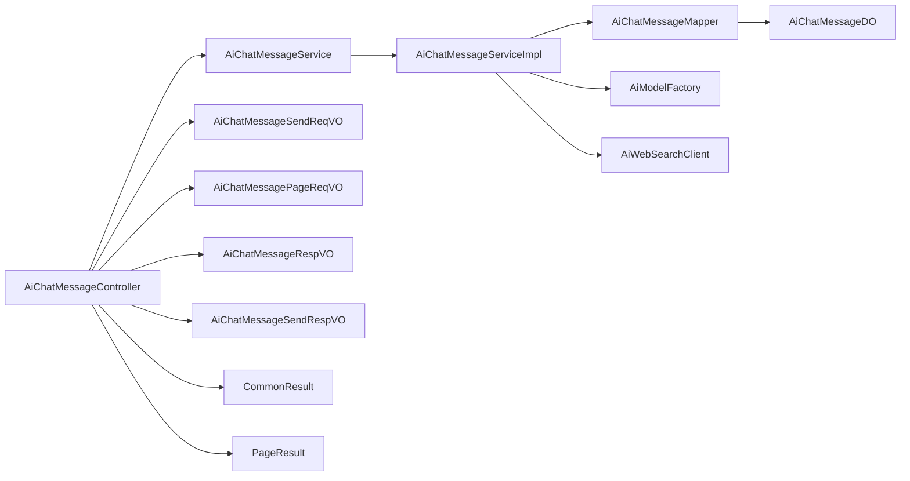

# 消息处理

<cite>
**本文引用的文件**
- [AiChatMessageController.java](file://src/main/java/cn/boss/data/ai/controller/chat/AiChatMessageController.java)
- [AiChatMessageService.java](file://src/main/java/cn/boss/data/ai/service/chat/AiChatMessageService.java)
- [AiChatMessageServiceImpl.java](file://src/main/java/cn/boss/data/ai/service/chat/AiChatMessageServiceImpl.java)
- [AiChatMessageDO.java](file://src/main/java/cn/boss/data/ai/dal/dataobject/chat/AiChatMessageDO.java)
- [AiChatMessageMapper.java](file://src/main/java/cn/boss/data/ai/dal/mysql/chat/AiChatMessageMapper.java)
- [AiChatMessageSendReqVO.java](file://src/main/java/cn/boss/data/ai/controller/chat/vo/message/AiChatMessageSendReqVO.java)
- [AiChatMessagePageReqVO.java](file://src/main/java/cn/boss/data/ai/controller/chat/vo/message/AiChatMessagePageReqVO.java)
- [AiChatMessageRespVO.java](file://src/main/java/cn/boss/data/ai/controller/chat/vo/message/AiChatMessageRespVO.java)
- [AiChatMessageSendRespVO.java](file://src/main/java/cn/boss/data/ai/controller/chat/vo/message/AiChatMessageSendRespVO.java)
- [CommonResult.java](file://src/main/java/cn/boss/data/ai/framework/common/pojo/CommonResult.java)
- [PageResult.java](file://src/main/java/cn/boss/data/ai/framework/common/pojo/PageResult.java)
- [AiModelFactory.java](file://src/main/java/cn/boss/data/ai/framework/ai/core/model/AiModelFactory.java)
- [AiWebSearchClient.java](file://src/main/java/cn/boss/data/ai/framework/ai/core/websearch/AiWebSearchClient.java)
</cite>

## 目录
1. [简介](#简介)
2. [项目结构](#项目结构)
3. [核心组件](#核心组件)
4. [架构总览](#架构总览)
5. [详细组件分析](#详细组件分析)
6. [依赖分析](#依赖分析)
7. [性能考虑](#性能考虑)
8. [故障排除指南](#故障排除指南)
9. [结论](#结论)
10. [附录](#附录)

## 简介
本技术文档围绕消息处理功能，系统阐述聊天消息的发送、接收与存储机制，涵盖消息格式、内容校验、持久化策略；深入解析 Server-Sent Events（SSE）流式响应的实现原理，展示实时消息推送与对话交互体验；提供完整 API 接口文档，包括消息发送、历史消息查询与分页获取；详解消息数据模型设计，包括消息类型、状态管理、时间戳等字段；解释与 AI 模型集成的消息处理流程，包括请求转发、响应解析与错误处理；并给出使用示例、性能优化建议与故障排除指南。

## 项目结构
消息处理模块采用典型的分层架构：
- 控制器层：对外暴露 REST API，负责参数接收、鉴权与响应封装
- 服务层：编排业务逻辑，整合知识库召回、联网搜索、工具调用与模型推理
- 数据访问层：基于 MyBatis-Plus 的 Mapper，提供消息的增删改查与分页
- 数据对象层：定义消息实体及字段映射，支持复杂字段的类型处理器
- VO 层：请求与响应的数据传输对象，用于 API 与服务层之间的数据转换
- 通用层：统一返回体、分页结果与公共工具

图表来源
- [AiChatMessageController.java:40-156](file://src/main/java/cn/boss/data/ai/controller/chat/AiChatMessageController.java#L40-L156)
- [AiChatMessageService.java:15-36](file://src/main/java/cn/boss/data/ai/service/chat/AiChatMessageService.java#L15-L36)
- [AiChatMessageServiceImpl.java:76-506](file://src/main/java/cn/boss/data/ai/service/chat/AiChatMessageServiceImpl.java#L76-L506)
- [AiChatMessageMapper.java:19-54](file://src/main/java/cn/boss/data/ai/dal/mysql/chat/AiChatMessageMapper.java#L19-L54)
- [AiChatMessageDO.java:23-91](file://src/main/java/cn/boss/data/ai/dal/dataobject/chat/AiChatMessageDO.java#L23-L91)
- [AiChatMessageSendReqVO.java:10-32](file://src/main/java/cn/boss/data/ai/controller/chat/vo/message/AiChatMessageSendReqVO.java#L10-L32)
- [AiChatMessagePageReqVO.java:12-30](file://src/main/java/cn/boss/data/ai/controller/chat/vo/message/AiChatMessagePageReqVO.java#L12-L30)
- [AiChatMessageRespVO.java:10-86](file://src/main/java/cn/boss/data/ai/controller/chat/vo/message/AiChatMessageRespVO.java#L10-L86)
- [AiChatMessageSendRespVO.java:10-51](file://src/main/java/cn/boss/data/ai/controller/chat/vo/message/AiChatMessageSendRespVO.java#L10-L51)
- [CommonResult.java:14-85](file://src/main/java/cn/boss/data/ai/framework/common/pojo/CommonResult.java#L14-L85)
- [PageResult.java:10-42](file://src/main/java/cn/boss/data/ai/framework/common/pojo/PageResult.java#L10-L42)
- [AiModelFactory.java:10-63](file://src/main/java/cn/boss/data/ai/framework/ai/core/model/AiModelFactory.java#L10-L63)
- [AiWebSearchClient.java:3-17](file://src/main/java/cn/boss/data/ai/framework/ai/core/websearch/AiWebSearchClient.java#L3-L17)

章节来源
- [AiChatMessageController.java:40-156](file://src/main/java/cn/boss/data/ai/controller/chat/AiChatMessageController.java#L40-L156)
- [AiChatMessageServiceImpl.java:76-506](file://src/main/java/cn/boss/data/ai/service/chat/AiChatMessageServiceImpl.java#L76-L506)
- [AiChatMessageMapper.java:19-54](file://src/main/java/cn/boss/data/ai/dal/mysql/chat/AiChatMessageMapper.java#L19-L54)
- [AiChatMessageDO.java:23-91](file://src/main/java/cn/boss/data/ai/dal/dataobject/chat/AiChatMessageDO.java#L23-L91)
- [CommonResult.java:14-85](file://src/main/java/cn/boss/data/ai/framework/common/pojo/CommonResult.java#L14-L85)
- [PageResult.java:10-42](file://src/main/java/cn/boss/data/ai/framework/common/pojo/PageResult.java#L10-L42)

## 核心组件
- 控制器：提供消息发送（同步/流式）、历史消息查询、分页查询、删除等接口
- 服务：实现消息构建、上下文过滤、知识库召回、联网搜索、工具回调、模型调用与持久化
- 数据访问：提供按会话查询、分页、计数统计等能力
- 数据对象：定义消息实体字段，含消息类型、角色、模型、附件、知识库段落、网络搜索结果等
- VO：定义请求与响应结构，便于 API 与服务层解耦
- 统一返回体：标准化接口返回结构，便于前端消费

章节来源
- [AiChatMessageController.java:40-156](file://src/main/java/cn/boss/data/ai/controller/chat/AiChatMessageController.java#L40-L156)
- [AiChatMessageService.java:15-36](file://src/main/java/cn/boss/data/ai/service/chat/AiChatMessageService.java#L15-L36)
- [AiChatMessageServiceImpl.java:76-506](file://src/main/java/cn/boss/data/ai/service/chat/AiChatMessageServiceImpl.java#L76-L506)
- [AiChatMessageMapper.java:19-54](file://src/main/java/cn/boss/data/ai/dal/mysql/chat/AiChatMessageMapper.java#L19-L54)
- [AiChatMessageDO.java:23-91](file://src/main/java/cn/boss/data/ai/dal/dataobject/chat/AiChatMessageDO.java#L23-L91)
- [AiChatMessageSendReqVO.java:10-32](file://src/main/java/cn/boss/data/ai/controller/chat/vo/message/AiChatMessageSendReqVO.java#L10-L32)
- [AiChatMessagePageReqVO.java:12-30](file://src/main/java/cn/boss/data/ai/controller/chat/vo/message/AiChatMessagePageReqVO.java#L12-L30)
- [AiChatMessageRespVO.java:10-86](file://src/main/java/cn/boss/data/ai/controller/chat/vo/message/AiChatMessageRespVO.java#L10-L86)
- [AiChatMessageSendRespVO.java:10-51](file://src/main/java/cn/boss/data/ai/controller/chat/vo/message/AiChatMessageSendRespVO.java#L10-L51)
- [CommonResult.java:14-85](file://src/main/java/cn/boss/data/ai/framework/common/pojo/CommonResult.java#L14-L85)
- [PageResult.java:10-42](file://src/main/java/cn/boss/data/ai/framework/common/pojo/PageResult.java#L10-L42)

## 架构总览
消息处理的整体流程如下：
- 控制器接收请求，进行参数校验与鉴权
- 服务层构建 Prompt，整合历史消息、知识库、联网搜索与附件
- 调用模型工厂获取 ChatModel 或 StreamingChatModel
- 执行模型调用，同步模式一次性返回，流式模式以 SSE 分块返回
- 将响应内容写回数据库，完成持久化
- 返回统一结构给前端

图表来源
- [AiChatMessageController.java:59-63](file://src/main/java/cn/boss/data/ai/controller/chat/AiChatMessageController.java#L59-L63)
- [AiChatMessageServiceImpl.java:127-180](file://src/main/java/cn/boss/data/ai/service/chat/AiChatMessageServiceImpl.java#L127-L180)
- [AiChatMessageMapper.java:25-29](file://src/main/java/cn/boss/data/ai/dal/mysql/chat/AiChatMessageMapper.java#L25-L29)
- [AiModelFactory.java:13-33](file://src/main/java/cn/boss/data/ai/framework/ai/core/model/AiModelFactory.java#L13-L33)
- [AiWebSearchClient.java:6-16](file://src/main/java/cn/boss/data/ai/framework/ai/core/websearch/AiWebSearchClient.java#L6-L16)

## 详细组件分析

### 控制器层：AiChatMessageController
- 提供以下接口：
  - 消息发送（同步）：POST /ai/chat/message/send
  - 消息发送（流式）：POST /ai/chat/message/send-stream（SSE）
  - 历史消息查询：GET /ai/chat/message/list-by-conversation-id
  - 删除消息：DELETE /ai/chat/message/delete
  - 按会话删除消息：DELETE /ai/chat/message/delete-by-conversation-id
  - 管理后台分页：GET /ai/chat/message/page
  - 管理后台删除消息：DELETE /ai/chat/message/delete-by-admin
- 默认用户 ID：控制器内部固定默认用户 ID，用于权限校验与数据隔离
- 响应统一包装：所有接口返回 CommonResult<T>

章节来源
- [AiChatMessageController.java:40-156](file://src/main/java/cn/boss/data/ai/controller/chat/AiChatMessageController.java#L40-L156)
- [CommonResult.java:14-85](file://src/main/java/cn/boss/data/ai/framework/common/pojo/CommonResult.java#L14-L85)

### 服务层：AiChatMessageService 与 AiChatMessageServiceImpl
- 主要职责：
  - 校验对话与模型有效性
  - 知识库段落召回与拼装
  - 联网搜索结果拼装
  - 构建 Prompt（系统消息、历史消息、当前消息、知识库、搜索、附件）
  - 工具回调与 MCP 客户端集成
  - 同步/流式模型调用
  - 消息持久化与更新
  - 上下文消息过滤（根据最大上下文条数）
  - 附件处理（图片 Base64、文本读取）
- 流式处理：
  - 使用 Reactor Flux 输出分块结果
  - 首次分块缓存知识库与搜索结果
  - 完成/取消/异常时更新或删除助手消息
  - 错误恢复：抛出统一错误码

图表来源
- [AiChatMessageServiceImpl.java:127-277](file://src/main/java/cn/boss/data/ai/service/chat/AiChatMessageServiceImpl.java#L127-L277)
- [AiChatMessageServiceImpl.java:295-347](file://src/main/java/cn/boss/data/ai/service/chat/AiChatMessageServiceImpl.java#L295-L347)
- [AiChatMessageServiceImpl.java:384-410](file://src/main/java/cn/boss/data/ai/service/chat/AiChatMessageServiceImpl.java#L384-L410)
- [AiChatMessageServiceImpl.java:412-442](file://src/main/java/cn/boss/data/ai/service/chat/AiChatMessageServiceImpl.java#L412-L442)

章节来源
- [AiChatMessageService.java:15-36](file://src/main/java/cn/boss/data/ai/service/chat/AiChatMessageService.java#L15-L36)
- [AiChatMessageServiceImpl.java:76-506](file://src/main/java/cn/boss/data/ai/service/chat/AiChatMessageServiceImpl.java#L76-L506)

### 数据访问层：AiChatMessageMapper
- 提供按会话查询消息列表、分页查询、按会话计数统计等方法
- 使用 LambdaQueryWrapperX 与条件构造器，支持多字段过滤与排序

章节来源
- [AiChatMessageMapper.java:19-54](file://src/main/java/cn/boss/data/ai/dal/mysql/chat/AiChatMessageMapper.java#L19-L54)

### 数据对象层：AiChatMessageDO
- 字段说明：
  - id：消息主键
  - conversationId：所属对话
  - replyId：回复的消息（形成问答对）
  - type：消息类型（USER/ASSISTANT 等）
  - userId、roleId、model、modelId：用户、角色、模型冗余字段
  - content、reasoningContent：内容与推理内容
  - useContext：是否携带上下文
  - segmentIds：知识库段落编号数组
  - webSearchPages：网络搜索结果数组
  - attachmentUrls：附件 URL 数组
  - createTime：创建时间
- 类型处理器：
  - LongListTypeHandler：存储 long 数组
  - StringListTypeHandler：存储字符串数组
  - JacksonTypeHandler：存储复杂对象数组

章节来源
- [AiChatMessageDO.java:23-91](file://src/main/java/cn/boss/data/ai/dal/dataobject/chat/AiChatMessageDO.java#L23-L91)

### VO 层：请求与响应
- 请求 VO：
  - AiChatMessageSendReqVO：包含 conversationId、content、useContext、useSearch、attachmentUrls
  - AiChatMessagePageReqVO：继承 PageParam，支持 conversationId、userId、content、createTime 范围查询
- 响应 VO：
  - AiChatMessageRespVO：消息详情，含知识库段落、搜索结果、附件、角色名等
  - AiChatMessageSendRespVO：发送接口返回，包含 send/receive 两个 Message

章节来源
- [AiChatMessageSendReqVO.java:10-32](file://src/main/java/cn/boss/data/ai/controller/chat/vo/message/AiChatMessageSendReqVO.java#L10-L32)
- [AiChatMessagePageReqVO.java:12-30](file://src/main/java/cn/boss/data/ai/controller/chat/vo/message/AiChatMessagePageReqVO.java#L12-L30)
- [AiChatMessageRespVO.java:10-86](file://src/main/java/cn/boss/data/ai/controller/chat/vo/message/AiChatMessageRespVO.java#L10-L86)
- [AiChatMessageSendRespVO.java:10-51](file://src/main/java/cn/boss/data/ai/controller/chat/vo/message/AiChatMessageSendRespVO.java#L10-L51)

### 统一返回与分页
- CommonResult：统一返回结构，包含 code、msg、data
- PageResult：分页结果，包含 total 与 list

章节来源
- [CommonResult.java:14-85](file://src/main/java/cn/boss/data/ai/framework/common/pojo/CommonResult.java#L14-L85)
- [PageResult.java:10-42](file://src/main/java/cn/boss/data/ai/framework/common/pojo/PageResult.java#L10-L42)

### AI 能力集成
- 模型工厂：AiModelFactory 提供 ChatModel、EmbeddingModel、VectorStore 的创建与获取
- 网络搜索：AiWebSearchClient 定义网页搜索接口，服务层按需调用

章节来源
- [AiModelFactory.java:10-63](file://src/main/java/cn/boss/data/ai/framework/ai/core/model/AiModelFactory.java#L10-L63)
- [AiWebSearchClient.java:3-17](file://src/main/java/cn/boss/data/ai/framework/ai/core/websearch/AiWebSearchClient.java#L3-L17)

## 依赖分析
- 控制器依赖服务接口与 VO
- 服务实现依赖 Mapper、模型工厂、知识库/文档/分段服务、工具回调解析器、网络搜索客户端
- Mapper 依赖 MyBatis-Plus 基类与查询构造器
- 数据对象依赖类型处理器与 Jackson 序列化

图表来源
- [AiChatMessageController.java:40-156](file://src/main/java/cn/boss/data/ai/controller/chat/AiChatMessageController.java#L40-L156)
- [AiChatMessageService.java:15-36](file://src/main/java/cn/boss/data/ai/service/chat/AiChatMessageService.java#L15-L36)
- [AiChatMessageServiceImpl.java:76-506](file://src/main/java/cn/boss/data/ai/service/chat/AiChatMessageServiceImpl.java#L76-L506)
- [AiChatMessageMapper.java:19-54](file://src/main/java/cn/boss/data/ai/dal/mysql/chat/AiChatMessageMapper.java#L19-L54)
- [AiChatMessageDO.java:23-91](file://src/main/java/cn/boss/data/ai/dal/dataobject/chat/AiChatMessageDO.java#L23-L91)
- [AiChatMessageSendReqVO.java:10-32](file://src/main/java/cn/boss/data/ai/controller/chat/vo/message/AiChatMessageSendReqVO.java#L10-L32)
- [AiChatMessagePageReqVO.java:12-30](file://src/main/java/cn/boss/data/ai/controller/chat/vo/message/AiChatMessagePageReqVO.java#L12-L30)
- [AiChatMessageRespVO.java:10-86](file://src/main/java/cn/boss/data/ai/controller/chat/vo/message/AiChatMessageRespVO.java#L10-L86)
- [AiChatMessageSendRespVO.java:10-51](file://src/main/java/cn/boss/data/ai/controller/chat/vo/message/AiChatMessageSendRespVO.java#L10-L51)
- [CommonResult.java:14-85](file://src/main/java/cn/boss/data/ai/framework/common/pojo/CommonResult.java#L14-L85)
- [PageResult.java:10-42](file://src/main/java/cn/boss/data/ai/framework/common/pojo/PageResult.java#L10-L42)
- [AiModelFactory.java:10-63](file://src/main/java/cn/boss/data/ai/framework/ai/core/model/AiModelFactory.java#L10-L63)
- [AiWebSearchClient.java:3-17](file://src/main/java/cn/boss/data/ai/framework/ai/core/websearch/AiWebSearchClient.java#L3-L17)

## 性能考虑
- 流式响应：使用 SSE 分块输出，降低首字节延迟，提升交互体验
- 上下文裁剪：按最大上下文条数过滤历史消息，避免提示过长导致性能下降
- 首次分块缓存：在流式场景中，仅首次分块拼装知识库与搜索结果，后续分块复用缓存
- 附件处理：图片转 Base64，非图片读取文本内容，减少重复 IO
- 分页查询：后端分页，避免一次性拉取大量数据
- 异常与取消：在取消或异常时及时更新或清理未完成消息，避免脏数据

## 故障排除指南
- 对话不存在：当用户尝试操作非自身对话时，抛出“对话不存在”错误
- 消息不存在：删除或查询时若消息不存在或不属于当前用户，抛出“消息不存在”错误
- 流式异常：捕获模型调用异常，记录日志并返回统一错误码；若已有累积内容则更新，否则删除占位消息
- 取消请求：客户端取消时，保留已累积内容并更新消息
- 网络搜索不可用：当未注入搜索客户端或开关关闭时，跳过联网搜索
- 附件读取失败：附件下载/读取异常时记录日志并忽略该附件

章节来源
- [AiChatMessageServiceImpl.java:127-180](file://src/main/java/cn/boss/data/ai/service/chat/AiChatMessageServiceImpl.java#L127-L180)
- [AiChatMessageServiceImpl.java:255-277](file://src/main/java/cn/boss/data/ai/service/chat/AiChatMessageServiceImpl.java#L255-L277)
- [AiChatMessageServiceImpl.java:412-442](file://src/main/java/cn/boss/data/ai/service/chat/AiChatMessageServiceImpl.java#L412-L442)

## 结论
本消息处理模块通过清晰的分层设计与完善的流式机制，实现了高可用、可扩展的聊天消息处理能力。结合知识库召回、联网搜索与工具回调，进一步增强了对话的智能性与实用性。统一的返回结构与分页查询为前端提供了良好的交互基础。

## 附录

### API 接口文档

- 发送消息（同步）
  - 方法：POST
  - 路径：/ai/chat/message/send
  - 请求体：AiChatMessageSendReqVO
  - 响应体：CommonResult<AiChatMessageSendRespVO>
  - 说明：一次性返回，适合对响应完整性要求高的场景

- 发送消息（流式）
  - 方法：POST
  - 路径：/ai/chat/message/send-stream
  - 请求体：AiChatMessageSendReqVO
  - 响应体：SSE（Flux<CommonResult<AiChatMessageSendRespVO>>）
  - 说明：分块返回，适合实时交互体验

- 历史消息查询
  - 方法：GET
  - 路径：/ai/chat/message/list-by-conversation-id
  - 参数：conversationId（必填）
  - 响应体：CommonResult<List<AiChatMessageRespVO>>
  - 说明：返回指定对话的历史消息，并拼接知识库段落与文档信息

- 删除消息
  - 方法：DELETE
  - 路径：/ai/chat/message/delete
  - 参数：id（必填）
  - 响应体：CommonResult<Boolean>

- 按会话删除消息
  - 方法：DELETE
  - 路径：/ai/chat/message/delete-by-conversation-id
  - 参数：conversationId（必填）
  - 响应体：CommonResult<Boolean>

- 管理后台分页
  - 方法：GET
  - 路径：/ai/chat/message/page
  - 查询参数：AiChatMessagePageReqVO（继承 PageParam）
  - 响应体：CommonResult<PageResult<AiChatMessageRespVO>>

- 管理后台删除消息
  - 方法：DELETE
  - 路径：/ai/chat/message/delete-by-admin
  - 参数：id（必填）
  - 响应体：CommonResult<Boolean>

章节来源
- [AiChatMessageController.java:59-153](file://src/main/java/cn/boss/data/ai/controller/chat/AiChatMessageController.java#L59-L153)
- [AiChatMessagePageReqVO.java:12-30](file://src/main/java/cn/boss/data/ai/controller/chat/vo/message/AiChatMessagePageReqVO.java#L12-L30)
- [CommonResult.java:14-85](file://src/main/java/cn/boss/data/ai/framework/common/pojo/CommonResult.java#L14-L85)
- [PageResult.java:10-42](file://src/main/java/cn/boss/data/ai/framework/common/pojo/PageResult.java#L10-L42)

### 消息数据模型设计
- 消息类型：USER/ASSISTANT 等
- 状态管理：通过 replyId 形成问答对；流式场景先插入占位消息，完成后更新内容
- 时间戳：createTime 记录创建时间
- 复杂字段：
  - segmentIds：知识库段落编号数组
  - webSearchPages：网络搜索结果数组
  - attachmentUrls：附件 URL 数组
- 类型处理器：long 数组、字符串数组、复杂对象数组分别使用对应 TypeHandler

章节来源
- [AiChatMessageDO.java:23-91](file://src/main/java/cn/boss/data/ai/dal/dataobject/chat/AiChatMessageDO.java#L23-L91)

### 使用示例
- 同步发送消息
  - 请求：POST /ai/chat/message/send
  - 请求体字段：conversationId、content、useContext、useSearch、attachmentUrls
  - 响应：包含 send/receive 两条消息，receive.content 为最终回复内容
- 流式发送消息
  - 请求：POST /ai/chat/message/send-stream
  - 客户端以 SSE 方式接收分块内容，首次分块包含知识库与搜索结果
- 历史消息查询
  - 请求：GET /ai/chat/message/list-by-conversation-id?conversationId=xxx
  - 响应：消息列表，每条消息包含 segments 与 webSearchPages（若有）

章节来源
- [AiChatMessageSendReqVO.java:10-32](file://src/main/java/cn/boss/data/ai/controller/chat/vo/message/AiChatMessageSendReqVO.java#L10-L32)
- [AiChatMessageController.java:59-112](file://src/main/java/cn/boss/data/ai/controller/chat/AiChatMessageController.java#L59-L112)