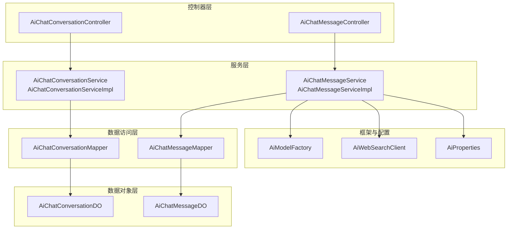
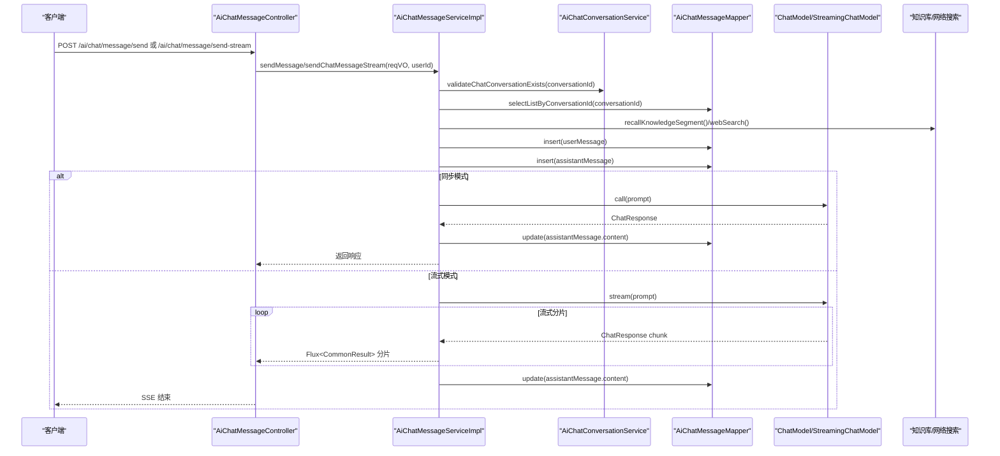
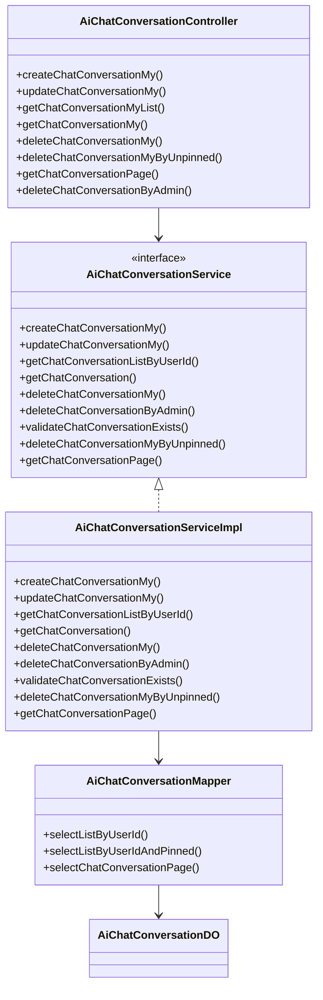
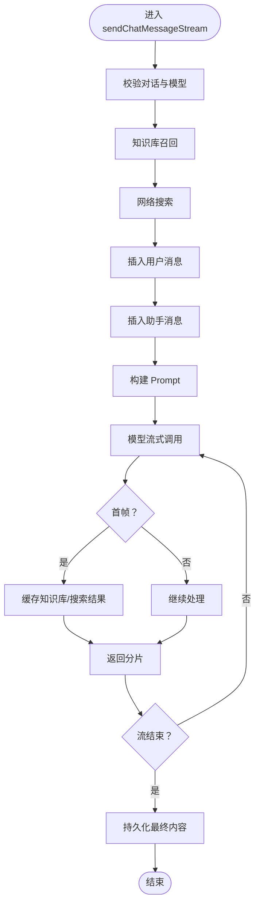
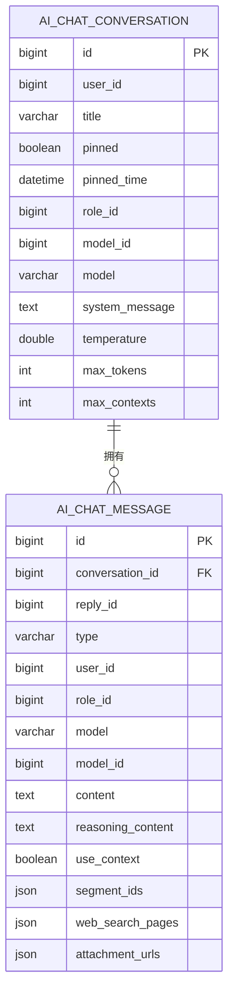
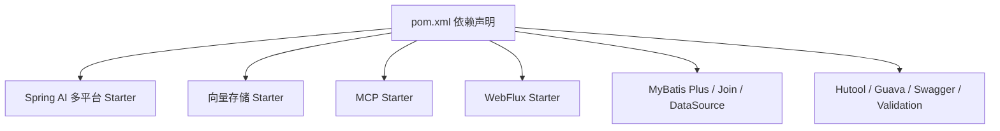

# 聊天对话系统

<cite>
**本文引用的文件**
- [AiChatConversationController.java](file://src/main/java/cn/boss/data/ai/controller/chat/AiChatConversationController.java)
- [AiChatMessageController.java](file://src/main/java/cn/boss/data/ai/controller/chat/AiChatMessageController.java)
- [AiChatConversationService.java](file://src/main/java/cn/boss/data/ai/service/chat/AiChatConversationService.java)
- [AiChatMessageService.java](file://src/main/java/cn/boss/data/ai/service/chat/AiChatMessageService.java)
- [AiChatConversationServiceImpl.java](file://src/main/java/cn/boss/data/ai/service/chat/AiChatConversationServiceImpl.java)
- [AiChatMessageServiceImpl.java](file://src/main/java/cn/boss/data/ai/service/chat/AiChatMessageServiceImpl.java)
- [AiChatConversationDO.java](file://src/main/java/cn/boss/data/ai/dal/dataobject/chat/AiChatConversationDO.java)
- [AiChatMessageDO.java](file://src/main/java/cn/boss/data/ai/dal/dataobject/chat/AiChatMessageDO.java)
- [AiChatConversationMapper.java](file://src/main/java/cn/boss/data/ai/dal/mysql/chat/AiChatConversationMapper.java)
- [AiChatMessageMapper.java](file://src/main/java/cn/boss/data/ai/dal/mysql/chat/AiChatMessageMapper.java)
- [AiModelFactory.java](file://src/main/java/cn/boss/data/ai/framework/ai/core/model/AiModelFactory.java)
- [AiWebSearchClient.java](file://src/main/java/cn/boss/data/ai/framework/ai/core/websearch/AiWebSearchClient.java)
- [AiChatConversationCreateMyReqVO.java](file://src/main/java/cn/boss/data/ai/controller/chat/vo/conversation/AiChatConversationCreateMyReqVO.java)
- [AiChatMessageSendReqVO.java](file://src/main/java/cn/boss/data/ai/controller/chat/vo/message/AiChatMessageSendReqVO.java)
- [AiProperties.java](file://src/main/java/cn/boss/data/ai/framework/ai/config/AiProperties.java)
- [pom.xml](file://pom.xml)
</cite>

## 目录
1. [简介](#简介)
2. [项目结构](#项目结构)
3. [核心组件](#核心组件)
4. [架构总览](#架构总览)
5. [详细组件分析](#详细组件分析)
6. [依赖分析](#依赖分析)
7. [性能考虑](#性能考虑)
8. [故障排查指南](#故障排查指南)
9. [结论](#结论)
10. [附录：API 接口文档](#附录api-接口文档)

## 简介
本项目是一个基于 Spring Boot 与 Spring AI 的聊天对话系统，支持多轮对话、消息发送与接收、知识库检索增强、联网搜索增强、工具回调（含 MCP）、附件上传解析、以及 SSE（Server-Sent Events）流式响应，提供完整的对话生命周期管理与实时交互体验。

## 项目结构
系统采用典型的分层架构：
- 控制器层：负责 HTTP 请求接入与响应封装，分别提供对话与消息的 REST API。
- 服务层：实现业务逻辑，包括对话创建/更新/查询、消息发送（同步/流式）、上下文过滤、知识库与网络搜索集成等。
- 数据访问层：MyBatis Mapper 提供对对话与消息表的增删改查。
- 数据对象层：DO 定义了对话与消息的数据模型，包含冗余字段与复杂类型字段。
- 配置与框架：AI 模型工厂、WebSearch 客户端接口、AI 配置属性等。

图表来源
- [AiChatConversationController.java:30-113](file://src/main/java/cn/boss/data/ai/controller/chat/AiChatConversationController.java#L30-L113)
- [AiChatMessageController.java:40-156](file://src/main/java/cn/boss/data/ai/controller/chat/AiChatMessageController.java#L40-L156)
- [AiChatConversationService.java:14-35](file://src/main/java/cn/boss/data/ai/service/chat/AiChatConversationService.java#L14-L35)
- [AiChatMessageService.java:18-37](file://src/main/java/cn/boss/data/ai/service/chat/AiChatMessageService.java#L18-L37)
- [AiChatConversationServiceImpl.java:40-162](file://src/main/java/cn/boss/data/ai/service/chat/AiChatConversationServiceImpl.java#L40-L162)
- [AiChatMessageServiceImpl.java:78-506](file://src/main/java/cn/boss/data/ai/service/chat/AiChatMessageServiceImpl.java#L78-L506)
- [AiChatConversationMapper.java:15-37](file://src/main/java/cn/boss/data/ai/dal/mysql/chat/AiChatConversationMapper.java#L15-L37)
- [AiChatMessageMapper.java:22-54](file://src/main/java/cn/boss/data/ai/dal/mysql/chat/AiChatMessageMapper.java#L22-L54)
- [AiChatConversationDO.java:16-59](file://src/main/java/cn/boss/data/ai/dal/dataobject/chat/AiChatConversationDO.java#L16-L59)
- [AiChatMessageDO.java:26-91](file://src/main/java/cn/boss/data/ai/dal/dataobject/chat/AiChatMessageDO.java#L26-L91)
- [AiModelFactory.java:13-63](file://src/main/java/cn/boss/data/ai/framework/ai/core/model/AiModelFactory.java#L13-L63)
- [AiWebSearchClient.java:6-17](file://src/main/java/cn/boss/data/ai/framework/ai/core/websearch/AiWebSearchClient.java#L6-L17)
- [AiProperties.java:9-134](file://src/main/java/cn/boss/data/ai/framework/ai/config/AiProperties.java#L9-L134)

章节来源
- [AiChatConversationController.java:30-113](file://src/main/java/cn/boss/data/ai/controller/chat/AiChatConversationController.java#L30-L113)
- [AiChatMessageController.java:40-156](file://src/main/java/cn/boss/data/ai/controller/chat/AiChatMessageController.java#L40-L156)
- [AiChatConversationServiceImpl.java:40-162](file://src/main/java/cn/boss/data/ai/service/chat/AiChatConversationServiceImpl.java#L40-L162)
- [AiChatMessageServiceImpl.java:78-506](file://src/main/java/cn/boss/data/ai/service/chat/AiChatMessageServiceImpl.java#L78-L506)
- [AiChatConversationMapper.java:15-37](file://src/main/java/cn/boss/data/ai/dal/mysql/chat/AiChatConversationMapper.java#L15-L37)
- [AiChatMessageMapper.java:22-54](file://src/main/java/cn/boss/data/ai/dal/mysql/chat/AiChatMessageMapper.java#L22-L54)
- [AiChatConversationDO.java:16-59](file://src/main/java/cn/boss/data/ai/dal/dataobject/chat/AiChatConversationDO.java#L16-L59)
- [AiChatMessageDO.java:26-91](file://src/main/java/cn/boss/data/ai/dal/dataobject/chat/AiChatMessageDO.java#L26-L91)
- [AiModelFactory.java:13-63](file://src/main/java/cn/boss/data/ai/framework/ai/core/model/AiModelFactory.java#L13-L63)
- [AiWebSearchClient.java:6-17](file://src/main/java/cn/boss/data/ai/framework/ai/core/websearch/AiWebSearchClient.java#L6-L17)
- [AiProperties.java:9-134](file://src/main/java/cn/boss/data/ai/framework/ai/config/AiProperties.java#L9-L134)

## 核心组件
- 控制器
  - 对话控制器：提供创建、更新、查询、删除对话，以及对话分页与管理员操作。
  - 消息控制器：提供消息发送（同步与流式）、消息列表查询、消息删除与分页。
- 服务
  - 对话服务：校验模型、角色与知识库，创建/更新/删除对话，分页查询。
  - 消息服务：构建 Prompt、调用模型（同步/流式）、上下文裁剪、知识库与网络搜索召回、工具回调、附件解析、持久化。
- 数据访问
  - 对话 Mapper：按用户、置顶状态、分页查询。
  - 消息 Mapper：按对话查询、统计计数、分页查询。
- 数据模型
  - 对话 DO：包含标题、置顶、角色、模型、系统提示词、温度、最大令牌、上下文数量等。
  - 消息 DO：包含消息类型、回复关系、模型与角色冗余、内容、推理内容、是否使用上下文、知识库段落 ID 列表、网络搜索页面、附件 URL 列表等。
- 框架与配置
  - 模型工厂：统一获取或创建 ChatModel、EmbeddingModel、VectorStore。
  - WebSearch 客户端：抽象网络搜索能力。
  - AI 配置：集中管理各平台 API Key、URL、模型、温度、最大令牌等。

章节来源
- [AiChatConversationController.java:42-112](file://src/main/java/cn/boss/data/ai/controller/chat/AiChatConversationController.java#L42-L112)
- [AiChatMessageController.java:59-155](file://src/main/java/cn/boss/data/ai/controller/chat/AiChatMessageController.java#L59-L155)
- [AiChatConversationService.java:14-35](file://src/main/java/cn/boss/data/ai/service/chat/AiChatConversationService.java#L14-L35)
- [AiChatMessageService.java:18-37](file://src/main/java/cn/boss/data/ai/service/chat/AiChatMessageService.java#L18-L37)
- [AiChatConversationServiceImpl.java:52-161](file://src/main/java/cn/boss/data/ai/service/chat/AiChatConversationServiceImpl.java#L52-L161)
- [AiChatMessageServiceImpl.java:126-506](file://src/main/java/cn/boss/data/ai/service/chat/AiChatMessageServiceImpl.java#L126-L506)
- [AiChatConversationMapper.java:18-34](file://src/main/java/cn/boss/data/ai/dal/mysql/chat/AiChatConversationMapper.java#L18-L34)
- [AiChatMessageMapper.java:25-51](file://src/main/java/cn/boss/data/ai/dal/mysql/chat/AiChatMessageMapper.java#L25-L51)
- [AiChatConversationDO.java:22-58](file://src/main/java/cn/boss/data/ai/dal/dataobject/chat/AiChatConversationDO.java#L22-L58)
- [AiChatMessageDO.java:32-90](file://src/main/java/cn/boss/data/ai/dal/dataobject/chat/AiChatMessageDO.java#L32-L90)
- [AiModelFactory.java:13-63](file://src/main/java/cn/boss/data/ai/framework/ai/core/model/AiModelFactory.java#L13-L63)
- [AiWebSearchClient.java:6-17](file://src/main/java/cn/boss/data/ai/framework/ai/core/websearch/AiWebSearchClient.java#L6-L17)
- [AiProperties.java:9-134](file://src/main/java/cn/boss/data/ai/framework/ai/config/AiProperties.java#L9-L134)

## 架构总览
系统以“控制器-服务-数据访问-数据对象”为核心，结合 AI 模型工厂与 WebSearch 客户端，形成可扩展的聊天对话架构。消息发送流程支持同步与流式两种模式，均通过 Prompt 构建与模型调用完成，并在完成后持久化 Assistant 消息内容。

图表来源
- [AiChatMessageController.java:60-69](file://src/main/java/cn/boss/data/ai/controller/chat/AiChatMessageController.java#L60-L69)
- [AiChatMessageServiceImpl.java:126-276](file://src/main/java/cn/boss/data/ai/service/chat/AiChatMessageServiceImpl.java#L126-L276)
- [AiChatConversationService.java:28-28](file://src/main/java/cn/boss/data/ai/service/chat/AiChatConversationService.java#L28-L28)
- [AiChatMessageMapper.java:25-29](file://src/main/java/cn/boss/data/ai/dal/mysql/chat/AiChatMessageMapper.java#L25-L29)
- [AiModelFactory.java:25-33](file://src/main/java/cn/boss/data/ai/framework/ai/core/model/AiModelFactory.java#L25-L33)

## 详细组件分析

### 对话管理模块
- 功能点
  - 创建对话：根据角色与模型初始化对话，必要时校验知识库存在性。
  - 更新对话：支持模型切换、置顶时间更新、知识库变更等。
  - 查询与分页：按用户、标题、时间范围等条件分页查询。
  - 删除：支持个人删除与管理员删除；支持批量删除未置顶对话。
- 关键实现
  - 校验模型参数完整性与类型一致性。
  - 使用 Mapper 进行按用户与置顶状态查询。
  - 分页查询时拼接消息数量统计。

图表来源
- [AiChatConversationController.java:42-112](file://src/main/java/cn/boss/data/ai/controller/chat/AiChatConversationController.java#L42-L112)
- [AiChatConversationService.java:14-35](file://src/main/java/cn/boss/data/ai/service/chat/AiChatConversationService.java#L14-L35)
- [AiChatConversationServiceImpl.java:52-161](file://src/main/java/cn/boss/data/ai/service/chat/AiChatConversationServiceImpl.java#L52-L161)
- [AiChatConversationMapper.java:18-34](file://src/main/java/cn/boss/data/ai/dal/mysql/chat/AiChatConversationMapper.java#L18-L34)
- [AiChatConversationDO.java:22-58](file://src/main/java/cn/boss/data/ai/dal/dataobject/chat/AiChatConversationDO.java#L22-L58)

章节来源
- [AiChatConversationController.java:42-112](file://src/main/java/cn/boss/data/ai/controller/chat/AiChatConversationController.java#L42-L112)
- [AiChatConversationServiceImpl.java:52-161](file://src/main/java/cn/boss/data/ai/service/chat/AiChatConversationServiceImpl.java#L52-L161)
- [AiChatConversationMapper.java:18-34](file://src/main/java/cn/boss/data/ai/dal/mysql/chat/AiChatConversationMapper.java#L18-L34)
- [AiChatConversationDO.java:22-58](file://src/main/java/cn/boss/data/ai/dal/dataobject/chat/AiChatConversationDO.java#L22-L58)

### 消息处理与流式响应模块
- 功能点
  - 同步发送：构建 Prompt，调用模型，持久化 Assistant 内容后返回。
  - 流式发送：基于 Reactor Flux，边生成边返回，结束时回填内容。
  - 上下文裁剪：按最大上下文数量裁剪最近的问答对。
  - 知识库与网络搜索：召回段落与网页摘要，注入到用户消息中。
  - 附件解析：图片 Base64 编码，非图片文本读取，注入到用户消息。
  - 工具回调：基于角色绑定的工具名称解析为回调，支持 MCP 客户端。
- 关键实现
  - 构建 Prompt：系统消息、历史消息、当前用户消息、知识库引用、网络搜索、附件。
  - 流式处理：首帧缓存知识库与网络搜索结果，后续仅增量返回内容。
  - 错误与取消：异常与取消时回填已生成内容，避免丢失。

图表来源
- [AiChatMessageServiceImpl.java:182-276](file://src/main/java/cn/boss/data/ai/service/chat/AiChatMessageServiceImpl.java#L182-L276)

章节来源
- [AiChatMessageController.java:59-155](file://src/main/java/cn/boss/data/ai/controller/chat/AiChatMessageController.java#L59-L155)
- [AiChatMessageServiceImpl.java:126-506](file://src/main/java/cn/boss/data/ai/service/chat/AiChatMessageServiceImpl.java#L126-L506)
- [AiChatMessageDO.java:32-90](file://src/main/java/cn/boss/data/ai/dal/dataobject/chat/AiChatMessageDO.java#L32-L90)

### 数据模型设计
- 对话模型（AiChatConversationDO）
  - 关键字段：用户标识、标题、置顶标记与时间、角色与模型冗余、系统消息、温度、最大令牌、最大上下文数。
  - 设计要点：冗余模型字段便于查询展示；置顶时间用于排序与清理策略。
- 消息模型（AiChatMessageDO）
  - 关键字段：对话标识、回复关系、消息类型、用户与角色、模型冗余、内容、推理内容、上下文开关、知识库段落 ID 列表、网络搜索页面、附件 URL 列表。
  - 设计要点：复杂类型通过 TypeHandler 存储；附件支持图片与非图片两类处理；回复关系保证问答配对。

图表来源
- [AiChatConversationDO.java:22-58](file://src/main/java/cn/boss/data/ai/dal/dataobject/chat/AiChatConversationDO.java#L22-L58)
- [AiChatMessageDO.java:32-90](file://src/main/java/cn/boss/data/ai/dal/dataobject/chat/AiChatMessageDO.java#L32-L90)
- [AiChatMessageMapper.java:25-29](file://src/main/java/cn/boss/data/ai/dal/mysql/chat/AiChatMessageMapper.java#L25-L29)

章节来源
- [AiChatConversationDO.java:22-58](file://src/main/java/cn/boss/data/ai/dal/dataobject/chat/AiChatConversationDO.java#L22-L58)
- [AiChatMessageDO.java:32-90](file://src/main/java/cn/boss/data/ai/dal/dataobject/chat/AiChatMessageDO.java#L32-L90)
- [AiChatMessageMapper.java:25-29](file://src/main/java/cn/boss/data/ai/dal/mysql/chat/AiChatMessageMapper.java#L25-L29)

### SSE（Server-Sent Events）流式响应技术实现
- 技术要点
  - 使用 Spring WebFlux 的 Flux 输出流式数据，媒体类型为 TEXT_EVENT_STREAM。
  - 控制器方法直接返回 Flux<CommonResult<T>>，由框架自动序列化为 SSE。
  - 服务端在流结束时回填 Assistant 内容，异常与取消时同样回填，保证数据一致性。
- 最佳实践
  - 客户端使用 EventSource 接收事件，注意断线重连与错误处理。
  - 控制器层仅做薄封装，业务逻辑集中在服务层，便于测试与扩展。

章节来源
- [AiChatMessageController.java:65-69](file://src/main/java/cn/boss/data/ai/controller/chat/AiChatMessageController.java#L65-L69)
- [AiChatMessageServiceImpl.java:217-276](file://src/main/java/cn/boss/data/ai/service/chat/AiChatMessageServiceImpl.java#L217-L276)

## 依赖分析
- 模型与向量存储
  - 引入多种 Spring AI Starter 以适配不同平台与能力，如 OpenAI、Azure OpenAI、Anthropic、Ollama、Stability AI、DashScope、QianFan、Moonshot 等。
  - 向量存储支持 Qdrant 与 Redis。
- WebFlux
  - 引入 spring-boot-starter-webflux，支撑 SSE 流式输出。
- 工具与 MCP
  - 支持工具回调与 MCP 客户端，通过 ToolCallbackResolver 解析工具名称。
- 其他
  - MyBatis Plus、MyBatis Plus Join、动态数据源、SQL 性能分析、Swagger、Redis、Validation 等。

图表来源
- [pom.xml:47-280](file://pom.xml#L47-L280)

章节来源
- [pom.xml:47-280](file://pom.xml#L47-L280)

## 性能考虑
- 上下文裁剪
  - 通过 maxContexts 控制历史消息对数量，避免上下文过长导致延迟与成本上升。
- 流式输出
  - 使用流式模型调用与 SSE，降低首字节延迟，提升用户体验。
- 缓存与预取
  - 首帧缓存知识库与网络搜索结果，减少重复计算与网络开销。
- 数据库优化
  - 按对话分页查询与统计，使用索引列（如 conversation_id、user_id、create_time）优化查询。
- 模型选择
  - 在 AiProperties 中集中配置各平台参数，便于按需启用与切换。

章节来源
- [AiChatMessageServiceImpl.java:384-410](file://src/main/java/cn/boss/data/ai/service/chat/AiChatMessageServiceImpl.java#L384-L410)
- [AiChatMessageMapper.java:25-51](file://src/main/java/cn/boss/data/ai/dal/mysql/chat/AiChatMessageMapper.java#L25-L51)
- [AiProperties.java:9-134](file://src/main/java/cn/boss/data/ai/framework/ai/config/AiProperties.java#L9-L134)

## 故障排查指南
- 对话不存在
  - 现象：更新/删除/发送消息时报错。
  - 处理：确认 conversationId 是否属于当前用户；检查 validateChatConversationExists 逻辑。
- 模型参数不完整
  - 现象：创建对话失败。
  - 处理：确保模型具备温度、最大令牌、上下文等参数；检查模型类型为聊天模型。
- 流式异常或取消
  - 现象：客户端提前断开或异常中断。
  - 处理：服务端会在异常与取消时回填已生成内容；检查日志定位具体异常。
- 知识库/网络搜索不可用
  - 现象：召回为空或报错。
  - 处理：确认角色绑定了知识库 ID；确认 WebSearch 客户端可用且配置正确。

章节来源
- [AiChatConversationServiceImpl.java:131-137](file://src/main/java/cn/boss/data/ai/service/chat/AiChatConversationServiceImpl.java#L131-L137)
- [AiChatMessageServiceImpl.java:255-276](file://src/main/java/cn/boss/data/ai/service/chat/AiChatMessageServiceImpl.java#L255-L276)
- [AiWebSearchClient.java:6-17](file://src/main/java/cn/boss/data/ai/framework/ai/core/websearch/AiWebSearchClient.java#L6-L17)

## 结论
该聊天对话系统通过清晰的分层设计与丰富的扩展点，实现了从对话管理到消息处理、从同步到流式的完整链路。结合知识库检索、网络搜索、工具回调与附件处理，能够满足多样化的智能对话场景。SSE 流式响应进一步提升了实时交互体验。建议在生产环境中关注上下文裁剪、模型参数配置与异常恢复策略，持续优化性能与稳定性。

## 附录API 接口文档

- 对话管理
  - 创建【我的】对话
    - 方法：POST
    - 路径：/ai/chat/conversation/create-my
    - 请求体：AiChatConversationCreateMyReqVO
    - 返回：CommonResult<Long>
  - 更新【我的】对话
    - 方法：PUT
    - 路径：/ai/chat/conversation/update-my
    - 请求体：AiChatConversationUpdateMyReqVO
    - 返回：CommonResult<Boolean>
  - 获取【我的】对话列表
    - 方法：GET
    - 路径：/ai/chat/conversation/my-list
    - 返回：CommonResult<List<AiChatConversationRespVO>>
  - 获取【我的】对话
    - 方法：GET
    - 路径：/ai/chat/conversation/get-my
    - 参数：id（对话编号）
    - 返回：CommonResult<AiChatConversationRespVO>
  - 删除对话
    - 方法：DELETE
    - 路径：/ai/chat/conversation/delete-my
    - 参数：id（对话编号）
    - 返回：CommonResult<Boolean>
  - 删除未置顶对话
    - 方法：DELETE
    - 路径：/ai/chat/conversation/delete-by-unpinned
    - 返回：CommonResult<Boolean>
  - 对话分页（管理后台）
    - 方法：GET
    - 路径：/ai/chat/conversation/page
    - 查询：AiChatConversationPageReqVO
    - 返回：CommonResult<PageResult<AiChatConversationRespVO>>
  - 管理员删除对话
    - 方法：DELETE
    - 路径：/ai/chat/conversation/delete-by-admin
    - 参数：id（对话编号）
    - 返回：CommonResult<Boolean>

- 消息管理
  - 发送消息（一次性返回）
    - 方法：POST
    - 路径：/ai/chat/message/send
    - 请求体：AiChatMessageSendReqVO
    - 返回：CommonResult<AiChatMessageSendRespVO>
  - 发送消息（流式返回）
    - 方法：POST
    - 路径：/ai/chat/message/send-stream
    - 请求体：AiChatMessageSendReqVO
    - 返回：Flux<CommonResult<AiChatMessageSendRespVO>>（SSE）
  - 获取指定对话的消息列表
    - 方法：GET
    - 路径：/ai/chat/message/list-by-conversation-id
    - 参数：conversationId（对话编号）
    - 返回：CommonResult<List<AiChatMessageRespVO>>
  - 删除消息
    - 方法：DELETE
    - 路径：/ai/chat/message/delete
    - 参数：id（消息编号）
    - 返回：CommonResult<Boolean>
  - 删除指定对话的所有消息
    - 方法：DELETE
    - 路径：/ai/chat/message/delete-by-conversation-id
    - 参数：conversationId（对话编号）
    - 返回：CommonResult<Boolean>
  - 消息分页（管理后台）
    - 方法：GET
    - 路径：/ai/chat/message/page
    - 查询：AiChatMessagePageReqVO
    - 返回：CommonResult<PageResult<AiChatMessageRespVO>>
  - 管理员删除消息
    - 方法：DELETE
    - 路径：/ai/chat/message/delete-by-admin
    - 参数：id（消息编号）
    - 返回：CommonResult<Boolean>

- 请求体与响应体要点
  - AiChatMessageSendReqVO
    - conversationId：对话编号（必填）
    - content：消息内容（必填）
    - useContext：是否携带上下文（可选）
    - useSearch：是否联网搜索（可选）
    - attachmentUrls：附件 URL 数组（可选）
  - AiChatMessageSendRespVO
    - send：发送的消息（包含消息基本信息）
    - receive：接收的消息（包含内容、推理内容、知识库段落、网络搜索页面）

章节来源
- [AiChatConversationController.java:42-112](file://src/main/java/cn/boss/data/ai/controller/chat/AiChatConversationController.java#L42-L112)
- [AiChatMessageController.java:59-155](file://src/main/java/cn/boss/data/ai/controller/chat/AiChatMessageController.java#L59-L155)
- [AiChatConversationCreateMyReqVO.java:8-16](file://src/main/java/cn/boss/data/ai/controller/chat/vo/conversation/AiChatConversationCreateMyReqVO.java#L8-L16)
- [AiChatMessageSendReqVO.java:12-31](file://src/main/java/cn/boss/data/ai/controller/chat/vo/message/AiChatMessageSendReqVO.java#L12-L31)