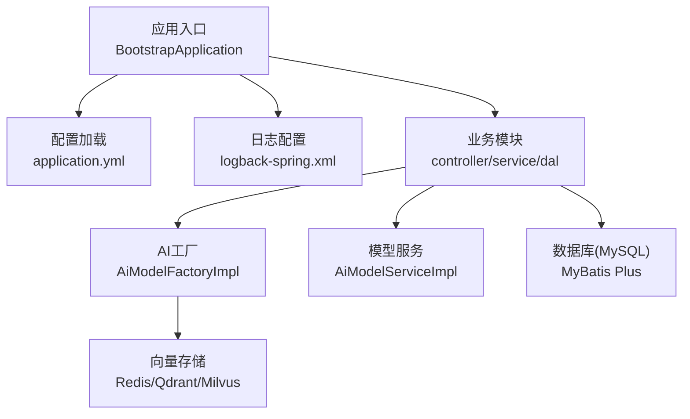
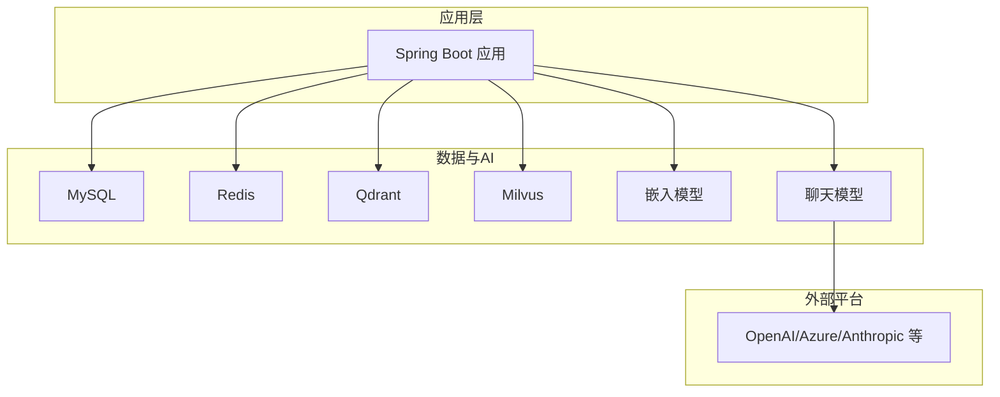
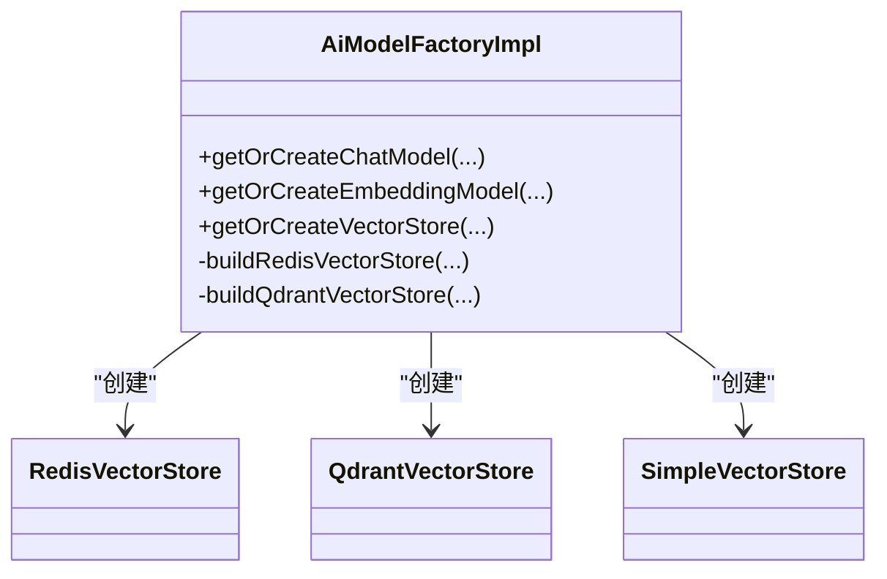
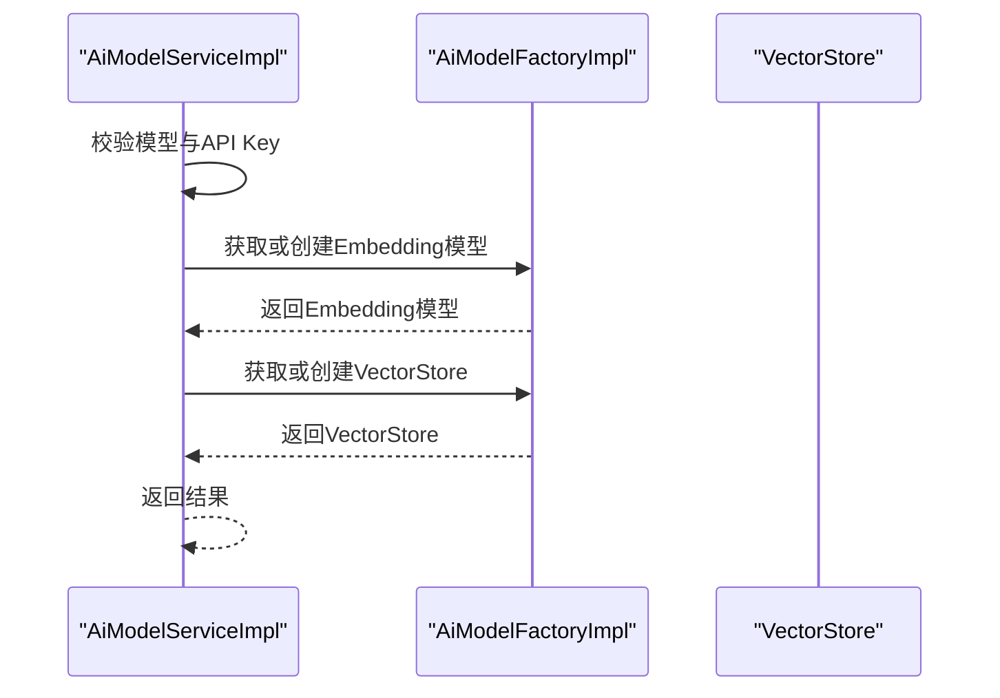
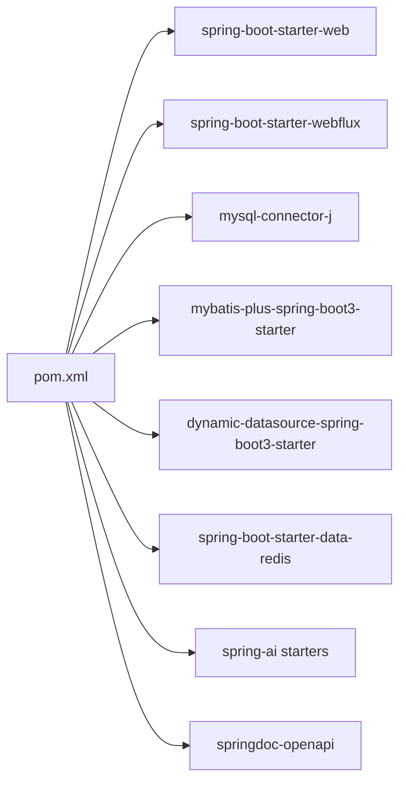

# 部署指南

<cite>
**本文引用的文件**
- [application.yml](file://src/main/resources/application.yml)
- [logback-spring.xml](file://src/main/resources/logback-spring.xml)
- [pom.xml](file://pom.xml)
- [BootstrapApplication.java](file://src/main/java/cn/boss/data/ai/BootstrapApplication.java)
- [AiModelFactoryImpl.java](file://src/main/java/cn/boss/data/ai/framework/ai/core/model/AiModelFactoryImpl.java)
- [AiModelServiceImpl.java](file://src/main/java/cn/boss/data/ai/service/model/AiModelServiceImpl.java)
- [AiProperties.java](file://src/main/java/cn/boss/data/ai/framework/ai/config/AiProperties.java)
- [.gitignore](file://.gitignore)
- [lombok.config](file://lombok.config)
</cite>

## 目录
1. [简介](#简介)
2. [项目结构](#项目结构)
3. [核心组件](#核心组件)
4. [架构总览](#架构总览)
5. [详细组件分析](#详细组件分析)
6. [依赖分析](#依赖分析)
7. [性能考虑](#性能考虑)
8. [故障排查指南](#故障排查指南)
9. [结论](#结论)
10. [附录](#附录)

## 简介
本指南面向Data-AI项目的运维与开发团队，提供从开发到生产的全生命周期部署方案。内容涵盖：
- 不同环境（开发、测试、生产）的配置差异与最佳实践
- Docker容器化部署流程与配置要点
- 数据库初始化与迁移策略
- Redis与Qdrant的部署与配置要求
- 负载均衡与高可用架构建议
- 监控与日志收集配置
- 部署后验证与故障排查
- 版本升级与回滚流程

## 项目结构
Data-AI采用Spring Boot单体应用，核心目录与文件如下：
- 配置层：application.yml（运行配置）、logback-spring.xml（日志配置）
- 业务层：controller、service、dal等包结构清晰
- 构建层：pom.xml（Maven依赖与打包配置）
- 启动入口：BootstrapApplication.java
- AI能力：AiModelFactoryImpl、AiModelServiceImpl、AiProperties等负责模型与向量存储装配

图表来源
- [BootstrapApplication.java:1-18](file://src/main/java/cn/boss/data/ai/BootstrapApplication.java#L1-L18)
- [application.yml:1-190](file://src/main/resources/application.yml#L1-L190)
- [logback-spring.xml:1-21](file://src/main/resources/logback-spring.xml#L1-L21)
- [AiModelFactoryImpl.java:470-567](file://src/main/java/cn/boss/data/ai/framework/ai/core/model/AiModelFactoryImpl.java#L470-L567)
- [AiModelServiceImpl.java:109-128](file://src/main/java/cn/boss/data/ai/service/model/AiModelServiceImpl.java#L109-L128)

章节来源
- [BootstrapApplication.java:1-18](file://src/main/java/cn/boss/data/ai/BootstrapApplication.java#L1-L18)
- [application.yml:1-190](file://src/main/resources/application.yml#L1-L190)
- [logback-spring.xml:1-21](file://src/main/resources/logback-spring.xml#L1-L21)

## 核心组件
- 应用配置中心：application.yml集中管理端口、数据库、Redis、MyBatis Plus、AI平台与向量存储等配置
- 日志系统：logback-spring.xml定义控制台输出与日志级别
- 启动入口：BootstrapApplication负责扫描Mapper与启用异步
- AI工厂：AiModelFactoryImpl按需构建Chat/Embedding模型与向量存储实例
- 模型服务：AiModelServiceImpl封装模型与向量存储的获取与校验
- AI属性：AiProperties承载boss.ai多平台配置

章节来源
- [application.yml:1-190](file://src/main/resources/application.yml#L1-L190)
- [logback-spring.xml:1-21](file://src/main/resources/logback-spring.xml#L1-L21)
- [BootstrapApplication.java:1-18](file://src/main/java/cn/boss/data/ai/BootstrapApplication.java#L1-L18)
- [AiModelFactoryImpl.java:470-567](file://src/main/java/cn/boss/data/ai/framework/ai/core/model/AiModelFactoryImpl.java#L470-L567)
- [AiModelServiceImpl.java:109-128](file://src/main/java/cn/boss/data/ai/service/model/AiModelServiceImpl.java#L109-L128)
- [AiProperties.java:1-70](file://src/main/java/cn/boss/data/ai/framework/ai/config/AiProperties.java#L1-L70)

## 架构总览
Data-AI以Spring Boot为核心，通过配置驱动AI能力与向量存储，结合MySQL持久化与Redis/Qdrant/Milvus实现知识向量化检索。

图表来源
- [application.yml:79-190](file://src/main/resources/application.yml#L79-L190)
- [AiModelFactoryImpl.java:470-567](file://src/main/java/cn/boss/data/ai/framework/ai/core/model/AiModelFactoryImpl.java#L470-L567)

## 详细组件分析

### 配置管理（application.yml）
- 服务器端口：默认48090
- 数据源：MySQL主库配置，动态数据源启用
- Redis：主机、端口、数据库索引
- MyBatis Plus：驼峰映射、逻辑删除、类型别名包
- AI向量存储：Redis/Qdrant/Milvus的集合/索引命名、初始化开关、网络地址
- 平台密钥：多平台API Key与基础URL
- Swagger：接口文档路径

章节来源
- [application.yml:1-190](file://src/main/resources/application.yml#L1-L190)

### 日志配置（logback-spring.xml）
- 控制台输出格式与编码
- 根日志级别为info

章节来源
- [logback-spring.xml:1-21](file://src/main/resources/logback-spring.xml#L1-L21)

### 启动入口（BootstrapApplication）
- 扫描Mapper包：cn.boss.data.ai.dal.mysql
- 启用异步任务

章节来源
- [BootstrapApplication.java:1-18](file://src/main/java/cn/boss/data/ai/BootstrapApplication.java#L1-L18)

### AI工厂与向量存储装配（AiModelFactoryImpl）
- 禁用Spring AI对Qdrant/Milvus的自动装配，改为手动创建
- 构建Redis向量存储：根据RedisProperties与RedisVectorStoreProperties配置索引名、键前缀、是否初始化schema
- 构建Qdrant向量存储：根据QdrantVectorStoreProperties配置host/port/tls/apiKey，并初始化schema
- 构建本地SimpleVectorStore：定时保存至文件系统

图表来源
- [AiModelFactoryImpl.java:470-567](file://src/main/java/cn/boss/data/ai/framework/ai/core/model/AiModelFactoryImpl.java#L470-L567)

章节来源
- [AiModelFactoryImpl.java:470-567](file://src/main/java/cn/boss/data/ai/framework/ai/core/model/AiModelFactoryImpl.java#L470-L567)

### 模型服务（AiModelServiceImpl）
- 校验模型与API Key有效性
- 基于平台选择Chat/Embedding模型与向量存储

图表来源
- [AiModelServiceImpl.java:109-128](file://src/main/java/cn/boss/data/ai/service/model/AiModelServiceImpl.java#L109-L128)
- [AiModelFactoryImpl.java:470-567](file://src/main/java/cn/boss/data/ai/framework/ai/core/model/AiModelFactoryImpl.java#L470-L567)

章节来源
- [AiModelServiceImpl.java:109-128](file://src/main/java/cn/boss/data/ai/service/model/AiModelServiceImpl.java#L109-L128)

### AI属性（AiProperties）
- boss.ai多平台配置：启用开关、API Key、模型、温度、最大令牌数、TopP等
- 支持Gemini、DouBao、HunYuan、SiliconFlow、XingHuo、BaiChuan、Grok、WebSearch等

章节来源
- [AiProperties.java:1-70](file://src/main/java/cn/boss/data/ai/framework/ai/config/AiProperties.java#L1-L70)

## 依赖分析
- 运行时依赖：Spring Boot Web、WebFlux、MyBatis Plus、Dynamic DataSource、Redis、Swagger等
- AI相关：Spring AI多模型starter、阿里云DashScope、文心一言、月之暗面等第三方集成
- 打包与编译：spring-boot-maven-plugin重打包；maven-compiler-plugin启用参数名保留与注解处理器链

图表来源
- [pom.xml:47-280](file://pom.xml#L47-L280)

章节来源
- [pom.xml:47-280](file://pom.xml#L47-L280)

## 性能考虑
- 启用WebFlux以支持流式响应，提升长连接与实时交互体验
- 合理设置Redis/Qdrant/Milvus的连接池与批量写入策略
- 使用MyBatis Plus Join优化复杂关联查询
- 通过日志级别与采样降低生产环境日志开销
- 对嵌入模型调用进行超时与重试策略配置

## 故障排查指南
- 启动失败
  - 检查application.yml中的数据库、Redis、向量存储地址与认证
  - 查看logback-spring.xml的日志级别与输出位置
- 数据库连接异常
  - 核对MySQL连接串、用户名、密码与时区配置
- Redis/Qdrant/Milvus不可达
  - 确认host/port、TLS、API Key等配置正确
- AI模型调用失败
  - 检查对应平台的API Key与基础URL配置
  - 在AiModelServiceImpl中定位模型与向量存储获取流程
- 日志与监控
  - 生产环境建议接入集中式日志与指标采集（如Prometheus+Grafana或APM）

章节来源
- [application.yml:1-190](file://src/main/resources/application.yml#L1-L190)
- [logback-spring.xml:1-21](file://src/main/resources/logback-spring.xml#L1-L21)
- [AiModelServiceImpl.java:109-128](file://src/main/java/cn/boss/data/ai/service/model/AiModelServiceImpl.java#L109-L128)

## 结论
本部署指南提供了Data-AI在不同环境下的配置要点、容器化部署流程、数据库与向量存储的初始化策略、高可用与监控建议，以及部署后的验证与排障路径。建议在生产环境中结合企业级中间件与安全策略进一步加固。

## 附录

### 环境配置差异（开发/测试/生产）
- 开发环境
  - 端口：48090
  - 数据库：本地MySQL，账号密码见application.yml
  - Redis：本地6379
  - 向量存储：Redis/Qdrant本地实例
  - 日志：INFO级别，控制台输出
- 测试环境
  - 独立数据库与Redis/Qdrant实例
  - 启用更严格的日志级别与采样
  - 适当缩短模型调用超时时间
- 生产环境
  - 多实例部署，配合负载均衡
  - 数据库读写分离与连接池优化
  - 向量存储集群化部署（Redis Cluster、Qdrant/ Milvus集群）
  - 集中式日志与指标监控

章节来源
- [application.yml:1-190](file://src/main/resources/application.yml#L1-L190)
- [logback-spring.xml:1-21](file://src/main/resources/logback-spring.xml#L1-L21)

### Docker容器化部署流程
- 构建镜像
  - 使用Maven构建可执行jar（spring-boot-maven-plugin）
  - 基于JRE镜像复制jar并暴露端口
- 运行容器
  - 挂载配置文件（application.yml）与日志目录
  - 暴露端口48090
  - 通过环境变量覆盖敏感配置（如数据库、Redis、平台API Key）
- 健康检查
  - 提供HTTP健康检查端点，探测应用就绪状态

章节来源
- [pom.xml:282-325](file://pom.xml#L282-L325)
- [application.yml:1-190](file://src/main/resources/application.yml#L1-L190)

### 数据库初始化与迁移
- 初始化
  - 创建数据库与用户，授予必要权限
  - 启动应用后由MyBatis Plus自动完成表结构初始化（基于实体类与注解）
- 迁移
  - 建议使用Flyway/Liquibase进行结构变更管理
  - 在测试/生产环境执行迁移脚本，确保版本一致

章节来源
- [application.yml:17-26](file://src/main/resources/application.yml#L17-L26)
- [pom.xml:222-245](file://pom.xml#L222-L245)

### Redis与Qdrant部署配置
- Redis
  - 主机、端口、数据库索引在application.yml中配置
  - 建议启用持久化与哨兵/集群，保障高可用
- Qdrant
  - 主机、端口、TLS与API Key在application.yml中配置
  - 建议启用分片与副本，配置资源限制与备份策略
- Milvus
  - 数据库名与集合名在application.yml中配置
  - 建议独立部署并配置资源与备份

章节来源
- [application.yml:83-99](file://src/main/resources/application.yml#L83-L99)

### 负载均衡与高可用架构建议
- 应用层
  - 多实例部署，共享配置中心与注册发现
  - 使用Nginx/HAProxy做四层/七层负载均衡
- 数据层
  - MySQL：主从复制+读写分离，配合中间件（如ShardingSphere）
  - Redis：Cluster/哨兵，持久化与备份
  - Qdrant/Milvus：集群部署，跨可用区分布
- AI平台
  - 多平台Key轮询与熔断降级
  - 异步队列处理高并发请求

### 监控与日志收集
- 日志
  - 控制台与文件输出，生产环境建议落盘并集中收集
- 指标
  - 暴露Actuator端点，对接Prometheus/Grafana
- 链路追踪
  - 建议接入分布式追踪（如SkyWalking/OpenTelemetry）

章节来源
- [logback-spring.xml:1-21](file://src/main/resources/logback-spring.xml#L1-L21)
- [pom.xml:212-215](file://pom.xml#L212-L215)

### 部署后验证步骤
- 健康检查：访问应用健康端点，确认各依赖可用
- 功能验证：调用AI模型与向量检索接口，验证返回
- 性能验证：压测关键接口，观察延迟与错误率
- 日志验证：确认关键路径日志输出正常

### 故障排查清单
- 无法连接数据库/Redis/向量存储：核对host/port/认证
- 模型调用失败：检查平台API Key与URL
- 日志缺失：检查logback-spring.xml与挂载目录
- 高并发异常：检查连接池、限流与熔断配置

### 版本升级与回滚
- 升级
  - 制作新镜像并灰度发布，逐步替换实例
  - 执行数据库迁移脚本（如使用Flyway）
- 回滚
  - 回滚镜像版本，恢复上一版本配置
  - 如需，回滚数据库迁移脚本