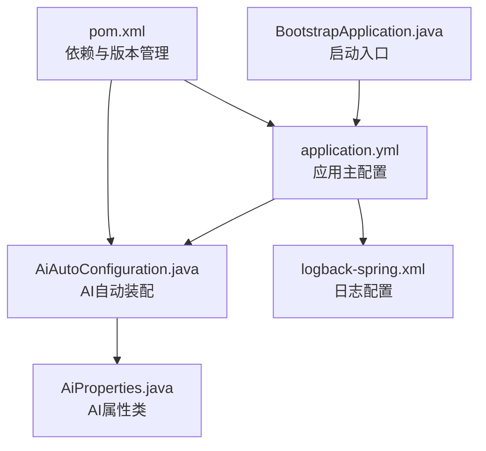
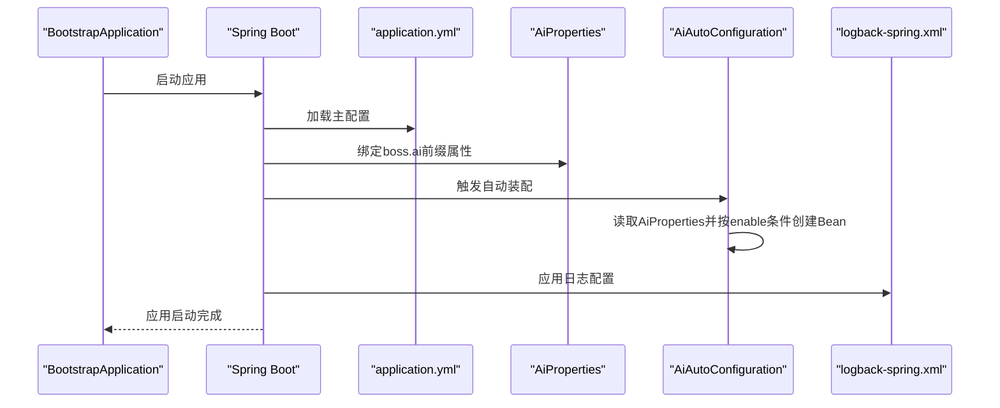
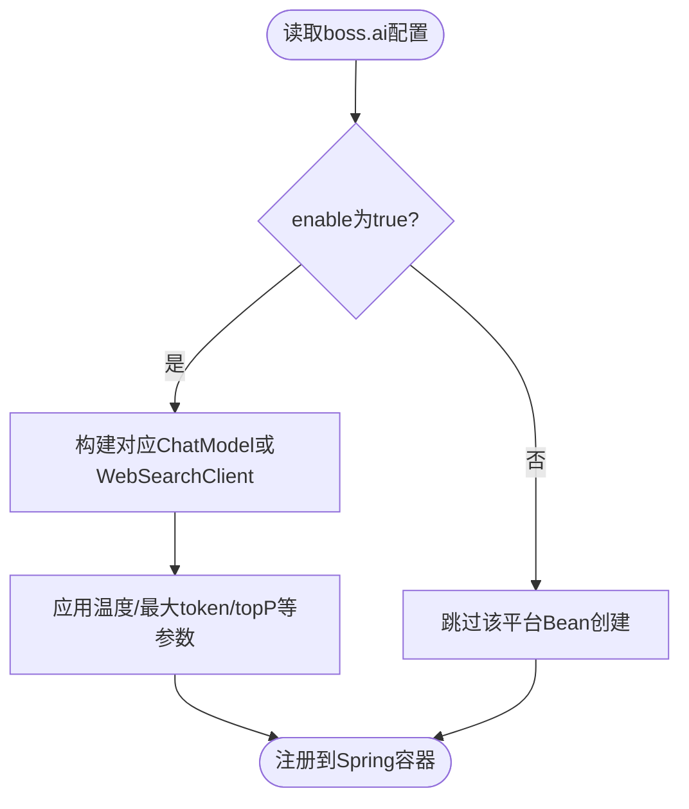
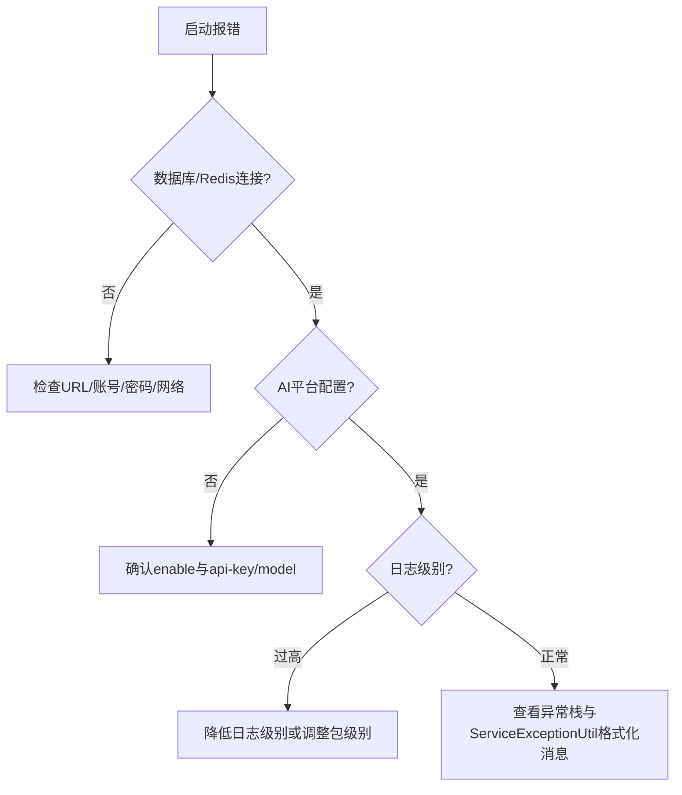

# 配置指南

<cite>
**本文引用的文件列表**
- [application.yml](file://src/main/resources/application.yml)
- [logback-spring.xml](file://src/main/resources/logback-spring.xml)
- [AiProperties.java](file://src/main/java/cn/boss/data/ai/framework/ai/config/AiProperties.java)
- [AiAutoConfiguration.java](file://src/main/java/cn/boss/data/ai/framework/ai/config/AiAutoConfiguration.java)
- [BootstrapApplication.java](file://src/main/java/cn/boss/data/ai/BootstrapApplication.java)
- [pom.xml](file://pom.xml)
- [ServiceException.java](file://src/main/java/cn/boss/data/ai/framework/common/exception/ServiceException.java)
- [ServiceExceptionUtil.java](file://src/main/java/cn/boss/data/ai/framework/common/exception/util/ServiceExceptionUtil.java)
</cite>

## 目录
1. [简介](#简介)
2. [项目结构与配置文件定位](#项目结构与配置文件定位)
3. [核心配置项详解](#核心配置项详解)
4. [架构总览与配置加载流程](#架构总览与配置加载流程)
5. [组件与配置映射分析](#组件与配置映射分析)
6. [依赖关系与外部集成](#依赖关系与外部集成)
7. [性能与资源优化建议](#性能与资源优化建议)
8. [故障排查与常见问题](#故障排查与常见问题)
9. [结论](#结论)
10. [附录：配置模板与最佳实践](#附录配置模板与最佳实践)

## 简介
本指南面向Data-AI项目的运维与开发人员，系统性讲解application.yml中的关键配置项，包括数据库连接、Redis缓存、AI平台API密钥、日志级别与格式化、以及Spring Boot配置加载顺序与优先级。同时提供不同环境（开发、测试、生产）的配置模板与最佳实践，给出配置验证方法与常见错误排查步骤，并补充生产环境优化与安全注意事项。

## 项目结构与配置文件定位
- application.yml：应用主配置文件，涵盖服务器端口、数据库、Redis、MyBatis-Plus、日志、Swagger接口文档、Spring AI向量存储与多平台AI配置等。
- logback-spring.xml：日志系统配置，定义控制台输出格式与根日志级别。
- AiProperties/AiAutoConfiguration：AI配置属性类与自动装配，负责将boss.ai与spring.ai相关配置注入到具体AI客户端与向量存储实现。
- BootstrapApplication：Spring Boot启动入口，扫描Mapper与启用异步。
- pom.xml：依赖管理，包含Spring Boot版本、Spring AI相关starter、MyBatis-Plus、Redis、MySQL驱动等。

**图表来源**
- [application.yml:1-190](file://src/main/resources/application.yml#L1-L190)
- [AiAutoConfiguration.java:1-286](file://src/main/java/cn/boss/data/ai/framework/ai/config/AiAutoConfiguration.java#L1-L286)
- [AiProperties.java:1-134](file://src/main/java/cn/boss/data/ai/framework/ai/config/AiProperties.java#L1-L134)
- [logback-spring.xml:1-21](file://src/main/resources/logback-spring.xml#L1-L21)
- [BootstrapApplication.java:1-18](file://src/main/java/cn/boss/data/ai/BootstrapApplication.java#L1-L18)
- [pom.xml:1-358](file://pom.xml#L1-L358)

**章节来源**
- [application.yml:1-190](file://src/main/resources/application.yml#L1-L190)
- [logback-spring.xml:1-21](file://src/main/resources/logback-spring.xml#L1-L21)
- [AiProperties.java:1-134](file://src/main/java/cn/boss/data/ai/framework/ai/config/AiProperties.java#L1-L134)
- [AiAutoConfiguration.java:1-286](file://src/main/java/cn/boss/data/ai/framework/ai/config/AiAutoConfiguration.java#L1-L286)
- [BootstrapApplication.java:1-18](file://src/main/java/cn/boss/data/ai/BootstrapApplication.java#L1-L18)
- [pom.xml:1-358](file://pom.xml#L1-L358)

## 核心配置项详解

### 服务器与应用基础
- server.port：HTTP服务监听端口。
- spring.application.name：应用名称。
- spring.main.allow-circular-references：允许循环依赖（谨慎使用）。
- spring.autoconfigure.exclude：排除某些自动配置（如禁用Qdrant、Milvus的自动配置以手动创建）。

**章节来源**
- [application.yml:1-16](file://src/main/resources/application.yml#L1-L16)

### 数据源与多数据源
- spring.datasource.dynamic.primary：主数据源名称。
- spring.datasource.dynamic.datasource.master.*：主库连接参数（URL、用户名、密码、驱动类名）。
- MyBatis-Plus全局配置：
  - map-underscore-to-camel-case：字段命名策略。
  - id-type：主键策略（NONE表示“智能”模式）。
  - logic-delete-value/logic-not-delete-value：逻辑删除值。
  - type-aliases-package：实体包扫描路径。
- MyBatis-Plus Join扩展：
  - banner、sub-table-logic、ms-cache、table-alias、logic-del-type等。

**章节来源**
- [application.yml:17-49](file://src/main/resources/application.yml#L17-L49)
- [application.yml:50-56](file://src/main/resources/application.yml#L50-L56)

### Redis缓存与Spring Data Redis
- spring.data.redis.host/port/database：Redis连接参数。
- spring.data.redis.repositories.enabled：是否启用Spring Data Redis Repository（项目未使用，建议禁用以提升启动速度）。

**章节来源**
- [application.yml:28-33](file://src/main/resources/application.yml#L28-L33)
- [application.yml:72-78](file://src/main/resources/application.yml#L72-L78)

### 日志配置
- logging.level.*：按包设置日志级别（示例：项目包DEBUG、Spring AI包INFO）。
- logback-spring.xml：
  - 控制台输出格式与字符集。
  - 根日志级别（示例：info）。
  - 可通过profile切换不同日志配置。

**章节来源**
- [application.yml:57-62](file://src/main/resources/application.yml#L57-L62)
- [logback-spring.xml:1-21](file://src/main/resources/logback-spring.xml#L1-L21)

### 接口文档（Swagger）
- springdoc.api-docs.enabled/path：OpenAPI文档开关与路径。
- springdoc.swagger-ui.path：UI访问路径。

**章节来源**
- [application.yml:63-71](file://src/main/resources/application.yml#L63-L71)

### Spring AI向量存储与多平台AI配置
- spring.ai.vectorstore.redis：Redis向量存储初始化、索引名、键前缀。
- spring.ai.vectorstore.qdrant：Qdrant集合名、主机与端口。
- spring.ai.vectorstore.milvus：Milvus数据库名、集合名、客户端host/port。
- 平台配置（spring.ai.*）：文心一言、智谱、OpenAI官方、Azure OpenAI、Anthropic、Ollama、StabilityAI、通义千问、Minimax、月之暗面、DeepSeek、模型重排开关、MCP服务/客户端。
- 业务平台配置（boss.ai.*）：Gemini、豆包、混元、硅基流动、讯飞星火、百川、Grok、Midjourney、Suno、WebSearch等，均支持enable、api-key/model/温度/最大token/topP等参数。

**章节来源**
- [application.yml:79-190](file://src/main/resources/application.yml#L79-L190)

### AI配置属性类与自动装配
- AiProperties：以boss.ai为前缀的配置属性类，包含各平台子类（如Gemini、DouBao、HunYuan、SiliconFlow、XingHuo、BaiChuan、Grok、WebSearch），统一承载配置。
- AiAutoConfiguration：基于@EnableConfigurationProperties启用AiProperties；根据boss.ai.{platform}.enable条件创建对应ChatModel或WebSearchClient；为各平台构建OpenAI兼容或特定API客户端；提供Token计数与批处理策略；注入工具调用管理器。

```mermaid
classDiagram
class AiProperties {
+Gemini gemini
+DouBao doubao
+HunYuan hunyuan
+SiliconFlow siliconflow
+XingHuo xinghuo
+BaiChuan baichuan
+Grok grok
+WebSearch webSearch
}
class Gemini { +enable : String +apiKey : String +model : String +temperature : Double +maxTokens : Integer +topP : Double }
class DouBao { +enable : String +apiKey : String +model : String +temperature : Double +maxTokens : Integer +topP : Double }
class HunYuan { +enable : String +baseUrl : String +apiKey : String +model : String +temperature : Double +maxTokens : Integer +topP : Double }
class SiliconFlow { +enable : String +apiKey : String +model : String +temperature : Double +maxTokens : Integer +topP : Double }
class XingHuo { +enable : String +appId : String +appKey : String +secretKey : String +model : String +temperature : Double +maxTokens : Integer +topP : Double }
class BaiChuan { +enable : String +apiKey : String +model : String +temperature : Double +maxTokens : Integer +topP : Double }
class Grok { +enable : String +apiKey : String +baseUrl : String +model : String +temperature : Double +maxTokens : Integer +topP : Double }
class WebSearch { +enable : boolean +apiKey : String }
AiProperties --> Gemini
AiProperties --> DouBao
AiProperties --> HunYuan
AiProperties --> SiliconFlow
AiProperties --> XingHuo
AiProperties --> BaiChuan
AiProperties --> Grok
AiProperties --> WebSearch
```

**图表来源**
- [AiProperties.java:1-134](file://src/main/java/cn/boss/data/ai/framework/ai/config/AiProperties.java#L1-L134)

**章节来源**
- [AiProperties.java:1-134](file://src/main/java/cn/boss/data/ai/framework/ai/config/AiProperties.java#L1-L134)
- [AiAutoConfiguration.java:1-286](file://src/main/java/cn/boss/data/ai/framework/ai/config/AiAutoConfiguration.java#L1-L286)

## 架构总览与配置加载流程
- 启动入口：BootstrapApplication通过@SpringBootApplication扫描Mapper并启用异步。
- 配置加载：Spring Boot按约定从application.yml读取配置；AiAutoConfiguration通过@EnableConfigurationProperties绑定boss.ai前缀配置到AiProperties。
- 条件装配：AiAutoConfiguration根据boss.ai.{platform}.enable动态创建对应ChatModel或WebSearchClient。
- 日志：application.yml设置包级别日志；logback-spring.xml定义控制台输出格式与根级别。

**图表来源**
- [BootstrapApplication.java:1-18](file://src/main/java/cn/boss/data/ai/BootstrapApplication.java#L1-L18)
- [application.yml:1-190](file://src/main/resources/application.yml#L1-L190)
- [AiProperties.java:1-134](file://src/main/java/cn/boss/data/ai/framework/ai/config/AiProperties.java#L1-L134)
- [AiAutoConfiguration.java:1-286](file://src/main/java/cn/boss/data/ai/framework/ai/config/AiAutoConfiguration.java#L1-L286)
- [logback-spring.xml:1-21](file://src/main/resources/logback-spring.xml#L1-L21)

**章节来源**
- [BootstrapApplication.java:1-18](file://src/main/java/cn/boss/data/ai/BootstrapApplication.java#L1-L18)
- [application.yml:1-190](file://src/main/resources/application.yml#L1-L190)
- [AiAutoConfiguration.java:1-286](file://src/main/java/cn/boss/data/ai/framework/ai/config/AiAutoConfiguration.java#L1-L286)
- [logback-spring.xml:1-21](file://src/main/resources/logback-spring.xml#L1-L21)

## 组件与配置映射分析

### 数据库与MyBatis-Plus
- 主库连接参数由spring.datasource.dynamic.datasource.master.*提供。
- MyBatis-Plus全局配置影响实体映射、逻辑删除、Banner输出与类型别名包。
- MyBatis-Plus Join扩展提供跨表逻辑删除、拦截器缓存、表别名与逻辑删除位置等。

**章节来源**
- [application.yml:17-49](file://src/main/resources/application.yml#L17-L49)
- [application.yml:50-56](file://src/main/resources/application.yml#L50-L56)

### Redis缓存
- spring.data.redis.host/port/database：连接参数。
- 禁用Spring Data Redis Repository可减少启动开销。

**章节来源**
- [application.yml:28-33](file://src/main/resources/application.yml#L28-L33)
- [application.yml:72-78](file://src/main/resources/application.yml#L72-L78)

### 日志与调试
- application.yml中按包设置日志级别，便于快速定位问题。
- logback-spring.xml定义控制台输出格式与根级别，建议在不同环境切换profile以调整输出策略。

**章节来源**
- [application.yml:57-62](file://src/main/resources/application.yml#L57-L62)
- [logback-spring.xml:1-21](file://src/main/resources/logback-spring.xml#L1-L21)

### AI平台与向量存储
- boss.ai.*：业务侧平台配置，AiAutoConfiguration按enable条件创建对应ChatModel。
- spring.ai.vectorstore.*：Spring AI向量存储配置，支持Redis/Qdrant/Milvus三套方案。

**图表来源**
- [AiAutoConfiguration.java:65-119](file://src/main/java/cn/boss/data/ai/framework/ai/config/AiAutoConfiguration.java#L65-L119)
- [AiAutoConfiguration.java:121-179](file://src/main/java/cn/boss/data/ai/framework/ai/config/AiAutoConfiguration.java#L121-L179)
- [AiAutoConfiguration.java:181-210](file://src/main/java/cn/boss/data/ai/framework/ai/config/AiAutoConfiguration.java#L181-L210)
- [AiAutoConfiguration.java:212-237](file://src/main/java/cn/boss/data/ai/framework/ai/config/AiAutoConfiguration.java#L212-L237)
- [AiAutoConfiguration.java:279-283](file://src/main/java/cn/boss/data/ai/framework/ai/config/AiAutoConfiguration.java#L279-L283)

**章节来源**
- [AiAutoConfiguration.java:1-286](file://src/main/java/cn/boss/data/ai/framework/ai/config/AiAutoConfiguration.java#L1-L286)
- [application.yml:79-190](file://src/main/resources/application.yml#L79-L190)

## 依赖关系与外部集成
- Spring Boot版本与依赖管理：pom.xml集中管理spring-boot-dependencies与各组件版本。
- Spring AI相关starter：OpenAI、Azure OpenAI、Anthropic、Ollama、StabilityAI、DashScope、Minimax、DeepSeek等。
- 向量存储：Qdrant、Redis Vector Store。
- MyBatis-Plus与Join扩展、动态数据源、Redis、MySQL驱动、Swagger等。

**章节来源**
- [pom.xml:1-358](file://pom.xml#L1-L358)

## 性能与资源优化建议
- 禁用未使用的功能：禁用spring.data.redis.repositories以减少启动时间。
- 合理的日志级别：生产环境建议提高根日志级别，避免过量DEBUG输出。
- 向量存储选择：根据数据规模与查询复杂度选择Redis/Qdrant/Milvus；合理设置索引名与键前缀，避免冲突。
- 连接池与超时：为数据库与Redis设置合适的连接池大小与超时参数（可在application.yml中扩展）。
- 启动优化：移除不必要的自动配置排除项，仅保留必要模块。

[本节为通用建议，不直接分析具体文件]

## 故障排查与常见问题
- 配置未生效：
  - 确认配置键名与前缀正确（如boss.ai.*、spring.ai.*、spring.datasource.*）。
  - 检查是否被其他配置覆盖（命令行参数、环境变量、外部配置中心）。
- 启动失败：
  - 数据库连接失败：检查URL、用户名、密码与驱动类名。
  - Redis连接失败：检查host/port/database与网络连通性。
- AI平台不可用：
  - 确认boss.ai.{platform}.enable为true且api-key/model等参数完整。
  - 若平台需要特殊Base URL，请在相应配置中设置。
- 日志异常：
  - 检查application.yml中的logging.level与logback-spring.xml的根级别。
  - 使用更细粒度的日志级别定位问题。
- 异常封装与格式化：
  - 项目使用ServiceException与ServiceExceptionUtil进行统一异常封装与消息格式化，便于排查与对外返回。

**图表来源**
- [application.yml:17-33](file://src/main/resources/application.yml#L17-L33)
- [application.yml:79-190](file://src/main/resources/application.yml#L79-L190)
- [logback-spring.xml:1-21](file://src/main/resources/logback-spring.xml#L1-L21)
- [ServiceException.java:1-46](file://src/main/java/cn/boss/data/ai/framework/common/exception/ServiceException.java#L1-L46)
- [ServiceExceptionUtil.java:1-57](file://src/main/java/cn/boss/data/ai/framework/common/exception/util/ServiceExceptionUtil.java#L1-L57)

**章节来源**
- [ServiceException.java:1-46](file://src/main/java/cn/boss/data/ai/framework/common/exception/ServiceException.java#L1-L46)
- [ServiceExceptionUtil.java:1-57](file://src/main/java/cn/boss/data/ai/framework/common/exception/util/ServiceExceptionUtil.java#L1-L57)

## 结论
本指南梳理了Data-AI项目的核心配置项与加载机制，明确了数据库、Redis、日志、AI平台与向量存储的关键参数与最佳实践。通过AiProperties与AiAutoConfiguration的配合，项目实现了灵活的平台接入与条件装配。建议在不同环境中采用差异化配置模板，并结合日志与异常体系进行快速定位与修复。

[本节为总结性内容，不直接分析具体文件]

## 附录：配置模板与最佳实践

### 不同环境配置模板（示意）
- 开发环境
  - server.port：本地端口
  - spring.datasource.dynamic.datasource.master.url：本地MySQL
  - spring.data.redis.host/port：本地Redis
  - logging.level.*：项目包DEBUG，便于开发调试
  - boss.ai.*：enable设为false或仅启用常用平台
- 测试环境
  - 与开发类似，但使用测试数据库与Redis
  - 日志级别适度降低
- 生产环境
  - 禁用spring.data.redis.repositories
  - 提高根日志级别（如info）
  - 启用必要的AI平台，确保api-key安全存储
  - 向量存储选择与容量规划匹配业务规模

### 配置验证方法
- 启动参数校验：通过命令行参数覆盖配置，观察是否生效。
- 功能验证：对关键模块（数据库连接、Redis访问、AI平台调用）进行最小化回归测试。
- 日志验证：在不同环境下对比日志输出，确认级别与格式符合预期。
- 异常验证：触发典型异常场景，确认ServiceExceptionUtil格式化消息正确。

### 配置加载顺序与优先级（Spring Boot通用规则）
- 命令行参数 > 环境变量 > application-{profile}.yml > application.yml
- profile配置文件位于同一目录时，按激活顺序叠加，后者覆盖前者相同键。
- 外部配置中心（如Nacos/K8s ConfigMap）通常优先于本地文件。

[本节为通用规则说明，不直接分析具体文件]