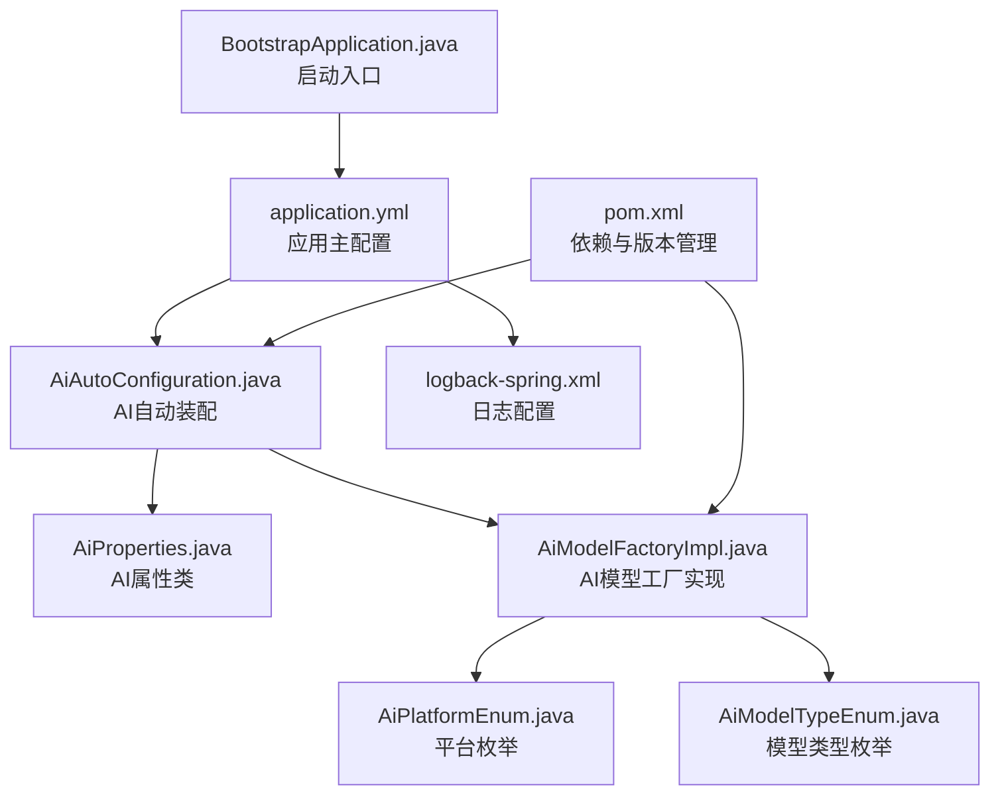
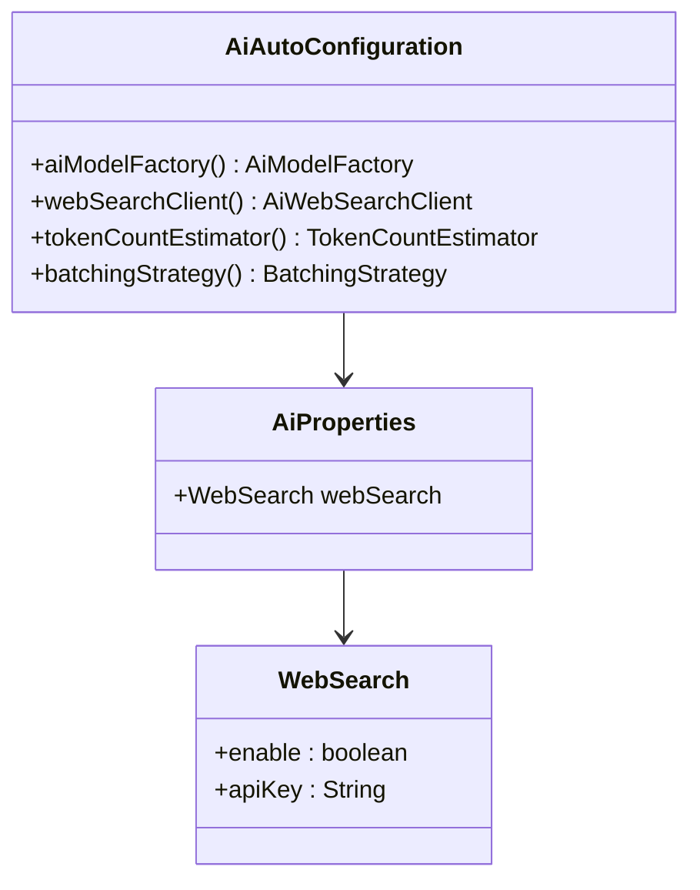
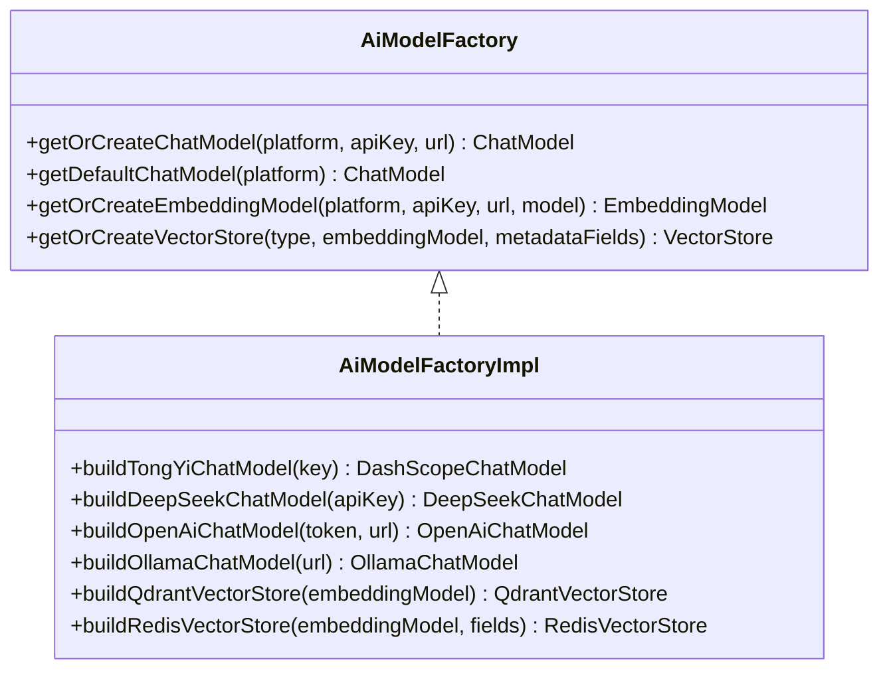
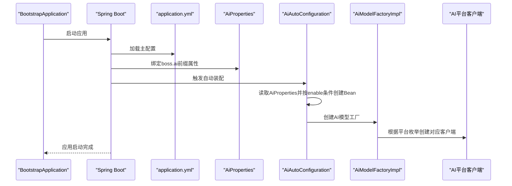
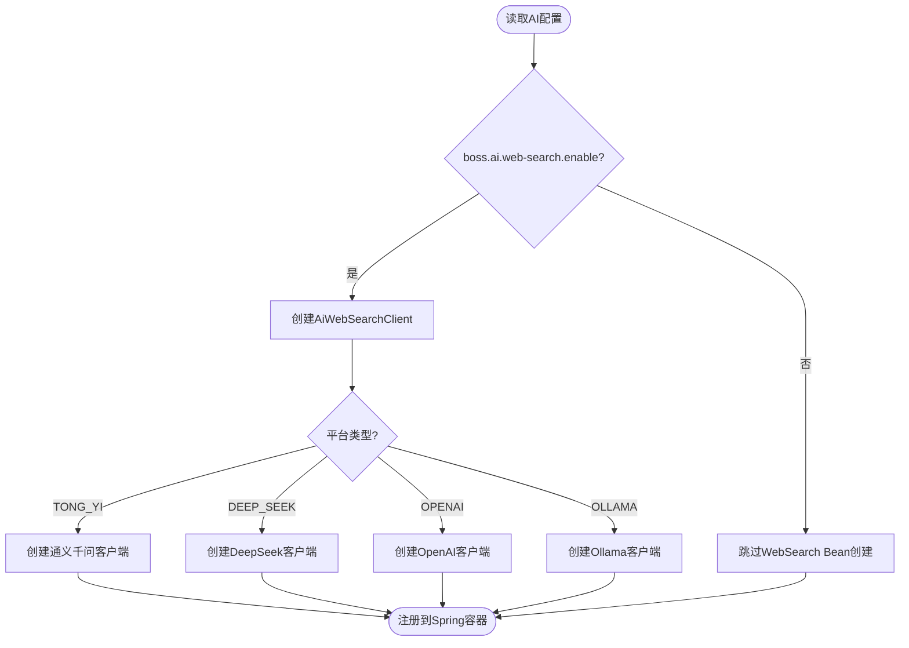
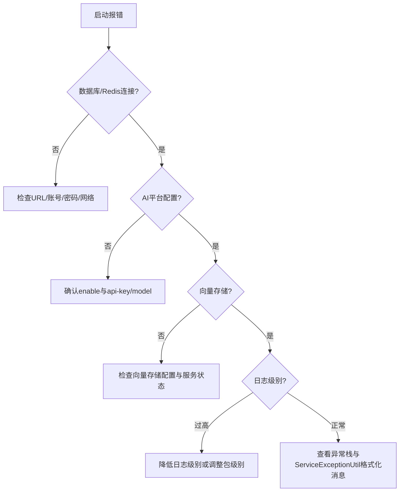

# 配置指南

<cite>
**本文引用的文件列表**
- [application.yml](file://src/main/resources/application.yml)
- [logback-spring.xml](file://src/main/resources/logback-spring.xml)
- [AiProperties.java](file://src/main/java/cn/boss/data/ai/framework/ai/config/AiProperties.java)
- [AiAutoConfiguration.java](file://src/main/java/cn/boss/data/ai/framework/ai/config/AiAutoConfiguration.java)
- [AiModelFactory.java](file://src/main/java/cn/boss/data/ai/framework/ai/core/model/AiModelFactory.java)
- [AiModelFactoryImpl.java](file://src/main/java/cn/boss/data/ai/framework/ai/core/model/AiModelFactoryImpl.java)
- [AiPlatformEnum.java](file://src/main/java/cn/boss/data/ai/enums/model/AiPlatformEnum.java)
- [AiModelTypeEnum.java](file://src/main/java/cn/boss/data/ai/enums/model/AiModelTypeEnum.java)
- [BootstrapApplication.java](file://src/main/java/cn/boss/data/ai/BootstrapApplication.java)
- [pom.xml](file://pom.xml)
- [ServiceException.java](file://src/main/java/cn/boss/data/ai/framework/common/exception/ServiceException.java)
- [ServiceExceptionUtil.java](file://src/main/java/cn/boss/data/ai/framework/common/exception/util/ServiceExceptionUtil.java)
- [CLAUDE.md](file://CLAUDE.md)
</cite>

## 更新摘要
**所做更改**
- 新增Claude AI平台配置支持说明
- 扩展向量存储配置详解，包括Redis、Qdrant、Milvus三种方案
- 完善AI平台集成配置，涵盖多厂商平台支持
- 更新AI模型工厂配置说明
- 新增配置验证和故障排查指南

## 目录
1. [简介](#简介)
2. [项目结构与配置文件定位](#项目结构与配置文件定位)
3. [核心配置项详解](#核心配置项详解)
4. [架构总览与配置加载流程](#架构总览与配置加载流程)
5. [组件与配置映射分析](#组件与配置映射分析)
6. [依赖关系与外部集成](#依赖关系与外部集成)
7. [性能与资源优化建议](#性能与资源优化建议)
8. [故障排查与常见问题](#故障排查与常见问题)
9. [结论](#结论)
10. [附录：配置模板与最佳实践](#附录配置模板与最佳实践)

## 简介
本指南面向Data-AI项目的运维与开发人员，系统性讲解application.yml中的关键配置项，包括数据库连接、Redis缓存、AI平台API密钥、日志级别与格式化、以及Spring Boot配置加载顺序与优先级。项目现已支持多AI平台集成，包括Claude、DeepSeek、OpenAI、Ollama等，并提供完善的向量存储配置方案。同时提供不同环境（开发、测试、生产）的配置模板与最佳实践，给出配置验证方法与常见错误排查步骤，并补充生产环境优化与安全注意事项。

## 项目结构与配置文件定位
- application.yml：应用主配置文件，涵盖服务器端口、数据库、Redis、MyBatis-Plus、日志、Swagger接口文档、Spring AI向量存储与多平台AI配置等。
- logback-spring.xml：日志系统配置，定义控制台输出格式与根日志级别。
- AiProperties/AiAutoConfiguration：AI配置属性类与自动装配，负责将boss.ai与spring.ai相关配置注入到具体AI客户端与向量存储实现。
- AiModelFactory/AiModelFactoryImpl：AI模型工厂接口与实现，负责AI平台客户端的创建与管理。
- AiPlatformEnum/AiModelTypeEnum：AI平台与模型类型的枚举定义。
- BootstrapApplication：Spring Boot启动入口，扫描Mapper与启用异步。
- pom.xml：依赖管理，包含Spring Boot版本、Spring AI相关starter、MyBatis-Plus、Redis、MySQL驱动等。

```mermaid
graph TB
A["application.yml<br/>应用主配置"] --> B["AiAutoConfiguration.java<br/>AI自动装配"]
A --> C["logback-spring.xml<br/>日志配置"]
B --> D["AiProperties.java<br/>AI属性类"]
B --> E["AiModelFactoryImpl.java<br/>AI模型工厂实现"]
E --> F["AiPlatformEnum.java<br/>平台枚举"]
E --> G["AiModelTypeEnum.java<br/>模型类型枚举"]
H["BootstrapApplication.java<br/>启动入口"] --> A
I["pom.xml<br/>依赖与版本管理"] --> B
I --> E
```

**图表来源**
- [application.yml:1-139](file://src/main/resources/application.yml#L1-L139)
- [AiAutoConfiguration.java:1-70](file://src/main/java/cn/boss/data/ai/framework/ai/config/AiAutoConfiguration.java#L1-L70)
- [AiProperties.java:1-25](file://src/main/java/cn/boss/data/ai/framework/ai/config/AiProperties.java#L1-L25)
- [AiModelFactoryImpl.java:1-324](file://src/main/java/cn/boss/data/ai/framework/ai/core/model/AiModelFactoryImpl.java#L1-L324)
- [AiPlatformEnum.java:1-54](file://src/main/java/cn/boss/data/ai/enums/model/AiPlatformEnum.java#L1-L54)
- [AiModelTypeEnum.java:1-40](file://src/main/java/cn/boss/data/ai/enums/model/AiModelTypeEnum.java#L1-L40)
- [logback-spring.xml:1-21](file://src/main/resources/logback-spring.xml#L1-L21)
- [BootstrapApplication.java:1-18](file://src/main/java/cn/boss/data/ai/BootstrapApplication.java#L1-L18)
- [pom.xml:1-344](file://pom.xml#L1-L344)

**章节来源**
- [application.yml:1-139](file://src/main/resources/application.yml#L1-L139)
- [logback-spring.xml:1-21](file://src/main/resources/logback-spring.xml#L1-L21)
- [AiProperties.java:1-25](file://src/main/java/cn/boss/data/ai/framework/ai/config/AiProperties.java#L1-L25)
- [AiAutoConfiguration.java:1-70](file://src/main/java/cn/boss/data/ai/framework/ai/config/AiAutoConfiguration.java#L1-L70)
- [AiModelFactoryImpl.java:1-324](file://src/main/java/cn/boss/data/ai/framework/ai/core/model/AiModelFactoryImpl.java#L1-L324)
- [AiPlatformEnum.java:1-54](file://src/main/java/cn/boss/data/ai/enums/model/AiPlatformEnum.java#L1-L54)
- [AiModelTypeEnum.java:1-40](file://src/main/java/cn/boss/data/ai/enums/model/AiModelTypeEnum.java#L1-L40)
- [BootstrapApplication.java:1-18](file://src/main/java/cn/boss/data/ai/BootstrapApplication.java#L1-L18)
- [pom.xml:1-344](file://pom.xml#L1-L344)

## 核心配置项详解

### 服务器与应用基础
- server.port：HTTP服务监听端口。
- spring.application.name：应用名称。
- spring.main.allow-circular-references：允许循环依赖（谨慎使用）。
- spring.autoconfigure.exclude：排除某些自动配置（如禁用Qdrant、Milvus的自动配置以手动创建）。

**章节来源**
- [application.yml:1-16](file://src/main/resources/application.yml#L1-L16)

### 数据源与多数据源
- spring.datasource.dynamic.primary：主数据源名称。
- spring.datasource.dynamic.datasource.master.*：主库连接参数（URL、用户名、密码、驱动类名）。
- MyBatis-Plus全局配置：
  - map-underscore-to-camel-case：字段命名策略。
  - id-type：主键策略（NONE表示"智能"模式）。
  - logic-delete-value/logic-not-delete-value：逻辑删除值。
  - type-aliases-package：实体包扫描路径。
- MyBatis-Plus Join扩展：
  - banner、sub-table-logic、ms-cache、table-alias、logic-del-type等。

**章节来源**
- [application.yml:17-49](file://src/main/resources/application.yml#L17-L49)
- [application.yml:50-56](file://src/main/resources/application.yml#L50-L56)

### Redis缓存与Spring Data Redis
- spring.data.redis.host/port/database：Redis连接参数。
- spring.data.redis.repositories.enabled：是否启用Spring Data Redis Repository（项目未使用，建议禁用以提升启动速度）。

**章节来源**
- [application.yml:28-33](file://src/main/resources/application.yml#L28-L33)
- [application.yml:72-78](file://src/main/resources/application.yml#L72-L78)

### 日志配置
- logging.level.*：按包设置日志级别（示例：项目包DEBUG、Spring AI包INFO）。
- logback-spring.xml：
  - 控制台输出格式与字符集。
  - 根日志级别（示例：info）。
  - 可通过profile切换不同日志配置。

**章节来源**
- [application.yml:57-62](file://src/main/resources/application.yml#L57-L62)
- [logback-spring.xml:1-21](file://src/main/resources/logback-spring.xml#L1-L21)

### 接口文档（Swagger）
- springdoc.api-docs.enabled/path：OpenAPI文档开关与路径。
- springdoc.swagger-ui.path：UI访问路径。

**章节来源**
- [application.yml:63-71](file://src/main/resources/application.yml#L63-L71)

### Spring AI向量存储与多平台AI配置

#### 向量存储配置
- spring.ai.vectorstore.redis：Redis向量存储配置
  - initialize-schema：是否初始化向量存储模式
  - index-name：Redis中向量索引的名称
  - prefix：存储向量数据的键名前缀
- spring.ai.vectorstore.qdrant：Qdrant向量存储配置
  - initialize-schema：是否初始化向量存储模式
  - collection-name：Qdrant中向量集合的名称
  - host/port：Qdrant服务地址与端口
- spring.ai.vectorstore.milvus：Milvus向量存储配置
  - initialize-schema：是否初始化向量存储模式
  - database-name：Milvus数据库名称
  - collection-name：Milvus集合名称
  - client.host/port：Milvus客户端连接参数

#### 平台配置（spring.ai.*）
- openai：OpenAI官方平台配置
  - api-key：OpenAI API密钥
  - base-url：OpenAI API基础URL
- ollama：Ollama本地模型配置
  - base-url：Ollama服务地址
  - chat.model：聊天模型名称
- dashscope：通义千问配置
  - api-key：DashScope API密钥
- deepseek：DeepSeek配置
  - api-key：DeepSeek API密钥
  - chat.options.model：聊天模型名称
- model.rerank：是否启用Rerank模型
- mcp：MCP服务配置
  - server.enabled：是否启用MCP服务器
  - client.enabled：是否启用MCP客户端

#### 业务平台配置（boss.ai.*）
- web-search：网络搜索配置
  - enable：是否启用网络搜索
  - api-key：网络搜索API密钥

**章节来源**
- [application.yml:79-139](file://src/main/resources/application.yml#L79-L139)

### AI配置属性类与自动装配
- AiProperties：以boss.ai为前缀的配置属性类，当前包含WebSearch配置。
- AiAutoConfiguration：基于@EnableConfigurationProperties启用AiProperties；根据boss.ai.web-search.enable条件创建AiWebSearchClient；提供Token计数与批处理策略；注入工具调用管理器。

```mermaid
classDiagram
class AiProperties {
+WebSearch webSearch
}
class WebSearch {
+enable : boolean
+apiKey : String
}
class AiAutoConfiguration {
+aiModelFactory() AiModelFactory
+webSearchClient() AiWebSearchClient
+tokenCountEstimator() TokenCountEstimator
+batchingStrategy() BatchingStrategy
}
AiProperties --> WebSearch
AiAutoConfiguration --> AiProperties
```

**图表来源**
- [AiProperties.java:1-25](file://src/main/java/cn/boss/data/ai/framework/ai/config/AiProperties.java#L1-L25)
- [AiAutoConfiguration.java:1-70](file://src/main/java/cn/boss/data/ai/framework/ai/config/AiAutoConfiguration.java#L1-L70)

**章节来源**
- [AiProperties.java:1-25](file://src/main/java/cn/boss/data/ai/framework/ai/config/AiProperties.java#L1-L25)
- [AiAutoConfiguration.java:1-70](file://src/main/java/cn/boss/data/ai/framework/ai/config/AiAutoConfiguration.java#L1-L70)

### AI模型工厂与平台支持
- AiModelFactory：AI模型工厂接口，定义ChatModel、EmbeddingModel、VectorStore的创建方法。
- AiModelFactoryImpl：AI模型工厂实现，支持以下平台：
  - TONG_YI：通义千问（DashScope）
  - DEEP_SEEK：DeepSeek
  - OPENAI：OpenAI官方
  - OLLAMA：Ollama本地模型
- AiPlatformEnum：AI平台枚举，定义支持的平台类型。
- AiModelTypeEnum：AI模型类型枚举，定义模型类型（对话、图片、语音、视频、向量、重排序）。

```mermaid
classDiagram
class AiModelFactory {
+getOrCreateChatModel(platform, apiKey, url) ChatModel
+getDefaultChatModel(platform) ChatModel
+getOrCreateEmbeddingModel(platform, apiKey, url, model) EmbeddingModel
+getOrCreateVectorStore(type, embeddingModel, metadataFields) VectorStore
}
class AiModelFactoryImpl {
+buildTongYiChatModel(key) DashScopeChatModel
+buildDeepSeekChatModel(apiKey) DeepSeekChatModel
+buildOpenAiChatModel(token, url) OpenAiChatModel
+buildOllamaChatModel(url) OllamaChatModel
+buildQdrantVectorStore(embeddingModel) QdrantVectorStore
+buildRedisVectorStore(embeddingModel, fields) RedisVectorStore
}
AiModelFactory <|.. AiModelFactoryImpl
```

**图表来源**
- [AiModelFactory.java:1-48](file://src/main/java/cn/boss/data/ai/framework/ai/core/model/AiModelFactory.java#L1-L48)
- [AiModelFactoryImpl.java:1-324](file://src/main/java/cn/boss/data/ai/framework/ai/core/model/AiModelFactoryImpl.java#L1-L324)

**章节来源**
- [AiModelFactory.java:1-48](file://src/main/java/cn/boss/data/ai/framework/ai/core/model/AiModelFactory.java#L1-L48)
- [AiModelFactoryImpl.java:1-324](file://src/main/java/cn/boss/data/ai/framework/ai/core/model/AiModelFactoryImpl.java#L1-L324)
- [AiPlatformEnum.java:1-54](file://src/main/java/cn/boss/data/ai/enums/model/AiPlatformEnum.java#L1-L54)
- [AiModelTypeEnum.java:1-40](file://src/main/java/cn/boss/data/ai/enums/model/AiModelTypeEnum.java#L1-L40)

## 架构总览与配置加载流程
- 启动入口：BootstrapApplication通过@SpringBootApplication扫描Mapper并启用异步。
- 配置加载：Spring Boot按约定从application.yml读取配置；AiAutoConfiguration通过@EnableConfigurationProperties绑定boss.ai前缀配置到AiProperties。
- 条件装配：AiAutoConfiguration根据boss.ai.web-search.enable动态创建AiWebSearchClient。
- 模型工厂：AiModelFactoryImpl根据AiPlatformEnum枚举创建对应的AI平台客户端。
- 向量存储：根据配置选择Redis、Qdrant或Milvus作为向量存储方案。

```mermaid
sequenceDiagram
participant Boot as "BootstrapApplication"
participant Spring as "Spring Boot"
participant Config as "application.yml"
participant Props as "AiProperties"
participant Auto as "AiAutoConfiguration"
participant Factory as "AiModelFactoryImpl"
participant Platform as "AI平台客户端"
Boot->>Spring : 启动应用
Spring->>Config : 加载主配置
Spring->>Props : 绑定boss.ai前缀属性
Spring->>Auto : 触发自动装配
Auto->>Auto : 读取AiProperties并按enable条件创建Bean
Auto->>Factory : 创建AI模型工厂
Factory->>Platform : 根据平台枚举创建对应客户端
Spring-->>Boot : 应用启动完成
```

**图表来源**
- [BootstrapApplication.java:1-18](file://src/main/java/cn/boss/data/ai/BootstrapApplication.java#L1-L18)
- [application.yml:1-139](file://src/main/resources/application.yml#L1-L139)
- [AiProperties.java:1-25](file://src/main/java/cn/boss/data/ai/framework/ai/config/AiProperties.java#L1-L25)
- [AiAutoConfiguration.java:1-70](file://src/main/java/cn/boss/data/ai/framework/ai/config/AiAutoConfiguration.java#L1-L70)
- [AiModelFactoryImpl.java:1-324](file://src/main/java/cn/boss/data/ai/framework/ai/core/model/AiModelFactoryImpl.java#L1-L324)

**章节来源**
- [BootstrapApplication.java:1-18](file://src/main/java/cn/boss/data/ai/BootstrapApplication.java#L1-L18)
- [application.yml:1-139](file://src/main/resources/application.yml#L1-L139)
- [AiAutoConfiguration.java:1-70](file://src/main/java/cn/boss/data/ai/framework/ai/config/AiAutoConfiguration.java#L1-L70)
- [AiModelFactoryImpl.java:1-324](file://src/main/java/cn/boss/data/ai/framework/ai/core/model/AiModelFactoryImpl.java#L1-L324)

## 组件与配置映射分析

### 数据库与MyBatis-Plus
- 主库连接参数由spring.datasource.dynamic.datasource.master.*提供。
- MyBatis-Plus全局配置影响实体映射、逻辑删除、Banner输出与类型别名包。
- MyBatis-Plus Join扩展提供跨表逻辑删除、拦截器缓存、表别名与逻辑删除位置等。

**章节来源**
- [application.yml:17-49](file://src/main/resources/application.yml#L17-L49)
- [application.yml:50-56](file://src/main/resources/application.yml#L50-L56)

### Redis缓存
- spring.data.redis.host/port/database：连接参数。
- 禁用Spring Data Redis Repository可减少启动开销。

**章节来源**
- [application.yml:28-33](file://src/main/resources/application.yml#L28-L33)
- [application.yml:72-78](file://src/main/resources/application.yml#L72-L78)

### 日志与调试
- application.yml中按包设置日志级别，便于快速定位问题。
- logback-spring.xml定义控制台输出格式与根级别，建议在不同环境切换profile以调整输出策略。

**章节来源**
- [application.yml:57-62](file://src/main/resources/application.yml#L57-L62)
- [logback-spring.xml:1-21](file://src/main/resources/logback-spring.xml#L1-L21)

### AI平台与向量存储
- boss.ai.web-search：网络搜索配置，AiAutoConfiguration按enable条件创建AiWebSearchClient。
- spring.ai.vectorstore.*：Spring AI向量存储配置，支持Redis/Qdrant/Milvus三套方案。
- AiModelFactoryImpl：根据AiPlatformEnum枚举创建对应平台的ChatModel、EmbeddingModel和VectorStore。

```mermaid
flowchart TD
Start(["读取AI配置"]) --> CheckWebSearch{"boss.ai.web-search.enable?"}
CheckWebSearch --> |否| Skip["跳过WebSearch Bean创建"]
CheckWebSearch --> |是| BuildWeb["创建AiWebSearchClient"]
BuildWeb --> CheckPlatform{"平台类型?"}
CheckPlatform --> |TONG_YI| BuildTY["创建通义千问客户端"]
CheckPlatform --> |DEEP_SEEK| BuildDS["创建DeepSeek客户端"]
CheckPlatform --> |OPENAI| BuildOA["创建OpenAI客户端"]
CheckPlatform --> |OLLAMA| BuildOL["创建Ollama客户端"]
BuildTY --> Done(["注册到Spring容器"])
BuildDS --> Done
BuildOA --> Done
BuildOL --> Done
Skip --> Done
```

**图表来源**
- [AiAutoConfiguration.java:63-67](file://src/main/java/cn/boss/data/ai/framework/ai/config/AiAutoConfiguration.java#L63-L67)
- [AiModelFactoryImpl.java:74-91](file://src/main/java/cn/boss/data/ai/framework/ai/core/model/AiModelFactoryImpl.java#L74-L91)

**章节来源**
- [AiAutoConfiguration.java:1-70](file://src/main/java/cn/boss/data/ai/framework/ai/config/AiAutoConfiguration.java#L1-L70)
- [AiModelFactoryImpl.java:1-324](file://src/main/java/cn/boss/data/ai/framework/ai/core/model/AiModelFactoryImpl.java#L1-L324)
- [application.yml:79-139](file://src/main/resources/application.yml#L79-L139)

## 依赖关系与外部集成
- Spring Boot版本与依赖管理：pom.xml集中管理spring-boot-dependencies与各组件版本。
- Spring AI相关starter：OpenAI、DeepSeek、Ollama、DashScope等平台支持。
- 向量存储：Qdrant、Redis Vector Store、Milvus支持。
- MyBatis-Plus与Join扩展、动态数据源、Redis、MySQL驱动、Swagger等。
- Claude AI平台：项目支持Claude AI平台集成，可通过配置启用。

**章节来源**
- [pom.xml:1-344](file://pom.xml#L1-L344)
- [CLAUDE.md:1-99](file://CLAUDE.md#L1-L99)

## 性能与资源优化建议
- 禁用未使用的功能：禁用spring.data.redis.repositories以减少启动时间。
- 合理的日志级别：生产环境建议提高根日志级别，避免过量DEBUG输出。
- 向量存储选择：根据数据规模与查询复杂度选择Redis/Qdrant/Milvus；合理设置索引名与键前缀，避免冲突。
- 连接池与超时：为数据库与Redis设置合适的连接池大小与超时参数（可在application.yml中扩展）。
- 启动优化：移除不必要的自动配置排除项，仅保留必要模块。
- 平台选择：根据业务需求选择合适的AI平台，避免同时启用过多平台导致资源浪费。

## 故障排查与常见问题
- 配置未生效：
  - 确认配置键名与前缀正确（如boss.ai.web-search.*、spring.ai.*、spring.datasource.*）。
  - 检查是否被其他配置覆盖（命令行参数、环境变量、外部配置中心）。
- 启动失败：
  - 数据库连接失败：检查URL、用户名、密码与驱动类名。
  - Redis连接失败：检查host/port/database与网络连通性。
- AI平台不可用：
  - 确认boss.ai.web-search.enable为true且api-key参数完整。
  - 检查平台API密钥有效性与网络连通性。
  - 验证平台支持的模型名称与配置是否匹配。
- 向量存储异常：
  - 检查向量存储配置参数（index-name、prefix、collection-name等）。
  - 验证向量存储服务的可用性与网络连通性。
- 日志异常：
  - 检查application.yml中的logging.level与logback-spring.xml的根级别。
  - 使用更细粒度的日志级别定位问题。
- 异常封装与格式化：
  - 项目使用ServiceException与ServiceExceptionUtil进行统一异常封装与消息格式化，便于排查与对外返回。

```mermaid
flowchart TD
A["启动报错"] --> B{"数据库/Redis连接?"}
B --> |否| C["检查URL/账号/密码/网络"]
B --> |是| D{"AI平台配置?"}
D --> |否| E["确认enable与api-key/model"]
D --> |是| F{"向量存储?"}
F --> |否| G["检查向量存储配置与服务状态"]
F --> |是| H{"日志级别?"}
H --> |过高| I["降低日志级别或调整包级别"]
H --> |正常| J["查看异常栈与ServiceExceptionUtil格式化消息"]
```

**图表来源**
- [application.yml:17-33](file://src/main/resources/application.yml#L17-L33)
- [application.yml:79-139](file://src/main/resources/application.yml#L79-L139)
- [logback-spring.xml:1-21](file://src/main/resources/logback-spring.xml#L1-L21)
- [ServiceException.java:1-46](file://src/main/java/cn/boss/data/ai/framework/common/exception/ServiceException.java#L1-L46)
- [ServiceExceptionUtil.java:1-57](file://src/main/java/cn/boss/data/ai/framework/common/exception/util/ServiceExceptionUtil.java#L1-L57)

**章节来源**
- [ServiceException.java:1-46](file://src/main/java/cn/boss/data/ai/framework/common/exception/ServiceException.java#L1-L46)
- [ServiceExceptionUtil.java:1-57](file://src/main/java/cn/boss/data/ai/framework/common/exception/util/ServiceExceptionUtil.java#L1-L57)

## 结论
本指南梳理了Data-AI项目的核心配置项与加载机制，明确了数据库、Redis、日志、AI平台与向量存储的关键参数与最佳实践。项目现已支持多AI平台集成，包括Claude、DeepSeek、OpenAI、Ollama等，并提供了完善的向量存储配置方案。通过AiProperties、AiAutoConfiguration与AiModelFactoryImpl的配合，项目实现了灵活的平台接入与条件装配。建议在不同环境中采用差异化配置模板，并结合日志与异常体系进行快速定位与修复。

## 附录：配置模板与最佳实践

### 不同环境配置模板（示意）
- 开发环境
  - server.port：本地端口
  - spring.datasource.dynamic.datasource.master.url：本地MySQL
  - spring.data.redis.host/port：本地Redis
  - logging.level.*：项目包DEBUG，便于开发调试
  - boss.ai.web-search.enable：true
  - spring.ai.vectorstore.redis.initialize-schema：true
- 测试环境
  - 与开发类似，但使用测试数据库与Redis
  - 日志级别适度降低
  - spring.ai.vectorstore.redis.initialize-schema：true
- 生产环境
  - 禁用spring.data.redis.repositories
  - 提高根日志级别（如info）
  - 启用必要的AI平台，确保api-key安全存储
  - 向量存储选择与容量规划匹配业务规模
  - spring.ai.vectorstore.redis.initialize-schema：false

### 配置验证方法
- 启动参数校验：通过命令行参数覆盖配置，观察是否生效。
- 功能验证：对关键模块（数据库连接、Redis访问、AI平台调用、向量存储）进行最小化回归测试。
- 日志验证：在不同环境下对比日志输出，确认级别与格式符合预期。
- 异常验证：触发典型异常场景，确认ServiceExceptionUtil格式化消息正确。

### 配置加载顺序与优先级（Spring Boot通用规则）
- 命令行参数 > 环境变量 > application-{profile}.yml > application.yml
- profile配置文件位于同一目录时，按激活顺序叠加，后者覆盖前者相同键。
- 外部配置中心（如Nacos/K8s ConfigMap）通常优先于本地文件。

### Claude AI平台集成指南
- 平台支持：项目已支持Claude AI平台集成，可通过配置启用。
- 配置方法：在application.yml中添加相应的Claude平台配置项。
- 最佳实践：根据业务需求选择合适的模型与参数，合理设置温度、最大token等参数。
- 安全考虑：妥善保管API密钥，避免在代码中硬编码敏感信息。

**章节来源**
- [CLAUDE.md:79-85](file://CLAUDE.md#L79-L85)