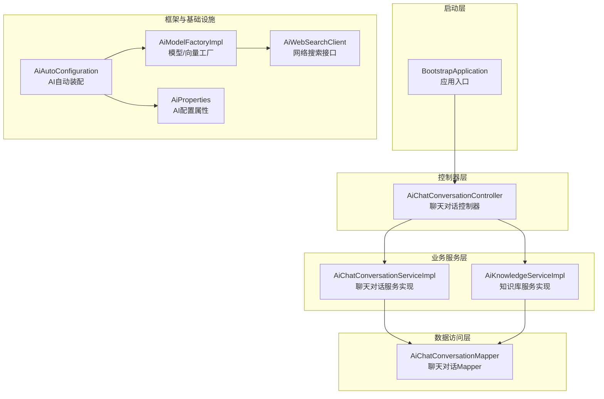
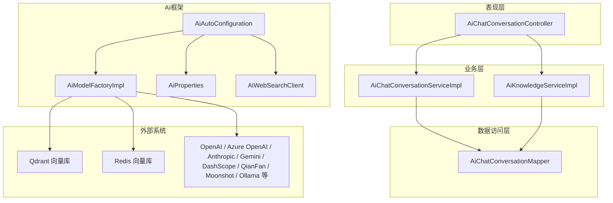
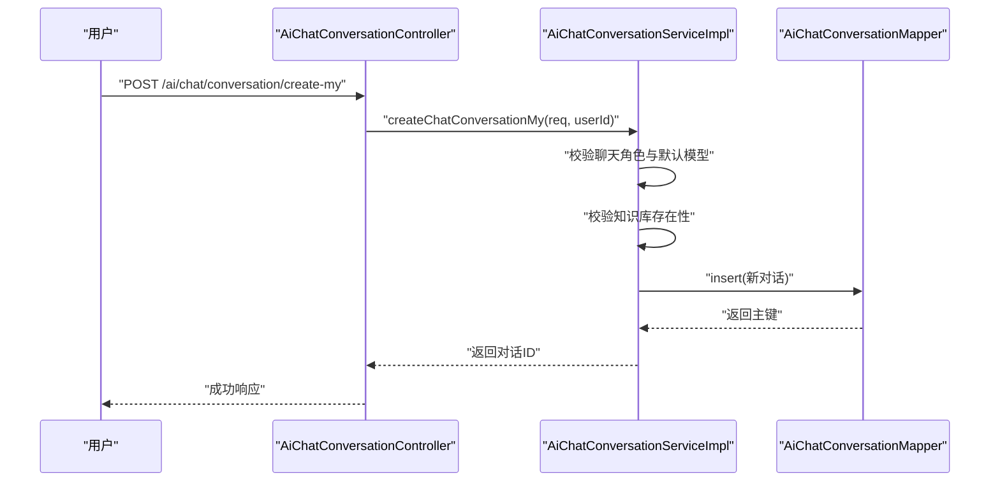
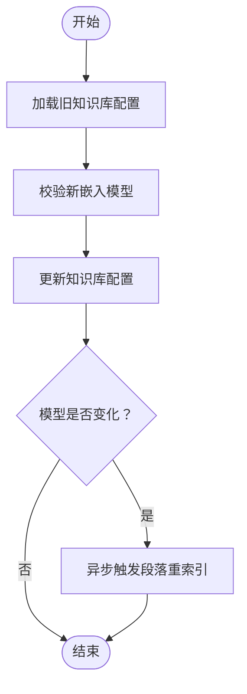
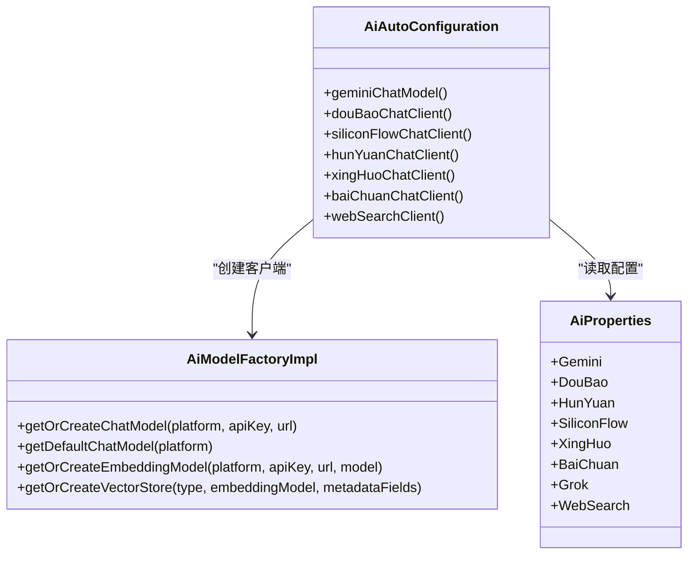
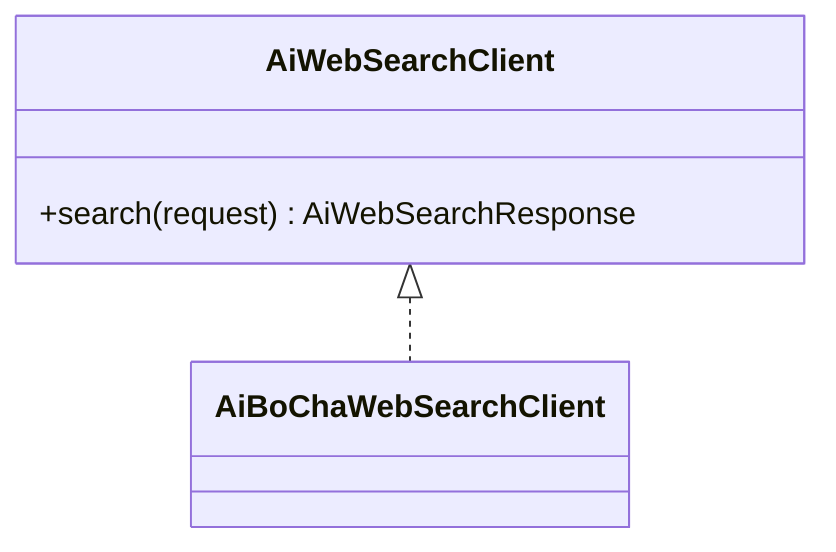
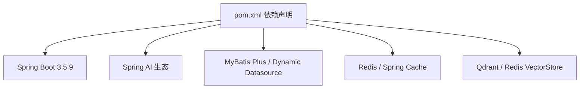

# 项目概述

<cite>
**本文引用的文件**
- [BootstrapApplication.java](file://src/main/java/cn/boss/data/ai/BootstrapApplication.java)
- [pom.xml](file://pom.xml)
- [application.yml](file://src/main/resources/application.yml)
- [AiAutoConfiguration.java](file://src/main/java/cn/boss/data/ai/framework/ai/config/AiAutoConfiguration.java)
- [AiProperties.java](file://src/main/java/cn/boss/data/ai/framework/ai/config/AiProperties.java)
- [AiModelFactoryImpl.java](file://src/main/java/cn/boss/data/ai/framework/ai/core/model/AiModelFactoryImpl.java)
- [AiChatConversationController.java](file://src/main/java/cn/boss/data/ai/controller/chat/AiChatConversationController.java)
- [AiChatConversationServiceImpl.java](file://src/main/java/cn/boss/data/ai/service/chat/AiChatConversationServiceImpl.java)
- [AiChatConversationMapper.java](file://src/main/java/cn/boss/data/ai/dal/mysql/chat/AiChatConversationMapper.java)
- [AiKnowledgeServiceImpl.java](file://src/main/java/cn/boss/data/ai/service/knowledge/AiKnowledgeServiceImpl.java)
- [SemanticTextSplitter.java](file://src/main/java/cn/boss/data/ai/service/knowledge/splitter/SemanticTextSplitter.java)
- [AiDocumentSplitStrategyEnum.java](file://src/main/java/cn/boss/data/ai/enums/AiDocumentSplitStrategyEnum.java)
- [AiWebSearchClient.java](file://src/main/java/cn/boss/data/ai/framework/ai/core/websearch/AiWebSearchClient.java)
</cite>

## 目录
1. [简介](#简介)
2. [项目结构](#项目结构)
3. [核心组件](#核心组件)
4. [架构总览](#架构总览)
5. [详细组件分析](#详细组件分析)
6. [依赖分析](#依赖分析)
7. [性能考虑](#性能考虑)
8. [故障排查指南](#故障排查指南)
9. [结论](#结论)
10. [附录](#附录)

## 简介
Data-AI 是一个基于 Spring Boot 的企业级 AI 服务平台，面向多模态与 RAG（检索增强生成）场景，提供统一的 AI 能力接入与知识管理能力。项目支持文本、图像、音频等多种模态的 AI 能力，并通过向量存储与多种大模型提供商集成，实现“知识入库—文本切分—向量化—检索—生成”的完整链路。项目采用模块化设计，覆盖聊天对话管理、知识库管理、文档与段落处理、模型工厂与向量存储工厂、网络搜索等能力，便于企业快速构建智能化应用。

## 项目结构
项目遵循典型的分层架构与领域驱动设计，主要分为以下层次：
- 启动层：Spring Boot 应用入口，扫描 Mapper 与开启异步
- 控制器层：REST API 控制器，负责请求接收与响应封装
- 业务服务层：具体业务逻辑实现，协调数据对象与持久化
- 数据访问层：MyBatis Plus Mapper 与基础封装
- 领域模型与枚举：数据对象、状态枚举、分词策略等
- 框架与基础设施：AI 自动装配、模型工厂、向量存储、Web 搜索等

图表来源
- [BootstrapApplication.java:1-18](file://src/main/java/cn/boss/data/ai/BootstrapApplication.java#L1-L18)
- [AiChatConversationController.java:1-113](file://src/main/java/cn/boss/data/ai/controller/chat/AiChatConversationController.java#L1-L113)
- [AiChatConversationServiceImpl.java:1-162](file://src/main/java/cn/boss/data/ai/service/chat/AiChatConversationServiceImpl.java#L1-L162)
- [AiChatConversationMapper.java:1-37](file://src/main/java/cn/boss/data/ai/dal/mysql/chat/AiChatConversationMapper.java#L1-L37)
- [AiAutoConfiguration.java:1-286](file://src/main/java/cn/boss/data/ai/framework/ai/config/AiAutoConfiguration.java#L1-L286)
- [AiModelFactoryImpl.java:1-568](file://src/main/java/cn/boss/data/ai/framework/ai/core/model/AiModelFactoryImpl.java#L1-L568)
- [AiProperties.java:1-134](file://src/main/java/cn/boss/data/ai/framework/ai/config/AiProperties.java#L1-L134)
- [AiWebSearchClient.java:1-17](file://src/main/java/cn/boss/data/ai/framework/ai/core/websearch/AiWebSearchClient.java#L1-L17)

章节来源
- [BootstrapApplication.java:1-18](file://src/main/java/cn/boss/data/ai/BootstrapApplication.java#L1-L18)
- [pom.xml:1-358](file://pom.xml#L1-L358)
- [application.yml:1-190](file://src/main/resources/application.yml#L1-L190)

## 核心组件
- 应用入口与配置
  - 启动类启用 MyBatis Mapper 扫描与异步执行，确保服务层可并发处理
  - application.yml 提供数据库、Redis、MyBatis Plus、日志、Swagger 与 AI 相关配置
- AI 自动装配与配置
  - AiAutoConfiguration 负责按需创建各厂商 ChatModel、EmbeddingModel、向量存储与网络搜索客户端
  - AiProperties 定义 boss.ai 下的多厂商配置结构，支持开关与参数注入
- 模型工厂与向量存储工厂
  - AiModelFactoryImpl 提供统一的 ChatModel/EmbeddingModel/VectorStore 获取与缓存机制，支持多平台与本地 SimpleVectorStore
- 聊天对话与知识库
  - 聊天对话控制器与服务实现，支持“我的对话”与“对话管理”，并校验模型与知识库有效性
  - 知识库服务实现，支持创建、更新、删除与分页查询，变更嵌入模型时触发重新索引
- 文本切分与策略
  - 支持多种切片策略（自动、Token、段落、Markdown QA、语义），语义切分器保证上下文连贯性
- 网络搜索
  - WebSearch 接口抽象，AiAutoConfiguration 条件装配 Bocha 网络搜索客户端

章节来源
- [AiAutoConfiguration.java:1-286](file://src/main/java/cn/boss/data/ai/framework/ai/config/AiAutoConfiguration.java#L1-L286)
- [AiProperties.java:1-134](file://src/main/java/cn/boss/data/ai/framework/ai/config/AiProperties.java#L1-L134)
- [AiModelFactoryImpl.java:1-568](file://src/main/java/cn/boss/data/ai/framework/ai/core/model/AiModelFactoryImpl.java#L1-L568)
- [AiChatConversationController.java:1-113](file://src/main/java/cn/boss/data/ai/controller/chat/AiChatConversationController.java#L1-L113)
- [AiChatConversationServiceImpl.java:1-162](file://src/main/java/cn/boss/data/ai/service/chat/AiChatConversationServiceImpl.java#L1-L162)
- [AiKnowledgeServiceImpl.java:1-110](file://src/main/java/cn/boss/data/ai/service/knowledge/AiKnowledgeServiceImpl.java#L1-L110)
- [SemanticTextSplitter.java:1-302](file://src/main/java/cn/boss/data/ai/service/knowledge/splitter/SemanticTextSplitter.java#L1-L302)
- [AiDocumentSplitStrategyEnum.java:1-52](file://src/main/java/cn/boss/data/ai/enums/AiDocumentSplitStrategyEnum.java#L1-L52)
- [AiWebSearchClient.java:1-17](file://src/main/java/cn/boss/data/ai/framework/ai/core/websearch/AiWebSearchClient.java#L1-L17)

## 架构总览
Data-AI 采用“控制器-服务-数据访问-框架配置”的分层架构，结合 Spring AI 生态与多厂商大模型接入，形成“统一配置 + 工厂模式 + 向量检索 + 业务编排”的整体设计。

图表来源
- [AiChatConversationController.java:1-113](file://src/main/java/cn/boss/data/ai/controller/chat/AiChatConversationController.java#L1-L113)
- [AiChatConversationServiceImpl.java:1-162](file://src/main/java/cn/boss/data/ai/service/chat/AiChatConversationServiceImpl.java#L1-L162)
- [AiChatConversationMapper.java:1-37](file://src/main/java/cn/boss/data/ai/dal/mysql/chat/AiChatConversationMapper.java#L1-L37)
- [AiAutoConfiguration.java:1-286](file://src/main/java/cn/boss/data/ai/framework/ai/config/AiAutoConfiguration.java#L1-L286)
- [AiModelFactoryImpl.java:1-568](file://src/main/java/cn/boss/data/ai/framework/ai/core/model/AiModelFactoryImpl.java#L1-L568)
- [AiProperties.java:1-134](file://src/main/java/cn/boss/data/ai/framework/ai/config/AiProperties.java#L1-L134)
- [AiWebSearchClient.java:1-17](file://src/main/java/cn/boss/data/ai/framework/ai/core/websearch/AiWebSearchClient.java#L1-L17)

## 详细组件分析

### 聊天对话模块
- 功能要点
  - 支持“我的对话”创建、更新、查询与删除；支持管理员维度的对话分页与删除
  - 创建时根据聊天角色与默认模型校验并设置温度、最大 Token、上下文等参数
  - 支持置顶时间与未置顶清理
- 关键流程（创建对话）

图表来源
- [AiChatConversationController.java:42-78](file://src/main/java/cn/boss/data/ai/controller/chat/AiChatConversationController.java#L42-L78)
- [AiChatConversationServiceImpl.java:52-78](file://src/main/java/cn/boss/data/ai/service/chat/AiChatConversationServiceImpl.java#L52-L78)
- [AiChatConversationMapper.java:18-26](file://src/main/java/cn/boss/data/ai/dal/mysql/chat/AiChatConversationMapper.java#L18-L26)

章节来源
- [AiChatConversationController.java:1-113](file://src/main/java/cn/boss/data/ai/controller/chat/AiChatConversationController.java#L1-L113)
- [AiChatConversationServiceImpl.java:1-162](file://src/main/java/cn/boss/data/ai/service/chat/AiChatConversationServiceImpl.java#L1-L162)
- [AiChatConversationMapper.java:1-37](file://src/main/java/cn/boss/data/ai/dal/mysql/chat/AiChatConversationMapper.java#L1-L37)

### 知识库与RAG模块
- 功能要点
  - 知识库创建/更新/删除与分页查询；更新时若嵌入模型变更，触发段落重新索引
  - 文档切片策略丰富，语义切分器在段落与句子边界切分，避免截断并保留上下文
  - 向量存储支持 Qdrant、Redis 与本地 SimpleVectorStore，按配置自动装配
- 关键流程（知识库更新与重索引）

图表来源
- [AiKnowledgeServiceImpl.java:54-69](file://src/main/java/cn/boss/data/ai/service/knowledge/AiKnowledgeServiceImpl.java#L54-L69)

章节来源
- [AiKnowledgeServiceImpl.java:1-110](file://src/main/java/cn/boss/data/ai/service/knowledge/AiKnowledgeServiceImpl.java#L1-L110)
- [SemanticTextSplitter.java:1-302](file://src/main/java/cn/boss/data/ai/service/knowledge/splitter/SemanticTextSplitter.java#L1-L302)
- [AiDocumentSplitStrategyEnum.java:1-52](file://src/main/java/cn/boss/data/ai/enums/AiDocumentSplitStrategyEnum.java#L1-L52)

### AI 模型与向量工厂
- 功能要点
  - 工厂按平台与密钥生成 ChatModel/EmbeddingModel/VectorStore，支持缓存与复用
  - 自动装配根据 boss.ai.* 配置动态启用对应厂商客户端
  - 支持 Gemini、豆包、混元、硅基流动、星火、百川、DeepSeek、OpenAI/Azure OpenAI、Anthropic、Ollama、Moonshot、文心一言、智谱等
- 类图（简化）

图表来源
- [AiAutoConfiguration.java:65-283](file://src/main/java/cn/boss/data/ai/framework/ai/config/AiAutoConfiguration.java#L65-L283)
- [AiModelFactoryImpl.java:115-245](file://src/main/java/cn/boss/data/ai/framework/ai/core/model/AiModelFactoryImpl.java#L115-L245)
- [AiProperties.java:54-131](file://src/main/java/cn/boss/data/ai/framework/ai/config/AiProperties.java#L54-L131)

章节来源
- [AiAutoConfiguration.java:1-286](file://src/main/java/cn/boss/data/ai/framework/ai/config/AiAutoConfiguration.java#L1-L286)
- [AiModelFactoryImpl.java:1-568](file://src/main/java/cn/boss/data/ai/framework/ai/core/model/AiModelFactoryImpl.java#L1-L568)
- [AiProperties.java:1-134](file://src/main/java/cn/boss/data/ai/framework/ai/config/AiProperties.java#L1-L134)

### 网络搜索模块
- 功能要点
  - AiWebSearchClient 抽象网页搜索能力
  - AiAutoConfiguration 条件装配 Bocha 网络搜索客户端，受 boss.ai.web-search.enable 控制
- 类图（简化）

图表来源
- [AiWebSearchClient.java:1-17](file://src/main/java/cn/boss/data/ai/framework/ai/core/websearch/AiWebSearchClient.java#L1-L17)

章节来源
- [AiWebSearchClient.java:1-17](file://src/main/java/cn/boss/data/ai/framework/ai/core/websearch/AiWebSearchClient.java#L1-L17)
- [AiAutoConfiguration.java:279-283](file://src/main/java/cn/boss/data/ai/framework/ai/config/AiAutoConfiguration.java#L279-L283)

## 依赖分析
- 技术栈概览
  - 运行环境：Java 17、Spring Boot 3.5.9
  - Web：Spring Web、WebFlux（流式响应）
  - ORM：MyBatis Plus、MyBatis Plus Join、Dynamic Datasource
  - 缓存与搜索：Redis、Spring Cache、Qdrant、Redis 向量存储
  - AI 生态：Spring AI（OpenAI、Azure OpenAI、Anthropic、Ollama、Stability AI、DeepSeek、Minimax、DashScope、QianFan、Moonshot、ZhiPuAi 等）、向量存储（Qdrant、Redis）
  - 工具：Lombok、Hutool、Guava、Swagger
- 配置与自动装配
  - application.yml 禁用部分自动装配，手动创建 Qdrant/Milvus，确保可控初始化
  - boss.ai.* 提供多厂商开关与参数，AiAutoConfiguration 条件创建 Bean
- 依赖关系示意

图表来源
- [pom.xml:47-280](file://pom.xml#L47-L280)
- [application.yml:14-149](file://src/main/resources/application.yml#L14-L149)

章节来源
- [pom.xml:1-358](file://pom.xml#L1-L358)
- [application.yml:1-190](file://src/main/resources/application.yml#L1-L190)

## 性能考虑
- 向量存储与批处理
  - 使用 TokenCountBatchingStrategy 与 ObservationRegistry，提升嵌入与向量操作的可观测性与吞吐
- 缓存与复用
  - 模型工厂按平台/密钥/URL 缓存 ChatModel/EmbeddingModel/VectorStore，减少重复初始化开销
- 文本切分优化
  - 语义切分器优先段落边界，其次句子边界，避免截断；通过重叠窗口保留上下文，提高检索质量
- 异步与并发
  - 启用异步执行，服务层可并发处理任务（如重索引）

## 故障排查指南
- 启动与配置
  - 若出现自动装配冲突，检查 application.yml 中被排除的自动配置项
  - 确认 boss.ai.* 配置项与实际启用的厂商一致
- 数据与模型
  - 对话创建失败：检查默认聊天模型是否存在且参数完整
  - 知识库更新后检索异常：确认嵌入模型变更触发了重索引流程
- 向量存储
  - Qdrant/Redis 连接失败：核对 host/port/apiKey 与网络连通性
- 模型调用
  - 多厂商模型调用失败：检查对应 apiKey/baseUrl 与平台可用性

章节来源
- [application.yml:14-149](file://src/main/resources/application.yml#L14-L149)
- [AiChatConversationServiceImpl.java:131-137](file://src/main/java/cn/boss/data/ai/service/chat/AiChatConversationServiceImpl.java#L131-L137)
- [AiKnowledgeServiceImpl.java:66-68](file://src/main/java/cn/boss/data/ai/service/knowledge/AiKnowledgeServiceImpl.java#L66-L68)

## 结论
Data-AI 通过清晰的分层架构与 Spring AI 生态整合，为企业提供了统一的多模态与 RAG 能力平台。其核心价值在于：
- 快速接入多家大模型与向量存储
- 完整的知识入库、切分、向量化与检索链路
- 易扩展的工厂与配置体系，便于企业定制与运维

## 附录
- 应用场景与使用案例（概念性说明）
  - 智能客服：基于知识库的问答与上下文对话
  - 企业知识助手：文档检索与摘要生成
  - 多模态内容创作：文本生成、图像生成与音频处理（依据所选模型能力）
  - 搜索增强：结合网络搜索与内部知识库，提升回答准确性
- 上手建议
  - 从 application.yml 配置 boss.ai.* 开始，选择所需厂商与模型
  - 使用 AiModelFactoryImpl 获取 ChatModel/EmbeddingModel/VectorStore，按需缓存
  - 通过 AiChatConversationController 与 AiKnowledgeServiceImpl 快速搭建对话与知识库功能