# AI代理开发指南

<cite>
**本文档引用的文件**
- [BootstrapApplication.java](file://src/main/java/cn/boss/data/ai/BootstrapApplication.java)
- [pom.xml](file://pom.xml)
- [application.yml](file://src/main/resources/application.yml)
- [AGENTS.md](file://AGENTS.md)
- [CLAUDE.md](file://CLAUDE.md)
- [AiAutoConfiguration.java](file://src/main/java/cn/boss/data/ai/framework/ai/config/AiAutoConfiguration.java)
- [AiModelFactory.java](file://src/main/java/cn/boss/data/ai/framework/ai/core/model/AiModelFactory.java)
- [AiProperties.java](file://src/main/java/cn/boss/data/ai/framework/ai/config/AiProperties.java)
- [AiPlatformEnum.java](file://src/main/java/cn/boss/data/ai/enums/model/AiPlatformEnum.java)
- [AiModelTypeEnum.java](file://src/main/java/cn/boss/data/ai/enums/model/AiModelTypeEnum.java)
- [AiChatConversationService.java](file://src/main/java/cn/boss/data/ai/service/chat/AiChatConversationService.java)
- [AiChatConversationController.java](file://src/main/java/cn/boss/data/ai/controller/chat/AiChatConversationController.java)
- [AiKnowledgeService.java](file://src/main/java/cn/boss/data/ai/service/knowledge/AiKnowledgeService.java)
- [AiKnowledgeController.java](file://src/main/java/cn/boss/data/ai/controller/knowledge/AiKnowledgeController.java)
- [BaseDO.java](file://src/main/java/cn/boss/data/ai/framework/mybatis/core/dataobject/BaseDO.java)
</cite>

## 目录
1. [项目概述](#项目概述)
2. [技术架构](#技术架构)
3. [核心组件](#核心组件)
4. [系统架构总览](#系统架构总览)
5. [详细组件分析](#详细组件分析)
6. [依赖关系分析](#依赖关系分析)
7. [性能考虑](#性能考虑)
8. [故障排除指南](#故障排除指南)
9. [结论](#结论)
10. [附录](#附录)

## 项目概述

data-ai 是一个基于 Spring Boot 3 + Spring AI 的企业级 AI 应用后端服务。该项目提供了完整的 AI 代理开发框架，支持多模型聊天对话、知识库（RAG）管理和工具调用功能。

### 核心能力
- **多模型聊天对话**：统一接入通义千问、DeepSeek、OpenAI、Ollama 等国内外主流大模型
- **知识库（RAG）**：文档上传解析、段落切分、向量化、向量检索（Qdrant / Redis / Milvus 三选一）
- **工具调用**：Spring AI Function Calling + MCP Server / Client

### 技术栈
- 语言：Java 17
- 框架：Spring Boot 3.5.9、Spring AI 1.1.2
- 持久层：MyBatis Plus 3.5.8 + dynamic-datasource
- 向量库：Qdrant / Redis / Milvus
- 响应式：Spring WebFlux（Flux 流式）

**章节来源**
- [AGENTS.md:1-144](file://AGENTS.md#L1-L144)
- [CLAUDE.md:1-99](file://CLAUDE.md#L1-L99)

## 技术架构

### 项目结构
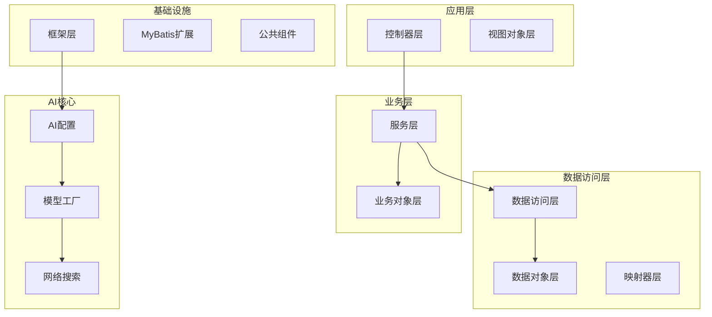

**图表来源**
- [BootstrapApplication.java:1-18](file://src/main/java/cn/boss/data/ai/BootstrapApplication.java#L1-L18)
- [CLAUDE.md:17-37](file://CLAUDE.md#L17-L37)

### 分层架构设计
项目采用清晰的分层架构，遵循DDD（领域驱动设计）原则：

1. **Controller 层**：负责 HTTP 接入和参数校验
2. **Service 层**：业务逻辑处理，事务管理
3. **DAL 层**：数据持久化，MyBatis Plus 映射
4. **Framework 层**：基础设施和公共组件
5. **AI 层**：AI 模型集成和工具调用

**章节来源**
- [CLAUDE.md:47-71](file://CLAUDE.md#L47-L71)
- [AGENTS.md:87-119](file://AGENTS.md#L87-L119)

## 核心组件

### AI 模型工厂
AI 模型工厂是整个 AI 功能的核心，负责统一管理不同平台的大模型实例。

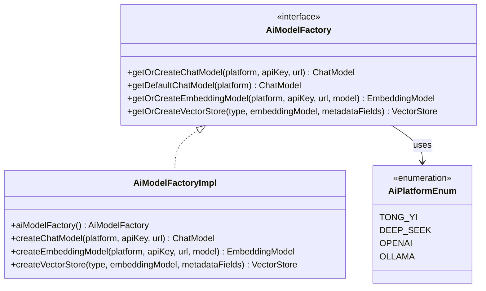

**图表来源**
- [AiModelFactory.java:1-63](file://src/main/java/cn/boss/data/ai/framework/ai/core/model/AiModelFactory.java#L1-L63)
- [AiAutoConfiguration.java:34-37](file://src/main/java/cn/boss/data/ai/framework/ai/config/AiAutoConfiguration.java#L34-L37)

### AI 配置管理
项目采用集中式配置管理，支持多种 AI 平台的灵活配置。

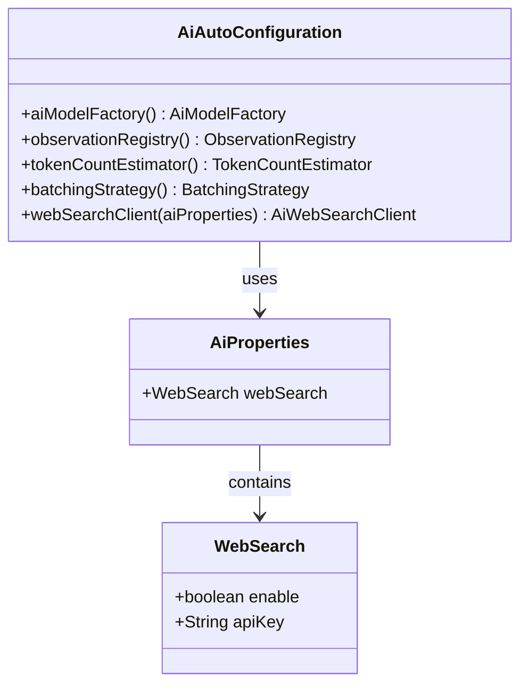

**图表来源**
- [AiProperties.java:1-25](file://src/main/java/cn/boss/data/ai/framework/ai/config/AiProperties.java#L1-L25)
- [AiAutoConfiguration.java:26-67](file://src/main/java/cn/boss/data/ai/framework/ai/config/AiAutoConfiguration.java#L26-L67)

**章节来源**
- [AiModelFactory.java:10-63](file://src/main/java/cn/boss/data/ai/framework/ai/core/model/AiModelFactory.java#L10-L63)
- [AiProperties.java:6-25](file://src/main/java/cn/boss/data/ai/framework/ai/config/AiProperties.java#L6-L25)
- [AiAutoConfiguration.java:23-67](file://src/main/java/cn/boss/data/ai/framework/ai/config/AiAutoConfiguration.java#L23-L67)

## 系统架构总览

### 整体架构图
```mermaid
graph TB
subgraph "客户端层"
WebApp[Web应用]
MobileApp[移动端]
API[第三方API]
end
subgraph "网关层"
Gateway[API网关]
Auth[认证授权]
end
subgraph "应用服务层"
ChatService[聊天服务]
KnowledgeService[知识库服务]
ModelService[模型服务]
end
subgraph "AI引擎层"
ModelFactory[模型工厂]
VectorStore[向量存储]
WebSearch[网络搜索]
end
subgraph "数据存储层"
MySQL[(MySQL)]
Redis[(Redis)]
VectorDB[(向量数据库)]
end
WebApp --> Gateway
MobileApp --> Gateway
API --> Gateway
Gateway --> Auth
Auth --> ChatService
Auth --> KnowledgeService
Auth --> ModelService
ChatService --> ModelFactory
KnowledgeService --> VectorStore
ModelService --> WebSearch
ModelFactory --> MySQL
VectorStore --> Redis
VectorStore --> VectorDB
WebSearch --> MySQL
```

**图表来源**
- [BootstrapApplication.java:8-15](file://src/main/java/cn/boss/data/ai/BootstrapApplication.java#L8-L15)
- [application.yml:79-139](file://src/main/resources/application.yml#L79-L139)

### 数据流架构
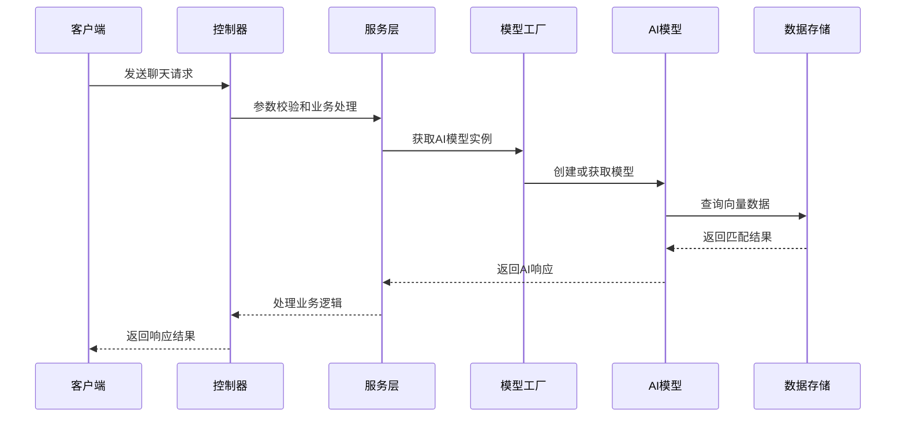

**图表来源**
- [AiChatConversationController.java:42-79](file://src/main/java/cn/boss/data/ai/controller/chat/AiChatConversationController.java#L42-L79)
- [AiModelFactory.java:25-60](file://src/main/java/cn/boss/data/ai/framework/ai/core/model/AiModelFactory.java#L25-L60)

## 详细组件分析

### 聊天对话系统

#### 组件架构
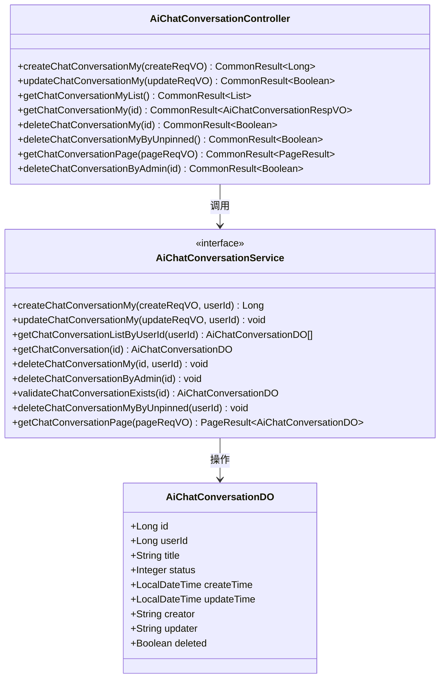

**图表来源**
- [AiChatConversationController.java:33-113](file://src/main/java/cn/boss/data/ai/controller/chat/AiChatConversationController.java#L33-L113)
- [AiChatConversationService.java:14-35](file://src/main/java/cn/boss/data/ai/service/chat/AiChatConversationService.java#L14-L35)
- [BaseDO.java:13-31](file://src/main/java/cn/boss/data/ai/framework/mybatis/core/dataobject/BaseDO.java#L13-L31)

#### 聊天流程
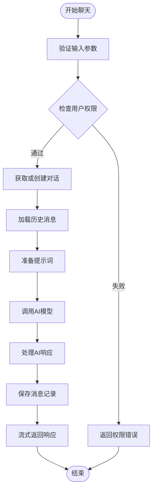

**图表来源**
- [AiChatConversationController.java:42-110](file://src/main/java/cn/boss/data/ai/controller/chat/AiChatConversationController.java#L42-L110)

**章节来源**
- [AiChatConversationController.java:1-113](file://src/main/java/cn/boss/data/ai/controller/chat/AiChatConversationController.java#L1-L113)
- [AiChatConversationService.java:1-35](file://src/main/java/cn/boss/data/ai/service/chat/AiChatConversationService.java#L1-L35)

### 知识库管理系统

#### 知识库架构
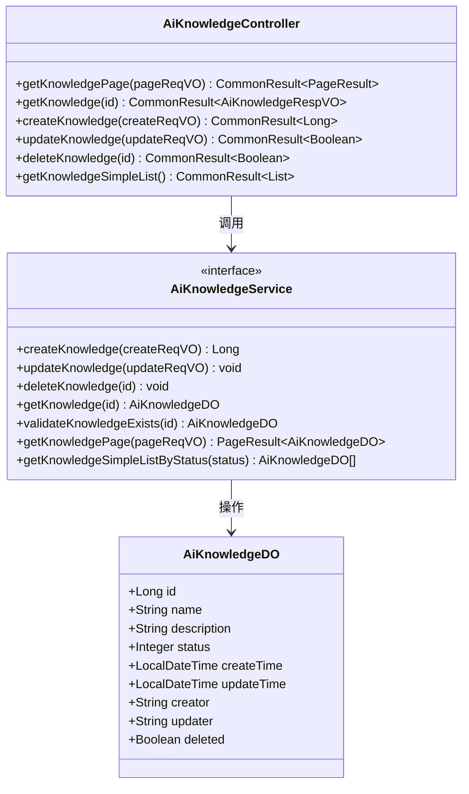

**图表来源**
- [AiKnowledgeController.java:25-79](file://src/main/java/cn/boss/data/ai/controller/knowledge/AiKnowledgeController.java#L25-L79)
- [AiKnowledgeService.java:15-71](file://src/main/java/cn/boss/data/ai/service/knowledge/AiKnowledgeService.java#L15-L71)

#### 知识库处理流程
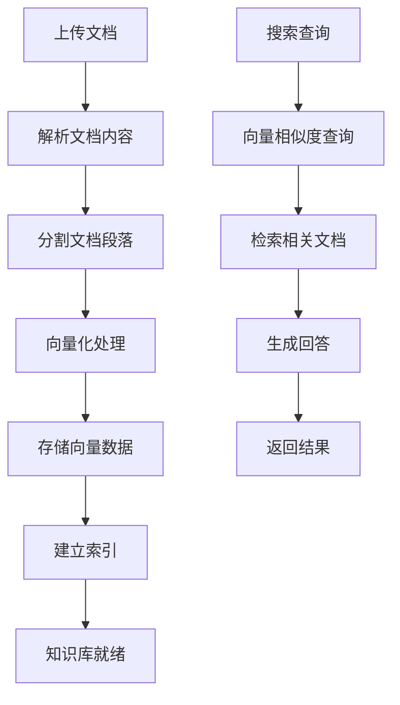

**图表来源**
- [AiKnowledgeController.java:49-68](file://src/main/java/cn/boss/data/ai/controller/knowledge/AiKnowledgeController.java#L49-L68)

**章节来源**
- [AiKnowledgeController.java:1-79](file://src/main/java/cn/boss/data/ai/controller/knowledge/AiKnowledgeController.java#L1-L79)
- [AiKnowledgeService.java:1-71](file://src/main/java/cn/boss/data/ai/service/knowledge/AiKnowledgeService.java#L1-L71)

### 模型管理服务

#### 模型类型枚举
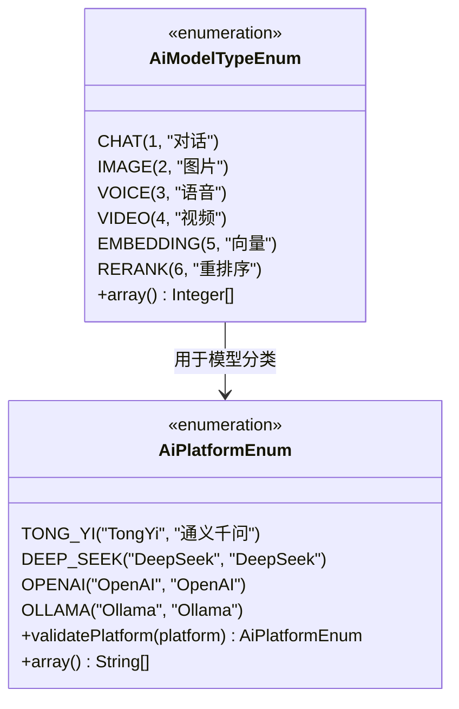

**图表来源**
- [AiModelTypeEnum.java:14-40](file://src/main/java/cn/boss/data/ai/enums/model/AiModelTypeEnum.java#L14-L40)
- [AiPlatformEnum.java:14-54](file://src/main/java/cn/boss/data/ai/enums/model/AiPlatformEnum.java#L14-L54)

**章节来源**
- [AiModelTypeEnum.java:1-40](file://src/main/java/cn/boss/data/ai/enums/model/AiModelTypeEnum.java#L1-L40)
- [AiPlatformEnum.java:1-54](file://src/main/java/cn/boss/data/ai/enums/model/AiPlatformEnum.java#L1-L54)

## 依赖关系分析

### Maven 依赖结构
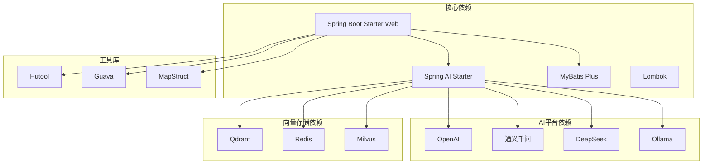

**图表来源**
- [pom.xml:48-255](file://pom.xml#L48-L255)

### 配置依赖关系
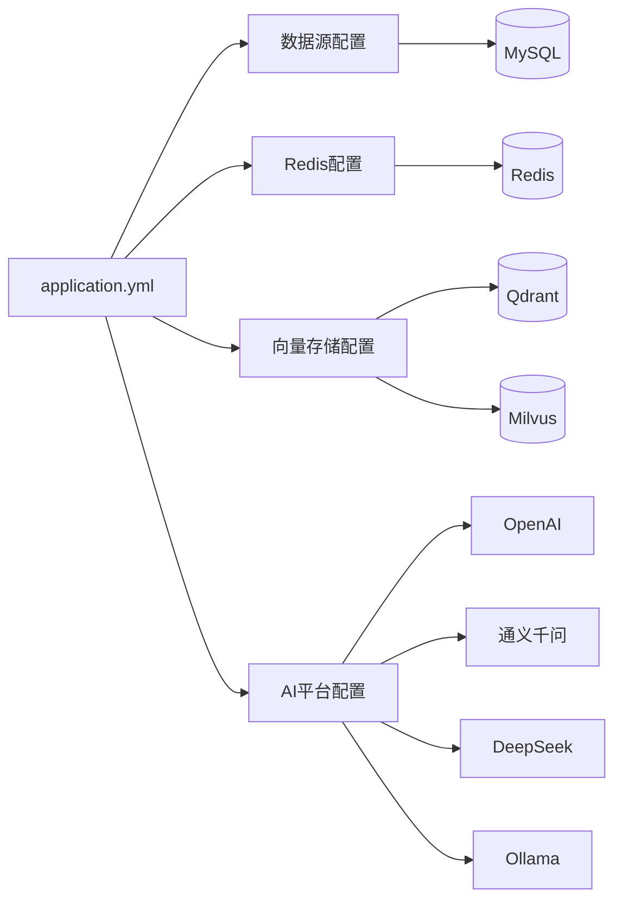

**图表来源**
- [application.yml:17-139](file://src/main/resources/application.yml#L17-L139)

**章节来源**
- [pom.xml:1-344](file://pom.xml#L1-L344)
- [application.yml:1-139](file://src/main/resources/application.yml#L1-L139)

## 性能考虑

### 缓存策略
项目采用了多层次的缓存策略来提升性能：

1. **Redis 缓存**：用于会话状态、API Key 缓存
2. **向量存储缓存**：Redis 作为向量索引存储
3. **数据库连接池**：使用 HikariCP 提供高性能连接池

### 异步处理
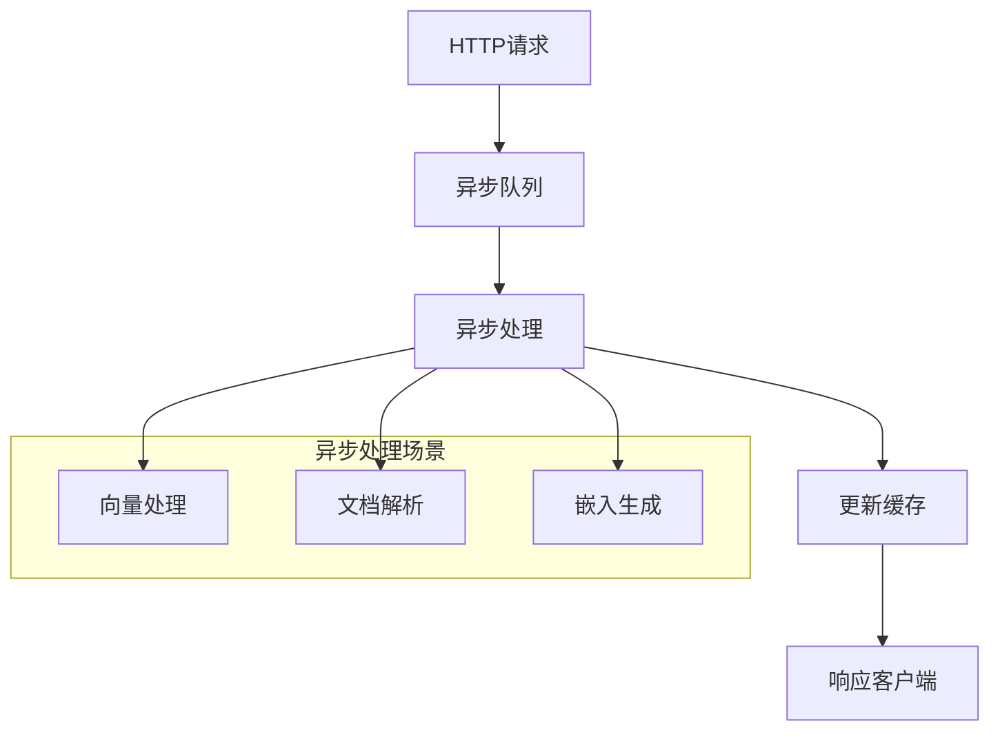

**章节来源**
- [BootstrapApplication.java:6](file://src/main/java/cn/boss/data/ai/BootstrapApplication.java#L6)
- [application.yml:28-34](file://src/main/resources/application.yml#L28-L34)

## 故障排除指南

### 常见问题诊断

#### 数据库连接问题
- **症状**：应用启动时报数据库连接错误
- **排查步骤**：
  1. 检查 MySQL 服务是否启动
  2. 验证连接字符串和凭据
  3. 确认防火墙设置
  4. 查看 p6spy SQL 日志

#### AI 模型连接问题
- **症状**：调用 AI 接口返回连接超时
- **排查步骤**：
  1. 验证 API Key 配置
  2. 检查网络连通性
  3. 确认模型服务可用性
  4. 查看 AI 日志输出

#### 向量存储问题
- **症状**：知识库检索功能异常
- **排查步骤**：
  1. 验证向量存储服务状态
  2. 检查索引完整性
  3. 确认嵌入模型配置
  4. 查看向量存储日志

**章节来源**
- [application.yml:57-61](file://src/main/resources/application.yml#L57-L61)
- [application.yml:17-27](file://src/main/resources/application.yml#L17-L27)

## 结论

data-ai 项目提供了一个完整的企业级 AI 代理开发框架，具有以下特点：

1. **模块化设计**：清晰的分层架构和模块划分
2. **多平台支持**：统一的 AI 模型集成接口
3. **可扩展性**：灵活的配置管理和插件机制
4. **性能优化**：多层次缓存和异步处理
5. **开发友好**：完善的开发规范和工具链

该框架适用于构建复杂的 AI 应用，包括智能客服、知识问答、内容创作等多种场景。

## 附录

### 开发环境搭建

#### 必需组件
- **数据库**：MySQL 8.0+
- **缓存**：Redis 6.0+
- **向量库**：可选 Qdrant 或 Milvus
- **JDK**：Java 17+

#### 配置步骤
1. 创建数据库 `data-ai`
2. 配置数据库连接信息
3. 设置 AI 平台 API Key
4. 启动向量存储服务（如使用）
5. 运行应用

### API 接口文档
项目集成了 Swagger/OpenAPI 文档系统，可通过以下地址访问：
- **API 文档**：`http://localhost:48090/v3/api-docs`
- **Swagger UI**：`http://localhost:48090/swagger-ui.html`