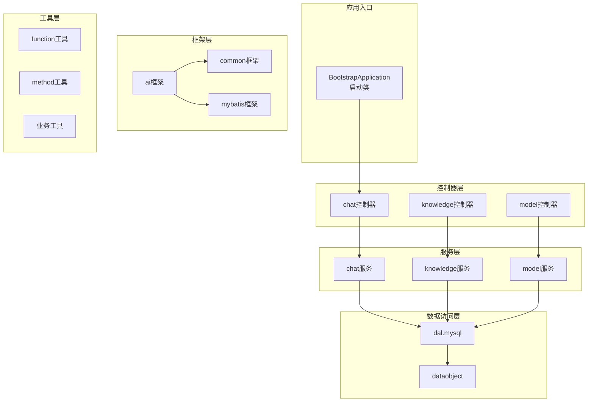
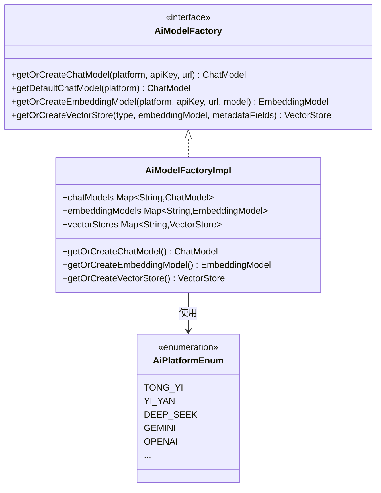
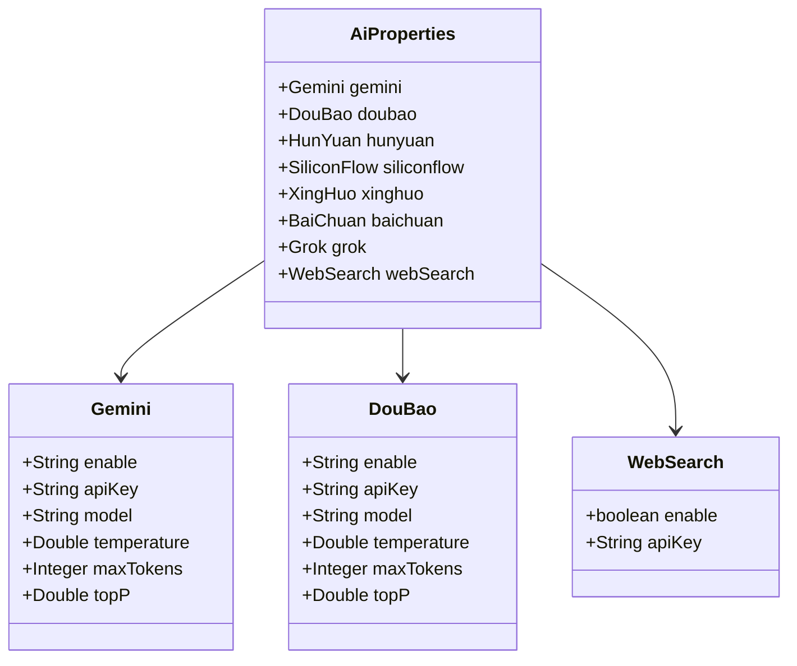
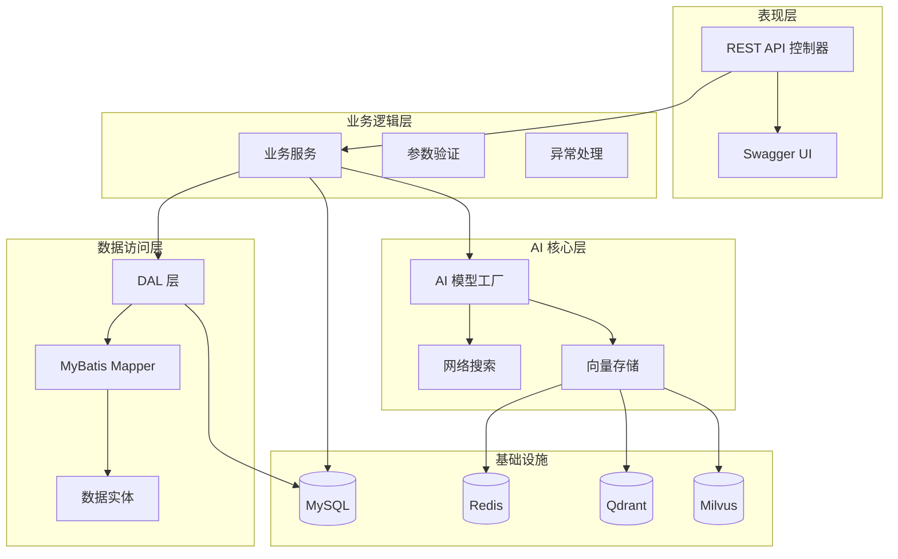
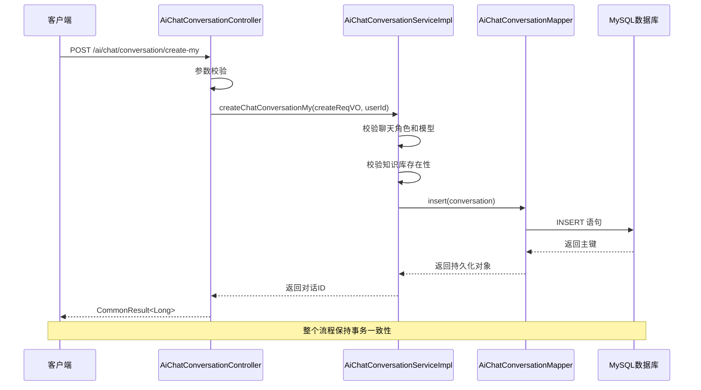
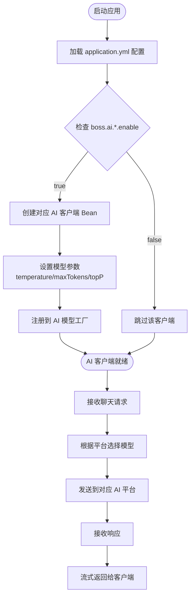
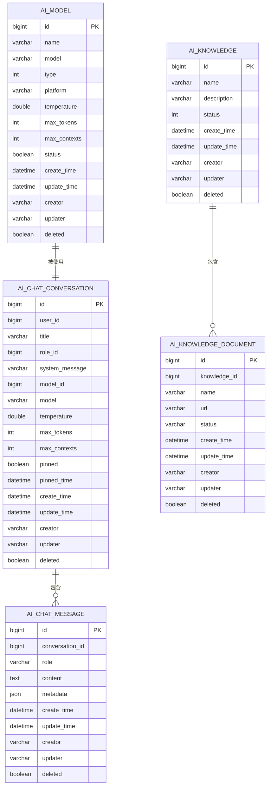
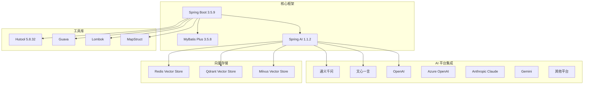

# AI助手项目指南

<cite>
**本文档引用的文件**
- [BootstrapApplication.java](file://src/main/java/cn/boss/data/ai/BootstrapApplication.java)
- [application.yml](file://src/main/resources/application.yml)
- [pom.xml](file://pom.xml)
- [AGENTS.md](file://AGENTS.md)
- [lombok.config](file://lombok.config)
- [AiAutoConfiguration.java](file://src/main/java/cn/boss/data/ai/framework/ai/config/AiAutoConfiguration.java)
- [AiProperties.java](file://src/main/java/cn/boss/data/ai/framework/ai/config/AiProperties.java)
- [AiPlatformEnum.java](file://src/main/java/cn/boss/data/ai/enums/model/AiPlatformEnum.java)
- [AiModelTypeEnum.java](file://src/main/java/cn/boss/data/ai/enums/model/AiModelTypeEnum.java)
- [AiModelFactory.java](file://src/main/java/cn/boss/data/ai/framework/ai/core/model/AiModelFactory.java)
- [AiChatConversationController.java](file://src/main/java/cn/boss/data/ai/controller/chat/AiChatConversationController.java)
- [AiChatConversationServiceImpl.java](file://src/main/java/cn/boss/data/ai/service/chat/AiChatConversationServiceImpl.java)
- [AiChatConversationMapper.java](file://src/main/java/cn/boss/data/ai/dal/mysql/chat/AiChatConversationMapper.java)
- [BaseDO.java](file://src/main/java/cn/boss/data/ai/framework/mybatis/core/dataobject/BaseDO.java)
- [CommonResult.java](file://src/main/java/cn/boss/data/ai/framework/common/pojo/CommonResult.java)
</cite>

## 目录
1. [项目简介](#项目简介)
2. [项目结构](#项目结构)
3. [核心组件](#核心组件)
4. [架构总览](#架构总览)
5. [详细组件分析](#详细组件分析)
6. [依赖关系分析](#依赖关系分析)
7. [性能考虑](#性能考虑)
8. [故障排除指南](#故障排除指南)
9. [结论](#结论)
10. [附录](#附录)

## 项目简介
本项目是一个基于 Spring Boot 3 + Spring AI 的企业级 AI 应用后端服务，具备以下核心能力：
- 多模型聊天对话：统一接入通义千问、文心一言、DeepSeek、智谱、讯飞星火、豆包、混元、硅基流动、MiniMax、Moonshot、百川、OpenAI、Azure OpenAI、Anthropic、Gemini、Ollama、Grok 等国内外主流大模型
- 知识库（RAG）：文档上传解析、段落切分、向量化、向量检索（Qdrant / Redis / Milvus 三选一）
- 工具调用：Spring AI Function Calling + MCP Server / Client
- 多媒体生成：图片（StableDiffusion、Midjourney）、音乐（Suno）

项目采用分层架构设计，遵循严格的编码规范和最佳实践，确保系统的可维护性和扩展性。

## 项目结构
项目采用标准的 Maven 多模块结构，主要包含以下核心包：

**图表来源**
- [BootstrapApplication.java:1-18](file://src/main/java/cn/boss/data/ai/BootstrapApplication.java#L1-L18)
- [AGENTS.md:66-86](file://AGENTS.md#L66-L86)

**章节来源**
- [AGENTS.md:66-86](file://AGENTS.md#L66-L86)
- [BootstrapApplication.java:1-18](file://src/main/java/cn/boss/data/ai/BootstrapApplication.java#L1-L18)

## 核心组件
项目的核心组件包括 AI 模型工厂、配置管理、数据模型和异常处理机制。

### AI 模型工厂
AI 模型工厂负责统一管理各种 AI 平台的客户端实例，支持按需启用和配置不同的大模型提供商。

**图表来源**
- [AiModelFactory.java:1-63](file://src/main/java/cn/boss/data/ai/framework/ai/core/model/AiModelFactory.java#L1-L63)
- [AiAutoConfiguration.java:52-55](file://src/main/java/cn/boss/data/ai/framework/ai/config/AiAutoConfiguration.java#L52-L55)

### 配置管理
项目采用分层配置管理，支持多种 AI 平台的灵活配置和切换。

**图表来源**
- [AiProperties.java:1-134](file://src/main/java/cn/boss/data/ai/framework/ai/config/AiProperties.java#L1-L134)

**章节来源**
- [AiAutoConfiguration.java:1-286](file://src/main/java/cn/boss/data/ai/framework/ai/config/AiAutoConfiguration.java#L1-L286)
- [AiProperties.java:1-134](file://src/main/java/cn/boss/data/ai/framework/ai/config/AiProperties.java#L1-L134)

## 架构总览
项目采用典型的三层架构设计，结合 Spring AI 的强大能力，构建了完整的 AI 应用解决方案。

**图表来源**
- [application.yml:79-190](file://src/main/resources/application.yml#L79-L190)
- [BootstrapApplication.java:8-10](file://src/main/java/cn/boss/data/ai/BootstrapApplication.java#L8-L10)

## 详细组件分析

### 聊天对话控制器
聊天对话控制器提供了完整的对话管理功能，包括创建、更新、查询和删除操作。

**图表来源**
- [AiChatConversationController.java:42-46](file://src/main/java/cn/boss/data/ai/controller/chat/AiChatConversationController.java#L42-L46)
- [AiChatConversationServiceImpl.java:52-78](file://src/main/java/cn/boss/data/ai/service/chat/AiChatConversationServiceImpl.java#L52-L78)

### AI 模型配置流程
AI 模型的配置和初始化过程体现了工厂模式和条件装配的设计思想。

**图表来源**
- [AiAutoConfiguration.java:65-91](file://src/main/java/cn/boss/data/ai/framework/ai/config/AiAutoConfiguration.java#L65-L91)
- [AiProperties.java:53-61](file://src/main/java/cn/boss/data/ai/framework/ai/config/AiProperties.java#L53-L61)

### 数据模型设计
项目采用统一的数据模型设计，确保不同模块间的一致性和可维护性。

**图表来源**
- [BaseDO.java:13-30](file://src/main/java/cn/boss/data/ai/framework/mybatis/core/dataobject/BaseDO.java#L13-L30)

**章节来源**
- [AiChatConversationController.java:1-113](file://src/main/java/cn/boss/data/ai/controller/chat/AiChatConversationController.java#L1-L113)
- [AiChatConversationServiceImpl.java:1-162](file://src/main/java/cn/boss/data/ai/service/chat/AiChatConversationServiceImpl.java#L1-L162)
- [AiChatConversationMapper.java:1-37](file://src/main/java/cn/boss/data/ai/dal/mysql/chat/AiChatConversationMapper.java#L1-L37)

## 依赖关系分析
项目采用 Maven 管理依赖，集成了 Spring AI 生态系统的多个组件。

**图表来源**
- [pom.xml:11-34](file://pom.xml#L11-L34)
- [pom.xml:48-294](file://pom.xml#L48-L294)

**章节来源**
- [pom.xml:1-383](file://pom.xml#L1-L383)

## 性能考虑
项目在设计时充分考虑了性能优化和扩展性需求：

### 缓存策略
- Redis 缓存：利用 Redis 作为缓存层，减少重复计算和网络请求
- 向量存储：支持多种向量存储方案，可根据场景选择最优方案

### 异步处理
- 启用异步支持，提高并发处理能力
- 流式响应：聊天接口支持 Flux 流式响应，提升用户体验

### 数据库优化
- MyBatis Plus 提供高效的 ORM 能力
- 逻辑删除避免物理删除带来的性能问题
- 多数据源支持动态切换

## 故障排除指南
常见问题及解决方案：

### 启动失败
**问题**：应用启动时报错
**排查步骤**：
1. 检查数据库连接配置
2. 验证 Redis 服务状态
3. 确认各 AI 平台 API Key 配置正确

### API 调用异常
**问题**：聊天接口返回错误
**排查步骤**：
1. 检查模型配置是否正确
2. 验证 API Key 权限
3. 查看日志获取详细错误信息

### 性能问题
**问题**：响应时间过长
**排查步骤**：
1. 检查向量存储性能
2. 优化数据库查询
3. 调整缓存策略

**章节来源**
- [application.yml:58-62](file://src/main/resources/application.yml#L58-L62)
- [AGENTS.md:121-132](file://AGENTS.md#L121-L132)

## 结论
本项目通过精心设计的架构和完善的组件体系，成功构建了一个功能丰富、性能优异的 AI 应用后端服务。项目的主要优势包括：

1. **模块化设计**：清晰的分层架构便于维护和扩展
2. **多平台支持**：统一的 AI 模型工厂支持多家平台
3. **高性能实现**：合理的缓存和异步处理策略
4. **完善的异常处理**：标准化的错误处理机制
5. **丰富的工具库**：集成多种实用工具提升开发效率

项目遵循企业级开发标准，具备良好的可维护性和扩展性，为企业级 AI 应用提供了坚实的技术基础。

## 附录

### 快速开始
1. 准备环境：MySQL、Redis、可选向量库
2. 配置 API Key：在 application.yml 中设置各平台密钥
3. 启动应用：执行 `mvn spring-boot:run`
4. 访问接口：Swagger UI 地址 `/swagger-ui.html`

### 配置说明
- 默认端口：48090
- 数据库：MySQL 8.0+
- Redis：6.0+
- 向量库：Redis、Qdrant 或 Milvus 任选其一

**章节来源**
- [AGENTS.md:36-56](file://AGENTS.md#L36-L56)
- [application.yml:1-190](file://src/main/resources/application.yml#L1-L190)