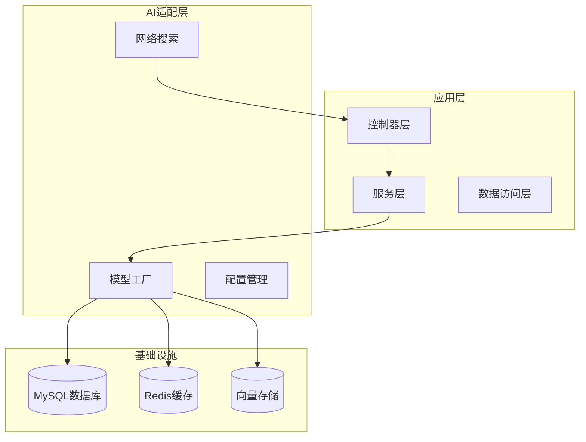
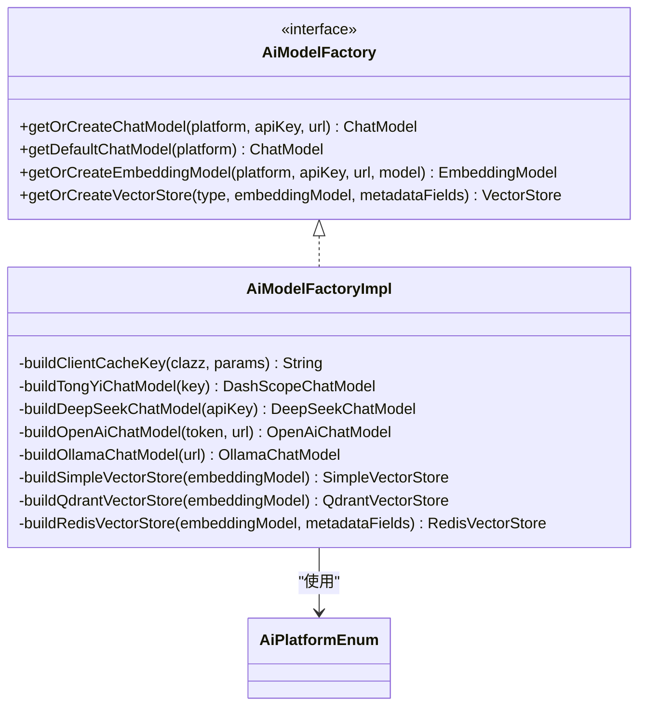
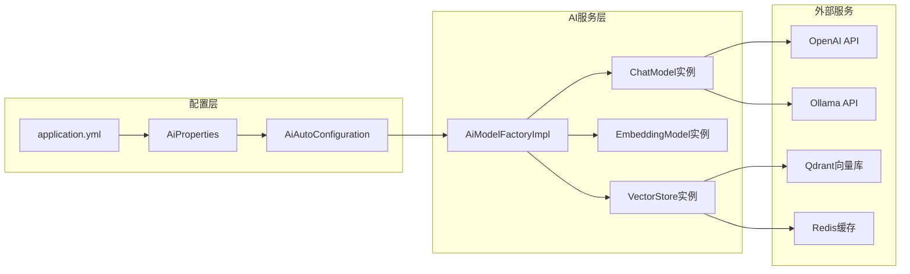
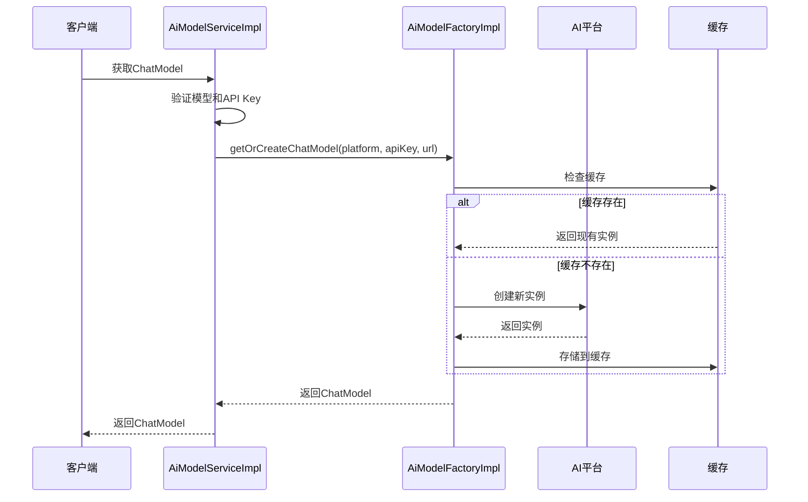
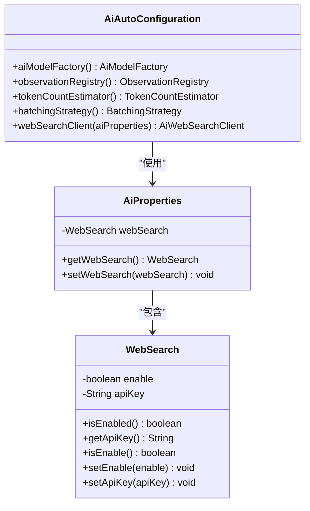
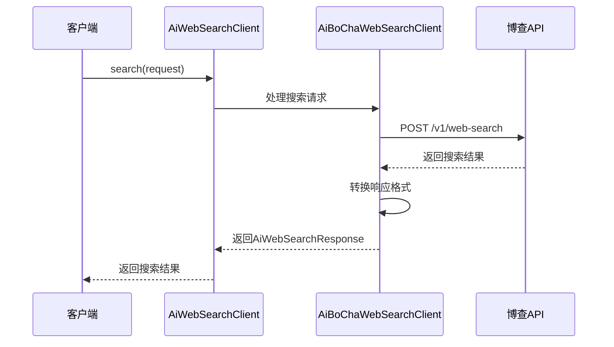
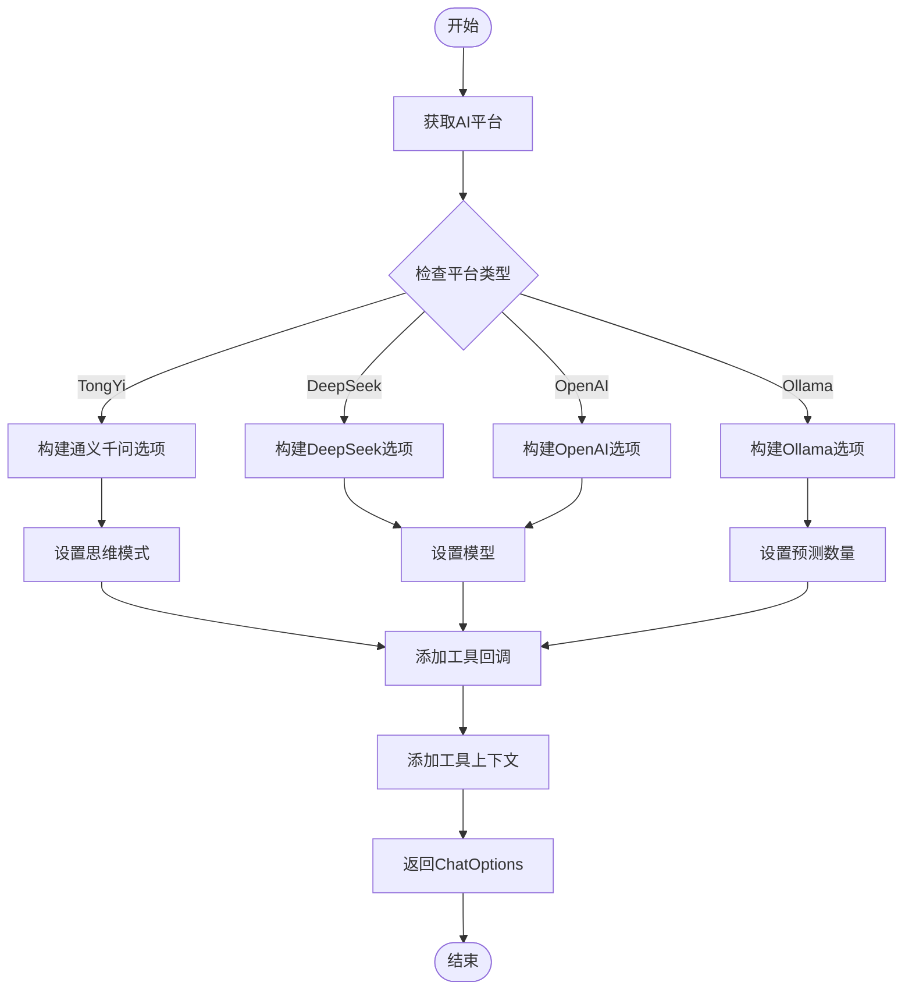
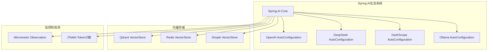
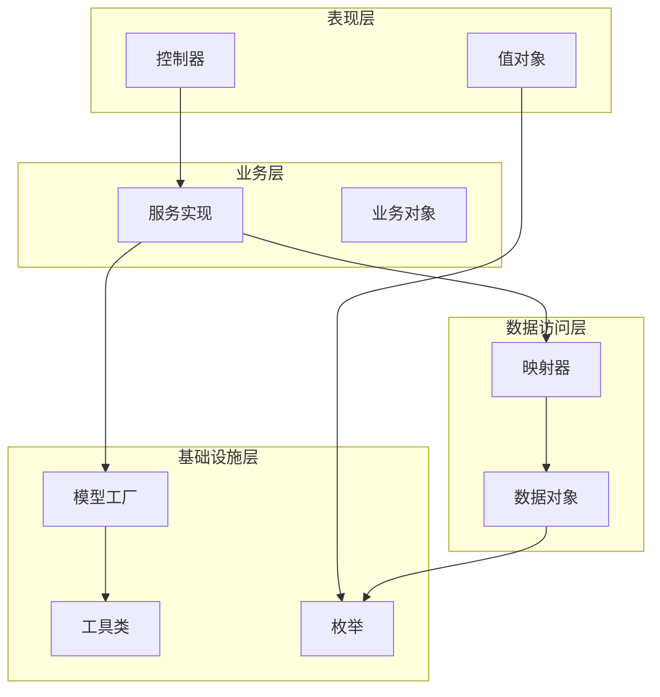

# Claude AI集成指南

<cite>
**本文档引用的文件**
- [AGENTS.md](file://AGENTS.md)
- [AiAutoConfiguration.java](file://src/main/java/cn/boss/data/ai/framework/ai/config/AiAutoConfiguration.java)
- [AiProperties.java](file://src/main/java/cn/boss/data/ai/framework/ai/config/AiProperties.java)
- [AiModelFactory.java](file://src/main/java/cn/boss/data/ai/framework/ai/core/model/AiModelFactory.java)
- [AiModelFactoryImpl.java](file://src/main/java/cn/boss/data/ai/framework/ai/core/model/AiModelFactoryImpl.java)
- [AiPlatformEnum.java](file://src/main/java/cn/boss/data/ai/enums/model/AiPlatformEnum.java)
- [application.yml](file://src/main/resources/application.yml)
- [AiModelServiceImpl.java](file://src/main/java/cn/boss/data/ai/service/model/AiModelServiceImpl.java)
- [AiUtils.java](file://src/main/java/cn/boss/data/ai/util/AiUtils.java)
- [AiWebSearchClient.java](file://src/main/java/cn/boss/data/ai/framework/ai/core/websearch/AiWebSearchClient.java)
- [AiBoChaWebSearchClient.java](file://src/main/java/cn/boss/data/ai/framework/ai/core/websearch/bocha/AiBoChaWebSearchClient.java)
</cite>

## 更新摘要
**所做更改**
- 删除了与 Claude 平台集成相关的所有内容和引用
- 移除了 CLAUDE.md 文档文件的引用
- 更新了项目架构说明，反映 Claude 平台的完全移除
- 调整了平台支持列表，移除 Claude 相关配置
- 更新了故障排除指南中的平台相关问题

## 目录
1. [简介](#简介)
2. [项目架构](#项目架构)
3. [核心组件](#核心组件)
4. [架构概览](#架构概览)
5. [详细组件分析](#详细组件分析)
6. [依赖关系分析](#依赖关系分析)
7. [性能考虑](#性能考虑)
8. [故障排除指南](#故障排除指南)
9. [结论](#结论)

## 简介

这是一个基于Spring Boot 3.5 + Spring AI 1.1构建的AI平台后端系统，支持多模型厂商集成，包括DeepSeek、OpenAI、Ollama等。该项目采用模块化设计，提供完整的AI对话、知识库管理和模型管理功能。

**章节来源**
- [AGENTS.md:5-7](file://AGENTS.md#L5-L7)

## 项目架构

### 技术栈

项目采用现代化的技术栈构建：

- **运行环境**: Java 17, Spring Boot 3.5.9, Maven
- **ORM框架**: MyBatis Plus 3.5.8 + dynamic-datasource
- **AI框架**: Spring AI 1.1.2 + 自定义多平台适配层
- **向量存储**: Qdrant / Milvus（手动创建，禁用自动配置）
- **缓存系统**: Redis + spring-boot-starter-cache
- **工具库**: Lombok, MapStruct 1.6, Hutool 5.8, Swagger/OpenAPI 3

### 模块化架构

**图表来源**
- [AGENTS.md:9-11](file://AGENTS.md#L9-L11)

### 核心模块

| 模块 | 路径 | 功能描述 |
|------|------|----------|
| chat | controller/chat, service/chat, dal/.../chat | AI对话（会话 + 消息） |
| knowledge | controller/knowledge, service/knowledge, dal/.../knowledge | 知识库（库 + 文档 + 分段 + 向量检索） |
| model | controller/model, service/model, dal/.../model | 模型管理（API Key、模型、角色、工具） |

**章节来源**
- [AGENTS.md:7-7](file://AGENTS.md#L7-L7)

## 核心组件

### AI模型工厂

AI模型工厂是整个系统的核心组件，负责统一管理不同AI平台的模型实例。

**图表来源**
- [AiModelFactory.java:1-63](file://src/main/java/cn/boss/data/ai/framework/ai/core/model/AiModelFactory.java#L1-L63)
- [AiModelFactoryImpl.java:1-324](file://src/main/java/cn/boss/data/ai/framework/ai/core/model/AiModelFactoryImpl.java#L1-L324)

### AI平台枚举

系统支持多个AI平台，通过枚举统一管理：

| 平台 | 平台标识 | 名称 |
|------|----------|------|
| TongYi | "TongYi" | 通义千问 |
| DeepSeek | "DeepSeek" | DeepSeek |
| OpenAI | "OpenAI" | OpenAI |
| Ollama | "Ollama" | Ollama |

**章节来源**
- [AiPlatformEnum.java:1-54](file://src/main/java/cn/boss/data/ai/enums/model/AiPlatformEnum.java#L1-L54)

## 架构概览

### 配置管理架构

**图表来源**
- [AiAutoConfiguration.java:1-70](file://src/main/java/cn/boss/data/ai/framework/ai/config/AiAutoConfiguration.java#L1-L70)
- [AiProperties.java:1-25](file://src/main/java/cn/boss/data/ai/framework/ai/config/AiProperties.java#L1-L25)
- [application.yml:79-139](file://src/main/resources/application.yml#L79-L139)

### 模型创建流程

**图表来源**
- [AiModelServiceImpl.java:109-116](file://src/main/java/cn/boss/data/ai/service/model/AiModelServiceImpl.java#L109-L116)
- [AiModelFactoryImpl.java:74-91](file://src/main/java/cn/boss/data/ai/framework/ai/core/model/AiModelFactoryImpl.java#L74-L91)

**章节来源**
- [AiAutoConfiguration.java:34-37](file://src/main/java/cn/boss/data/ai/framework/ai/config/AiAutoConfiguration.java#L34-L37)
- [AiModelFactoryImpl.java:71-145](file://src/main/java/cn/boss/data/ai/framework/ai/core/model/AiModelFactoryImpl.java#L71-L145)

## 详细组件分析

### AI配置管理

AI配置通过Spring Boot的配置属性机制实现，支持动态配置和运行时修改。

**图表来源**
- [AiProperties.java:1-25](file://src/main/java/cn/boss/data/ai/framework/ai/config/AiProperties.java#L1-L25)
- [AiAutoConfiguration.java:1-70](file://src/main/java/cn/boss/data/ai/framework/ai/config/AiAutoConfiguration.java#L1-L70)

### 网络搜索功能

系统集成了博查网络搜索功能，支持AI助手的在线信息检索能力。

**图表来源**
- [AiWebSearchClient.java:1-17](file://src/main/java/cn/boss/data/ai/framework/ai/core/websearch/AiWebSearchClient.java#L1-L17)
- [AiBoChaWebSearchClient.java:54-86](file://src/main/java/cn/boss/data/ai/framework/ai/core/websearch/bocha/AiBoChaWebSearchClient.java#L54-L86)

### AI工具函数

AiUtils提供了跨平台的AI工具函数，统一处理不同AI平台的消息格式和选项配置。

**图表来源**
- [AiUtils.java:23-49](file://src/main/java/cn/boss/data/ai/util/AiUtils.java#L23-L49)

**章节来源**
- [AiUtils.java:1-52](file://src/main/java/cn/boss/data/ai/util/AiUtils.java#L1-L52)

## 依赖关系分析

### 外部依赖关系

**图表来源**
- [AiModelFactoryImpl.java:11-53](file://src/main/java/cn/boss/data/ai/framework/ai/core/model/AiModelFactoryImpl.java#L11-L53)

### 内部组件依赖

系统内部组件遵循清晰的依赖层次结构：

**图表来源**
- [AGENTS.md:7-7](file://AGENTS.md#L7-L7)

**章节来源**
- [AGENTS.md:7-7](file://AGENTS.md#L7-L7)

## 性能考虑

### 缓存策略

系统实现了多层次的缓存机制来提升性能：

1. **模型实例缓存**: 使用Hutool的Singleton实现，避免重复创建AI模型实例
2. **向量存储持久化**: SimpleVectorStore每分钟自动保存到文件系统
3. **连接池优化**: Redis使用JedisPooled连接池管理

### 性能优化建议

1. **合理配置向量存储**: 根据数据量选择合适的向量存储方案
2. **监控指标收集**: 利用Micrometer收集AI模型调用性能指标
3. **批量处理**: 使用BatchingStrategy优化嵌入模型的批量处理

## 故障排除指南

### 常见问题及解决方案

| 问题类型 | 症状 | 可能原因 | 解决方案 |
|----------|------|----------|----------|
| 模型加载失败 | IllegalArgumentException: 未知平台 | 平台配置错误 | 检查AiPlatformEnum配置 |
| API密钥无效 | 认证失败 | 密钥过期或格式错误 | 更新API密钥配置 |
| 向量存储连接失败 | 连接超时 | 服务不可达 | 检查向量存储服务状态 |
| 缓存异常 | 序列化失败 | 缓存数据损坏 | 清理缓存文件 |

### 调试建议

1. **启用详细日志**: 在application.yml中调整日志级别
2. **监控AI调用**: 使用ObservationRegistry收集调用指标
3. **检查配置**: 确认所有必需的配置项都已正确设置

**章节来源**
- [AiModelFactoryImpl.java:87-89](file://src/main/java/cn/boss/data/ai/framework/ai/core/model/AiModelFactoryImpl.java#L87-L89)
- [application.yml:58-62](file://src/main/resources/application.yml#L58-L62)

## 结论

本项目提供了一个完整且可扩展的AI平台后端解决方案，具有以下特点：

1. **模块化设计**: 清晰的分层架构和模块划分
2. **多平台支持**: 统一的适配层支持多个AI平台
3. **高性能**: 多层次缓存和优化的资源管理
4. **易扩展**: 插件化的架构便于添加新的AI平台
5. **生产就绪**: 完善的配置管理和监控机制

该系统为构建企业级AI应用提供了坚实的基础，开发者可以根据具体需求进行定制和扩展。

**更新说明**: 本指南已更新以反映 Claude 平台集成的完全移除。项目现已专注于 DeepSeek、OpenAI 和 Ollama 等平台的支持，并移除了所有与 Claude 相关的配置和代码引用。