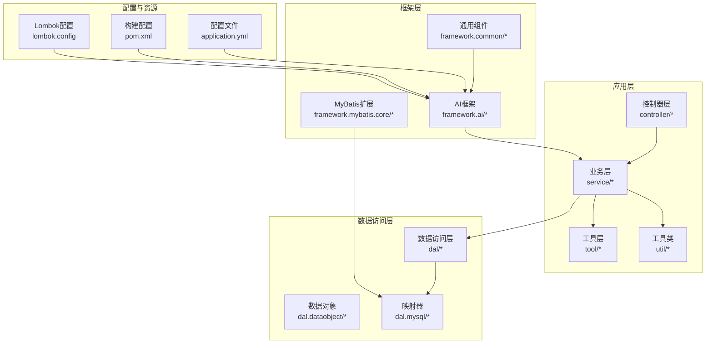
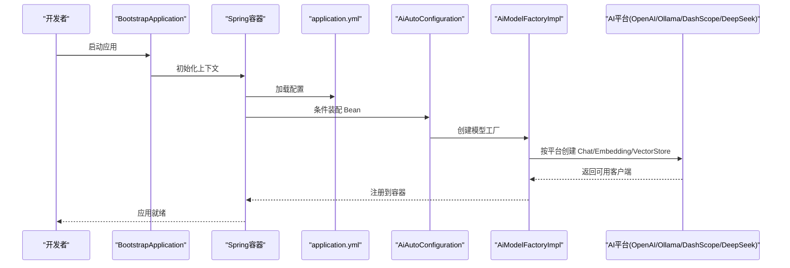
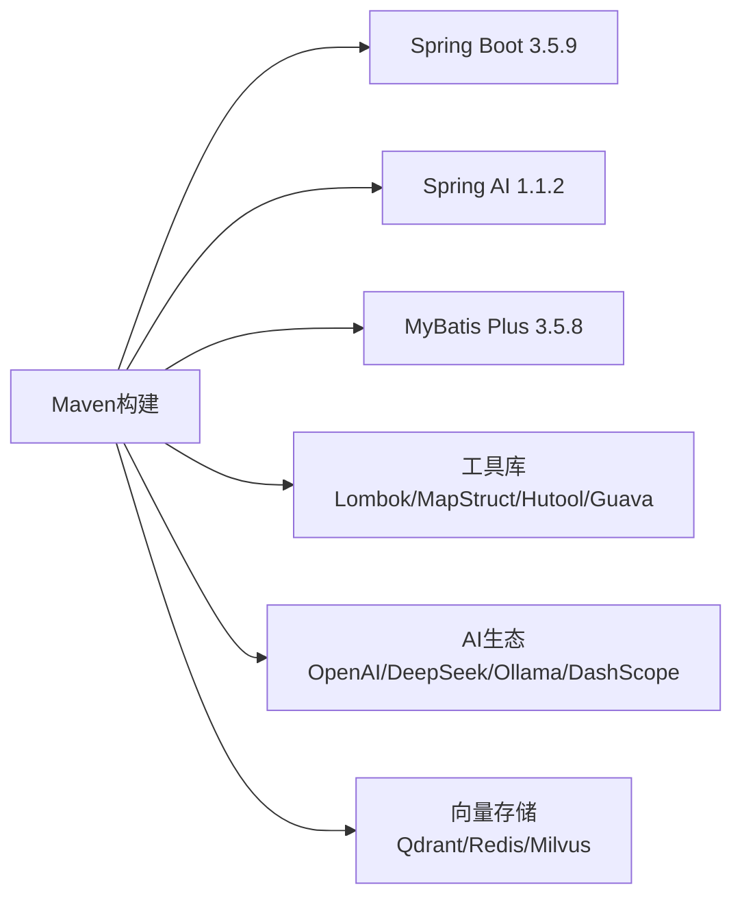
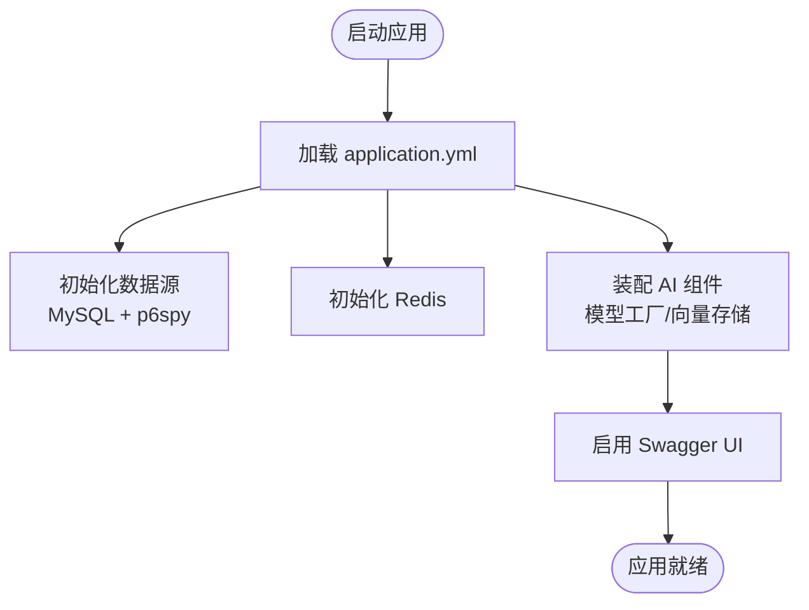
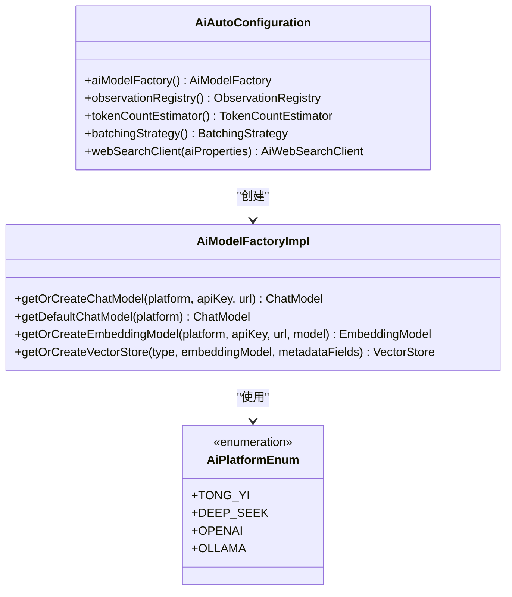
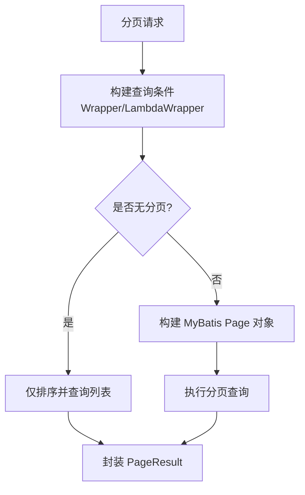
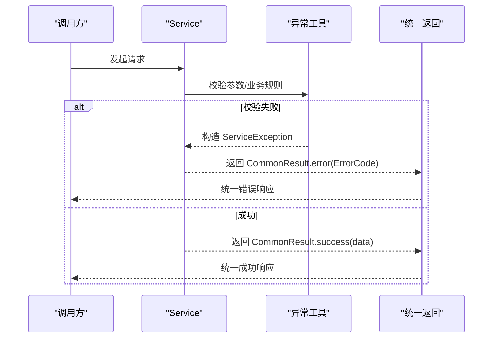
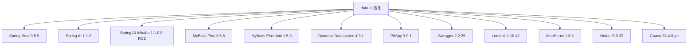

# 开发工具与环境配置

<cite>
**本文档引用的文件**
- [pom.xml](file://pom.xml)
- [application.yml](file://src/main/resources/application.yml)
- [lombok.config](file://lombok.config)
- [setup-shared-rules.sh](file://setup-shared-rules.sh)
- [AGENTS.md](file://AGENTS.md)
- [BootstrapApplication.java](file://src/main/java/cn/boss/data/ai/BootstrapApplication.java)
- [spy.properties](file://src/main/resources/spy.properties)
- [AiAutoConfiguration.java](file://src/main/java/cn/boss/data/ai/framework/ai/config/AiAutoConfiguration.java)
- [AiProperties.java](file://src/main/java/cn/boss/data/ai/framework/ai/config/AiProperties.java)
- [AiPlatformEnum.java](file://src/main/java/cn/boss/data/ai/enums/model/AiPlatformEnum.java)
- [ErrorCodeConstants.java](file://src/main/java/cn/boss/data/ai/enums/ErrorCodeConstants.java)
- [ServiceExceptionUtil.java](file://src/main/java/cn/boss/data/ai/framework/common/exception/util/ServiceExceptionUtil.java)
- [CommonResult.java](file://src/main/java/cn/boss/data/ai/framework/common/pojo/CommonResult.java)
- [BaseMapperX.java](file://src/main/java/cn/boss/data/ai/framework/mybatis/core/mapper/BaseMapperX.java)
- [AiModelFactoryImpl.java](file://src/main/java/cn/boss/data/ai/framework/ai/core/model/AiModelFactoryImpl.java)
</cite>

## 目录
1. [简介](#简介)
2. [项目结构](#项目结构)
3. [核心组件](#核心组件)
4. [架构总览](#架构总览)
5. [详细组件分析](#详细组件分析)
6. [依赖分析](#依赖分析)
7. [性能考虑](#性能考虑)
8. [故障排除指南](#故障排除指南)
9. [结论](#结论)
10. [附录](#附录)

## 简介
本项目是一个基于 Spring Boot 3 + Spring AI 的企业级 AI 应用后端服务，具备多模型聊天对话、知识库（RAG）向量检索、工具调用（Spring AI Function Calling + MCP Server/Client）等核心能力。本文档聚焦于开发工具与环境配置，帮助开发者快速搭建本地开发环境、理解项目依赖与配置，并掌握常见问题的排查方法。

## 项目结构
项目采用标准 Maven 多模块结构，主要包含以下层次：
- controller 层：HTTP 接入层，按 chat/knowledge/model 分域组织，子目录 vo/ 存放请求响应 VO
- service 层：业务逻辑层（接口 + Impl 分离）
- dal 层：数据访问层，包含 dataobject/（DO）与 mysql/（Mapper）
- framework 层：框架组件，包括 AI 核心、通用基础设施、MyBatis 扩展
- tool 层：工具函数与方法风格工具
- util 层：业务工具类（AiUtils、FileTypeUtils）

**图表来源**
- [BootstrapApplication.java:1-18](file://src/main/java/cn/boss/data/ai/BootstrapApplication.java#L1-L18)
- [application.yml:1-139](file://src/main/resources/application.yml#L1-L139)
- [pom.xml:1-344](file://pom.xml#L1-L344)

**章节来源**
- [AGENTS.md:65-85](file://AGENTS.md#L65-L85)
- [BootstrapApplication.java:1-18](file://src/main/java/cn/boss/data/ai/BootstrapApplication.java#L1-L18)

## 核心组件
本节介绍与开发环境密切相关的几个核心组件及其职责：

- 构建与依赖管理：通过 Maven 管理 Spring Boot 3.5.9、Spring AI 1.1.2、MyBatis Plus 3.5.8 等关键依赖，确保版本兼容性与可维护性
- 配置中心：application.yml 提供服务器端口、数据源、Redis、MyBatis Plus、日志、Swagger、AI 平台 API Key 等配置项
- AI 自动装配：AiAutoConfiguration 负责模型工厂、观察注册、Token 计数策略、Web 搜索客户端等 Bean 的装配
- 数据持久化：BaseMapperX 提供分页、联表查询、批量操作等通用能力，结合 MyBatis Plus Join 实现复杂查询
- 异常与结果封装：CommonResult 统一返回结构，ServiceExceptionUtil 提供错误码格式化与异常构造

**章节来源**
- [pom.xml:11-344](file://pom.xml#L11-L344)
- [application.yml:1-139](file://src/main/resources/application.yml#L1-L139)
- [AiAutoConfiguration.java:1-70](file://src/main/java/cn/boss/data/ai/framework/ai/config/AiAutoConfiguration.java#L1-L70)
- [BaseMapperX.java:1-179](file://src/main/java/cn/boss/data/ai/framework/mybatis/core/mapper/BaseMapperX.java#L1-L179)
- [CommonResult.java:1-85](file://src/main/java/cn/boss/data/ai/framework/common/pojo/CommonResult.java#L1-L85)

## 架构总览
下图展示了应用启动到 AI 模型工厂的装配流程，以及配置如何影响运行时行为：

**图表来源**
- [BootstrapApplication.java:1-18](file://src/main/java/cn/boss/data/ai/BootstrapApplication.java#L1-L18)
- [application.yml:79-139](file://src/main/resources/application.yml#L79-L139)
- [AiAutoConfiguration.java:26-69](file://src/main/java/cn/boss/data/ai/framework/ai/config/AiAutoConfiguration.java#L26-L69)
- [AiModelFactoryImpl.java:71-145](file://src/main/java/cn/boss/data/ai/framework/ai/core/model/AiModelFactoryImpl.java#L71-L145)

## 详细组件分析

### 构建与依赖管理（Maven）
- Java 版本：17，确保与 Spring Boot 3.5.9 和 Spring AI 1.1.2 兼容
- 核心依赖：Spring Boot Starter Web/WebFlux、MyBatis Plus、动态数据源、p6spy、Swagger、Lombok、MapStruct、Hutool、Guava
- AI 相关：Spring AI Starter（OpenAI、DeepSeek、Ollama）、Spring AI Alibaba（DashScope）、向量存储（Qdrant/Redis/Milvus）、MCP Server/Client
- 仓库镜像：华为云、阿里云、Spring Milestones/Snapshots，提升依赖拉取稳定性

**图表来源**
- [pom.xml:48-255](file://pom.xml#L48-L255)

**章节来源**
- [pom.xml:11-344](file://pom.xml#L11-L344)
- [AGENTS.md:35-56](file://AGENTS.md#L35-L56)

### 配置文件与运行环境
- 服务器端口：48090，Swagger UI 路径：/swagger-ui.html
- 数据源：MySQL 主库（master），默认账号 root/123456，支持动态数据源与 p6spy SQL 输出
- Redis：本地 127.0.0.1:6379，数据库 0
- AI 平台：OpenAI、Ollama、DashScope、DeepSeek，均支持通过 application.yml 配置 API Key 与基础地址
- 向量存储：Redis/Qdrant/Milvus 三选一，通过 spring.autoconfigure.exclude 禁用自动装配，按需启用
- 日志级别：项目包 cn.boss.data.ai 设置为 DEBUG，Spring AI 为 INFO

**图表来源**
- [application.yml:1-139](file://src/main/resources/application.yml#L1-L139)

**章节来源**
- [application.yml:1-139](file://src/main/resources/application.yml#L1-L139)
- [AGENTS.md:57-64](file://AGENTS.md#L57-L64)

### AI 自动装配与模型工厂
- AiAutoConfiguration 负责：
  - 模型工厂 Bean（AiModelFactoryImpl）
  - 观察注册（ObservationRegistry）
  - Token 计数策略与批处理策略
  - Web 搜索客户端（按 boss.ai.web-search.enable 开关）
- AiModelFactoryImpl 支持：
  - ChatModel：OpenAI、Ollama、DashScope、DeepSeek
  - EmbeddingModel：OpenAI、Ollama、DashScope
  - VectorStore：Simple/Redis/Qdrant
  - 客户端缓存：基于平台、API Key、URL、模型等参数生成缓存键

**图表来源**
- [AiAutoConfiguration.java:26-69](file://src/main/java/cn/boss/data/ai/framework/ai/config/AiAutoConfiguration.java#L26-L69)
- [AiModelFactoryImpl.java:71-145](file://src/main/java/cn/boss/data/ai/framework/ai/core/model/AiModelFactoryImpl.java#L71-L145)
- [AiPlatformEnum.java:14-26](file://src/main/java/cn/boss/data/ai/enums/model/AiPlatformEnum.java#L14-L26)

**章节来源**
- [AiAutoConfiguration.java:1-70](file://src/main/java/cn/boss/data/ai/framework/ai/config/AiAutoConfiguration.java#L1-L70)
- [AiModelFactoryImpl.java:1-324](file://src/main/java/cn/boss/data/ai/framework/ai/core/model/AiModelFactoryImpl.java#L1-L324)
- [AiPlatformEnum.java:1-54](file://src/main/java/cn/boss/data/ai/enums/model/AiPlatformEnum.java#L1-L54)

### 数据持久化与分页查询
- BaseMapperX 提供：
  - 分页查询：selectPage 支持排序字段、Wrapper 条件
  - 联表分页：selectJoinPage 支持 MyBatis Plus Join
  - 批量操作：insertBatch/updateBatch
  - 常用查询：selectOne/selectList/selectCount
- MyBatis Plus Join 配置：table-alias = t，logic-del-type = on，全局启用副表逻辑删除

**图表来源**
- [BaseMapperX.java:25-68](file://src/main/java/cn/boss/data/ai/framework/mybatis/core/mapper/BaseMapperX.java#L25-L68)

**章节来源**
- [BaseMapperX.java:1-179](file://src/main/java/cn/boss/data/ai/framework/mybatis/core/mapper/BaseMapperX.java#L1-L179)
- [application.yml:50-56](file://src/main/resources/application.yml#L50-L56)

### 异常处理与统一返回
- CommonResult 提供统一的 code/msg/data 结构，支持 success/error/checkError/getCheckedData
- ServiceExceptionUtil 提供错误码格式化与异常构造，支持占位符参数
- ErrorCodeConstants 定义了 API Key、模型、聊天、知识库、工具等错误码

**图表来源**
- [CommonResult.java:14-84](file://src/main/java/cn/boss/data/ai/framework/common/pojo/CommonResult.java#L14-L84)
- [ServiceExceptionUtil.java:9-57](file://src/main/java/cn/boss/data/ai/framework/common/exception/util/ServiceExceptionUtil.java#L9-L57)
- [ErrorCodeConstants.java:10-50](file://src/main/java/cn/boss/data/ai/enums/ErrorCodeConstants.java#L10-L50)

**章节来源**
- [CommonResult.java:1-85](file://src/main/java/cn/boss/data/ai/framework/common/pojo/CommonResult.java#L1-L85)
- [ServiceExceptionUtil.java:1-57](file://src/main/java/cn/boss/data/ai/framework/common/exception/util/ServiceExceptionUtil.java#L1-L57)
- [ErrorCodeConstants.java:1-50](file://src/main/java/cn/boss/data/ai/enums/ErrorCodeConstants.java#L1-L50)

### 开发辅助与脚本
- setup-shared-rules.sh：将 .agents 目录下的 rules/skills 同步到 .codebuddy/.qoder/.trae 等工具目录，便于多 AI 工具协作
- Lombok 配置：启用链式调用、ToString/HashCode 调用父类、停止冒泡等，提升代码简洁性

**章节来源**
- [setup-shared-rules.sh:1-69](file://setup-shared-rules.sh#L1-L69)
- [lombok.config:1-5](file://lombok.config#L1-L5)

## 依赖分析
下图展示项目关键依赖之间的关系与版本约束：

**图表来源**
- [pom.xml:18-31](file://pom.xml#L18-L31)

**章节来源**
- [pom.xml:36-46](file://pom.xml#L36-L46)
- [pom.xml:48-255](file://pom.xml#L48-L255)

## 性能考虑
- SQL 性能分析：p6spy 已启用，慢 SQL 阈值 2 秒，可通过 spy.properties 调整过滤与输出方式
- 分页与联表：合理使用 BaseMapperX 的分页与联表查询，避免一次性加载大量数据
- 向量存储：根据场景选择 Redis/Qdrant/Milvus，注意索引命名与键前缀配置
- 流式响应：聊天接口返回 Flux，避免阻塞为 List，减少内存占用
- 观测与重试：模型工厂使用默认重试模板与观测注册，有助于监控与降噪

**章节来源**
- [spy.properties:1-29](file://src/main/resources/spy.properties#L1-L29)
- [application.yml:114-118](file://src/main/resources/application.yml#L114-L118)
- [AiModelFactoryImpl.java:66](file://src/main/java/cn/boss/data/ai/framework/ai/core/model/AiModelFactoryImpl.java#L66)

## 故障排除指南
- 启动失败（端口占用）：检查 server.port（默认 48090）是否被占用
- 数据库连接失败：确认 MySQL 地址、账号、密码与驱动类名配置正确
- Redis 连接失败：确认 host/port/database 配置与 Redis 服务状态
- AI 平台 API Key 无效：在 application.yml 中替换对应平台的 API Key
- Swagger UI 无法访问：确认 springdoc.api-docs.enabled 与路径配置
- SQL 输出异常：检查 spy.properties 中 filter/exclude 配置，必要时临时关闭过滤
- 向量存储初始化失败：确认对应向量库服务（Qdrant/Milvus/Redis）可用，且索引/集合名称正确

**章节来源**
- [application.yml:1-139](file://src/main/resources/application.yml#L1-L139)
- [spy.properties:14-29](file://src/main/resources/spy.properties#L14-L29)
- [AGENTS.md:57-64](file://AGENTS.md#L57-L64)

## 结论
本项目通过清晰的分层架构、完善的配置体系与丰富的 AI 生态集成，提供了稳定的企业级 AI 后端能力。开发者只需按照本文档完成环境准备与配置调整，即可快速启动并开展功能开发。建议在开发过程中充分利用统一异常处理、分页查询与向量存储配置，以获得更好的开发体验与运行性能。

## 附录
- 常用命令
  - 编译：mvn clean compile
  - 打包：mvn clean package -DskipTests
  - 开发运行：mvn spring-boot:run
  - 启动打包产物：java -jar target/data-ai-2026.04-SNAPSHOT.jar
- 默认端口：48090；Swagger UI：http://localhost:48090/swagger-ui.html
- Maven 仓库优先顺序：华为云 → 阿里云 → Spring Milestones → Spring Snapshots

**章节来源**
- [AGENTS.md:35-56](file://AGENTS.md#L35-L56)